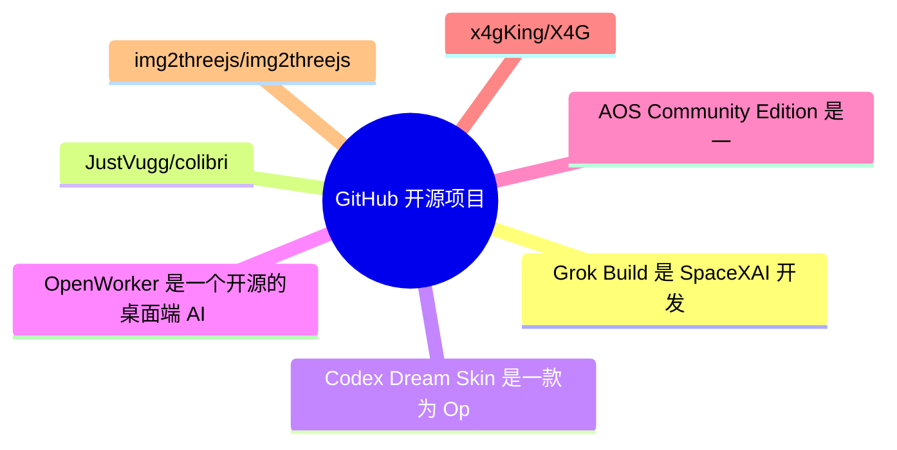
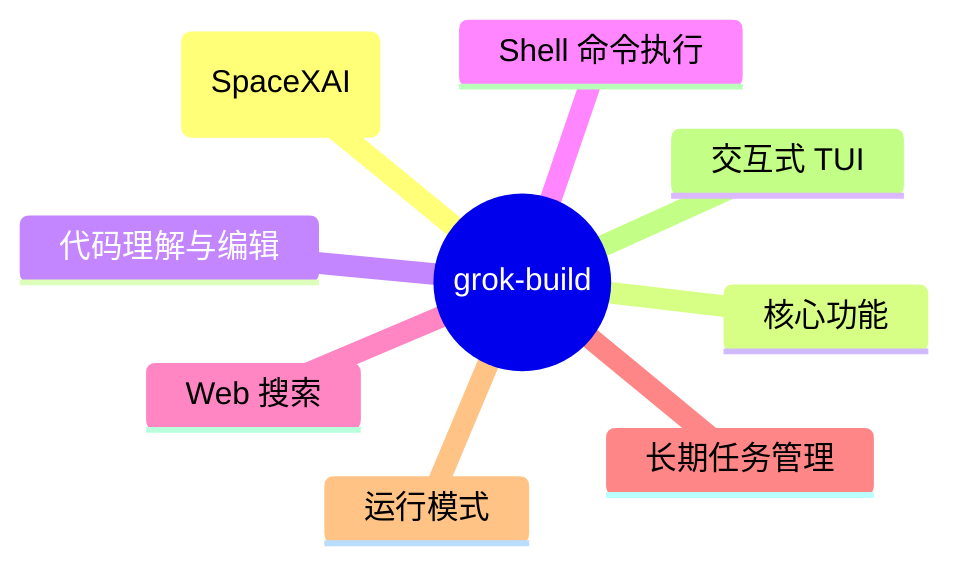
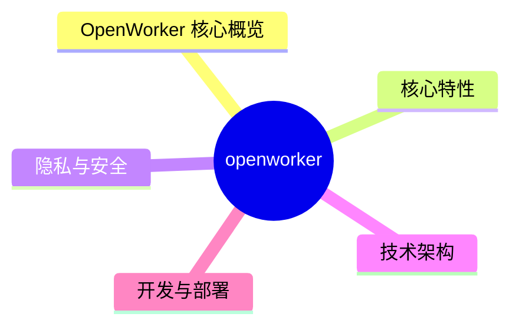
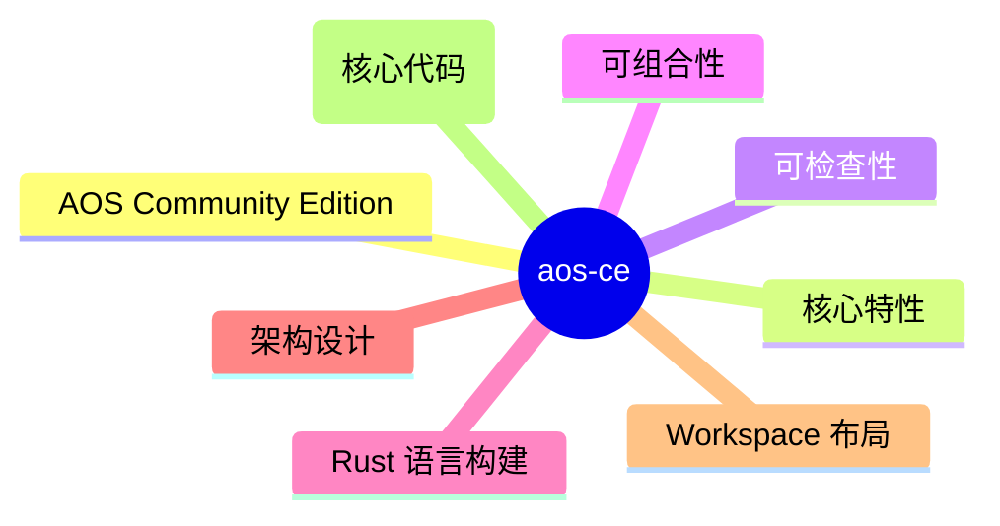

# GitHub 开源项目深度解析 (2026-07-27)

## 前面介绍

- 抓取来源：GitHub Trending / Search API
- 项目数量：15
- 深度解析数量：7
- 目标：自动筛出值得研究的开源项目，并给出结构、技术栈、运行方式和源码线索。

## 树状图



## 深度解析

### 1. grok-build
- **仓库**: [xai-org/grok-build](https://github.com/xai-org/grok-build)
- **语言**: Rust | **Star**: 22904 | **Fork**: 4317
- **更新**: 2026-07-27 | **License**: Apache-2.0

#### 前面介绍

- Grok Build 是 SpaceXAI 开发的基于终端的 AI 编程代理工具。它运行在一个全屏 TUI（终端用户界面）中，能够理解代码库、编辑文件、执行 Shell 命令、搜索网络并管理长期任务。它支持交互式模式、无头模式（用于脚本/CI）以及通过 Agent Client Protocol (ACP) 嵌入到编辑器中。该项目使用 Rust 编写，采用 Monorepo 架构，包含多个 Cargo crate。

#### 树状图



#### 文字描述

- 项目采用 Rust 编写的 Monorepo 架构，核心是 Cargo Workspace。
- 根目录 Cargo.toml 自动生成，建议直接修改子 crate 的配置。
- 主要模块分为 codegen 和 common 两大类。
- codegen 模块包含核心 CLI 逻辑和 TUI 实现。
- common 模块提供共享的底层库和工具。
- 构建系统依赖 DotSlash 来管理 hermetic 工具（如 protoc）。
- Agent 运行时通过 ACP 协议与外部通信。
- 支持 PTY（伪终端）控制以实现 Shell 交互。

#### 运行方式

- 安装 Rust 工具链（通过 rustup）。
- 安装 DotSlash 工具以管理二进制依赖。
- 确保 protoc 编译器可用（可通过 DotSlash 或 PATH）。
- 克隆仓库并运行 cargo run -p xai-grok-pager-bin 启动。
- 首次启动会自动打开浏览器进行身份验证。
- 官方预编译二进制支持 macOS、Linux 和 Windows。

#### 项目亮点

- 全屏交互式 TUI：提供类似 IDE 的沉浸式编程体验。
- 强大的代码库理解能力：深入分析项目结构。
- 多模式运行：支持交互、无头脚本和编辑器集成。
- Agent Client Protocol (ACP)：开放协议，支持嵌入。
- 模块化架构：清晰的 crate 分层，便于维护和扩展。
- Hermetic 构建：通过 DotSlash 确保构建环境的一致性。

#### 代码解析

- 项目根目录的 Cargo.toml 是自动生成的，仅作只读参考，实际配置在子 crate 中。
- `crates/codegen/ptyctl-cli` 是一个独立的 CLI 工具，用于控制 PTY 会话，支持运行命令、发送按键、截图、等待文本匹配等功能。
- `crates/codegen/xai-acp-lib` 实现了 Agent Client Protocol，负责消息通道、标准化和流处理。
- `crates/codegen/xai-agent-lifecycle` 管理代理的生命周期，包括会话和轮次的状态管理。
- `crates/codegen/xai-grok-pager` 是 TUI 的核心渲染层，处理滚动、提示和模态框。
- `crates/codegen/xai-grok-shell` 提供代理运行时和入口点（leader/stdio/headless）。
- `crates/codegen/xai-grok-tools` 实现具体的工具逻辑，如终端操作、文件编辑等。
- `crates/codegen/xai-grok-workspace` 负责文件系统、版本控制和执行环境的管理。

#### 源码

##### Cargo.toml

```toml
# Auto-generated workspace root. Prefer editing per-crate Cargo.toml files.

[patch.crates-io]
async-openai = { git = "https://github.com/our-forks/async-openai.git", rev = "95b52ebdedf42143083cf3d6f0e0be7c84e9c808" }

[workspace]
resolver = "2"
members = [
    "crates/build/xai-proto-build",
    "crates/codegen/ptyctl",
    "crates/codegen/ptyctl-cli",
    "crates/codegen/xai-acp-lib",
    "crates/codegen/xai-agent-lifecycle",
    "crates/codegen/xai-chat-state",
    "crates/codegen/xai-codebase-graph",
    "crates/codegen/xai-crash-handler",
    "crates/codegen/xai-fast-worktree",
    "crates/codegen/xai-file-utils",
    "crates/codegen/xai-fsnotify",
    "crates/codegen/xai-gix-status",
    "crates/codegen/xai-grok-agent",
    "crates/codegen/xai-grok-announcements",
    "crates/codegen/xai-grok-auth",
    "crates/codegen/xai-grok-config",
    "crates/codegen/xai-grok-config-types",
    "crates/codegen/xai-grok-env",
    "crates/codegen/xai-grok-hooks",
    "crates/codegen/xai-grok-http",
    "crates/codegen/xai-grok-markdown",
    "crates/codegen/xai-grok-markdown-core",
    "crates/codegen/xai-grok-mcp",
    "crates/codegen/xai-grok-memory",
    "crates/codegen/xai-grok-mermaid",
    "crates/codegen/xai-grok-models",
    "crates/codegen/xai-grok-pager",
    "crates/codegen/xai-grok-pager-bin",
    "crates/codegen/xai-grok-pager-minimal",
    "crates/codegen/xai-grok-pager-pty-harness",
    "crates/codegen/xai-grok-pager-render",
    "crates/codegen/xai-grok-paths",
    "crates/codegen/xai-grok-plugin-marketplace",
    "crates/codegen/xai-grok-sampler",
    "crates/codegen/xai-grok-sampling-types",
    "crates/codegen/xai-grok-sandbox",
    "crates/codegen/xai-grok-secrets",
    "crates/codegen/xai-grok-shared",
    "crates/codegen/xai-grok-shell",
    "crates/codegen/xai-grok-shell-base",
    "crates/codegen/xai-grok-shell-session-support",
    "crates/codegen/xai-grok-subagent-resolution",
    "crates/codegen/xai-grok-telemetry",
    "crates/codegen/xai-grok-test-support",
    "crates/codegen/xai-grok-tools",
    "crates/codegen/xai-grok-tools-api",
    "crates/codegen/xai-grok-update",
    "crates/codegen/xai-grok-version",
    "crates/codegen/xai-grok-voice",
    "crates/codegen/xai-grok-workspace",
    "crates/codegen/xai-grok-workspace-client",
    "crates/codegen/xai-grok-workspace-types",
    "crates/codegen/xai-hooks-plugins-types",
    "crates/codegen/xai-hunk-tracker",
    "crates/codegen/xai-mixpanel",
    "crates/codegen/xai-prompt-queue",
    "crates/codegen/xai-ratatui-inline",
    "crates/codegen/xai-ratatui-textarea",
    "crates/codegen/xai-sqlite-journal",
    "crates/codegen/xai-system-power",
    "crates/codegen/xai-token-estimation",
    "crates/codegen/xai-tracing-macros",
    "crates/codegen/xai-tty-utils",
    "crates/codegen/xai-workflow",
    "crates/common/xai-circuit-breaker",
    "crates/common/xai-computer-hub-core",
    "crates/common/xai-computer-hub-mcp-adapter",
    "crates/common/xai-computer-hub-sdk",
    "crates/common/xai-grok-compaction",
    "crates/common/xai-interjection-core",
    "crates/common/xai-test-utils",
    "crates/common/xai-tool-protocol",
    "crates/common/xai-tool-runtime",
    "crates/common/xai-tool-types",
    "crates/common/xai-tracing",
    "prod/mc/cli-chat-proxy-types",
    "third_party/dagre_rust",
    "third_party/graphlib_rust",
    "third_party/mermaid-to-svg",
    "third_party/ordered_hashmap",
]

[workspace.package]
edition = "2024"
license = "Apache-2.0"

[works
```

##### README.md

```md
<div align="center">

<h1>
  <picture>
    <source media="(prefers-color-scheme: dark)" srcset="https://media.x.ai/v1/website/spacexai-symbol-white-transparent-0c31957f.png">
    <source media="(prefers-color-scheme: light)" srcset="https://media.x.ai/v1/website/spacexai-symbol-black-transparent-6435cf42.png">
    
  </picture>
  <br>
  Grok Build (<code>grok</code>)
</h1>

**Grok Build** is SpaceXAI's terminal-based AI coding agent. It runs as a
full-screen TUI that understands your codebase, edits files, executes shell
commands, searches the web, and manages long-running tasks — interactively,
headlessly for scripting/CI, or embedded in editors via the Agent Client
Protocol (ACP).

[Installing the released binary](#installing-the-released-binary) ·
[Building from source](#building-from-source) ·
[Documentation](#documentation) ·
[Repository layout](#repository-layout) ·
[Development](#development) ·
[Contributing](#contributing) ·
[License](#license)


**Learn more about Grok Build at [x.ai/cli](https://x.ai/cli)**

This repository contains the Rust source for the `grok` CLI/TUI and its agent
runtime. It is synced periodically from the SpaceXAI monorepo.

A small `SOURCE_REV` file at the root records the full monorepo commit SHA
for the version of the code present in this tree.

</div>

---

## Installing the released binary

Prebuilt binaries are published for macOS, Linux, and Windows:

```sh
curl -fsSL https://x.ai/cli/install.sh | bash   # macOS / Linux / Git Bash
irm https://x.ai/cli/install.ps1 | iex          # Windows PowerShell
grok --version
```

See the [changelog](https://x.ai/build/changelog) for the latest fixes,
features, and improvements in each release.

## Building from source

Requirements:

- **Rust** — the toolchain is pinned by [`rust-toolchain.toml`](rust-toolchain.toml);
  `rustup` installs it automatically on first build.
- **[DotSlash](https://dotslash-cli.com)** — required so hermetic tools under
  [`bin/`](bin/) (notably [`bin/protoc`](bin/protoc)) can download and run.
  Install it and ensure `dotslash` is on your `PATH` **before** building:

  ```sh
  cargo install dotslash
  # or: prebuilt packages — https://dotslash-cli.com/docs/installation/
  /usr/bin/env dotslash --help   # sanity check
  ```

- **protoc** — proto codegen resolves [`bin/protoc`](bin/protoc) via DotSlash,
  or falls back to a `protoc` on `PATH` / `$PROTOC`.
- macOS and Linux are supported build hosts; Windows builds are best-effort
  and not currently tested from this tree.

```sh
cargo run -p xai-grok-pager-bin              # build + launch the TUI
cargo build -p xai-grok-pager-bin --release  # release binary: target/release/xai-grok-pager
cargo check -p xai-grok-pager-bin            # fast validation
```

The binary artifact is named `xai-grok-pager`; official installs ship it as
`grok`. On first launch it opens your browser to authenticate — see the
[authentication guide](crates/codegen/xai-grok-pager/docs/user-guide/02-authentication.md).

## Documentation

Full online documentation is available at
[docs.x.ai/build/overview](https://docs.x.ai/build/overview).

The user guide ships with the pager crate:
[`crates/codegen/xai-grok-pager/docs/user-guide/`](crates/codegen/xai-grok-pager/docs/user-guide/)
— getting started, keyboard sho
```

##### crates/build/xai-proto-build/Cargo.toml

```toml
[package]
license = "Apache-2.0"
description = "Build protobuf"
edition.workspace = true
name = "xai-proto-build"
version = "0.0.0"

[lints]
workspace = true

[dependencies]
anyhow = { workspace = true }
pbjson-build = { workspace = true }
prost-build = { workspace = true }
tempfile = { workspace = true }
tonic-prost-build = { workspace = true }

```

##### crates/codegen/ptyctl-cli/Cargo.toml

```toml
[package]
license = "Apache-2.0"
name = "ptyctl-cli"
version = "0.1.0"
edition.workspace = true
description = "CLI for ptyctl headless PTY controller"
publish = false

[[bin]]
name = "ptyctl"
path = "src/main.rs"

[dependencies]
ptyctl = { path = "../ptyctl" }
axum = { workspace = true }
clap = { workspace = true, features = ["derive"] }
reqwest = { workspace = true, features = ["json"] }
tokio = { workspace = true, features = ["full"] }
serde = { workspace = true, features = ["derive"] }
serde_json = { workspace = true }
anyhow = { workspace = true }
env_logger = { workspace = true }
chrono = { workspace = true, features = ["serde"] }
dirs = { workspace = true }

```

### 2. colibri
- **仓库**: [JustVugg/colibri](https://github.com/JustVugg/colibri)
- **语言**: C | **Star**: 19856 | **Fork**: 1996
- **更新**: 2026-07-27 | **License**: Apache-2.0

#### 源码

##### README.md

```md
<p align="center">
  
</p>

<p align="center">
  <a href="https://justvugg.github.io/colibri"></a>
  <a href="https://github.com/JustVugg/colibri/releases"></a>
</p>

<p align="center">
  <a href="https://justvugg.github.io/colibri"><b>Website</b></a> ·
  English · <a href="README.zh-CN.md">简体中文</a> · <a href="README.zh-TW.md">繁體中文</a> · <a href="README.it.md">Italiano</a>
</p>

**Tiny engine, immense model.** Run **GLM-5.2 (744B-parameter MoE)** on a consumer machine with ~25 GB of RAM — in pure C, with zero dependencies, by streaming experts from disk.

Colibrì is a lightweight, quality-preserving MoE runtime that treats VRAM, RAM,
and storage as one managed memory hierarchy. Insufficient fast memory may reduce
speed, but the default policy **never silently changes model precision or router
semantics**.

```
$ ./coli chat
  🐦 colibri v1.1.0 — GLM-5.2 · 744B MoE · int4 · streaming CPU
  ✓ ready in 32s · resident 9.9 GB
  › ciao!
  ◆ Ciao! 😊 Come posso aiutarti oggi?
```

## See it running

<p align="center">
  
</p>
<p align="center"><em>The web dashboard (<code>./coli web</code>): a 744B model at <strong>4 tok/s, TTFT 1.6 s, disk 0</strong> —
full expert residency on 6× RTX 5090, with live token metrics, the per-turn time breakdown,
the VRAM/RAM/disk tier bar and the live mini-brain in the corner.</em></p>

<p align="center">
  
</p>
<p align="center"><em>The <strong>Brain</strong> page: all 19,456 experts as a living cortex — colour is the storage tier,
brightness is routing heat, and every expert routed in a turn flashes white. Hovering shows the expert's
<a href="https://github.com/JustVugg/colibri/issues/175">measured topic affinity</a>.</em></p>

<p align="center">
  
</p>
<p align="center"><em>The <strong>Atlas</strong> page: the <a href="https://github.com/JustVugg/colibri/issues/175">measured expert atlas</a>
as a 3-D galaxy — 13,260 characterised experts, 1,041 replicated specialists clustering by topic
(poetry, law, Chinese, SQL…). Position is measured routing affinity, not a learned embedding. Drag to spin.</em></p>

## The vision

Frontier models should not be sealed inside datacenters. colibrì exists so that
**anyone curious enough can open one up**: run a 744B-parameter mind on hardware
you already own, watch every expert fire in real time, and change the code that
does it. Not renting intelligence behind an API — *holding* it: probing it,
measuring it, improving it. Every optimisation in this project started with
someone measuring something on their own machine; the engine is deliberately
small enough that the next one can come from you.

## The idea

A 744B Mixture-of-Experts model activates only ~40B parameters per token — and
only ~11 GB of those change from token to token (the routed experts):

<p align="center">
  <img src="docs/media/sparse.png" width="880" alt="only ~5.4% of parameters a
```

##### c/tools/README.md

```md
# Tools

These scripts support model preparation and offline engineering work. They are
not runtime dependencies of the C engine.

- `convert_fp8_to_int4.py`, `download_glm52.py`: model preparation
- `make_glm_oracle.py`, `make_glm_bench_model.py`: deterministic fixtures
- `benchmark_cuda_fixture.py`, `eval_glm.py`, `fetch_benchmarks.py`: benchmarks
- `gen_unicode.py`: tokenizer table generation

Run them from `c/`, for example:

```sh
python3 tools/convert_fp8_to_int4.py --selftest
python3 tools/make_glm_bench_model.py --output /tmp/colibri-bench
```

```

##### c/tools/expert_atlas/README.md

```md
# Expert Atlas — what does each of the 19,456 experts actually do?

Probe harness for #175. Runs a set of topic-tagged prompts, dumps each run's expert-routing
histogram, and turns them into a per-expert topic-affinity vector.

```bash
cd c
export COLI_MODEL=/path/to/glm52_i4
./tools/expert_atlas/sweep.sh                             # 30 probes (10 topics x 3 prompts)
python3 tools/expert_atlas/analyze.py  --stats atlas_out/stats --out atlas_out/experts.json \
        --web web/dist/experts.json                       # optional: feed the web dashboard Atlas
python3 tools/expert_atlas/validate.py atlas_out/stats 200 # leave-one-prompt-out check
```

`--web` writes the same atlas in the shape the web dashboard consumes (the Atlas galaxy and the
Brain hover tooltips): keyed `"layer:expert"` with `affinity`/`entropy`/`top`/`label`. It replaces
the retired `tools/expert_atlas.py`, whose API-driven probing ran through a live server and was
exposed to exactly the traps above (server-side `--topp`, speculative drafts, shared `.coli_usage`).

## Read this before you trust any atlas

Four things silently corrupt this measurement. The sweep script controls all of them; if you
roll your own, don't skip them.

| trap | effect | control |
|---|---|---|
| **`--topp`** | prunes experts by cumulative probability — measured: it hides **38% of the distinct experts** (7,587 → 4,687). It is also the *recommended speed setting*. | `TOPP=0` |
| **speculative drafts** | `eusage` is incremented inside `moe()`, *before* verification, so **rejected** drafts count. Those are experts routed for text the model never emitted. | `MTP=0 DRAFT=0` |
| **`.coli_usage`** | is loaded at startup and accumulates, so a naive `STATS` dump contains **all prior history**, not this run. | remove per run (script backs it up and restores) |
| **autocorrelation** | routing inside one run is highly correlated — the same context routes to the same experts token after token. An expert firing 38 times during one prompt is **one** observation, not 38. Chi-square/entropy on raw selections will certify single-prompt flukes as perfect specialists. | `analyze.py` requires the affinity to **replicate across a category's independent prompts** |

The CUDA expert tier is also not run-to-run deterministic, so the sweep uses `--gpu none`. Tier
config only decides *where weights live*, not what the router picks, so this costs nothing.

## Method

`analyze.py`:

1. `n[e][c]` — selections of expert *e* while running category *c*
2. `f[e][c] = n[e][c] / N[c]` — normalise by **category size** (prefill routes the prompt too, so a
   verbose category would otherwise look busier)
3. `p(c|e)` — renormalise into a topic distribution per expert, i.e. base-rate corrected. Ranking
   by raw count instead just rediscovers which experts are popular in general.
4. `spec(e) = 1 − H(p(c|e)) / log C` — 0 = generalist, 1 = fires for exactly one topic
5. **replication gate** — an expert is only a candidate specialist for *c* if it fires in ≥2 of *c*'s
   independent prompts

`validate.py` — leave-one-prompt-out. Build each category's top-K specialist set from its *other*
prompts, then check which set the held-out prompt's routing actually lands in. If specialisation
were an artifact of prompt wording, the held-out prompt would not prefer its own category.

## Result on GLM-5.2 744B int4 (Zen5, CPU routing path)

- **Leave-one-prompt-out: 29/30 = 96.7%** (chance 10%). Specialisation is a property of the topic,
  not of 
```

##### c/tools/requirements.txt

```txt
# Python dependencies for the colibri offline converter / oracle / download tools
# (c/tools/*.py and c/*.py). Minimum-version pins; for a fully reproducible env,
# freeze exact versions into your own lockfile with `pip freeze > locked.txt`.
torch>=2.4
safetensors>=0.4
huggingface-hub>=0.24
numpy>=1.26
tokenizers>=0.20
transformers>=5.11        # <5.11 applies split-half Llama RoPE and drifts vs the engine's interleaved MLA (issue #281)
datasets>=2.20
requests>=2.31

# Optional download-fallback backends (only needed for download_fp8.py's alt paths):
#   modelscope>=1.9
#   hf_transfer>=0.1

```

### 3. Codex-Dream-Skin
- **仓库**: [Fei-Away/Codex-Dream-Skin](https://github.com/Fei-Away/Codex-Dream-Skin)
- **语言**: JavaScript | **Star**: 12419 | **Fork**: 1252
- **更新**: 2026-07-27 | **License**: 未知

#### 前面介绍

- Codex Dream Skin 是一款为 OpenAI Codex 桌面端应用提供外部主题注入与换肤功能的工具。它通过本地 CDP（Chrome DevTools Protocol）注入技术，在不修改官方安装包（.app、app.asar 或 WindowsApps）的前提下，为 Codex 添加自定义背景图、调色板和 Safe CSS 样式，实现“给 Codex 换一张会呼吸的脸”。项目支持 macOS 和 Windows 平台，拥有官方主题库 DreamSkin.cc 和在线 Studio。

#### 树状图


#### 文字描述

- 注入引擎
- 通过本地回环地址绑定 CDP 端口
- 验证 Codex 进程签名与 Team ID
- 仅注入预期的 app:// 渲染目标
- 主题管理器
- 解析 theme.json 与 manifest.json
- 校验背景图尺寸与格式
- 管理已保存主题与导入图片

#### 运行方式

- 前置准备
- 安装并退出一次官方 Codex 应用
- 确保 Codex 配置文件存在
- macOS 安装步骤
- 下载 CodexDreamSkin-vX.Y.Z.dmg
- 拖拽至 Applications 文件夹

#### 项目亮点

- 非官方产品
- 不修改 .app 或 app.asar 文件
- 保留原生侧栏与输入框交互
- 支持路由感知的透明度效果
- 一键换肤安全边界
- 仅通过 dreamskin:// 协议唤起

#### 代码解析

- macos/README.md
- 描述 Studio 的运行机制与安全边界
- 说明本地 CDP 注入不修改签名文件
- 列出安装路径与状态存储位置
- macos/package.json
- 定义项目名称与 Node.js 版本要求
- 配置测试与诊断脚本
- macos/presets/README.md

#### 源码

##### README.md

```md
# Codex Dream Skin

<p align="center">
  <strong>中文</strong> · <a href="./README.en.md">English</a>
</p>

<p align="center">
  <strong>给 Codex 桌面端换一张会呼吸的脸。</strong><br>
  外部主题 / 换肤工具 · 本机 CDP 注入 · 不改官方安装包
</p>

<p align="center">
  一张图，一种心情 · 写代码，也要有氛围感
</p>

<p align="center">
  官方主题库：<a href="https://dreamskin.cc"><strong>DreamSkin.cc</strong></a> ·
  <a href="https://dreamskin.cc/gallery">主题库 Gallery</a> ·
  <a href="https://dreamskin.cc/studio">在线 Studio</a>
</p>

<p align="center">
  非 OpenAI 官方产品。不修改 <code>.app</code> / <code>app.asar</code> / WindowsApps。
</p>

## 🤝 独家赞助

<table>
<tr>
<td width="180">
<a href="https://passion8.cc/sign-up?aff=ZgLT"></a>
</td>
<td>
感谢 Passion8 独家赞助本项目！Passion8 是一家面向开发者的 AI API 中转服务商，为个人开发者与团队提供稳定、低成本的主流大模型接入。<br><br>
<strong>满血 AI · 触手可及</strong>：OpenAI、Claude 全系列原版模型，无降智、无套壳；使用前沿 AI 模型仅需官方价格的一小部分，充值 1:1，<strong>1$ = 1¥</strong>。保留原有官方 SDK，只把 Base URL 换成 Passion8，Claude Code、Codex、Grok 以及任意 OpenAI 兼容客户端都能直接跑——一行配置，代码不用改。
<strong>全球节点加速</strong>：Cloudflare 全球边缘 + 多线路 BBR 加速，低延迟、高可用、稳定如一；7×24 稳定中转，99.9% SLA，首 Token 目标 1 秒内。
<strong>安全可靠</strong>：独立 API Key、密钥加密存储、全链路 HTTPS，隐私优先。<br><br>
Passion8 为本项目用户准备了专属福利：通过<a href="https://passion8.cc/sign-up?aff=ZgLT">此链接</a>注册，首次充值自动赠送 10% 额度，无需申请，30 分钟内到账。有问题联系 <a href="mailto:support@passion8.cc">support@passion8.cc</a>。
</td>
</tr>
</table>

<sub>换肤与 API 配置互相独立，本项目不会自动改写你的模型供应商设置。</sub>

## 直接安装

普通用户只需先安装并退出一次官方 Codex / ChatGPT，然后从
[GitHub Releases](https://github.com/Fei-Away/Codex-Dream-Skin/releases) 下载：

- macOS：打开 `CodexDreamSkin-vX.Y.Z.dmg`，把 App 拖进 Applications。
- Windows：双击 `CodexDreamSkin-Setup-vX.Y.Z.exe`，按安装向导完成。

不需要 clone 源码、安装 Node.js 或手动运行 `.sh` / `.ps1`。首次未签名放行、更新和卸载步骤见
[macOS 安装说明](./docs/install-macos.md) / [Windows 安装说明](./docs/install-windows.md)。

## 主题库与社区

<p align="center">
  <a href="https://dreamskin.cc">
    
  </a>
</p>

<p align="center">
  <strong>DreamSkin.cc</strong> · 本项目的官方主题库与创作平台<br>
  <sub>Make your workspace <em>yours.</em></sub>
</p>

<p align="center">
  <a href="https://dreamskin.cc/gallery"><strong>浏览主题库 →</strong></a>
  &nbsp;·&nbsp;
  <a href="https://dreamskin.cc/studio"><strong>在线 Studio →</strong></a>
</p>

- [**主题库 Gallery**](https://dreamskin.cc/gallery)：浏览社区已审核的主题，支持最新 / 热门排序和创作者榜单。
  每套主题都能先在网页里的桌面模拟器中试穿，再决定装不装。

<p align="center">
  <a href="https://dreamskin.cc/gallery">
    
  </a><br>
  <sub>社区主题「晨雾山水」的在线试穿 · 首页/任务页、宽窄窗口、侧栏展开收起都能当场切，满意了再一键换肤或下载主题包</sub>
</p>

- [**在线 Studio**](https://dreamskin.cc/studio)：在浏览器里换背景图、调主题色、写 Safe CSS，导出 `.zip` 主题包，
  也可以直接投稿到主题库（需登录，经人工审核后公开）。

<p align="center">
  <a href="https://dreamskin.cc/studio">
    
  </a><br>
  <sub>在线 Studio · 左侧实时预览，右侧调背景图、外观焦点与配色；主题库里任意一套主题都能一键载入继续改</sub>
</p>

macOS 菜单栏和 Windows 托盘都有「主题库 Gallery」和「在线 Studio」入口，可以直接打开。

### 一键换肤

在 DreamSkin.cc 上看到喜欢的主题，点「一键换肤」就能让本机客户端直接装上，不用先下载再手动导入。
需要 v1.5.0 或更新的客户端（建议 v1.5.5 及以上）。

流程与安全边界：

- 网页通过 `dreamskin://apply?version=ver_...` 唤起本机 App。链接只能携带一个主题版本 ID，**不能**携带
  任意 URL、文件路径或命令，也不存在静默应用参数。
- App 只向固定的官方 API 取包，并拒绝重定向。
- 换肤前弹出原生确认框，并核对该版本的审核状态、一键兼容标记、版本号、包大小、实际下载字节数和 SHA-256。
- 通过后复用与手动导入完全相同的 ZIP、manifest、图片与 Safe CSS 校验。
- 只有真实渲染进程确认新主题已生效才算成功。启动或渲染失败会自动尝试恢复换肤前的主题，恢
```

##### macos/README.md

```md
# Codex Dream Skin Studio

Unofficial macOS theme studio for the **official Codex Desktop** app.

Turn an image you like into one continuous full-window Codex theme. The same wallpaper runs beneath the native sidebar and main surface, while route-aware translucency keeps home, task, plugin, scheduled-task, and pull-request controls fully interactive and readable.

This project injects through **local loopback CDP**. It does **not** modify the official `.app`, `app.asar`, or code signature.

> Not affiliated with OpenAI. Codex is a trademark of its respective owners.

## Requirements

- macOS 13 Ventura or newer (the native DMG app declares macOS 13 as its minimum)
- Official Codex Desktop installed and launched at least once (`~/.codex/config.toml` exists)
- No global Node.js install required (uses Codex’s signed bundled Node after validation)

## Release install (recommended)

普通用户请从 [GitHub Releases](https://github.com/Fei-Away/Codex-Dream-Skin/releases) 下载
`CodexDreamSkin-vX.Y.Z.dmg`，按 [`docs/install-macos.md`](../docs/install-macos.md) 的图形界面步骤
拖入 Applications。首次运行可能需要在“系统设置 → 隐私与安全性 → 仍要打开”确认一次；不需要
运行 `xattr` 或安装源码。后续更新下载新的 DMG 覆盖安装即可，用户主题和图片会保留。

## Advanced: run from source

The Release DMG above is the normal user path. The commands below are for
contributors, diagnostics, and legacy deployments.

```bash
# 1) Optional checks (needs the installed Codex/ChatGPT.app bundled Node)
./tests/run-tests.sh

# 2) Install to the stable path and create Desktop launchers
./scripts/install-dream-skin-macos.sh --no-launch

# 3) Switch to the tested featured preset, or import your own pure background
~/.codex/codex-dream-skin-studio/scripts/switch-theme-macos.sh --id preset-arina-hashimoto
# ~/.codex/codex-dream-skin-studio/scripts/customize-theme-macos.sh

# 4) Start/re-apply, verify, or restore via Desktop:
#    Codex Dream Skin.command
#    Codex Dream Skin - Customize.command
#    Codex Dream Skin - Verify.command
#    Codex Dream Skin - Restore.command

# 5) Legacy only: install the old SwiftBar menu (do not enable it beside the native app)
./Install\ Menu\ Bar.command
# Look for 🎨 Skin in the top-right menu bar
```

Install location after step 2:

| Item | Path |
| --- | --- |
| Engine | `~/.codex/codex-dream-skin-studio` |
| State / logs / user images | `~/Library/Application Support/CodexDreamSkinStudio` |
| Theme backup | under Application Support (`theme-backup.json`) |

## Legacy standalone ZIP (maintainer/offline packaging only)

To build the “double-click install” folder layout for non-git users:

```bash
./scripts/build-client-release.sh "$HOME/Desktop/Codex 主题编辑器.zip"
```

That ZIP contains a visible installer plus a hidden `.codex-dream-skin-studio`
engine and is staged as a rights-clean package with only the redistributable
Gothic Void Crusade preset. It is retained for existing offline workflows;
prefer the DMG for ordinary users, and do not share a source checkout or an
archive containing the excluded Arina reference files. Do not ship only
CSS/images.

## How it works (security boundary)

1. Discover `com.openai.codex` and validate signature / Team ID / arch / bundled Node.
2. Start Codex via user `launchd` with CDP bound to `127.0.0.1` only.
3. Accept the debug port only when it belongs to Codex (or a legitimate child).
4. Inject only into expected `app://` renderer targets.
5. Resolve the selected theme and image to real paths, then enforce 10 MB,
   `16384px`-per-side, and 50-megapixel limits before injection.
6. Keep a s
```

##### macos/package.json

```json
{
  "name": "codex-dream-skin-studio",
  "version": "1.5.6",
  "private": true,
  "type": "module",
  "scripts": {
    "test": "./tests/run-tests.sh",
    "doctor": "./scripts/doctor-macos.sh"
  },
  "engines": {
    "node": ">=20"
  }
}

```

##### macos/presets/README.md

```md
# 预设主题 · Preset packs

这个目录放 **Codex Dream Skin 的内置预设主题**。安装时 `install-dream-skin-macos.sh` 会把每个 `preset-*/` 幂等地播种到用户主题库 `~/Library/Application Support/CodexDreamSkinStudio/themes/`，装完即可在**菜单栏「已保存的主题」**或 `switch-theme-macos.sh --id <id>` 里直接切换。

> This folder holds the bundled preset themes. Install seeds each `preset-*/` into the user theme library, so a fresh install ships with ready-to-use skins.

## 内置实测预设

当前内置 `preset-gothic-void-crusade/`（Gothic Void Crusade）与
`preset-arina-hashimoto/`（桥本有菜 / Arina Hashimoto）两套实机验证主题。
前者是社区作者提供的原创哥特科幻背景；后者使用一张
`2560 × 1440`（16:9）纯背景：左侧低信息留白承载 Codex 原生标题，人物和花卉主视觉集中在右侧。浅色与暗色截图均来自真实 Codex 注入，不是 AI 绘制的整窗 UI。

来源尺寸必须如实区分：归档的用户源图（不随 preset 播种）是 `1672 × 941` PNG；preset 内的 `background.jpg` 保持其近 16:9 构图，标准化导出为 `2560 × 1440` JPEG，并不代表补回或新增了源图细节。派生文件使用 `sips -z 1440 2560 -s format jpeg -s formatOptions 90` 生成。

- 可导入/可播种的主题素材只有 [`background.jpg`](./preset-arina-hashimoto/background.jpg) 与 [`theme.json`](./preset-arina-hashimoto/theme.json)。
- 用户提供的 byte-identical 源 PNG 单独归档在 [`docs/images/presets/arina-hashimoto-source.png`](../../docs/images/presets/arina-hashimoto-source.png)，不放进 preset pack，因此不会被安装脚本播种为多余文件。
- 当前浅色、暗色实测文档截图均为 `2308 × 1572` Retina JPEG（CSS viewport `1154 × 786`），来自同一真实 Codex 首页；为保护未发送草稿，截图时仅用临时本地样式隐藏输入文字并收起编辑区，没有修改草稿内容或伪造皮肤效果。它们包含真实侧栏、项目工具栏和输入框，**只作预览，绝不能当背景导入**。
- 背景是用户提供的 AI 生成示例，不代表 OpenAI/Codex 官方视觉或背书；公开分发前仍需确认人物、模型输出与素材使用权。
- 该维护者提供的精选预设是单独记录的发行例外，不纳入 MIT 软件许可；文件清单和限制见 [`../NOTICE.md`](../NOTICE.md)。这不表示以后可以提交其他可识别真人素材。

安装后可直接切换：

```bash
~/.codex/codex-dream-skin-studio/scripts/switch-theme-macos.sh \
  --id preset-arina-hashimoto
```

## 一套预设的结构

```
preset-<slug>/
├── theme.json        # schemaVersion 1，与 assets/theme.json 同一格式
└── background.jpg    # 背景图（横向，JPEG）
```

- 目录名与 `theme.json` 的 `id` **必须**都是 `preset-<slug>` 形式（`slug` 用小写英文 + 连字符）。播种只管理 `preset-*`，绝不会碰用户自己「换一张图」保存的 `custom-*` 主题。
- `image` 字段只能是**本目录内**的文件名（不能是路径），格式 `png` / `jpg` / `jpeg` / `webp`，≤ 10 MB（建议 < 1 MB）。
- `appearance` **必须如实声明背景图成立的模式**（这是规范，不是可选项）：
  - `"auto"`——仅限浅色、暗色外壳下都协调的图，且两种模式都实测过。皮肤跟随 Codex 客户端的浅暗设置切换外壳。
  - `"dark"` / `"light"`——单模专属图（如深色大教堂、纯白极简）。皮肤外壳固定为该模式，不随客户端切换。
  - 暗色专属画作声明 `auto` 是缺陷不是偏好：客户端处于浅色时，Codex 原生组件（差异卡片、任务条等）按浅色渲染，会与暗图直接打架（#134 曾因此返修）。拿不准就按图的实际明暗写死，不要照抄模板默认值。
- 人物/场景背景优先提交 `2560 × 1440`（16:9）母版；主视觉放在右侧约 58%～88%，左侧约 50%～58% 保持低信息、低对比。禁止把效果截图、窗口 mockup 或任何带 UI 的图片命名为 `background.*`。

## theme.json 字段全解（投稿必读）

以 `preset-gothic-void-crusade/theme.json` 为参考模板。除标注「可选」外均建议如实填写；文案留空会退回内置默认值，不会报错但会显得敷衍。

### 文案字段（界面哪里能看到）

| 字段 | 显示位置 |
| --- | --- |
| `name` | 首页标题上方的主题名眉标（强调色小字） |
| `tagline` | 首页标题下方一行副标语 |
| `quote` | 首页右下角手写体口号（斜排，随强调色） |
| `brandSubtitle` / `statusText` | 皮肤 chrome 的品牌角标与状态文案（部分布局下隐藏） |
| `projectPrefix` / `projectLabel` | 「选择项目」按钮的前缀与占位文案 |
| `promoTitle` / `promoSub` / `promoUrl` | 分享/宣传场景使用，可选 |

### colors 调色板（键 → 界面用途）

所有键都会被注入为主题变量，整套皮肤 UI 跟着走：

| 键 | 用途 |
| --- | --- |
| `background` | 整窗兜底底色（背景图未盖住的区域、body 底） |
| `panel` / `panelAlt` | 半透明面板底：侧栏、卡片、composer、右侧工具面板的毛玻璃都从它调透明度 |
| `accent` / `accentAlt` | 强调色：建议卡圆圈与图标、主题名眉标、口号、状态点、聚焦描边 |
| `secondary` / `highlight` | 次强调/高亮（粒子、渐变、hover 等点缀） |
| `text` | 正文字色（标题、卡片文字都强制跟随） |
| `muted` | 次要文字与大多数描边（卡片/面板边框按它调透明度） |
| `line` | 分隔线与细描边 |

- 颜色必须与背景图协调：`accent` 建议直接从画面主体取色（Gothic 取的是烛金 `#c8a55a`）。
- 声明 `appearance: dark` 的主题请给暗底亮字；`light` 反之；`auto` 主题两种模式都要自查对比度。

### art 元数据

`art.focusX` / `art.focusY`（`0..1`，画面主体位置）、`art.safeArea`（`auto | left | right | center | none`，低信息留白侧）、`art.taskMode`（`auto | ambient |
```

### 4. openworker
- **仓库**: [andrewyng/openworker](https://github.com/andrewyng/openworker)
- **语言**: Python | **Star**: 7702 | **Fork**: 1029
- **更新**: 2026-07-27 | **License**: MIT

#### 前面介绍

- OpenWorker 是一个开源的桌面端 AI 助手，旨在作为用户的“数字同事”完成实际任务，而不仅仅是聊天。它运行在本地，支持多种大模型提供商（如 OpenAI、Anthropic、Ollama 等），并集成了 25+ 种工具和应用程序（如 GitHub、Slack、Jira、Notion 等）。它强调隐私优先，数据不出本地，且具备审批机制，确保在执行重要操作前获得用户确认。

#### 树状图



#### 文字描述

- 桌面应用层：基于 Tauri 的原生壳，提供 GUI 和本地服务入口
- 本地代理服务：Python 编写的核心引擎，负责任务分解、工具调用和状态管理
- 工具连接层：25+ 种集成工具（GitHub、Slack、Jira 等）及 MCP 协议支持
- 模型适配层：支持 OpenAI、Anthropic、Google、Ollama 等多种模型提供商
- 自动化调度器：支持定时任务和自动化工作流
- 文本界面 (TUI)：基于 Textual 的命令行交互界面
- 语音识别 (STT)：Rust 编写的离线语音转文字引擎

#### 运行方式

- 下载安装：提供 macOS (Apple Silicon) 和 Windows 10/11 的预编译安装包
- 配置模型：支持添加 API Key 或连接本地 Ollama 服务
- 运行源码：需要 Python 3.10+、Node 20+ 和 Rust 工具链
- 启动服务：使用 `openworker-server` 启动本地代理，使用 `npm run dev` 启动前端界面
- 权限管理：支持交互式审批和命令行快捷键审批

#### 项目亮点

- 本地优先：所有数据存储在本地，仅通过用户选择的模型和集成进行数据交互
- 多模型支持：不锁定特定模型，支持 OpenAI、Anthropic、Google、DeepSeek 等多种模型
- 任务导向：专注于交付“完成的工作”（如文档、报告、更新日历），而非仅仅生成文本
- 审批机制：在发送消息、修改日历或运行命令前，会请求用户批准
- 丰富的集成：支持 GitHub、Slack、Jira、Notion 等主流生产力工具
- MCP 协议支持：可通过 Model Context Protocol 插入自定义工具

#### 代码解析

- coworker/server/app.py：FastAPI 应用，提供 OpenAI 兼容的 API 端点和 WebSocket 会话管理，处理跨域和流量限制
- coworker/tui/app.py：基于 Textual 的文本界面，渲染引擎事件流，提供审批模态框和命令行交互
- pyproject.toml：定义项目依赖，包括 openai、anthropic、google-genai、textual、fastapi、aisuite、mcp 等，支持可选的 messaging 和 browser 依赖
- stt/Cargo.toml：Rust 语音识别模块配置，依赖 whisper-rs、cpal、ureq 等库，用于离线语音转文字

#### 源码

##### README.md

```md
# OpenWorker

**[openworker.com](https://openworker.com)** · [Download](#download) · [Issues](https://github.com/andrewyng/openworker/issues)

> **Beta** - OpenWorker is in open beta: fully usable, updates itself, and we're actively polishing rough edges. [Issues](https://github.com/andrewyng/openworker/issues) welcome.

**AI that gets your everyday tasks done.** OpenWorker is an open-source AI coworker that lives on your desktop and delivers **finished work**, not just chat: a polished document, a Slack reply with the numbers, an updated calendar, a triaged inbox.

It runs on your machine and doesn't lock you into any model: bring your own API key for OpenAI, Anthropic, Google, or an open-weight provider, or run fully local with Ollama. Your data leaves your machine only through the model and integrations *you* choose.

[](https://openworker.com)

## Download

[**⬇ macOS (Apple Silicon)**](https://download.openworker.com/mac)
<sub>macOS 12+ · signed & notarized · auto-updates</sub>

[**⬇ Windows 10/11 (x64)**](https://download.openworker.com/windows)
<sub>builds are not yet code-signed, so SmartScreen will warn; signing is in progress</sub>

Open the app, add a model key (or point it at Ollama), and ask for something real.

## How it works

1. Tell OpenWorker the outcome you want - "prepare a customer brief," "untangle my calendar," "draft a report," "check where the release stands across Jira and GitHub."
2. It breaks the task into steps and works across your desktop, files, and connected apps.
3. Before anything consequential - sending a message, changing a calendar, running a command - it checks in and you approve or redirect.
4. You get the finished deliverable, not a to-do list.

Under the hood:

```text
┌────────────────────────────────────────────────┐
│              OpenWorker desktop app            │  native shell + GUI
├────────────────────────────────────────────────┤
│           local agent server (Python)          │  engine · tools · connectors - built on aisuite
├───────────────┬────────────────┬───────────────┤
│  your files   │   your tools   │  your model   │  everything runs with your keys,
│  & terminal   │ 25+ connectors │  any provider │  on your machine
└───────────────┴────────────────┴───────────────┘
```

## What it can do

- **Produce real deliverables** - documents, spreadsheets, reports, and web pages land as files you can open and share.
- **Work from Slack** - mention `@OpenWorker` in a channel; a session opens on your desktop, the work happens with your tools, and the answer comes back as a thread reply.
- **Use your everyday tools** - 25+ integrations including GitHub, Slack, Jira, Notion, Linear, HubSpot, Outlook, monday.com, Gmail, and Google Calendar, plus your **terminal and local files**. Any tool reachable over [MCP](https://modelcontextprotocol.io/) plugs in too, with per-tool control.
- **Run on a schedule** - automations for recurring work: a morning brief, a weekly report, a standing watch over a channel. Runs land in the app with full transcripts.
- **Ask before acting** - writes, sends, and shell commands are approval-gated. Unattended runs park their asks in an inbox instead of acting on their own.

## Bring your own model

Model access is yours: pick a provider, paste your key, switch anytime. Supported out of the box:

**OpenAI · Anthropic · Google Gemini · Inkling (Thinking Machines) · GLM (Z.ai) · DeepSeek · Kimi (Moonshot) · Qwen · Mi
```

##### coworker/server/app.py

```py
"""FastAPI app — OpenAI-compatible endpoint + WS session API + REST.

The control plane every surface (GUI/IDE/messaging) rides on. The WS carries the engine
event stream and the approval channel; `/v1/chat/completions` is the OpenAI-compatible
proxy so any OpenAI-format client can use the runtime as a backend.
"""

from __future__ import annotations

import asyncio
import json
import os
import re
import secrets
import uuid
from collections import deque
from contextlib import asynccontextmanager
from pathlib import Path
from typing import Any, Optional

from fastapi import FastAPI, Request, WebSocket, WebSocketDisconnect
from fastapi.middleware.cors import CORSMiddleware
from fastapi.responses import JSONResponse

# Origins allowed to talk to the local sidecar. It binds to 127.0.0.1, but a page in the
# user's own browser can still reach loopback — so without an origin gate, any website they
# visit could read `GET /v1/sessions` (CORS was `*`) and drive a session over the WS (which
# CORS never covers) into shell/file tools. We pin to the desktop webview's own origins
# (`tauri://localhost`, Windows' `http(s)://tauri.localhost`) and localhost dev/browser
# builds. Requests with NO Origin header (curl, native clients, tests, server-to-server) are
# allowed — the gate targets browsers, which always attach an unforgeable Origin.
_ALLOWED_ORIGIN_RE = re.compile(
    r"^(tauri://localhost"
    r"|https?://localhost(:\d+)?"
    r"|https?://127\.0\.0\.1(:\d+)?"
    r"|https?://tauri\.localhost)$"
)


def _origin_allowed(origin: str | None) -> bool:
    """True if a browser Origin may use the API. Missing Origin (non-browser) passes."""
    return origin is None or bool(_ALLOWED_ORIGIN_RE.match(origin))


# Caps on inbound WebSocket traffic. The loopback socket is unauthenticated (any local
# process can reach it), so bound frames, messages, and per-connection request rate before
# building model content or starting a turn.
_WS_MAX_FRAME_BYTES = 16 * 1024 * 1024
_WS_RATE_LIMIT_COUNT = 30
_WS_RATE_LIMIT_WINDOW_SECONDS = 10.0
_MAX_MESSAGE_TEXT_CHARS = 200_000
_MAX_ATTACHMENTS_BYTES = 15_000_000  # leaves JSON overhead below the 16 MiB frame cap


def _json_value_size(value: Any) -> int:
    """Conservative UTF-8 size of parsed JSON without allocating another giant string."""
    if isinstance(value, str):
        return len(value.encode("utf-8"))
    if isinstance(value, dict):
        return sum(_json_value_size(k) + _json_value_size(v) for k, v in value.items())
    if isinstance(value, list):
        return sum(_json_value_size(v) for v in value)
    return 8  # numbers, booleans, null, separators


# Brand colors for the connector badge riding the ✓ (UX-DECISIONS §30). The GUI owns the
# real logos; this page must render offline with zero assets, so a colored initial stands in.
_BRAND_COLORS = {
    "slack": "#4A154B",
    "github": "#24292f",
    "hubspot": "#ff7a59",
    "gmail": "#ea4335",
    "google_calendar": "#4285f4",
}


def _browser_page(
    title: str, detail: str, *, ok: bool = True, error: str = "", connector: str = ""
) -> str:
    """The page shown in the user's browser at the end of a loopback flow (sign-in or
    connector callback) — one branded card (UX-DECISIONS §30): OCW mark, ok/fail icon
    (the connector's initial rides the ✓), the friendly detail, and the raw error
    preserved on failures (it's the debugging breadcrumb). Inline CSS, light/dark via
    prefers-color-scheme, no external assets — it must render offli
```

##### coworker/tui/app.py

```py
"""Textual TUI — the first surface. Renders the engine's event stream, routes approvals
to a modal, and supports a few slash commands. Talks to the engine in-process for now
(the OpenAI-compatible server is a later phase)."""

from __future__ import annotations

import json
from pathlib import Path
from typing import Any, Optional

from textual import work
from textual.app import App, ComposeResult
from textual.binding import Binding
from textual.containers import Horizontal, Vertical
from textual.screen import ModalScreen
from textual.widgets import Button, Footer, Header, Input, Label, RichLog, Static

from ..agent import build_code_engine
from ..engine import ApprovalOutcome, PermissionRequest
from ..events import Event, EventType
from ..conversations import ConversationStore
from ..memory import MemoryStore
from ..permissions import Mode
from ..providers import ProviderClient
from ..sessions import SessionRecord


def _short(value: Any, limit: int = 80) -> str:
    text = value if isinstance(value, str) else json.dumps(value, default=str)
    text = text.replace("\n", "\\n")
    return text if len(text) <= limit else text[: limit - 1] + "…"


class ApprovalScreen(ModalScreen[ApprovalOutcome]):
    BINDINGS = [
        Binding("y", "decide('once')", "Approve"),
        Binding("n", "decide('deny')", "Deny"),
        Binding("a", "decide('always_tool')", "Always tool"),
        Binding("c", "decide('always_command')", "Always cmd"),
    ]

    def __init__(self, request: PermissionRequest) -> None:
        super().__init__()
        self.request = request

    def compose(self) -> ComposeResult:
        r = self.request
        args = ", ".join(f"{k}={_short(v)}" for k, v in (r.arguments or {}).items())
        with Vertical(id="approval"):
            yield Label("Permission required", id="approval-title")
            yield Static(f"tool:   {r.tool_name}")
            yield Static(f"args:   {args or '(none)'}")
            yield Static(f"reason: {r.reason}")
            with Horizontal(id="approval-buttons"):
                yield Button("Approve (y)", id="once", variant="success")
                yield Button("Deny (n)", id="deny", variant="error")
                yield Button("Always tool (a)", id="always_tool")
                yield Button("Always cmd (c)", id="always_command")

    def on_button_pressed(self, event: Button.Pressed) -> None:
        self.dismiss(ApprovalOutcome(event.button.id))

    def action_decide(self, outcome: str) -> None:
        self.dismiss(ApprovalOutcome(outcome))


class CoworkerApp(App):
    CSS = """
    #log { border: round $primary 30%; padding: 0 1; }
    #prompt { dock: bottom; }
    #approval { padding: 1 2; border: thick $warning; background: $panel; width: 80%; }
    #approval-title { text-style: bold; color: $warning; }
    #approval-buttons { height: auto; padding-top: 1; }
    #approval-buttons Button { margin-right: 1; }
    """
    BINDINGS = [
        Binding("ctrl+c", "quit", "Quit"),
        Binding("escape", "interrupt", "Interrupt"),
    ]

    def __init__(
        self,
        *,
        workspace: str | Path,
        model: str = "gpt-5.6-sol",
        mode: Mode = Mode.INTERACTIVE,
        provider: Optional[ProviderClient] = None,
        memory_store: Optional[MemoryStore] = None,
        session_store: Optional[ConversationStore] = None,
        session_id: Optional[str] = None,
        resume_messages: Optional[list[dict]] = None,
    ) -> None:
        super().__init__()
 
```

##### pyproject.toml

```toml
[build-system]
requires = ["setuptools>=68"]
build-backend = "setuptools.build_meta"

[project]
name = "coworker"
version = "0.0.0"
description = "Agent coworker platform — provider-agnostic agentic coworker runtime"
requires-python = ">=3.10"
dependencies = [
    "openai>=1.0",
    "anthropic>=0.40",  # native Claude Messages API provider
    "google-genai>=1.0",  # native Gemini provider
    "textual>=1.0",
    "fastapi>=0.110",
    "uvicorn[standard]>=0.27",
    # aisuite (toolkits/tracing), pinned to the commit this repo was imported from;
    # swap for a PyPI pin ("aisuite>=x.y") once the next aisuite release ships.
    "aisuite @ git+https://github.com/andrewyng/aisuite.git@1b4bbf303ec21968230b1ec869a144d054e9b3c4",
    "docstring_parser",
    "pyyaml>=6",  # persona manifest frontmatter (YAML)
    "pydantic>=2",
    "mcp>=1.1",  # MCP client (stdio + streamable-http); we use our own async layer on it
    "httpx>=0.27",  # sync outbound senders for messaging connectors (send_message tool)
    "websockets>=13",  # managed Slack relay client transport (relay_client.py)
    "ddgs>=9",  # keyless default web-search provider (DuckDuckGo); Tavily/Brave use httpx
    "croniter>=2",  # cron next-fire math for the automation scheduler
    # PDF attachments for models without native PDF support (pdf_support.py):
    # pypdf = pure-python text extraction; pypdfium2 = page rasterization (BSD pdfium,
    # ships its own libpdfium — NOT PyMuPDF, whose AGPL license can't ride in the DMG).
    "pypdf>=5",
    "pypdfium2>=4",
    # IANA tz database for zoneinfo. Windows ships no system tz db, so without this every
    # named schedule timezone (UTC, Asia/Kolkata, …) silently falls back to local time.
    "tzdata; sys_platform == 'win32'",
]

[project.optional-dependencies]
dev = ["pytest>=8", "pytest-asyncio", "httpx"]
# Inbound messaging listeners (outbound send_message needs only httpx, already a core dep).
# aiohttp is slack-bolt's Socket Mode transport at runtime (and the FakeSlack test harness
# drives the real handler) — declare it so CI installs it, not just transitively.
messaging = ["python-telegram-bot>=21", "slack-bolt>=1.18", "aiohttp>=3.9"]
# Interactive Cowork browser automation.
browser = ["playwright>=1.44"]

[project.scripts]
openworker = "coworker.cli:main"
openworker-server = "coworker.server.run:main"
openworker-connectors = "coworker.connectors.cli:main"

[tool.setuptools.packages.find]
where = ["."]
include = ["coworker*"]

[tool.setuptools.package-data]
coworker = ["personas/builtin/*.md"]

[tool.pytest.ini_options]
testpaths = ["tests"]
asyncio_mode = "auto"

```

### 5. aos-ce
- **仓库**: [unicity-aos/aos-ce](https://github.com/unicity-aos/aos-ce)
- **语言**: Rust | **Star**: 7539 | **Fork**: 12
- **更新**: 2026-07-27 | **License**: 未知

#### 前面介绍

- AOS Community Edition 是一个开源的智能体操作系统，旨在为智能体提供一个可检查、可组合的环境。它由 Rust 编写，提供了完整的 CLI 工具、HTTP API、胶囊（Capsule）生态系统以及模型和提供商体验。AOS 旨在成为智能体和智能体原生软件运行的底层操作系统，强调安全、可审计和模块化。

#### 树状图



#### 文字描述

- 基于 Workspace 的 Rust 项目结构
- 核心组件位于 crates/ 目录
- 产品 CLI、HTTP API 和控制客户端
- 共享产品代码
- 胶囊生态系统位于 capsules/ 目录
- 第一方生产级胶囊
- CLI 代理作为显示服务器
- 通过 Unix Domain Socket 连接内核 IPC

#### 运行方式

- 使用官方安装脚本安装 aos CLI
- 运行 aos init 初始化工作区
- 支持离线初始化模式
- 安装程序会配置产品所有权的 ~/.aos 根目录
- 包含 21 个社区版预构建胶囊
- 通过 aos status 检查系统状态

#### 项目亮点

- 命令边界管理：AOS 拥有 init、status、update 等产品级命令，其他命令直接由 CLI 处理，避免嵌套命名空间
- MCP 协议集成：aos mcp serve 是产品边缘，支持 Claude、Codex、Grok 等客户端，提供本地交互式决策表面
- 安全与可审计：发布包含 Sigstore 签名、GitHub 构建证明和运行时兼容性锁定
- 胶囊模型：Capsules 是通用的用户空间构建块，支持组合成 Harness、Meta-harness 等复杂系统
- Forge 工具：作为 OS 构建工具，帮助智能体学习系统模型并构建最小权限胶囊
- Meta-harness 技能：教导智能体如何构建受治理的 Meta-harness，将指令、内存、技能等视为可改进的用户空间世界

#### 代码解析

- Cargo.toml 定义了包含 23 个成员的 Workspace，依赖 astrid-sdk、tokio、serde 等核心库
- capsule-agents 负责将 AGENTS.md 中的项目指令注入系统提示词
- capsule-cli 是 CLI 代理，绑定 Unix Socket，处理多客户端连接和 IPC 消息转发
- capsule-context-engine 提供上下文管理策略
- capsule-forge 提供构建和验证胶囊的工具
- capsule-fs、capsule-http、capsule-shell 等胶囊提供了文件系统、HTTP 和 Shell 等基础能力
- 构建配置包含 release 优化选项：opt-level=z, lto=true, strip=true
- CLI 代理实现了死流检测和清理机制，防止连接槽耗尽

#### 源码

##### Cargo.toml

```toml
[workspace]
members = [
    "crates/unicity-aos-bootstrap",
    "crates/aos-mcp-broker",
    "capsules/capsule-agents",
    "capsules/capsule-cli",
    "capsules/capsule-context-engine",
    "capsules/capsule-forge",
    "capsules/capsule-fs",
    "capsules/capsule-hook-bridge",
    "capsules/capsule-meta-harness",
    "capsules/capsule-http",
    "capsules/capsule-identity",
    "capsules/capsule-memory",
    "capsules/capsule-mcp",
    "capsules/capsule-openai",
    "capsules/capsule-openai-compat",
    "capsules/capsule-prompt-builder",
    "capsules/capsule-react",
    "capsules/capsule-registry",
    "capsules/capsule-router",
    "capsules/capsule-session",
    "capsules/capsule-shell",
    "capsules/capsule-skills",
    "capsules/capsule-system",
    "capsules/capsule-users",
]
resolver = "3"

[workspace.dependencies]
astrid-sdk = { version = "=0.7.1", features = ["derive"] }
astrid-core = "=0.10.4"
astrid-types = { version = "=0.10.4", features = ["clock"] }
astrid-uplink = "=0.10.4"
axum = "0.8"
blake3 = "1.8.5"
clap = { version = "4.6", features = ["derive"] }
fs2 = "0.4"
serde = { version = "1.0", features = ["derive"] }
serde_json = "1.0"
tokio = { version = "1", features = ["io-std", "io-util", "macros", "net", "process", "rt", "time"] }
toml = "0.8"
uuid = { version = "1.22", features = ["rng-getrandom", "serde", "v4"] }

[profile.release]
opt-level = "z"
lto = true
codegen-units = 1
strip = true
panic = "abort"

```

##### README.md

```md
# AOS Community Edition

AOS Community Edition is the open agent operating system for people who want
an inspectable, composable environment for agents.

It owns the Community Edition product surface: the `aos` CLI, HTTP API,
distributions, first-party capsules, provider and model experience, and
Unicity Audit.

## Workspace layout

```text
crates/       Product CLI, HTTP API, control client, and shared product code
capsules/     First-party production capsules
distros/      Community distribution manifests and release metadata
docs/         Product and operator documentation
```

## Install

The supported installer installs the `aos` product command, its pinned runtime,
and the exact 21 Community Edition capsules built from this source tree under
the product-owned `~/.aos` root:

```sh
curl --proto '=https' --tlsv1.2 -fsSL https://aos.unicity.ai/install.sh | sh
aos init
```

`aos init`, including `aos init --offline`, provisions from those local,
product-versioned capsule assets. Re-running the installer performs a
coordinated product upgrade without
rewriting a standalone runtime installation. Every release publishes
checksums, Sigstore bundles, GitHub build-provenance attestations, and
`runtime-compatibility.toml`, which pins the exact runtime release and WIT commit.
Its machine-readable runtime-compatibility and upgrade/self-heal gates must both
be true before a tag can publish. The latter is approved only after the exact
candidate preserves a frozen standalone-home clone and boots with freshly
generated runtime coordination state.

## Command boundary

AOS owns its product roots, including `init`, `status`, `migrate`, `update`,
`distro`, `mcp`, `daemon`, and `serve-health`:

```sh
aos status
aos status --json
aos --principal codex-code mcp serve
aos daemon foreground --workspace /workspace
```

On Unix, `aos daemon foreground` replaces the AOS process with the persistent
bundled daemon, preserving direct signal and exit-status ownership for process
supervisors. On other hosts it waits for the daemon and preserves its exit
status. Both paths apply the product-owned runtime home, `.aos` workspace
layout, enforced Community Edition distro, and stderr logging environment.
Neither path enables ephemeral lifetime.

Every other runtime root is part of the AOS CLI directly. Arguments, exit
codes, and signals pass through unchanged; there is no nested `aos astrid` or
`aos runtime` namespace:

```sh
aos doctor
aos capsule build
```

When AOS owns a root such as `status`, `init`, `update`, or `mcp`, its product
implementation replaces the lower-level command at that same location. The
complete supported surface therefore remains `aos <verb>`. Release validation
compares the exact pinned runtime's public command inventory with AOS's
classified root contract, so a new runtime verb cannot enter a product release
without an explicit inherit-or-own decision.

`aos mcp serve` is the product edge shared by Codex, Claude, and Grok. A client
that supports MCP form elicitation keeps presenting its own constrained
approval forms. When a client does not, the default `--interaction auto` mode
uses a local AOS decision surface: AppKit on macOS, a native Windows dialog, or
Pinentry on Linux. `--interaction client`, `native`, and `deny` make the policy
explicit. The local bridge accepts only a single boolean or the fixed AOS
approval enum; arbitrary strings, password-shaped fields, and URL
elicitations are never collected through it.

## Build on AOS

Unicit
```

##### capsules/capsule-agents/Cargo.toml

```toml
[package]
name = "aos-agents"
version = "0.2.0"
edition = "2024"
description = "Injects project instructions from AGENTS.md into the system prompt"
license = "MIT OR Apache-2.0"
authors = ["Joshua J. Bouw <dev@joshuajbouw.com>", "Unicity Labs <info@unicity-labs.com>"]

[lib]
crate-type = ["cdylib"]

[dependencies]
astrid-sdk = { workspace = true }
serde = { workspace = true }
serde_json = { workspace = true }

```

##### capsules/capsule-cli/Cargo.toml

```toml
[package]
name = "aos-cli"
version = "0.2.0"
edition = "2024"
license = "MIT OR Apache-2.0"

[lib]
crate-type = ["cdylib"]

[dependencies]
astrid-sdk = { workspace = true }
serde = { workspace = true }
serde_json = { workspace = true }

```

### 6. X4G
- **仓库**: [x4gKing/X4G](https://github.com/x4gKing/X4G)
- **语言**: Python | **Star**: 6832 | **Fork**: 12531
- **更新**: 2026-07-27 | **License**: 未知

#### 源码

##### README.md

```md
کانال یوتوب : [https://www.youtube.com/@X4GHUB](https://www.youtube.com/@X4GHUB)

# 🚀 X4G

دروازه (Gateway) سریع و مدرن برای تونل‌زنی VLESS روی WebSocket و XHTTP + HTTP Proxy، با داشبورد مدیریتی زیبا، **ربات مدیریت تلگرام**، صفحات ساب حرفه‌ای و قابلیت ساخت لینک‌های اختصاصی با محدودیت ترافیک، سرعت و آی‌پی.

## ✨ ویژگی‌ها

* 🔌 تونل VLESS روی چند ترابرد قابل‌انتخاب: **WebSocket**، **XHTTP (packet-up)** و **XHTTP (stream-up)**
* 🌐 HTTP Proxy داخلی
* 📊 داشبورد مدیریتی کامل (آمار، نمودار ترافیک ساعتی، اتصالات زنده، لاگ فعالیت‌ها و خطاها)
* 🔗 مدیریت لینک‌های نامحدود با محدودیت ترافیک اختصاصی (KB/MB/GB)
* 🚦 محدودیت سرعت (Bandwidth Throttling) اختصاصی برای هر کانفیگ، بر حسب Mbps
* ✅ فعال/غیرفعال‌سازی هر لینک به‌صورت لحظه‌ای، و انقضای خودکار بر اساس روز
* 📱 خروجی QR Code برای هر لینک و هر ساب
* 🛡️ Fingerprint (uTLS) و ALPN قابل تنظیم دستی برای هر کانفیگ
* 🔢 پورت اتصال قابل تنظیم دستی برای هر کانفیگ (نه فقط 443)
* 👥 محدودیت تعداد آی‌پی/کاربر هم‌زمان به‌ازای هر کانفیگ
* 🗂 **گروه‌های ساب**: چند کانفیگ رو داخل یک گروه بذار و یک لینک ساب حرفه‌ای و زیبا (صفحه‌ی عمومی، قابل رمزدار کردن) برای همه‌شون بگیر
* 💾 ذخیره‌سازی وضعیت روی دیسک (نه فقط حافظه) تا با ری‌استارت سرویس از بین نره — به شرطی که یک Volume دائمی روی مسیر دیتا وصل باشه
* 🤖 **ربات مدیریت تلگرام** (اختیاری) برای مدیریت کامل کانفیگ‌ها و گروه‌های ساب، بدون نیاز به باز کردن پنل وب

## 1️⃣ Fork روی گیت‌هاب

ابتدا روی دکمه Fork کلیک کنید تا این ریپازیتوری را به حساب خود منتقل کنید.

## 2️⃣ Deploy روی Railway

1. وارد سایت [Railway.app](https://railway.app/) شوید.
2. روی New Project → Deploy from GitHub repo کلیک کنید.
3. ریپازیتوری Fork شده را انتخاب کنید.
4. Railway به‌صورت خودکار پروژه را Deploy می‌کند.

💡 پس از دیپلوی، یک دامنه عمومی (Public Domain) برای سرویس خود از تنظیمات Railway فعال کنید تا متغیر `RAILWAY_PUBLIC_DOMAIN` به‌درستی مقداردهی شود.

### 💾 ذخیره‌سازی دائمی (Volume)

وضعیت سرویس (کانفیگ‌ها، آمار مصرف، گروه‌های ساب، رمز ادمین) روی فایل `x4g_state.json` داخل مسیر `DATA_DIR` (پیش‌فرض `/data`) ذخیره می‌شود. برای این‌که این اطلاعات با هر ری‌استارت یا دیپلوی جدید روی Railway از بین نرود، حتماً یک **Volume** بسازید و آن را روی همان مسیر (`/data`) به سرویس متصل کنید (از تنظیمات سرویس → بخش Volumes). بدون این کار، اطلاعات فقط روی همان کانتینر فعلی می‌مانند و با تعویض کانتینر پاک می‌شوند.

## 3️⃣ اتصال به کانفیگ‌ها

پس از دیپلوی موفق:

1. به آدرس `https://your-app.up.railway.app/dashboard` بروید.
2. در صفحه داشبورد کلی، لینک VLESS پیش‌فرض (بدون محدودیت) را مشاهده و کپی کنید.
3. این لینک را در کلاینت دلخواه (v2rayNG، NekoBox، Streisand و...) وارد کنید.
4. برای ساخت لینک‌های جداگانه با محدودیت ترافیک، سرعت، آی‌پی و... به بخش مدیریت لینک‌ها بروید.

## 🔧 تنظیمات دستی هر کانفیگ

هنگام ساخت یا ویرایش هر کانفیگ می‌توانید این موارد را جداگانه تنظیم کنید:

* **پروتکل/ترابرد**: `vless-ws` (VLESS روی WebSocket) یا یکی از حالت‌های XHTTP (`xhttp-packet-up` / `xhttp-stream-up`)
* **Fingerprint (uTLS)**: مقادیر chrome / firefox / safari / ios / android / edge / 360 / qq / random / randomized
* **ALPN**: پیش‌فرض پروتکل، یا مقدار دستی مثل `h2,http/1.1` یا `http/1.1`
* **پورت اتصال**: هر پورتی بین 1 تا 65535 (نه فقط 443) — دقت کنید که این پورت باید واقعاً روی دامنه/سرویس شما باز و در دسترس باشد
* **محدودیت حجم**: بر حسب KB/MB/GB (0 = نامحدود)
* **محدودیت سرعت**: بر حسب Mbps، به‌صورت مستقل برای هر کانفیگ (0 = نامحدود)
* **محدودیت آی‌پی هم‌زمان**: تعداد آی‌پی/کاربری که مجاز است هم‌زمان از همان کانفیگ استفاده کند (0 = نامحدود)
* **انقضا**: تعداد روزهای اعتبار کانفیگ (بدون مقدار = بدون انقضا)

## 🗂 گروه‌های ساب 
```

##### main.py

```py
import asyncio
import json
import os
import hashlib
import secrets
import time
import aiofiles
from datetime import datetime, timedelta
from zoneinfo import ZoneInfo
from urllib.parse import quote
from collections import deque, defaultdict
from pathlib import Path

from fastapi import FastAPI, Request, HTTPException, WebSocket, WebSocketDisconnect, Depends
from fastapi.responses import Response, HTMLResponse, JSONResponse, RedirectResponse
from fastapi.middleware.cors import CORSMiddleware
import uvicorn
import httpx
import logging

logging.basicConfig(level=logging.INFO, format="%(asctime)s [%(levelname)s] %(message)s")
logger = logging.getLogger("X4G")

IRAN_TZ = ZoneInfo("Asia/Tehran")

app = FastAPI(title="X4G", docs_url=None, redoc_url=None)

# ── Persistence ───────────────────────────────────────────────────────────────
DATA_DIR = Path(os.environ.get("DATA_DIR", "/data"))
DATA_FILE = DATA_DIR / "x4g_state.json"
SECRET_FILE = DATA_DIR / "x4g_secret.key"
SAVE_LOCK = asyncio.Lock()

def _load_or_create_secret() -> str:
    """SECRET_KEY را روی دیسک ذخیره و ثابت نگه می‌دارد.
    قبلاً وقتی متغیر محیطی SECRET_KEY تنظیم نشده بود، با هر ری‌استارت سرویس
    (که روی Railway هر چند ساعت یک‌بار اتفاق می‌افتد) یک مقدار تصادفی جدید
    ساخته می‌شد. چون هش پسورد بر پایه‌ی همین secret ساخته می‌شود، تغییر آن
    باعث می‌شد پسورد درست هم دیگر قبول نشود. حالا secret یک‌بار ساخته و در
    فایل ذخیره می‌شود و در ری‌استارت‌های بعدی همان مقدار خوانده می‌شود."""
    env_secret = os.environ.get("SECRET_KEY")
    if env_secret:
        return env_secret
    try:
        DATA_DIR.mkdir(parents=True, exist_ok=True)
        if SECRET_FILE.exists():
            existing = SECRET_FILE.read_text(encoding="utf-8").strip()
            if existing:
                return existing
        new_secret = secrets.token_urlsafe(32)
        SECRET_FILE.write_text(new_secret, encoding="utf-8")
        return new_secret
    except Exception as e:
        logger.warning(f"Could not persist SECRET_KEY, sessions/password may reset on restart: {e}")
        return secrets.token_urlsafe(32)

CONFIG = {
    "port": int(os.environ.get("PORT", 8000)),
    "secret": _load_or_create_secret(),
    "host": os.environ.get("RAILWAY_PUBLIC_DOMAIN", "localhost"),
}

app.add_middleware(
    CORSMiddleware,
    allow_origins=["*"],
    allow_credentials=True,
    allow_methods=["*"],
    allow_headers=["*"],
)

async def load_state():
    global LINKS, AUTH, SUBS
    try:
        DATA_DIR.mkdir(parents=True, exist_ok=True)
        if DATA_FILE.exists():
            async with aiofiles.open(DATA_FILE, "r", encoding="utf-8") as f:
                raw = await f.read()
            data = json.loads(raw)
            LINKS.update(data.get("links", {}))
            SUBS.update(data.get("subs", {}))
            if "password_hash" in data:
                AUTH["password_hash"] = data["password_hash"]
            # لینک پیش‌فرضی که در نسخه‌های قبلی به‌صورت خودکار ساخته می‌شد دیگر
            # پشتیبانی نمی‌شود؛ اگر از قبل روی دیسک ذخیره شده باشد، حذفش می‌کنیم.
            legacy_default_uids = [uid for uid, l in LINKS.items() if l.get("is_default")]
            for uid in legacy_default_uids:
                LINKS.pop(uid, None)
            if legacy_default_uids:
                asyncio.create_task(save_state())
            logger.info(f"State loaded: {len(LINKS)} links, {len(SUBS)} subs")
    except Exception as e:
        logger.warning(f"Could not load state: {e}")

async def save_state():
    a
```

##### requirements.txt

```txt
fastapi==0.104.1
uvicorn[standard]==0.24.0
httpx==0.25.1
websockets==12.0
aiofiles>=23.2.1
httpx[http2]

```

### 7. img2threejs
- **仓库**: [img2threejs/img2threejs](https://github.com/img2threejs/img2threejs)
- **语言**: Python | **Star**: 6449 | **Fork**: 492
- **更新**: 2026-07-27 | **License**: Apache-2.0
- **主题**: 3d、ai-agents、claude-code、computer-graphics、generative、image-to-3d、procedural-generation、threejs

#### 源码

未抓到适合展示的关键源码文件。

## 其余项目速览

### 1. xai-org/grok-build
- **仓库**: [xai-org/grok-build](https://github.com/xai-org/grok-build)
- **描述**: SpaceXAI's coding agent harness and TUI. Fullscreen, mouse interactive, extensible.
- **语言**: Rust
- **Star**: 22904 | **Fork**: 4317 | **更新**: 2026-07-27

### 2. JustVugg/colibri
- **仓库**: [JustVugg/colibri](https://github.com/JustVugg/colibri)
- **描述**: Run GLM-5.2 (744B MoE) on a 25GB-RAM consumer machine — pure C, zero deps, experts streamed from disk. Tiny engine, immense model. 🐦
- **语言**: C
- **Star**: 19856 | **Fork**: 1995 | **更新**: 2026-07-27

### 3. Fei-Away/Codex-Dream-Skin
- **仓库**: [Fei-Away/Codex-Dream-Skin](https://github.com/Fei-Away/Codex-Dream-Skin)
- **描述**: Codex Dream Skin
- **语言**: JavaScript
- **Star**: 12419 | **Fork**: 1252 | **更新**: 2026-07-27

### 4. andrewyng/openworker
- **仓库**: [andrewyng/openworker](https://github.com/andrewyng/openworker)
- **语言**: Python
- **Star**: 7697 | **Fork**: 1029 | **更新**: 2026-07-27

### 5. unicity-aos/aos-ce
- **仓库**: [unicity-aos/aos-ce](https://github.com/unicity-aos/aos-ce)
- **描述**: AOS Community Edition: the open agent operating system.
- **语言**: Rust
- **Star**: 7539 | **Fork**: 12 | **更新**: 2026-07-27

### 6. x4gKing/X4G
- **仓库**: [x4gKing/X4G](https://github.com/x4gKing/X4G)
- **语言**: Python
- **Star**: 6832 | **Fork**: 12531 | **更新**: 2026-07-27

### 7. img2threejs/img2threejs
- **仓库**: [img2threejs/img2threejs](https://github.com/img2threejs/img2threejs)
- **描述**: Rebuild the object in a reference image as a code-only, procedural, quality-gated, animation-ready Three.js model. Token-efficient image-to-3D.
- **语言**: Python
- **Star**: 6448 | **Fork**: 492 | **更新**: 2026-07-27

### 8. oso95/scroll-world
- **仓库**: [oso95/scroll-world](https://github.com/oso95/scroll-world)
- **描述**: A skill that turn any brand into a scrollable 3D world
- **语言**: JavaScript
- **Star**: 5417 | **Fork**: 625 | **更新**: 2026-07-27

### 9. elder-plinius/T3MP3ST
- **仓库**: [elder-plinius/T3MP3ST](https://github.com/elder-plinius/T3MP3ST)
- **描述**: autonomous red teaming platform; multi-agent offensive-security meta-harness
- **语言**: TypeScript
- **Star**: 5243 | **Fork**: 1086 | **更新**: 2026-07-27

### 10. withmarbleapp/os-taxonomy
- **仓库**: [withmarbleapp/os-taxonomy](https://github.com/withmarbleapp/os-taxonomy)
- **语言**: JavaScript
- **Star**: 3692 | **Fork**: 639 | **更新**: 2026-07-27

### 11. oomol-lab/open-connector
- **仓库**: [oomol-lab/open-connector](https://github.com/oomol-lab/open-connector)
- **描述**: Open-source auth gateway connecting 1000+ SaaS providers to AI agents through SDK, CLI, MCP, HTTP, and OpenAPI.
- **语言**: TypeScript
- **Star**: 3377 | **Fork**: 261 | **更新**: 2026-07-27

### 12. MDX-Tom/gpt-5.6-instruct
- **仓库**: [MDX-Tom/gpt-5.6-instruct](https://github.com/MDX-Tom/gpt-5.6-instruct)
- **描述**: A Codex CLI jailbreak prompt and test pack for gpt-5.6-sol. 针对 gpt-5.6 系列的 Codex CLI 破甲提示词与测试包。
- **语言**: Python
- **Star**: 3184 | **Fork**: 526 | **更新**: 2026-07-27

### 13. petergyang/no-ai-slop
- **仓库**: [petergyang/no-ai-slop](https://github.com/petergyang/no-ai-slop)
- **描述**: Removes 20+ patterns of AI slop from any piece of writing.
- **语言**: Python
- **Star**: 2872 | **Fork**: 225 | **更新**: 2026-07-27

### 14. synthetic-sciences/openscience
- **仓库**: [synthetic-sciences/openscience](https://github.com/synthetic-sciences/openscience)
- **描述**: The open-source AI workbench for scientific research
- **语言**: TypeScript
- **Star**: 2863 | **Fork**: 400 | **更新**: 2026-07-27

### 15. xuchonglang/investing-for-beginners
- **仓库**: [xuchonglang/investing-for-beginners](https://github.com/xuchonglang/investing-for-beginners)
- **描述**: 小隐寺投资百科官方公开索引：美股、期权与加密货币知识框架
- **Star**: 2648 | **Fork**: 165 | **更新**: 2026-07-27
