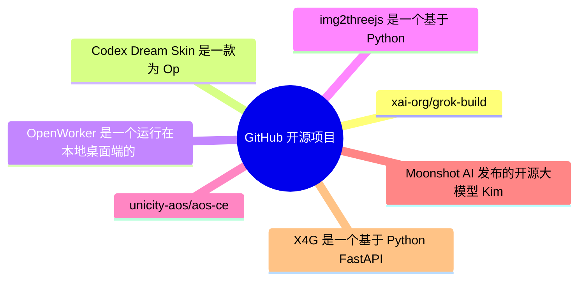
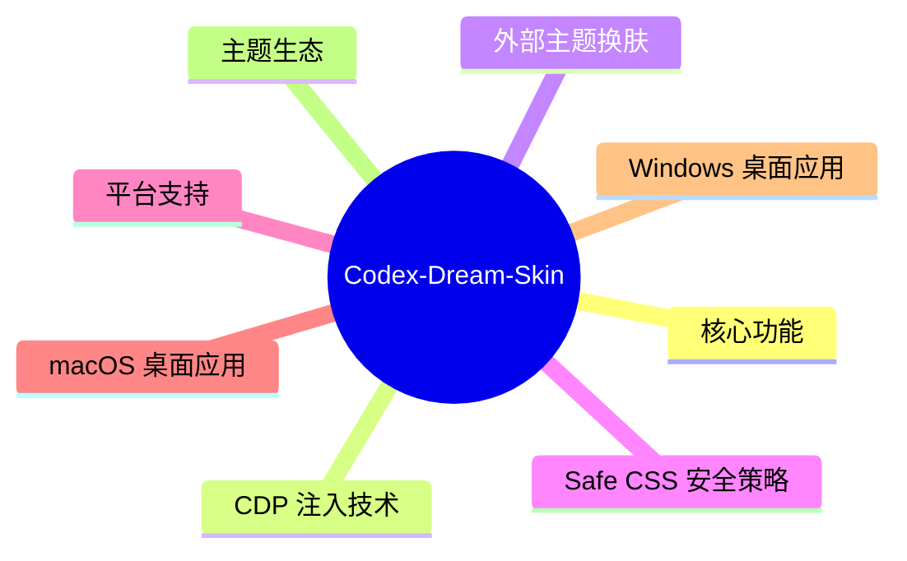
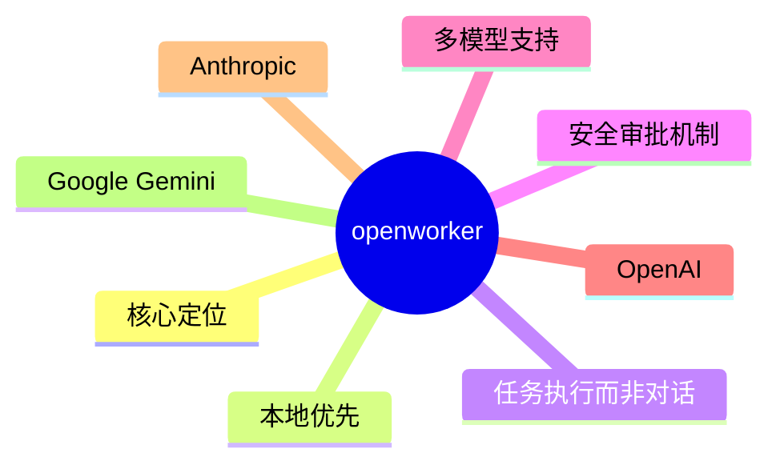
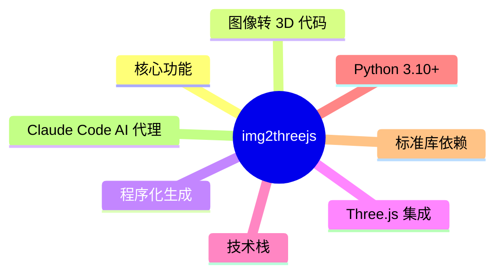
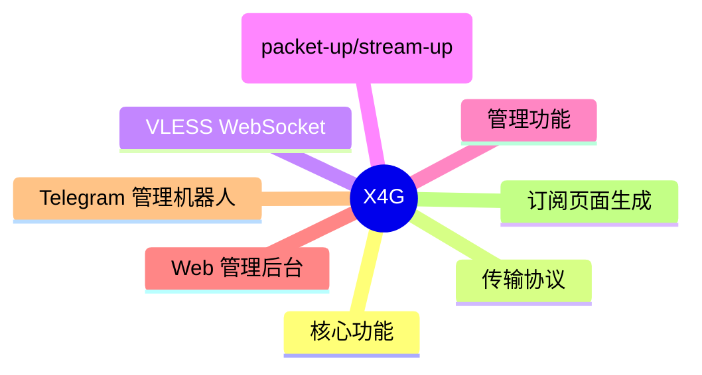

# GitHub 开源项目深度解析 (2026-07-31)

## 前面介绍

- 抓取来源：GitHub Trending / Search API
- 项目数量：15
- 深度解析数量：7
- 目标：自动筛出值得研究的开源项目，并给出结构、技术栈、运行方式和源码线索。

## 树状图



## 深度解析

### 1. grok-build
- **仓库**: [xai-org/grok-build](https://github.com/xai-org/grok-build)
- **语言**: Rust | **Star**: 23573 | **Fork**: 4482
- **更新**: 2026-07-31 | **License**: Apache-2.0

#### 源码

##### Cargo.toml

```toml
# Auto-generated workspace root. Prefer editing per-crate Cargo.toml files.

[patch.crates-io]
async-openai = { git = "https://github.com/our-forks/async-openai.git", rev = "95b52ebdedf42143083cf3d6f0e0be7c84e9c808" }

[workspace]
resolver = "2"
members = [
    "crates/build/xai-proto-build",
    "crates/codegen/ptyctl",
    "crates/codegen/ptyctl-cli",
    "crates/codegen/xai-acp-lib",
    "crates/codegen/xai-agent-lifecycle",
    "crates/codegen/xai-chat-state",
    "crates/codegen/xai-codebase-graph",
    "crates/codegen/xai-crash-handler",
    "crates/codegen/xai-fast-worktree",
    "crates/codegen/xai-file-utils",
    "crates/codegen/xai-fsnotify",
    "crates/codegen/xai-gix-status",
    "crates/codegen/xai-grok-agent",
    "crates/codegen/xai-grok-announcements",
    "crates/codegen/xai-grok-auth",
    "crates/codegen/xai-grok-config",
    "crates/codegen/xai-grok-config-types",
    "crates/codegen/xai-grok-env",
    "crates/codegen/xai-grok-extra-ca",
    "crates/codegen/xai-grok-hooks",
    "crates/codegen/xai-grok-http",
    "crates/codegen/xai-grok-markdown",
    "crates/codegen/xai-grok-markdown-core",
    "crates/codegen/xai-grok-mcp",
    "crates/codegen/xai-grok-memory",
    "crates/codegen/xai-grok-mermaid",
    "crates/codegen/xai-grok-models",
    "crates/codegen/xai-grok-pager",
    "crates/codegen/xai-grok-pager-bin",
    "crates/codegen/xai-grok-pager-minimal",
    "crates/codegen/xai-grok-pager-pty-harness",
    "crates/codegen/xai-grok-pager-render",
    "crates/codegen/xai-grok-paths",
    "crates/codegen/xai-grok-plugin-marketplace",
    "crates/codegen/xai-grok-sampler",
    "crates/codegen/xai-grok-sampling-types",
    "crates/codegen/xai-grok-sandbox",
    "crates/codegen/xai-grok-secrets",
    "crates/codegen/xai-grok-shared",
    "crates/codegen/xai-grok-shell",
    "crates/codegen/xai-grok-shell-base",
    "crates/codegen/xai-grok-shell-session-support",
    "crates/codegen/xai-grok-subagent-resolution",
    "crates/codegen/xai-grok-telemetry",
    "crates/codegen/xai-grok-test-support",
    "crates/codegen/xai-grok-tools",
    "crates/codegen/xai-grok-tools-api",
    "crates/codegen/xai-grok-update",
    "crates/codegen/xai-grok-version",
    "crates/codegen/xai-grok-voice",
    "crates/codegen/xai-grok-workspace",
    "crates/codegen/xai-grok-workspace-client",
    "crates/codegen/xai-grok-workspace-types",
    "crates/codegen/xai-hooks-plugins-types",
    "crates/codegen/xai-hunk-tracker",
    "crates/codegen/xai-mixpanel",
    "crates/codegen/xai-prompt-queue",
    "crates/codegen/xai-ratatui-inline",
    "crates/codegen/xai-ratatui-textarea",
    "crates/codegen/xai-sqlite-journal",
    "crates/codegen/xai-system-power",
    "crates/codegen/xai-token-estimation",
    "crates/codegen/xai-tracing-macros",
    "crates/codegen/xai-tty-utils",
    "crates/codegen/xai-workflow",
    "crates/common/xai-circuit-breaker",
    "crates/common/xai-computer-hub-core",
    "crates/common/xai-computer-hub-mcp-adapter",
    "crates/common/xai-computer-hub-sdk",
    "crates/common/xai-grok-compaction",
    "crates/common/xai-interjection-core",
    "crates/common/xai-test-utils",
    "crates/common/xai-tool-protocol",
    "crates/common/xai-tool-runtime",
    "crates/common/xai-tool-types",
    "crates/common/xai-tracing",
    "prod/mc/cli-chat-proxy-types",
    "third_party/dagre_rust",
    "third_party/graphlib_rust",
    "third_party/mermaid-to-svg",
    "third_party/ordered_hashmap",
]

[workspace.package]
edition
```

##### README.md

```md
<div align="center">

<h1>
  <picture>
    <source media="(prefers-color-scheme: dark)" srcset="https://media.x.ai/v1/website/spacexai-symbol-white-transparent-0c31957f.png">
    <source media="(prefers-color-scheme: light)" srcset="https://media.x.ai/v1/website/spacexai-symbol-black-transparent-6435cf42.png">
    
  </picture>
  <br>
  Grok Build (<code>grok</code>)
</h1>

**Grok Build** is SpaceXAI's terminal-based AI coding agent. It runs as a
full-screen TUI that understands your codebase, edits files, executes shell
commands, searches the web, and manages long-running tasks — interactively,
headlessly for scripting/CI, or embedded in editors via the Agent Client
Protocol (ACP).

[Installing the released binary](#installing-the-released-binary) ·
[Building from source](#building-from-source) ·
[Documentation](#documentation) ·
[Repository layout](#repository-layout) ·
[Development](#development) ·
[Contributing](#contributing) ·
[License](#license)


**Learn more about Grok Build at [x.ai/cli](https://x.ai/cli)**

This repository contains the Rust source for the `grok` CLI/TUI and its agent
runtime. It is synced periodically from the SpaceXAI monorepo.

A small `SOURCE_REV` file at the root records the full monorepo commit SHA
for the version of the code present in this tree.

</div>

---

## Installing the released binary

Prebuilt binaries are published for macOS, Linux, and Windows:

```sh
curl -fsSL https://x.ai/cli/install.sh | bash   # macOS / Linux / Git Bash
irm https://x.ai/cli/install.ps1 | iex          # Windows PowerShell
grok --version
```

See the [changelog](https://x.ai/build/changelog) for the latest fixes,
features, and improvements in each release.

## Building from source

Requirements:

- **Rust** — the toolchain is pinned by [`rust-toolchain.toml`](rust-toolchain.toml);
  `rustup` installs it automatically on first build.
- **[DotSlash](https://dotslash-cli.com)** — required so hermetic tools under
  [`bin/`](bin/) (notably [`bin/protoc`](bin/protoc)) can download and run.
  Install it and ensure `dotslash` is on your `PATH` **before** building:

  ```sh
  cargo install dotslash
  # or: prebuilt packages — https://dotslash-cli.com/docs/installation/
  /usr/bin/env dotslash --help   # sanity check
  ```

- **protoc** — proto codegen resolves [`bin/protoc`](bin/protoc) via DotSlash,
  or falls back to a `protoc` on `PATH` / `$PROTOC`.
- macOS and Linux are supported build hosts; Windows builds are best-effort
  and not currently tested from this tree.

```sh
cargo run -p xai-grok-pager-bin              # build + launch the TUI
cargo build -p xai-grok-pager-bin --release  # release binary: target/release/xai-grok-pager
cargo check -p xai-grok-pager-bin            # fast validation
```

The binary artifact is named `xai-grok-pager`; official installs ship it as
`grok`. On first launch it opens your browser to authenticate — see the
[authentication guide](crates/codegen/xai-grok-pager/docs/user-guide/02-authentication.md).

## Documentation

Full online documentation is available at
[docs.x.ai/build/overview](https://docs.x.ai/build/overview).

The user guide ships with the pager crate:
[`crates/codegen/xai-grok-pager/docs/user-guide/`](crates/codegen/xai-grok-pager/docs/user-guide/)
— getting started, keyboard sho
```

##### crates/build/xai-proto-build/Cargo.toml

```toml
[package]
license = "Apache-2.0"
description = "Build protobuf"
edition.workspace = true
name = "xai-proto-build"
version = "0.0.0"

[lints]
workspace = true

[dependencies]
anyhow = { workspace = true }
pbjson-build = { workspace = true }
prost-build = { workspace = true }
tempfile = { workspace = true }
tonic-prost-build = { workspace = true }

```

##### crates/codegen/ptyctl-cli/Cargo.toml

```toml
[package]
license = "Apache-2.0"
name = "ptyctl-cli"
version = "0.1.0"
edition.workspace = true
description = "CLI for ptyctl headless PTY controller"
publish = false

[[bin]]
name = "ptyctl"
path = "src/main.rs"

[dependencies]
ptyctl = { path = "../ptyctl" }
axum = { workspace = true }
clap = { workspace = true, features = ["derive"] }
reqwest = { workspace = true, features = ["json"] }
tokio = { workspace = true, features = ["full"] }
serde = { workspace = true, features = ["derive"] }
serde_json = { workspace = true }
anyhow = { workspace = true }
env_logger = { workspace = true }
chrono = { workspace = true, features = ["serde"] }
dirs = { workspace = true }

```

### 2. Codex-Dream-Skin
- **仓库**: [Fei-Away/Codex-Dream-Skin](https://github.com/Fei-Away/Codex-Dream-Skin)
- **语言**: JavaScript | **Star**: 12786 | **Fork**: 1278
- **更新**: 2026-07-31 | **License**: 未知

#### 前面介绍

- Codex Dream Skin 是一款为 OpenAI Codex 桌面端应用提供外部主题注入与换肤功能的工具。它通过本地回环 CDP（Chrome DevTools Protocol）技术，在不修改官方安装包（.app、app.asar 或 WindowsApps）的前提下，为 Codex 换上自定义背景、调整配色并注入 Safe CSS，实现“给 Codex 换一张会呼吸的脸”。项目支持 macOS 和 Windows 平台，拥有独立的官方主题库 DreamSkin.cc，提供在线 Studio 编辑器和一键换肤功能。

#### 树状图



#### 文字描述

- 注入引擎：基于本地回环 CDP 启动 Codex 并注入脚本，通过 `app://` 渲染目标进行 DOM 操作与样式覆盖。
- 主题管理：使用 `theme.json` 定义元数据与配色，`theme.css` 实现样式注入，支持 Safe CSS 策略限制注入范围。
- 安全边界：严格校验 Codex 包签名与 Team ID，CDP 仅绑定 127.0.0.1，拒绝重定向，通过 SHA256 校验下载包，换肤前弹出原生确认框。
- 跨平台适配：macOS 使用 Shell 脚本与 launchd 管理，Windows 使用 PowerShell 脚本与系统托盘，共享核心注入逻辑。
- 主题包规范：包含 manifest.json、theme.json、theme.css 和背景图，支持 ZIP 压缩包导入，限制文件大小与像素数。
- 状态与日志：主题状态存储于本地目录，注入器与验证脚本生成日志文件，支持备份与恢复功能。

#### 运行方式

- 安装前提：确保已安装官方 Codex 桌面端并至少启动过一次，macOS 需要 Ventura 或更高版本，Windows 需要安装 Store 版本。
- 普通用户安装：从 GitHub Releases 下载对应平台的 DMG 或 Setup.exe，拖入应用目录或按向导安装，无需手动配置 Node.js。
- 源码运行（高级）：克隆仓库，进入对应平台目录，运行安装脚本（macOS 为 install-dream-skin-macos.sh，Windows 为 install-dream-skin.ps1），需 Node.js 20+。
- 主题切换：安装后可通过菜单栏或命令行脚本切换内置预设，或从托盘/网页导入自定义主题包。
- 验证与恢复：使用内置验证脚本检查注入状态与安全性，必要时通过恢复脚本还原官方外观。
- 更新维护：覆盖安装新版本即可，主题与配置会自动保留，无需手动清理。

#### 项目亮点

- 非侵入式设计：完全基于 CDP 注入，不触碰官方安装包、签名或代码，确保应用更新不受影响。
- 安全换肤流程：网页唤起本地 App 时仅传递版本 ID，App 仅向固定 API 下载，并核验 SHA256 与审核状态。
- 丰富的主题生态：DreamSkin.cc 提供社区审核主题库与在线 Studio，支持实时预览与一键换肤。
- Safe CSS 机制：限制 CSS 注入范围，仅作用于特定部件，防止破坏原生 UI 交互与布局。
- 双平台支持：统一的注入逻辑适配 macOS 与 Windows，提供一致的换肤体验。
- 预设与创作：内置多套实机验证预设，提供详细的 theme.json 规范与素材红线指南，降低创作门槛。

#### 代码解析

- 注入核心：macos/assets/renderer-inject.js 与 windows 对应脚本负责在渲染进程中动态注入样式与 DOM 元素，实现背景与 UI 覆盖。
- 安全校验：macos/assets/safe-css-validator.mjs 与相关脚本实现 Safe CSS 策略，确保注入内容符合安全规范。
- 配置管理：macos/scripts/switch-theme-macos.sh 与 windows 对应脚本处理主题切换与状态保存，确保幂等性。
- 测试与验证：macos/tests/run-tests.sh 与 windows 脚本提供自动化测试与验证流程，确保注入与换肤的稳定性。
- 主题规范：macos/presets/README.md 定义了 theme.json 的完整字段与素材红线，指导社区贡献主题。
- 构建与分发：macos/scripts/build-client-release.sh 与 windows 脚本负责打包与安装，确保用户无需手动配置即可使用。

#### 源码

##### README.md

```md
# Codex Dream Skin

<p align="center">
  <strong>中文</strong> · <a href="./README.en.md">English</a>
</p>

<p align="center">
  <strong>给 Codex 桌面端换一张会呼吸的脸。</strong><br>
  外部主题 / 换肤工具 · 本机 CDP 注入 · 不改官方安装包
</p>

<p align="center">
  一张图，一种心情 · 写代码，也要有氛围感
</p>

<p align="center">
  官方主题库：<a href="https://dreamskin.cc"><strong>DreamSkin.cc</strong></a> ·
  <a href="https://dreamskin.cc/gallery">主题库 Gallery</a> ·
  <a href="https://dreamskin.cc/studio">在线 Studio</a>
</p>

<p align="center">
  非 OpenAI 官方产品。不修改 <code>.app</code> / <code>app.asar</code> / WindowsApps。
</p>

## 🤝 独家赞助

<table>
<tr>
<td width="180">
<a href="https://passion8.cc/sign-up?aff=ZgLT"></a>
</td>
<td>
感谢 Passion8 独家赞助本项目！Passion8 是一家面向开发者的 AI API 中转服务商，为个人开发者与团队提供稳定、低成本的主流大模型接入。<br><br>
<strong>满血 AI · 触手可及</strong>：OpenAI、Claude 全系列原版模型，无降智、无套壳；使用前沿 AI 模型仅需官方价格的一小部分，充值 1:1，<strong>1$ = 1¥</strong>。保留原有官方 SDK，只把 Base URL 换成 Passion8，Claude Code、Codex、Grok 以及任意 OpenAI 兼容客户端都能直接跑——一行配置，代码不用改。
<strong>全球节点加速</strong>：Cloudflare 全球边缘 + 多线路 BBR 加速，低延迟、高可用、稳定如一；7×24 稳定中转，99.9% SLA，首 Token 目标 1 秒内。
<strong>安全可靠</strong>：独立 API Key、密钥加密存储、全链路 HTTPS，隐私优先。<br><br>
Passion8 为本项目用户准备了专属福利：通过<a href="https://passion8.cc/sign-up?aff=ZgLT">此链接</a>注册，首次充值自动赠送 10% 额度，无需申请，30 分钟内到账。有问题联系 <a href="mailto:support@passion8.cc">support@passion8.cc</a>。
</td>
</tr>
</table>

<sub>换肤与 API 配置互相独立，本项目不会自动改写你的模型供应商设置。</sub>

## 直接安装

普通用户只需先安装并退出一次官方 Codex / ChatGPT，然后从
[GitHub Releases](https://github.com/Fei-Away/Codex-Dream-Skin/releases) 下载：

- macOS：打开 `CodexDreamSkin-vX.Y.Z.dmg`，把 App 拖进 Applications。
- Windows：双击 `CodexDreamSkin-Setup-vX.Y.Z.exe`，按安装向导完成。

不需要 clone 源码、安装 Node.js 或手动运行 `.sh` / `.ps1`。首次未签名放行、更新和卸载步骤见
[macOS 安装说明](./docs/install-macos.md) / [Windows 安装说明](./docs/install-windows.md)。

## 主题库与社区

<p align="center">
  <a href="https://dreamskin.cc">
    
  </a>
</p>

<p align="center">
  <strong>DreamSkin.cc</strong> · 本项目的官方主题库与创作平台<br>
  <sub>Make your workspace <em>yours.</em></sub>
</p>

<p align="center">
  <a href="https://dreamskin.cc/gallery"><strong>浏览主题库 →</strong></a>
  &nbsp;·&nbsp;
  <a href="https://dreamskin.cc/studio"><strong>在线 Studio →</strong></a>
</p>

- [**主题库 Gallery**](https://dreamskin.cc/gallery)：浏览社区已审核的主题，支持最新 / 热门排序和创作者榜单。
  每套主题都能先在网页里的桌面模拟器中试穿，再决定装不装。

<p align="center">
  <a href="https://dreamskin.cc/gallery">
    
  </a><br>
  <sub>社区主题「晨雾山水」的在线试穿 · 首页/任务页、宽窄窗口、侧栏展开收起都能当场切，满意了再一键换肤或下载主题包</sub>
</p>

- [**在线 Studio**](https://dreamskin.cc/studio)：在浏览器里换背景图、调主题色、写 Safe CSS，导出 `.zip` 主题包，
  也可以直接投稿到主题库（需登录，经人工审核后公开）。

<p align="center">
  <a href="https://dreamskin.cc/studio">
    
  </a><br>
  <sub>在线 Studio · 左侧实时预览，右侧调背景图、外观焦点与配色；主题库里任意一套主题都能一键载入继续改</sub>
</p>

macOS 菜单栏和 Windows 托盘都有「主题库 Gallery」和「在线 Studio」入口，可以直接打开。

### 一键换肤

在 DreamSkin.cc 上看到喜欢的主题，点「一键换肤」就能让本机客户端直接装上，不用先下载再手动导入。
需要 v1.5.0 或更新的客户端（建议 v1.5.5 及以上）。

流程与安全边界：

- 网页通过 `dreamskin://apply?version=ver_...` 唤起本机 App。链接只能携带一个主题版本 ID，**不能**携带
  任意 URL、文件路径或命令，也不存在静默应用参数。
- App 只向固定的官方 API 取包，并拒绝重定向。
- 换肤前弹出原生确认框，并核对该版本的审核状态、一键兼容标记、版本号、包大小、实际下载字节数和 SHA-256。
- 通过后复用与手动导入完全相同的 ZIP、manifest、图片与 Safe CSS 校验。
- 只有真实渲染进程确认新主题已生效才算成功。启动或渲染失败会自动尝试恢复换肤前的主题，恢
```

##### macos/README.md

```md
# Codex Dream Skin Studio

Unofficial macOS theme studio for the **official Codex Desktop** app.

Turn an image you like into one continuous full-window Codex theme. The same wallpaper runs beneath the native sidebar and main surface, while route-aware translucency keeps home, task, plugin, scheduled-task, and pull-request controls fully interactive and readable.

This project injects through **local loopback CDP**. It does **not** modify the official `.app`, `app.asar`, or code signature.

> Not affiliated with OpenAI. Codex is a trademark of its respective owners.

## Requirements

- macOS 13 Ventura or newer (the native DMG app declares macOS 13 as its minimum)
- Official Codex Desktop installed and launched at least once (`~/.codex/config.toml` exists)
- No global Node.js install required (uses Codex’s signed bundled Node after validation)

## Release install (recommended)

普通用户请从 [GitHub Releases](https://github.com/Fei-Away/Codex-Dream-Skin/releases) 下载
`CodexDreamSkin-vX.Y.Z.dmg`，按 [`docs/install-macos.md`](../docs/install-macos.md) 的图形界面步骤
拖入 Applications。首次运行可能需要在“系统设置 → 隐私与安全性 → 仍要打开”确认一次；不需要
运行 `xattr` 或安装源码。后续更新下载新的 DMG 覆盖安装即可，用户主题和图片会保留。

## Advanced: run from source

The Release DMG above is the normal user path. The commands below are for
contributors, diagnostics, and legacy deployments.

```bash
# 1) Optional checks (needs the installed Codex/ChatGPT.app bundled Node)
./tests/run-tests.sh

# 2) Install to the stable path and create Desktop launchers
./scripts/install-dream-skin-macos.sh --no-launch

# 3) Switch to the tested featured preset, or import your own pure background
~/.codex/codex-dream-skin-studio/scripts/switch-theme-macos.sh --id preset-arina-hashimoto
# ~/.codex/codex-dream-skin-studio/scripts/customize-theme-macos.sh

# 4) Start/re-apply, verify, or restore via Desktop:
#    Codex Dream Skin.command
#    Codex Dream Skin - Customize.command
#    Codex Dream Skin - Verify.command
#    Codex Dream Skin - Restore.command

# 5) Legacy only: install the old SwiftBar menu (do not enable it beside the native app)
./Install\ Menu\ Bar.command
# Look for 🎨 Skin in the top-right menu bar
```

Install location after step 2:

| Item | Path |
| --- | --- |
| Engine | `~/.codex/codex-dream-skin-studio` |
| State / logs / user images | `~/Library/Application Support/CodexDreamSkinStudio` |
| Theme backup | under Application Support (`theme-backup.json`) |

## Legacy standalone ZIP (maintainer/offline packaging only)

To build the “double-click install” folder layout for non-git users:

```bash
./scripts/build-client-release.sh "$HOME/Desktop/Codex 主题编辑器.zip"
```

That ZIP contains a visible installer plus a hidden `.codex-dream-skin-studio`
engine and is staged as a rights-clean package with only the redistributable
Gothic Void Crusade preset. It is retained for existing offline workflows;
prefer the DMG for ordinary users, and do not share a source checkout or an
archive containing the excluded Arina reference files. Do not ship only
CSS/images.

## How it works (security boundary)

1. Discover `com.openai.codex` and validate signature / Team ID / arch / bundled Node.
2. Start Codex via user `launchd` with CDP bound to `127.0.0.1` only.
3. Accept the debug port only when it belongs to Codex (or a legitimate child).
4. Inject only into expected `app://` renderer targets.
5. Resolve the selected theme and image to real paths, then enforce 10 MB,
   `16384px`-per-side, and 50-megapixel limits before injection.
6. Keep a s
```

##### macos/package.json

```json
{
  "name": "codex-dream-skin-studio",
  "version": "1.5.9",
  "private": true,
  "type": "module",
  "scripts": {
    "test": "./tests/run-tests.sh",
    "doctor": "./scripts/doctor-macos.sh"
  },
  "engines": {
    "node": ">=20"
  }
}

```

##### macos/presets/README.md

```md
# 预设主题 · Preset packs

这个目录放 **Codex Dream Skin 的内置预设主题**。安装时 `install-dream-skin-macos.sh` 会把每个 `preset-*/` 幂等地播种到用户主题库 `~/Library/Application Support/CodexDreamSkinStudio/themes/`，装完即可在**菜单栏「已保存的主题」**或 `switch-theme-macos.sh --id <id>` 里直接切换。

> This folder holds the bundled preset themes. Install seeds each `preset-*/` into the user theme library, so a fresh install ships with ready-to-use skins.

## 内置实测预设

当前内置 `preset-gothic-void-crusade/`（Gothic Void Crusade）与
`preset-arina-hashimoto/`（桥本有菜 / Arina Hashimoto）两套实机验证主题。
前者是社区作者提供的原创哥特科幻背景；后者使用一张
`2560 × 1440`（16:9）纯背景：左侧低信息留白承载 Codex 原生标题，人物和花卉主视觉集中在右侧。浅色与暗色截图均来自真实 Codex 注入，不是 AI 绘制的整窗 UI。

来源尺寸必须如实区分：归档的用户源图（不随 preset 播种）是 `1672 × 941` PNG；preset 内的 `background.jpg` 保持其近 16:9 构图，标准化导出为 `2560 × 1440` JPEG，并不代表补回或新增了源图细节。派生文件使用 `sips -z 1440 2560 -s format jpeg -s formatOptions 90` 生成。

- 可导入/可播种的主题素材只有 [`background.jpg`](./preset-arina-hashimoto/background.jpg) 与 [`theme.json`](./preset-arina-hashimoto/theme.json)。
- 用户提供的 byte-identical 源 PNG 单独归档在 [`docs/images/presets/arina-hashimoto-source.png`](../../docs/images/presets/arina-hashimoto-source.png)，不放进 preset pack，因此不会被安装脚本播种为多余文件。
- 当前浅色、暗色实测文档截图均为 `2308 × 1572` Retina JPEG（CSS viewport `1154 × 786`），来自同一真实 Codex 首页；为保护未发送草稿，截图时仅用临时本地样式隐藏输入文字并收起编辑区，没有修改草稿内容或伪造皮肤效果。它们包含真实侧栏、项目工具栏和输入框，**只作预览，绝不能当背景导入**。
- 背景是用户提供的 AI 生成示例，不代表 OpenAI/Codex 官方视觉或背书；公开分发前仍需确认人物、模型输出与素材使用权。
- 该维护者提供的精选预设是单独记录的发行例外，不纳入 MIT 软件许可；文件清单和限制见 [`../NOTICE.md`](../NOTICE.md)。这不表示以后可以提交其他可识别真人素材。

安装后可直接切换：

```bash
~/.codex/codex-dream-skin-studio/scripts/switch-theme-macos.sh \
  --id preset-arina-hashimoto
```

## 一套预设的结构

```
preset-<slug>/
├── theme.json        # schemaVersion 1，与 assets/theme.json 同一格式
└── background.jpg    # 背景图（横向，JPEG）
```

- 目录名与 `theme.json` 的 `id` **必须**都是 `preset-<slug>` 形式（`slug` 用小写英文 + 连字符）。播种只管理 `preset-*`，绝不会碰用户自己「换一张图」保存的 `custom-*` 主题。
- `image` 字段只能是**本目录内**的文件名（不能是路径），格式 `png` / `jpg` / `jpeg` / `webp`，≤ 10 MB（建议 < 1 MB）。
- `appearance` **必须如实声明背景图成立的模式**（这是规范，不是可选项）：
  - `"auto"`——仅限浅色、暗色外壳下都协调的图，且两种模式都实测过。皮肤跟随 Codex 客户端的浅暗设置切换外壳。
  - `"dark"` / `"light"`——单模专属图（如深色大教堂、纯白极简）。皮肤外壳固定为该模式，不随客户端切换。
  - 暗色专属画作声明 `auto` 是缺陷不是偏好：客户端处于浅色时，Codex 原生组件（差异卡片、任务条等）按浅色渲染，会与暗图直接打架（#134 曾因此返修）。拿不准就按图的实际明暗写死，不要照抄模板默认值。
- 人物/场景背景优先提交 `2560 × 1440`（16:9）母版；主视觉放在右侧约 58%～88%，左侧约 50%～58% 保持低信息、低对比。禁止把效果截图、窗口 mockup 或任何带 UI 的图片命名为 `background.*`。

## theme.json 字段全解（投稿必读）

以 `preset-gothic-void-crusade/theme.json` 为参考模板。除标注「可选」外均建议如实填写；文案留空会退回内置默认值，不会报错但会显得敷衍。

### 文案字段（界面哪里能看到）

| 字段 | 显示位置 |
| --- | --- |
| `name` | 首页标题上方的主题名眉标（强调色小字） |
| `tagline` | 首页标题下方一行副标语 |
| `quote` | 首页右下角手写体口号（斜排，随强调色） |
| `brandSubtitle` / `statusText` | 皮肤 chrome 的品牌角标与状态文案（部分布局下隐藏） |
| `projectPrefix` / `projectLabel` | 「选择项目」按钮的前缀与占位文案 |
| `promoTitle` / `promoSub` / `promoUrl` | 分享/宣传场景使用，可选 |

### colors 调色板（键 → 界面用途）

所有键都会被注入为主题变量，整套皮肤 UI 跟着走：

| 键 | 用途 |
| --- | --- |
| `background` | 整窗兜底底色（背景图未盖住的区域、body 底） |
| `panel` / `panelAlt` | 半透明面板底：侧栏、卡片、composer、右侧工具面板的毛玻璃都从它调透明度 |
| `accent` / `accentAlt` | 强调色：建议卡圆圈与图标、主题名眉标、口号、状态点、聚焦描边 |
| `secondary` / `highlight` | 次强调/高亮（粒子、渐变、hover 等点缀） |
| `text` | 正文字色（标题、卡片文字都强制跟随） |
| `muted` | 次要文字与大多数描边（卡片/面板边框按它调透明度） |
| `line` | 分隔线与细描边 |

- 颜色必须与背景图协调：`accent` 建议直接从画面主体取色（Gothic 取的是烛金 `#c8a55a`）。
- 声明 `appearance: dark` 的主题请给暗底亮字；`light` 反之；`auto` 主题两种模式都要自查对比度。

### art 元数据

`art.focusX` / `art.focusY`（`0..1`，画面主体位置）、`art.safeArea`（`auto | left | right | center | none`，低信息留白侧）、`art.taskMode`（`auto | ambient |
```

### 3. openworker
- **仓库**: [andrewyng/openworker](https://github.com/andrewyng/openworker)
- **语言**: Python | **Star**: 11016 | **Fork**: 1464
- **更新**: 2026-07-31 | **License**: MIT

#### 前面介绍

- OpenWorker 是一个运行在本地桌面端的 AI 助手，旨在像真正的同事一样完成具体任务，而不仅仅是聊天。它通过将大模型与用户的文件、终端和第三方应用（如 Slack、GitHub、Jira）连接，将复杂的指令拆解为可执行的步骤，并在执行关键操作前请求用户批准。该项目采用本地优先的隐私策略，支持多种大模型提供商（包括本地 Ollama），并提供了完整的开源代码。

#### 树状图



#### 文字描述

- 桌面应用层：基于 Tauri 的跨平台 GUI，提供用户交互界面。
- 本地代理服务：基于 Python 的核心引擎，负责任务拆解、工具调用和审批逻辑。
- 工具与连接器层：提供 25+ 种应用集成（Slack, GitHub 等）和终端/文件访问能力，支持 MCP 协议扩展。
- 模型适配层：通过 aisuite 抽象不同大模型提供商的 API，支持 OpenAI、Anthropic、Gemini 及本地模型。
- 自动化调度器：基于 cron 的定时任务系统，支持周期性工作流。
- 内存与会话管理：使用 SQLite 存储对话历史和上下文记忆。
- 通信协议：WebSocket 用于实时事件流，REST API 用于 OpenAI 兼容接口，HTTP 用于外部应用交互。

#### 运行方式

- 环境准备：安装 Python 3.10+、Node.js 20+ 以及 Rust 工具链（用于构建桌面壳）。
- 克隆仓库：执行 git clone 获取源码。
- 初始化环境：运行 bash packaging/setup_dev_env.sh 创建 Python 虚拟环境。
- 启动服务：激活虚拟环境后运行 openworker-server 启动本地代理服务。
- 配置模型：在应用中添加 API 密钥或连接本地 Ollama。
- 连接应用：通过 MCP 或手动配置连接 Slack、GitHub 等工具。

#### 项目亮点

- 真正的执行者：不仅生成文本，还能实际操作文件、发送消息、更新日历。
- 安全审批模式：在发送消息或执行命令前弹出确认框，防止误操作。
- 完全本地化：所有数据存储在本地，仅通过 OAuth 中继服务处理外部登录。
- 高度可扩展：支持 MCP 协议，可轻松接入新的工具和模型。
- 多模型自由切换：不绑定特定厂商，支持 OpenAI、Claude、Gemini 及开源模型。
- 自动化能力：支持定时任务，如每日晨报或每周项目进度检查。

#### 代码解析

- coworker/server/app.py：FastAPI 应用，提供 WebSocket 事件流、REST API 和 OpenAI 兼容的 /v1/chat/completions 端点，负责处理浏览器回调和 CORS 安全限制。
- coworker/tui/app.py：基于 Textual 的终端用户界面，实现了审批模态框和事件流渲染，支持键盘快捷键进行批准或拒绝操作。
- pyproject.toml：项目依赖配置，核心依赖包括 FastAPI、Textual、aisuite（模型抽象）、mcp（工具协议）以及用于 PDF 处理的 pypdf 和 pypdfium2。
- stt/Cargo.toml：Rust 语音转文本模块配置，依赖 whisper-rs 实现离线语音识别功能，支持 macOS Metal 加速。
- coworker/agent.py：构建代码引擎的核心逻辑，负责初始化代理、管理会话和协调工具调用。
- coworker/connectors/：包含各类应用连接器实现，如 GitHub、Slack、Gmail 等，以及工具定义和适配器。
- coworker/automation/：包含自动化任务调度器、存储模型和工具定义，支持基于 cron 的定时任务执行。

#### 源码

##### README.md

```md
# OpenWorker

**[openworker.com](https://openworker.com)** · [Download](#download) · [Issues](https://github.com/andrewyng/openworker/issues)

<a href="https://trendshift.io/repositories/91434?utm_source=trendshift-badge&amp;utm_medium=badge&amp;utm_campaign=badge-trendshift-91434" target="_blank" rel="noopener noreferrer"></a>

> **Beta** - OpenWorker is in open beta: fully usable, updates itself, and we're actively polishing rough edges. [Issues](https://github.com/andrewyng/openworker/issues) welcome.

**AI that gets your everyday tasks done.** OpenWorker is an open-source AI coworker that lives on your desktop and delivers **finished work**, not just chat: a polished document, a Slack reply with the numbers, an updated calendar, a triaged inbox.

It runs on your machine and doesn't lock you into any model: bring your own API key for OpenAI, Anthropic, Google, or an open-weight provider, or run fully local with Ollama. Your data leaves your machine only through the model and integrations *you* choose.

[](https://openworker.com)

## Download

[**⬇ macOS (Apple Silicon)**](https://download.openworker.com/mac)
<sub>macOS 12+ · signed & notarized · auto-updates</sub>

[**⬇ Windows 10/11 (x64)**](https://download.openworker.com/windows)
<sub>builds are not yet code-signed, so SmartScreen will warn; signing is in progress</sub>

Open the app, add a model key (or point it at Ollama), and ask for something real.

## How it works

1. Tell OpenWorker the outcome you want - "prepare a customer brief," "untangle my calendar," "draft a report," "check where the release stands across Jira and GitHub."
2. It breaks the task into steps and works across your desktop, files, and connected apps.
3. Before anything consequential - sending a message, changing a calendar, running a command - it checks in and you approve or redirect.
4. You get the finished deliverable, not a to-do list.

Under the hood:

```text
┌────────────────────────────────────────────────┐
│              OpenWorker desktop app            │  native shell + GUI
├────────────────────────────────────────────────┤
│           local agent server (Python)          │  engine · tools · connectors - built on aisuite
├───────────────┬────────────────┬───────────────┤
│  your files   │   your tools   │  your model   │  everything runs with your keys,
│  & terminal   │ 25+ connectors │  any provider │  on your machine
└───────────────┴────────────────┴───────────────┘
```

## What it can do

- **Produce real deliverables** - documents, spreadsheets, reports, and web pages land as files you can open and share.
- **Work from Slack** - mention `@OpenWorker` in a channel; a session opens on your desktop, the work happens with your tools, and the answer comes back as a thread reply.
- **Use your everyday tools** - 25+ integrations including GitHub, Slack, Jira, Notion, Linear, HubSpot, Outlook, monday.com, Gmail, and Google Calendar, plus your **terminal and local files**. Any tool reachable over [MCP](https://modelcontextprotocol.io/) plugs in too, with per-tool control.
- **Run on a schedule** - automations for recurring work: a morning brief, a weekly report, a standing watch over a channel. Runs land in the app with full transcripts.
- **Ask before acting** - writes, sends, and shell 
```

##### coworker/server/app.py

```py
"""FastAPI app — OpenAI-compatible endpoint + WS session API + REST.

The control plane every surface (GUI/IDE/messaging) rides on. The WS carries the engine
event stream and the approval channel; `/v1/chat/completions` is the OpenAI-compatible
proxy so any OpenAI-format client can use the runtime as a backend.
"""

from __future__ import annotations

import asyncio
import json
import os
import re
import secrets
import uuid
from collections import deque
from contextlib import asynccontextmanager
from pathlib import Path
from typing import Any, Optional

from fastapi import FastAPI, Request, WebSocket, WebSocketDisconnect
from fastapi.middleware.cors import CORSMiddleware
from fastapi.responses import JSONResponse

# Origins allowed to talk to the local sidecar. It binds to 127.0.0.1, but a page in the
# user's own browser can still reach loopback — so without an origin gate, any website they
# visit could read `GET /v1/sessions` (CORS was `*`) and drive a session over the WS (which
# CORS never covers) into shell/file tools. We pin to the desktop webview's own origins
# (`tauri://localhost`, Windows' `http(s)://tauri.localhost`) and localhost dev/browser
# builds. Requests with NO Origin header (curl, native clients, tests, server-to-server) are
# allowed — the gate targets browsers, which always attach an unforgeable Origin.
_ALLOWED_ORIGIN_RE = re.compile(
    r"^(tauri://localhost"
    r"|https?://localhost(:\d+)?"
    r"|https?://127\.0\.0\.1(:\d+)?"
    r"|https?://tauri\.localhost)$"
)


def _origin_allowed(origin: str | None) -> bool:
    """True if a browser Origin may use the API. Missing Origin (non-browser) passes."""
    return origin is None or bool(_ALLOWED_ORIGIN_RE.match(origin))


# Caps on inbound WebSocket traffic. The loopback socket is unauthenticated (any local
# process can reach it), so bound frames, messages, and per-connection request rate before
# building model content or starting a turn.
_WS_MAX_FRAME_BYTES = 16 * 1024 * 1024
_WS_RATE_LIMIT_COUNT = 30
_WS_RATE_LIMIT_WINDOW_SECONDS = 10.0
_MAX_MESSAGE_TEXT_CHARS = 200_000
_MAX_ATTACHMENTS_BYTES = 15_000_000  # leaves JSON overhead below the 16 MiB frame cap


def _json_value_size(value: Any) -> int:
    """Conservative UTF-8 size of parsed JSON without allocating another giant string."""
    if isinstance(value, str):
        return len(value.encode("utf-8"))
    if isinstance(value, dict):
        return sum(_json_value_size(k) + _json_value_size(v) for k, v in value.items())
    if isinstance(value, list):
        return sum(_json_value_size(v) for v in value)
    return 8  # numbers, booleans, null, separators


# Brand colors for the connector badge riding the ✓ (UX-DECISIONS §30). The GUI owns the
# real logos; this page must render offline with zero assets, so a colored initial stands in.
_BRAND_COLORS = {
    "slack": "#4A154B",
    "github": "#24292f",
    "hubspot": "#ff7a59",
    "gmail": "#ea4335",
    "google_calendar": "#4285f4",
}


def _browser_page(
    title: str, detail: str, *, ok: bool = True, error: str = "", connector: str = ""
) -> str:
    """The page shown in the user's browser at the end of a loopback flow (sign-in or
    connector callback) — one branded card (UX-DECISIONS §30): OCW mark, ok/fail icon
    (the connector's initial rides the ✓), the friendly detail, and the raw error
    preserved on failures (it's the debugging breadcrumb). Inline CSS, light/dark via
    prefers-color-scheme, no external assets — it must render offli
```

##### coworker/tui/app.py

```py
"""Textual TUI — the first surface. Renders the engine's event stream, routes approvals
to a modal, and supports a few slash commands. Talks to the engine in-process for now
(the OpenAI-compatible server is a later phase)."""

from __future__ import annotations

import json
from pathlib import Path
from typing import Any, Optional

from textual import work
from textual.app import App, ComposeResult
from textual.binding import Binding
from textual.containers import Horizontal, Vertical
from textual.screen import ModalScreen
from textual.widgets import Button, Footer, Header, Input, Label, RichLog, Static

from ..agent import build_code_engine
from ..engine import ApprovalOutcome, PermissionRequest
from ..events import Event, EventType
from ..conversations import ConversationStore
from ..memory import MemoryStore
from ..permissions import Mode
from ..providers import ProviderClient
from ..sessions import SessionRecord


def _short(value: Any, limit: int = 80) -> str:
    text = value if isinstance(value, str) else json.dumps(value, default=str)
    text = text.replace("\n", "\\n")
    return text if len(text) <= limit else text[: limit - 1] + "…"


class ApprovalScreen(ModalScreen[ApprovalOutcome]):
    BINDINGS = [
        Binding("y", "decide('once')", "Approve"),
        Binding("n", "decide('deny')", "Deny"),
        Binding("a", "decide('always_tool')", "Always tool"),
        Binding("c", "decide('always_command')", "Always cmd"),
    ]

    def __init__(self, request: PermissionRequest) -> None:
        super().__init__()
        self.request = request

    def compose(self) -> ComposeResult:
        r = self.request
        args = ", ".join(f"{k}={_short(v)}" for k, v in (r.arguments or {}).items())
        with Vertical(id="approval"):
            yield Label("Permission required", id="approval-title")
            yield Static(f"tool:   {r.tool_name}")
            yield Static(f"args:   {args or '(none)'}")
            yield Static(f"reason: {r.reason}")
            with Horizontal(id="approval-buttons"):
                yield Button("Approve (y)", id="once", variant="success")
                yield Button("Deny (n)", id="deny", variant="error")
                yield Button("Always tool (a)", id="always_tool")
                yield Button("Always cmd (c)", id="always_command")

    def on_button_pressed(self, event: Button.Pressed) -> None:
        self.dismiss(ApprovalOutcome(event.button.id))

    def action_decide(self, outcome: str) -> None:
        self.dismiss(ApprovalOutcome(outcome))


class CoworkerApp(App):
    CSS = """
    #log { border: round $primary 30%; padding: 0 1; }
    #prompt { dock: bottom; }
    #approval { padding: 1 2; border: thick $warning; background: $panel; width: 80%; }
    #approval-title { text-style: bold; color: $warning; }
    #approval-buttons { height: auto; padding-top: 1; }
    #approval-buttons Button { margin-right: 1; }
    """
    BINDINGS = [
        Binding("ctrl+c", "quit", "Quit"),
        Binding("escape", "interrupt", "Interrupt"),
    ]

    def __init__(
        self,
        *,
        workspace: str | Path,
        model: str = "gpt-5.6-sol",
        mode: Mode = Mode.INTERACTIVE,
        provider: Optional[ProviderClient] = None,
        memory_store: Optional[MemoryStore] = None,
        session_store: Optional[ConversationStore] = None,
        session_id: Optional[str] = None,
        resume_messages: Optional[list[dict]] = None,
    ) -> None:
        super().__init__()
 
```

##### pyproject.toml

```toml
[build-system]
requires = ["setuptools>=68"]
build-backend = "setuptools.build_meta"

[project]
name = "coworker"
version = "0.0.0"
description = "Agent coworker platform — provider-agnostic agentic coworker runtime"
requires-python = ">=3.10"
dependencies = [
    "openai>=1.0",
    "anthropic>=0.40",  # native Claude Messages API provider
    "google-genai>=1.0",  # native Gemini provider
    "google-auth>=2.23",  # Vertex credentials (service account / ADC / MaaS bearer)
    "textual>=1.0",
    "fastapi>=0.110",
    "uvicorn[standard]>=0.27",
    # aisuite (toolkits/tracing), pinned to the commit this repo was imported from;
    # swap for a PyPI pin ("aisuite>=x.y") once the next aisuite release ships.
    "aisuite @ git+https://github.com/andrewyng/aisuite.git@1b4bbf303ec21968230b1ec869a144d054e9b3c4",
    "docstring_parser",
    "pyyaml>=6",  # persona manifest frontmatter (YAML)
    "pydantic>=2",
    "mcp>=1.1,<2",  # MCP client (stdio + streamable-http); 2.0 removed streamablehttp_client
    "httpx>=0.27",  # sync outbound senders for messaging connectors (send_message tool)
    "websockets>=13",  # managed Slack relay client transport (relay_client.py)
    "ddgs>=9",  # keyless default web-search provider (DuckDuckGo); Tavily/Brave use httpx
    "croniter>=2",  # cron next-fire math for the automation scheduler
    # PDF attachments for models without native PDF support (pdf_support.py):
    # pypdf = pure-python text extraction; pypdfium2 = page rasterization (BSD pdfium,
    # ships its own libpdfium — NOT PyMuPDF, whose AGPL license can't ride in the DMG).
    "pypdf>=5",
    "pypdfium2>=4",
    # IANA tz database for zoneinfo. Windows ships no system tz db, so without this every
    # named schedule timezone (UTC, Asia/Kolkata, …) silently falls back to local time.
    "tzdata; sys_platform == 'win32'",
]

[project.optional-dependencies]
dev = ["pytest>=8", "pytest-asyncio", "httpx"]
# Inbound messaging listeners (outbound send_message needs only httpx, already a core dep).
# aiohttp is slack-bolt's Socket Mode transport at runtime (and the FakeSlack test harness
# drives the real handler) — declare it so CI installs it, not just transitively.
messaging = ["python-telegram-bot>=21", "slack-bolt>=1.18", "aiohttp>=3.9"]
# Interactive Cowork browser automation.
browser = ["playwright>=1.44"]
# AWS Bedrock provider (lazy-imported; desktop builds bundle it, pip users opt in).
bedrock = ["boto3>=1.34"]

[project.scripts]
openworker = "coworker.cli:main"
openworker-server = "coworker.server.run:main"
openworker-connectors = "coworker.connectors.cli:main"

[tool.setuptools.packages.find]
where = ["."]
include = ["coworker*"]

[tool.setuptools.package-data]
coworker = ["personas/builtin/*.md"]

[tool.pytest.ini_options]
testpaths = ["tests"]
asyncio_mode = "auto"

```

### 4. img2threejs
- **仓库**: [img2threejs/img2threejs](https://github.com/img2threejs/img2threejs)
- **语言**: Python | **Star**: 8562 | **Fork**: 650
- **更新**: 2026-07-31 | **License**: Apache-2.0
- **主题**: 3d、ai-agents、claude-code、computer-graphics、generative、image-to-3d、procedural-generation、threejs

#### 前面介绍

- img2threejs 是一个基于 Python 的开源项目，旨在将参考图像中的物体重建为纯代码生成的、程序化的 Three.js 3D 模型。该项目不依赖网格提取或摄影测量，而是通过 AI 代理（特别是 Claude Code）生成 Three.js 源代码，从而实现高质量的、动画就绪的模型。项目强调 Token 高效性，生成的模型完全在浏览器中运行，无需下载任何网格文件。

#### 树状图



#### 文字描述

- 项目采用模块化设计，主要分为文档规范、核心工作流和共享工具三个部分。
- 文档规范层位于 `docs/specs/vocabulary/`，定义了用于本地规格搜索的标准化 JSONL 记录结构，包含实体、约束、测量和来源引用等元数据。
- 核心工作流位于 `forge/` 目录，包含阶段一摄入模块，负责分析纹理、提取细节属性、构建详细清单以及检测 CS2 特定参考效果。
- 共享工具层位于 `forge/_shared/`，提供图像哈希、规格搜索、特征接受策略和颜色度量等基础功能，确保工作流的稳定性和一致性。
- 项目完全使用 Python 3.10+ 标准库编写，不依赖第三方库（如 Pillow 或 NumPy），以保持轻量级和高性能。

#### 运行方式

- 确保安装 Python 3.10 或更高版本。
- 克隆仓库并进入项目目录。
- 项目核心脚本位于 `forge/` 文件夹，无需安装额外的第三方依赖包。
- 运行脚本前，需确保已配置好 Claude Code 代理环境以处理生成任务。
- 查看 `docs/` 目录下的文档以了解详细的架构设计和升级计划。

#### 项目亮点

- 纯代码生成：生成的模型是 Three.js 源代码，而非预制的网格文件，支持完全的编辑和动画控制。
- Token 高效：通过 AI 代理生成代码而非传输大体积模型数据，显著降低了 Token 消耗。
- 质量门控：内置了严格的审查机制，确保生成的模型符合视觉和结构质量标准。
- 硬表面建模专家：特别擅长处理游戏资产（如 CS2 武器）和复杂的硬表面物体。
- 浏览器原生运行：所有生成的模型都在浏览器中实时渲染，无需本地 3D 软件。
- 标准化规范：建立了严格的 JSONL 规范记录系统，用于管理和检索 3D 重建知识。

#### 代码解析

- 核心逻辑位于 `forge/next.py`，作为主入口点，协调各个阶段的工作。
- `forge/stage1_intake/` 目录下包含多个专门模块，如 `analyze_texture.py` 用于分析图像纹理，`extract_landmarks.py` 用于提取关键特征点，`detect_reference_effects.py` 用于检测参考图像的特殊效果。
- `forge/_shared/spec_search.py` 提供了 `load_jsonl_records` 函数，用于加载和验证符合规范的 JSONL 记录，确保数据结构的完整性。
- `forge/_shared/feature_acceptance_policy.py` 定义了特征接受的策略，决定了哪些提取的特征会被纳入最终的模型构建中。
- 项目文档中包含 `docs/cs2-anatomy/`，详细记录了 CS2 游戏中各类武器（如手枪、步枪、匕首）的 3D 解剖结构和技术映射，为重建提供知识库。

#### 源码

##### README.md

```md
<div align="center">


# img2threejs

**Rebuild the object in a reference image as a code-only, procedural Three.js model.**

Quality-gated, animation-ready, and deliberately token-efficient — reconstruction-by-code, not photogrammetry, mesh extraction, or downloaded art packs.

[](LICENSE)
[](https://github.com/img2threejs/img2threejs/releases)
[](CONTRIBUTING.md)
[](https://threejs.org)
[](scripts)
[](https://www.buymeacoffee.com/hoainhowors)

<table align="center">
  <tr>
    <td align="center"></td>
    <td align="center"><sub><b>DAILY</b></sub></td>
    <td align="center"><sub><b>WEEKLY</b></sub></td>
  </tr>
  <tr>
    <td align="right"><sub><b>Python</b></sub></td>
    <td><a href="https://trendshift.io/repositories/83608?utm_source=trendshift-badge&amp;utm_medium=badge&amp;utm_campaign=badge-trendshift-83608" target="_blank" rel="noopener noreferrer"></a></td>
    <td><a href="https://trendshift.io/repositories/83608?utm_source=trendshift-badge&amp;utm_medium=badge&amp;utm_campaign=badge-trendshift-83608" target="_blank" rel="noopener noreferrer"></a></td>
  </tr>
  <tr>
    <td align="right"><sub><b>All languages</b></sub></td>
    <td><a href="https://trendshift.io/repositories/83608?utm_source=trendshift-badge&amp;utm_medium=badge&amp;utm_campaign=badge-trendshift-83608" target="_blank" rel="noopener noreferrer"></a></td>
    <td><a href="https://trendshift.io/repositories/83608?utm_source=trendshift-badge&amp;utm_medium=badge&amp;utm_campaign=badge-trendshift-83608" target="_blank" rel="noopener noreferrer"></a></td>
  </tr>
</table>

</div>

*Reference images reconstructed in code as animation-ready Three.js models, running live in the browser.*

### [→ Open the Live Demo Gallery](https://img2threejs.github.io/img2threejs-showcase/)

Every model in the gallery is generated code, running in your browser. No mesh files, no downloads.

---

## Live demos

Reconstructions built entirely from primitives, procedural shaders, and generated geometry. Open any model to orbit it, inspect its reference, and read the generated source.

| Demo | Subject | View | Source |
| --- | --- | --- | --- |
| Glock-18 · Ghost Protocol (Well-Worn) | CS2 weapon | [Live](https://img2threejs.github.io/img2threejs-showcase/#/demo/glock-ghost-protocol) | [code](https://github.com/img2thre
```

##### docs/specs/vocabulary/README.md

```md
# Normalized spec-record vocabulary

This directory holds reviewed, committed JSONL records for local specification
search. Each non-empty line is exactly one UTF-8 JSON object. A collection may
have no record file yet, but every row in a present record file must satisfy
this contract.

## Future ingestion seam

Todo 3 must expose `load_jsonl_records(path: Path)` from
`forge._shared.spec_search`. It returns validated records and raises
`SpecRecordValidationError` for malformed JSON, a non-object JSON value, a
missing required field, or a value with the wrong type. The error identifies
the input path and one-based line number. Invalid rows are never skipped or
silently repaired.

## Canonical row

```json
{
  "record_id": "cs2.karambit.safety-ring",
  "collection": "cs2",
  "domain": "weapon-anatomy",
  "kind": "component",
  "entity": "karambit safety ring",
  "title": "Karambit safety ring / Vòng ngón Karambit",
  "aliases": ["safety ring", "finger ring", "vòng ngón"],
  "content": "A retention ring at the Karambit's pommel.",
  "constraints": ["Preserve the opening as a distinct component."],
  "measurements": [
    {"name": "opening diameter", "value": "source-dependent", "unit": "mm"}
  ],
  "source_refs": [
    {
      "path": "docs/cs2/3D_Technical_Mapping.json",
      "key_path": "karambit.components.safety_ring"
    },
    {"path": "docs/cs2-anatomy/karambit.md", "heading": "Safety ring"}
  ],
  "evidence_refs": [
    {"kind": "source", "ref": "docs/cs2/3D_Technical_Mapping.json"}
  ],
  "observation_status": "observed",
  "confidence": 0.9,
  "assumptions": []
}
```

`record_id` is a stable, lowercase, dot-delimited identifier. It is never
derived from a display title and must remain stable when wording changes.
`collection` selects the owning search collection; `domain`, `kind`, and
`entity` classify the record without imposing a global taxonomy. `title`,
`aliases`, and `content` are searchable text. `aliases` preserve English and
Vietnamese terms as authored; normalization and query expansion happen later.

## Required fields and stable types

| Field | Type | Semantics |
| --- | --- | --- |
| `record_id` | non-empty string | Stable unique identifier within a collection. |
| `collection` | non-empty string | Collection key that owns the record. |
| `domain` | non-empty string | Domain grouping, such as `weapon-anatomy` or `pbr`. |
| `kind` | non-empty string | Record category, such as `component`, `material`, or `constraint`. |
| `entity` | non-empty string | Canonical entity or concept name. |
| `title` | non-empty string | Human-readable searchable title. |
| `aliases` | array of strings | Zero or more authored synonyms, including bilingual aliases where known. |
| `content` | string | Source-backed concise description; may be empty only when structured fields carry the searchable detail. |
| `constraints` | array of strings | Requirements, prohibitions, or caveats. |
| `measurements` | array of objects | Each object has non-empty string `name` and `value`; optional `unit` and `context` are strings. Values remain source text rather than invented numbers. |
| `source_refs` | non-empty array of objects | Provenance for the distilled statement. Every object has non-empty string `path` and may have non-empty string `heading` and/or `key_path`. |
| `evidence_refs` | array of objects | Supporting provenance. Every object has non-empty string `kind` and `ref`; optional `note` is a string. |
| `observation_status` | string | One of
```

##### forge/requirements.txt

```txt
# Three.js Object Sculptor scripts have NO third-party dependencies.
# Everything uses the Python 3.10+ standard library only (json, argparse, struct,
# zlib, pathlib, math, subprocess). PNG maps and comparison sheets are written with
# struct/zlib directly — no Pillow/numpy/OpenCV/Playwright required.
#
# Requires: python >= 3.10

```

### 5. aos-ce
- **仓库**: [unicity-aos/aos-ce](https://github.com/unicity-aos/aos-ce)
- **语言**: Rust | **Star**: 8077 | **Fork**: 14
- **更新**: 2026-07-30 | **License**: 未知

#### 源码

##### Cargo.toml

```toml
[workspace]
members = [
    "crates/unicity-aos-bootstrap",
    "crates/aos-mcp-broker",
    "capsules/capsule-agents",
    "capsules/capsule-cli",
    "capsules/capsule-context-engine",
    "capsules/capsule-forge",
    "capsules/capsule-fs",
    "capsules/capsule-hook-bridge",
    "capsules/capsule-meta-harness",
    "capsules/capsule-http",
    "capsules/capsule-identity",
    "capsules/capsule-memory",
    "capsules/capsule-mcp",
    "capsules/capsule-openai",
    "capsules/capsule-openai-compat",
    "capsules/capsule-prompt-builder",
    "capsules/capsule-react",
    "capsules/capsule-registry",
    "capsules/capsule-router",
    "capsules/capsule-session",
    "capsules/capsule-shell",
    "capsules/capsule-skills",
    "capsules/capsule-system",
    "capsules/capsule-users",
]
resolver = "3"

[workspace.dependencies]
astrid-sdk = { version = "=0.7.1", features = ["derive"] }
astrid-core = "=0.10.4"
astrid-types = { version = "=0.10.4", features = ["clock"] }
astrid-uplink = "=0.10.4"
axum = "0.8"
blake3 = "1.8.5"
clap = { version = "4.6", features = ["derive"] }
fs2 = "0.4"
serde = { version = "1.0", features = ["derive"] }
serde_json = "1.0"
tokio = { version = "1", features = ["io-std", "io-util", "macros", "net", "process", "rt", "time"] }
toml = "0.8"
uuid = { version = "1.22", features = ["rng-getrandom", "serde", "v4"] }

[profile.release]
opt-level = "z"
lto = true
codegen-units = 1
strip = true
panic = "abort"

```

##### README.md

```md
# AOS Community Edition

AOS Community Edition is the open agent operating system for people who want
an inspectable, composable environment for agents.

It owns the Community Edition product surface: the `aos` CLI, HTTP API,
distributions, first-party capsules, provider and model experience, and
Unicity Audit.

## Workspace layout

```text
crates/       Product CLI, HTTP API, control client, and shared product code
capsules/     First-party production capsules
distros/      Community distribution manifests and release metadata
docs/         Product and operator documentation
```

## Install

The supported installer installs the `aos` product command, its pinned runtime,
and the exact 21 Community Edition capsules built from this source tree under
the product-owned `~/.aos` root:

```sh
curl --proto '=https' --tlsv1.2 -fsSL https://aos.unicity.ai/install.sh | sh
aos init
```

`aos init`, including `aos init --offline`, provisions from those local,
product-versioned capsule assets. Re-running the installer performs a
coordinated product upgrade without
rewriting a standalone runtime installation. Every release publishes
checksums, Sigstore bundles, GitHub build-provenance attestations, and
`runtime-compatibility.toml`, which pins the exact runtime release and WIT commit.
Its machine-readable runtime-compatibility and upgrade/self-heal gates must both
be true before a tag can publish. The latter is approved only after the exact
candidate preserves a frozen standalone-home clone and boots with freshly
generated runtime coordination state.

## Command boundary

AOS owns its product roots, including `init`, `status`, `migrate`, `update`,
`distro`, `mcp`, `daemon`, and `serve-health`:

```sh
aos status
aos status --json
aos --principal codex-code mcp serve
aos daemon foreground --workspace /workspace
```

On Unix, `aos daemon foreground` replaces the AOS process with the persistent
bundled daemon, preserving direct signal and exit-status ownership for process
supervisors. On other hosts it waits for the daemon and preserves its exit
status. Both paths apply the product-owned runtime home, `.aos` workspace
layout, enforced Community Edition distro, and stderr logging environment.
Neither path enables ephemeral lifetime.

Every other runtime root is part of the AOS CLI directly. Arguments, exit
codes, and signals pass through unchanged; there is no nested `aos astrid` or
`aos runtime` namespace:

```sh
aos doctor
aos capsule build
```

When AOS owns a root such as `status`, `init`, `update`, or `mcp`, its product
implementation replaces the lower-level command at that same location. The
complete supported surface therefore remains `aos <verb>`. Release validation
compares the exact pinned runtime's public command inventory with AOS's
classified root contract, so a new runtime verb cannot enter a product release
without an explicit inherit-or-own decision.

`aos mcp serve` is the product edge shared by Codex, Claude, and Grok. A client
that supports MCP form elicitation keeps presenting its own constrained
approval forms. When a client does not, the default `--interaction auto` mode
uses a local AOS decision surface: AppKit on macOS, a native Windows dialog, or
Pinentry on Linux. `--interaction client`, `native`, and `deny` make the policy
explicit. The local bridge accepts only a single boolean or the fixed AOS
approval enum; arbitrary strings, password-shaped fields, and URL
elicitations are never collected through it.

## Build on AOS

Unicit
```

##### capsules/capsule-agents/Cargo.toml

```toml
[package]
name = "aos-agents"
version = "0.2.0"
edition = "2024"
description = "Injects project instructions from AGENTS.md into the system prompt"
license = "MIT OR Apache-2.0"
authors = ["Joshua J. Bouw <dev@joshuajbouw.com>", "Unicity Labs <info@unicity-labs.com>"]

[lib]
crate-type = ["cdylib"]

[dependencies]
astrid-sdk = { workspace = true }
serde = { workspace = true }
serde_json = { workspace = true }

```

##### capsules/capsule-cli/Cargo.toml

```toml
[package]
name = "aos-cli"
version = "0.2.0"
edition = "2024"
license = "MIT OR Apache-2.0"

[lib]
crate-type = ["cdylib"]

[dependencies]
astrid-sdk = { workspace = true }
serde = { workspace = true }
serde_json = { workspace = true }

```

### 6. Kimi-K3
- **仓库**: [MoonshotAI/Kimi-K3](https://github.com/MoonshotAI/Kimi-K3)
- **语言**:  | **Star**: 7544 | **Fork**: 506
- **更新**: 2026-07-31 | **License**: NOASSERTION

#### 前面介绍

- Moonshot AI 发布的开源大模型 Kimi K3 是其迄今为止最强大的模型，属于 2.8T 参数级的混合专家（MoE）架构。该模型基于 Kimi Delta Attention (KDA) 和 Attention Residuals (AttnRes) 构建，原生支持多模态（文本、图像、视频），并拥有 100 万 token 的超长上下文窗口。作为全球首个开源的 3T 级别模型，Kimi K3 旨在为长周期编码、知识工作及推理任务提供前沿智能。

#### 树状图

```mermaid
mindmap
  root((Kimi-K3))
    Kimi K3 模型概览
    核心架构
    Kimi Delta Attention (KDA)
    Attention Residuals (AttnRes
    Stable LatentMoE
    模型规模
    总参数量 2.8T
    激活参数 104B
```

#### 文字描述

- 采用 Mixture-of-Experts (MoE) 架构，总参数量达 2.8T，但每次推理仅激活 104B 参数。
- 基于 Kimi Delta Attention (KDA) 和 Attention Residuals (AttnRes) 构建新型注意力机制。
- 使用 Stable LatentMoE 框架，在 896 个专家中激活 16 个，相比 Kimi K2 提升了约 2.5 倍的扩展效率。
- 包含 69 层 KDA 和 24 层 Gated MLA（门控多头注意力）。
- 注意力隐藏维度为 7168。
- 原生支持文本、图像和视频输入，无需外部适配器。
- 支持 100 万 token 的超长上下文窗口。

#### 运行方式

- 访问 GitHub 仓库 MoonshotAI/Kimi-K3 获取源码。
- 访问 Kimi 官网 (kimi.com) 或 Hugging Face (moonshotai) 下载模型权重。
- 阅读仓库中的 k3_tech_report.pdf 获取完整技术报告。
- 模型遵循 Kimi K3 License 开源协议。
- 支持通过 Discord、Twitter 和 ModelScope 社区获取支持。

#### 项目亮点

- 全球首个开源的 3T 级别大模型，打破了闭源模型的参数壁垒。
- 引入 Kimi Delta Attention (KDA) 和 Attention Residuals (AttnRes) 显著提升了长序列处理能力。
- Stable LatentMoE 框架优化了稀疏专家网络的计算效率。
- 原生多模态能力使其能直接处理视频流，而不仅仅是静态图像。
- 在长周期编码任务中表现出色，能自主导航大型代码库并调用终端工具。
- 支持百万 token 上下文，适合处理超长文档和复杂推理任务。

#### 代码解析

- 仓库主要包含 README.md 说明文档、LICENSE 许可证文件以及技术报告 PDF。
- 项目结构相对简洁，核心内容集中在模型介绍和架构参数说明上。
- 未提供具体的训练代码或推理脚本，侧重于模型权重和文档的发布。
- 项目链接指向了 Kimi 的官方聊天界面、技术博客和社区渠道。

#### 源码

##### README.md

```md
<div align="center">
  <picture>
      
  </picture>
</div>
<hr>
<div align="center" style="line-height:1">
  <a href="https://www.kimi.com" target="_blank"></a>
  <a href="https://www.moonshot.ai" target="_blank"></a>
</div>

<div align="center" style="line-height: 1;">
  <a href="https://huggingface.co/moonshotai" target="_blank"></a>
  <a href="https://twitter.com/kimi_moonshot" target="_blank"></a>
  <a href="https://discord.gg/TYU2fdJykW" target="_blank"></a>
  <a href="https://modelscope.cn/organization/moonshotai" target="_blank"></a>
</div>
<div align="center" style="line-height: 1;">
  <a href="https://huggingface.co/moonshotai/Kimi-K3/blob/main/LICENSE"></a>
</div>


<p align="center">
📰&nbsp;&nbsp;<a href="https://www.kimi.com/blog/kimi-k3">Tech Blog</a> | &nbsp;&nbsp;&nbsp; <b>📄&nbsp;&nbsp;<a href="k3_tech_report.pdf">Full Report</a></b>
</p>


## 1. Model Introduction

Kimi K3 is an open-weight, native multimodal agentic model and our most capable model to date. It is a 2.8T-parameter model built on Kimi Delta Attention (KDA) and Attention Residuals (AttnRes), with native vision capabilities and a 1-million-token context window. It is the world's first open 3T-class model, designed for frontier intelligence across long-horizon coding, knowledge work, and reasoning.

### Key Features
- **New Architecture**: Kimi K3 is built on Kimi Delta Attention (KDA) and Attention Residuals (AttnRes), and scales up MoE sparsity with a Stable LatentMoE framework that activates 16 out of 896 experts — yielding an approximate 2.5× improvement in overall scaling efficiency over Kimi K2.
- **Long-Horizon Coding**: Operating with minimal human oversight, Kimi K3 sustains long engineering sessions, navigates massive repositories, and orchestrates terminal tools — from GPU kernel optimization and compiler development to vision-in-the-loop game dev, CAD, and even chip design.
- **Agentic Knowledge Work**: Kimi K3 advances end-to-end knowledge work, producing deep research with interactive visualizations, widgets and dashboards, and motion design and video editing, powered by its native multimodal architecture.
- **Native Multimodality & Long Context**: Kimi K3 understands text, images, and video within the same model, and supports a 1-million-token context window.
- **Open Frontier Weights**: We release the full Kimi K3 model weights under the Kimi K3 License, making frontier intelligence openly available for research, deployment, and further innovation.
## 2. Model Summary

<div align="center">
<table>
<tbody>
<tr>
<td align="center" style="vertical-align: middle; text-align: center"><strong>Architecture</strong></td>

```

### 7. X4G
- **仓库**: [x4gKing/X4G](https://github.com/x4gKing/X4G)
- **语言**: Python | **Star**: 7117 | **Fork**: 13012
- **更新**: 2026-07-31 | **License**: 未知

#### 前面介绍

- X4G 是一个基于 Python FastAPI 开发的现代化 VLESS 代理网关服务。它支持多种传输协议（WebSocket、XHTTP），具备功能完备的 Web 管理后台、Telegram 管理机器人以及专业的订阅页面生成功能。该项目允许用户通过 Railway 等平台一键部署，支持对每个节点进行流量、速度、IP 数量及有效期的精细化限制。

#### 树状图



#### 文字描述

- 采用 FastAPI 框架构建 Web 服务，利用异步 I/O 提高并发处理能力。
- 核心逻辑位于 main.py，负责状态管理、路由分发和 WebSocket 连接处理。
- 支持多种传输协议，通过 relay_vless.py 处理 VLESS 流量转发，xhttp_siz10.py 处理 XHTTP 协议。
- 使用 aiofiles 实现文件异步读写，确保状态数据持久化到磁盘。
- 通过 Telegram Bot API 提供远程管理接口，实现无 Web 界面的配置管理。
- 支持 CORS 中间件，允许跨域请求，便于前后端分离部署。
- 状态数据存储在 JSON 文件中，配合 Railway 的 Volume 功能实现数据持久化。
- 使用 httpx 库作为 HTTP 客户端，支持 HTTP/2 协议以提升连接效率。

#### 运行方式

- 克隆或 Fork 项目仓库到本地。
- 在 Railway.app 创建新项目，选择从 GitHub 部署 Fork 后的仓库。
- 配置环境变量：设置管理员密码（ADMIN_PASSWORD）、密钥（SECRET_KEY）、Telegram Bot Token（TELEGRAM_BOT_TOKEN）等。
- 在 Railway 服务设置中挂载 Volume 到 /data 目录，确保重启后数据不丢失。
- 部署完成后，访问 Dashboard 页面，复制生成的 VLESS 链接并导入至客户端。
- 通过 Web 界面或 Telegram 机器人创建新的节点配置，设置流量、速度、IP 限制及有效期。

#### 项目亮点

- 支持 VLESS over WebSocket 和 XHTTP 两种主流传输方式，兼顾兼容性与性能。
- 提供完整的流量控制机制，包括按 KB/MB/GB 限制流量、按 Mbps 限制带宽。
- 内置 Telegram 管理机器人，支持通过聊天界面进行节点的增删改查。
- 订阅页面支持生成美观的公共页面，可设置密码保护，并包含 QR 码和流量统计。
- 状态持久化设计，通过 Volume 挂载确保数据在服务重启或迁移后依然存在。
- 支持自定义 Fingerprint（uTLS）和 ALPN，增强节点伪装能力。

#### 代码解析

- main.py 是核心入口，负责初始化 FastAPI 应用、加载持久化状态以及定义路由。
- 使用 asyncio.Lock 保护共享资源（LINKS, SUBS），防止并发写入导致的数据不一致。
- 通过 _load_or_create_secret 函数确保 SECRET_KEY 在服务重启后保持不变，避免会话失效。
- load_state 和 save_state 函数实现了基于 JSON 文件的异步状态持久化机制。
- relay_vless.py 负责处理 VLESS 协议的流量转发逻辑。
- xhttp_siz10.py 实现了 XHTTP 协议的 packet-up 和 stream-up 模式。
- speed_limit.py 模块负责实现带宽限制功能。
- telegram_bot.py 模块封装了 Telegram Bot 的交互逻辑，提供命令行管理接口。

#### 源码

##### README.md

```md
کانال یوتوب : [https://www.youtube.com/@X4GHUB](https://www.youtube.com/@X4GHUB)

# 🚀 X4G

دروازه (Gateway) سریع و مدرن برای تونل‌زنی VLESS روی WebSocket و XHTTP + HTTP Proxy، با داشبورد مدیریتی زیبا، **ربات مدیریت تلگرام**، صفحات ساب حرفه‌ای و قابلیت ساخت لینک‌های اختصاصی با محدودیت ترافیک، سرعت و آی‌پی.

## ✨ ویژگی‌ها

* 🔌 تونل VLESS روی چند ترابرد قابل‌انتخاب: **WebSocket**، **XHTTP (packet-up)** و **XHTTP (stream-up)**
* 🌐 HTTP Proxy داخلی
* 📊 داشبورد مدیریتی کامل (آمار، نمودار ترافیک ساعتی، اتصالات زنده، لاگ فعالیت‌ها و خطاها)
* 🔗 مدیریت لینک‌های نامحدود با محدودیت ترافیک اختصاصی (KB/MB/GB)
* 🚦 محدودیت سرعت (Bandwidth Throttling) اختصاصی برای هر کانفیگ، بر حسب Mbps
* ✅ فعال/غیرفعال‌سازی هر لینک به‌صورت لحظه‌ای، و انقضای خودکار بر اساس روز
* 📱 خروجی QR Code برای هر لینک و هر ساب
* 🛡️ Fingerprint (uTLS) و ALPN قابل تنظیم دستی برای هر کانفیگ
* 🔢 پورت اتصال قابل تنظیم دستی برای هر کانفیگ (نه فقط 443)
* 👥 محدودیت تعداد آی‌پی/کاربر هم‌زمان به‌ازای هر کانفیگ
* 🗂 **گروه‌های ساب**: چند کانفیگ رو داخل یک گروه بذار و یک لینک ساب حرفه‌ای و زیبا (صفحه‌ی عمومی، قابل رمزدار کردن) برای همه‌شون بگیر
* 💾 ذخیره‌سازی وضعیت روی دیسک (نه فقط حافظه) تا با ری‌استارت سرویس از بین نره — به شرطی که یک Volume دائمی روی مسیر دیتا وصل باشه
* 🤖 **ربات مدیریت تلگرام** (اختیاری) برای مدیریت کامل کانفیگ‌ها و گروه‌های ساب، بدون نیاز به باز کردن پنل وب

## 1️⃣ Fork روی گیت‌هاب

ابتدا روی دکمه Fork کلیک کنید تا این ریپازیتوری را به حساب خود منتقل کنید.

## 2️⃣ Deploy روی Railway

1. وارد سایت [Railway.app](https://railway.app/) شوید.
2. روی New Project → Deploy from GitHub repo کلیک کنید.
3. ریپازیتوری Fork شده را انتخاب کنید.
4. Railway به‌صورت خودکار پروژه را Deploy می‌کند.

💡 پس از دیپلوی، یک دامنه عمومی (Public Domain) برای سرویس خود از تنظیمات Railway فعال کنید تا متغیر `RAILWAY_PUBLIC_DOMAIN` به‌درستی مقداردهی شود.

### 💾 ذخیره‌سازی دائمی (Volume)

وضعیت سرویس (کانفیگ‌ها، آمار مصرف، گروه‌های ساب، رمز ادمین) روی فایل `x4g_state.json` داخل مسیر `DATA_DIR` (پیش‌فرض `/data`) ذخیره می‌شود. برای این‌که این اطلاعات با هر ری‌استارت یا دیپلوی جدید روی Railway از بین نرود، حتماً یک **Volume** بسازید و آن را روی همان مسیر (`/data`) به سرویس متصل کنید (از تنظیمات سرویس → بخش Volumes). بدون این کار، اطلاعات فقط روی همان کانتینر فعلی می‌مانند و با تعویض کانتینر پاک می‌شوند.

## 3️⃣ اتصال به کانفیگ‌ها

پس از دیپلوی موفق:

1. به آدرس `https://your-app.up.railway.app/dashboard` بروید.
2. در صفحه داشبورد کلی، لینک VLESS پیش‌فرض (بدون محدودیت) را مشاهده و کپی کنید.
3. این لینک را در کلاینت دلخواه (v2rayNG، NekoBox، Streisand و...) وارد کنید.
4. برای ساخت لینک‌های جداگانه با محدودیت ترافیک، سرعت، آی‌پی و... به بخش مدیریت لینک‌ها بروید.

## 🔧 تنظیمات دستی هر کانفیگ

هنگام ساخت یا ویرایش هر کانفیگ می‌توانید این موارد را جداگانه تنظیم کنید:

* **پروتکل/ترابرد**: `vless-ws` (VLESS روی WebSocket) یا یکی از حالت‌های XHTTP (`xhttp-packet-up` / `xhttp-stream-up`)
* **Fingerprint (uTLS)**: مقادیر chrome / firefox / safari / ios / android / edge / 360 / qq / random / randomized
* **ALPN**: پیش‌فرض پروتکل، یا مقدار دستی مثل `h2,http/1.1` یا `http/1.1`
* **پورت اتصال**: هر پورتی بین 1 تا 65535 (نه فقط 443) — دقت کنید که این پورت باید واقعاً روی دامنه/سرویس شما باز و در دسترس باشد
* **محدودیت حجم**: بر حسب KB/MB/GB (0 = نامحدود)
* **محدودیت سرعت**: بر حسب Mbps، به‌صورت مستقل برای هر کانفیگ (0 = نامحدود)
* **محدودیت آی‌پی هم‌زمان**: تعداد آی‌پی/کاربری که مجاز است هم‌زمان از همان کانفیگ استفاده کند (0 = نامحدود)
* **انقضا**: تعداد روزهای اعتبار کانفیگ (بدون مقدار = بدون انقضا)

## 🗂 گروه‌های ساب 
```

##### main.py

```py
import asyncio
import json
import os
import hashlib
import secrets
import time
import aiofiles
from datetime import datetime, timedelta
from zoneinfo import ZoneInfo
from urllib.parse import quote
from collections import deque, defaultdict
from pathlib import Path

from fastapi import FastAPI, Request, HTTPException, WebSocket, WebSocketDisconnect, Depends
from fastapi.responses import Response, HTMLResponse, JSONResponse, RedirectResponse
from fastapi.middleware.cors import CORSMiddleware
import uvicorn
import httpx
import logging

logging.basicConfig(level=logging.INFO, format="%(asctime)s [%(levelname)s] %(message)s")
logger = logging.getLogger("X4G")

IRAN_TZ = ZoneInfo("Asia/Tehran")

app = FastAPI(title="X4G", docs_url=None, redoc_url=None)

# ── Persistence ───────────────────────────────────────────────────────────────
DATA_DIR = Path(os.environ.get("DATA_DIR", "/data"))
DATA_FILE = DATA_DIR / "x4g_state.json"
SECRET_FILE = DATA_DIR / "x4g_secret.key"
SAVE_LOCK = asyncio.Lock()

def _load_or_create_secret() -> str:
    """SECRET_KEY را روی دیسک ذخیره و ثابت نگه می‌دارد.
    قبلاً وقتی متغیر محیطی SECRET_KEY تنظیم نشده بود، با هر ری‌استارت سرویس
    (که روی Railway هر چند ساعت یک‌بار اتفاق می‌افتد) یک مقدار تصادفی جدید
    ساخته می‌شد. چون هش پسورد بر پایه‌ی همین secret ساخته می‌شود، تغییر آن
    باعث می‌شد پسورد درست هم دیگر قبول نشود. حالا secret یک‌بار ساخته و در
    فایل ذخیره می‌شود و در ری‌استارت‌های بعدی همان مقدار خوانده می‌شود."""
    env_secret = os.environ.get("SECRET_KEY")
    if env_secret:
        return env_secret
    try:
        DATA_DIR.mkdir(parents=True, exist_ok=True)
        if SECRET_FILE.exists():
            existing = SECRET_FILE.read_text(encoding="utf-8").strip()
            if existing:
                return existing
        new_secret = secrets.token_urlsafe(32)
        SECRET_FILE.write_text(new_secret, encoding="utf-8")
        return new_secret
    except Exception as e:
        logger.warning(f"Could not persist SECRET_KEY, sessions/password may reset on restart: {e}")
        return secrets.token_urlsafe(32)

CONFIG = {
    "port": int(os.environ.get("PORT", 8000)),
    "secret": _load_or_create_secret(),
    "host": os.environ.get("RAILWAY_PUBLIC_DOMAIN", "localhost"),
}

app.add_middleware(
    CORSMiddleware,
    allow_origins=["*"],
    allow_credentials=True,
    allow_methods=["*"],
    allow_headers=["*"],
)

async def load_state():
    global LINKS, AUTH, SUBS
    try:
        DATA_DIR.mkdir(parents=True, exist_ok=True)
        if DATA_FILE.exists():
            async with aiofiles.open(DATA_FILE, "r", encoding="utf-8") as f:
                raw = await f.read()
            data = json.loads(raw)
            LINKS.update(data.get("links", {}))
            SUBS.update(data.get("subs", {}))
            if "password_hash" in data:
                AUTH["password_hash"] = data["password_hash"]
            # لینک پیش‌فرضی که در نسخه‌های قبلی به‌صورت خودکار ساخته می‌شد دیگر
            # پشتیبانی نمی‌شود؛ اگر از قبل روی دیسک ذخیره شده باشد، حذفش می‌کنیم.
            legacy_default_uids = [uid for uid, l in LINKS.items() if l.get("is_default")]
            for uid in legacy_default_uids:
                LINKS.pop(uid, None)
            if legacy_default_uids:
                asyncio.create_task(save_state())
            logger.info(f"State loaded: {len(LINKS)} links, {len(SUBS)} subs")
    except Exception as e:
        logger.warning(f"Could not load state: {e}")

async def save_state():
    a
```

##### requirements.txt

```txt
fastapi==0.104.1
uvicorn[standard]==0.24.0
httpx==0.25.1
websockets==12.0
aiofiles>=23.2.1
httpx[http2]

```

## 其余项目速览

### 1. xai-org/grok-build
- **仓库**: [xai-org/grok-build](https://github.com/xai-org/grok-build)
- **描述**: SpaceXAI's coding agent harness and TUI. Fullscreen, mouse interactive, extensible.
- **语言**: Rust
- **Star**: 23573 | **Fork**: 4482 | **更新**: 2026-07-31

### 2. Fei-Away/Codex-Dream-Skin
- **仓库**: [Fei-Away/Codex-Dream-Skin](https://github.com/Fei-Away/Codex-Dream-Skin)
- **描述**: Codex Dream Skin
- **语言**: JavaScript
- **Star**: 12786 | **Fork**: 1278 | **更新**: 2026-07-31

### 3. andrewyng/openworker
- **仓库**: [andrewyng/openworker](https://github.com/andrewyng/openworker)
- **语言**: Python
- **Star**: 11016 | **Fork**: 1464 | **更新**: 2026-07-31

### 4. img2threejs/img2threejs
- **仓库**: [img2threejs/img2threejs](https://github.com/img2threejs/img2threejs)
- **描述**: Rebuild the object in a reference image as a code-only, procedural, quality-gated, animation-ready Three.js model. Token-efficient image-to-3D.
- **语言**: Python
- **Star**: 8562 | **Fork**: 650 | **更新**: 2026-07-31

### 5. unicity-aos/aos-ce
- **仓库**: [unicity-aos/aos-ce](https://github.com/unicity-aos/aos-ce)
- **描述**: AOS Community Edition: the open agent operating system.
- **语言**: Rust
- **Star**: 8077 | **Fork**: 14 | **更新**: 2026-07-30

### 6. MoonshotAI/Kimi-K3
- **仓库**: [MoonshotAI/Kimi-K3](https://github.com/MoonshotAI/Kimi-K3)
- **描述**: Open Frontier Intelligence
- **Star**: 7544 | **Fork**: 506 | **更新**: 2026-07-31

### 7. x4gKing/X4G
- **仓库**: [x4gKing/X4G](https://github.com/x4gKing/X4G)
- **语言**: Python
- **Star**: 7117 | **Fork**: 13012 | **更新**: 2026-07-31

### 8. openai/codex-security
- **仓库**: [openai/codex-security](https://github.com/openai/codex-security)
- **描述**: OpenAI's Codex Security CLI and TypeScript SDK for finding, validating, and fixing security vulnerabilities. npm: https://www.npmjs.com/package/@openai/codex-security
- **语言**: TypeScript
- **Star**: 6937 | **Fork**: 451 | **更新**: 2026-07-31

### 9. oso95/scroll-world
- **仓库**: [oso95/scroll-world](https://github.com/oso95/scroll-world)
- **描述**: A skill that turn any brand into a scrollable 3D world
- **语言**: JavaScript
- **Star**: 6038 | **Fork**: 710 | **更新**: 2026-07-31

### 10. elder-plinius/T3MP3ST
- **仓库**: [elder-plinius/T3MP3ST](https://github.com/elder-plinius/T3MP3ST)
- **描述**: autonomous red teaming platform; multi-agent offensive-security meta-harness
- **语言**: TypeScript
- **Star**: 5313 | **Fork**: 1097 | **更新**: 2026-07-31

### 11. MDX-Tom/gpt-5.6-instruct
- **仓库**: [MDX-Tom/gpt-5.6-instruct](https://github.com/MDX-Tom/gpt-5.6-instruct)
- **描述**: A Codex CLI jailbreak prompt and test pack for gpt-5.6-sol. 针对 gpt-5.6 系列的 Codex CLI 破甲提示词与测试包。
- **语言**: Python
- **Star**: 3945 | **Fork**: 607 | **更新**: 2026-07-31

### 12. withmarbleapp/os-taxonomy
- **仓库**: [withmarbleapp/os-taxonomy](https://github.com/withmarbleapp/os-taxonomy)
- **语言**: JavaScript
- **Star**: 3732 | **Fork**: 646 | **更新**: 2026-07-30

### 13. petergyang/no-ai-slop
- **仓库**: [petergyang/no-ai-slop](https://github.com/petergyang/no-ai-slop)
- **描述**: Removes 20+ patterns of AI slop from any piece of writing.
- **语言**: Python
- **Star**: 3578 | **Fork**: 279 | **更新**: 2026-07-31

### 14. nyblnet/bento
- **仓库**: [nyblnet/bento](https://github.com/nyblnet/bento)
- **描述**: Bento, the office suite that fits in a file
- **语言**: TypeScript
- **Star**: 3183 | **Fork**: 206 | **更新**: 2026-07-31

### 15. synthetic-sciences/openscience
- **仓库**: [synthetic-sciences/openscience](https://github.com/synthetic-sciences/openscience)
- **描述**: The open-source AI workbench for scientific research
- **语言**: TypeScript
- **Star**: 2965 | **Fork**: 408 | **更新**: 2026-07-31
