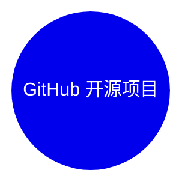

# GitHub 开源项目深度解析 (2026-08-01)

## 前面介绍

- 抓取来源：GitHub Trending / Search API
- 项目数量：15
- 深度解析数量：0
- 目标：自动筛出值得研究的开源项目，并给出结构、技术栈、运行方式和源码线索。

## 树状图

## 深度解析

## 其余项目速览

### 1. xai-org/grok-build
- **仓库**: [xai-org/grok-build](https://github.com/xai-org/grok-build)
- **描述**: SpaceXAI's coding agent harness and TUI. Fullscreen, mouse interactive, extensible.
- **语言**: Rust
- **Star**: 23705 | **Fork**: 4506 | **更新**: 2026-08-01

### 2. Fei-Away/Codex-Dream-Skin
- **仓库**: [Fei-Away/Codex-Dream-Skin](https://github.com/Fei-Away/Codex-Dream-Skin)
- **描述**: Codex Dream Skin
- **语言**: JavaScript
- **Star**: 12890 | **Fork**: 1288 | **更新**: 2026-08-01

### 3. andrewyng/openworker
- **仓库**: [andrewyng/openworker](https://github.com/andrewyng/openworker)
- **语言**: Python
- **Star**: 11340 | **Fork**: 1522 | **更新**: 2026-08-01

### 4. img2threejs/img2threejs
- **仓库**: [img2threejs/img2threejs](https://github.com/img2threejs/img2threejs)
- **描述**: Rebuild the object in a reference image as a code-only, procedural, quality-gated, animation-ready Three.js model. Token-efficient image-to-3D.
- **语言**: Python
- **Star**: 8786 | **Fork**: 663 | **更新**: 2026-08-01

### 5. unicity-aos/aos-ce
- **仓库**: [unicity-aos/aos-ce](https://github.com/unicity-aos/aos-ce)
- **描述**: AOS Community Edition: the open agent operating system.
- **语言**: Rust
- **Star**: 8576 | **Fork**: 16 | **更新**: 2026-07-31

### 6. openai/codex-security
- **仓库**: [openai/codex-security](https://github.com/openai/codex-security)
- **描述**: OpenAI's Codex Security CLI and TypeScript SDK for finding, validating, and fixing security vulnerabilities. npm: https://www.npmjs.com/package/@openai/codex-security
- **语言**: TypeScript
- **Star**: 7821 | **Fork**: 513 | **更新**: 2026-08-01

### 7. MoonshotAI/Kimi-K3
- **仓库**: [MoonshotAI/Kimi-K3](https://github.com/MoonshotAI/Kimi-K3)
- **描述**: Open Frontier Intelligence
- **Star**: 7724 | **Fork**: 536 | **更新**: 2026-08-01

### 8. x4gKing/X4G
- **仓库**: [x4gKing/X4G](https://github.com/x4gKing/X4G)
- **语言**: Python
- **Star**: 7185 | **Fork**: 13156 | **更新**: 2026-08-01

### 9. oso95/scroll-world
- **仓库**: [oso95/scroll-world](https://github.com/oso95/scroll-world)
- **描述**: A skill that turn any brand into a scrollable 3D world
- **语言**: JavaScript
- **Star**: 6172 | **Fork**: 732 | **更新**: 2026-08-01

### 10. MDX-Tom/gpt-5.6-instruct
- **仓库**: [MDX-Tom/gpt-5.6-instruct](https://github.com/MDX-Tom/gpt-5.6-instruct)
- **描述**: A Codex jailbreak prompt and test pack for gpt-5.6-sol. 针对 gpt-5.6 系列的 Codex 破甲提示词与测试包。
- **语言**: Python
- **Star**: 4076 | **Fork**: 625 | **更新**: 2026-08-01

### 11. withmarbleapp/os-taxonomy
- **仓库**: [withmarbleapp/os-taxonomy](https://github.com/withmarbleapp/os-taxonomy)
- **语言**: JavaScript
- **Star**: 3754 | **Fork**: 647 | **更新**: 2026-08-01

### 12. petergyang/no-ai-slop
- **仓库**: [petergyang/no-ai-slop](https://github.com/petergyang/no-ai-slop)
- **描述**: Removes 20+ patterns of AI slop from any piece of writing.
- **语言**: Python
- **Star**: 3667 | **Fork**: 287 | **更新**: 2026-08-01

### 13. nyblnet/bento
- **仓库**: [nyblnet/bento](https://github.com/nyblnet/bento)
- **描述**: Bento, the office suite that fits in a file
- **语言**: TypeScript
- **Star**: 3325 | **Fork**: 215 | **更新**: 2026-08-01

### 14. digimata/quill
- **仓库**: [digimata/quill](https://github.com/digimata/quill)
- **描述**: Ultra-minimalist macOS recording + transcription.
- **语言**: Swift
- **Star**: 3270 | **Fork**: 196 | **更新**: 2026-08-01

### 15. Vincentwei1021/video-shotcraft
- **仓库**: [Vincentwei1021/video-shotcraft](https://github.com/Vincentwei1021/video-shotcraft)
- **描述**: AI video skill for Claude Code & Codex — cinematic product videos with Remotion: 106 shot recipe cards, 161 motion previews, a production-ready template
- **语言**: TypeScript
- **Star**: 3039 | **Fork**: 258 | **更新**: 2026-08-01
