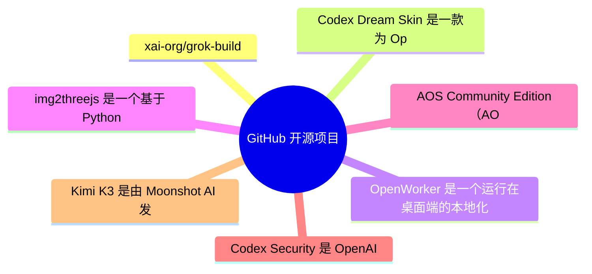
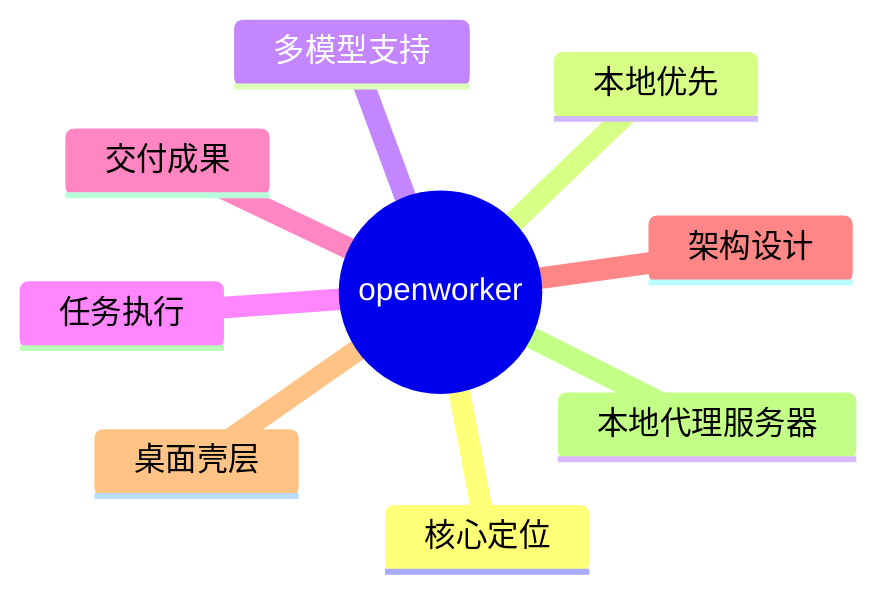
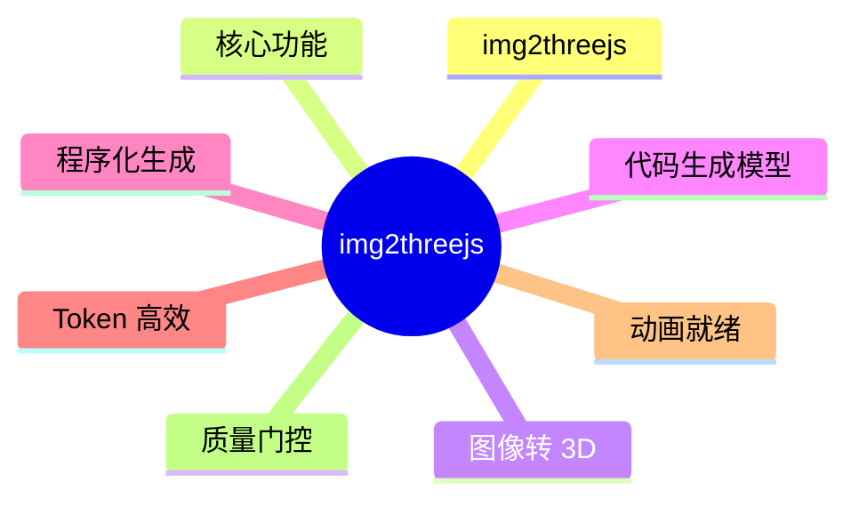
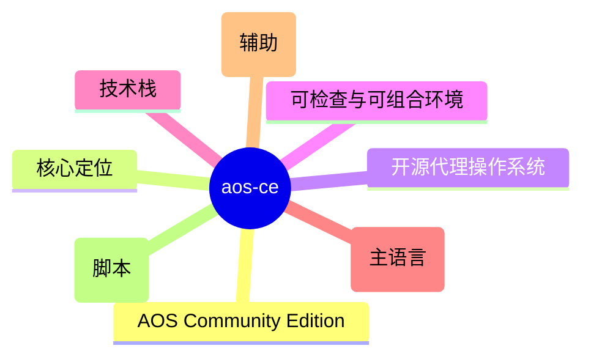
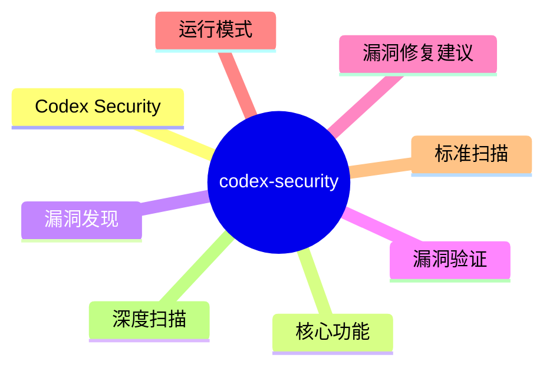

# GitHub 开源项目深度解析 (2026-08-02)

## 前面介绍

- 抓取来源：GitHub Trending / Search API
- 项目数量：15
- 深度解析数量：7
- 目标：自动筛出值得研究的开源项目，并给出结构、技术栈、运行方式和源码线索。

## 树状图



## 深度解析

### 1. grok-build
- **仓库**: [xai-org/grok-build](https://github.com/xai-org/grok-build)
- **语言**: Rust | **Star**: 23800 | **Fork**: 4520
- **更新**: 2026-08-02 | **License**: Apache-2.0

#### 源码

##### Cargo.toml

```toml
# Auto-generated workspace root. Prefer editing per-crate Cargo.toml files.

[patch.crates-io]
async-openai = { git = "https://github.com/our-forks/async-openai.git", rev = "95b52ebdedf42143083cf3d6f0e0be7c84e9c808" }

[workspace]
resolver = "2"
members = [
    "crates/build/xai-proto-build",
    "crates/codegen/ptyctl",
    "crates/codegen/ptyctl-cli",
    "crates/codegen/xai-acp-lib",
    "crates/codegen/xai-agent-lifecycle",
    "crates/codegen/xai-chat-state",
    "crates/codegen/xai-codebase-graph",
    "crates/codegen/xai-crash-handler",
    "crates/codegen/xai-fast-worktree",
    "crates/codegen/xai-file-utils",
    "crates/codegen/xai-fsnotify",
    "crates/codegen/xai-gix-status",
    "crates/codegen/xai-grok-agent",
    "crates/codegen/xai-grok-announcements",
    "crates/codegen/xai-grok-auth",
    "crates/codegen/xai-grok-config",
    "crates/codegen/xai-grok-config-types",
    "crates/codegen/xai-grok-env",
    "crates/codegen/xai-grok-extra-ca",
    "crates/codegen/xai-grok-hooks",
    "crates/codegen/xai-grok-http",
    "crates/codegen/xai-grok-markdown",
    "crates/codegen/xai-grok-markdown-core",
    "crates/codegen/xai-grok-mcp",
    "crates/codegen/xai-grok-memory",
    "crates/codegen/xai-grok-mermaid",
    "crates/codegen/xai-grok-models",
    "crates/codegen/xai-grok-pager",
    "crates/codegen/xai-grok-pager-bin",
    "crates/codegen/xai-grok-pager-minimal",
    "crates/codegen/xai-grok-pager-pty-harness",
    "crates/codegen/xai-grok-pager-render",
    "crates/codegen/xai-grok-paths",
    "crates/codegen/xai-grok-plugin-marketplace",
    "crates/codegen/xai-grok-sampler",
    "crates/codegen/xai-grok-sampling-types",
    "crates/codegen/xai-grok-sandbox",
    "crates/codegen/xai-grok-secrets",
    "crates/codegen/xai-grok-shared",
    "crates/codegen/xai-grok-shell",
    "crates/codegen/xai-grok-shell-base",
    "crates/codegen/xai-grok-shell-session-support",
    "crates/codegen/xai-grok-subagent-resolution",
    "crates/codegen/xai-grok-telemetry",
    "crates/codegen/xai-grok-test-support",
    "crates/codegen/xai-grok-tools",
    "crates/codegen/xai-grok-tools-api",
    "crates/codegen/xai-grok-update",
    "crates/codegen/xai-grok-version",
    "crates/codegen/xai-grok-voice",
    "crates/codegen/xai-grok-workspace",
    "crates/codegen/xai-grok-workspace-client",
    "crates/codegen/xai-grok-workspace-types",
    "crates/codegen/xai-hooks-plugins-types",
    "crates/codegen/xai-hunk-tracker",
    "crates/codegen/xai-mixpanel",
    "crates/codegen/xai-prompt-queue",
    "crates/codegen/xai-ratatui-inline",
    "crates/codegen/xai-ratatui-textarea",
    "crates/codegen/xai-sqlite-journal",
    "crates/codegen/xai-system-power",
    "crates/codegen/xai-token-estimation",
    "crates/codegen/xai-tracing-macros",
    "crates/codegen/xai-tty-utils",
    "crates/codegen/xai-workflow",
    "crates/common/xai-circuit-breaker",
    "crates/common/xai-computer-hub-core",
    "crates/common/xai-computer-hub-mcp-adapter",
    "crates/common/xai-computer-hub-sdk",
    "crates/common/xai-grok-compaction",
    "crates/common/xai-interjection-core",
    "crates/common/xai-test-utils",
    "crates/common/xai-tool-protocol",
    "crates/common/xai-tool-runtime",
    "crates/common/xai-tool-types",
    "crates/common/xai-tracing",
    "prod/mc/cli-chat-proxy-types",
    "third_party/dagre_rust",
    "third_party/graphlib_rust",
    "third_party/mermaid-to-svg",
    "third_party/ordered_hashmap",
]

[workspace.package]
edition
```

##### README.md

```md
<div align="center">

<h1>
  <picture>
    <source media="(prefers-color-scheme: dark)" srcset="https://media.x.ai/v1/website/spacexai-symbol-white-transparent-0c31957f.png">
    <source media="(prefers-color-scheme: light)" srcset="https://media.x.ai/v1/website/spacexai-symbol-black-transparent-6435cf42.png">
    
  </picture>
  <br>
  Grok Build (<code>grok</code>)
</h1>

**Grok Build** is SpaceXAI's terminal-based AI coding agent. It runs as a
full-screen TUI that understands your codebase, edits files, executes shell
commands, searches the web, and manages long-running tasks — interactively,
headlessly for scripting/CI, or embedded in editors via the Agent Client
Protocol (ACP).

[Installing the released binary](#installing-the-released-binary) ·
[Building from source](#building-from-source) ·
[Documentation](#documentation) ·
[Repository layout](#repository-layout) ·
[Development](#development) ·
[Contributing](#contributing) ·
[License](#license)


**Learn more about Grok Build at [x.ai/cli](https://x.ai/cli)**

This repository contains the Rust source for the `grok` CLI/TUI and its agent
runtime. It is synced periodically from the SpaceXAI monorepo.

A small `SOURCE_REV` file at the root records the full monorepo commit SHA
for the version of the code present in this tree.

</div>

---

## Installing the released binary

Prebuilt binaries are published for macOS, Linux, and Windows:

```sh
curl -fsSL https://x.ai/cli/install.sh | bash   # macOS / Linux / Git Bash
irm https://x.ai/cli/install.ps1 | iex          # Windows PowerShell
grok --version
```

See the [changelog](https://x.ai/build/changelog) for the latest fixes,
features, and improvements in each release.

## Building from source

Requirements:

- **Rust** — the toolchain is pinned by [`rust-toolchain.toml`](rust-toolchain.toml);
  `rustup` installs it automatically on first build.
- **[DotSlash](https://dotslash-cli.com)** — required so hermetic tools under
  [`bin/`](bin/) (notably [`bin/protoc`](bin/protoc)) can download and run.
  Install it and ensure `dotslash` is on your `PATH` **before** building:

  ```sh
  cargo install dotslash
  # or: prebuilt packages — https://dotslash-cli.com/docs/installation/
  /usr/bin/env dotslash --help   # sanity check
  ```

- **protoc** — proto codegen resolves [`bin/protoc`](bin/protoc) via DotSlash,
  or falls back to a `protoc` on `PATH` / `$PROTOC`.
- macOS and Linux are supported build hosts; Windows builds are best-effort
  and not currently tested from this tree.

```sh
cargo run -p xai-grok-pager-bin              # build + launch the TUI
cargo build -p xai-grok-pager-bin --release  # release binary: target/release/xai-grok-pager
cargo check -p xai-grok-pager-bin            # fast validation
```

The binary artifact is named `xai-grok-pager`; official installs ship it as
`grok`. On first launch it opens your browser to authenticate — see the
[authentication guide](crates/codegen/xai-grok-pager/docs/user-guide/02-authentication.md).

## Documentation

Full online documentation is available at
[docs.x.ai/build/overview](https://docs.x.ai/build/overview).

The user guide ships with the pager crate:
[`crates/codegen/xai-grok-pager/docs/user-guide/`](crates/codegen/xai-grok-pager/docs/user-guide/)
— getting started, keyboard sho
```

##### crates/build/xai-proto-build/Cargo.toml

```toml
[package]
license = "Apache-2.0"
description = "Build protobuf"
edition.workspace = true
name = "xai-proto-build"
version = "0.0.0"

[lints]
workspace = true

[dependencies]
anyhow = { workspace = true }
pbjson-build = { workspace = true }
prost-build = { workspace = true }
tempfile = { workspace = true }
tonic-prost-build = { workspace = true }

```

##### crates/codegen/ptyctl-cli/Cargo.toml

```toml
[package]
license = "Apache-2.0"
name = "ptyctl-cli"
version = "0.1.0"
edition.workspace = true
description = "CLI for ptyctl headless PTY controller"
publish = false

[[bin]]
name = "ptyctl"
path = "src/main.rs"

[dependencies]
ptyctl = { path = "../ptyctl" }
axum = { workspace = true }
clap = { workspace = true, features = ["derive"] }
reqwest = { workspace = true, features = ["json"] }
tokio = { workspace = true, features = ["full"] }
serde = { workspace = true, features = ["derive"] }
serde_json = { workspace = true }
anyhow = { workspace = true }
env_logger = { workspace = true }
chrono = { workspace = true, features = ["serde"] }
dirs = { workspace = true }

```

### 2. Codex-Dream-Skin
- **仓库**: [Fei-Away/Codex-Dream-Skin](https://github.com/Fei-Away/Codex-Dream-Skin)
- **语言**: JavaScript | **Star**: 12946 | **Fork**: 1293
- **更新**: 2026-08-02 | **License**: 未知

#### 前面介绍

- Codex Dream Skin 是一款为 OpenAI Codex 桌面端应用提供外部主题换肤功能的工具。它通过本地回环 CDP（Chrome DevTools Protocol）注入技术，在不修改官方安装包、app.asar 或应用签名的前提下，为 Codex 添加自定义背景图、主题色和 Safe CSS 样式。项目支持 macOS 和 Windows 平台，拥有官方主题库 DreamSkin.cc，提供在线 Studio 编辑器和一键换肤功能，旨在为开发者提供更具氛围感的代码工作环境。

#### 树状图


#### 文字描述

- 注入引擎
- 通过本地回环 CDP 连接 Codex 进程
- 验证 Codex 签名与 Team ID
- 注入 CSS 到 app:// 渲染进程
- 管理渲染进程生命周期
- 主题管理器
- 解析 theme.json 与 theme.css
- 校验背景图尺寸与格式

#### 运行方式

- 普通用户安装
- 下载 GitHub Releases 中的 DMG 或 Setup.exe
- 安装并退出官方 Codex 一次
- 拖入 Applications 或运行安装向导
- 首次运行需在系统设置中放行未签名应用
- 源码安装 (高级)

#### 项目亮点

- 非官方产品，不修改核心文件
- 支持 macOS Ventura 及以上和 Windows 10
- 拥有功能完善的在线主题库与创作平台
- 内置安全边界：原生确认、SHA-256 校验、Safe CSS 限制
- 支持一键换肤，无需手动下载导入
- 提供详细的 theme.json 规范与投稿指南

#### 代码解析

- macos/README.md：详细说明了 Studio 的安装路径、运行要求、脚本命令以及安全边界机制。
- macos/presets/README.md：定义了预设主题的结构规范，包括 theme.json 字段全解、调色板说明、素材红线以及投稿指南。
- windows/README.md：说明了 Windows 平台的安装流程、托盘功能、文件位置以及验证脚本的使用方法。
- macos/package.json：定义了项目的 Node.js 版本要求（>=20）和测试脚本。
- README.md：项目总览，介绍了核心功能、主题库链接、一键换肤流程以及实测精选预设。
- 注入机制：通过本地 CDP 注入，仅作用于预期的 app:// 渲染目标，并保持注入器存活。
- 安全校验：在注入前对背景图进行尺寸和大小限制，对主题包进行完整性校验。
- 配置管理：支持配置备份与恢复，确保换肤失败时能回滚到官方外观。

#### 源码

##### README.md

```md
# Codex Dream Skin

<p align="center">
  <strong>中文</strong> · <a href="./README.en.md">English</a>
</p>

<p align="center">
  <strong>给 Codex 桌面端换一张会呼吸的脸。</strong><br>
  外部主题 / 换肤工具 · 本机 CDP 注入 · 不改官方安装包
</p>

<p align="center">
  一张图，一种心情 · 写代码，也要有氛围感
</p>

<p align="center">
  官方主题库：<a href="https://dreamskin.cc"><strong>DreamSkin.cc</strong></a> ·
  <a href="https://dreamskin.cc/gallery">主题库 Gallery</a> ·
  <a href="https://dreamskin.cc/studio">在线 Studio</a>
</p>

<p align="center">
  非 OpenAI 官方产品。不修改 <code>.app</code> / <code>app.asar</code> / WindowsApps。
</p>

## 🤝 独家赞助

<table>
<tr>
<td width="180">
<a href="https://passion8.cc/sign-up?aff=ZgLT"></a>
</td>
<td>
感谢 Passion8 独家赞助本项目！Passion8 是一家面向开发者的 AI API 中转服务商，为个人开发者与团队提供稳定、低成本的主流大模型接入。<br><br>
<strong>满血 AI · 触手可及</strong>：OpenAI、Claude 全系列原版模型，无降智、无套壳；使用前沿 AI 模型仅需官方价格的一小部分，充值 1:1，<strong>1$ = 1¥</strong>。保留原有官方 SDK，只把 Base URL 换成 Passion8，Claude Code、Codex、Grok 以及任意 OpenAI 兼容客户端都能直接跑——一行配置，代码不用改。
<strong>全球节点加速</strong>：Cloudflare 全球边缘 + 多线路 BBR 加速，低延迟、高可用、稳定如一；7×24 稳定中转，99.9% SLA，首 Token 目标 1 秒内。
<strong>安全可靠</strong>：独立 API Key、密钥加密存储、全链路 HTTPS，隐私优先。<br><br>
Passion8 为本项目用户准备了专属福利：通过<a href="https://passion8.cc/sign-up?aff=ZgLT">此链接</a>注册，首次充值自动赠送 10% 额度，无需申请，30 分钟内到账。有问题联系 <a href="mailto:support@passion8.cc">support@passion8.cc</a>。
</td>
</tr>
</table>

<sub>换肤与 API 配置互相独立，本项目不会自动改写你的模型供应商设置。</sub>

## 直接安装

普通用户只需先安装并退出一次官方 Codex / ChatGPT，然后从
[GitHub Releases](https://github.com/Fei-Away/Codex-Dream-Skin/releases) 下载：

- macOS：打开 `CodexDreamSkin-vX.Y.Z.dmg`，把 App 拖进 Applications。
- Windows：双击 `CodexDreamSkin-Setup-vX.Y.Z.exe`，按安装向导完成。

不需要 clone 源码、安装 Node.js 或手动运行 `.sh` / `.ps1`。首次未签名放行、更新和卸载步骤见
[macOS 安装说明](./docs/install-macos.md) / [Windows 安装说明](./docs/install-windows.md)。

## 主题库与社区

<p align="center">
  <a href="https://dreamskin.cc">
    
  </a>
</p>

<p align="center">
  <strong>DreamSkin.cc</strong> · 本项目的官方主题库与创作平台<br>
  <sub>Make your workspace <em>yours.</em></sub>
</p>

<p align="center">
  <a href="https://dreamskin.cc/gallery"><strong>浏览主题库 →</strong></a>
  &nbsp;·&nbsp;
  <a href="https://dreamskin.cc/studio"><strong>在线 Studio →</strong></a>
</p>

- [**主题库 Gallery**](https://dreamskin.cc/gallery)：浏览社区已审核的主题，支持最新 / 热门排序和创作者榜单。
  每套主题都能先在网页里的桌面模拟器中试穿，再决定装不装。

<p align="center">
  <a href="https://dreamskin.cc/gallery">
    
  </a><br>
  <sub>社区主题「晨雾山水」的在线试穿 · 首页/任务页、宽窄窗口、侧栏展开收起都能当场切，满意了再一键换肤或下载主题包</sub>
</p>

- [**在线 Studio**](https://dreamskin.cc/studio)：在浏览器里换背景图、调主题色、写 Safe CSS，导出 `.zip` 主题包，
  也可以直接投稿到主题库（需登录，经人工审核后公开）。

<p align="center">
  <a href="https://dreamskin.cc/studio">
    
  </a><br>
  <sub>在线 Studio · 左侧实时预览，右侧调背景图、外观焦点与配色；主题库里任意一套主题都能一键载入继续改</sub>
</p>

macOS 菜单栏和 Windows 托盘都有「主题库 Gallery」和「在线 Studio」入口，可以直接打开。

### 一键换肤

在 DreamSkin.cc 上看到喜欢的主题，点「一键换肤」就能让本机客户端直接装上，不用先下载再手动导入。
需要 v1.5.0 或更新的客户端（建议 v1.5.5 及以上）。

流程与安全边界：

- 网页通过 `dreamskin://apply?version=ver_...` 唤起本机 App。链接只能携带一个主题版本 ID，**不能**携带
  任意 URL、文件路径或命令，也不存在静默应用参数。
- App 只向固定的官方 API 取包，并拒绝重定向。
- 换肤前弹出原生确认框，并核对该版本的审核状态、一键兼容标记、版本号、包大小、实际下载字节数和 SHA-256。
- 通过后复用与手动导入完全相同的 ZIP、manifest、图片与 Safe CSS 校验。
- 只有真实渲染进程确认新主题已生效才算成功。启动或渲染失败会自动尝试恢复换肤前的主题，恢
```

##### macos/README.md

```md
# Codex Dream Skin Studio

Unofficial macOS theme studio for the **official Codex Desktop** app.

Turn an image you like into one continuous full-window Codex theme. The same wallpaper runs beneath the native sidebar and main surface, while route-aware translucency keeps home, task, plugin, scheduled-task, and pull-request controls fully interactive and readable.

This project injects through **local loopback CDP**. It does **not** modify the official `.app`, `app.asar`, or code signature.

> Not affiliated with OpenAI. Codex is a trademark of its respective owners.

## Requirements

- macOS 13 Ventura or newer (the native DMG app declares macOS 13 as its minimum)
- Official Codex Desktop installed and launched at least once (`~/.codex/config.toml` exists)
- No global Node.js install required (uses Codex’s signed bundled Node after validation)

## Release install (recommended)

普通用户请从 [GitHub Releases](https://github.com/Fei-Away/Codex-Dream-Skin/releases) 下载
`CodexDreamSkin-vX.Y.Z.dmg`，按 [`docs/install-macos.md`](../docs/install-macos.md) 的图形界面步骤
拖入 Applications。首次运行可能需要在“系统设置 → 隐私与安全性 → 仍要打开”确认一次；不需要
运行 `xattr` 或安装源码。后续更新下载新的 DMG 覆盖安装即可，用户主题和图片会保留。

## Advanced: run from source

The Release DMG above is the normal user path. The commands below are for
contributors, diagnostics, and legacy deployments.

```bash
# 1) Optional checks (needs the installed Codex/ChatGPT.app bundled Node)
./tests/run-tests.sh

# 2) Install to the stable path and create Desktop launchers
./scripts/install-dream-skin-macos.sh --no-launch

# 3) Switch to the tested featured preset, or import your own pure background
~/.codex/codex-dream-skin-studio/scripts/switch-theme-macos.sh --id preset-arina-hashimoto
# ~/.codex/codex-dream-skin-studio/scripts/customize-theme-macos.sh

# 4) Start/re-apply, verify, or restore via Desktop:
#    Codex Dream Skin.command
#    Codex Dream Skin - Customize.command
#    Codex Dream Skin - Verify.command
#    Codex Dream Skin - Restore.command

# 5) Legacy only: install the old SwiftBar menu (do not enable it beside the native app)
./Install\ Menu\ Bar.command
# Look for 🎨 Skin in the top-right menu bar
```

Install location after step 2:

| Item | Path |
| --- | --- |
| Engine | `~/.codex/codex-dream-skin-studio` |
| State / logs / user images | `~/Library/Application Support/CodexDreamSkinStudio` |
| Theme backup | under Application Support (`theme-backup.json`) |

## Legacy standalone ZIP (maintainer/offline packaging only)

To build the “double-click install” folder layout for non-git users:

```bash
./scripts/build-client-release.sh "$HOME/Desktop/Codex 主题编辑器.zip"
```

That ZIP contains a visible installer plus a hidden `.codex-dream-skin-studio`
engine and is staged as a rights-clean package with only the redistributable
Gothic Void Crusade preset. It is retained for existing offline workflows;
prefer the DMG for ordinary users, and do not share a source checkout or an
archive containing the excluded Arina reference files. Do not ship only
CSS/images.

## How it works (security boundary)

1. Discover `com.openai.codex` and validate signature / Team ID / arch / bundled Node.
2. Start Codex via user `launchd` with CDP bound to `127.0.0.1` only.
3. Accept the debug port only when it belongs to Codex (or a legitimate child).
4. Inject only into expected `app://` renderer targets.
5. Resolve the selected theme and image to real paths, then enforce 10 MB,
   `16384px`-per-side, and 50-megapixel limits before injection.
6. Keep a s
```

##### macos/package.json

```json
{
  "name": "codex-dream-skin-studio",
  "version": "1.5.11",
  "private": true,
  "type": "module",
  "scripts": {
    "test": "./tests/run-tests.sh",
    "doctor": "./scripts/doctor-macos.sh"
  },
  "engines": {
    "node": ">=20"
  }
}

```

##### macos/presets/README.md

```md
# 预设主题 · Preset packs

这个目录放 **Codex Dream Skin 的内置预设主题**。安装时 `install-dream-skin-macos.sh` 会把每个 `preset-*/` 幂等地播种到用户主题库 `~/Library/Application Support/CodexDreamSkinStudio/themes/`，装完即可在**菜单栏「已保存的主题」**或 `switch-theme-macos.sh --id <id>` 里直接切换。

> This folder holds the bundled preset themes. Install seeds each `preset-*/` into the user theme library, so a fresh install ships with ready-to-use skins.

## 内置实测预设

当前内置 `preset-gothic-void-crusade/`（Gothic Void Crusade）与
`preset-arina-hashimoto/`（桥本有菜 / Arina Hashimoto）两套实机验证主题。
前者是社区作者提供的原创哥特科幻背景；后者使用一张
`2560 × 1440`（16:9）纯背景：左侧低信息留白承载 Codex 原生标题，人物和花卉主视觉集中在右侧。浅色与暗色截图均来自真实 Codex 注入，不是 AI 绘制的整窗 UI。

来源尺寸必须如实区分：归档的用户源图（不随 preset 播种）是 `1672 × 941` PNG；preset 内的 `background.jpg` 保持其近 16:9 构图，标准化导出为 `2560 × 1440` JPEG，并不代表补回或新增了源图细节。派生文件使用 `sips -z 1440 2560 -s format jpeg -s formatOptions 90` 生成。

- 可导入/可播种的主题素材只有 [`background.jpg`](./preset-arina-hashimoto/background.jpg) 与 [`theme.json`](./preset-arina-hashimoto/theme.json)。
- 用户提供的 byte-identical 源 PNG 单独归档在 [`docs/images/presets/arina-hashimoto-source.png`](../../docs/images/presets/arina-hashimoto-source.png)，不放进 preset pack，因此不会被安装脚本播种为多余文件。
- 当前浅色、暗色实测文档截图均为 `2308 × 1572` Retina JPEG（CSS viewport `1154 × 786`），来自同一真实 Codex 首页；为保护未发送草稿，截图时仅用临时本地样式隐藏输入文字并收起编辑区，没有修改草稿内容或伪造皮肤效果。它们包含真实侧栏、项目工具栏和输入框，**只作预览，绝不能当背景导入**。
- 背景是用户提供的 AI 生成示例，不代表 OpenAI/Codex 官方视觉或背书；公开分发前仍需确认人物、模型输出与素材使用权。
- 该维护者提供的精选预设是单独记录的发行例外，不纳入 MIT 软件许可；文件清单和限制见 [`../NOTICE.md`](../NOTICE.md)。这不表示以后可以提交其他可识别真人素材。

安装后可直接切换：

```bash
~/.codex/codex-dream-skin-studio/scripts/switch-theme-macos.sh \
  --id preset-arina-hashimoto
```

## 一套预设的结构

```
preset-<slug>/
├── theme.json        # schemaVersion 1，与 assets/theme.json 同一格式
└── background.jpg    # 背景图（横向，JPEG）
```

- 目录名与 `theme.json` 的 `id` **必须**都是 `preset-<slug>` 形式（`slug` 用小写英文 + 连字符）。播种只管理 `preset-*`，绝不会碰用户自己「换一张图」保存的 `custom-*` 主题。
- `image` 字段只能是**本目录内**的文件名（不能是路径），格式 `png` / `jpg` / `jpeg` / `webp`，≤ 10 MB（建议 < 1 MB）。
- `appearance` **必须如实声明背景图成立的模式**（这是规范，不是可选项）：
  - `"auto"`——仅限浅色、暗色外壳下都协调的图，且两种模式都实测过。皮肤跟随 Codex 客户端的浅暗设置切换外壳。
  - `"dark"` / `"light"`——单模专属图（如深色大教堂、纯白极简）。皮肤外壳固定为该模式，不随客户端切换。
  - 暗色专属画作声明 `auto` 是缺陷不是偏好：客户端处于浅色时，Codex 原生组件（差异卡片、任务条等）按浅色渲染，会与暗图直接打架（#134 曾因此返修）。拿不准就按图的实际明暗写死，不要照抄模板默认值。
- 人物/场景背景优先提交 `2560 × 1440`（16:9）母版；主视觉放在右侧约 58%～88%，左侧约 50%～58% 保持低信息、低对比。禁止把效果截图、窗口 mockup 或任何带 UI 的图片命名为 `background.*`。

## theme.json 字段全解（投稿必读）

以 `preset-gothic-void-crusade/theme.json` 为参考模板。除标注「可选」外均建议如实填写；文案留空会退回内置默认值，不会报错但会显得敷衍。

### 文案字段（界面哪里能看到）

| 字段 | 显示位置 |
| --- | --- |
| `name` | 首页标题上方的主题名眉标（强调色小字） |
| `tagline` | 首页标题下方一行副标语 |
| `quote` | 首页右下角手写体口号（斜排，随强调色） |
| `brandSubtitle` / `statusText` | 皮肤 chrome 的品牌角标与状态文案（部分布局下隐藏） |
| `projectPrefix` / `projectLabel` | 「选择项目」按钮的前缀与占位文案 |
| `promoTitle` / `promoSub` / `promoUrl` | 分享/宣传场景使用，可选 |

### colors 调色板（键 → 界面用途）

所有键都会被注入为主题变量，整套皮肤 UI 跟着走：

| 键 | 用途 |
| --- | --- |
| `background` | 整窗兜底底色（背景图未盖住的区域、body 底） |
| `panel` / `panelAlt` | 半透明面板底：侧栏、卡片、composer、右侧工具面板的毛玻璃都从它调透明度 |
| `accent` / `accentAlt` | 强调色：建议卡圆圈与图标、主题名眉标、口号、状态点、聚焦描边 |
| `secondary` / `highlight` | 次强调/高亮（粒子、渐变、hover 等点缀） |
| `text` | 正文字色（标题、卡片文字都强制跟随） |
| `muted` | 次要文字与大多数描边（卡片/面板边框按它调透明度） |
| `line` | 分隔线与细描边 |

- 颜色必须与背景图协调：`accent` 建议直接从画面主体取色（Gothic 取的是烛金 `#c8a55a`）。
- 声明 `appearance: dark` 的主题请给暗底亮字；`light` 反之；`auto` 主题两种模式都要自查对比度。

### art 元数据

`art.focusX` / `art.focusY`（`0..1`，画面主体位置）、`art.safeArea`（`auto | left | right | center | none`，低信息留白侧）、`art.taskMode`（`auto | ambient |
```

### 3. openworker
- **仓库**: [andrewyng/openworker](https://github.com/andrewyng/openworker)
- **语言**: Python | **Star**: 11603 | **Fork**: 1566
- **更新**: 2026-08-02 | **License**: MIT

#### 前面介绍

- OpenWorker 是一个运行在桌面端的本地化 AI 助手，旨在作为用户的‘数字同事’完成实际任务而非仅仅进行对话。它通过本地 Python 服务器连接用户的文件、终端和第三方应用（如 Slack、GitHub、Jira），利用用户提供的 API 密钥调用多种大模型（包括本地 Ollama），在执行关键操作前请求用户批准，最终交付完成的文档、报告或自动化结果。

#### 树状图



#### 文字描述

- 桌面应用层：负责原生 GUI 和本地服务通信，处理文件系统和系统调用。
- 本地代理服务器：基于 Python 的核心引擎，运行在用户机器上，负责任务拆解、工具调用和审批逻辑。
- 工具连接器层：提供 25+ 个集成接口，包括 GitHub、Slack、Jira 等，以及终端和文件访问，支持 MCP 协议扩展。
- 模型层：支持 OpenAI、Anthropic、Google、Ollama 等多种模型，通过 aisuite 统一接口调用，数据不离开本地。
- 存储层：使用 SQLite 存储对话历史、记忆和配置，确保本地化运行。
- API 网关：提供 OpenAI 兼容的接口和 WebSocket 会话流，供前端或其他客户端调用。
- 自动化调度器：支持定时任务和周期性监控，将运行结果和日志记录回应用。

#### 运行方式

- 环境要求：需要安装 Python 3.10+、Node 20+ 以及 Rust 工具链（用于桌面壳层构建）。
- 克隆仓库：执行 `git clone https://github.com/andrewyng/openworker` 进入项目目录。
- 初始化环境：运行 `bash packaging/setup_dev_env.sh` 创建 Python 虚拟环境。
- 启动服务：在虚拟环境中执行 `openworker-server` 命令启动本地代理服务器。
- 配置模型：在应用中添加 API 密钥或配置本地 Ollama 服务。
- 安装依赖：根据需要安装可选依赖，如浏览器自动化（`browser`）、消息监听（`messaging`）等。

#### 项目亮点

- 真正的任务执行者：不仅生成文本，还能创建文件、发送消息、更新日历并交付最终成果。
- 完全本地化：所有数据（对话、密钥、配置）均存储在本地，仅通过用户选择的模型和集成进行数据交互。
- 多模型兼容：支持 OpenAI、Anthropic、Google Gemini 以及本地 Ollama，用户可自由切换。
- 安全审批机制：在发送消息或执行命令前，系统会弹出审批窗口，用户可决定批准或拒绝。
- 丰富的集成生态：内置 25+ 个应用连接器，支持 GitHub、Slack、Jira 等主流工具，并支持 MCP 协议扩展。
- 自动化支持：支持定时任务和周期性监控，适合处理重复性工作。

#### 代码解析

- coworker/server/app.py：核心 API 服务，提供 OpenAI 兼容的 `/v1/chat/completions` 端点和 WebSocket 会话管理，包含严格的 CORS 和流量限制以保障安全。
- coworker/tui/app.py：基于 Textual 的终端用户界面，实现了审批模态框和事件流渲染，支持键盘快捷键进行操作决策。
- pyproject.toml：定义了项目的依赖关系，核心依赖包括 FastAPI、Textual、aisuite 和 MCP 客户端，并提供了可选的浏览器自动化和消息监听扩展。
- stt/Cargo.toml：Rust 项目的配置文件，定义了离线语音转文本引擎 `ocw-stt` 的依赖，使用 whisper-rs 实现本地音频处理。
- coworker/agent.py：构建代码引擎的核心模块，负责初始化代理、管理会话和协调工具调用。
- coworker/connectors/：包含所有第三方应用集成的适配器，如 GitHub、Slack、Gmail 等，以及 MCP 客户端实现。
- coworker/memory/：负责存储和管理对话上下文，使用 SQLite 作为后端存储。
- coworker/automation/：包含自动化任务的调度器和模型定义，支持基于 cron 的定时任务执行。

#### 源码

##### README.md

```md
# OpenWorker

**[openworker.com](https://openworker.com)** · [Download](#download) · [Issues](https://github.com/andrewyng/openworker/issues)

<a href="https://trendshift.io/repositories/91434?utm_source=trendshift-badge&amp;utm_medium=badge&amp;utm_campaign=badge-trendshift-91434" target="_blank" rel="noopener noreferrer"></a>

> **Beta** - OpenWorker is in open beta: fully usable, updates itself, and we're actively polishing rough edges. [Issues](https://github.com/andrewyng/openworker/issues) welcome.

**AI that gets your everyday tasks done.** OpenWorker is an open-source AI coworker that lives on your desktop and delivers **finished work**, not just chat: a polished document, a Slack reply with the numbers, an updated calendar, a triaged inbox.

It runs on your machine and doesn't lock you into any model: bring your own API key for OpenAI, Anthropic, Google, or an open-weight provider, or run fully local with Ollama. Your data leaves your machine only through the model and integrations *you* choose.

[](https://openworker.com)

## Download

[**⬇ macOS (Apple Silicon)**](https://download.openworker.com/mac)
<sub>macOS 12+ · signed & notarized · auto-updates</sub>

[**⬇ Windows 10/11 (x64)**](https://download.openworker.com/windows)
<sub>builds are not yet code-signed, so SmartScreen will warn; signing is in progress</sub>

Open the app, add a model key (or point it at Ollama), and ask for something real.

## How it works

1. Tell OpenWorker the outcome you want - "prepare a customer brief," "untangle my calendar," "draft a report," "check where the release stands across Jira and GitHub."
2. It breaks the task into steps and works across your desktop, files, and connected apps.
3. Before anything consequential - sending a message, changing a calendar, running a command - it checks in and you approve or redirect.
4. You get the finished deliverable, not a to-do list.

Under the hood:

```text
┌────────────────────────────────────────────────┐
│              OpenWorker desktop app            │  native shell + GUI
├────────────────────────────────────────────────┤
│           local agent server (Python)          │  engine · tools · connectors - built on aisuite
├───────────────┬────────────────┬───────────────┤
│  your files   │   your tools   │  your model   │  everything runs with your keys,
│  & terminal   │ 25+ connectors │  any provider │  on your machine
└───────────────┴────────────────┴───────────────┘
```

## What it can do

- **Produce real deliverables** - documents, spreadsheets, reports, and web pages land as files you can open and share.
- **Work from Slack** - mention `@OpenWorker` in a channel; a session opens on your desktop, the work happens with your tools, and the answer comes back as a thread reply.
- **Use your everyday tools** - 25+ integrations including GitHub, Slack, Jira, Notion, Linear, HubSpot, Outlook, monday.com, Gmail, and Google Calendar, plus your **terminal and local files**. Any tool reachable over [MCP](https://modelcontextprotocol.io/) plugs in too, with per-tool control.
- **Run on a schedule** - automations for recurring work: a morning brief, a weekly report, a standing watch over a channel. Runs land in the app with full transcripts.
- **Ask before acting** - writes, sends, and shell 
```

##### coworker/server/app.py

```py
"""FastAPI app — OpenAI-compatible endpoint + WS session API + REST.

The control plane every surface (GUI/IDE/messaging) rides on. The WS carries the engine
event stream and the approval channel; `/v1/chat/completions` is the OpenAI-compatible
proxy so any OpenAI-format client can use the runtime as a backend.
"""

from __future__ import annotations

import asyncio
import base64
import binascii
import json
import os
import re
import secrets
import uuid
from collections import deque
from contextlib import asynccontextmanager
from pathlib import Path
from typing import Any, Optional

from fastapi import FastAPI, Request, WebSocket, WebSocketDisconnect
from fastapi.middleware.cors import CORSMiddleware
from fastapi.responses import JSONResponse

# Origins allowed to talk to the local sidecar. It binds to 127.0.0.1, but a page in the
# user's own browser can still reach loopback — so without an origin gate, any website they
# visit could read `GET /v1/sessions` (CORS was `*`) and drive a session over the WS (which
# CORS never covers) into shell/file tools. We pin to the desktop webview's own origins
# (`tauri://localhost`, Windows' `http(s)://tauri.localhost`) and localhost dev/browser
# builds. Requests with NO Origin header (curl, native clients, tests, server-to-server) are
# allowed — the gate targets browsers, which always attach an unforgeable Origin.
_ALLOWED_ORIGIN_RE = re.compile(
    r"^(tauri://localhost"
    r"|https?://localhost(:\d+)?"
    r"|https?://127\.0\.0\.1(:\d+)?"
    r"|https?://tauri\.localhost)$"
)


def _origin_allowed(origin: str | None) -> bool:
    """True if a browser Origin may use the API. Missing Origin (non-browser) passes."""
    return origin is None or bool(_ALLOWED_ORIGIN_RE.match(origin))


# Caps on inbound WebSocket traffic. The loopback socket is unauthenticated (any local
# process can reach it), so bound frames, messages, and per-connection request rate before
# building model content or starting a turn.
_WS_MAX_FRAME_BYTES = 16 * 1024 * 1024
_WS_RATE_LIMIT_COUNT = 30
_WS_RATE_LIMIT_WINDOW_SECONDS = 10.0
_MAX_MESSAGE_TEXT_CHARS = 200_000
_MAX_ATTACHMENTS_BYTES = 15_000_000  # leaves JSON overhead below the 16 MiB frame cap


def _json_value_size(value: Any) -> int:
    """Conservative UTF-8 size of parsed JSON without allocating another giant string."""
    if isinstance(value, str):
        return len(value.encode("utf-8"))
    if isinstance(value, dict):
        return sum(_json_value_size(k) + _json_value_size(v) for k, v in value.items())
    if isinstance(value, list):
        return sum(_json_value_size(v) for v in value)
    return 8  # numbers, booleans, null, separators


# Brand colors for the connector badge riding the ✓ (UX-DECISIONS §30). The GUI owns the
# real logos; this page must render offline with zero assets, so a colored initial stands in.
_BRAND_COLORS = {
    "slack": "#4A154B",
    "github": "#24292f",
    "hubspot": "#ff7a59",
    "gmail": "#ea4335",
    "google_calendar": "#4285f4",
}


def _browser_page(
    title: str, detail: str, *, ok: bool = True, error: str = "", connector: str = ""
) -> str:
    """The page shown in the user's browser at the end of a loopback flow (sign-in or
    connector callback) — one branded card (UX-DECISIONS §30): OCW mark, ok/fail icon
    (the connector's initial rides the ✓), the friendly detail, and the raw error
    preserved on failures (it's the debugging breadcrumb). Inline CSS, light/dark via
    prefers-color-scheme, no external
```

##### coworker/tui/app.py

```py
"""Textual TUI — the first surface. Renders the engine's event stream, routes approvals
to a modal, and supports a few slash commands. Talks to the engine in-process for now
(the OpenAI-compatible server is a later phase)."""

from __future__ import annotations

import json
from pathlib import Path
from typing import Any, Optional

from textual import work
from textual.app import App, ComposeResult
from textual.binding import Binding
from textual.containers import Horizontal, Vertical
from textual.screen import ModalScreen
from textual.widgets import Button, Footer, Header, Input, Label, RichLog, Static

from ..agent import build_code_engine
from ..engine import ApprovalOutcome, PermissionRequest
from ..events import Event, EventType
from ..conversations import ConversationStore
from ..memory import MemoryStore
from ..permissions import Mode
from ..providers import ProviderClient
from ..sessions import SessionRecord


def _short(value: Any, limit: int = 80) -> str:
    text = value if isinstance(value, str) else json.dumps(value, default=str)
    text = text.replace("\n", "\\n")
    return text if len(text) <= limit else text[: limit - 1] + "…"


class ApprovalScreen(ModalScreen[ApprovalOutcome]):
    BINDINGS = [
        Binding("y", "decide('once')", "Approve"),
        Binding("n", "decide('deny')", "Deny"),
        Binding("a", "decide('always_tool')", "Always tool"),
        Binding("c", "decide('always_command')", "Always cmd"),
    ]

    def __init__(self, request: PermissionRequest) -> None:
        super().__init__()
        self.request = request

    def compose(self) -> ComposeResult:
        r = self.request
        args = ", ".join(f"{k}={_short(v)}" for k, v in (r.arguments or {}).items())
        with Vertical(id="approval"):
            yield Label("Permission required", id="approval-title")
            yield Static(f"tool:   {r.tool_name}")
            yield Static(f"args:   {args or '(none)'}")
            yield Static(f"reason: {r.reason}")
            with Horizontal(id="approval-buttons"):
                yield Button("Approve (y)", id="once", variant="success")
                yield Button("Deny (n)", id="deny", variant="error")
                yield Button("Always tool (a)", id="always_tool")
                yield Button("Always cmd (c)", id="always_command")

    def on_button_pressed(self, event: Button.Pressed) -> None:
        self.dismiss(ApprovalOutcome(event.button.id))

    def action_decide(self, outcome: str) -> None:
        self.dismiss(ApprovalOutcome(outcome))


class CoworkerApp(App):
    CSS = """
    #log { border: round $primary 30%; padding: 0 1; }
    #prompt { dock: bottom; }
    #approval { padding: 1 2; border: thick $warning; background: $panel; width: 80%; }
    #approval-title { text-style: bold; color: $warning; }
    #approval-buttons { height: auto; padding-top: 1; }
    #approval-buttons Button { margin-right: 1; }
    """
    BINDINGS = [
        Binding("ctrl+c", "quit", "Quit"),
        Binding("escape", "interrupt", "Interrupt"),
    ]

    def __init__(
        self,
        *,
        workspace: str | Path,
        model: str = "gpt-5.6-sol",
        mode: Mode = Mode.INTERACTIVE,
        provider: Optional[ProviderClient] = None,
        memory_store: Optional[MemoryStore] = None,
        session_store: Optional[ConversationStore] = None,
        session_id: Optional[str] = None,
        resume_messages: Optional[list[dict]] = None,
    ) -> None:
        super().__init__()
 
```

##### pyproject.toml

```toml
[build-system]
requires = ["setuptools>=68"]
build-backend = "setuptools.build_meta"

[project]
name = "coworker"
version = "0.0.0"
description = "Agent coworker platform — provider-agnostic agentic coworker runtime"
requires-python = ">=3.10"
dependencies = [
    "openai>=1.0",
    "anthropic>=0.40",  # native Claude Messages API provider
    "google-genai>=1.0",  # native Gemini provider
    "google-auth>=2.23",  # Vertex credentials (service account / ADC / MaaS bearer)
    "textual>=1.0",
    "fastapi>=0.110",
    "uvicorn[standard]>=0.27",
    # aisuite (toolkits/tracing), pinned to the commit this repo was imported from;
    # swap for a PyPI pin ("aisuite>=x.y") once the next aisuite release ships.
    "aisuite @ git+https://github.com/andrewyng/aisuite.git@1b4bbf303ec21968230b1ec869a144d054e9b3c4",
    "docstring_parser",
    "pyyaml>=6",  # persona manifest frontmatter (YAML)
    "pydantic>=2",
    "mcp>=1.1,<2",  # MCP client (stdio + streamable-http); 2.0 removed streamablehttp_client
    "httpx>=0.27",  # sync outbound senders for messaging connectors (send_message tool)
    "websockets>=13",  # managed Slack relay client transport (relay_client.py)
    "ddgs>=9",  # keyless default web-search provider (DuckDuckGo); Tavily/Brave use httpx
    "croniter>=2",  # cron next-fire math for the automation scheduler
    # PDF attachments for models without native PDF support (pdf_support.py):
    # pypdf = pure-python text extraction; pypdfium2 = page rasterization (BSD pdfium,
    # ships its own libpdfium — NOT PyMuPDF, whose AGPL license can't ride in the DMG).
    "pypdf>=5",
    "pypdfium2>=4",
    # IANA tz database for zoneinfo. Windows ships no system tz db, so without this every
    # named schedule timezone (UTC, Asia/Kolkata, …) silently falls back to local time.
    "tzdata; sys_platform == 'win32'",
]

[project.optional-dependencies]
dev = ["pytest>=8", "pytest-asyncio", "httpx"]
# Inbound messaging listeners (outbound send_message needs only httpx, already a core dep).
# aiohttp is slack-bolt's Socket Mode transport at runtime (and the FakeSlack test harness
# drives the real handler) — declare it so CI installs it, not just transitively.
messaging = ["python-telegram-bot>=21", "slack-bolt>=1.18", "aiohttp>=3.9"]
# Interactive Cowork browser automation.
browser = ["playwright>=1.44"]
# AWS Bedrock provider (lazy-imported; desktop builds bundle it, pip users opt in).
bedrock = ["boto3>=1.34"]

[project.scripts]
openworker = "coworker.cli:main"
openworker-server = "coworker.server.run:main"
openworker-connectors = "coworker.connectors.cli:main"

[tool.setuptools.packages.find]
where = ["."]
include = ["coworker*"]

[tool.setuptools.package-data]
coworker = ["personas/builtin/*.md"]

[tool.pytest.ini_options]
testpaths = ["tests"]
asyncio_mode = "auto"

```

### 4. img2threejs
- **仓库**: [img2threejs/img2threejs](https://github.com/img2threejs/img2threejs)
- **语言**: Python | **Star**: 8946 | **Fork**: 683
- **更新**: 2026-08-02 | **License**: Apache-2.0
- **主题**: 3d、ai-agents、claude-code、computer-graphics、generative、image-to-3d、procedural-generation、threejs

#### 前面介绍

- img2threejs 是一个基于 Python 的开源工具，旨在将参考图像中的物体重建为纯代码生成的、程序化的 Three.js 3D 模型。该项目不依赖摄影测量、网格提取或下载的素材包，而是通过代码构建模型。生成的模型具有质量门控机制，支持动画，并且对 Token 高效。该项目特别针对 CS2（反恐精英 2）游戏中的武器和物品进行了深度优化，并提供了在线演示画廊。

#### 树状图



#### 文字描述

- 项目采用模块化设计，核心逻辑位于 `forge` 目录下。
- 主要分为文档规范层和工具链层。
- 文档规范层位于 `docs/specs/vocabulary`，定义了核心 3D 重建词汇表和 CS2 专用词汇表，使用 JSONL 格式存储结构化记录。
- CS2 专用文档位于 `docs/cs2`，包含技术映射、3D 词汇字典和审查门控文档。
- 工具链层位于 `forge` 目录，包含共享模块和阶段处理流程。
- Stage 1 输入处理模块负责分析纹理、提取特征、检测参考效果以及构建细节清单。
- 共享模块提供规范搜索、颜色度量、图像哈希和特性接受策略等功能。
- 整个系统设计为无第三方依赖，仅使用 Python 3.10+ 标准库，确保轻量化和可移植性。

#### 运行方式

- 项目使用 Python 3.10 或更高版本。
- 核心脚本位于 `forge` 目录，不依赖任何第三方库（如 Pillow, NumPy, OpenCV 等），仅使用标准库。
- 可以通过克隆仓库并运行相关脚本来启动流程。
- 项目支持通过 GitHub Actions 进行持续集成和发布。
- 需要配置 Python 环境并确保版本符合要求。
- 项目包含详细的文档和贡献指南，建议阅读 `CONTRIBUTING.md` 和 `ROADMAP.md`。

#### 项目亮点

- 纯代码重建：不使用网格文件或下载的素材，完全通过代码生成几何体和材质。
- Token 高效：针对大语言模型（LLM）的上下文窗口进行了优化，生成代码量少。
- 质量门控：包含严格的审查流程，确保生成的模型符合质量标准。
- CS2 专项优化：针对 CS2 游戏中的武器（如手枪、刀、手套）提供了详细的解剖学文档和 3D 映射。
- 在线演示：提供实时的交互式演示画廊，用户可以直接查看和操作生成的模型。
- 结构化数据：使用 JSONL 格式存储规范记录，支持本地规范搜索和验证。

#### 代码解析

- 核心工具链位于 `forge` 目录，主要包含 `next.py` 和 `report.py`。
- `forge/requirements.txt` 明确声明了零第三方依赖，仅使用标准库（json, argparse, struct, zlib, pathlib, math, subprocess）。
- `forge/_shared/` 目录包含可复用的共享模块，如 `spec_search.py` 用于加载和验证 JSONL 规范记录。
- `forge/stage1_intake/` 目录包含图像处理和分析逻辑，如 `analyze_texture.py` 分析纹理，`extract_landmarks.py` 提取关键点。
- `docs/specs/vocabulary/README.md` 定义了严格的规范记录格式，包含 `record_id`, `collection`, `domain`, `kind` 等字段，并规定了数据验证规则。
- `docs/cs2/` 目录下包含 `3D_Technical_Mapping.json` 和 `3D_Vocabulary_CS2.json`，为 CS2 物品的重建提供了技术参考和词汇字典。
- 项目通过 `docs/raw/img2threejs-skill-dataset.json` 存储原始数据集，支持后续的技能训练或数据挖掘。
- 构建流程通过 GitHub Actions 自动化，确保代码质量和版本一致性。

#### 源码

##### README.md

```md
<div align="center">


# img2threejs

**Rebuild the object in a reference image as a code-only, procedural Three.js model.**

Quality-gated, animation-ready, and deliberately token-efficient — reconstruction-by-code, not photogrammetry, mesh extraction, or downloaded art packs.

[](LICENSE)
[](https://github.com/img2threejs/img2threejs/releases)
[](CONTRIBUTING.md)
[](https://threejs.org)
[](scripts)
[](https://www.buymeacoffee.com/hoainhowors)

<table align="center">
  <tr>
    <td align="center"></td>
    <td align="center"><sub><b>DAILY</b></sub></td>
    <td align="center"><sub><b>WEEKLY</b></sub></td>
  </tr>
  <tr>
    <td align="right"><sub><b>Python</b></sub></td>
    <td><a href="https://trendshift.io/repositories/83608?utm_source=trendshift-badge&amp;utm_medium=badge&amp;utm_campaign=badge-trendshift-83608" target="_blank" rel="noopener noreferrer"></a></td>
    <td><a href="https://trendshift.io/repositories/83608?utm_source=trendshift-badge&amp;utm_medium=badge&amp;utm_campaign=badge-trendshift-83608" target="_blank" rel="noopener noreferrer"></a></td>
  </tr>
  <tr>
    <td align="right"><sub><b>All languages</b></sub></td>
    <td><a href="https://trendshift.io/repositories/83608?utm_source=trendshift-badge&amp;utm_medium=badge&amp;utm_campaign=badge-trendshift-83608" target="_blank" rel="noopener noreferrer"></a></td>
    <td><a href="https://trendshift.io/repositories/83608?utm_source=trendshift-badge&amp;utm_medium=badge&amp;utm_campaign=badge-trendshift-83608" target="_blank" rel="noopener noreferrer"></a></td>
  </tr>
</table>

</div>

*Reference images reconstructed in code as animation-ready Three.js models, running live in the browser.*

### [→ Open the Live Demo Gallery](https://img2threejs.github.io/img2threejs-showcase/)

Every model in the gallery is generated code, running in your browser. No mesh files, no downloads.

---

## Live demos

Reconstructions built entirely from primitives, procedural shaders, and generated geometry. Open any model to orbit it, inspect its reference, and read the generated source.

| Demo | Subject | View | Source |
| --- | --- | --- | --- |
| Glock-18 · Ghost Protocol (Well-Worn) | CS2 weapon | [Live](https://img2threejs.github.io/img2threejs-showcase/#/demo/glock-ghost-protocol) | [code](https://github.com/img2thre
```

##### docs/specs/vocabulary/README.md

```md
# Normalized spec-record vocabulary

This directory holds reviewed, committed JSONL records for local specification
search. Each non-empty line is exactly one UTF-8 JSON object. A collection may
have no record file yet, but every row in a present record file must satisfy
this contract.

## Future ingestion seam

Todo 3 must expose `load_jsonl_records(path: Path)` from
`forge._shared.spec_search`. It returns validated records and raises
`SpecRecordValidationError` for malformed JSON, a non-object JSON value, a
missing required field, or a value with the wrong type. The error identifies
the input path and one-based line number. Invalid rows are never skipped or
silently repaired.

## Canonical row

```json
{
  "record_id": "cs2.karambit.safety-ring",
  "collection": "cs2",
  "domain": "weapon-anatomy",
  "kind": "component",
  "entity": "karambit safety ring",
  "title": "Karambit safety ring / Vòng ngón Karambit",
  "aliases": ["safety ring", "finger ring", "vòng ngón"],
  "content": "A retention ring at the Karambit's pommel.",
  "constraints": ["Preserve the opening as a distinct component."],
  "measurements": [
    {"name": "opening diameter", "value": "source-dependent", "unit": "mm"}
  ],
  "source_refs": [
    {
      "path": "docs/cs2/3D_Technical_Mapping.json",
      "key_path": "karambit.components.safety_ring"
    },
    {"path": "docs/cs2-anatomy/karambit.md", "heading": "Safety ring"}
  ],
  "evidence_refs": [
    {"kind": "source", "ref": "docs/cs2/3D_Technical_Mapping.json"}
  ],
  "observation_status": "observed",
  "confidence": 0.9,
  "assumptions": []
}
```

`record_id` is a stable, lowercase, dot-delimited identifier. It is never
derived from a display title and must remain stable when wording changes.
`collection` selects the owning search collection; `domain`, `kind`, and
`entity` classify the record without imposing a global taxonomy. `title`,
`aliases`, and `content` are searchable text. `aliases` preserve English and
Vietnamese terms as authored; normalization and query expansion happen later.

## Required fields and stable types

| Field | Type | Semantics |
| --- | --- | --- |
| `record_id` | non-empty string | Stable unique identifier within a collection. |
| `collection` | non-empty string | Collection key that owns the record. |
| `domain` | non-empty string | Domain grouping, such as `weapon-anatomy` or `pbr`. |
| `kind` | non-empty string | Record category, such as `component`, `material`, or `constraint`. |
| `entity` | non-empty string | Canonical entity or concept name. |
| `title` | non-empty string | Human-readable searchable title. |
| `aliases` | array of strings | Zero or more authored synonyms, including bilingual aliases where known. |
| `content` | string | Source-backed concise description; may be empty only when structured fields carry the searchable detail. |
| `constraints` | array of strings | Requirements, prohibitions, or caveats. |
| `measurements` | array of objects | Each object has non-empty string `name` and `value`; optional `unit` and `context` are strings. Values remain source text rather than invented numbers. |
| `source_refs` | non-empty array of objects | Provenance for the distilled statement. Every object has non-empty string `path` and may have non-empty string `heading` and/or `key_path`. |
| `evidence_refs` | array of objects | Supporting provenance. Every object has non-empty string `kind` and `ref`; optional `note` is a string. |
| `observation_status` | string | One of
```

##### forge/requirements.txt

```txt
# Three.js Object Sculptor scripts have NO third-party dependencies.
# Everything uses the Python 3.10+ standard library only (json, argparse, struct,
# zlib, pathlib, math, subprocess). PNG maps and comparison sheets are written with
# struct/zlib directly — no Pillow/numpy/OpenCV/Playwright required.
#
# Requires: python >= 3.10

```

### 5. aos-ce
- **仓库**: [unicity-aos/aos-ce](https://github.com/unicity-aos/aos-ce)
- **语言**: Rust | **Star**: 8576 | **Fork**: 17
- **更新**: 2026-08-02 | **License**: Apache-2.0

#### 前面介绍

- AOS Community Edition（AOS CE）是一个开源的代理操作系统，旨在为代理提供一个可检查、可组合的环境。它由 Rust 编写，提供了 CLI、HTTP API、分发系统以及一系列内置的“胶囊”组件。AOS CE 拥有完整的产品层，包括 `aos` 命令行工具、运行时管理和第一方胶囊，旨在作为代理和代理原生软件运行的底层操作系统。

#### 树状图



#### 文字描述

- Workspace 结构：采用 Rust Workspace 管理多个成员，包括 `unicity-aos-bootstrap`、`aos-mcp-broker` 以及 21 个胶囊模块。
- 命令边界：AOS 拥有产品根命令（如 `aos init`, `aos status`, `aos mcp serve`），而其他运行时命令直接暴露在 CLI 层（如 `aos doctor`, `aos capsule build`），确保命令命名空间的一致性。
- 胶囊模型：胶囊是通用的用户空间构建块，用户可以将其组合成 Harness（工具）、Meta-harness（元工具）、Connector（连接器）或服务。
- IPC 通信：内核通过 IPC 事件总线进行通信，CLI 胶囊作为显示服务器，通过 Unix 域 socket 连接 TUI 前端，并订阅特定的 IPC 主题。
- 权限控制：系统强制执行最小权限原则，本地决策表面仅接受布尔值或固定的枚举类型，拒绝收集任意字符串或 URL。
- 运行时管理：安装程序会锁定运行时版本，并在发布前验证兼容性，确保升级过程可协调且安全。
- 多代理支持：通过 `--principal` 参数支持多代理环境，允许认证操作员与目标环境分离。
- 构建系统：使用 Forge 作为 OS 构建工具，帮助代理检查运行系统、识别能力缺口并构建验证后的胶囊。

#### 运行方式

- 安装方式：支持通过官方安装脚本一键安装，该脚本会安装 `aos` 命令、锁定运行时以及 21 个社区版胶囊到 `~/.aos` 目录。
- 初始化：安装后运行 `aos init` 进行初始化，支持离线模式从本地资产进行配置。
- 命令使用：主要命令包括 `aos status` 查看状态，`aos --principal <name> mcp serve` 启动 MCP 服务，以及 `aos daemon foreground` 在前台运行守护进程。
- 版本管理：支持通过 `aos update` 更新 Homebrew 安装，或直接安装指定版本（如 dev、nightly 或稳定版）。
- 开发构建：开发时使用 `cargo build --target wasm32-unknown-unknown --release` 构建 CLI 胶囊。
- 环境要求：需要 Rust 1.94 或更高版本作为最小稳定版本 (MSRV)。

#### 项目亮点

- 可组合的胶囊生态系统：AOS 将系统功能拆解为独立的胶囊，每个胶囊都是可复用的构建块，极大地提高了系统的灵活性和可维护性。
- 严格的命令边界与所有权：AOS 明确区分了产品命令和运行时命令，通过发布验证确保新命令不会意外进入产品发布，保持了系统的可控性。
- 安全优先的交互设计：默认的 `--interaction auto` 模式使用本地决策表面（如 macOS 的 AppKit 或 Linux 的 Pinentry），严格限制数据收集，仅允许布尔确认或固定枚举。
- 完整的代理工具链：内置的 Forge 和 Meta-harness 胶囊为代理提供了“操作系统构建工具”，使代理能够主动发现并修复系统中的能力缺口。
- 自愈与兼容性锁定：发布流程包含严格的机器可读兼容性检查和自愈门禁，确保升级后的系统状态与预期一致。
- 高性能 IPC 代理：CLI 胶囊实现了多客户端并发连接和高效的广播机制，确保了 TUI 前端与内核通信的流畅性。

#### 代码解析

- 核心依赖：主要依赖 `astrid-sdk`、`astrid-core` 和 `astrid-types`，这些是 Unicity AOS 的核心 SDK 和类型定义，版本被严格锁定（如 `=0.7.1`, `=0.10.4`），以确保稳定性。
- CLI 胶囊实现：`capsule-cli` 是一个 Cdylib 库，负责作为 CLI 代理。它绑定 Unix socket，运行多客户端接受循环，并维护一个明确的入站允许列表（Allowlist），仅允许特定前缀的 IPC 主题（如 `user.v1.prompt`, `astrid.v1.request.*`）通过。
- 代理胶囊实现：`capsule-agents` 胶囊负责将项目中的 `AGENTS.md` 文件注入到系统提示词中，为代理提供项目特定的指令上下文。
- 上下文引擎：`capsule-context-engine` 提供了上下文管理的策略实现，可能包含用于处理不同上下文来源的逻辑。
- Forge 工具：`capsule-forge` 是构建工具的核心，包含 `checks.rs` 和 `guides/authority.md`，用于指导代理构建和验证胶囊。
- 构建配置：Cargo 配置中启用了 `opt-level = "z"`、`lto = true` 和 `strip = true`，表明在发布版本中进行了极致的代码体积和性能优化。
- 多语言支持：项目同时包含 Rust（138万行）、Python（14万行）和 Shell（12万行）代码，显示了其在系统工具和脚本层面的广泛覆盖。

#### 源码

##### Cargo.toml

```toml
[workspace]
members = [
    "crates/unicity-aos-bootstrap",
    "crates/aos-mcp-broker",
    "capsules/capsule-agents",
    "capsules/capsule-cli",
    "capsules/capsule-context-engine",
    "capsules/capsule-forge",
    "capsules/capsule-fs",
    "capsules/capsule-hook-bridge",
    "capsules/capsule-meta-harness",
    "capsules/capsule-http",
    "capsules/capsule-identity",
    "capsules/capsule-memory",
    "capsules/capsule-mcp",
    "capsules/capsule-openai",
    "capsules/capsule-openai-compat",
    "capsules/capsule-prompt-builder",
    "capsules/capsule-react",
    "capsules/capsule-registry",
    "capsules/capsule-router",
    "capsules/capsule-session",
    "capsules/capsule-shell",
    "capsules/capsule-skills",
    "capsules/capsule-system",
    "capsules/capsule-users",
]
resolver = "3"

[workspace.package]
license = "MIT OR Apache-2.0"

[workspace.dependencies]
astrid-sdk = { version = "=0.7.1", features = ["derive"] }
astrid-core = "=0.10.4"
astrid-types = { version = "=0.10.4", features = ["clock"] }
astrid-uplink = "=0.10.4"
axum = "0.8"
blake3 = "1.8.5"
clap = { version = "4.6", features = ["derive"] }
fs2 = "0.4"
serde = { version = "1.0", features = ["derive"] }
serde_json = "1.0"
tokio = { version = "1", features = ["io-std", "io-util", "macros", "net", "process", "rt", "time"] }
toml = "0.8"
uuid = { version = "1.22", features = ["rng-getrandom", "serde", "v4"] }

[profile.release]
opt-level = "z"
lto = true
codegen-units = 1
strip = true
panic = "abort"

```

##### README.md

```md
# AOS Community Edition

AOS Community Edition is the open agent operating system for people who want
an inspectable, composable environment for agents.

It owns the Community Edition product surface: the `aos` CLI, HTTP API,
distributions, first-party capsules, provider and model experience, and
Unicity Audit.

## Workspace layout

```text
crates/       Product CLI, HTTP API, control client, and shared product code
capsules/     First-party production capsules
distros/      Community distribution manifests and release metadata
docs/         Product and operator documentation
```

## Install

The supported installer installs the `aos` product command, its pinned runtime,
and the exact 21 Community Edition capsules built from this source tree under
the product-owned `~/.aos` root:

```sh
curl --proto '=https' --tlsv1.2 -fsSL https://aos.unicity.ai/install.sh | sh
aos init
```

`aos init`, including `aos init --offline`, provisions from those local,
product-versioned capsule assets. Re-running the installer performs a
coordinated product upgrade without
rewriting a standalone runtime installation. Every release publishes
checksums, Sigstore bundles, GitHub build-provenance attestations, and
`runtime-compatibility.toml`, which pins the exact runtime release and WIT commit.
Its machine-readable runtime-compatibility and upgrade/self-heal gates must both
be true before a tag can publish. The latter is approved only after the exact
candidate preserves a frozen standalone-home clone and boots with freshly
generated runtime coordination state.

## Command boundary

AOS owns its product roots, including `init`, `status`, `migrate`, `update`,
`distro`, `mcp`, `daemon`, and `serve-health`:

```sh
aos status
aos status --json
aos --principal codex-code mcp serve
aos daemon foreground --workspace /workspace
```

On Unix, `aos daemon foreground` replaces the AOS process with the persistent
bundled daemon, preserving direct signal and exit-status ownership for process
supervisors. On other hosts it waits for the daemon and preserves its exit
status. Both paths apply the product-owned runtime home, `.aos` workspace
layout, enforced Community Edition distro, and stderr logging environment.
Neither path enables ephemeral lifetime.

Every other runtime root is part of the AOS CLI directly. Arguments, exit
codes, and signals pass through unchanged; there is no nested `aos astrid` or
`aos runtime` namespace:

```sh
aos doctor
aos capsule build
```

When AOS owns a root such as `status`, `init`, `update`, or `mcp`, its product
implementation replaces the lower-level command at that same location. The
complete supported surface therefore remains `aos <verb>`. Release validation
compares the exact pinned runtime's public command inventory with AOS's
classified root contract, so a new runtime verb cannot enter a product release
without an explicit inherit-or-own decision.

`aos mcp serve` is the product edge shared by Codex, Claude, and Grok. A client
that supports MCP form elicitation keeps presenting its own constrained
approval forms. When a client does not, the default `--interaction auto` mode
uses a local AOS decision surface: AppKit on macOS, a native Windows dialog, or
Pinentry on Linux. `--interaction client`, `native`, and `deny` make the policy
explicit. The local bridge accepts only a single boolean or the fixed AOS
approval enum; arbitrary strings, password-shaped fields, and URL
elicitations are never collected through it.

## Build on AOS

Unicit
```

##### capsules/capsule-agents/Cargo.toml

```toml
[package]
name = "aos-agents"
version = "0.2.0"
edition = "2024"
description = "Injects project instructions from AGENTS.md into the system prompt"
license = "MIT OR Apache-2.0"
authors = ["Joshua J. Bouw <dev@joshuajbouw.com>", "Unicity Labs <info@unicity-labs.com>"]

[lib]
crate-type = ["cdylib"]

[dependencies]
astrid-sdk = { workspace = true }
serde = { workspace = true }
serde_json = { workspace = true }

```

##### capsules/capsule-cli/Cargo.toml

```toml
[package]
name = "aos-cli"
version = "0.2.0"
edition = "2024"
license = "MIT OR Apache-2.0"

[lib]
crate-type = ["cdylib"]

[dependencies]
astrid-sdk = { workspace = true }
serde = { workspace = true }
serde_json = { workspace = true }

```

### 6. codex-security
- **仓库**: [openai/codex-security](https://github.com/openai/codex-security)
- **语言**: TypeScript | **Star**: 8001 | **Fork**: 532
- **更新**: 2026-08-02 | **License**: Apache-2.0
- **主题**: ai-security、application-security、cli、code-scanning、codex、codex-security、cybersecurity、devsecops

#### 前面介绍

- Codex Security 是 OpenAI 推出的开源安全工具，提供命令行界面（CLI）和 TypeScript SDK。它利用 Codex 模型自动发现、验证和修复代码中的安全漏洞。该工具支持标准扫描和深度扫描模式，可集成到 CI/CD 流程中，并支持容器化批量扫描。项目主要使用 TypeScript 编写，依赖 Node.js 和 Python 环境。

#### 树状图



#### 文字描述

- CLI 入口层
- TypeScript SDK 核心
- Codex 运行时环境
- 插件系统
- 扫描引擎
- 结果处理与报告
- 认证管理
- 配置管理

#### 运行方式

- 前置要求：Node.js 22.13.0+ 或 24.x/26.x，Python 3.10+
- 安装包：npm install @openai/codex-security
- 登录认证：npx @openai/codex-security login
- 环境变量配置：设置 OPENAI_API_KEY 或 CODEX_API_KEY 用于 CI
- 扫描命令：npx @openai/codex-security scan .
- 深度扫描配置：使用 --mode deep 和 --effort high 参数

#### 项目亮点

- 基于 AI 的智能扫描：利用 Codex 模型理解代码上下文，精准识别漏洞
- 深度扫描模式：支持多代理工作流，可深入分析代码逻辑和依赖关系
- CI/CD 友好：支持 API Key 认证和环境变量配置，适合自动化流水线
- 结果对比功能：支持 scans compare 命令，自动匹配和追踪漏洞变化
- 容器化支持：提供 Docker 镜像和 AppArmor 配置，确保扫描环境安全
- 多格式输出：支持 SARIF 等标准格式，便于与现有安全工具集成

#### 代码解析

- 入口点：CLI 命令通过 bin/codex-security.mjs 解析，SDK 通过 src/index.ts 导出核心类
- 核心类 CodexSecurity：封装了扫描流程、认证处理和结果管理，支持 run() 和 preflight() 方法
- 认证模块：src/auth.ts 处理 ChatGPT 登录、设备认证和 API Key 验证，支持交互式和非交互式场景
- 运行时模块：src/runtime.ts 负责插件解压、Python 环境解析、Codex 命令调用和配置隔离
- 目标模块：src/targets.ts 支持仓库路径、提交差异和工作树差异等多种扫描目标
- 插件系统：_bundled_plugin 目录包含预检脚本、配置文件和 MCP 服务器，用于扩展扫描能力
- 数据模型：src/models.ts 定义了扫描结果、发现项和契约的 TypeScript 接口
- 错误处理：src/errors.ts 定义了多种专用异常，如 AuthenticationRequiredError 和 ScanCostLimitExceededError

#### 源码

##### Dockerfile

```text
# syntax=docker/dockerfile:1@sha256:87999aa3d42bdc6bea60565083ee17e86d1f3339802f543c0d03998580f9cb89

FROM node:22-bookworm-slim@sha256:6c74791e557ce11fc957704f6d4fe134a7bc8d6f5ca4403205b2966bd488f6b3 AS package

WORKDIR /build/sdk/typescript

COPY sdk/typescript/package.json sdk/typescript/pnpm-lock.yaml ./

RUN corepack enable \
    && corepack prepare "$(node --print 'require("./package.json").packageManager')" --activate \
    && pnpm install --frozen-lockfile

COPY sdk/typescript/ ./

RUN pnpm run types \
    && pnpm run build \
    && pnpm pack --pack-destination /build/package \
    && node scripts/check-package.mjs /build/package/*.tgz

FROM node:22-bookworm-slim@sha256:6c74791e557ce11fc957704f6d4fe134a7bc8d6f5ca4403205b2966bd488f6b3

LABEL org.opencontainers.image.title="Codex Security" \
      org.opencontainers.image.description="Noninteractive, resumable Codex Security CSV repository scans" \
      org.opencontainers.image.source="https://github.com/openai/codex-security"

RUN apt-get update \
    && apt-get install --no-install-recommends --yes \
        ca-certificates \
        git \
        openssh-client \
        python3 \
    && rm -rf /var/lib/apt/lists/*

COPY --from=package /build/package/ /tmp/codex-security-package/

RUN npm install --global --include=optional --no-audit --no-fund \
        /tmp/codex-security-package/*.tgz \
    && codex-security --version \
    && codex-security bulk-scan --help \
    && rm -rf /tmp/codex-security-package \
    && npm cache clean --force

COPY --chmod=0555 docker/entrypoint.sh /usr/local/bin/codex-security-entrypoint
COPY --chmod=0555 docker/git-credential.sh /usr/local/bin/codex-security-git-credential

RUN groupadd --gid 10001 codex-security \
    && useradd --uid 10001 --gid 10001 --no-create-home codex-security \
    && mkdir -p /input /output /state \
    && chown 10001:10001 /output /state

ENV CODEX_HOME=/state \
    CODEX_SECURITY_STATE_DIR=/output/.codex-security-state \
    GIT_TERMINAL_PROMPT=0 \
    HOME=/state \
    PYTHON=/usr/bin/python3

USER 10001:10001
WORKDIR /state

ENTRYPOINT ["/usr/local/bin/codex-security-entrypoint"]
CMD ["--help"]

```

##### README.md

```md
# Codex Security

`@openai/codex-security` is a CLI and TypeScript SDK for finding, validating, and fixing security vulnerabilities in your code.

**See the [Codex Security documentation](https://learn.chatgpt.com/docs/security/cli)** for more details.

> Note: for best results, we recommend that your account is verified for [Trusted Access](https://chatgpt.com/cyber).

## Quick start

Requires Node.js 22.13.0 or later in the 22.x release line, Node.js 24.x, or
Node.js 26.x; Python 3.10 or later; and access to Codex Security.

```bash
npm install @openai/codex-security
npx @openai/codex-security login
npx @openai/codex-security scan .
npx @openai/codex-security scan . --model gpt-5.6-terra --effort high
npx @openai/codex-security scan . --mode deep --workers 2 --subagents 0 --stop-after-no-new 3 --max-discovery-runs 10
```

For CI, set `OPENAI_API_KEY` or `CODEX_API_KEY` instead of signing in. Environment API keys are
passed directly to the current scan and are never stored in Codex's credential
home or system keyring.

Local sign-in honors Codex's configured credential backend, including a system
keyring required by a managed device. Codex Security keeps login and scan
credentials in the same private, persistent state directory.

If both a ChatGPT sign-in and an API key are available, interactive scans ask
which credential to use. CI and other noninteractive scans keep the existing
API-key precedence. Select a credential explicitly when needed:

```bash
npx @openai/codex-security scan . --auth chatgpt
npx @openai/codex-security scan . --auth api-key
```

To make your ChatGPT sign-in the automatic default, unset any configured API
keys:

```bash
unset OPENAI_API_KEY CODEX_API_KEY
```

Scan history is stored in the Codex Security workbench state directory. If that
directory cannot be written, set `CODEX_SECURITY_STATE_DIR` to a writable
directory outside the repository.

`scans compare BEFORE_SCAN_ID AFTER_SCAN_ID` automatically matches findings by
root cause, reuses saved matches, and identifies new, persisting, reopened,
resolved, or unknown findings. Missing findings remain unknown when coverage is
incomplete or their original location was not reviewed.

## TypeScript SDK

```ts
import { CodexSecurity } from "@openai/codex-security";

const security = new CodexSecurity();
const result = await security.run(".");
await security.run(".", {
  mode: "deep",
  workers: 2,
  subagents: 0,
  stopAfterNoNew: 3,
  maxDiscoveryRuns: 10,
});

console.log(result.reportPath);
await security.close();
```

## Containerized bulk scans

Use the official image and included Docker Compose configuration for
noninteractive, resumable scans of repositories pinned to immutable Git
revisions. See the [container quick start](sdk/typescript/README.md#containerized-bulk-scans)
for authentication, private result storage, and optional Ubuntu AppArmor
hardening.

For complete command help, runtime defaults, native multi-agent worker limits,
environment variables, deep-scan configuration, and SDK options, see the
[package README](sdk/typescript/README.md) and the
[official CLI reference](https://learn.chatgpt.com/docs/security/cli/reference).

```

##### sdk/typescript/README.md

```md
# `@openai/codex-security`

Open-source TypeScript SDK and CLI for running Codex Security scans. The
ESM-only package includes TypeScript declarations, the `codex-security`
executable, and the matching Codex runtime.

> [!NOTE]
> This package follows semantic versioning. Its public API may change between
> minor versions before `1.0.0`.

## Install

```bash
npm install @openai/codex-security
npx @openai/codex-security --version
```

The package supports macOS, Linux, and Windows and requires Node.js 22.13.0 or
later in the 22.x release line, Node.js 24.x, or Node.js 26.x. Scanning and
exporting findings also require Python 3.10 or later. If you use Python 3.10,
install the `tomli` package. Select another interpreter with `--python`,
`pythonPath`, or `PYTHON` when needed.

When a newer version is available, the CLI shows the update command for your
installation method. Set `CODEX_SECURITY_NO_UPDATE_NOTICE=1` to hide the
notice. Notices are also disabled in CI and when stderr is not a terminal.

## Run a scan from TypeScript

Sign in with `npx @openai/codex-security login` or set `OPENAI_API_KEY` or
`CODEX_API_KEY`. Then create a client and scan a repository you own or have
permission to assess:

```ts
import { CodexSecurity } from "@openai/codex-security";

const security = new CodexSecurity();

try {
  const result = await security.run("/path/to/repository", {
    outputDir: "/path/outside/repository/results",
  });

  console.log(result.reportPath);
  console.log(result.findings.findings.length);
} finally {
  await security.close();
}
```

The SDK supports repository, path, committed-diff, and working-tree targets.
Use `security.preflight()` to validate local inputs, `onWorkerStatus` and
`onReconnect` to observe long-running scans, and an `AbortSignal` to cancel a
scan.

Results can contain source excerpts, vulnerability details, and reproduction
steps. Keep result directories and saved reports outside the repository and
limit access to authorized reviewers.

### SDK configuration and scan options

Pass runtime configuration to the `CodexSecurity` constructor:

| Option           | Description                                                                 |
| ---------------- | --------------------------------------------------------------------------- |
| `pluginPath`     | Use a Codex Security plugin directory or ZIP instead of the bundled plugin. |
| `pythonPath`     | Select the Python interpreter before consulting `PYTHON`.                   |
| `codexOverrides` | Deep-merge supported settings into the isolated Codex configuration.        |

Pass scan configuration to `security.run(repository, options)` or
`security.preflight(repository, options)`:

| Option                  | Description                                                                           |
| ----------------------- | ------------------------------------------------------------------------------------- |
| `auth`                  | Select `"auto"`, `"chatgpt"`, or `"api-key"`.                                         |
| `target`                | Select a repository, repository-relative paths, committed diff, or working-tree diff. |
| `mode`                  | Select `"standard"` or `"deep"`; deep mode supports repositories and paths.           |
| `knowledgeBasePaths`    | Add architecture documents, security policies, threat models, or directories.         |
| `outputDir`             | Choose an artifact directory outside the enclosing Git worktree.      
```

##### sdk/typescript/package.json

```json
{
  "name": "@openai/codex-security",
  "version": "0.1.5",
  "description": "TypeScript SDK and CLI for Codex Security",
  "license": "Apache-2.0",
  "author": "OpenAI",
  "homepage": "https://developers.openai.com/codex/security",
  "repository": {
    "type": "git",
    "url": "https://github.com/openai/codex-security.git",
    "directory": "sdk/typescript"
  },
  "bugs": "https://github.com/openai/codex-security/issues",
  "type": "module",
  "engines": {
    "node": "^22.13.0 || ^24.0.0 || ^26.0.0"
  },
  "packageManager": "pnpm@11.9.0+sha512.bd682d5d03fe525ef7c9fd6780c6884d1e756ac4c9c9fe00c538782824310dcf90e3ddc4f53835f06dfaebd5085e41855e0bcbb3b60de2ac5bbab89e5036f03b",
  "main": "./dist/index.js",
  "types": "./dist/index.d.ts",
  "exports": {
    ".": {
      "types": "./dist/index.d.ts",
      "import": "./dist/index.js",
      "default": "./dist/index.js"
    }
  },
  "bin": {
    "codex-security": "./bin/codex-security.mjs"
  },
  "files": [
    "bin",
    "dist",
    "_bundled_plugin",
    "LICENSE",
    "README.md"
  ],
  "publishConfig": {
    "access": "public"
  },
  "scripts": {
    "audit:prod": "pnpm audit --prod --audit-level high",
    "clean": "node -e \"require('node:fs').rmSync('dist',{recursive:true,force:true})\"",
    "build": "node --run clean && tsc -p tsconfig.build.json",
    "check:package": "node scripts/check-package.mjs",
    "format": "prettier --check --ignore-path .gitignore --ignore-path .prettierignore \"**/*.{cjs,mjs,js,ts,json,md}\"",
    "generate:models": "node scripts/generate-models.cjs",
    "generate:models:check": "node scripts/generate-models.cjs --check",
    "lint": "tsc --noEmit",
    "prepack": "node --run build",
    "test": "bun test --timeout 30000 ./tests-ts",
    "test:package": "node scripts/smoke-package.mjs",
    "types": "pnpm run generate:models:check && tsc --noEmit"
  },
  "dependencies": {
    "@inquirer/prompts": "8.3.0",
    "@octokit/core": "7.0.6",
    "@openai/codex": "0.144.6",
    "@openai/codex-sdk": "0.144.6",
    "ajv": "8.20.0",
    "extract-zip": "2.0.1",
    "fast-uri": "3.1.4",
    "fflate": "0.8.2",
    "incur": "0.4.13",
    "papaparse": "5.5.3",
    "pdfjs-dist": "5.6.205",
    "smol-toml": "1.6.1"
  },
  "devDependencies": {
    "@types/bun": "1.3.13",
    "@types/node": "22.19.17",
    "@types/papaparse": "5.3.15",
    "json-schema-to-typescript": "15.0.4",
    "prettier": "3.2.5",
    "typescript": "5.7.3"
  }
}

```

### 7. Kimi-K3
- **仓库**: [MoonshotAI/Kimi-K3](https://github.com/MoonshotAI/Kimi-K3)
- **语言**:  | **Star**: 7827 | **Fork**: 562
- **更新**: 2026-08-02 | **License**: NOASSERTION

#### 前面介绍

- Kimi K3 是由 Moonshot AI 发布的开放权重、原生多模态智能体模型，也是该公司迄今为止能力最强的模型。该模型拥有 2.8T 参数，基于 Kimi Delta Attention (KDA) 和 Attention Residuals (AttnRes) 架构构建，激活参数量为 104B。它支持 100 万 token 的超长上下文窗口，具备原生视觉理解能力，旨在解决长周期编码、知识工作和推理任务中的前沿智能挑战。

#### 树状图

```mermaid
mindmap
  root((Kimi-K3))
    Kimi K3 模型概览
    核心架构
    Kimi Delta Attention (KDA)
    Attention Residuals (AttnRes
    Stable LatentMoE
    参数规模
    2.8T 总参数
    104B 激活参数
```

#### 文字描述

- Kimi K3 采用 Mixture-of-Experts (MoE) 架构，总参数量达 2.8T，但在推理时仅激活 104B 参数。
- 模型包含 93 层网络，其中 69 层使用 Kimi Delta Attention (KDA)，24 层使用 Gated MLA。
- 引入 Attention Residuals (AttnRes) 机制以增强注意力性能。
- 基于 Stable LatentMoE 框架，激活 896 个专家中的 16 个，相比 Kimi K2 提升了约 2.5 倍的扩展效率。
- 原生多模态设计，支持文本、图像和视频的统一理解与处理。
- 支持 100 万 token 的超长上下文窗口，适合处理海量代码库和长文档。

#### 运行方式

- 模型权重通过 Kimi K3 License 开源，可在 Hugging Face 和 ModelScope 平台获取。
- 官方提供了详细的技术博客和完整的技术报告 PDF 供研究参考。
- 模型旨在支持长周期编码、知识工作与推理，适合需要大规模上下文处理的场景。
- 支持终端工具编排，能够进行 GPU 内核优化、编译器开发及芯片设计等复杂任务。
- 具备智能体知识工作能力，可生成包含交互式可视化、仪表盘和视频编辑的成果。

#### 项目亮点

- 全球首个开源的 3T 级别模型，标志着前沿智能的开放化。
- 创新的 KDA 和 AttnRes 架构显著提升了模型的扩展效率。
- 原生多模态与百万级上下文窗口的结合，极大增强了复杂任务的处理能力。
- 专为长周期工程会话设计，能够自主导航大型代码仓库并执行工具操作。
- 在知识工作领域表现出色，能够生成包含视觉组件的深度研究报告。

#### 代码解析

- 项目包含模型权重文件，基于 PyTorch 等深度学习框架实现。
- 架构细节定义在模型配置文件中，涉及 MoE 专家路由和注意力机制。
- 代码库可能包含用于推理和微调的脚本，支持多模态输入处理。
- 文档中提到了 Stable LatentMoE 框架的实现细节，涉及专家激活策略。
- 许可证文件明确规定了模型的使用范围和限制。

#### 源码

未抓到适合展示的关键源码文件。

## 其余项目速览

### 1. xai-org/grok-build
- **仓库**: [xai-org/grok-build](https://github.com/xai-org/grok-build)
- **描述**: SpaceXAI's coding agent harness and TUI. Fullscreen, mouse interactive, extensible.
- **语言**: Rust
- **Star**: 23800 | **Fork**: 4520 | **更新**: 2026-08-02

### 2. Fei-Away/Codex-Dream-Skin
- **仓库**: [Fei-Away/Codex-Dream-Skin](https://github.com/Fei-Away/Codex-Dream-Skin)
- **描述**: Codex Dream Skin
- **语言**: JavaScript
- **Star**: 12946 | **Fork**: 1293 | **更新**: 2026-08-02

### 3. andrewyng/openworker
- **仓库**: [andrewyng/openworker](https://github.com/andrewyng/openworker)
- **语言**: Python
- **Star**: 11602 | **Fork**: 1566 | **更新**: 2026-08-02

### 4. img2threejs/img2threejs
- **仓库**: [img2threejs/img2threejs](https://github.com/img2threejs/img2threejs)
- **描述**: Rebuild the object in a reference image as a code-only, procedural, quality-gated, animation-ready Three.js model. Token-efficient image-to-3D.
- **语言**: Python
- **Star**: 8946 | **Fork**: 683 | **更新**: 2026-08-02

### 5. unicity-aos/aos-ce
- **仓库**: [unicity-aos/aos-ce](https://github.com/unicity-aos/aos-ce)
- **描述**: AOS Community Edition: the open agent operating system.
- **语言**: Rust
- **Star**: 8576 | **Fork**: 17 | **更新**: 2026-08-02

### 6. openai/codex-security
- **仓库**: [openai/codex-security](https://github.com/openai/codex-security)
- **描述**: OpenAI's Codex Security CLI and TypeScript SDK for finding, validating, and fixing security vulnerabilities. npm: https://www.npmjs.com/package/@openai/codex-security
- **语言**: TypeScript
- **Star**: 8001 | **Fork**: 532 | **更新**: 2026-08-02

### 7. MoonshotAI/Kimi-K3
- **仓库**: [MoonshotAI/Kimi-K3](https://github.com/MoonshotAI/Kimi-K3)
- **描述**: Open Frontier Intelligence
- **Star**: 7826 | **Fork**: 561 | **更新**: 2026-08-02

### 8. x4gKing/X4G
- **仓库**: [x4gKing/X4G](https://github.com/x4gKing/X4G)
- **语言**: Python
- **Star**: 7262 | **Fork**: 13310 | **更新**: 2026-08-02

### 9. oso95/scroll-world
- **仓库**: [oso95/scroll-world](https://github.com/oso95/scroll-world)
- **描述**: A skill that turn any brand into a scrollable 3D world
- **语言**: JavaScript
- **Star**: 6843 | **Fork**: 780 | **更新**: 2026-08-02

### 10. yc-software/qm
- **仓库**: [yc-software/qm](https://github.com/yc-software/qm)
- **描述**: Multiplayer agent harness for work
- **语言**: TypeScript
- **Star**: 5050 | **Fork**: 508 | **更新**: 2026-08-02

### 11. MDX-Tom/gpt-5.6-instruct
- **仓库**: [MDX-Tom/gpt-5.6-instruct](https://github.com/MDX-Tom/gpt-5.6-instruct)
- **描述**: A Codex jailbreak prompt and test pack for gpt-5.6-sol. 针对 gpt-5.6 系列的 Codex 破甲提示词与测试包。
- **语言**: Python
- **Star**: 4185 | **Fork**: 636 | **更新**: 2026-08-02

### 12. withmarbleapp/os-taxonomy
- **仓库**: [withmarbleapp/os-taxonomy](https://github.com/withmarbleapp/os-taxonomy)
- **语言**: JavaScript
- **Star**: 3777 | **Fork**: 649 | **更新**: 2026-08-02

### 13. petergyang/no-ai-slop
- **仓库**: [petergyang/no-ai-slop](https://github.com/petergyang/no-ai-slop)
- **描述**: Removes 20+ patterns of AI slop from any piece of writing.
- **语言**: Python
- **Star**: 3749 | **Fork**: 290 | **更新**: 2026-08-02

### 14. drumih/turbo-fieldfare
- **仓库**: [drumih/turbo-fieldfare](https://github.com/drumih/turbo-fieldfare)
- **描述**: Gemma 4 26B-A4B inference in ~2 GB of RAM on any M-series MacBook
- **语言**: Swift
- **Star**: 3712 | **Fork**: 180 | **更新**: 2026-08-02

### 15. digimata/quill
- **仓库**: [digimata/quill](https://github.com/digimata/quill)
- **描述**: Ultra-minimalist macOS recording + transcription.
- **语言**: Swift
- **Star**: 3561 | **Fork**: 216 | **更新**: 2026-08-02
