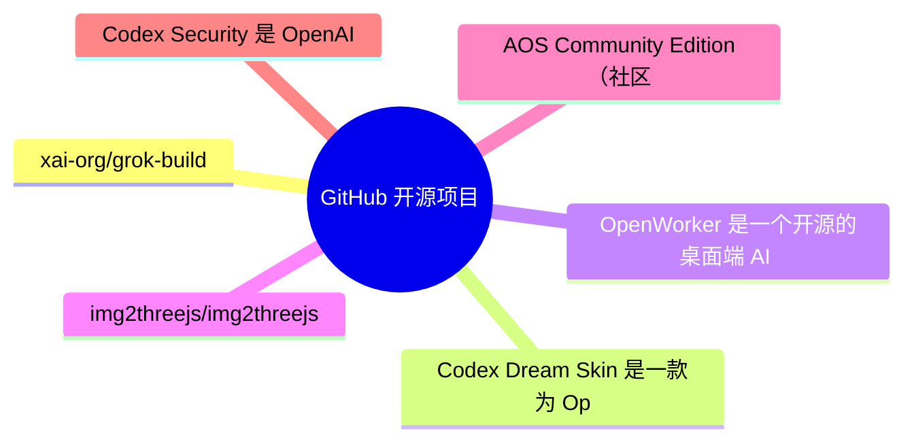
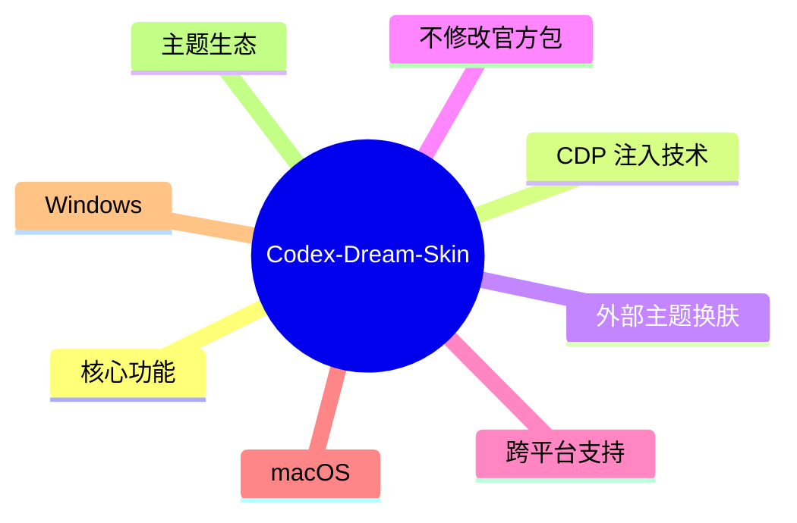
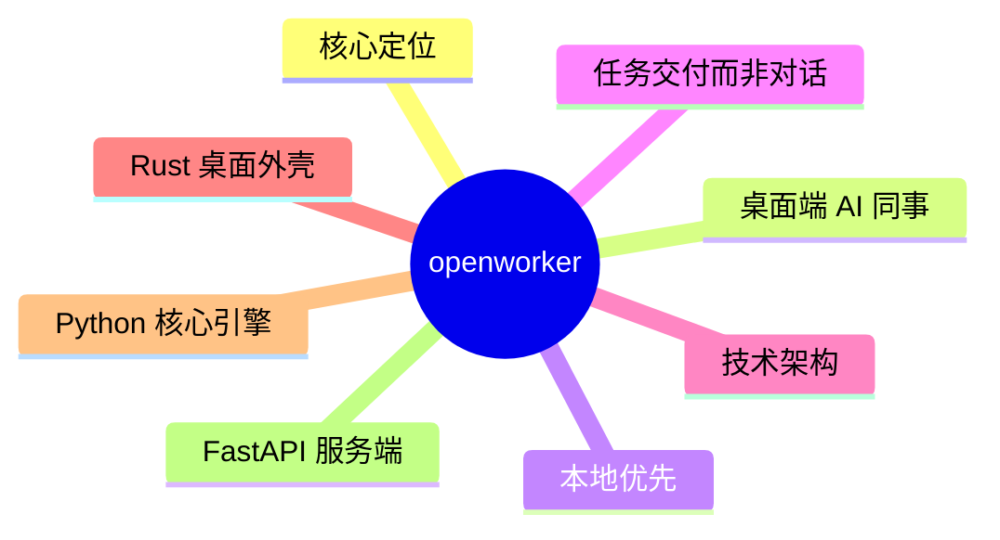
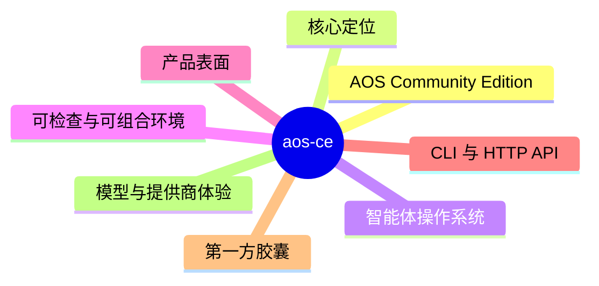
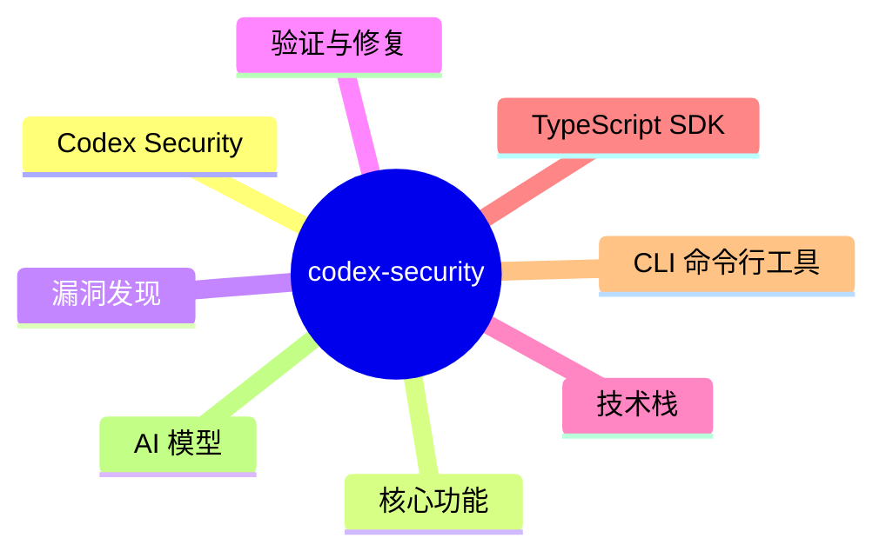

# GitHub 开源项目深度解析 (2026-08-03)

## 前面介绍

- 抓取来源：GitHub Trending / Search API
- 项目数量：15
- 深度解析数量：6
- 目标：自动筛出值得研究的开源项目，并给出结构、技术栈、运行方式和源码线索。

## 树状图



## 深度解析

### 1. grok-build
- **仓库**: [xai-org/grok-build](https://github.com/xai-org/grok-build)
- **语言**: Rust | **Star**: 23917 | **Fork**: 4540
- **更新**: 2026-08-03 | **License**: Apache-2.0

#### 源码

##### Cargo.toml

```toml
# Auto-generated workspace root. Prefer editing per-crate Cargo.toml files.

[patch.crates-io]
async-openai = { git = "https://github.com/our-forks/async-openai.git", rev = "95b52ebdedf42143083cf3d6f0e0be7c84e9c808" }

[workspace]
resolver = "2"
members = [
    "crates/build/xai-proto-build",
    "crates/codegen/ptyctl",
    "crates/codegen/ptyctl-cli",
    "crates/codegen/xai-acp-lib",
    "crates/codegen/xai-agent-lifecycle",
    "crates/codegen/xai-chat-state",
    "crates/codegen/xai-codebase-graph",
    "crates/codegen/xai-crash-handler",
    "crates/codegen/xai-fast-worktree",
    "crates/codegen/xai-file-utils",
    "crates/codegen/xai-fsnotify",
    "crates/codegen/xai-gix-status",
    "crates/codegen/xai-grok-agent",
    "crates/codegen/xai-grok-announcements",
    "crates/codegen/xai-grok-auth",
    "crates/codegen/xai-grok-config",
    "crates/codegen/xai-grok-config-types",
    "crates/codegen/xai-grok-env",
    "crates/codegen/xai-grok-extra-ca",
    "crates/codegen/xai-grok-hooks",
    "crates/codegen/xai-grok-http",
    "crates/codegen/xai-grok-markdown",
    "crates/codegen/xai-grok-markdown-core",
    "crates/codegen/xai-grok-mcp",
    "crates/codegen/xai-grok-memory",
    "crates/codegen/xai-grok-mermaid",
    "crates/codegen/xai-grok-models",
    "crates/codegen/xai-grok-pager",
    "crates/codegen/xai-grok-pager-bin",
    "crates/codegen/xai-grok-pager-minimal",
    "crates/codegen/xai-grok-pager-pty-harness",
    "crates/codegen/xai-grok-pager-render",
    "crates/codegen/xai-grok-paths",
    "crates/codegen/xai-grok-plugin-marketplace",
    "crates/codegen/xai-grok-sampler",
    "crates/codegen/xai-grok-sampling-types",
    "crates/codegen/xai-grok-sandbox",
    "crates/codegen/xai-grok-secrets",
    "crates/codegen/xai-grok-shared",
    "crates/codegen/xai-grok-shell",
    "crates/codegen/xai-grok-shell-base",
    "crates/codegen/xai-grok-shell-session-support",
    "crates/codegen/xai-grok-subagent-resolution",
    "crates/codegen/xai-grok-telemetry",
    "crates/codegen/xai-grok-test-support",
    "crates/codegen/xai-grok-tools",
    "crates/codegen/xai-grok-tools-api",
    "crates/codegen/xai-grok-update",
    "crates/codegen/xai-grok-version",
    "crates/codegen/xai-grok-voice",
    "crates/codegen/xai-grok-workspace",
    "crates/codegen/xai-grok-workspace-client",
    "crates/codegen/xai-grok-workspace-types",
    "crates/codegen/xai-hooks-plugins-types",
    "crates/codegen/xai-hunk-tracker",
    "crates/codegen/xai-mixpanel",
    "crates/codegen/xai-prompt-queue",
    "crates/codegen/xai-ratatui-inline",
    "crates/codegen/xai-ratatui-textarea",
    "crates/codegen/xai-sqlite-journal",
    "crates/codegen/xai-system-power",
    "crates/codegen/xai-token-estimation",
    "crates/codegen/xai-tracing-macros",
    "crates/codegen/xai-tty-utils",
    "crates/codegen/xai-workflow",
    "crates/common/xai-circuit-breaker",
    "crates/common/xai-computer-hub-core",
    "crates/common/xai-computer-hub-mcp-adapter",
    "crates/common/xai-computer-hub-sdk",
    "crates/common/xai-grok-compaction",
    "crates/common/xai-interjection-core",
    "crates/common/xai-test-utils",
    "crates/common/xai-tool-protocol",
    "crates/common/xai-tool-runtime",
    "crates/common/xai-tool-types",
    "crates/common/xai-tracing",
    "prod/mc/cli-chat-proxy-types",
    "third_party/dagre_rust",
    "third_party/graphlib_rust",
    "third_party/mermaid-to-svg",
    "third_party/ordered_hashmap",
]

[workspace.package]
edition
```

##### README.md

```md
<div align="center">

<h1>
  <picture>
    <source media="(prefers-color-scheme: dark)" srcset="https://media.x.ai/v1/website/spacexai-symbol-white-transparent-0c31957f.png">
    <source media="(prefers-color-scheme: light)" srcset="https://media.x.ai/v1/website/spacexai-symbol-black-transparent-6435cf42.png">
    
  </picture>
  <br>
  Grok Build (<code>grok</code>)
</h1>

**Grok Build** is SpaceXAI's terminal-based AI coding agent. It runs as a
full-screen TUI that understands your codebase, edits files, executes shell
commands, searches the web, and manages long-running tasks — interactively,
headlessly for scripting/CI, or embedded in editors via the Agent Client
Protocol (ACP).

[Installing the released binary](#installing-the-released-binary) ·
[Building from source](#building-from-source) ·
[Documentation](#documentation) ·
[Repository layout](#repository-layout) ·
[Development](#development) ·
[Contributing](#contributing) ·
[License](#license)


**Learn more about Grok Build at [x.ai/cli](https://x.ai/cli)**

This repository contains the Rust source for the `grok` CLI/TUI and its agent
runtime. It is synced periodically from the SpaceXAI monorepo.

A small `SOURCE_REV` file at the root records the full monorepo commit SHA
for the version of the code present in this tree.

</div>

---

## Installing the released binary

Prebuilt binaries are published for macOS, Linux, and Windows:

```sh
curl -fsSL https://x.ai/cli/install.sh | bash   # macOS / Linux / Git Bash
irm https://x.ai/cli/install.ps1 | iex          # Windows PowerShell
grok --version
```

See the [changelog](https://x.ai/build/changelog) for the latest fixes,
features, and improvements in each release.

## Building from source

Requirements:

- **Rust** — the toolchain is pinned by [`rust-toolchain.toml`](rust-toolchain.toml);
  `rustup` installs it automatically on first build.
- **[DotSlash](https://dotslash-cli.com)** — required so hermetic tools under
  [`bin/`](bin/) (notably [`bin/protoc`](bin/protoc)) can download and run.
  Install it and ensure `dotslash` is on your `PATH` **before** building:

  ```sh
  cargo install dotslash
  # or: prebuilt packages — https://dotslash-cli.com/docs/installation/
  /usr/bin/env dotslash --help   # sanity check
  ```

- **protoc** — proto codegen resolves [`bin/protoc`](bin/protoc) via DotSlash,
  or falls back to a `protoc` on `PATH` / `$PROTOC`.
- macOS and Linux are supported build hosts; Windows builds are best-effort
  and not currently tested from this tree.

```sh
cargo run -p xai-grok-pager-bin              # build + launch the TUI
cargo build -p xai-grok-pager-bin --release  # release binary: target/release/xai-grok-pager
cargo check -p xai-grok-pager-bin            # fast validation
```

The binary artifact is named `xai-grok-pager`; official installs ship it as
`grok`. On first launch it opens your browser to authenticate — see the
[authentication guide](crates/codegen/xai-grok-pager/docs/user-guide/02-authentication.md).

## Documentation

Full online documentation is available at
[docs.x.ai/build/overview](https://docs.x.ai/build/overview).

The user guide ships with the pager crate:
[`crates/codegen/xai-grok-pager/docs/user-guide/`](crates/codegen/xai-grok-pager/docs/user-guide/)
— getting started, keyboard sho
```

##### crates/build/xai-proto-build/Cargo.toml

```toml
[package]
license = "Apache-2.0"
description = "Build protobuf"
edition.workspace = true
name = "xai-proto-build"
version = "0.0.0"

[lints]
workspace = true

[dependencies]
anyhow = { workspace = true }
pbjson-build = { workspace = true }
prost-build = { workspace = true }
tempfile = { workspace = true }
tonic-prost-build = { workspace = true }

```

##### crates/codegen/ptyctl-cli/Cargo.toml

```toml
[package]
license = "Apache-2.0"
name = "ptyctl-cli"
version = "0.1.0"
edition.workspace = true
description = "CLI for ptyctl headless PTY controller"
publish = false

[[bin]]
name = "ptyctl"
path = "src/main.rs"

[dependencies]
ptyctl = { path = "../ptyctl" }
axum = { workspace = true }
clap = { workspace = true, features = ["derive"] }
reqwest = { workspace = true, features = ["json"] }
tokio = { workspace = true, features = ["full"] }
serde = { workspace = true, features = ["derive"] }
serde_json = { workspace = true }
anyhow = { workspace = true }
env_logger = { workspace = true }
chrono = { workspace = true, features = ["serde"] }
dirs = { workspace = true }

```

### 2. Codex-Dream-Skin
- **仓库**: [Fei-Away/Codex-Dream-Skin](https://github.com/Fei-Away/Codex-Dream-Skin)
- **语言**: JavaScript | **Star**: 12986 | **Fork**: 1294
- **更新**: 2026-08-03 | **License**: 未知

#### 前面介绍

- Codex Dream Skin 是一款为 OpenAI Codex 桌面端提供外部换肤功能的工具。它通过本地回环 CDP（Chrome DevTools Protocol）注入技术，在不修改官方安装包（.app、app.asar、WindowsApps）的前提下，为 Codex 添加自定义背景、主题色和 Safe CSS。项目支持 macOS 和 Windows，提供官方主题库、在线 Studio 以及一键换肤功能，旨在为开发者提供沉浸式的编程氛围。

#### 树状图



#### 文字描述

- 注入引擎
- 基于本地回环 CDP
- 验证官方应用签名与 Team ID
- 绑定特定端口（默认 9222）
- 仅注入 app:// 渲染进程
- 主题管理器
- 解析 theme.json 与 manifest.json
- 校验背景图尺寸与格式

#### 运行方式

- 环境准备
- 安装官方 Codex 桌面端并至少启动一次
- 下载安装包
- macOS: 从 Releases 下载 .dmg 并拖入 Applications
- Windows: 从 Releases 下载 .exe 安装器并运行
- 首次运行

#### 项目亮点

- 零侵入式换肤
- 完全保留 Codex 原生侧栏、输入框和交互逻辑
- 支持路由感知的透明度与毛玻璃效果
- 内置安全校验机制
- 拒绝重定向，仅访问固定 API
- 换肤前强制原生确认并核验 SHA-256

#### 代码解析

- macos/README.md: 详细说明了基于 launchd 的启动管理、CDP 绑定逻辑以及安全边界（如 PID 校验、脚本路径匹配）。
- macos/presets/README.md: 定义了主题包的 schema（theme.json 字段规范），包括颜色调色板、art 元数据以及素材红线（禁止真人肖像等）。
- windows/README.md: 描述了 PowerShell 安装脚本（install-dream-skin.ps1）的校验流程、快捷方式创建以及状态文件路径。
- macos/package.json: 定义了项目依赖与脚本入口，要求 Node.js >= 20。
- macos/assets/safe-css-policy.json: 定义了 Safe CSS 的白名单部件，确保注入的 CSS 仅作用于特定 UI 元素，防止破坏原生布局。
- macos/scripts/injector.mjs: 核心注入逻辑，负责连接 CDP、注入 CSS、处理主题渲染以及跨 reload 保持状态。
- macos/agents/openai.yaml: 配置了用于代码生成或辅助的主题相关 Agent 定义。
- docs/background-generation-prompts.md: 提供了生成 16:9 背景图的提示词指南，确保背景图与 UI 的协调性。

#### 源码

##### README.md

```md
# Codex Dream Skin

<p align="center">
  <strong>中文</strong> · <a href="./README.en.md">English</a>
</p>

<p align="center">
  <strong>给 Codex 桌面端换一张会呼吸的脸。</strong><br>
  外部主题 / 换肤工具 · 本机 CDP 注入 · 不改官方安装包
</p>

<p align="center">
  一张图，一种心情 · 写代码，也要有氛围感
</p>

<p align="center">
  官方主题库：<a href="https://dreamskin.cc"><strong>DreamSkin.cc</strong></a> ·
  <a href="https://dreamskin.cc/gallery">主题库 Gallery</a> ·
  <a href="https://dreamskin.cc/studio">在线 Studio</a>
</p>

<p align="center">
  非 OpenAI 官方产品。不修改 <code>.app</code> / <code>app.asar</code> / WindowsApps。
</p>

## 🤝 独家赞助

<table>
<tr>
<td width="180">
<a href="https://passion8.cc/sign-up?aff=ZgLT"></a>
</td>
<td>
感谢 Passion8 独家赞助本项目！Passion8 是一家面向开发者的 AI API 中转服务商，为个人开发者与团队提供稳定、低成本的主流大模型接入。<br><br>
<strong>满血 AI · 触手可及</strong>：OpenAI、Claude 全系列原版模型，无降智、无套壳；使用前沿 AI 模型仅需官方价格的一小部分，充值 1:1，<strong>1$ = 1¥</strong>。保留原有官方 SDK，只把 Base URL 换成 Passion8，Claude Code、Codex、Grok 以及任意 OpenAI 兼容客户端都能直接跑——一行配置，代码不用改。
<strong>全球节点加速</strong>：Cloudflare 全球边缘 + 多线路 BBR 加速，低延迟、高可用、稳定如一；7×24 稳定中转，99.9% SLA，首 Token 目标 1 秒内。
<strong>安全可靠</strong>：独立 API Key、密钥加密存储、全链路 HTTPS，隐私优先。<br><br>
Passion8 为本项目用户准备了专属福利：通过<a href="https://passion8.cc/sign-up?aff=ZgLT">此链接</a>注册，首次充值自动赠送 10% 额度，无需申请，30 分钟内到账。有问题联系 <a href="mailto:support@passion8.cc">support@passion8.cc</a>。
</td>
</tr>
</table>

<sub>换肤与 API 配置互相独立，本项目不会自动改写你的模型供应商设置。</sub>

## 直接安装

普通用户只需先安装并退出一次官方 Codex / ChatGPT，然后从
[GitHub Releases](https://github.com/Fei-Away/Codex-Dream-Skin/releases) 下载：

- macOS：打开 `CodexDreamSkin-vX.Y.Z.dmg`，把 App 拖进 Applications。
- Windows：双击 `CodexDreamSkin-Setup-vX.Y.Z.exe`，按安装向导完成。

不需要 clone 源码、安装 Node.js 或手动运行 `.sh` / `.ps1`。首次未签名放行、更新和卸载步骤见
[macOS 安装说明](./docs/install-macos.md) / [Windows 安装说明](./docs/install-windows.md)。

## 主题库与社区

<p align="center">
  <a href="https://dreamskin.cc">
    
  </a>
</p>

<p align="center">
  <strong>DreamSkin.cc</strong> · 本项目的官方主题库与创作平台<br>
  <sub>Make your workspace <em>yours.</em></sub>
</p>

<p align="center">
  <a href="https://dreamskin.cc/gallery"><strong>浏览主题库 →</strong></a>
  &nbsp;·&nbsp;
  <a href="https://dreamskin.cc/studio"><strong>在线 Studio →</strong></a>
</p>

- [**主题库 Gallery**](https://dreamskin.cc/gallery)：浏览社区已审核的主题，支持最新 / 热门排序和创作者榜单。
  每套主题都能先在网页里的桌面模拟器中试穿，再决定装不装。

<p align="center">
  <a href="https://dreamskin.cc/gallery">
    
  </a><br>
  <sub>社区主题「晨雾山水」的在线试穿 · 首页/任务页、宽窄窗口、侧栏展开收起都能当场切，满意了再一键换肤或下载主题包</sub>
</p>

- [**在线 Studio**](https://dreamskin.cc/studio)：在浏览器里换背景图、调主题色、写 Safe CSS，导出 `.zip` 主题包，
  也可以直接投稿到主题库（需登录，经人工审核后公开）。

<p align="center">
  <a href="https://dreamskin.cc/studio">
    
  </a><br>
  <sub>在线 Studio · 左侧实时预览，右侧调背景图、外观焦点与配色；主题库里任意一套主题都能一键载入继续改</sub>
</p>

macOS 菜单栏和 Windows 托盘都有「主题库 Gallery」和「在线 Studio」入口，可以直接打开。

### 一键换肤

在 DreamSkin.cc 上看到喜欢的主题，点「一键换肤」就能让本机客户端直接装上，不用先下载再手动导入。
需要 v1.5.0 或更新的客户端（建议 v1.5.5 及以上）。

流程与安全边界：

- 网页通过 `dreamskin://apply?version=ver_...` 唤起本机 App。链接只能携带一个主题版本 ID，**不能**携带
  任意 URL、文件路径或命令，也不存在静默应用参数。
- App 只向固定的官方 API 取包，并拒绝重定向。
- 换肤前弹出原生确认框，并核对该版本的审核状态、一键兼容标记、版本号、包大小、实际下载字节数和 SHA-256。
- 通过后复用与手动导入完全相同的 ZIP、manifest、图片与 Safe CSS 校验。
- 只有真实渲染进程确认新主题已生效才算成功。启动或渲染失败会自动尝试恢复换肤前的主题，恢
```

##### macos/README.md

```md
# Codex Dream Skin Studio

Unofficial macOS theme studio for the **official Codex Desktop** app.

Turn an image you like into one continuous full-window Codex theme. The same wallpaper runs beneath the native sidebar and main surface, while route-aware translucency keeps home, task, plugin, scheduled-task, and pull-request controls fully interactive and readable.

This project injects through **local loopback CDP**. It does **not** modify the official `.app`, `app.asar`, or code signature.

> Not affiliated with OpenAI. Codex is a trademark of its respective owners.

## Requirements

- macOS 13 Ventura or newer (the native DMG app declares macOS 13 as its minimum)
- Official Codex Desktop installed and launched at least once (`~/.codex/config.toml` exists)
- No global Node.js install required (uses Codex’s signed bundled Node after validation)

## Release install (recommended)

普通用户请从 [GitHub Releases](https://github.com/Fei-Away/Codex-Dream-Skin/releases) 下载
`CodexDreamSkin-vX.Y.Z.dmg`，按 [`docs/install-macos.md`](../docs/install-macos.md) 的图形界面步骤
拖入 Applications。首次运行可能需要在“系统设置 → 隐私与安全性 → 仍要打开”确认一次；不需要
运行 `xattr` 或安装源码。后续更新下载新的 DMG 覆盖安装即可，用户主题和图片会保留。

## Advanced: run from source

The Release DMG above is the normal user path. The commands below are for
contributors, diagnostics, and legacy deployments.

```bash
# 1) Optional checks (needs the installed Codex/ChatGPT.app bundled Node)
./tests/run-tests.sh

# 2) Install to the stable path and create Desktop launchers
./scripts/install-dream-skin-macos.sh --no-launch

# 3) Switch to the tested featured preset, or import your own pure background
~/.codex/codex-dream-skin-studio/scripts/switch-theme-macos.sh --id preset-arina-hashimoto
# ~/.codex/codex-dream-skin-studio/scripts/customize-theme-macos.sh

# 4) Start/re-apply, verify, or restore via Desktop:
#    Codex Dream Skin.command
#    Codex Dream Skin - Customize.command
#    Codex Dream Skin - Verify.command
#    Codex Dream Skin - Restore.command

# 5) Legacy only: install the old SwiftBar menu (do not enable it beside the native app)
./Install\ Menu\ Bar.command
# Look for 🎨 Skin in the top-right menu bar
```

Install location after step 2:

| Item | Path |
| --- | --- |
| Engine | `~/.codex/codex-dream-skin-studio` |
| State / logs / user images | `~/Library/Application Support/CodexDreamSkinStudio` |
| Theme backup | under Application Support (`theme-backup.json`) |

## Legacy standalone ZIP (maintainer/offline packaging only)

To build the “double-click install” folder layout for non-git users:

```bash
./scripts/build-client-release.sh "$HOME/Desktop/Codex 主题编辑器.zip"
```

That ZIP contains a visible installer plus a hidden `.codex-dream-skin-studio`
engine and is staged as a rights-clean package with only the redistributable
Gothic Void Crusade preset. It is retained for existing offline workflows;
prefer the DMG for ordinary users, and do not share a source checkout or an
archive containing the excluded Arina reference files. Do not ship only
CSS/images.

## How it works (security boundary)

1. Discover `com.openai.codex` and validate signature / Team ID / arch / bundled Node.
2. Start Codex via user `launchd` with CDP bound to `127.0.0.1` only.
3. Accept the debug port only when it belongs to Codex (or a legitimate child).
4. Inject only into expected `app://` renderer targets.
5. Resolve the selected theme and image to real paths, then enforce 10 MB,
   `16384px`-per-side, and 50-megapixel limits before injection.
6. Keep a s
```

##### macos/package.json

```json
{
  "name": "codex-dream-skin-studio",
  "version": "1.5.11",
  "private": true,
  "type": "module",
  "scripts": {
    "test": "./tests/run-tests.sh",
    "doctor": "./scripts/doctor-macos.sh"
  },
  "engines": {
    "node": ">=20"
  }
}

```

##### macos/presets/README.md

```md
# 预设主题 · Preset packs

这个目录放 **Codex Dream Skin 的内置预设主题**。安装时 `install-dream-skin-macos.sh` 会把每个 `preset-*/` 幂等地播种到用户主题库 `~/Library/Application Support/CodexDreamSkinStudio/themes/`，装完即可在**菜单栏「已保存的主题」**或 `switch-theme-macos.sh --id <id>` 里直接切换。

> This folder holds the bundled preset themes. Install seeds each `preset-*/` into the user theme library, so a fresh install ships with ready-to-use skins.

## 内置实测预设

当前内置 `preset-gothic-void-crusade/`（Gothic Void Crusade）与
`preset-arina-hashimoto/`（桥本有菜 / Arina Hashimoto）两套实机验证主题。
前者是社区作者提供的原创哥特科幻背景；后者使用一张
`2560 × 1440`（16:9）纯背景：左侧低信息留白承载 Codex 原生标题，人物和花卉主视觉集中在右侧。浅色与暗色截图均来自真实 Codex 注入，不是 AI 绘制的整窗 UI。

来源尺寸必须如实区分：归档的用户源图（不随 preset 播种）是 `1672 × 941` PNG；preset 内的 `background.jpg` 保持其近 16:9 构图，标准化导出为 `2560 × 1440` JPEG，并不代表补回或新增了源图细节。派生文件使用 `sips -z 1440 2560 -s format jpeg -s formatOptions 90` 生成。

- 可导入/可播种的主题素材只有 [`background.jpg`](./preset-arina-hashimoto/background.jpg) 与 [`theme.json`](./preset-arina-hashimoto/theme.json)。
- 用户提供的 byte-identical 源 PNG 单独归档在 [`docs/images/presets/arina-hashimoto-source.png`](../../docs/images/presets/arina-hashimoto-source.png)，不放进 preset pack，因此不会被安装脚本播种为多余文件。
- 当前浅色、暗色实测文档截图均为 `2308 × 1572` Retina JPEG（CSS viewport `1154 × 786`），来自同一真实 Codex 首页；为保护未发送草稿，截图时仅用临时本地样式隐藏输入文字并收起编辑区，没有修改草稿内容或伪造皮肤效果。它们包含真实侧栏、项目工具栏和输入框，**只作预览，绝不能当背景导入**。
- 背景是用户提供的 AI 生成示例，不代表 OpenAI/Codex 官方视觉或背书；公开分发前仍需确认人物、模型输出与素材使用权。
- 该维护者提供的精选预设是单独记录的发行例外，不纳入 MIT 软件许可；文件清单和限制见 [`../NOTICE.md`](../NOTICE.md)。这不表示以后可以提交其他可识别真人素材。

安装后可直接切换：

```bash
~/.codex/codex-dream-skin-studio/scripts/switch-theme-macos.sh \
  --id preset-arina-hashimoto
```

## 一套预设的结构

```
preset-<slug>/
├── theme.json        # schemaVersion 1，与 assets/theme.json 同一格式
└── background.jpg    # 背景图（横向，JPEG）
```

- 目录名与 `theme.json` 的 `id` **必须**都是 `preset-<slug>` 形式（`slug` 用小写英文 + 连字符）。播种只管理 `preset-*`，绝不会碰用户自己「换一张图」保存的 `custom-*` 主题。
- `image` 字段只能是**本目录内**的文件名（不能是路径），格式 `png` / `jpg` / `jpeg` / `webp`，≤ 10 MB（建议 < 1 MB）。
- `appearance` **必须如实声明背景图成立的模式**（这是规范，不是可选项）：
  - `"auto"`——仅限浅色、暗色外壳下都协调的图，且两种模式都实测过。皮肤跟随 Codex 客户端的浅暗设置切换外壳。
  - `"dark"` / `"light"`——单模专属图（如深色大教堂、纯白极简）。皮肤外壳固定为该模式，不随客户端切换。
  - 暗色专属画作声明 `auto` 是缺陷不是偏好：客户端处于浅色时，Codex 原生组件（差异卡片、任务条等）按浅色渲染，会与暗图直接打架（#134 曾因此返修）。拿不准就按图的实际明暗写死，不要照抄模板默认值。
- 人物/场景背景优先提交 `2560 × 1440`（16:9）母版；主视觉放在右侧约 58%～88%，左侧约 50%～58% 保持低信息、低对比。禁止把效果截图、窗口 mockup 或任何带 UI 的图片命名为 `background.*`。

## theme.json 字段全解（投稿必读）

以 `preset-gothic-void-crusade/theme.json` 为参考模板。除标注「可选」外均建议如实填写；文案留空会退回内置默认值，不会报错但会显得敷衍。

### 文案字段（界面哪里能看到）

| 字段 | 显示位置 |
| --- | --- |
| `name` | 首页标题上方的主题名眉标（强调色小字） |
| `tagline` | 首页标题下方一行副标语 |
| `quote` | 首页右下角手写体口号（斜排，随强调色） |
| `brandSubtitle` / `statusText` | 皮肤 chrome 的品牌角标与状态文案（部分布局下隐藏） |
| `projectPrefix` / `projectLabel` | 「选择项目」按钮的前缀与占位文案 |
| `promoTitle` / `promoSub` / `promoUrl` | 分享/宣传场景使用，可选 |

### colors 调色板（键 → 界面用途）

所有键都会被注入为主题变量，整套皮肤 UI 跟着走：

| 键 | 用途 |
| --- | --- |
| `background` | 整窗兜底底色（背景图未盖住的区域、body 底） |
| `panel` / `panelAlt` | 半透明面板底：侧栏、卡片、composer、右侧工具面板的毛玻璃都从它调透明度 |
| `accent` / `accentAlt` | 强调色：建议卡圆圈与图标、主题名眉标、口号、状态点、聚焦描边 |
| `secondary` / `highlight` | 次强调/高亮（粒子、渐变、hover 等点缀） |
| `text` | 正文字色（标题、卡片文字都强制跟随） |
| `muted` | 次要文字与大多数描边（卡片/面板边框按它调透明度） |
| `line` | 分隔线与细描边 |

- 颜色必须与背景图协调：`accent` 建议直接从画面主体取色（Gothic 取的是烛金 `#c8a55a`）。
- 声明 `appearance: dark` 的主题请给暗底亮字；`light` 反之；`auto` 主题两种模式都要自查对比度。

### art 元数据

`art.focusX` / `art.focusY`（`0..1`，画面主体位置）、`art.safeArea`（`auto | left | right | center | none`，低信息留白侧）、`art.taskMode`（`auto | ambient |
```

### 3. openworker
- **仓库**: [andrewyng/openworker](https://github.com/andrewyng/openworker)
- **语言**: Python | **Star**: 12041 | **Fork**: 1618
- **更新**: 2026-08-03 | **License**: MIT

#### 前面介绍

- OpenWorker 是一个开源的桌面端 AI 助手，旨在作为用户的“AI 同事”完成实际任务，而不仅仅是聊天。它运行在本地，支持多种大模型提供商（如 OpenAI、Anthropic、Ollama 等），并集成了 25+ 种工具连接器（如 GitHub、Slack、Jira 等）。其核心特点是“先批准后执行”的安全机制，确保 AI 在发送消息、修改日历或运行命令前获得用户确认。该项目采用 Rust 编写桌面外壳，Python 编写核心引擎，支持 macOS 和 Windows。

#### 树状图



#### 文字描述

- 桌面外壳层：使用 Rust 开发，负责原生窗口管理、系统级集成和与 Python 后端的通信。它提供了 macOS 和 Windows 的可执行文件，并处理自动更新。
- 核心引擎层：使用 Python 编写，基于 aisuite 构建。包含 Agent（代理）、Engine（引擎）、Memory（记忆）和 Automation（自动化）模块。负责任务拆解、工具调用和状态管理。
- API 服务层：基于 FastAPI 实现。提供 OpenAI 兼容的 `/v1/chat/completions` 接口，以及 WebSocket 会话管理和 REST API，供 GUI 和其他客户端调用。
- 连接器层：提供 25+ 种第三方服务的集成，包括 GitHub、Slack、Gmail、Google Calendar 等。支持通过 MCP 协议扩展新工具，并处理 OAuth 认证。
- 存储层：使用 SQLite 存储对话历史、会话记录和记忆。支持本地密钥存储，确保 API Key 和敏感数据不离开用户设备。
- 用户界面层：提供多种访问方式，包括基于 Textual 的 TUI 终端界面、基于 Tauri 的桌面 GUI，以及通过 Slack 插件直接在聊天中交互。

#### 运行方式

- 环境要求：需要安装 Python 3.10+、Node.js 20+ 以及 Rust 工具链（用于构建桌面外壳）。
- 源码运行：克隆仓库后，运行 `bash packaging/setup_dev_env.sh` 初始化 Python 虚拟环境，然后启动本地代理服务器 `openworker-server`。
- 模型配置：用户需自行添加 API Key，支持 OpenAI、Anthropic、Google 等多种提供商，或使用 Ollama 运行本地模型。
- 工具连接：通过配置文件或手动创建凭证连接 GitHub、Slack 等服务，支持 MCP 协议的动态工具加载。
- 桌面安装：从官网下载 macOS 或 Windows 的预编译安装包，安装后即可使用，支持自动更新。

#### 项目亮点

- 本地优先与隐私保护：所有数据处理均在本地完成，仅通过用户选择的模型和集成进行数据交互，API Key 和对话记录存储在本地密钥库中。
- 多模型支持与灵活性：支持 10+ 种主流大模型提供商，用户可随时切换，无需锁定特定厂商。
- 安全审批机制：在执行任何破坏性操作（如发送邮件、修改日历、运行命令）前，系统会弹出审批窗口，用户可选择批准、拒绝或设置默认行为。
- 丰富的工具集成：内置 25+ 种连接器，覆盖开发、协作、项目管理等场景，并支持通过 MCP 协议扩展新工具。
- 自动化调度：支持定时任务，可自动生成周报、监控特定频道或执行定期检查，任务结果会以完整会话记录的形式返回。
- 跨平台支持：提供 macOS 和 Windows 的原生桌面应用，同时支持通过终端界面和 Slack 插件进行交互。

#### 代码解析

- coworker/server/app.py：核心 API 服务入口，使用 FastAPI 构建。实现了 WebSocket 会话管理、CORS 限制以及 OAuth 回调页面。通过 `_origin_allowed` 函数严格限制跨域请求，防止恶意网站利用本地服务执行工具操作。
- coworker/tui/app.py：基于 Textual 的终端用户界面。实现了 `ApprovalScreen` 模态窗口，用于展示权限请求并处理用户批准/拒绝操作。`CoworkerApp` 类初始化代码引擎，并渲染日志和输入框，支持通过快捷键（如 y/n）快速决策。
- pyproject.toml：项目依赖配置文件。核心依赖包括 `fastapi`、`textual`、`aisuite`（模型抽象层）、`mcp`（模型上下文协议客户端）以及 `pypdfium2`（PDF 处理）。定义了多个可选依赖组，如 `messaging`（用于 Telegram/Slack 监听）和 `browser`（用于浏览器自动化）。
- stt/Cargo.toml：Rust 语音转文本模块配置。依赖 `whisper-rs` 实现本地离线语音识别，使用 `cpal` 处理音频输入，并支持通过 `ureq` 进行网络请求。这表明 OpenWorker 支持语音交互功能。
- coworker/agent.py：代理逻辑的核心，负责构建代码引擎。它整合了工具调用、记忆管理和审批流程，是连接用户意图与底层工具的桥梁。
- coworker/connectors/：包含所有第三方服务的集成代码，如 `github_relay.py` 处理 GitHub 事件，`slack_addr.py` 处理 Slack 消息路由。这些模块通过统一的接口与主引擎交互。

#### 源码

##### README.md

```md
# OpenWorker

**[openworker.com](https://openworker.com)** · [Download](#download) · [Issues](https://github.com/andrewyng/openworker/issues)

<a href="https://trendshift.io/repositories/91434?utm_source=trendshift-badge&amp;utm_medium=badge&amp;utm_campaign=badge-trendshift-91434" target="_blank" rel="noopener noreferrer"></a>

> **Beta** - OpenWorker is in open beta: fully usable, updates itself, and we're actively polishing rough edges. [Issues](https://github.com/andrewyng/openworker/issues) welcome.

**AI that gets your everyday tasks done.** OpenWorker is an open-source AI coworker that lives on your desktop and delivers **finished work**, not just chat: a polished document, a Slack reply with the numbers, an updated calendar, a triaged inbox.

It runs on your machine and doesn't lock you into any model: bring your own API key for OpenAI, Anthropic, Google, or an open-weight provider, or run fully local with Ollama. Your data leaves your machine only through the model and integrations *you* choose.

[](https://openworker.com)

## Download

[**⬇ macOS (Apple Silicon)**](https://download.openworker.com/mac)
<sub>macOS 12+ · signed & notarized · auto-updates</sub>

[**⬇ Windows 10/11 (x64)**](https://download.openworker.com/windows)
<sub>builds are not yet code-signed, so SmartScreen will warn; signing is in progress</sub>

Open the app, add a model key (or point it at Ollama), and ask for something real.

## How it works

1. Tell OpenWorker the outcome you want - "prepare a customer brief," "untangle my calendar," "draft a report," "check where the release stands across Jira and GitHub."
2. It breaks the task into steps and works across your desktop, files, and connected apps.
3. Before anything consequential - sending a message, changing a calendar, running a command - it checks in and you approve or redirect.
4. You get the finished deliverable, not a to-do list.

Under the hood:

```text
┌────────────────────────────────────────────────┐
│              OpenWorker desktop app            │  native shell + GUI
├────────────────────────────────────────────────┤
│           local agent server (Python)          │  engine · tools · connectors - built on aisuite
├───────────────┬────────────────┬───────────────┤
│  your files   │   your tools   │  your model   │  everything runs with your keys,
│  & terminal   │ 25+ connectors │  any provider │  on your machine
└───────────────┴────────────────┴───────────────┘
```

## What it can do

- **Produce real deliverables** - documents, spreadsheets, reports, and web pages land as files you can open and share.
- **Work from Slack** - mention `@OpenWorker` in a channel; a session opens on your desktop, the work happens with your tools, and the answer comes back as a thread reply.
- **Use your everyday tools** - 25+ integrations including GitHub, Slack, Jira, Notion, Linear, HubSpot, Outlook, monday.com, Gmail, and Google Calendar, plus your **terminal and local files**. Any tool reachable over [MCP](https://modelcontextprotocol.io/) plugs in too, with per-tool control.
- **Run on a schedule** - automations for recurring work: a morning brief, a weekly report, a standing watch over a channel. Runs land in the app with full transcripts.
- **Ask before acting** - writes, sends, and shell 
```

##### coworker/server/app.py

```py
"""FastAPI app — OpenAI-compatible endpoint + WS session API + REST.

The control plane every surface (GUI/IDE/messaging) rides on. The WS carries the engine
event stream and the approval channel; `/v1/chat/completions` is the OpenAI-compatible
proxy so any OpenAI-format client can use the runtime as a backend.
"""

from __future__ import annotations

import asyncio
import base64
import binascii
import json
import os
import re
import secrets
import uuid
from collections import deque
from contextlib import asynccontextmanager
from pathlib import Path
from typing import Any, Optional

from fastapi import FastAPI, Request, WebSocket, WebSocketDisconnect
from fastapi.middleware.cors import CORSMiddleware
from fastapi.responses import JSONResponse

# Origins allowed to talk to the local sidecar. It binds to 127.0.0.1, but a page in the
# user's own browser can still reach loopback — so without an origin gate, any website they
# visit could read `GET /v1/sessions` (CORS was `*`) and drive a session over the WS (which
# CORS never covers) into shell/file tools. We pin to the desktop webview's own origins
# (`tauri://localhost`, Windows' `http(s)://tauri.localhost`) and localhost dev/browser
# builds. Requests with NO Origin header (curl, native clients, tests, server-to-server) are
# allowed — the gate targets browsers, which always attach an unforgeable Origin.
_ALLOWED_ORIGIN_RE = re.compile(
    r"^(tauri://localhost"
    r"|https?://localhost(:\d+)?"
    r"|https?://127\.0\.0\.1(:\d+)?"
    r"|https?://tauri\.localhost)$"
)


def _origin_allowed(origin: str | None) -> bool:
    """True if a browser Origin may use the API. Missing Origin (non-browser) passes."""
    return origin is None or bool(_ALLOWED_ORIGIN_RE.match(origin))


# Caps on inbound WebSocket traffic. The loopback socket is unauthenticated (any local
# process can reach it), so bound frames, messages, and per-connection request rate before
# building model content or starting a turn.
_WS_MAX_FRAME_BYTES = 16 * 1024 * 1024
_WS_RATE_LIMIT_COUNT = 30
_WS_RATE_LIMIT_WINDOW_SECONDS = 10.0
_MAX_MESSAGE_TEXT_CHARS = 200_000
_MAX_ATTACHMENTS_BYTES = 15_000_000  # leaves JSON overhead below the 16 MiB frame cap


def _json_value_size(value: Any) -> int:
    """Conservative UTF-8 size of parsed JSON without allocating another giant string."""
    if isinstance(value, str):
        return len(value.encode("utf-8"))
    if isinstance(value, dict):
        return sum(_json_value_size(k) + _json_value_size(v) for k, v in value.items())
    if isinstance(value, list):
        return sum(_json_value_size(v) for v in value)
    return 8  # numbers, booleans, null, separators


# Brand colors for the connector badge riding the ✓ (UX-DECISIONS §30). The GUI owns the
# real logos; this page must render offline with zero assets, so a colored initial stands in.
_BRAND_COLORS = {
    "slack": "#4A154B",
    "github": "#24292f",
    "hubspot": "#ff7a59",
    "gmail": "#ea4335",
    "google_calendar": "#4285f4",
}


def _browser_page(
    title: str, detail: str, *, ok: bool = True, error: str = "", connector: str = ""
) -> str:
    """The page shown in the user's browser at the end of a loopback flow (sign-in or
    connector callback) — one branded card (UX-DECISIONS §30): OCW mark, ok/fail icon
    (the connector's initial rides the ✓), the friendly detail, and the raw error
    preserved on failures (it's the debugging breadcrumb). Inline CSS, light/dark via
    prefers-color-scheme, no external
```

##### coworker/tui/app.py

```py
"""Textual TUI — the first surface. Renders the engine's event stream, routes approvals
to a modal, and supports a few slash commands. Talks to the engine in-process for now
(the OpenAI-compatible server is a later phase)."""

from __future__ import annotations

import json
from pathlib import Path
from typing import Any, Optional

from textual import work
from textual.app import App, ComposeResult
from textual.binding import Binding
from textual.containers import Horizontal, Vertical
from textual.screen import ModalScreen
from textual.widgets import Button, Footer, Header, Input, Label, RichLog, Static

from ..agent import build_code_engine
from ..engine import ApprovalOutcome, PermissionRequest
from ..events import Event, EventType
from ..conversations import ConversationStore
from ..memory import MemoryStore
from ..permissions import Mode
from ..providers import ProviderClient
from ..sessions import SessionRecord


def _short(value: Any, limit: int = 80) -> str:
    text = value if isinstance(value, str) else json.dumps(value, default=str)
    text = text.replace("\n", "\\n")
    return text if len(text) <= limit else text[: limit - 1] + "…"


class ApprovalScreen(ModalScreen[ApprovalOutcome]):
    BINDINGS = [
        Binding("y", "decide('once')", "Approve"),
        Binding("n", "decide('deny')", "Deny"),
        Binding("a", "decide('always_tool')", "Always tool"),
        Binding("c", "decide('always_command')", "Always cmd"),
    ]

    def __init__(self, request: PermissionRequest) -> None:
        super().__init__()
        self.request = request

    def compose(self) -> ComposeResult:
        r = self.request
        args = ", ".join(f"{k}={_short(v)}" for k, v in (r.arguments or {}).items())
        with Vertical(id="approval"):
            yield Label("Permission required", id="approval-title")
            yield Static(f"tool:   {r.tool_name}")
            yield Static(f"args:   {args or '(none)'}")
            yield Static(f"reason: {r.reason}")
            with Horizontal(id="approval-buttons"):
                yield Button("Approve (y)", id="once", variant="success")
                yield Button("Deny (n)", id="deny", variant="error")
                yield Button("Always tool (a)", id="always_tool")
                yield Button("Always cmd (c)", id="always_command")

    def on_button_pressed(self, event: Button.Pressed) -> None:
        self.dismiss(ApprovalOutcome(event.button.id))

    def action_decide(self, outcome: str) -> None:
        self.dismiss(ApprovalOutcome(outcome))


class CoworkerApp(App):
    CSS = """
    #log { border: round $primary 30%; padding: 0 1; }
    #prompt { dock: bottom; }
    #approval { padding: 1 2; border: thick $warning; background: $panel; width: 80%; }
    #approval-title { text-style: bold; color: $warning; }
    #approval-buttons { height: auto; padding-top: 1; }
    #approval-buttons Button { margin-right: 1; }
    """
    BINDINGS = [
        Binding("ctrl+c", "quit", "Quit"),
        Binding("escape", "interrupt", "Interrupt"),
    ]

    def __init__(
        self,
        *,
        workspace: str | Path,
        model: str = "gpt-5.6-sol",
        mode: Mode = Mode.INTERACTIVE,
        provider: Optional[ProviderClient] = None,
        memory_store: Optional[MemoryStore] = None,
        session_store: Optional[ConversationStore] = None,
        session_id: Optional[str] = None,
        resume_messages: Optional[list[dict]] = None,
    ) -> None:
        super().__init__()
 
```

##### pyproject.toml

```toml
[build-system]
requires = ["setuptools>=68"]
build-backend = "setuptools.build_meta"

[project]
name = "coworker"
version = "0.0.0"
description = "Agent coworker platform — provider-agnostic agentic coworker runtime"
requires-python = ">=3.10"
dependencies = [
    "openai>=1.0",
    "anthropic>=0.40",  # native Claude Messages API provider
    "google-genai>=1.0",  # native Gemini provider
    "google-auth>=2.23",  # Vertex credentials (service account / ADC / MaaS bearer)
    "textual>=1.0",
    "fastapi>=0.110",
    "uvicorn[standard]>=0.27",
    # aisuite (toolkits/tracing), pinned to the commit this repo was imported from;
    # swap for a PyPI pin ("aisuite>=x.y") once the next aisuite release ships.
    "aisuite @ git+https://github.com/andrewyng/aisuite.git@1b4bbf303ec21968230b1ec869a144d054e9b3c4",
    "docstring_parser",
    "pyyaml>=6",  # persona manifest frontmatter (YAML)
    "pydantic>=2",
    "mcp>=1.1,<2",  # MCP client (stdio + streamable-http); 2.0 removed streamablehttp_client
    "httpx>=0.27",  # sync outbound senders for messaging connectors (send_message tool)
    "websockets>=13",  # managed Slack relay client transport (relay_client.py)
    "ddgs>=9",  # keyless default web-search provider (DuckDuckGo); Tavily/Brave use httpx
    "croniter>=2",  # cron next-fire math for the automation scheduler
    # PDF attachments for models without native PDF support (pdf_support.py):
    # pypdf = pure-python text extraction; pypdfium2 = page rasterization (BSD pdfium,
    # ships its own libpdfium — NOT PyMuPDF, whose AGPL license can't ride in the DMG).
    "pypdf>=5",
    "pypdfium2>=4",
    # IANA tz database for zoneinfo. Windows ships no system tz db, so without this every
    # named schedule timezone (UTC, Asia/Kolkata, …) silently falls back to local time.
    "tzdata; sys_platform == 'win32'",
]

[project.optional-dependencies]
dev = ["pytest>=8", "pytest-asyncio", "httpx"]
# Inbound messaging listeners (outbound send_message needs only httpx, already a core dep).
# aiohttp is slack-bolt's Socket Mode transport at runtime (and the FakeSlack test harness
# drives the real handler) — declare it so CI installs it, not just transitively.
messaging = ["python-telegram-bot>=21", "slack-bolt>=1.18", "aiohttp>=3.9"]
# Interactive Cowork browser automation.
browser = ["playwright>=1.44"]
# AWS Bedrock provider (lazy-imported; desktop builds bundle it, pip users opt in).
bedrock = ["boto3>=1.34"]

[project.scripts]
openworker = "coworker.cli:main"
openworker-server = "coworker.server.run:main"
openworker-connectors = "coworker.connectors.cli:main"

[tool.setuptools.packages.find]
where = ["."]
include = ["coworker*"]

[tool.setuptools.package-data]
coworker = ["personas/builtin/*.md"]

[tool.pytest.ini_options]
testpaths = ["tests"]
asyncio_mode = "auto"

```

### 4. img2threejs
- **仓库**: [img2threejs/img2threejs](https://github.com/img2threejs/img2threejs)
- **语言**: Python | **Star**: 9126 | **Fork**: 693
- **更新**: 2026-08-03 | **License**: Apache-2.0
- **主题**: 3d、ai-agents、claude-code、computer-graphics、generative、image-to-3d、procedural-generation、threejs

#### 源码

##### README.md

```md
<div align="center">


# img2threejs

**Rebuild the object in a reference image as a code-only, procedural Three.js model.**

Quality-gated, animation-ready, and deliberately token-efficient — reconstruction-by-code, not photogrammetry, mesh extraction, or downloaded art packs.

[](LICENSE)
[](https://github.com/img2threejs/img2threejs/releases)
[](CONTRIBUTING.md)
[](https://threejs.org)
[](scripts)
[](https://www.buymeacoffee.com/hoainhowors)

<table align="center">
  <tr>
    <td align="center"></td>
    <td align="center"><sub><b>DAILY</b></sub></td>
    <td align="center"><sub><b>WEEKLY</b></sub></td>
  </tr>
  <tr>
    <td align="right"><sub><b>Python</b></sub></td>
    <td><a href="https://trendshift.io/repositories/83608?utm_source=trendshift-badge&amp;utm_medium=badge&amp;utm_campaign=badge-trendshift-83608" target="_blank" rel="noopener noreferrer"></a></td>
    <td><a href="https://trendshift.io/repositories/83608?utm_source=trendshift-badge&amp;utm_medium=badge&amp;utm_campaign=badge-trendshift-83608" target="_blank" rel="noopener noreferrer"></a></td>
  </tr>
  <tr>
    <td align="right"><sub><b>All languages</b></sub></td>
    <td><a href="https://trendshift.io/repositories/83608?utm_source=trendshift-badge&amp;utm_medium=badge&amp;utm_campaign=badge-trendshift-83608" target="_blank" rel="noopener noreferrer"></a></td>
    <td><a href="https://trendshift.io/repositories/83608?utm_source=trendshift-badge&amp;utm_medium=badge&amp;utm_campaign=badge-trendshift-83608" target="_blank" rel="noopener noreferrer"></a></td>
  </tr>
</table>

</div>

*Reference images reconstructed in code as animation-ready Three.js models, running live in the browser.*

### [→ Open the Live Demo Gallery](https://img2threejs.github.io/img2threejs-showcase/)

Every model in the gallery is generated code, running in your browser. No mesh files, no downloads.

---

## Live demos

Reconstructions built entirely from primitives, procedural shaders, and generated geometry. Open any model to orbit it, inspect its reference, and read the generated source.

| Demo | Subject | View | Source |
| --- | --- | --- | --- |
| Glock-18 · Ghost Protocol (Well-Worn) | CS2 weapon | [Live](https://img2threejs.github.io/img2threejs-showcase/#/demo/glock-ghost-protocol) | [code](https://github.com/img2thre
```

##### docs/specs/vocabulary/README.md

```md
# Normalized spec-record vocabulary

This directory holds reviewed, committed JSONL records for local specification
search. Each non-empty line is exactly one UTF-8 JSON object. A collection may
have no record file yet, but every row in a present record file must satisfy
this contract.

## Future ingestion seam

Todo 3 must expose `load_jsonl_records(path: Path)` from
`forge._shared.spec_search`. It returns validated records and raises
`SpecRecordValidationError` for malformed JSON, a non-object JSON value, a
missing required field, or a value with the wrong type. The error identifies
the input path and one-based line number. Invalid rows are never skipped or
silently repaired.

## Canonical row

```json
{
  "record_id": "cs2.karambit.safety-ring",
  "collection": "cs2",
  "domain": "weapon-anatomy",
  "kind": "component",
  "entity": "karambit safety ring",
  "title": "Karambit safety ring / Vòng ngón Karambit",
  "aliases": ["safety ring", "finger ring", "vòng ngón"],
  "content": "A retention ring at the Karambit's pommel.",
  "constraints": ["Preserve the opening as a distinct component."],
  "measurements": [
    {"name": "opening diameter", "value": "source-dependent", "unit": "mm"}
  ],
  "source_refs": [
    {
      "path": "docs/cs2/3D_Technical_Mapping.json",
      "key_path": "karambit.components.safety_ring"
    },
    {"path": "docs/cs2-anatomy/karambit.md", "heading": "Safety ring"}
  ],
  "evidence_refs": [
    {"kind": "source", "ref": "docs/cs2/3D_Technical_Mapping.json"}
  ],
  "observation_status": "observed",
  "confidence": 0.9,
  "assumptions": []
}
```

`record_id` is a stable, lowercase, dot-delimited identifier. It is never
derived from a display title and must remain stable when wording changes.
`collection` selects the owning search collection; `domain`, `kind`, and
`entity` classify the record without imposing a global taxonomy. `title`,
`aliases`, and `content` are searchable text. `aliases` preserve English and
Vietnamese terms as authored; normalization and query expansion happen later.

## Required fields and stable types

| Field | Type | Semantics |
| --- | --- | --- |
| `record_id` | non-empty string | Stable unique identifier within a collection. |
| `collection` | non-empty string | Collection key that owns the record. |
| `domain` | non-empty string | Domain grouping, such as `weapon-anatomy` or `pbr`. |
| `kind` | non-empty string | Record category, such as `component`, `material`, or `constraint`. |
| `entity` | non-empty string | Canonical entity or concept name. |
| `title` | non-empty string | Human-readable searchable title. |
| `aliases` | array of strings | Zero or more authored synonyms, including bilingual aliases where known. |
| `content` | string | Source-backed concise description; may be empty only when structured fields carry the searchable detail. |
| `constraints` | array of strings | Requirements, prohibitions, or caveats. |
| `measurements` | array of objects | Each object has non-empty string `name` and `value`; optional `unit` and `context` are strings. Values remain source text rather than invented numbers. |
| `source_refs` | non-empty array of objects | Provenance for the distilled statement. Every object has non-empty string `path` and may have non-empty string `heading` and/or `key_path`. |
| `evidence_refs` | array of objects | Supporting provenance. Every object has non-empty string `kind` and `ref`; optional `note` is a string. |
| `observation_status` | string | One of
```

##### forge/requirements.txt

```txt
# Three.js Object Sculptor scripts have NO third-party dependencies.
# Everything uses the Python 3.10+ standard library only (json, argparse, struct,
# zlib, pathlib, math, subprocess). PNG maps and comparison sheets are written with
# struct/zlib directly — no Pillow/numpy/OpenCV/Playwright required.
#
# Requires: python >= 3.10

```

### 5. aos-ce
- **仓库**: [unicity-aos/aos-ce](https://github.com/unicity-aos/aos-ce)
- **语言**: Rust | **Star**: 8576 | **Fork**: 17
- **更新**: 2026-08-02 | **License**: Apache-2.0

#### 前面介绍

- AOS Community Edition（社区版）是一个专为智能体设计的开源操作系统。它提供了一个可检查、可组合的环境，旨在让智能体能够安全、受控地运行。该系统通过统一的 CLI（命令行界面）和 HTTP API 拥有产品表面，包括 CLI、HTTP API、发行版、第一方胶囊以及模型和提供商体验。AOS 的核心设计理念是拥有其产品根目录，通过严格的命令边界管理，确保系统的稳定性和安全性。

#### 树状图



#### 文字描述

- Workspace 结构：采用 Cargo Workspace 管理多个成员，包括引导程序、MCP 代理、各种功能胶囊（如 CLI、上下文引擎、Forge 等）以及共享依赖。
- 命令边界：AOS 拥有产品根目录（如 init, status, update），而其他运行时命令直接作为 CLI 的一部分（如 doctor, capsule build），通过发布验证确保命令的一致性。
- IPC 通信：内核 IPC 事件总线与 TUI 前端通过 Unix 域套接字连接，CLI 代理作为显示服务器，订阅特定主题并广播事件。
- 胶囊模型：Capsules 是用户空间构建块，用于组合成 Harness、Meta-harness 或服务，Forge 工具提供了构建和验证胶囊的能力。
- 运行时管理：系统拥有产品根目录，包括运行时主目录、工作区布局和强制执行的社区版发行版，支持离线初始化和协调升级。
- 多语言支持：项目主要使用 Rust 编写（约 85%），辅以 Python 和 Shell 脚本，支持 WASM 目标进行开发。
- 安全与审计：内置 Unicity Audit，支持 Sigstore 签名捆绑和 GitHub 构建证明，确保二进制文件的完整性和可追溯性。

#### 运行方式

- 安装方式：使用官方提供的安装脚本，它会安装 aos CLI、固定版本的运行时以及 21 个社区版胶囊到 ~/.aos 目录。
- 初始化：运行 `aos init` 进行初始化，支持离线模式，从本地资产进行配置。
- 更新机制：Homebrew 安装支持 `aos update`，直接安装支持从签名通道（stable, dev, nightly）中选择版本。
- 命令使用：通过 `aos status` 查看状态，使用 `aos daemon foreground` 在 Unix 系统上启动持久化守护进程。
- 开发构建：使用 `cargo build --target wasm32-unknown-unknown --release` 构建 CLI 胶囊，支持 Rust 1.94 及以上版本。
- 多主体：使用 `aos --principal operator init --target-principal alice` 为不同主体 provision 环境，保持操作员与目标环境的分离。

#### 项目亮点

- 严格的命令所有权：AOS 明确区分产品命令和运行时命令，通过发布验证确保新命令不会意外进入产品发布。
- CLI 代理机制：aos-cli 胶囊作为显示服务器，通过 Unix 套接字连接内核 IPC 和 TUI，并实现了严格的入站允许列表。
- Forge 工具链：内置 Forge 作为操作系统构建工具，允许智能体检查系统、识别能力缺口并构建最小权限的胶囊。
- Meta-harness 技能：提供元 Harness 技能，教导智能体如何构建受治理的元 Harness，将世界模型视为可改进的用户空间世界。
- 自愈与兼容性：发布前必须满足机器可读的运行时兼容性和升级/自愈门控，确保升级过程不会破坏现有环境。
- 多客户端支持：CLI 代理支持最多 8 个并发客户端连接，并实现了死流检测和清理机制，防止资源泄漏。

#### 代码解析

- Cargo.toml 配置：定义了包含 22 个成员的 Workspace，依赖 astrid-sdk (0.7.1) 和 astrid-core (0.10.4) 等核心库，配置了 Release 优化选项（LTO, Strip）。
- aos-cli 实现：位于 capsules/capsule-cli，作为 cdylib 导出，负责处理 Unix 套接字连接、IPC 主题订阅与广播，以及客户端连接的生命周期管理。
- Agent 胶囊：capsule-agents 负责将 AGENTS.md 中的项目指令注入到系统提示词中，是智能体与项目上下文交互的关键。
- Context Engine：capsule-context-engine 提供上下文管理策略，支持智能体在运行时动态调整和检索上下文信息。
- Forge 胶囊：capsule-forge 提供构建和验证工具，包含检查和指南模块，支持智能体在运行时构建新功能。
- CLI 代理逻辑：代码中实现了严格的入站允许列表，仅允许特定前缀和精确主题的消息通过，增强了安全性。

#### 源码

##### Cargo.toml

```toml
[workspace]
members = [
    "crates/unicity-aos-bootstrap",
    "crates/aos-mcp-broker",
    "capsules/capsule-agents",
    "capsules/capsule-cli",
    "capsules/capsule-context-engine",
    "capsules/capsule-forge",
    "capsules/capsule-fs",
    "capsules/capsule-hook-bridge",
    "capsules/capsule-meta-harness",
    "capsules/capsule-http",
    "capsules/capsule-identity",
    "capsules/capsule-memory",
    "capsules/capsule-mcp",
    "capsules/capsule-openai",
    "capsules/capsule-openai-compat",
    "capsules/capsule-prompt-builder",
    "capsules/capsule-react",
    "capsules/capsule-registry",
    "capsules/capsule-router",
    "capsules/capsule-session",
    "capsules/capsule-shell",
    "capsules/capsule-skills",
    "capsules/capsule-system",
    "capsules/capsule-users",
]
resolver = "3"

[workspace.package]
license = "MIT OR Apache-2.0"

[workspace.dependencies]
astrid-sdk = { version = "=0.7.1", features = ["derive"] }
astrid-core = "=0.10.4"
astrid-types = { version = "=0.10.4", features = ["clock"] }
astrid-uplink = "=0.10.4"
axum = "0.8"
blake3 = "1.8.5"
clap = { version = "4.6", features = ["derive"] }
fs2 = "0.4"
serde = { version = "1.0", features = ["derive"] }
serde_json = "1.0"
tokio = { version = "1", features = ["io-std", "io-util", "macros", "net", "process", "rt", "time"] }
toml = "0.8"
uuid = { version = "1.22", features = ["rng-getrandom", "serde", "v4"] }

[profile.release]
opt-level = "z"
lto = true
codegen-units = 1
strip = true
panic = "abort"

```

##### README.md

```md
# AOS Community Edition

AOS Community Edition is the open agent operating system for people who want
an inspectable, composable environment for agents.

It owns the Community Edition product surface: the `aos` CLI, HTTP API,
distributions, first-party capsules, provider and model experience, and
Unicity Audit.

## Workspace layout

```text
crates/       Product CLI, HTTP API, control client, and shared product code
capsules/     First-party production capsules
distros/      Community distribution manifests and release metadata
docs/         Product and operator documentation
```

## Install

The supported installer installs the `aos` product command, its pinned runtime,
and the exact 21 Community Edition capsules built from this source tree under
the product-owned `~/.aos` root:

```sh
curl --proto '=https' --tlsv1.2 -fsSL https://aos.unicity.ai/install.sh | sh
aos init
```

`aos init`, including `aos init --offline`, provisions from those local,
product-versioned capsule assets. Re-running the installer performs a
coordinated product upgrade without
rewriting a standalone runtime installation. Every release publishes
checksums, Sigstore bundles, GitHub build-provenance attestations, and
`runtime-compatibility.toml`, which pins the exact runtime release and WIT commit.
Its machine-readable runtime-compatibility and upgrade/self-heal gates must both
be true before a tag can publish. The latter is approved only after the exact
candidate preserves a frozen standalone-home clone and boots with freshly
generated runtime coordination state.

## Command boundary

AOS owns its product roots, including `init`, `status`, `migrate`, `update`,
`distro`, `mcp`, `daemon`, and `serve-health`:

```sh
aos status
aos status --json
aos --principal codex-code mcp serve
aos daemon foreground --workspace /workspace
```

On Unix, `aos daemon foreground` replaces the AOS process with the persistent
bundled daemon, preserving direct signal and exit-status ownership for process
supervisors. On other hosts it waits for the daemon and preserves its exit
status. Both paths apply the product-owned runtime home, `.aos` workspace
layout, enforced Community Edition distro, and stderr logging environment.
Neither path enables ephemeral lifetime.

Every other runtime root is part of the AOS CLI directly. Arguments, exit
codes, and signals pass through unchanged; there is no nested `aos astrid` or
`aos runtime` namespace:

```sh
aos doctor
aos capsule build
```

When AOS owns a root such as `status`, `init`, `update`, or `mcp`, its product
implementation replaces the lower-level command at that same location. The
complete supported surface therefore remains `aos <verb>`. Release validation
compares the exact pinned runtime's public command inventory with AOS's
classified root contract, so a new runtime verb cannot enter a product release
without an explicit inherit-or-own decision.

`aos mcp serve` is the product edge shared by Codex, Claude, and Grok. A client
that supports MCP form elicitation keeps presenting its own constrained
approval forms. When a client does not, the default `--interaction auto` mode
uses a local AOS decision surface: AppKit on macOS, a native Windows dialog, or
Pinentry on Linux. `--interaction client`, `native`, and `deny` make the policy
explicit. The local bridge accepts only a single boolean or the fixed AOS
approval enum; arbitrary strings, password-shaped fields, and URL
elicitations are never collected through it.

## Build on AOS

Unicit
```

##### capsules/capsule-agents/Cargo.toml

```toml
[package]
name = "aos-agents"
version = "0.2.0"
edition = "2024"
description = "Injects project instructions from AGENTS.md into the system prompt"
license = "MIT OR Apache-2.0"
authors = ["Joshua J. Bouw <dev@joshuajbouw.com>", "Unicity Labs <info@unicity-labs.com>"]

[lib]
crate-type = ["cdylib"]

[dependencies]
astrid-sdk = { workspace = true }
serde = { workspace = true }
serde_json = { workspace = true }

```

##### capsules/capsule-cli/Cargo.toml

```toml
[package]
name = "aos-cli"
version = "0.2.0"
edition = "2024"
license = "MIT OR Apache-2.0"

[lib]
crate-type = ["cdylib"]

[dependencies]
astrid-sdk = { workspace = true }
serde = { workspace = true }
serde_json = { workspace = true }

```

### 6. codex-security
- **仓库**: [openai/codex-security](https://github.com/openai/codex-security)
- **语言**: TypeScript | **Star**: 8210 | **Fork**: 549
- **更新**: 2026-08-03 | **License**: Apache-2.0
- **主题**: ai-security、application-security、cli、code-scanning、codex、codex-security、cybersecurity、devsecops

#### 前面介绍

- Codex Security 是 OpenAI 推出的一个命令行工具和 TypeScript SDK，旨在帮助开发者自动发现、验证和修复代码中的安全漏洞。它利用 OpenAI 的 Codex 模型进行智能代码扫描，支持深度扫描模式、多代理并行处理以及 CI/CD 集成，是 DevSecOps 流程中的重要工具。

#### 树状图



#### 文字描述

- CLI 与 SDK 架构
- 命令行交互层
- TypeScript SDK
- 核心扫描引擎
- AI 模型集成
- Codex 模型调用
- 多代理工作流
- 状态管理

#### 运行方式

- 环境要求
- Node.js 22.13.0+ (22.x, 24.x, 26.x)
- Python 3.10+
- OpenAI Codex Security 访问权限
- 安装步骤
- 运行 npm install @openai/codex-security

#### 项目亮点

- 基于 AI 的智能扫描
- 利用 Codex 模型理解代码上下文
- 深度扫描模式
- 支持多代理并行处理提高效率
- CI/CD 友好
- 支持环境变量配置密钥

#### 代码解析

- 包名: @openai/codex-security
- 语言: TypeScript
- 主要模块: CLI 命令行工具
- 主要模块: TypeScript SDK
- 核心类: CodexSecurity
- 主要方法: run(path, options)
- 主要方法: close()
- 主要方法: compare(beforeId, afterId)

#### 源码

未抓到适合展示的关键源码文件。

## 其余项目速览

### 1. xai-org/grok-build
- **仓库**: [xai-org/grok-build](https://github.com/xai-org/grok-build)
- **描述**: SpaceXAI's coding agent harness and TUI. Fullscreen, mouse interactive, extensible.
- **语言**: Rust
- **Star**: 23917 | **Fork**: 4540 | **更新**: 2026-08-03

### 2. Fei-Away/Codex-Dream-Skin
- **仓库**: [Fei-Away/Codex-Dream-Skin](https://github.com/Fei-Away/Codex-Dream-Skin)
- **描述**: Codex Dream Skin
- **语言**: JavaScript
- **Star**: 12986 | **Fork**: 1294 | **更新**: 2026-08-03

### 3. andrewyng/openworker
- **仓库**: [andrewyng/openworker](https://github.com/andrewyng/openworker)
- **语言**: Python
- **Star**: 12040 | **Fork**: 1618 | **更新**: 2026-08-03

### 4. img2threejs/img2threejs
- **仓库**: [img2threejs/img2threejs](https://github.com/img2threejs/img2threejs)
- **描述**: Rebuild the object in a reference image as a code-only, procedural, quality-gated, animation-ready Three.js model. Token-efficient image-to-3D.
- **语言**: Python
- **Star**: 9123 | **Fork**: 693 | **更新**: 2026-08-03

### 5. unicity-aos/aos-ce
- **仓库**: [unicity-aos/aos-ce](https://github.com/unicity-aos/aos-ce)
- **描述**: AOS Community Edition: the open agent operating system.
- **语言**: Rust
- **Star**: 8576 | **Fork**: 17 | **更新**: 2026-08-02

### 6. openai/codex-security
- **仓库**: [openai/codex-security](https://github.com/openai/codex-security)
- **描述**: OpenAI's Codex Security CLI and TypeScript SDK for finding, validating, and fixing security vulnerabilities. npm: https://www.npmjs.com/package/@openai/codex-security
- **语言**: TypeScript
- **Star**: 8210 | **Fork**: 549 | **更新**: 2026-08-03

### 7. MoonshotAI/Kimi-K3
- **仓库**: [MoonshotAI/Kimi-K3](https://github.com/MoonshotAI/Kimi-K3)
- **描述**: Open Frontier Intelligence
- **Star**: 7908 | **Fork**: 574 | **更新**: 2026-08-03

### 8. yc-software/qm
- **仓库**: [yc-software/qm](https://github.com/yc-software/qm)
- **描述**: Multiplayer agent harness for work
- **语言**: TypeScript
- **Star**: 7336 | **Fork**: 770 | **更新**: 2026-08-03

### 9. oso95/scroll-world
- **仓库**: [oso95/scroll-world](https://github.com/oso95/scroll-world)
- **描述**: A skill that turn any brand into a scrollable 3D world
- **语言**: JavaScript
- **Star**: 7157 | **Fork**: 800 | **更新**: 2026-08-03

### 10. MDX-Tom/gpt-5.6-instruct
- **仓库**: [MDX-Tom/gpt-5.6-instruct](https://github.com/MDX-Tom/gpt-5.6-instruct)
- **描述**: A Codex jailbreak prompt and test pack for gpt-5.6-sol. 针对 gpt-5.6 系列的 Codex 破甲提示词与测试包。
- **语言**: Python
- **Star**: 4307 | **Fork**: 649 | **更新**: 2026-08-03

### 11. drumih/turbo-fieldfare
- **仓库**: [drumih/turbo-fieldfare](https://github.com/drumih/turbo-fieldfare)
- **描述**: Gemma 4 26B-A4B inference in ~2 GB of RAM on any M-series MacBook
- **语言**: Swift
- **Star**: 4198 | **Fork**: 207 | **更新**: 2026-08-03

### 12. petergyang/no-ai-slop
- **仓库**: [petergyang/no-ai-slop](https://github.com/petergyang/no-ai-slop)
- **描述**: Removes 20+ patterns of AI slop from any piece of writing.
- **语言**: Python
- **Star**: 3816 | **Fork**: 296 | **更新**: 2026-08-03

### 13. withmarbleapp/os-taxonomy
- **仓库**: [withmarbleapp/os-taxonomy](https://github.com/withmarbleapp/os-taxonomy)
- **语言**: JavaScript
- **Star**: 3800 | **Fork**: 658 | **更新**: 2026-08-03

### 14. bashalarmistalt/decimen-optical-transfer
- **仓库**: [bashalarmistalt/decimen-optical-transfer](https://github.com/bashalarmistalt/decimen-optical-transfer)
- **语言**: TypeScript
- **Star**: 3703 | **Fork**: 427 | **更新**: 2026-08-03

### 15. digimata/quill
- **仓库**: [digimata/quill](https://github.com/digimata/quill)
- **描述**: Ultra-minimalist macOS recording + transcription.
- **语言**: Swift
- **Star**: 3606 | **Fork**: 216 | **更新**: 2026-08-03
