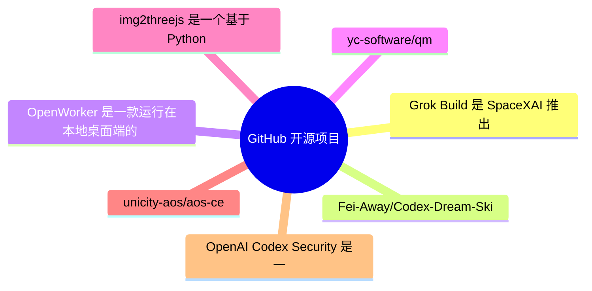
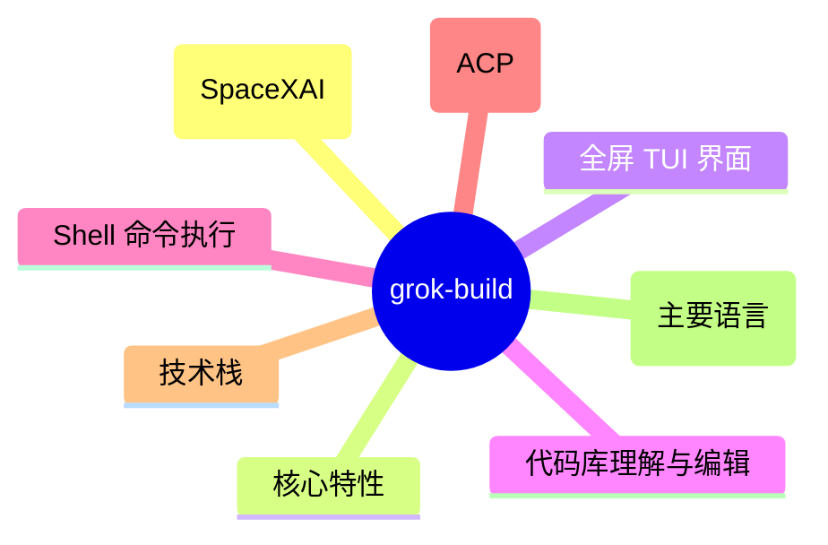
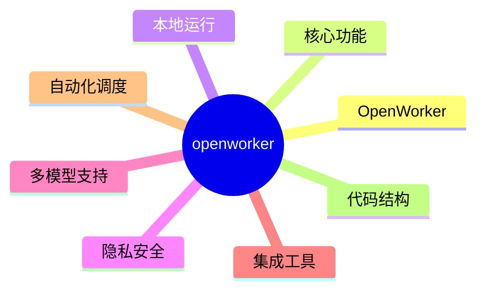
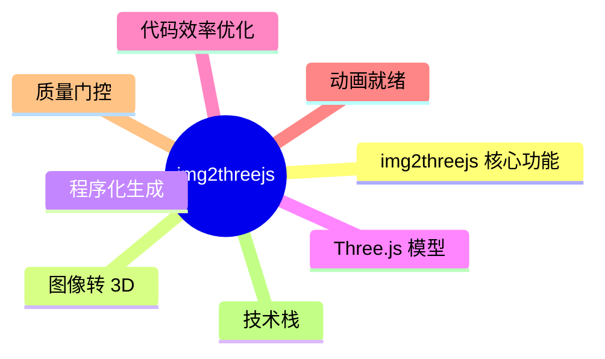
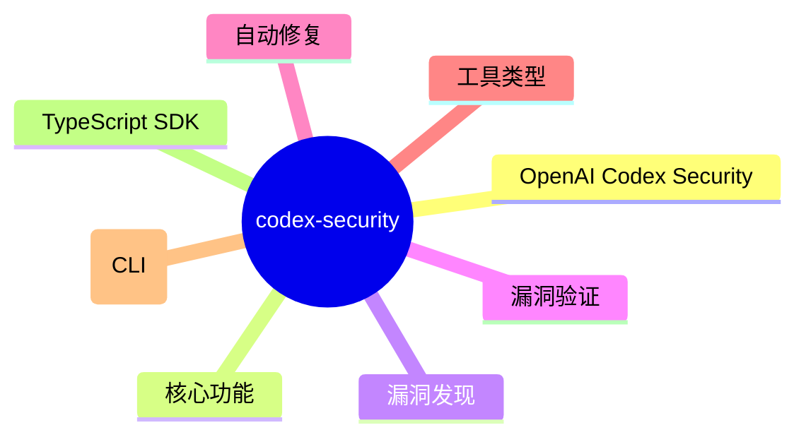

# GitHub 开源项目深度解析 (2026-08-04)

## 前面介绍

- 抓取来源：GitHub Trending / Search API
- 项目数量：15
- 深度解析数量：7
- 目标：自动筛出值得研究的开源项目，并给出结构、技术栈、运行方式和源码线索。

## 树状图

## 深度解析

### 1. grok-build
- **仓库**: [xai-org/grok-build](https://github.com/xai-org/grok-build)
- **语言**: Rust | **Star**: 24031 | **Fork**: 4552
- **更新**: 2026-08-04 | **License**: Apache-2.0

#### 前面介绍

- Grok Build 是 SpaceXAI 推出的基于终端的 AI 编码代理工具。它以全屏 TUI（文本用户界面）形式运行，具备理解代码库、编辑文件、执行 Shell 命令、搜索网络以及管理长期任务的能力。支持交互式操作、无头脚本/CI 环境，并能通过 Agent Client Protocol (ACP) 嵌入编辑器。该项目使用 Rust 编写，旨在提供高性能且可扩展的本地开发体验。

#### 树状图

#### 文字描述

- 项目采用 Rust Workspace 架构，核心模块位于 crates/codegen 目录下。
- xai-grok-pager-bin 作为组合根，负责构建最终的可执行文件。
- xai-grok-pager 负责处理 TUI 渲染、滚动回放、提示输入和模态框交互。
- xai-grok-shell 提供代理运行时环境，包含 leader、stdio 和 headless 入口点。
- xai-grok-tools 实现具体的工具逻辑，如终端操作、文件编辑、搜索等。
- xai-grok-workspace 管理宿主文件系统、版本控制、执行环境和检查点。
- xai-acp-lib 实现了 Agent Client Protocol，用于与外部 AI 模型通信。
- xai-agent-lifecycle 管理代理会话和回合的生命周期状态。

#### 运行方式

- 安装预编译二进制：在 macOS/Linux 上运行 curl 安装脚本，在 Windows 上运行 PowerShell 脚本。
- 源码构建要求：安装 Rust 工具链（版本由 rust-toolchain.toml 锁定）。
- 依赖 DotSlash：必须先安装 DotSlash 并将其添加到 PATH，用于管理 bin/ 目录下的工具。
- 构建命令：使用 cargo run -p xai-grok-pager-bin 启动，或使用 --release 生成优化后的二进制。
- 首次启动会自动打开浏览器进行身份验证。
- 开发时推荐使用 cargo check -p <crate> 进行快速验证，避免全工作区构建。

#### 项目亮点

- 全屏交互式 TUI 设计，提供沉浸式的终端编程体验。
- 高度模块化的 Rust 代码结构，便于扩展和维护。
- 支持多种运行模式：交互式、无头（Headless，用于 CI/脚本）和嵌入式（通过 ACP）。
- 集成了完整的开发工具链，包括文件编辑、Shell 执行和版本控制操作。
- 使用 DotSlash 确保构建环境的可复现性和隔离性。
- 文档与代码紧密结合，包含详细的用户指南和认证说明。

#### 代码解析

- 项目根目录包含 SOURCE_REV 文件，用于记录同步自 SpaceXAI 单体仓库的完整提交 SHA。
- 构建系统通过 bin/protoc 路径引用 protoc 编译器，由 DotSlash 动态下载。
- xai-acp-lib 模块定义了消息格式、通道、网关和标准化逻辑，是 AI 与代理通信的核心。
- ptyctl 模块处理伪终端控制，允许代理在终端中执行命令。
- xai-agent-lifecycle 模块将代理生命周期拆分为 contributors（贡献者）模式，包括命令、会话和回合处理。
- xai-chat-state 模块管理 actor（角色）信息，确保对话上下文的准确性。
- 开发规范强制要求针对特定 crate 进行检查和测试，避免全工作区构建带来的性能开销。

#### 源码

未抓到适合展示的关键源码文件。

### 2. Codex-Dream-Skin
- **仓库**: [Fei-Away/Codex-Dream-Skin](https://github.com/Fei-Away/Codex-Dream-Skin)
- **语言**: JavaScript | **Star**: 13079 | **Fork**: 1297
- **更新**: 2026-08-04 | **License**: 未知

#### 源码

未抓到适合展示的关键源码文件。

### 3. openworker
- **仓库**: [andrewyng/openworker](https://github.com/andrewyng/openworker)
- **语言**: Python | **Star**: 12480 | **Fork**: 1683
- **更新**: 2026-08-04 | **License**: MIT

#### 前面介绍

- OpenWorker 是一款运行在本地桌面端的 AI 助手，旨在通过 AI 完成实际任务而非仅仅聊天。它利用本地 Python 服务器作为核心引擎，通过 25+ 种集成工具连接用户的文件、终端和应用程序（如 Slack、GitHub、Jira）。它支持“先批准后执行”的安全机制，允许用户使用自己的 API 密钥（OpenAI、Anthropic、Ollama 等）或完全本地运行，确保数据隐私。

#### 树状图

#### 文字描述

- 桌面应用层：使用 Rust 编写的原生桌面壳，负责 GUI 交互、OAuth 认证握手及应用生命周期管理。
- 本地代理服务器：基于 Python 的核心引擎，运行在后台，负责任务拆解、工具调用和状态管理。
- 工具与连接器层：提供 25+ 种集成，包括 GitHub、Slack、Jira、Notion 等，支持 MCP 协议扩展。
- 模型层：支持 OpenAI、Anthropic、Google、Ollama 等多种 LLM 提供商，采用“自带密钥”模式。
- 存储层：使用 SQLite 存储对话历史、配置、连接器凭证和内存数据，确保本地化运行。
- 审批机制：在执行关键操作（发送消息、修改日历、运行命令）前进行人工确认或放入收件箱等待处理。

#### 运行方式

- 环境准备：需要安装 Python 3.10+、Node 20+ 以及用于桌面壳的 Rust 工具链。
- 克隆仓库：通过 git clone 获取源码并进入项目目录。
- 初始化环境：运行 bash packaging/setup_dev_env.sh 脚本创建 Python 虚拟环境。
- 启动服务：激活虚拟环境并运行 openworker-server 命令启动本地代理服务。
- 配置模型：在应用中添加 API 密钥或配置 Ollama 本地模型。
- 桌面安装：从官网下载 macOS 或 Windows 的预编译安装包进行安装。

#### 项目亮点

- 真正的任务完成者：专注于交付文档、回复邮件、整理日历等实质性成果，而非简单的问答。
- 完全本地化与隐私保护：核心数据不离开本地机器，仅通过用户选择的模型和集成进行交互。
- 多模型兼容性：支持 OpenAI、Anthropic、Google、DeepSeek、Ollama 等多种模型，支持无缝切换。
- 丰富的集成生态：内置 25+ 种工具集成，支持 MCP 协议，可轻松扩展新工具。
- 安全审批机制：所有关键操作（发送消息、命令执行）均需用户批准，防止 AI 误操作。
- 跨平台支持：提供 macOS 和 Windows 的原生桌面应用，支持自动更新。

#### 代码解析

- coworker/agent.py：定义了核心智能体逻辑，负责协调工具调用和任务执行流程。
- coworker/agents/：包含多种专用智能体实现，如 chat（聊天）、code（代码）、cowork（协作）等。
- coworker/connectors/：实现了与外部服务的连接层，包括 GitHub、Slack、Gmail 等的适配器和工具定义。
- coworker/mcp/：实现了 Model Context Protocol (MCP) 客户端，用于连接和调用符合 MCP 标准的外部工具。
- coworker/memory/：负责管理 AI 的短期和长期记忆，使用 SQLite 作为持久化存储。
- coworker/automation/：包含自动化调度器、任务模型和存储逻辑，支持定时任务的执行。
- coworker/inbox.py：处理待办事项和审批请求，确保 AI 的操作在用户监督下进行。

#### 源码

未抓到适合展示的关键源码文件。

### 4. qm
- **仓库**: [yc-software/qm](https://github.com/yc-software/qm)
- **语言**: TypeScript | **Star**: 9811 | **Fork**: 1034
- **更新**: 2026-08-04 | **License**: MIT

#### 源码

未抓到适合展示的关键源码文件。

### 5. img2threejs
- **仓库**: [img2threejs/img2threejs](https://github.com/img2threejs/img2threejs)
- **语言**: Python | **Star**: 9402 | **Fork**: 710
- **更新**: 2026-08-04 | **License**: Apache-2.0
- **主题**: 3d、ai-agents、claude-code、computer-graphics、generative、image-to-3d、procedural-generation、threejs

#### 前面介绍

- img2threejs 是一个基于 Python 的开源工具，旨在将参考图像中的物体重建为纯代码生成的 Three.js 模型。该项目不依赖传统的摄影测量、网格提取或下载的素材包，而是通过程序化生成的方式，利用基础几何体、程序化着色器和生成的几何体来构建高质量的 3D 模型。其核心特点是代码效率高、动画就绪且质量经过严格把关，生成的模型可以直接在浏览器中运行。

#### 树状图

#### 文字描述

- 核心架构：基于 Python 的 Forge 工作流
- Forge 工作流：分为多个阶段处理图像输入
- Stage 1 Intake（数据摄入）：分析纹理、绑定细节属性、构建详细清单
- CS2 物体解剖：针对 CS2（反恐精英 2）游戏物品的专用处理模块
- CS2 模块：包含手套、重武器、刀具、手枪、步枪、SMG、狙击枪等分类处理
- 数据规范：维护 3D 词汇表和技术参考映射
- 前端展示：生成的模型以 TypeScript 代码形式在浏览器中运行
- 无 Mesh 依赖：所有模型由代码实时生成，无需下载文件

#### 运行方式

- 环境要求：Python 3.10+ 标准库
- 依赖管理：使用 requirements.txt 管理依赖
- 项目结构：包含 .github 工作流、docs 文档、forge 核心代码及 assets 资源
- 配置文件：包含 .gitignore、LICENSE (Apache 2.0) 及贡献指南
- 演示运行：通过 GitHub Pages 访问在线演示画廊查看效果
- 版本控制：当前版本为 1.4.3，支持 CI/CD 自动化发布

#### 项目亮点

- 纯代码重建：通过代码而非网格文件重建物体，确保了极高的灵活性和可编辑性
- CS2 专项支持：针对 CS2 游戏物品（如枪械、刀具）进行了深度解剖和优化
- 质量门控机制：在重建过程中实施严格的质量检查，确保输出模型符合标准
- Token 效率优化：专门针对大语言模型（LLM）的 Token 使用进行了优化，降低成本
- 动画就绪：生成的模型不仅静态效果好，还支持动画播放
- 丰富的演示：提供了多个硬表面物体（如 BMX 自行车、索尼耳机、CS2 武器）的实时演示

#### 代码解析

- 核心模块：forge 目录包含主要逻辑，分为 _shared 共享工具和 stage1_intake 处理阶段
- 共享工具：artifact_cache.py 用于缓存构建产物，color_metrics.py 处理颜色指标，feature_acceptance_policy.py 定义特征接受策略
- 纹理处理：extract_cs2_textures.py 和 extract_gradient_stops.py 负责从图像中提取纹理和渐变数据
- CS2 检测：detect_cs2.py 用于识别输入图像是否为 CS2 游戏物品
- 清单构建：build_detail_inventory.py 负责整理和构建物体的详细属性清单
- 文档规范：docs/specs/vocabulary 目录下包含 core_3d.jsonl 和 cs2.jsonl 等定义文件，用于指导重建过程
- CS2 解剖文档：docs/cs2-anatomy 目录详细记录了各类 CS2 物体的技术细节

#### 源码

未抓到适合展示的关键源码文件。

### 6. aos-ce
- **仓库**: [unicity-aos/aos-ce](https://github.com/unicity-aos/aos-ce)
- **语言**: Rust | **Star**: 8574 | **Fork**: 17
- **更新**: 2026-08-03 | **License**: Apache-2.0

#### 源码

未抓到适合展示的关键源码文件。

### 7. codex-security
- **仓库**: [openai/codex-security](https://github.com/openai/codex-security)
- **语言**: TypeScript | **Star**: 8389 | **Fork**: 574
- **更新**: 2026-08-04 | **License**: Apache-2.0
- **主题**: ai-security、application-security、cli、code-scanning、codex、codex-security、cybersecurity、devsecops

#### 前面介绍

- OpenAI Codex Security 是一个基于 OpenAI Codex 模型的开源安全工具集，旨在帮助开发者发现、验证和修复代码中的安全漏洞。它提供了命令行界面（CLI）和 TypeScript SDK，支持多种编程语言，能够自动分析代码库并生成修复建议。该项目属于 DevSecOps 领域，利用人工智能技术辅助安全扫描。

#### 树状图

#### 文字描述

- 基于 OpenAI Codex 模型
- CLI 工具架构
- SDK 接口设计
- 代码扫描引擎
- 漏洞报告生成
- 修复建议输出

#### 运行方式

- 通过 npm 安装 CLI 工具：npm install -g @openai/codex-security
- 通过 npm 安装 TypeScript SDK：npm install @openai/codex-security
- 配置 OpenAI API 密钥以调用 Codex 模型
- 在终端中运行扫描命令分析代码库
- 在代码中导入 SDK 进行集成开发

#### 项目亮点

- 利用 OpenAI Codex 的生成能力进行智能漏洞检测
- 提供 CLI 和 SDK 两种使用方式，灵活性高
- 支持多种编程语言的代码安全分析
- 专注于自动修复建议，减少人工干预
- 集成到 DevSecOps 流程中，提升开发安全性

#### 代码解析

- 核心逻辑依赖于 OpenAI Codex 模型的 API 调用
- CLI 工具负责解析命令行参数并组织扫描流程
- SDK 提供了模块化的 API 接口供应用程序调用
- 代码扫描过程涉及代码解析、漏洞模式匹配和上下文理解
- 输出结果通常包含漏洞描述、位置信息和修复代码片段

#### 源码

未抓到适合展示的关键源码文件。

## 其余项目速览

### 1. xai-org/grok-build
- **仓库**: [xai-org/grok-build](https://github.com/xai-org/grok-build)
- **描述**: SpaceXAI's coding agent harness and TUI. Fullscreen, mouse interactive, extensible.
- **语言**: Rust
- **Star**: 24031 | **Fork**: 4552 | **更新**: 2026-08-04

### 2. Fei-Away/Codex-Dream-Skin
- **仓库**: [Fei-Away/Codex-Dream-Skin](https://github.com/Fei-Away/Codex-Dream-Skin)
- **描述**: Codex Dream Skin
- **语言**: JavaScript
- **Star**: 13079 | **Fork**: 1297 | **更新**: 2026-08-04

### 3. andrewyng/openworker
- **仓库**: [andrewyng/openworker](https://github.com/andrewyng/openworker)
- **语言**: Python
- **Star**: 12480 | **Fork**: 1683 | **更新**: 2026-08-04

### 4. yc-software/qm
- **仓库**: [yc-software/qm](https://github.com/yc-software/qm)
- **描述**: Multiplayer agent harness for work
- **语言**: TypeScript
- **Star**: 9807 | **Fork**: 1031 | **更新**: 2026-08-04

### 5. img2threejs/img2threejs
- **仓库**: [img2threejs/img2threejs](https://github.com/img2threejs/img2threejs)
- **描述**: Rebuild the object in a reference image as a code-only, procedural, quality-gated, animation-ready Three.js model. Token-efficient image-to-3D.
- **语言**: Python
- **Star**: 9402 | **Fork**: 710 | **更新**: 2026-08-04

### 6. unicity-aos/aos-ce
- **仓库**: [unicity-aos/aos-ce](https://github.com/unicity-aos/aos-ce)
- **描述**: AOS Community Edition: the open agent operating system.
- **语言**: Rust
- **Star**: 8574 | **Fork**: 17 | **更新**: 2026-08-03

### 7. openai/codex-security
- **仓库**: [openai/codex-security](https://github.com/openai/codex-security)
- **描述**: OpenAI's Codex Security CLI and TypeScript SDK for finding, validating, and fixing security vulnerabilities. npm: https://www.npmjs.com/package/@openai/codex-security
- **语言**: TypeScript
- **Star**: 8389 | **Fork**: 574 | **更新**: 2026-08-04

### 8. MoonshotAI/Kimi-K3
- **仓库**: [MoonshotAI/Kimi-K3](https://github.com/MoonshotAI/Kimi-K3)
- **描述**: Open Frontier Intelligence
- **Star**: 7987 | **Fork**: 594 | **更新**: 2026-08-04

### 9. oso95/scroll-world
- **仓库**: [oso95/scroll-world](https://github.com/oso95/scroll-world)
- **描述**: A skill that turn any brand into a scrollable 3D world landing page
- **语言**: JavaScript
- **Star**: 7308 | **Fork**: 816 | **更新**: 2026-08-04

### 10. drumih/turbo-fieldfare
- **仓库**: [drumih/turbo-fieldfare](https://github.com/drumih/turbo-fieldfare)
- **描述**: Gemma 4 26B-A4B inference in ~2 GB of RAM on any M-series MacBook
- **语言**: Swift
- **Star**: 4635 | **Fork**: 226 | **更新**: 2026-08-04

### 11. MDX-Tom/gpt-5.6-instruct
- **仓库**: [MDX-Tom/gpt-5.6-instruct](https://github.com/MDX-Tom/gpt-5.6-instruct)
- **描述**: A Codex jailbreak prompt and test pack for gpt-5.6-sol. 针对 gpt-5.6 系列的 Codex 破甲提示词与测试包。
- **语言**: Python
- **Star**: 4464 | **Fork**: 664 | **更新**: 2026-08-04

### 12. bashalarmistalt/decimen-optical-transfer
- **仓库**: [bashalarmistalt/decimen-optical-transfer](https://github.com/bashalarmistalt/decimen-optical-transfer)
- **语言**: TypeScript
- **Star**: 4265 | **Fork**: 506 | **更新**: 2026-08-04

### 13. petergyang/no-ai-slop
- **仓库**: [petergyang/no-ai-slop](https://github.com/petergyang/no-ai-slop)
- **描述**: Removes 20+ patterns of AI slop from any piece of writing.
- **语言**: Python
- **Star**: 3894 | **Fork**: 303 | **更新**: 2026-08-04

### 14. withmarbleapp/os-taxonomy
- **仓库**: [withmarbleapp/os-taxonomy](https://github.com/withmarbleapp/os-taxonomy)
- **语言**: JavaScript
- **Star**: 3826 | **Fork**: 661 | **更新**: 2026-08-04

### 15. digimata/quill
- **仓库**: [digimata/quill](https://github.com/digimata/quill)
- **描述**: Ultra-minimalist macOS recording + transcription.
- **语言**: Swift
- **Star**: 3646 | **Fork**: 220 | **更新**: 2026-08-04
