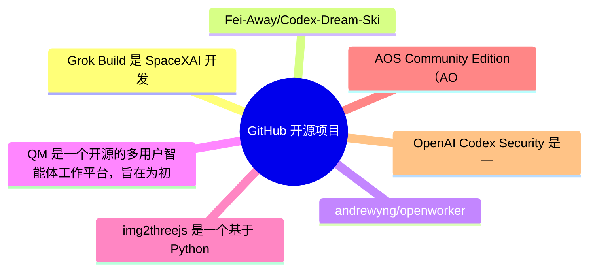
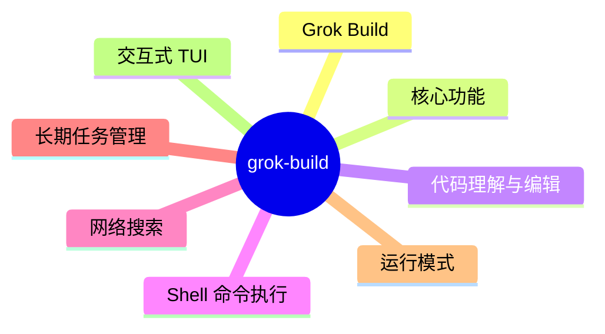
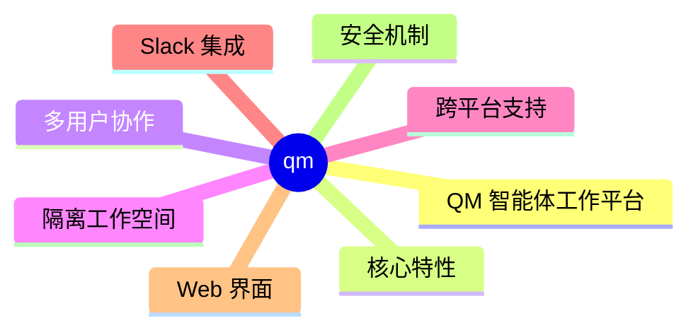
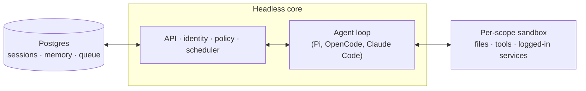
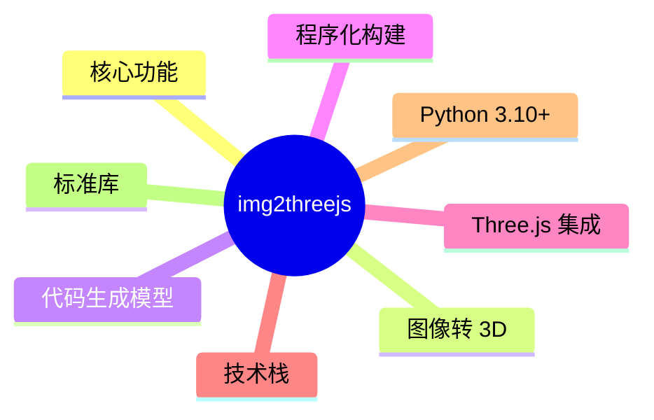
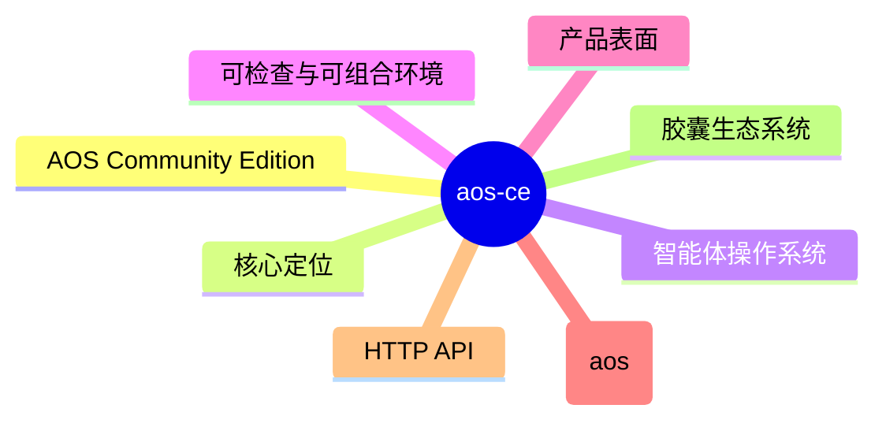
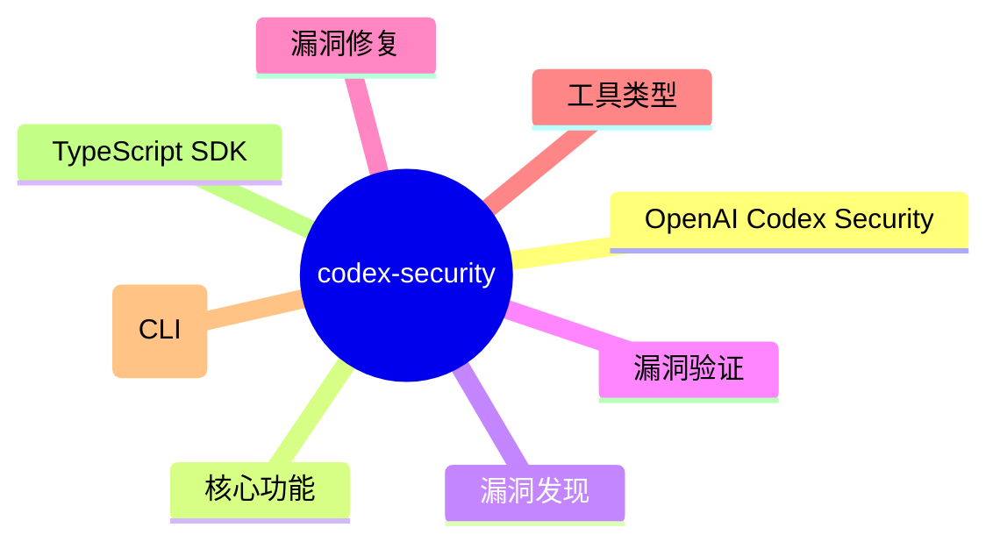

# GitHub 开源项目深度解析 (2026-08-05)

## 前面介绍

- 抓取来源：GitHub Trending / Search API
- 项目数量：15
- 深度解析数量：7
- 目标：自动筛出值得研究的开源项目，并给出结构、技术栈、运行方式和源码线索。

## 树状图



## 深度解析

### 1. grok-build
- **仓库**: [xai-org/grok-build](https://github.com/xai-org/grok-build)
- **语言**: Rust | **Star**: 24135 | **Fork**: 4571
- **更新**: 2026-08-05 | **License**: Apache-2.0

#### 前面介绍

- Grok Build 是 SpaceXAI 开发的基于终端的 AI 编码代理工具。它以全屏 TUI（终端用户界面）形式运行，具备理解代码库、编辑文件、执行 Shell 命令、搜索网络和管理长期任务的能力。该工具支持交互式操作、无头模式（用于脚本/CI）以及通过 Agent Client Protocol (ACP) 嵌入编辑器。项目使用 Rust 编写，采用模块化的 Monorepo 架构。

#### 树状图



#### 文字描述

- 项目采用 Rust 编写的 Monorepo 架构，根目录 Cargo.toml 自动生成，建议直接编辑各子 crate 的配置。
- 核心组件分为代码生成、工具实现和工作空间管理三大类。
- 代码生成层包含 TUI 渲染、Agent 生命周期管理、聊天状态、MCP 服务器集成及 Markdown 处理等模块。
- 工具层负责具体功能的实现，包括终端交互、文件编辑、搜索、沙箱执行及环境变量管理等。
- 工作空间层提供文件系统抽象、版本控制集成、任务检查点及执行环境支持。
- 底层通信依赖 Agent Client Protocol (ACP) 实现进程间通信与协议标准化。
- 构建系统使用 protobuf 代码生成工具处理协议定义，并利用 DotSlash 管理依赖工具。
- 支持通过 ptyctl 进行无头伪终端控制，以支持非交互式的自动化任务执行。

#### 运行方式

- 安装预编译二进制文件：在 macOS、Linux 或 Windows 上运行安装脚本。
- 从源码构建需要满足特定依赖：安装 Rust 工具链、DotSlash 工具以及 protoc 编译器。
- 构建命令包括 cargo run（开发模式）、cargo build --release（发布模式）和 cargo check（快速验证）。
- 首次启动时，程序会自动打开浏览器进行身份验证。
- 构建产物名为 xai-grok-pager，官方安装包将其重命名为 grok。
- 开发过程中推荐使用 cargo check -p <crate> 进行针对性检查，避免全工作区构建导致的性能问题。

#### 项目亮点

- 全屏交互式 TUI 设计，提供流畅的终端体验。
- 强大的代码库理解能力，支持深度编辑与上下文感知。
- 支持无头模式，可无缝集成到 CI/CD 流程中。
- 基于 ACP 协议的架构，便于扩展和嵌入第三方编辑器。
- 高度模块化的 Rust 代码结构，便于维护与测试。
- 内置沙箱机制，确保执行环境的安全性与隔离性。

#### 代码解析

- 项目根目录的 Cargo.toml 是自动生成的，开发者应专注于修改各个子 crate 的配置文件。
- crates/codegen/xai-grok-pager-bin 是构建入口，负责生成最终的二进制可执行文件。
- crates/codegen/ptyctl-cli 提供了命令行接口，用于控制无头 PTY 会话，支持运行命令、发送按键、截图及等待等操作。
- crates/codegen/xai-acp-lib 实现了 Agent Client Protocol 的核心逻辑，包括消息通道、标准化和流处理。
- crates/codegen/xai-agent-lifecycle 管理代理的生命周期，包括会话状态、输入输出处理及注册机制。
- crates/codegen/xai-grok-tools 定义了工具接口与实现，涵盖了文件操作、终端交互和搜索等基础能力。
- crates/codegen/xai-grok-workspace 提供了工作区抽象，处理文件系统操作、版本控制（Git）集成及任务检查点。
- crates/build/xai-proto-build 专门用于构建 protobuf 定义，是协议通信的基础。

#### 源码

##### Cargo.toml

```toml
# Auto-generated workspace root. Prefer editing per-crate Cargo.toml files.

[patch.crates-io]
async-openai = { git = "https://github.com/our-forks/async-openai.git", rev = "95b52ebdedf42143083cf3d6f0e0be7c84e9c808" }

[workspace]
resolver = "2"
members = [
    "crates/build/xai-proto-build",
    "crates/codegen/ptyctl",
    "crates/codegen/ptyctl-cli",
    "crates/codegen/xai-acp-lib",
    "crates/codegen/xai-agent-lifecycle",
    "crates/codegen/xai-chat-state",
    "crates/codegen/xai-codebase-graph",
    "crates/codegen/xai-crash-handler",
    "crates/codegen/xai-fast-worktree",
    "crates/codegen/xai-file-utils",
    "crates/codegen/xai-fsnotify",
    "crates/codegen/xai-gix-status",
    "crates/codegen/xai-grok-agent",
    "crates/codegen/xai-grok-announcements",
    "crates/codegen/xai-grok-auth",
    "crates/codegen/xai-grok-config",
    "crates/codegen/xai-grok-config-types",
    "crates/codegen/xai-grok-env",
    "crates/codegen/xai-grok-extra-ca",
    "crates/codegen/xai-grok-hooks",
    "crates/codegen/xai-grok-http",
    "crates/codegen/xai-grok-markdown",
    "crates/codegen/xai-grok-markdown-core",
    "crates/codegen/xai-grok-mcp",
    "crates/codegen/xai-grok-memory",
    "crates/codegen/xai-grok-mermaid",
    "crates/codegen/xai-grok-models",
    "crates/codegen/xai-grok-pager",
    "crates/codegen/xai-grok-pager-bin",
    "crates/codegen/xai-grok-pager-minimal",
    "crates/codegen/xai-grok-pager-pty-harness",
    "crates/codegen/xai-grok-pager-render",
    "crates/codegen/xai-grok-paths",
    "crates/codegen/xai-grok-plugin-marketplace",
    "crates/codegen/xai-grok-sampler",
    "crates/codegen/xai-grok-sampling-types",
    "crates/codegen/xai-grok-sandbox",
    "crates/codegen/xai-grok-secrets",
    "crates/codegen/xai-grok-shared",
    "crates/codegen/xai-grok-shell",
    "crates/codegen/xai-grok-shell-base",
    "crates/codegen/xai-grok-shell-session-support",
    "crates/codegen/xai-grok-subagent-resolution",
    "crates/codegen/xai-grok-telemetry",
    "crates/codegen/xai-grok-test-support",
    "crates/codegen/xai-grok-tools",
    "crates/codegen/xai-grok-tools-api",
    "crates/codegen/xai-grok-update",
    "crates/codegen/xai-grok-version",
    "crates/codegen/xai-grok-voice",
    "crates/codegen/xai-grok-workspace",
    "crates/codegen/xai-grok-workspace-client",
    "crates/codegen/xai-grok-workspace-types",
    "crates/codegen/xai-hooks-plugins-types",
    "crates/codegen/xai-hunk-tracker",
    "crates/codegen/xai-mixpanel",
    "crates/codegen/xai-prompt-queue",
    "crates/codegen/xai-ratatui-inline",
    "crates/codegen/xai-ratatui-textarea",
    "crates/codegen/xai-sqlite-journal",
    "crates/codegen/xai-system-power",
    "crates/codegen/xai-token-estimation",
    "crates/codegen/xai-tracing-macros",
    "crates/codegen/xai-tty-utils",
    "crates/codegen/xai-workflow",
    "crates/common/xai-circuit-breaker",
    "crates/common/xai-computer-hub-core",
    "crates/common/xai-computer-hub-mcp-adapter",
    "crates/common/xai-computer-hub-sdk",
    "crates/common/xai-grok-compaction",
    "crates/common/xai-interjection-core",
    "crates/common/xai-test-utils",
    "crates/common/xai-tool-protocol",
    "crates/common/xai-tool-runtime",
    "crates/common/xai-tool-types",
    "crates/common/xai-tracing",
    "prod/mc/cli-chat-proxy-types",
    "third_party/dagre_rust",
    "third_party/graphlib_rust",
    "third_party/mermaid-to-svg",
    "third_party/ordered_hashmap",
]

[workspace.package]
edition
```

##### README.md

```md
<div align="center">

<h1>
  <picture>
    <source media="(prefers-color-scheme: dark)" srcset="https://media.x.ai/v1/website/spacexai-symbol-white-transparent-0c31957f.png">
    <source media="(prefers-color-scheme: light)" srcset="https://media.x.ai/v1/website/spacexai-symbol-black-transparent-6435cf42.png">
    
  </picture>
  <br>
  Grok Build (<code>grok</code>)
</h1>

**Grok Build** is SpaceXAI's terminal-based AI coding agent. It runs as a
full-screen TUI that understands your codebase, edits files, executes shell
commands, searches the web, and manages long-running tasks — interactively,
headlessly for scripting/CI, or embedded in editors via the Agent Client
Protocol (ACP).

[Installing the released binary](#installing-the-released-binary) ·
[Building from source](#building-from-source) ·
[Documentation](#documentation) ·
[Repository layout](#repository-layout) ·
[Development](#development) ·
[Contributing](#contributing) ·
[License](#license)


**Learn more about Grok Build at [x.ai/cli](https://x.ai/cli)**

This repository contains the Rust source for the `grok` CLI/TUI and its agent
runtime. It is synced periodically from the SpaceXAI monorepo.

A small `SOURCE_REV` file at the root records the full monorepo commit SHA
for the version of the code present in this tree.

</div>

---

## Installing the released binary

Prebuilt binaries are published for macOS, Linux, and Windows:

```sh
curl -fsSL https://x.ai/cli/install.sh | bash   # macOS / Linux / Git Bash
irm https://x.ai/cli/install.ps1 | iex          # Windows PowerShell
grok --version
```

See the [changelog](https://x.ai/build/changelog) for the latest fixes,
features, and improvements in each release.

## Building from source

Requirements:

- **Rust** — the toolchain is pinned by [`rust-toolchain.toml`](rust-toolchain.toml);
  `rustup` installs it automatically on first build.
- **[DotSlash](https://dotslash-cli.com)** — required so hermetic tools under
  [`bin/`](bin/) (notably [`bin/protoc`](bin/protoc)) can download and run.
  Install it and ensure `dotslash` is on your `PATH` **before** building:

  ```sh
  cargo install dotslash
  # or: prebuilt packages — https://dotslash-cli.com/docs/installation/
  /usr/bin/env dotslash --help   # sanity check
  ```

- **protoc** — proto codegen resolves [`bin/protoc`](bin/protoc) via DotSlash,
  or falls back to a `protoc` on `PATH` / `$PROTOC`.
- macOS and Linux are supported build hosts; Windows builds are best-effort
  and not currently tested from this tree.

```sh
cargo run -p xai-grok-pager-bin              # build + launch the TUI
cargo build -p xai-grok-pager-bin --release  # release binary: target/release/xai-grok-pager
cargo check -p xai-grok-pager-bin            # fast validation
```

The binary artifact is named `xai-grok-pager`; official installs ship it as
`grok`. On first launch it opens your browser to authenticate — see the
[authentication guide](crates/codegen/xai-grok-pager/docs/user-guide/02-authentication.md).

## Documentation

Full online documentation is available at
[docs.x.ai/build/overview](https://docs.x.ai/build/overview).

The user guide ships with the pager crate:
[`crates/codegen/xai-grok-pager/docs/user-guide/`](crates/codegen/xai-grok-pager/docs/user-guide/)
— getting started, keyboard sho
```

##### crates/build/xai-proto-build/Cargo.toml

```toml
[package]
license = "Apache-2.0"
description = "Build protobuf"
edition.workspace = true
name = "xai-proto-build"
version = "0.0.0"

[lints]
workspace = true

[dependencies]
anyhow = { workspace = true }
pbjson-build = { workspace = true }
prost-build = { workspace = true }
tempfile = { workspace = true }
tonic-prost-build = { workspace = true }

```

##### crates/codegen/ptyctl-cli/Cargo.toml

```toml
[package]
license = "Apache-2.0"
name = "ptyctl-cli"
version = "0.1.0"
edition.workspace = true
description = "CLI for ptyctl headless PTY controller"
publish = false

[[bin]]
name = "ptyctl"
path = "src/main.rs"

[dependencies]
ptyctl = { path = "../ptyctl" }
axum = { workspace = true }
clap = { workspace = true, features = ["derive"] }
reqwest = { workspace = true, features = ["json"] }
tokio = { workspace = true, features = ["full"] }
serde = { workspace = true, features = ["derive"] }
serde_json = { workspace = true }
anyhow = { workspace = true }
env_logger = { workspace = true }
chrono = { workspace = true, features = ["serde"] }
dirs = { workspace = true }

```

### 2. Codex-Dream-Skin
- **仓库**: [Fei-Away/Codex-Dream-Skin](https://github.com/Fei-Away/Codex-Dream-Skin)
- **语言**: JavaScript | **Star**: 13177 | **Fork**: 1299
- **更新**: 2026-08-05 | **License**: 未知

#### 源码

##### README.md

```md
# Codex Dream Skin

<p align="center">
  <strong>中文</strong> · <a href="./README.en.md">English</a>
</p>

<p align="center">
  <strong>给 Codex 桌面端换一张会呼吸的脸。</strong><br>
  外部主题 / 换肤工具 · 本机 CDP 注入 · 不改官方安装包
</p>

<p align="center">
  一张图，一种心情 · 写代码，也要有氛围感
</p>

<p align="center">
  官方主题库：<a href="https://dreamskin.cc"><strong>DreamSkin.cc</strong></a> ·
  <a href="https://dreamskin.cc/gallery">主题库 Gallery</a> ·
  <a href="https://dreamskin.cc/studio">在线 Studio</a>
</p>

<p align="center">
  非 OpenAI 官方产品。不修改 <code>.app</code> / <code>app.asar</code> / WindowsApps。
</p>

## 🤝 独家赞助

<table>
<tr>
<td width="180">
<a href="https://passion8.cc/sign-up?aff=ZgLT"></a>
</td>
<td>
感谢 Passion8 独家赞助本项目！Passion8 是一家面向开发者的 AI API 中转服务商，为个人开发者与团队提供稳定、低成本的主流大模型接入。<br><br>
<strong>满血 AI · 触手可及</strong>：OpenAI、Claude 全系列原版模型，无降智、无套壳；使用前沿 AI 模型仅需官方价格的一小部分，充值 1:1，<strong>1$ = 1¥</strong>。保留原有官方 SDK，只把 Base URL 换成 Passion8，Claude Code、Codex、Grok 以及任意 OpenAI 兼容客户端都能直接跑——一行配置，代码不用改。
<strong>全球节点加速</strong>：Cloudflare 全球边缘 + 多线路 BBR 加速，低延迟、高可用、稳定如一；7×24 稳定中转，99.9% SLA，首 Token 目标 1 秒内。
<strong>安全可靠</strong>：独立 API Key、密钥加密存储、全链路 HTTPS，隐私优先。<br><br>
Passion8 为本项目用户准备了专属福利：通过<a href="https://passion8.cc/sign-up?aff=ZgLT">此链接</a>注册，首次充值自动赠送 10% 额度，无需申请，30 分钟内到账。有问题联系 <a href="mailto:support@passion8.cc">support@passion8.cc</a>。
</td>
</tr>
</table>

<sub>换肤与 API 配置互相独立，本项目不会自动改写你的模型供应商设置。</sub>

## 直接安装

普通用户只需先安装并退出一次官方 Codex / ChatGPT，然后从
[GitHub Releases](https://github.com/Fei-Away/Codex-Dream-Skin/releases) 下载：

- macOS：打开 `CodexDreamSkin-vX.Y.Z.dmg`，把 App 拖进 Applications。
- Windows：双击 `CodexDreamSkin-Setup-vX.Y.Z.exe`，按安装向导完成。

不需要 clone 源码、安装 Node.js 或手动运行 `.sh` / `.ps1`。首次未签名放行、更新和卸载步骤见
[macOS 安装说明](./docs/install-macos.md) / [Windows 安装说明](./docs/install-windows.md)。

## 主题库与社区

<p align="center">
  <a href="https://dreamskin.cc">
    
  </a>
</p>

<p align="center">
  <strong>DreamSkin.cc</strong> · 本项目的官方主题库与创作平台<br>
  <sub>Make your workspace <em>yours.</em></sub>
</p>

<p align="center">
  <a href="https://dreamskin.cc/gallery"><strong>浏览主题库 →</strong></a>
  &nbsp;·&nbsp;
  <a href="https://dreamskin.cc/studio"><strong>在线 Studio →</strong></a>
</p>

- [**主题库 Gallery**](https://dreamskin.cc/gallery)：浏览社区已审核的主题，支持最新 / 热门排序和创作者榜单。
  每套主题都能先在网页里的桌面模拟器中试穿，再决定装不装。

<table align="center">
  <tr>
    <td align="center">
      <br>
      <sub>「悟空（WUKONG）」by JamesOpsLab</sub>
    </td>
    <td align="center">
      <br>
      <sub>「DeepSeek-鲸鱼娘」by powerdog996</sub>
    </td>
  </tr>
</table>

- [**在线 Studio**](https://dreamskin.cc/studio)：在浏览器里换背景图、调主题色、写 Safe CSS，导出 `.zip` 主题包，
  也可以直接投稿到主题库（需登录，经人工审核后公开）。

<p align="center">
  
  <br>
  <sub>在线 Studio · 换一张喜欢的背景图，调好焦点与配色，就是你自己的主题</sub>
</p>

macOS 菜单栏和 Windows 托盘都有「主题库 Gallery」和「在线 Studio」入口，可以直接打开。

### 一键换肤

在 DreamSkin.cc 上看到喜欢的主题，点「一键换肤」就能让本机客户端直接装上，不用先下载再手动导入。
需要 v1.5.0 或更新的客户端（建议 v1.5.5 及以上）。

流程与安全边界：

- 网页通过 `dreamskin://apply?version=ver_...` 唤起本机 App。链接只能携带一个主题版本 ID，**不能**携带
  任意 URL、文件路径或命令，也不存在静默应用参数。
- App 只向固定的官方 API 取包，并拒绝重定向。
- 换肤前弹出原生确认框，并核对该版本的审核状态、一键兼容标记、版本号、包大小、实际下载字节数和 SHA-256。
- 通过后复
```

##### macos/README.md

```md
# Codex Dream Skin Studio

Unofficial macOS theme studio for the **official Codex Desktop** app.

Turn an image you like into one continuous full-window Codex theme. The same wallpaper runs beneath the native sidebar and main surface, while route-aware translucency keeps home, task, plugin, scheduled-task, and pull-request controls fully interactive and readable.

This project injects through **local loopback CDP**. It does **not** modify the official `.app`, `app.asar`, or code signature.

> Not affiliated with OpenAI. Codex is a trademark of its respective owners.

## Requirements

- macOS 13 Ventura or newer (the native DMG app declares macOS 13 as its minimum)
- Official Codex Desktop installed and launched at least once (`~/.codex/config.toml` exists)
- No global Node.js install required (uses Codex’s signed bundled Node after validation)

## Release install (recommended)

普通用户请从 [GitHub Releases](https://github.com/Fei-Away/Codex-Dream-Skin/releases) 下载
`CodexDreamSkin-vX.Y.Z.dmg`，按 [`docs/install-macos.md`](../docs/install-macos.md) 的图形界面步骤
拖入 Applications。首次运行可能需要在“系统设置 → 隐私与安全性 → 仍要打开”确认一次；不需要
运行 `xattr` 或安装源码。后续更新下载新的 DMG 覆盖安装即可，用户主题和图片会保留。

## Advanced: run from source

The Release DMG above is the normal user path. The commands below are for
contributors, diagnostics, and legacy deployments.

```bash
# 1) Optional checks (needs the installed Codex/ChatGPT.app bundled Node)
./tests/run-tests.sh

# 2) Install to the stable path and create Desktop launchers
./scripts/install-dream-skin-macos.sh --no-launch

# 3) Switch to the tested featured preset, or import your own pure background
~/.codex/codex-dream-skin-studio/scripts/switch-theme-macos.sh --id preset-arina-hashimoto
# ~/.codex/codex-dream-skin-studio/scripts/customize-theme-macos.sh

# 4) Start/re-apply, verify, or restore via Desktop:
#    Codex Dream Skin.command
#    Codex Dream Skin - Customize.command
#    Codex Dream Skin - Verify.command
#    Codex Dream Skin - Restore.command

# 5) Legacy only: install the old SwiftBar menu (do not enable it beside the native app)
./Install\ Menu\ Bar.command
# Look for 🎨 Skin in the top-right menu bar
```

Install location after step 2:

| Item | Path |
| --- | --- |
| Engine | `~/.codex/codex-dream-skin-studio` |
| State / logs / user images | `~/Library/Application Support/CodexDreamSkinStudio` |
| Theme backup | under Application Support (`theme-backup.json`) |

## Legacy standalone ZIP (maintainer/offline packaging only)

To build the “double-click install” folder layout for non-git users:

```bash
./scripts/build-client-release.sh "$HOME/Desktop/Codex 主题编辑器.zip"
```

That ZIP contains a visible installer plus a hidden `.codex-dream-skin-studio`
engine and is staged as a rights-clean package with only the redistributable
Gothic Void Crusade preset. It is retained for existing offline workflows;
prefer the DMG for ordinary users, and do not share a source checkout or an
archive containing the excluded Arina reference files. Do not ship only
CSS/images.

## How it works (security boundary)

1. Discover `com.openai.codex` and validate signature / Team ID / arch / bundled Node.
2. Start Codex via user `launchd` with CDP bound to `127.0.0.1` only.
3. Accept the debug port only when it belongs to Codex (or a legitimate child).
4. Inject only into expected `app://` renderer targets.
5. Resolve the selected theme and image to real paths, then enforce 10 MB,
   `16384px`-per-side, and 50-megapixel limits before injection.
6. Keep a s
```

##### macos/package.json

```json
{
  "name": "codex-dream-skin-studio",
  "version": "1.5.11",
  "private": true,
  "type": "module",
  "scripts": {
    "test": "./tests/run-tests.sh",
    "doctor": "./scripts/doctor-macos.sh"
  },
  "engines": {
    "node": ">=20"
  }
}

```

##### macos/presets/README.md

```md
# 预设主题 · Preset packs

这个目录放 **Codex Dream Skin 的内置预设主题**。安装时 `install-dream-skin-macos.sh` 会把每个 `preset-*/` 幂等地播种到用户主题库 `~/Library/Application Support/CodexDreamSkinStudio/themes/`，装完即可在**菜单栏「已保存的主题」**或 `switch-theme-macos.sh --id <id>` 里直接切换。

> This folder holds the bundled preset themes. Install seeds each `preset-*/` into the user theme library, so a fresh install ships with ready-to-use skins.

## 内置实测预设

当前内置 `preset-gothic-void-crusade/`（Gothic Void Crusade）与
`preset-arina-hashimoto/`（桥本有菜 / Arina Hashimoto）两套实机验证主题。
前者是社区作者提供的原创哥特科幻背景；后者使用一张
`2560 × 1440`（16:9）纯背景：左侧低信息留白承载 Codex 原生标题，人物和花卉主视觉集中在右侧。浅色与暗色截图均来自真实 Codex 注入，不是 AI 绘制的整窗 UI。

来源尺寸必须如实区分：归档的用户源图（不随 preset 播种）是 `1672 × 941` PNG；preset 内的 `background.jpg` 保持其近 16:9 构图，标准化导出为 `2560 × 1440` JPEG，并不代表补回或新增了源图细节。派生文件使用 `sips -z 1440 2560 -s format jpeg -s formatOptions 90` 生成。

- 可导入/可播种的主题素材只有 [`background.jpg`](./preset-arina-hashimoto/background.jpg) 与 [`theme.json`](./preset-arina-hashimoto/theme.json)。
- 用户提供的 byte-identical 源 PNG 单独归档在 [`docs/images/presets/arina-hashimoto-source.png`](../../docs/images/presets/arina-hashimoto-source.png)，不放进 preset pack，因此不会被安装脚本播种为多余文件。
- 当前浅色、暗色实测文档截图均为 `2308 × 1572` Retina JPEG（CSS viewport `1154 × 786`），来自同一真实 Codex 首页；为保护未发送草稿，截图时仅用临时本地样式隐藏输入文字并收起编辑区，没有修改草稿内容或伪造皮肤效果。它们包含真实侧栏、项目工具栏和输入框，**只作预览，绝不能当背景导入**。
- 背景是用户提供的 AI 生成示例，不代表 OpenAI/Codex 官方视觉或背书；公开分发前仍需确认人物、模型输出与素材使用权。
- 该维护者提供的精选预设是单独记录的发行例外，不纳入 MIT 软件许可；文件清单和限制见 [`../NOTICE.md`](../NOTICE.md)。这不表示以后可以提交其他可识别真人素材。

安装后可直接切换：

```bash
~/.codex/codex-dream-skin-studio/scripts/switch-theme-macos.sh \
  --id preset-arina-hashimoto
```

## 一套预设的结构

```
preset-<slug>/
├── theme.json        # schemaVersion 1，与 assets/theme.json 同一格式
└── background.jpg    # 背景图（横向，JPEG）
```

- 目录名与 `theme.json` 的 `id` **必须**都是 `preset-<slug>` 形式（`slug` 用小写英文 + 连字符）。播种只管理 `preset-*`，绝不会碰用户自己「换一张图」保存的 `custom-*` 主题。
- `image` 字段只能是**本目录内**的文件名（不能是路径），格式 `png` / `jpg` / `jpeg` / `webp`，≤ 10 MB（建议 < 1 MB）。
- `appearance` **必须如实声明背景图成立的模式**（这是规范，不是可选项）：
  - `"auto"`——仅限浅色、暗色外壳下都协调的图，且两种模式都实测过。皮肤跟随 Codex 客户端的浅暗设置切换外壳。
  - `"dark"` / `"light"`——单模专属图（如深色大教堂、纯白极简）。皮肤外壳固定为该模式，不随客户端切换。
  - 暗色专属画作声明 `auto` 是缺陷不是偏好：客户端处于浅色时，Codex 原生组件（差异卡片、任务条等）按浅色渲染，会与暗图直接打架（#134 曾因此返修）。拿不准就按图的实际明暗写死，不要照抄模板默认值。
- 人物/场景背景优先提交 `2560 × 1440`（16:9）母版；主视觉放在右侧约 58%～88%，左侧约 50%～58% 保持低信息、低对比。禁止把效果截图、窗口 mockup 或任何带 UI 的图片命名为 `background.*`。

## theme.json 字段全解（投稿必读）

以 `preset-gothic-void-crusade/theme.json` 为参考模板。除标注「可选」外均建议如实填写；文案留空会退回内置默认值，不会报错但会显得敷衍。

### 文案字段（界面哪里能看到）

| 字段 | 显示位置 |
| --- | --- |
| `name` | 首页标题上方的主题名眉标（强调色小字） |
| `tagline` | 首页标题下方一行副标语 |
| `quote` | 首页右下角手写体口号（斜排，随强调色） |
| `brandSubtitle` / `statusText` | 皮肤 chrome 的品牌角标与状态文案（部分布局下隐藏） |
| `projectPrefix` / `projectLabel` | 「选择项目」按钮的前缀与占位文案 |
| `promoTitle` / `promoSub` / `promoUrl` | 分享/宣传场景使用，可选 |

### colors 调色板（键 → 界面用途）

所有键都会被注入为主题变量，整套皮肤 UI 跟着走：

| 键 | 用途 |
| --- | --- |
| `background` | 整窗兜底底色（背景图未盖住的区域、body 底） |
| `panel` / `panelAlt` | 半透明面板底：侧栏、卡片、composer、右侧工具面板的毛玻璃都从它调透明度 |
| `accent` / `accentAlt` | 强调色：建议卡圆圈与图标、主题名眉标、口号、状态点、聚焦描边 |
| `secondary` / `highlight` | 次强调/高亮（粒子、渐变、hover 等点缀） |
| `text` | 正文字色（标题、卡片文字都强制跟随） |
| `muted` | 次要文字与大多数描边（卡片/面板边框按它调透明度） |
| `line` | 分隔线与细描边 |

- 颜色必须与背景图协调：`accent` 建议直接从画面主体取色（Gothic 取的是烛金 `#c8a55a`）。
- 声明 `appearance: dark` 的主题请给暗底亮字；`light` 反之；`auto` 主题两种模式都要自查对比度。

### art 元数据

`art.focusX` / `art.focusY`（`0..1`，画面主体位置）、`art.safeArea`（`auto | left | right | center | none`，低信息留白侧）、`art.taskMode`（`auto | ambient |
```

### 3. openworker
- **仓库**: [andrewyng/openworker](https://github.com/andrewyng/openworker)
- **语言**: Python | **Star**: 12819 | **Fork**: 1729
- **更新**: 2026-08-05 | **License**: MIT

#### 源码

##### README.md

```md
# OpenWorker

**[openworker.com](https://openworker.com)** · [Download](#download) · [Issues](https://github.com/andrewyng/openworker/issues)

<a href="https://trendshift.io/repositories/91434?utm_source=trendshift-badge&amp;utm_medium=badge&amp;utm_campaign=badge-trendshift-91434" target="_blank" rel="noopener noreferrer"></a>

> **Beta** - OpenWorker is in open beta: fully usable, updates itself, and we're actively polishing rough edges. [Issues](https://github.com/andrewyng/openworker/issues) welcome.

**AI that gets your everyday tasks done.** OpenWorker is an open-source AI coworker that lives on your desktop and delivers **finished work**, not just chat: a polished document, a Slack reply with the numbers, an updated calendar, a triaged inbox.

It runs on your machine and doesn't lock you into any model: bring your own API key for OpenAI, Anthropic, Google, or an open-weight provider, or run fully local with Ollama. Your data leaves your machine only through the model and integrations *you* choose.

[](https://openworker.com)

## Download

[**⬇ macOS (Apple Silicon)**](https://download.openworker.com/mac)
<sub>macOS 12+ · signed & notarized · auto-updates</sub>

[**⬇ Windows 10/11 (x64)**](https://download.openworker.com/windows)
<sub>builds are not yet code-signed, so SmartScreen will warn; signing is in progress</sub>

Open the app, add a model key (or point it at Ollama), and ask for something real.

## How it works

1. Tell OpenWorker the outcome you want - "prepare a customer brief," "untangle my calendar," "draft a report," "check where the release stands across Jira and GitHub."
2. It breaks the task into steps and works across your desktop, files, and connected apps.
3. Before anything consequential - sending a message, changing a calendar, running a command - it checks in and you approve or redirect.
4. You get the finished deliverable, not a to-do list.

Under the hood:

```text
┌────────────────────────────────────────────────┐
│              OpenWorker desktop app            │  native shell + GUI
├────────────────────────────────────────────────┤
│           local agent server (Python)          │  engine · tools · connectors - built on aisuite
├───────────────┬────────────────┬───────────────┤
│  your files   │   your tools   │  your model   │  everything runs with your keys,
│  & terminal   │ 25+ connectors │  any provider │  on your machine
└───────────────┴────────────────┴───────────────┘
```

## What it can do

- **Produce real deliverables** - documents, spreadsheets, reports, and web pages land as files you can open and share.
- **Work from Slack** - mention `@OpenWorker` in a channel; a session opens on your desktop, the work happens with your tools, and the answer comes back as a thread reply.
- **Use your everyday tools** - 25+ integrations including GitHub, Slack, Jira, Notion, Linear, HubSpot, Outlook, monday.com, Gmail, and Google Calendar, plus your **terminal and local files**. Any tool reachable over [MCP](https://modelcontextprotocol.io/) plugs in too, with per-tool control.
- **Run on a schedule** - automations for recurring work: a morning brief, a weekly report, a standing watch over a channel. Runs land in the app with full transcripts.
- **Ask before acting** - writes, sends, and shell 
```

##### coworker/server/app.py

```py
"""FastAPI app — OpenAI-compatible endpoint + WS session API + REST.

The control plane every surface (GUI/IDE/messaging) rides on. The WS carries the engine
event stream and the approval channel; `/v1/chat/completions` is the OpenAI-compatible
proxy so any OpenAI-format client can use the runtime as a backend.
"""

from __future__ import annotations

import asyncio
import base64
import binascii
import json
import os
import re
import secrets
import uuid
from collections import deque
from contextlib import asynccontextmanager
from pathlib import Path
from typing import Any, Optional

from fastapi import FastAPI, Request, WebSocket, WebSocketDisconnect
from fastapi.middleware.cors import CORSMiddleware
from fastapi.responses import JSONResponse

# Origins allowed to talk to the local sidecar. It binds to 127.0.0.1, but a page in the
# user's own browser can still reach loopback — so without an origin gate, any website they
# visit could read `GET /v1/sessions` (CORS was `*`) and drive a session over the WS (which
# CORS never covers) into shell/file tools. We pin to the desktop webview's own origins
# (`tauri://localhost`, Windows' `http(s)://tauri.localhost`) and localhost dev/browser
# builds. Requests with NO Origin header (curl, native clients, tests, server-to-server) are
# allowed — the gate targets browsers, which always attach an unforgeable Origin.
_ALLOWED_ORIGIN_RE = re.compile(
    r"^(tauri://localhost"
    r"|https?://localhost(:\d+)?"
    r"|https?://127\.0\.0\.1(:\d+)?"
    r"|https?://tauri\.localhost)$"
)


def _origin_allowed(origin: str | None) -> bool:
    """True if a browser Origin may use the API. Missing Origin (non-browser) passes."""
    return origin is None or bool(_ALLOWED_ORIGIN_RE.match(origin))


# Caps on inbound WebSocket traffic. The loopback socket is unauthenticated (any local
# process can reach it), so bound frames, messages, and per-connection request rate before
# building model content or starting a turn.
_WS_MAX_FRAME_BYTES = 16 * 1024 * 1024
_WS_RATE_LIMIT_COUNT = 30
_WS_RATE_LIMIT_WINDOW_SECONDS = 10.0
_MAX_MESSAGE_TEXT_CHARS = 200_000
_MAX_ATTACHMENTS_BYTES = 15_000_000  # leaves JSON overhead below the 16 MiB frame cap


def _json_value_size(value: Any) -> int:
    """Conservative UTF-8 size of parsed JSON without allocating another giant string."""
    if isinstance(value, str):
        return len(value.encode("utf-8"))
    if isinstance(value, dict):
        return sum(_json_value_size(k) + _json_value_size(v) for k, v in value.items())
    if isinstance(value, list):
        return sum(_json_value_size(v) for v in value)
    return 8  # numbers, booleans, null, separators


# Brand colors for the connector badge riding the ✓ (UX-DECISIONS §30). The GUI owns the
# real logos; this page must render offline with zero assets, so a colored initial stands in.
_BRAND_COLORS = {
    "slack": "#4A154B",
    "github": "#24292f",
    "hubspot": "#ff7a59",
    "gmail": "#ea4335",
    "google_calendar": "#4285f4",
}


def _browser_page(
    title: str, detail: str, *, ok: bool = True, error: str = "", connector: str = ""
) -> str:
    """The page shown in the user's browser at the end of a loopback flow (sign-in or
    connector callback) — one branded card (UX-DECISIONS §30): OCW mark, ok/fail icon
    (the connector's initial rides the ✓), the friendly detail, and the raw error
    preserved on failures (it's the debugging breadcrumb). Inline CSS, light/dark via
    prefers-color-scheme, no external
```

##### coworker/tui/app.py

```py
"""Textual TUI — the first surface. Renders the engine's event stream, routes approvals
to a modal, and supports a few slash commands. Talks to the engine in-process for now
(the OpenAI-compatible server is a later phase)."""

from __future__ import annotations

import json
from pathlib import Path
from typing import Any, Optional

from textual import work
from textual.app import App, ComposeResult
from textual.binding import Binding
from textual.containers import Horizontal, Vertical
from textual.screen import ModalScreen
from textual.widgets import Button, Footer, Header, Input, Label, RichLog, Static

from ..agent import build_code_engine
from ..engine import ApprovalOutcome, PermissionRequest
from ..events import Event, EventType
from ..conversations import ConversationStore
from ..memory import MemoryStore
from ..permissions import Mode
from ..providers import ProviderClient
from ..sessions import SessionRecord


def _short(value: Any, limit: int = 80) -> str:
    text = value if isinstance(value, str) else json.dumps(value, default=str)
    text = text.replace("\n", "\\n")
    return text if len(text) <= limit else text[: limit - 1] + "…"


class ApprovalScreen(ModalScreen[ApprovalOutcome]):
    BINDINGS = [
        Binding("y", "decide('once')", "Approve"),
        Binding("n", "decide('deny')", "Deny"),
        Binding("a", "decide('always_tool')", "Always tool"),
        Binding("c", "decide('always_command')", "Always cmd"),
    ]

    def __init__(self, request: PermissionRequest) -> None:
        super().__init__()
        self.request = request

    def compose(self) -> ComposeResult:
        r = self.request
        args = ", ".join(f"{k}={_short(v)}" for k, v in (r.arguments or {}).items())
        with Vertical(id="approval"):
            yield Label("Permission required", id="approval-title")
            yield Static(f"tool:   {r.tool_name}")
            yield Static(f"args:   {args or '(none)'}")
            yield Static(f"reason: {r.reason}")
            with Horizontal(id="approval-buttons"):
                yield Button("Approve (y)", id="once", variant="success")
                yield Button("Deny (n)", id="deny", variant="error")
                yield Button("Always tool (a)", id="always_tool")
                yield Button("Always cmd (c)", id="always_command")

    def on_button_pressed(self, event: Button.Pressed) -> None:
        self.dismiss(ApprovalOutcome(event.button.id))

    def action_decide(self, outcome: str) -> None:
        self.dismiss(ApprovalOutcome(outcome))


class CoworkerApp(App):
    CSS = """
    #log { border: round $primary 30%; padding: 0 1; }
    #prompt { dock: bottom; }
    #approval { padding: 1 2; border: thick $warning; background: $panel; width: 80%; }
    #approval-title { text-style: bold; color: $warning; }
    #approval-buttons { height: auto; padding-top: 1; }
    #approval-buttons Button { margin-right: 1; }
    """
    BINDINGS = [
        Binding("ctrl+c", "quit", "Quit"),
        Binding("escape", "interrupt", "Interrupt"),
    ]

    def __init__(
        self,
        *,
        workspace: str | Path,
        model: str = "gpt-5.6-sol",
        mode: Mode = Mode.INTERACTIVE,
        provider: Optional[ProviderClient] = None,
        memory_store: Optional[MemoryStore] = None,
        session_store: Optional[ConversationStore] = None,
        session_id: Optional[str] = None,
        resume_messages: Optional[list[dict]] = None,
    ) -> None:
        super().__init__()
 
```

##### pyproject.toml

```toml
[build-system]
requires = ["setuptools>=68"]
build-backend = "setuptools.build_meta"

[project]
name = "coworker"
version = "0.0.0"
description = "Agent coworker platform — provider-agnostic agentic coworker runtime"
requires-python = ">=3.10"
dependencies = [
    "openai>=1.0",
    "anthropic>=0.40",  # native Claude Messages API provider
    "google-genai>=1.0",  # native Gemini provider
    "google-auth>=2.23",  # Vertex credentials (service account / ADC / MaaS bearer)
    "textual>=1.0",
    "fastapi>=0.110",
    "uvicorn[standard]>=0.27",
    # aisuite (toolkits/tracing), pinned to the commit this repo was imported from;
    # swap for a PyPI pin ("aisuite>=x.y") once the next aisuite release ships.
    "aisuite @ git+https://github.com/andrewyng/aisuite.git@1b4bbf303ec21968230b1ec869a144d054e9b3c4",
    "docstring_parser",
    "pyyaml>=6",  # persona manifest frontmatter (YAML)
    "pydantic>=2",
    "mcp>=1.1,<2",  # MCP client (stdio + streamable-http); 2.0 removed streamablehttp_client
    "httpx>=0.27",  # sync outbound senders for messaging connectors (send_message tool)
    "websockets>=13",  # managed Slack relay client transport (relay_client.py)
    "ddgs>=9",  # keyless default web-search provider (DuckDuckGo); Tavily/Brave use httpx
    "croniter>=2",  # cron next-fire math for the automation scheduler
    # PDF attachments for models without native PDF support (pdf_support.py):
    # pypdf = pure-python text extraction; pypdfium2 = page rasterization (BSD pdfium,
    # ships its own libpdfium — NOT PyMuPDF, whose AGPL license can't ride in the DMG).
    "pypdf>=5",
    "pypdfium2>=4",
    # IANA tz database for zoneinfo. Windows ships no system tz db, so without this every
    # named schedule timezone (UTC, Asia/Kolkata, …) silently falls back to local time.
    "tzdata; sys_platform == 'win32'",
]

[project.optional-dependencies]
dev = ["pytest>=8", "pytest-asyncio", "httpx"]
# Inbound messaging listeners (outbound send_message needs only httpx, already a core dep).
# aiohttp is slack-bolt's Socket Mode transport at runtime (and the FakeSlack test harness
# drives the real handler) — declare it so CI installs it, not just transitively.
messaging = ["python-telegram-bot>=21", "slack-bolt>=1.18", "aiohttp>=3.9"]
# Interactive Cowork browser automation.
browser = ["playwright>=1.44"]
# AWS Bedrock provider (lazy-imported; desktop builds bundle it, pip users opt in).
bedrock = ["boto3>=1.34"]

[project.scripts]
openworker = "coworker.cli:main"
openworker-server = "coworker.server.run:main"
openworker-connectors = "coworker.connectors.cli:main"

[tool.setuptools.packages.find]
where = ["."]
include = ["coworker*"]

[tool.setuptools.package-data]
coworker = ["personas/builtin/*.md"]

[tool.pytest.ini_options]
testpaths = ["tests"]
asyncio_mode = "auto"

```

### 4. qm
- **仓库**: [yc-software/qm](https://github.com/yc-software/qm)
- **语言**: TypeScript | **Star**: 11188 | **Fork**: 1223
- **更新**: 2026-08-05 | **License**: MIT

#### 前面介绍

- QM 是一个开源的多用户智能体工作平台，旨在为初创公司提供协作式 AI 助手。它允许每位员工拥有独立的隔离工作空间，同时支持在 Slack 频道和 Web 界面中与智能体协作。QM 采用模块化设计，支持多种大模型（如 Pi、OpenCode、Claude Code）和工具链，通过 Postgres 数据库持久化状态，并利用沙箱技术执行代码。

#### 树状图



#### 文字描述

- 核心架构采用无头模式，所有智能体交互通过中央核心处理
- 持久化层使用 Postgres 存储会话、记忆和队列状态
- 智能体循环通过适配器连接不同的模型和工具链
- 每个作用域拥有独立的沙箱环境，作为持久化的计算机
- 工具执行通过 execute 工具在沙箱内运行命令
- Web UI、管理面板和公共门户作为可选插件挂载在 HTTP API 上
- Slack 插件作为进程内插件，由核心直接启动和监督
- 核心使用 TypeScript 和 Fastify 构建，Slack 插件使用 Bolt，Web UI 使用 Vite 和 Lit

#### 运行方式

- 通过 npm 安装 CLI 工具：npm exec --yes --package=@yc-software/qm@latest -- qm init . --org <slug> --target <fly-or-aws>
- 初始化后进入部署目录，运行 npm install 安装依赖
- 使用 qm check 命令验证配置、工具和技能，无需网络访问
- 使用 qm infra render 渲染基础设施蓝图
- 使用 qm doctor 检查外部先决条件
- 使用 qm sandbox build 构建沙箱镜像

#### 项目亮点

- 支持多用户隔离与协作，每个用户和房间拥有独立的作用域
- 支持多种大模型和工具链，不绑定单一供应商
- 提供严格的安全姿态选项：Strict（人工审批）、Auto（内容筛选）、Dangerous（无限制）
- 内置命令策略，防止递归删除或破坏性 SQL 等危险操作
- 沙箱环境持久化，工具安装后保持可用
- 支持后台任务调度，如定时任务和监控

#### 代码解析

- 核心代码使用 TypeScript 编写，运行在 Node.js 上，使用 Fastify 作为 HTTP 框架
- CLI 工具位于 cli 目录，主要逻辑在 cli/src 目录下，包含 AWS、Fly、Docker 等后端实现
- AWS 部署使用 Lambda MicroVM 作为代理，Dockerfile 安装了必要的工具链如 gh-cli、awscli、litestream
- 部署目录结构通过 qm.config.jsonc 定义，包含技能、工具和插件的配置
- 安全机制通过安全姿态和预声明命令策略实现，确保工具调用安全
- 技能系统位于 .codex/skills 和 .claude/skills 目录，支持通过 Git 导入技能包
- 项目包含完整的 CI/CD 流程，通过 GitHub Actions 进行发布和打包
- CLI 工具支持多种部署目标，通过抽象接口实现不同云平台的切换

#### 源码

##### README.md

```md
# qm

A multiplayer agent harness for work. In Slack and on the web.


## What is QM?

Most agents are designed like personal assistants. You can make one work for a whole
company, but it quickly gets complex. QM is designed for startups. Employees each get
their own isolated workspace and work independently without affecting each other, and
they can also collaborate with the agent in channels, group messages, and projects.

Each person and each room has its own scoped memory, files, keychain view, permissions,
crons, web apps, and durable sandbox.

It's built with open source in mind. Pick your own harness and model and switch between
them — Pi, OpenCode, Codex, and Claude Code all drive the same core, so a deployment
isn't tied to any single vendor.

## Features

- **Personal and shared scopes.** People customize the agent to be _theirs_, and still
  work with it collaboratively in Slack channels and projects.
- **Slack and web.** The same identity and configuration carries between Slack and the
  web app.
- **Admin control.** Set org-level configuration, a security posture, and which
  harnesses and models are available.
- **Web apps.** Spin up custom internal apps and publish them to the right people.
- **Shared skills.** Skills are scope-owned and shareable by grant, with admin-gated
  promotion to the whole org and skill packs imported from git repositories.
- **Background work.** Crons and watches run work while nobody's watching.

## What you can do with it

- Search internal notes, email, documents, databases, and the web together
- Retrieve information from your company brain
- Build internal apps, publish them to the right people, and keep their data current
- Learn your writing voice from past sends, then triage your inbox on a schedule —
  labels and reply drafts included
- Work in an existing repository: run tests, open PRs, monitor CI, check system logs
- Track a project in a shared channel and post updates and follow-ups

## Architecture



Every turn runs through a central core, which can use a variety of models and harnesses
to generate the response. A Postgres persistence layer holds user data, session history,
and other durable state. The agent has a small, fixed tool surface; one of those tools is
`execute`, which runs commands in the scope's own isolated sandbox — its durable computer,
where installed tools stay installed. The web UI, the admin panel, and the public portal
are optional plugins over the core's HTTP API;
Slack is an optional in-process plugin that core starts
and supervises through a direct service client.

The core runs TypeScript directly on Node and uses Fastify for HTTP. The Slack plugin
uses Bolt; the web UI builds with Vite and renders with Lit.

The core itself is generic. Everything specific to one company — org config, custom tools
and skills, sandbox image, infrastructure — lives in a **deployment directory** that the
[`qm` CLI](./cli/README.md) validates and deploys. Every substrate (harness, session
store, sand
```

##### aws/microvm-agent/Dockerfile

```text
FROM public.ecr.aws/lambda/microvms:al2023-minimal@sha256:05cb9b38d841e7ff1b693dc9e894909612f340bf99ec97d426e8000a5bbe96c3

RUN dnf install -y \
      curl-minimal findutils tar git wget jq unzip \
      python3 python3-pip nodejs24 nodejs24-npm \
  && dnf clean all \
  && rpm -q openssl-snapsafe-libs \
  && curl --version \
  && node --version \
  && npm --version \
  && npx --version \
  && setsid --version \
  && seq 1 1

RUN curl -fsSL https://cli.github.com/packages/rpm/gh-cli.repo \
       -o /etc/yum.repos.d/gh-cli.repo \
  && dnf install -y gh-2.96.0-1 \
  && dnf clean all \
  && gh --version

RUN curl -fsSL "https://awscli.amazonaws.com/awscli-exe-linux-aarch64-2.36.5.zip" -o /tmp/awscliv2.zip \
  && echo "2662774cf3e70e2203ca1e6b85b84ff8438f6638523ea9d474f9731472740d85  /tmp/awscliv2.zip" | sha256sum -c - \
  && unzip -q /tmp/awscliv2.zip -d /tmp \
  && /tmp/aws/install \
  && rm -rf /tmp/aws /tmp/awscliv2.zip \
  && aws --version

RUN ARCH="$(uname -m)" && case "$ARCH" in \
      x86_64) LS_ARCH=amd64; LS_SHA=eb75a3de5cab03875cdae9f5f539e6aedadd66607003d9b1e7a9077948818ba0 ;; \
      aarch64) LS_ARCH=arm64; LS_SHA=9585f5a508516bd66af2b2376bab4de256a5ef8e2b73ec760559e679628f2d59 ;; \
      *) echo "unsupported arch $ARCH" && exit 1 ;; esac \
  && curl -fsSL "https://github.com/benbjohnson/litestream/releases/download/v0.3.13/litestream-v0.3.13-linux-${LS_ARCH}.tar.gz" -o /tmp/litestream.tgz \
  && echo "${LS_SHA}  /tmp/litestream.tgz" | sha256sum -c - \
  && tar -xzf /tmp/litestream.tgz -C /usr/local/bin litestream \
  && rm /tmp/litestream.tgz \
  && litestream version

RUN python3 -m venv /opt/agent-venv \
  && /opt/agent-venv/bin/pip install --no-cache-dir --upgrade pip
ENV PATH="/opt/agent-venv/bin:${PATH}"
ENV VIRTUAL_ENV=/opt/agent-venv

COPY agent.mjs /opt/microvm-agent/agent.mjs

ENV HOME=/root
WORKDIR /root

CMD ["node", "/opt/microvm-agent/agent.mjs"]

```

##### cli/README.md

```md
# `qm`

The standalone deployment CLI for QM. The normative directory schema,
security guarantees, target behavior, and lifecycle are in
[`docs/deploy-directory.md`](../docs/deploy-directory.md). `qm init` materializes
the agent-consumable package runbook into the deployment repository.

```bash
npm exec --yes --package=@yc-software/qm@latest -- \
  qm init . --org acme --target aws
npm install
npm exec qm -- check
npm exec qm -- infra render
npm exec qm -- doctor
npm exec qm -- infra build-image
npm exec qm -- plan
npm exec qm -- up --yes
npm exec qm -- check --live
```

This package is published to npm as `@yc-software/qm`, with npm provenance attesting the
building workflow. A release is one dispatch of `.github/workflows/release.yml` from
`main`: it signs and pushes the first-party images, publishes the package pinning their
digests, and then tags `v<version>` and creates the GitHub release with the resolved
digests attached. The version comes from `cli/package.json`, which CI requires a pull
request to bump whenever it changes what the package ships; a tag that already exists
stops the release rather than moving. The checked-in image manifest is a sentinel that
a deployment overrides with real digests. The packed-artifact test exercises the consumer
path locally.

The CLI deploys long-running QM services; it is not the runtime. Docker runs
them locally, Fly runs them as Fly apps with Fly Machines for agent computers, and AWS
runs digest-pinned ARM64 tasks on ECS Fargate with Lambda MicroVM agent computers.

## Deployment directory

```text
qm.config.jsonc
package.json
package-lock.json
deployment.md
.codex/skills/deploy-qm/
.env.example
.env
slack-app-manifest.yml
slack-sso-manifest.yml
sandbox/
  tools/<id>/tool.json
  tools/<id>/<binary>
  skills/<id>/SKILL.md
  Dockerfile
plugins/<name>/Dockerfile
infra/
```

`qm.config.jsonc` is committed and contains no secret values. `.env` is ignored.
`package.json` pins the CLI package at the exact version that scaffolded the
directory — `contract: 1` is only the compatibility floor — so every checkout
resolves the same interpreter; upgrade the pin deliberately.
`cd` into it and the DEPLOY commands act on it; `--config` / `--env-file` / `--sandbox-dir` relocate
a piece (e.g. several deployments sharing one `sandbox/`). `check` validates the config,
computed secret names, tools, skills, and plugins without network access; `up`, `plan`, and
`sandbox build` run the same checks first. `doctor` verifies external prerequisites read-only.
`plan` renders the deployment; AWS mutation requires `up --yes`.

On AWS, `up` snapshots the RDS instance under the deploy lease before its first
mutation, names the snapshot after the deployment manifest it precedes, and
records it in that manifest. `rollback` restores code and configuration only,
so it prints that snapshot as the matching data restore point
(`aws rds restore-db-instance-from-db-snapshot`). Pre-deploy snapshots are
pruned to a bounded count; `aws.predeployDbSnapshot: false` opts out.

`sandbox build` is a local validation build. `sandbox publish` pushes through the
configured OCI registry, resolves the image and base digests, records the base pin in
the config and the image pin in the config (docker/fly) or the durable AWS deployment
manifest, syncs the durable deployment layer when core is reachable, and repoints a
running Fly or AWS core. On AWS it requires `sandbox.backend: "sprites"` and, before
building anything, an existing deployment mani
```

##### cli/package.json

```json
{
  "name": "@yc-software/qm",
  "version": "0.1.4",
  "license": "MIT",
  "description": "Control-plane CLI for portable QM deployments on Docker, Fly, and AWS.",
  "type": "module",
  "repository": {
    "type": "git",
    "url": "git+https://github.com/yc-software/qm.git",
    "directory": "cli"
  },
  "homepage": "https://github.com/yc-software/qm/tree/main/cli#readme",
  "bugs": "https://github.com/yc-software/qm/issues",
  "publishConfig": {
    "access": "public",
    "provenance": true
  },
  "bin": {
    "qm": "dist/bin/qm.js"
  },
  "exports": {
    "./contract": {
      "types": "./dist/src/contract.d.ts",
      "default": "./dist/src/contract.js"
    }
  },
  "engines": {
    "node": ">=24.0.0"
  },
  "files": [
    "dist",
    "templates",
    "manifest.json",
    "README.md"
  ],
  "scripts": {
    "qm": "node -- bin/qm.ts",
    "build": "node -e \"require('node:fs').rmSync('dist',{recursive:true,force:true})\" && tsc -p tsconfig.build.json",
    "prepack": "npm run build",
    "typecheck": "tsc -p tsconfig.json",
    "test": "node --test test/*.test.ts",
    "test:e2e": "node --test test/e2e/*.e2e.test.ts",
    "test:all": "node --test test/*.test.ts test/e2e/*.e2e.test.ts",
    "test:pack": "node --test test/package.test.ts"
  },
  "devDependencies": {
    "@types/node": "^24.0.0",
    "typescript": "^5.8.2"
  }
}

```

### 5. img2threejs
- **仓库**: [img2threejs/img2threejs](https://github.com/img2threejs/img2threejs)
- **语言**: Python | **Star**: 9622 | **Fork**: 722
- **更新**: 2026-08-05 | **License**: Apache-2.0
- **主题**: 3d、ai-agents、claude-code、computer-graphics、generative、image-to-3d、procedural-generation、threejs

#### 前面介绍

- img2threejs 是一个基于 Python 的开源项目，旨在将参考图片中的物体重建为纯代码生成的 Three.js 程序化模型。该项目不依赖摄影测量、网格提取或下载的素材包，而是通过代码构建模型。它强调质量门控、动画就绪以及令牌效率，支持将复杂的硬表面物体（如 CS2 武器、自行车、耳机等）转化为可交互的 3D 场景。

#### 树状图



#### 文字描述

- 项目采用模块化设计，主要分为规范搜索、阶段一摄入和共享工具库。
- 核心架构基于 Python 3.10+ 标准库构建，不依赖第三方图像处理库（如 OpenCV 或 Pillow），以保持轻量级和令牌效率。
- 规范搜索系统通过 JSONL 格式的词汇表记录进行本地化检索，支持对 3D 组件、材质和约束进行结构化分类。
- 阶段一摄入模块负责处理输入图像，包括纹理提取、CS2 特定检测、细节属性绑定以及质量门控检查。
- 文档体系包含 CS2 3D 技术映射、解剖学指南以及词汇表规范，为模型重建提供精确的参考数据。
- 构建流程通过 Forge 工具链实现，确保生成的模型在浏览器中运行时无需下载网格文件，完全由代码驱动。

#### 运行方式

- 环境要求：Python 3.10 或更高版本。
- 依赖管理：项目声明无第三方依赖，仅使用 Python 标准库（json, argparse, struct, zlib, pathlib, math, subprocess）。
- 安装步骤：克隆仓库后，直接运行 Python 脚本即可，无需安装额外的包管理器或虚拟环境配置。
- 运行方式：通过提供的脚本或集成到 Claude Code 等工具中，输入参考图片即可生成 Three.js 代码。
- 演示访问：访问在线画廊查看生成的模型，所有模型均由代码实时渲染，无外部资源文件。

#### 项目亮点

- 纯代码生成：模型完全由代码构建，不涉及网格文件下载，确保了资产的可移植性和动画兼容性。
- 令牌效率：利用 Python 标准库直接处理 PNG 映射和比较表，避免了大型图像处理库带来的开销。
- 质量门控：内置严格的质量检查机制，确保生成的模型符合视觉和结构标准。
- 硬表面建模：特别擅长处理复杂的硬表面物体，如 CS2 武器、自行车和消费电子产品。
- 结构化规范：建立了详细的 3D 词汇表和规范记录，支持对组件、材质和约束的精确描述。
- 开源协议：采用 Apache 2.0 协议，允许自由使用和修改。

#### 代码解析

- 规范搜索模块：位于 `forge/_shared/spec_search.py`，负责加载和验证 JSONL 格式的规范记录，支持结构化查询。
- 阶段一摄入模块：位于 `forge/stage1_intake/` 目录，包含多个子模块如 `analyze_texture.py`（纹理分析）、`detect_cs2.py`（CS2 检测）和 `extract_cs2_textures.py`（纹理提取）。
- 细节属性绑定：`bind_detail_properties.py` 负责将图像特征与 3D 规范属性进行关联。
- 质量检查：`check_intake_correctness.py` 和 `check_reference_admission.py` 确保输入图像和生成结果符合预设标准。
- 共享工具库：`forge/_shared/` 目录包含颜色度量、图像哈希、工作流状态管理以及特性接受策略等通用功能。
- 词汇表规范：`docs/specs/vocabulary/` 目录定义了核心 3D 重建和特定领域（如 CS2）的 JSONL 记录格式，包含记录 ID、领域、实体、约束和来源引用等字段。

#### 源码

##### README.md

```md
<div align="center">


# img2threejs

**Rebuild the object in a reference image as a code-only, procedural Three.js model.**

Quality-gated, animation-ready, and deliberately token-efficient — reconstruction-by-code, not photogrammetry, mesh extraction, or downloaded art packs.

[](LICENSE)
[](https://github.com/img2threejs/img2threejs/releases)
[](CONTRIBUTING.md)
[](https://threejs.org)
[](scripts)
[](https://www.buymeacoffee.com/hoainhowors)

<table align="center">
  <tr>
    <td align="center"></td>
    <td align="center"><sub><b>DAILY</b></sub></td>
    <td align="center"><sub><b>WEEKLY</b></sub></td>
  </tr>
  <tr>
    <td align="right"><sub><b>Python</b></sub></td>
    <td><a href="https://trendshift.io/repositories/83608?utm_source=trendshift-badge&amp;utm_medium=badge&amp;utm_campaign=badge-trendshift-83608" target="_blank" rel="noopener noreferrer"></a></td>
    <td><a href="https://trendshift.io/repositories/83608?utm_source=trendshift-badge&amp;utm_medium=badge&amp;utm_campaign=badge-trendshift-83608" target="_blank" rel="noopener noreferrer"></a></td>
  </tr>
  <tr>
    <td align="right"><sub><b>All languages</b></sub></td>
    <td><a href="https://trendshift.io/repositories/83608?utm_source=trendshift-badge&amp;utm_medium=badge&amp;utm_campaign=badge-trendshift-83608" target="_blank" rel="noopener noreferrer"></a></td>
    <td><a href="https://trendshift.io/repositories/83608?utm_source=trendshift-badge&amp;utm_medium=badge&amp;utm_campaign=badge-trendshift-83608" target="_blank" rel="noopener noreferrer"></a></td>
  </tr>
</table>

</div>

*Reference images reconstructed in code as animation-ready Three.js models, running live in the browser.*

### [→ Open the Live Demo Gallery](https://img2threejs.github.io/img2threejs-showcase/)

Every model in the gallery is generated code, running in your browser. No mesh files, no downloads.

---

## Live demos

Reconstructions built entirely from primitives, procedural shaders, and generated geometry. Open any model to orbit it, inspect its reference, and read the generated source.

| Demo | Subject | View | Source |
| --- | --- | --- | --- |
| Glock-18 · Ghost Protocol (Well-Worn) | CS2 weapon | [Live](https://img2threejs.github.io/img2threejs-showcase/#/demo/glock-ghost-protocol) | [code](https://github.com/img2thre
```

##### docs/specs/vocabulary/README.md

```md
# Normalized spec-record vocabulary

This directory holds reviewed, committed JSONL records for local specification
search. Each non-empty line is exactly one UTF-8 JSON object. A collection may
have no record file yet, but every row in a present record file must satisfy
this contract.

## Future ingestion seam

Todo 3 must expose `load_jsonl_records(path: Path)` from
`forge._shared.spec_search`. It returns validated records and raises
`SpecRecordValidationError` for malformed JSON, a non-object JSON value, a
missing required field, or a value with the wrong type. The error identifies
the input path and one-based line number. Invalid rows are never skipped or
silently repaired.

## Canonical row

```json
{
  "record_id": "cs2.karambit.safety-ring",
  "collection": "cs2",
  "domain": "weapon-anatomy",
  "kind": "component",
  "entity": "karambit safety ring",
  "title": "Karambit safety ring / Vòng ngón Karambit",
  "aliases": ["safety ring", "finger ring", "vòng ngón"],
  "content": "A retention ring at the Karambit's pommel.",
  "constraints": ["Preserve the opening as a distinct component."],
  "measurements": [
    {"name": "opening diameter", "value": "source-dependent", "unit": "mm"}
  ],
  "source_refs": [
    {
      "path": "docs/cs2/3D_Technical_Mapping.json",
      "key_path": "karambit.components.safety_ring"
    },
    {"path": "docs/cs2-anatomy/karambit.md", "heading": "Safety ring"}
  ],
  "evidence_refs": [
    {"kind": "source", "ref": "docs/cs2/3D_Technical_Mapping.json"}
  ],
  "observation_status": "observed",
  "confidence": 0.9,
  "assumptions": []
}
```

`record_id` is a stable, lowercase, dot-delimited identifier. It is never
derived from a display title and must remain stable when wording changes.
`collection` selects the owning search collection; `domain`, `kind`, and
`entity` classify the record without imposing a global taxonomy. `title`,
`aliases`, and `content` are searchable text. `aliases` preserve English and
Vietnamese terms as authored; normalization and query expansion happen later.

## Required fields and stable types

| Field | Type | Semantics |
| --- | --- | --- |
| `record_id` | non-empty string | Stable unique identifier within a collection. |
| `collection` | non-empty string | Collection key that owns the record. |
| `domain` | non-empty string | Domain grouping, such as `weapon-anatomy` or `pbr`. |
| `kind` | non-empty string | Record category, such as `component`, `material`, or `constraint`. |
| `entity` | non-empty string | Canonical entity or concept name. |
| `title` | non-empty string | Human-readable searchable title. |
| `aliases` | array of strings | Zero or more authored synonyms, including bilingual aliases where known. |
| `content` | string | Source-backed concise description; may be empty only when structured fields carry the searchable detail. |
| `constraints` | array of strings | Requirements, prohibitions, or caveats. |
| `measurements` | array of objects | Each object has non-empty string `name` and `value`; optional `unit` and `context` are strings. Values remain source text rather than invented numbers. |
| `source_refs` | non-empty array of objects | Provenance for the distilled statement. Every object has non-empty string `path` and may have non-empty string `heading` and/or `key_path`. |
| `evidence_refs` | array of objects | Supporting provenance. Every object has non-empty string `kind` and `ref`; optional `note` is a string. |
| `observation_status` | string | One of
```

##### forge/requirements.txt

```txt
# Three.js Object Sculptor scripts have NO third-party dependencies.
# Everything uses the Python 3.10+ standard library only (json, argparse, struct,
# zlib, pathlib, math, subprocess). PNG maps and comparison sheets are written with
# struct/zlib directly — no Pillow/numpy/OpenCV/Playwright required.
#
# Requires: python >= 3.10

```

### 6. aos-ce
- **仓库**: [unicity-aos/aos-ce](https://github.com/unicity-aos/aos-ce)
- **语言**: Rust | **Star**: 8573 | **Fork**: 17
- **更新**: 2026-08-04 | **License**: Apache-2.0

#### 前面介绍

- AOS Community Edition（AOS CE）是一个开源的智能体操作系统，旨在为智能体提供一个可检查、可组合的环境。它通过统一的 CLI、HTTP API 和一系列预构建的胶囊来管理智能体的生命周期、运行时环境和交互。该项目采用 Rust 构建，强调安全性和可组合性，支持智能体通过 Forge 工具构建和扩展其运行环境。

#### 树状图



#### 文字描述

- 项目采用 Rust Workspace 架构，包含 crates 和 capsules 两个主要目录。
- crates 目录存放产品级代码，如 CLI、HTTP API、控制客户端和共享产品逻辑。
- capsules 目录存放第一方生产级胶囊，作为用户空间构建块。
- 核心组件包括 aos-mcp-broker（MCP 代理）、unicity-aos-bootstrap（引导程序）以及各类功能胶囊。
- CLI 通过 Unix 域 socket 与内核 IPC 事件总线通信，充当显示服务器角色。
- 系统通过 runtime-compatibility.toml 文件锁定运行时版本和 WIT 提交，确保环境一致性。
- 支持多 Principal（主体）隔离，允许在同一个 AOS 实例中为不同用户或智能体提供独立环境。

#### 运行方式

- 通过官方安装脚本一键安装 aos CLI、运行时和 21 个社区版胶囊到 ~/.aos 目录。
- 安装后执行 `aos init` 初始化工作区，支持离线模式从本地资产进行配置。
- 支持通过 Homebrew 进行更新，或直接安装指定版本（stable/dev/nightly）。
- 系统强制使用 Unicity CE 发行版，其他发行版需通过独立的 astrid 安装。
- 开发环境需要安装 Rust 1.94 或更高版本，并使用 wasm32-unknown-unknown 目标进行编译。
- 配置文件位于 ~/.aos，包含胶囊资产、运行时状态和系统配置。

#### 项目亮点

- 命令边界设计：AOS 拥有产品根命令（如 init, status, mcp），而其他运行时命令直接作为 aos 的子命令，避免了嵌套命名空间。
- MCP 交互桥接：`aos mcp serve` 是产品边缘，支持与 Codex、Claude 等客户端集成，提供本地决策表面（如 macOS AppKit 或 Windows 对话框）。
- 胶囊即构建块：胶囊是通用的用户空间组件，用户可以组合它们来创建 Harness、Meta-harness 或服务。
- Forge 工具：随 AOS 一起提供的 OS 构建工具，允许智能体在运行时检查系统、识别能力缺口并构建最小权限的胶囊。
- 安全与审计：发布时包含 Sigstore 签名、GitHub 构建证明和校验和，确保二进制文件的可信度。
- 进程管理：`aos daemon foreground` 在 Unix 系统上替换进程为持久化守护进程，保留信号和退出状态的所有权。

#### 代码解析

- Cargo.toml 定义了 24 个工作空间成员，包括核心 SDK 依赖（astrid-sdk, astrid-core）和通用库（serde, tokio, clap）。
- capsule-cli 是 CLI 代理，绑定 Unix socket 并运行多客户端接受循环，通过 IPC 主题白名单过滤消息。
- capsule-agents 负责将 AGENTS.md 文件中的项目指令注入到系统提示词中。
- capsule-forge 提供系统构建工具，包含检查和指南模块。
- capsule-context-engine 包含策略模块和测试模块，用于处理上下文逻辑。
- 所有胶囊均采用 cdylib 类型编译，以便与宿主运行时无缝集成。
- 构建配置中启用了 LTO 和代码剥离，以优化发布版本的大小和性能。

#### 源码

##### Cargo.toml

```toml
[workspace]
members = [
    "crates/unicity-aos-bootstrap",
    "crates/aos-mcp-broker",
    "capsules/capsule-agents",
    "capsules/capsule-cli",
    "capsules/capsule-context-engine",
    "capsules/capsule-forge",
    "capsules/capsule-fs",
    "capsules/capsule-hook-bridge",
    "capsules/capsule-meta-harness",
    "capsules/capsule-http",
    "capsules/capsule-identity",
    "capsules/capsule-memory",
    "capsules/capsule-mcp",
    "capsules/capsule-openai",
    "capsules/capsule-openai-compat",
    "capsules/capsule-prompt-builder",
    "capsules/capsule-react",
    "capsules/capsule-registry",
    "capsules/capsule-router",
    "capsules/capsule-session",
    "capsules/capsule-shell",
    "capsules/capsule-skills",
    "capsules/capsule-system",
    "capsules/capsule-users",
]
resolver = "3"

[workspace.package]
license = "MIT OR Apache-2.0"

[workspace.dependencies]
astrid-sdk = { version = "=0.7.1", features = ["derive"] }
astrid-core = "=0.10.4"
astrid-types = { version = "=0.10.4", features = ["clock"] }
astrid-uplink = "=0.10.4"
axum = "0.8"
blake3 = "1.8.5"
clap = { version = "4.6", features = ["derive"] }
fs2 = "0.4"
serde = { version = "1.0", features = ["derive"] }
serde_json = "1.0"
tokio = { version = "1", features = ["io-std", "io-util", "macros", "net", "process", "rt", "time"] }
toml = "0.8"
uuid = { version = "1.22", features = ["rng-getrandom", "serde", "v4"] }

[profile.release]
opt-level = "z"
lto = true
codegen-units = 1
strip = true
panic = "abort"

```

##### README.md

```md
# AOS Community Edition

AOS Community Edition is the open agent operating system for people who want
an inspectable, composable environment for agents.

It owns the Community Edition product surface: the `aos` CLI, HTTP API,
distributions, first-party capsules, provider and model experience, and
Unicity Audit.

## Workspace layout

```text
crates/       Product CLI, HTTP API, control client, and shared product code
capsules/     First-party production capsules
distros/      Community distribution manifests and release metadata
docs/         Product and operator documentation
```

## Install

The supported installer installs the `aos` product command, its pinned runtime,
and the exact 21 Community Edition capsules built from this source tree under
the product-owned `~/.aos` root:

```sh
curl --proto '=https' --tlsv1.2 -fsSL https://aos.unicity.ai/install.sh | sh
aos init
```

`aos init`, including `aos init --offline`, provisions from those local,
product-versioned capsule assets. Re-running the installer performs a
coordinated product upgrade without
rewriting a standalone runtime installation. Every release publishes
checksums, Sigstore bundles, GitHub build-provenance attestations, and
`runtime-compatibility.toml`, which pins the exact runtime release and WIT commit.
Its machine-readable runtime-compatibility and upgrade/self-heal gates must both
be true before a tag can publish. The latter is approved only after the exact
candidate preserves a frozen standalone-home clone and boots with freshly
generated runtime coordination state.

## Command boundary

AOS owns its product roots, including `init`, `status`, `migrate`, `update`,
`distro`, `mcp`, `daemon`, and `serve-health`:

```sh
aos status
aos status --json
aos --principal codex-code mcp serve
aos daemon foreground --workspace /workspace
```

On Unix, `aos daemon foreground` replaces the AOS process with the persistent
bundled daemon, preserving direct signal and exit-status ownership for process
supervisors. On other hosts it waits for the daemon and preserves its exit
status. Both paths apply the product-owned runtime home, `.aos` workspace
layout, enforced Community Edition distro, and stderr logging environment.
Neither path enables ephemeral lifetime.

Every other runtime root is part of the AOS CLI directly. Arguments, exit
codes, and signals pass through unchanged; there is no nested `aos astrid` or
`aos runtime` namespace:

```sh
aos doctor
aos capsule build
```

When AOS owns a root such as `status`, `init`, `update`, or `mcp`, its product
implementation replaces the lower-level command at that same location. The
complete supported surface therefore remains `aos <verb>`. Release validation
compares the exact pinned runtime's public command inventory with AOS's
classified root contract, so a new runtime verb cannot enter a product release
without an explicit inherit-or-own decision.

`aos mcp serve` is the product edge shared by Codex, Claude, and Grok. A client
that supports MCP form elicitation keeps presenting its own constrained
approval forms. When a client does not, the default `--interaction auto` mode
uses a local AOS decision surface: AppKit on macOS, a native Windows dialog, or
Pinentry on Linux. `--interaction client`, `native`, and `deny` make the policy
explicit. The local bridge accepts only a single boolean or the fixed AOS
approval enum; arbitrary strings, password-shaped fields, and URL
elicitations are never collected through it.

## Build on AOS

Unicit
```

##### capsules/capsule-agents/Cargo.toml

```toml
[package]
name = "aos-agents"
version = "0.2.0"
edition = "2024"
description = "Injects project instructions from AGENTS.md into the system prompt"
license = "MIT OR Apache-2.0"
authors = ["Joshua J. Bouw <dev@joshuajbouw.com>", "Unicity Labs <info@unicity-labs.com>"]

[lib]
crate-type = ["cdylib"]

[dependencies]
astrid-sdk = { workspace = true }
serde = { workspace = true }
serde_json = { workspace = true }

```

##### capsules/capsule-cli/Cargo.toml

```toml
[package]
name = "aos-cli"
version = "0.2.0"
edition = "2024"
license = "MIT OR Apache-2.0"

[lib]
crate-type = ["cdylib"]

[dependencies]
astrid-sdk = { workspace = true }
serde = { workspace = true }
serde_json = { workspace = true }

```

### 7. codex-security
- **仓库**: [openai/codex-security](https://github.com/openai/codex-security)
- **语言**: TypeScript | **Star**: 8539 | **Fork**: 590
- **更新**: 2026-08-05 | **License**: Apache-2.0
- **主题**: ai-security、application-security、cli、code-scanning、codex、codex-security、cybersecurity、devsecops

#### 前面介绍

- OpenAI Codex Security 是一个基于 AI 的安全扫描工具，旨在帮助开发者发现、验证和修复代码中的安全漏洞。它提供命令行界面（CLI）和 TypeScript SDK，利用大语言模型（LLM）进行深度代码分析。

#### 树状图



#### 文字描述

- CLI 入口层：提供命令行交互接口，支持登录、扫描、配置等操作。
- 核心扫描引擎：基于 TypeScript SDK 构建，负责解析代码并调用 AI 模型。
- AI 推理层：支持 OpenAI 模型（如 gpt-5.6-terra）以及第三方提供商（如 OpenRouter, Fireworks）。
- 状态管理：维护扫描历史、凭证（通过系统密钥环或环境变量）和工作区状态。
- 结果处理：生成 JSON 格式的扫描报告，支持按根本原因匹配历史扫描结果。
- 容器化层：提供 Docker 镜像，用于非交互式、可恢复的批量仓库扫描。

#### 运行方式

- 环境要求：需要安装 Node.js 22.x/24.x/26.x 或 Python 3.10+。
- 安装依赖：通过 npm 安装包：npm install @openai/codex-security。
- 身份认证：使用 npx @openai/codex-security login 进行登录，或设置 OPENAI_API_KEY/CODEX_API_KEY 环境变量。
- 配置推理提供商：可切换至 OpenRouter 或 Fireworks 等第三方提供商。
- 设置状态目录：通过 CODEX_SECURITY_STATE_DIR 环境变量指定扫描历史存储位置。
- 容器化部署：使用官方 Docker 镜像进行批量扫描，需配置 Docker Compose。

#### 项目亮点

- AI 驱动的深度分析：利用大语言模型进行语义理解，不仅能发现语法错误，还能识别复杂的逻辑漏洞。
- 灵活的模型支持：不仅支持 OpenAI 模型，还允许通过第三方提供商使用 Anthropic、Qwen 等其他模型。
- CI/CD 友好：支持通过环境变量传递密钥，适合集成到持续集成流程中。
- 扫描历史对比：提供 scans compare 命令，自动匹配根因，识别新发现、已解决或重新打开的漏洞。
- 多模式扫描：支持深度扫描模式，可配置工作线程数、子代理数等参数以平衡速度与精度。
- 知识库集成：支持通过 --knowledge-base 参数传入安全文档，辅助模型进行更精准的漏洞判断。

#### 代码解析

- SDK 封装：TypeScript SDK 提供了 CodexSecurity 类，封装了 run 方法用于执行扫描任务。
- 配置选项：SDK 支持传入配置对象，包含 mode（扫描模式）、workers（并发数）、subagents（子代理数）等参数。
- 结果输出：扫描完成后，结果通常以 JSON 格式输出，并包含报告路径。
- 资源管理：SDK 提供 close 方法用于清理资源，确保连接正确关闭。
- 认证机制：内部处理了 ChatGPT 登录和 API 密钥的优先级逻辑，支持交互式和非交互式场景。
- 日志与诊断：支持通过 --verbose 标志或环境变量 CODEX_SECURITY_LOG_LEVEL=debug 输出详细诊断信息。

#### 源码

未抓到适合展示的关键源码文件。

## 其余项目速览

### 1. xai-org/grok-build
- **仓库**: [xai-org/grok-build](https://github.com/xai-org/grok-build)
- **描述**: SpaceXAI's coding agent harness and TUI. Fullscreen, mouse interactive, extensible.
- **语言**: Rust
- **Star**: 24135 | **Fork**: 4571 | **更新**: 2026-08-05

### 2. Fei-Away/Codex-Dream-Skin
- **仓库**: [Fei-Away/Codex-Dream-Skin](https://github.com/Fei-Away/Codex-Dream-Skin)
- **描述**: Codex Dream Skin
- **语言**: JavaScript
- **Star**: 13177 | **Fork**: 1299 | **更新**: 2026-08-05

### 3. andrewyng/openworker
- **仓库**: [andrewyng/openworker](https://github.com/andrewyng/openworker)
- **语言**: Python
- **Star**: 12819 | **Fork**: 1729 | **更新**: 2026-08-05

### 4. yc-software/qm
- **仓库**: [yc-software/qm](https://github.com/yc-software/qm)
- **描述**: Multiplayer agent harness for work
- **语言**: TypeScript
- **Star**: 11188 | **Fork**: 1223 | **更新**: 2026-08-05

### 5. img2threejs/img2threejs
- **仓库**: [img2threejs/img2threejs](https://github.com/img2threejs/img2threejs)
- **描述**: Rebuild the object in a reference image as a code-only, procedural, quality-gated, animation-ready Three.js model. Token-efficient image-to-3D.
- **语言**: Python
- **Star**: 9621 | **Fork**: 722 | **更新**: 2026-08-05

### 6. unicity-aos/aos-ce
- **仓库**: [unicity-aos/aos-ce](https://github.com/unicity-aos/aos-ce)
- **描述**: AOS Community Edition: the open agent operating system.
- **语言**: Rust
- **Star**: 8573 | **Fork**: 17 | **更新**: 2026-08-04

### 7. openai/codex-security
- **仓库**: [openai/codex-security](https://github.com/openai/codex-security)
- **描述**: OpenAI's Codex Security CLI and TypeScript SDK for finding, validating, and fixing security vulnerabilities. npm: https://www.npmjs.com/package/@openai/codex-security
- **语言**: TypeScript
- **Star**: 8539 | **Fork**: 590 | **更新**: 2026-08-05

### 8. MoonshotAI/Kimi-K3
- **仓库**: [MoonshotAI/Kimi-K3](https://github.com/MoonshotAI/Kimi-K3)
- **描述**: Open Frontier Intelligence
- **Star**: 8057 | **Fork**: 604 | **更新**: 2026-08-05

### 9. drumih/turbo-fieldfare
- **仓库**: [drumih/turbo-fieldfare](https://github.com/drumih/turbo-fieldfare)
- **描述**: Gemma 4 26B-A4B inference in ~2 GB of RAM on any M-series MacBook
- **语言**: Swift
- **Star**: 4922 | **Fork**: 246 | **更新**: 2026-08-05

### 10. trycompai/crm
- **仓库**: [trycompai/crm](https://github.com/trycompai/crm)
- **描述**: An open-source, agentic-first CRM.
- **语言**: TypeScript
- **Star**: 4746 | **Fork**: 495 | **更新**: 2026-08-05

### 11. MDX-Tom/gpt-5.6-instruct
- **仓库**: [MDX-Tom/gpt-5.6-instruct](https://github.com/MDX-Tom/gpt-5.6-instruct)
- **描述**: A Codex jailbreak prompt and test pack for gpt-5.6-sol. 针对 gpt-5.6 系列的 Codex 破甲提示词与测试包。
- **语言**: Python
- **Star**: 4573 | **Fork**: 678 | **更新**: 2026-08-05

### 12. bashalarmistalt/decimen-optical-transfer
- **仓库**: [bashalarmistalt/decimen-optical-transfer](https://github.com/bashalarmistalt/decimen-optical-transfer)
- **语言**: TypeScript
- **Star**: 4553 | **Fork**: 552 | **更新**: 2026-08-05

### 13. petergyang/no-ai-slop
- **仓库**: [petergyang/no-ai-slop](https://github.com/petergyang/no-ai-slop)
- **描述**: Removes 20+ patterns of AI slop from any piece of writing.
- **语言**: Python
- **Star**: 3960 | **Fork**: 307 | **更新**: 2026-08-05

### 14. withmarbleapp/os-taxonomy
- **仓库**: [withmarbleapp/os-taxonomy](https://github.com/withmarbleapp/os-taxonomy)
- **语言**: JavaScript
- **Star**: 3844 | **Fork**: 666 | **更新**: 2026-08-04

### 15. digimata/quill
- **仓库**: [digimata/quill](https://github.com/digimata/quill)
- **描述**: Ultra-minimalist macOS recording + transcription.
- **语言**: Swift
- **Star**: 3674 | **Fork**: 226 | **更新**: 2026-08-05
