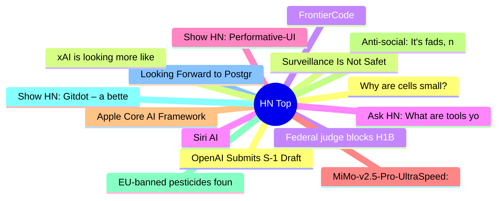

# HackerNews 每日 Top 30 (2026-06-09)

## 思维导图

## 列表（30 条）

### 1. OpenAI Submits S-1 Draft to SEC
- **链接**: [https://openai.com/index/openai-submits-confidential-s-1/](https://openai.com/index/openai-submits-confidential-s-1/)
- **分数**: 275 | **评论**: 167 | **作者**: hackerBanana
- **HN 讨论**: https://news.ycombinator.com/item?id=48452317

### 2. Surveillance Is Not Safety: A statement on the UK's latest threat to privacy [pdf]
- **链接**: [https://signal.org/blog/pdfs/2026-06-08-uk-surveillance-is-not-safety.pdf](https://signal.org/blog/pdfs/2026-06-08-uk-surveillance-is-not-safety.pdf)
- **分数**: 389 | **评论**: 127 | **作者**: g0xA52A2A
- **HN 讨论**: https://news.ycombinator.com/item?id=48450646

### 3. Federal judge blocks H1B visa $100K fee
- **链接**: [https://www.alaskasnewssource.com/2026/06/08/federal-judge-blocks-h1-b-visa-100k-fee/](https://www.alaskasnewssource.com/2026/06/08/federal-judge-blocks-h1-b-visa-100k-fee/)
- **分数**: 50 | **评论**: 39 | **作者**: naturalmovement
- **HN 讨论**: https://news.ycombinator.com/item?id=48454210

### 4. Siri AI
- **链接**: [https://www.apple.com/apple-intelligence/](https://www.apple.com/apple-intelligence/)
- **分数**: 388 | **评论**: 333 | **作者**: 0xedb
- **HN 讨论**: https://news.ycombinator.com/item?id=48449084

### 5. Show HN: Performative-UI – A react component library of design tropes
- **链接**: [https://vorpus.github.io/performativeUI/](https://vorpus.github.io/performativeUI/)
- **分数**: 759 | **评论**: 154 | **作者**: lizhang
- **HN 讨论**: https://news.ycombinator.com/item?id=48445554

### 6. MiMo-v2.5-Pro-UltraSpeed: 1T model with 1000 tokens per second
- **链接**: [https://mimo.xiaomi.com/blog/mimo-tilert-1000tps](https://mimo.xiaomi.com/blog/mimo-tilert-1000tps)
- **分数**: 489 | **评论**: 335 | **作者**: gainsurier
- **HN 讨论**: https://news.ycombinator.com/item?id=48446639

### 7. Apple Core AI Framework
- **链接**: [https://developer.apple.com/documentation/coreai/](https://developer.apple.com/documentation/coreai/)
- **分数**: 175 | **评论**: 33 | **作者**: hmokiguess
- **HN 讨论**: https://news.ycombinator.com/item?id=48449665

### 8. Anti-social: It's fads, not friends, which now dominate social media feeds
- **链接**: [https://www.bbc.com/worklife/article/20260520-how-social-media-ceased-to-be-social](https://www.bbc.com/worklife/article/20260520-how-social-media-ceased-to-be-social)
- **分数**: 542 | **评论**: 405 | **作者**: 1vuio0pswjnm7
- **HN 讨论**: https://news.ycombinator.com/item?id=48444228

### 9. EU-banned pesticides found in rice, tea and spices
- **链接**: [https://www.foodwatch.org/en/eu-banned-pesticides-found-in-rice-tea-and-spices](https://www.foodwatch.org/en/eu-banned-pesticides-found-in-rice-tea-and-spices)
- **分数**: 224 | **评论**: 83 | **作者**: john-titor
- **HN 讨论**: https://news.ycombinator.com/item?id=48447062

### 10. Show HN: Gitdot – a better GitHub. Open-source, written in Rust
- **链接**: [https://gitdot.io/](https://gitdot.io/)
- **分数**: 139 | **评论**: 119 | **作者**: baepaul
- **HN 讨论**: https://news.ycombinator.com/item?id=48447806

### 11. Looking Forward to Postgres 19: Query Hints
- **链接**: [https://www.pgedge.com/blog/looking-forward-to-postgres-19-query-hints](https://www.pgedge.com/blog/looking-forward-to-postgres-19-query-hints)
- **分数**: 45 | **评论**: 5 | **作者**: jjgreen
- **HN 讨论**: https://news.ycombinator.com/item?id=48413655

### 12. Why are cells small?
- **链接**: [https://burrito.bio/essays/what-limits-a-cells-size](https://burrito.bio/essays/what-limits-a-cells-size)
- **分数**: 104 | **评论**: 47 | **作者**: mailyk
- **HN 讨论**: https://news.ycombinator.com/item?id=48450065

### 13. xAI is looking more like a datacentre REIT than a frontier lab
- **链接**: [https://martinalderson.com/posts/xais-new-rental-business/](https://martinalderson.com/posts/xais-new-rental-business/)
- **分数**: 387 | **评论**: 306 | **作者**: martinald
- **HN 讨论**: https://news.ycombinator.com/item?id=48446428

### 14. FrontierCode
- **链接**: [https://cognition.ai/blog/frontier-code](https://cognition.ai/blog/frontier-code)
- **分数**: 88 | **评论**: 19 | **作者**: streamer45
- **HN 讨论**: https://news.ycombinator.com/item?id=48451723

### 15. Ask HN: What are tools you have made for yourself since the advent of AI?
- **链接**: [https://news.ycombinator.com/item?id=48449187](https://news.ycombinator.com/item?id=48449187)
- **分数**: 139 | **评论**: 256 | **作者**: aryamaan
- **HN 讨论**: https://news.ycombinator.com/item?id=48449187

### 16. Apple reveals new AI architecture built around Google Gemini models
- **链接**: [https://www.macrumors.com/2026/06/08/apple-reveals-new-ai-architecture/](https://www.macrumors.com/2026/06/08/apple-reveals-new-ai-architecture/)
- **分数**: 319 | **评论**: 309 | **作者**: unclefuzzy
- **HN 讨论**: https://news.ycombinator.com/item?id=48450142

### 17. Launch HN: Intuned (YC S22) – Build and run reliable browser automations as code
- **链接**: [https://intunedhq.com](https://intunedhq.com)
- **分数**: 101 | **评论**: 44 | **作者**: fkilaiwi
- **HN 讨论**: https://news.ycombinator.com/item?id=48445171

### 18. Games Between Programs: The Ruliology of Competition
- **链接**: [https://writings.stephenwolfram.com/2026/06/games-between-programs-the-ruliology-of-competition/](https://writings.stephenwolfram.com/2026/06/games-between-programs-the-ruliology-of-competition/)
- **分数**: 8 | **评论**: 0 | **作者**: andromaton
- **HN 讨论**: https://news.ycombinator.com/item?id=48419769

### 19. Doing Something That's Never Been Done Before
- **链接**: [https://talglobus.com/p/doing-something-thats-never-been-done-before/](https://talglobus.com/p/doing-something-thats-never-been-done-before/)
- **分数**: 25 | **评论**: 12 | **作者**: surprisetalk
- **HN 讨论**: https://news.ycombinator.com/item?id=48413067

### 20. AI is slowing down
- **链接**: [https://www.wheresyoured.at/ai-is-slowing-down/](https://www.wheresyoured.at/ai-is-slowing-down/)
- **分数**: 376 | **评论**: 397 | **作者**: crescit_eundo
- **HN 讨论**: https://news.ycombinator.com/item?id=48446893

### 21. Show HN: Mach – A compiled systems language looking for contributions
- **链接**: [https://github.com/octalide/mach](https://github.com/octalide/mach)
- **分数**: 12 | **评论**: 3 | **作者**: octalide
- **HN 讨论**: https://news.ycombinator.com/item?id=48453666

### 22. Fooling Go's X.509 Certificate Verification
- **链接**: [https://danielmangum.com/posts/fooling-go-x509-certificate-verification/](https://danielmangum.com/posts/fooling-go-x509-certificate-verification/)
- **分数**: 43 | **评论**: 20 | **作者**: hasheddan
- **HN 讨论**: https://news.ycombinator.com/item?id=48425166

### 23. 1worldflag: A blue dot on a transparent background
- **链接**: [https://1worldflag.com/](https://1worldflag.com/)
- **分数**: 169 | **评论**: 143 | **作者**: davidbarker
- **HN 讨论**: https://news.ycombinator.com/item?id=48440435

### 24. OCaml Onboarding: Introduction to the Dune build system
- **链接**: [https://ocamlpro.com/blog/2025_07_29_ocaml_onboarding_introduction_to_dune/](https://ocamlpro.com/blog/2025_07_29_ocaml_onboarding_introduction_to_dune/)
- **分数**: 140 | **评论**: 17 | **作者**: andrewstetsenko
- **HN 讨论**: https://news.ycombinator.com/item?id=48402137

### 25. How much of Thermo Fisher's antibody data has been manipulated?
- **链接**: [https://reeserichardson.blog/2026/05/28/how-much-of-thermo-fishers-antibody-data-has-been-manipulated/](https://reeserichardson.blog/2026/05/28/how-much-of-thermo-fishers-antibody-data-has-been-manipulated/)
- **分数**: 408 | **评论**: 88 | **作者**: mhrmsn
- **HN 讨论**: https://news.ycombinator.com/item?id=48442075

### 26. Switzerland wil have a referendum to cap population at 10M
- **链接**: [https://www.admin.ch/en/sustainability-initiative](https://www.admin.ch/en/sustainability-initiative)
- **分数**: 233 | **评论**: 472 | **作者**: napolux
- **HN 讨论**: https://news.ycombinator.com/item?id=48450059

### 27. Massachusetts bans sale of precise location data in new privacy rights bill
- **链接**: [https://techcrunch.com/2026/06/08/massachusetts-votes-to-pass-new-privacy-rights-bill-that-bans-sale-of-precise-location-data/](https://techcrunch.com/2026/06/08/massachusetts-votes-to-pass-new-privacy-rights-bill-that-bans-sale-of-precise-location-data/)
- **分数**: 264 | **评论**: 40 | **作者**: 01-_-
- **HN 讨论**: https://news.ycombinator.com/item?id=48448012

### 28. Stop the Apple Music app from launching
- **链接**: [https://lowtechguys.com/musicdecoy/](https://lowtechguys.com/musicdecoy/)
- **分数**: 568 | **评论**: 231 | **作者**: bobbiechen
- **HN 讨论**: https://news.ycombinator.com/item?id=48447935

### 29. Are you expected to run five Python type-checkers now?
- **链接**: [https://pyrefly.org/blog/too-many-type-checkers/](https://pyrefly.org/blog/too-many-type-checkers/)
- **分数**: 136 | **评论**: 153 | **作者**: ocamoss
- **HN 讨论**: https://news.ycombinator.com/item?id=48444442

### 30. Show HN: Command Center, the AI coding env for people who care about quality
- **链接**: [https://www.cc.dev/](https://www.cc.dev/)
- **分数**: 29 | **评论**: 8 | **作者**: Darmani
- **HN 讨论**: https://news.ycombinator.com/item?id=48453002
