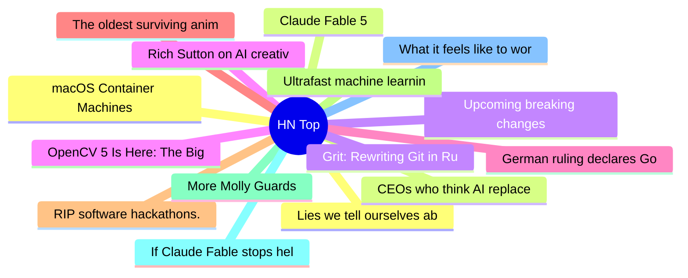

# HackerNews 每日 Top 30 (2026-06-10)

## 思维导图

## 列表（30 条）

### 1. macOS Container Machines
- **链接**: [https://github.com/apple/container/blob/main/docs/container-machine.md](https://github.com/apple/container/blob/main/docs/container-machine.md)
- **分数**: 391 | **评论**: 137 | **作者**: timsneath
- **HN 讨论**: https://news.ycombinator.com/item?id=48469658

### 2. Claude Fable 5
- **链接**: [https://www.anthropic.com/news/claude-fable-5-mythos-5](https://www.anthropic.com/news/claude-fable-5-mythos-5)
- **分数**: 1926 | **评论**: 1507 | **作者**: Philpax
- **HN 讨论**: https://news.ycombinator.com/item?id=48463808

### 3. Upcoming breaking changes for npm v12
- **链接**: [https://github.blog/changelog/2026-06-09-upcoming-breaking-changes-for-npm-v12/](https://github.blog/changelog/2026-06-09-upcoming-breaking-changes-for-npm-v12/)
- **分数**: 248 | **评论**: 80 | **作者**: plasma
- **HN 讨论**: https://news.ycombinator.com/item?id=48467705

### 4. Rich Sutton on AI creativity and discovery
- **链接**: [https://twitter.com/RichardSSutton/status/2061216087744946656](https://twitter.com/RichardSSutton/status/2061216087744946656)
- **分数**: 43 | **评论**: 18 | **作者**: yimby
- **HN 讨论**: https://news.ycombinator.com/item?id=48470581

### 5. German ruling declares Google liable for false answers in AI Overviews
- **链接**: [https://the-decoder.com/landmark-german-ruling-declares-googles-ai-overviews-are-googles-own-words-and-makes-it-liable-for-false-answers/](https://the-decoder.com/landmark-german-ruling-declares-googles-ai-overviews-are-googles-own-words-and-makes-it-liable-for-false-answers/)
- **分数**: 183 | **评论**: 92 | **作者**: ahlCVA
- **HN 讨论**: https://news.ycombinator.com/item?id=48470248

### 6. The oldest surviving animated feature film at 100
- **链接**: [https://www.bbc.com/culture/article/20260603-how-a-26-year-old-german-woman-made-the-worlds-oldest-surviving-animated-feature-film](https://www.bbc.com/culture/article/20260603-how-a-26-year-old-german-woman-made-the-worlds-oldest-surviving-animated-feature-film)
- **分数**: 53 | **评论**: 4 | **作者**: 1659447091
- **HN 讨论**: https://news.ycombinator.com/item?id=48431213

### 7. RIP software hackathons. Long live the hardware hackathon
- **链接**: [https://blog.oscars.dev/posts/rip-software-hackathons-long-live-the-hardware-hackathon/](https://blog.oscars.dev/posts/rip-software-hackathons-long-live-the-hardware-hackathon/)
- **分数**: 99 | **评论**: 34 | **作者**: ozcap
- **HN 讨论**: https://news.ycombinator.com/item?id=48468766

### 8. Ultrafast machine learning on FPGAs via Kolmogorov-Arnold Networks
- **链接**: [https://aarushgupta.io/posts/kan-fpga/](https://aarushgupta.io/posts/kan-fpga/)
- **分数**: 184 | **评论**: 25 | **作者**: ag2718
- **HN 讨论**: https://news.ycombinator.com/item?id=48466277

### 9. More Molly Guards
- **链接**: [https://unsung.aresluna.org/more-molly-guards/](https://unsung.aresluna.org/more-molly-guards/)
- **分数**: 72 | **评论**: 4 | **作者**: zdw
- **HN 讨论**: https://news.ycombinator.com/item?id=48427468

### 10. If Claude Fable stops helping you, you'll never know
- **链接**: [https://jonready.com/blog/posts/claude-fable5-is-allowed-to-sabotage-your-app-if-youre-a-competitor.html](https://jonready.com/blog/posts/claude-fable5-is-allowed-to-sabotage-your-app-if-youre-a-competitor.html)
- **分数**: 622 | **评论**: 307 | **作者**: mips_avatar
- **HN 讨论**: https://news.ycombinator.com/item?id=48467896

### 11. What it feels like to work with Mythos
- **链接**: [https://www.oneusefulthing.org/p/what-it-feels-like-to-work-with-mythos](https://www.oneusefulthing.org/p/what-it-feels-like-to-work-with-mythos)
- **分数**: 195 | **评论**: 175 | **作者**: swolpers
- **HN 讨论**: https://news.ycombinator.com/item?id=48464140

### 12. Lies we tell ourselves about email addresses
- **链接**: [https://gitpush--force.com/commits/2026/06/lies-we-tell-ourselves-about-email/](https://gitpush--force.com/commits/2026/06/lies-we-tell-ourselves-about-email/)
- **分数**: 65 | **评论**: 51 | **作者**: theanonymousone
- **HN 讨论**: https://news.ycombinator.com/item?id=48445834

### 13. CEOs who think AI replaces their employees are just bad CEOs
- **链接**: [https://www.techdirt.com/2026/06/09/ceos-who-think-ai-replaces-their-employees-are-just-bad-ceos/](https://www.techdirt.com/2026/06/09/ceos-who-think-ai-replaces-their-employees-are-just-bad-ceos/)
- **分数**: 511 | **评论**: 208 | **作者**: speckx
- **HN 讨论**: https://news.ycombinator.com/item?id=48465675

### 14. Grit: Rewriting Git in Rust with agents
- **链接**: [https://blog.gitbutler.com/true-grit](https://blog.gitbutler.com/true-grit)
- **分数**: 100 | **评论**: 139 | **作者**: cbrewster
- **HN 讨论**: https://news.ycombinator.com/item?id=48466812

### 15. OpenCV 5 Is Here: The Biggest Leap in Years for Computer Vision
- **链接**: [https://opencv.org/opencv-5/](https://opencv.org/opencv-5/)
- **分数**: 717 | **评论**: 127 | **作者**: ternaus
- **HN 讨论**: https://news.ycombinator.com/item?id=48421858

### 16. Let's Encrypt bans certificate usage in any US sanctioned territory [pdf]
- **链接**: [https://letsencrypt.org/documents/LE-SA-v1.7-June-04-2026-diff.pdf](https://letsencrypt.org/documents/LE-SA-v1.7-June-04-2026-diff.pdf)
- **分数**: 355 | **评论**: 294 | **作者**: piskov
- **HN 讨论**: https://news.ycombinator.com/item?id=48453275

### 17. Launch HN: Transload (YC P26) – Measuring freight items with CCTV
- **链接**: [https://news.ycombinator.com/item?id=48463273](https://news.ycombinator.com/item?id=48463273)
- **分数**: 39 | **评论**: 15 | **作者**: nils_spatial
- **HN 讨论**: https://news.ycombinator.com/item?id=48463273

### 18. Exif Smuggling (2025)
- **链接**: [https://github.com/signalblur/exifsmugglingpoc](https://github.com/signalblur/exifsmugglingpoc)
- **分数**: 71 | **评论**: 23 | **作者**: rolph
- **HN 讨论**: https://news.ycombinator.com/item?id=48467759

### 19. A giant star may have destroyed itself in one of the rarest explosions
- **链接**: [https://phys.org/news/2026-05-giant-star-destroyed-universe-rarest.html](https://phys.org/news/2026-05-giant-star-destroyed-universe-rarest.html)
- **分数**: 172 | **评论**: 25 | **作者**: wglb
- **HN 讨论**: https://news.ycombinator.com/item?id=48451966

### 20. Test-case reducers are underappreciated debugging tools
- **链接**: [https://tratt.net/laurie/blog/2026/test_case_reducers_are_underappreciated_debugging_tools.html](https://tratt.net/laurie/blog/2026/test_case_reducers_are_underappreciated_debugging_tools.html)
- **分数**: 101 | **评论**: 13 | **作者**: ltratt
- **HN 讨论**: https://news.ycombinator.com/item?id=48459659

### 21. Value Numbering
- **链接**: [https://bernsteinbear.com/blog/value-numbering/](https://bernsteinbear.com/blog/value-numbering/)
- **分数**: 13 | **评论**: 0 | **作者**: surprisetalk
- **HN 讨论**: https://news.ycombinator.com/item?id=48444654

### 22. Bit Propagation over a Noisy Grid
- **链接**: [https://jasonfantl.com/posts/Propagating-Bit-on-Grid/](https://jasonfantl.com/posts/Propagating-Bit-on-Grid/)
- **分数**: 3 | **评论**: 0 | **作者**: jfantl
- **HN 讨论**: https://news.ycombinator.com/item?id=48445028

### 23. It's death
- **链接**: [https://jesseduffield.com/ITS-DEATH/](https://jesseduffield.com/ITS-DEATH/)
- **分数**: 137 | **评论**: 41 | **作者**: inatreecrown2
- **HN 讨论**: https://news.ycombinator.com/item?id=48469347

### 24. Making Graphics Like it's 1993
- **链接**: [https://staniks.github.io/articles/catlantean-3d-blog-1/](https://staniks.github.io/articles/catlantean-3d-blog-1/)
- **分数**: 806 | **评论**: 137 | **作者**: sklopec
- **HN 讨论**: https://news.ycombinator.com/item?id=48459294

### 25. The LD_DEBUG environment variable (2012)
- **链接**: [https://bnikolic.co.uk/blog/linux-ld-debug.html](https://bnikolic.co.uk/blog/linux-ld-debug.html)
- **分数**: 66 | **评论**: 2 | **作者**: tanelpoder
- **HN 讨论**: https://news.ycombinator.com/item?id=48464330

### 26. Show HN: Resonate – Low-latency, high-resolution spectral analysis
- **链接**: [https://alexandrefrancois.org/Resonate/](https://alexandrefrancois.org/Resonate/)
- **分数**: 31 | **评论**: 11 | **作者**: arjf
- **HN 讨论**: https://news.ycombinator.com/item?id=48427423

### 27. FCC wants to kill burner phones by forcing telecoms to get all customers' IDs
- **链接**: [https://www.404media.co/fcc-wants-to-kill-burner-phones-by-forcing-telecoms-to-get-all-customers-ids/](https://www.404media.co/fcc-wants-to-kill-burner-phones-by-forcing-telecoms-to-get-all-customers-ids/)
- **分数**: 491 | **评论**: 309 | **作者**: berlianta
- **HN 讨论**: https://news.ycombinator.com/item?id=48462308

### 28. WWDC 2026: Apple is Folding
- **链接**: [https://cupertinolens.com/2026/06/09/wwdc-2026-apple-is-folding/](https://cupertinolens.com/2026/06/09/wwdc-2026-apple-is-folding/)
- **分数**: 187 | **评论**: 224 | **作者**: brandonb
- **HN 讨论**: https://news.ycombinator.com/item?id=48461226

### 29. Is Grep All You Need? How Agent Harnesses Reshape Agentic Search
- **链接**: [https://arxiv.org/abs/2605.15184](https://arxiv.org/abs/2605.15184)
- **分数**: 133 | **评论**: 58 | **作者**: Anon84
- **HN 讨论**: https://news.ycombinator.com/item?id=48460863

### 30. Experience using AI software to prove Euler sum results [pdf]
- **链接**: [https://www.davidhbailey.com/dhbpapers/Chatbots.pdf](https://www.davidhbailey.com/dhbpapers/Chatbots.pdf)
- **分数**: 5 | **评论**: 0 | **作者**: cpp_frog
- **HN 讨论**: https://news.ycombinator.com/item?id=48449567
