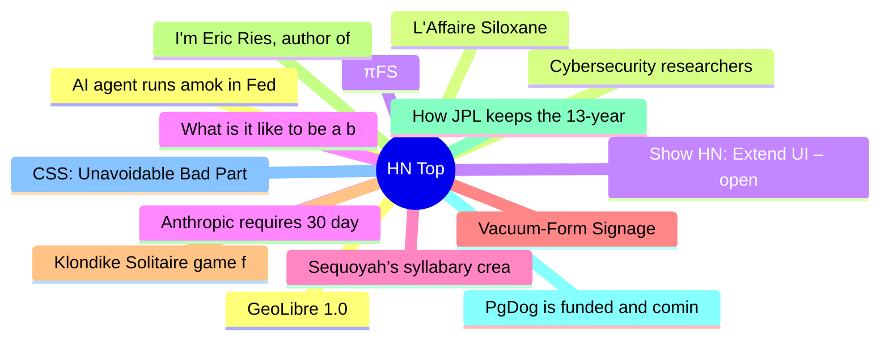

# HackerNews 每日 Top 30 (2026-06-11)

## 思维导图

## 列表（30 条）

### 1. AI agent runs amok in Fedora and elsewhere
- **链接**: [https://lwn.net/SubscriberLink/1077035/c7e7c14fbd60fae9/](https://lwn.net/SubscriberLink/1077035/c7e7c14fbd60fae9/)
- **分数**: 212 | **评论**: 56 | **作者**: tanelpoder
- **HN 讨论**: https://news.ycombinator.com/item?id=48484584

### 2. Cybersecurity researchers aren't happy about the guardrails on Anthropic's Fable
- **链接**: [https://techcrunch.com/2026/06/10/cybersecurity-researchers-arent-happy-about-the-guardrails-on-anthropics-fable/](https://techcrunch.com/2026/06/10/cybersecurity-researchers-arent-happy-about-the-guardrails-on-anthropics-fable/)
- **分数**: 297 | **评论**: 274 | **作者**: speckx
- **HN 讨论**: https://news.ycombinator.com/item?id=48478969

### 3. πFS
- **链接**: [https://github.com/philipl/pifs](https://github.com/philipl/pifs)
- **分数**: 583 | **评论**: 142 | **作者**: helterskelter
- **HN 讨论**: https://news.ycombinator.com/item?id=48480978

### 4. Anthropic requires 30 day data retention for Fable and Mythos
- **链接**: [https://support.claude.com/en/articles/15425996-data-retention-practices-for-mythos-class-models](https://support.claude.com/en/articles/15425996-data-retention-practices-for-mythos-class-models)
- **分数**: 269 | **评论**: 128 | **作者**: lebovic
- **HN 讨论**: https://news.ycombinator.com/item?id=48464258

### 5. Sequoyah’s syllabary created a written language for the Cherokee
- **链接**: [https://www.smithsonianmag.com/innovation/man-created-written-language-cherokee-did-efficiently-elegantly-peers-thought-magic-180988850/](https://www.smithsonianmag.com/innovation/man-created-written-language-cherokee-did-efficiently-elegantly-peers-thought-magic-180988850/)
- **分数**: 127 | **评论**: 80 | **作者**: grahambargeron
- **HN 讨论**: https://news.ycombinator.com/item?id=48483387

### 6. Vacuum-Form Signage
- **链接**: [https://bethmathews.substack.com/p/the-history-behind-the-signs-lighting](https://bethmathews.substack.com/p/the-history-behind-the-signs-lighting)
- **分数**: 33 | **评论**: 4 | **作者**: benbreen
- **HN 讨论**: https://news.ycombinator.com/item?id=48470748

### 7. Klondike Solitaire game for curses in 5k of C
- **链接**: [https://nanochess.org/klondike_in_c.html](https://nanochess.org/klondike_in_c.html)
- **分数**: 43 | **评论**: 2 | **作者**: nanochess
- **HN 讨论**: https://news.ycombinator.com/item?id=48450024

### 8. I'm Eric Ries, author of "The Lean Startup" and new book "Incorruptible" – AMA
- **链接**: [https://news.ycombinator.com/item?id=48477135](https://news.ycombinator.com/item?id=48477135)
- **分数**: 574 | **评论**: 439 | **作者**: eries
- **HN 讨论**: https://news.ycombinator.com/item?id=48477135

### 9. How JPL keeps the 13-year-old Curiosity rover doing science
- **链接**: [https://spectrum.ieee.org/curiosity-rover-jpl-mars-science](https://spectrum.ieee.org/curiosity-rover-jpl-mars-science)
- **分数**: 194 | **评论**: 48 | **作者**: pseudolus
- **HN 讨论**: https://news.ycombinator.com/item?id=48479705

### 10. PgDog is funded and coming to a database near you
- **链接**: [https://pgdog.dev/blog/our-funding-announcement](https://pgdog.dev/blog/our-funding-announcement)
- **分数**: 420 | **评论**: 207 | **作者**: levkk
- **HN 讨论**: https://news.ycombinator.com/item?id=48476466

### 11. CSS: Unavoidable Bad Parts
- **链接**: [https://matklad.github.io/2026/06/04/css-unavoidable-bad-parts.html](https://matklad.github.io/2026/06/04/css-unavoidable-bad-parts.html)
- **分数**: 22 | **评论**: 3 | **作者**: surprisetalk
- **HN 讨论**: https://news.ycombinator.com/item?id=48459678

### 12. GeoLibre 1.0
- **链接**: [https://geolibre.app/](https://geolibre.app/)
- **分数**: 183 | **评论**: 12 | **作者**: jonbaer
- **HN 讨论**: https://news.ycombinator.com/item?id=48479852

### 13. L'Affaire Siloxane
- **链接**: [https://mceglowski.substack.com/p/laffaire-siloxane](https://mceglowski.substack.com/p/laffaire-siloxane)
- **分数**: 182 | **评论**: 29 | **作者**: idlewords
- **HN 讨论**: https://news.ycombinator.com/item?id=48456808

### 14. Show HN: Extend UI – open-source UI kit for modern document apps
- **链接**: [https://www.extend.ai/ui](https://www.extend.ai/ui)
- **分数**: 175 | **评论**: 42 | **作者**: kbyatnal
- **HN 讨论**: https://news.ycombinator.com/item?id=48478469

### 15. What is it like to be a bat? (1974) [pdf]
- **链接**: [https://www.sas.upenn.edu/~cavitch/pdf-library/Nagel_Bat.pdf](https://www.sas.upenn.edu/~cavitch/pdf-library/Nagel_Bat.pdf)
- **分数**: 75 | **评论**: 71 | **作者**: shadow28
- **HN 讨论**: https://news.ycombinator.com/item?id=48482293

### 16. The Road to the WASM Component Model 1.0
- **链接**: [https://bytecodealliance.org/articles/the-road-to-component-model-1-0](https://bytecodealliance.org/articles/the-road-to-component-model-1-0)
- **分数**: 9 | **评论**: 4 | **作者**: emschwartz
- **HN 讨论**: https://news.ycombinator.com/item?id=48448083

### 17. Deficient executive control in transformer attention
- **链接**: [https://academic.oup.com/pnasnexus/article/5/6/pgag149/8698838](https://academic.oup.com/pnasnexus/article/5/6/pgag149/8698838)
- **分数**: 29 | **评论**: 10 | **作者**: derbOac
- **HN 讨论**: https://news.ycombinator.com/item?id=48484282

### 18. Who's the smartest corvid?
- **链接**: [https://thetyee.ca/Culture/2026/06/05/Whos-the-Smartest-Corvid/](https://thetyee.ca/Culture/2026/06/05/Whos-the-Smartest-Corvid/)
- **分数**: 83 | **评论**: 69 | **作者**: NaOH
- **HN 讨论**: https://news.ycombinator.com/item?id=48464484

### 19. Are insecure code completions in PyCharm a vulnerability?
- **链接**: [https://sethmlarson.dev/are-insecure-code-completions-a-vulnerability](https://sethmlarson.dev/are-insecure-code-completions-a-vulnerability)
- **分数**: 9 | **评论**: 1 | **作者**: 12_throw_away
- **HN 讨论**: https://news.ycombinator.com/item?id=48485160

### 20. Raspberry Pi 5 – 16GB RAM
- **链接**: [https://www.adafruit.com/product/6125?src=raspberrypi](https://www.adafruit.com/product/6125?src=raspberrypi)
- **分数**: 197 | **评论**: 214 | **作者**: akman
- **HN 讨论**: https://news.ycombinator.com/item?id=48481857

### 21. Building an HTML-first site doubled our users overnight
- **链接**: [https://mohkohn.co.uk/writing/html-first/](https://mohkohn.co.uk/writing/html-first/)
- **分数**: 1031 | **评论**: 475 | **作者**: edent
- **HN 讨论**: https://news.ycombinator.com/item?id=48475483

### 22. World Capitals Voronoi
- **链接**: [https://www.jasondavies.com/maps/voronoi/capitals/](https://www.jasondavies.com/maps/voronoi/capitals/)
- **分数**: 51 | **评论**: 23 | **作者**: vincnetas
- **HN 讨论**: https://news.ycombinator.com/item?id=48446532

### 23. Unix GC Remastered
- **链接**: [https://mohandacherir.github.io/Qdiv7/posts/unix_new_gc/](https://mohandacherir.github.io/Qdiv7/posts/unix_new_gc/)
- **分数**: 24 | **评论**: 2 | **作者**: mananaysiempre
- **HN 讨论**: https://news.ycombinator.com/item?id=48483854

### 24. Show HN: HelixDB – A graph database built on object storage
- **链接**: [https://github.com/HelixDB/helix-db/tree/main](https://github.com/HelixDB/helix-db/tree/main)
- **分数**: 100 | **评论**: 32 | **作者**: GeorgeCurtis
- **HN 讨论**: https://news.ycombinator.com/item?id=48478148

### 25. Apache Burr: Build reliable AI agents and applications
- **链接**: [https://burr.apache.org/](https://burr.apache.org/)
- **分数**: 184 | **评论**: 95 | **作者**: anhldbk
- **HN 讨论**: https://news.ycombinator.com/item?id=48477400

### 26. Claude Desktop spawns 1.8 GB Hyper-V VM on every launch, even for chat-only use
- **链接**: [https://github.com/anthropics/claude-code/issues/29045](https://github.com/anthropics/claude-code/issues/29045)
- **分数**: 369 | **评论**: 256 | **作者**: tonyrice
- **HN 讨论**: https://news.ycombinator.com/item?id=48479452

### 27. All 9,300 Japanese train station, animated by the year it opened (1872–2026)
- **链接**: [https://jivx.com/eki](https://jivx.com/eki)
- **分数**: 211 | **评论**: 73 | **作者**: momentmaker
- **HN 讨论**: https://news.ycombinator.com/item?id=48475100

### 28. Notes on DeepSeek
- **链接**: [https://news.ycombinator.com/item?id=48476474](https://news.ycombinator.com/item?id=48476474)
- **分数**: 148 | **评论**: 94 | **作者**: vinhnx
- **HN 讨论**: https://news.ycombinator.com/item?id=48476474

### 29. Authentication issues related to API requests
- **链接**: [https://www.githubstatus.com/incidents/fcj3088jg1wx](https://www.githubstatus.com/incidents/fcj3088jg1wx)
- **分数**: 156 | **评论**: 31 | **作者**: Multicomp
- **HN 讨论**: https://news.ycombinator.com/item?id=48477851

### 30. Smudging the game disc to make speedrunning 'SpongeBob' faster
- **链接**: [https://www.inverse.com/input/gaming/the-dirty-secret-that-makes-speedrunning-on-spongebob-a-lot-faster](https://www.inverse.com/input/gaming/the-dirty-secret-that-makes-speedrunning-on-spongebob-a-lot-faster)
- **分数**: 84 | **评论**: 50 | **作者**: pncnmnp
- **HN 讨论**: https://news.ycombinator.com/item?id=48470578
