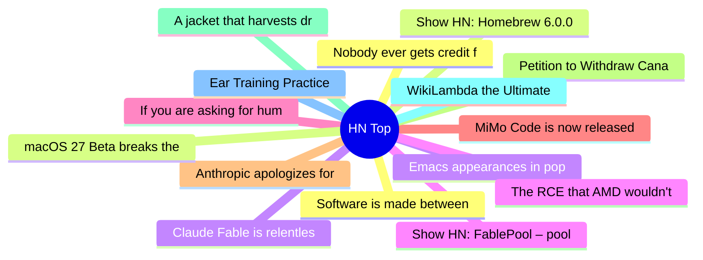

# HackerNews 每日 Top 30 (2026-06-12)

## 思维导图

## 列表（30 条）

### 1. Nobody ever gets credit for fixing problems that never happened (2001) [pdf]
- **链接**: [https://web.mit.edu/nelsonr/www/Repenning=Sterman_CMR_su01_.pdf](https://web.mit.edu/nelsonr/www/Repenning=Sterman_CMR_su01_.pdf)
- **分数**: 209 | **评论**: 75 | **作者**: sam_bristow
- **HN 讨论**: https://news.ycombinator.com/item?id=48498385

### 2. Show HN: Homebrew 6.0.0
- **链接**: [https://brew.sh/2026/06/11/homebrew-6.0.0/](https://brew.sh/2026/06/11/homebrew-6.0.0/)
- **分数**: 1066 | **评论**: 245 | **作者**: mikemcquaid
- **HN 讨论**: https://news.ycombinator.com/item?id=48490024

### 3. Claude Fable is relentlessly proactive
- **链接**: [https://simonwillison.net/2026/Jun/11/fable-is-relentlessly-proactive/](https://simonwillison.net/2026/Jun/11/fable-is-relentlessly-proactive/)
- **分数**: 218 | **评论**: 172 | **作者**: lumpa
- **HN 讨论**: https://news.ycombinator.com/item?id=48498573

### 4. Show HN: FablePool – pool money behind a prompt, and Fable builds it in public
- **链接**: [https://fablepool.com](https://fablepool.com)
- **分数**: 310 | **评论**: 174 | **作者**: matthewbarras
- **HN 讨论**: https://news.ycombinator.com/item?id=48496539

### 5. If you are asking for human attention, demonstrate human effort
- **链接**: [https://tombedor.dev/human-attention-and-human-effort/](https://tombedor.dev/human-attention-and-human-effort/)
- **分数**: 381 | **评论**: 121 | **作者**: jjfoooo4
- **HN 讨论**: https://news.ycombinator.com/item?id=48497609

### 6. MiMo Code is now released and open-source
- **链接**: [https://mimo.xiaomi.com/mimocode](https://mimo.xiaomi.com/mimocode)
- **分数**: 446 | **评论**: 253 | **作者**: apeters
- **HN 讨论**: https://news.ycombinator.com/item?id=48490826

### 7. Anthropic apologizes for invisible Claude Fable guardrails
- **链接**: [https://www.theverge.com/ai-artificial-intelligence/948280/anthropic-claude-fable-invisible-distillation-guardrail](https://www.theverge.com/ai-artificial-intelligence/948280/anthropic-claude-fable-invisible-distillation-guardrail)
- **分数**: 352 | **评论**: 350 | **作者**: rarisma
- **HN 讨论**: https://news.ycombinator.com/item?id=48489229

### 8. Petition to Withdraw Canada's Bill C-22
- **链接**: [https://www.ourcommons.ca/petitions/en/Petition/Sign/e-7416](https://www.ourcommons.ca/petitions/en/Petition/Sign/e-7416)
- **分数**: 391 | **评论**: 135 | **作者**: hmokiguess
- **HN 讨论**: https://news.ycombinator.com/item?id=48491830

### 9. A jacket that harvests drinking water from the air
- **链接**: [https://news.utexas.edu/2026/06/11/this-jacket-pulls-drinking-water-from-thin-air/](https://news.utexas.edu/2026/06/11/this-jacket-pulls-drinking-water-from-thin-air/)
- **分数**: 65 | **评论**: 42 | **作者**: ilreb
- **HN 讨论**: https://news.ycombinator.com/item?id=48497576

### 10. WikiLambda the Ultimate
- **链接**: [https://en.wikipedia.org/wiki/Wikipedia:Wikipedia_Signpost/2026-05-22/Recent_research](https://en.wikipedia.org/wiki/Wikipedia:Wikipedia_Signpost/2026-05-22/Recent_research)
- **分数**: 11 | **评论**: 2 | **作者**: Antibabelic
- **HN 讨论**: https://news.ycombinator.com/item?id=48493218

### 11. Ear Training Practice
- **链接**: [https://tonedear.com/](https://tonedear.com/)
- **分数**: 187 | **评论**: 92 | **作者**: mattbit
- **HN 讨论**: https://news.ycombinator.com/item?id=48447598

### 12. Software is made between commits
- **链接**: [https://zed.dev/blog/introducing-deltadb](https://zed.dev/blog/introducing-deltadb)
- **分数**: 228 | **评论**: 167 | **作者**: jeremy_k
- **HN 讨论**: https://news.ycombinator.com/item?id=48492533

### 13. macOS 27 Beta breaks the ability to boot Asahi Linux
- **链接**: [https://www.phoronix.com/news/macOS-27-Beta-Breaks-Asahi](https://www.phoronix.com/news/macOS-27-Beta-Breaks-Asahi)
- **分数**: 266 | **评论**: 114 | **作者**: josephcsible
- **HN 讨论**: https://news.ycombinator.com/item?id=48462070

### 14. Emacs appearances in pop culture
- **链接**: [https://ianyepan.github.io/posts/emacs-in-pop-culture/](https://ianyepan.github.io/posts/emacs-in-pop-culture/)
- **分数**: 284 | **评论**: 81 | **作者**: ggcr
- **HN 讨论**: https://news.ycombinator.com/item?id=48474274

### 15. The RCE that AMD wouldn't fix
- **链接**: [https://mrbruh.com/amd2/](https://mrbruh.com/amd2/)
- **分数**: 243 | **评论**: 105 | **作者**: MrBruh
- **HN 讨论**: https://news.ycombinator.com/item?id=48492215

### 16. Lines of code got a better publicist
- **链接**: [https://curlewis.co.nz/posts/lines-of-code-got-a-better-publicist/](https://curlewis.co.nz/posts/lines-of-code-got-a-better-publicist/)
- **分数**: 375 | **评论**: 257 | **作者**: RyeCombinator
- **HN 讨论**: https://news.ycombinator.com/item?id=48489402

### 17. How we made hit video game Prince of Persia
- **链接**: [https://www.theguardian.com/culture/2026/jan/05/raiders-of-the-lost-ark-hit-video-game-prince-of-persia](https://www.theguardian.com/culture/2026/jan/05/raiders-of-the-lost-ark-hit-video-game-prince-of-persia)
- **分数**: 9 | **评论**: 0 | **作者**: msephton
- **HN 讨论**: https://news.ycombinator.com/item?id=48468852

### 18. Claude Fable 5: mid-tier results on coding tasks
- **链接**: [https://www.endorlabs.com/learn/claude-fable-5-mythos-grade-hype](https://www.endorlabs.com/learn/claude-fable-5-mythos-grade-hype)
- **分数**: 263 | **评论**: 117 | **作者**: bugvader
- **HN 讨论**: https://news.ycombinator.com/item?id=48492210

### 19. Developer gets Half-Life running at 30 FPS on a Nokia N95
- **链接**: [https://www.tomshardware.com/video-games/handheld-gaming/developer-gets-half-life-running-at-30-fps-on-a-2007-nokia-n95](https://www.tomshardware.com/video-games/handheld-gaming/developer-gets-half-life-running-at-30-fps-on-a-2007-nokia-n95)
- **分数**: 236 | **评论**: 76 | **作者**: ljf
- **HN 讨论**: https://news.ycombinator.com/item?id=48452001

### 20. Reading for pleasure is sharply down among schoolkids, report shows
- **链接**: [https://www.nbcnews.com/data-graphics/kids-reading-less-lower-levels-department-education-study-rcna348987](https://www.nbcnews.com/data-graphics/kids-reading-less-lower-levels-department-education-study-rcna348987)
- **分数**: 108 | **评论**: 131 | **作者**: freejoe76
- **HN 讨论**: https://news.ycombinator.com/item?id=48479314

### 21. A greyscale iPhone setup that works in everyday life
- **链接**: [https://www.fabianhemmert.com/opinions/a-greyscale-iphone-setup-that-works-in-everyday-life](https://www.fabianhemmert.com/opinions/a-greyscale-iphone-setup-that-works-in-everyday-life)
- **分数**: 79 | **评论**: 47 | **作者**: hemmert
- **HN 讨论**: https://news.ycombinator.com/item?id=48487229

### 22. How a new DSL may survive in the era of LLMs
- **链接**: [https://www.williamcotton.com/articles/how-a-new-dsl-survives-in-the-era-of-llms](https://www.williamcotton.com/articles/how-a-new-dsl-survives-in-the-era-of-llms)
- **分数**: 28 | **评论**: 9 | **作者**: williamcotton
- **HN 讨论**: https://news.ycombinator.com/item?id=48490939

### 23. Removing 'um' from a recording is harder than it sounds
- **链接**: [https://doug.sh/posts/erm-a-local-cli-that-strips-ums-uhs-and-erms-from-speech/](https://doug.sh/posts/erm-a-local-cli-that-strips-ums-uhs-and-erms-from-speech/)
- **分数**: 31 | **评论**: 11 | **作者**: dougcalobrisi
- **HN 讨论**: https://news.ycombinator.com/item?id=48498421

### 24. Waymo Premier
- **链接**: [https://waymo.com/blog/2026/06/waymo-premier/](https://waymo.com/blog/2026/06/waymo-premier/)
- **分数**: 170 | **评论**: 420 | **作者**: boulos
- **HN 讨论**: https://news.ycombinator.com/item?id=48492304

### 25. Show HN: Boo – Screen-style terminal multiplexer built on libghostty
- **链接**: [https://github.com/coder/boo](https://github.com/coder/boo)
- **分数**: 61 | **评论**: 20 | **作者**: kylecarbs
- **HN 讨论**: https://news.ycombinator.com/item?id=48496250

### 26. Faking keyword arguments to functions in C++
- **链接**: [https://nibblestew.blogspot.com/2026/06/faking-keyword-arguments-to-functions.html](https://nibblestew.blogspot.com/2026/06/faking-keyword-arguments-to-functions.html)
- **分数**: 18 | **评论**: 13 | **作者**: ibobev
- **HN 讨论**: https://news.ycombinator.com/item?id=48459999

### 27. Making a vintage LLM from scratch
- **链接**: [https://crlf.link/log/entries/260525-1/](https://crlf.link/log/entries/260525-1/)
- **分数**: 33 | **评论**: 5 | **作者**: croqaz
- **HN 讨论**: https://news.ycombinator.com/item?id=48487829

### 28. FPS.cob: A first person shooter in COBOL
- **链接**: [https://github.com/icitry/FPS.cob](https://github.com/icitry/FPS.cob)
- **分数**: 110 | **评论**: 63 | **作者**: MBCook
- **HN 讨论**: https://news.ycombinator.com/item?id=48491486

### 29. Apple didn't revolutionize power supplies; new transistors did (2012)
- **链接**: [https://www.righto.com/2012/02/apple-didnt-revolutionize-power.html](https://www.righto.com/2012/02/apple-didnt-revolutionize-power.html)
- **分数**: 103 | **评论**: 9 | **作者**: geerlingguy
- **HN 讨论**: https://news.ycombinator.com/item?id=48493564

### 30. Open Reproduction of DeepSeek-R1
- **链接**: [https://github.com/huggingface/open-r1](https://github.com/huggingface/open-r1)
- **分数**: 211 | **评论**: 17 | **作者**: yogthos
- **HN 讨论**: https://news.ycombinator.com/item?id=48489917
