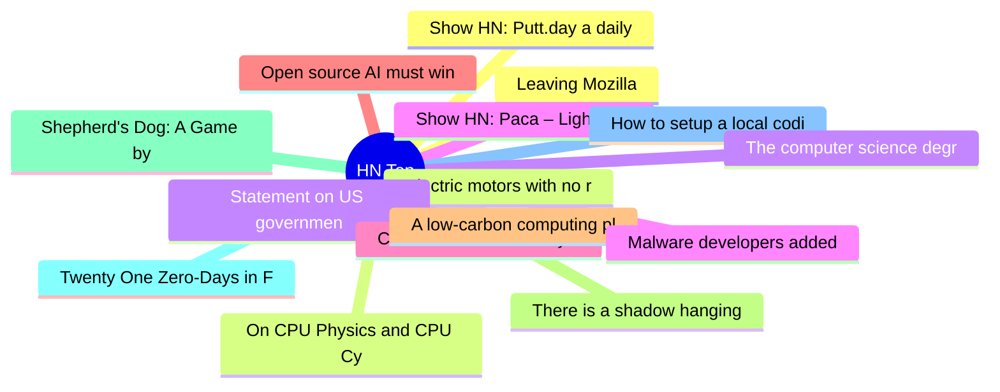

# HackerNews 每日 Top 30 (2026-06-13)

## 思维导图

## 列表（30 条）

### 1. Leaving Mozilla
- **链接**: [https://blog.unitedheroes.net/5751](https://blog.unitedheroes.net/5751)
- **分数**: 184 | **评论**: 89 | **作者**: martey
- **HN 讨论**: https://news.ycombinator.com/item?id=48513806

### 2. Electric motors with no rare earths
- **链接**: [https://www.renaultgroup.com/en/magazine/energy-and-powertrains/all-about-electric-motors-with-no-rare-earths/](https://www.renaultgroup.com/en/magazine/energy-and-powertrains/all-about-electric-motors-with-no-rare-earths/)
- **分数**: 474 | **评论**: 132 | **作者**: bestouff
- **HN 讨论**: https://news.ycombinator.com/item?id=48510010

### 3. Statement on US government directive to suspend access to Fable 5 and Mythos 5
- **链接**: [https://www.anthropic.com/news/fable-mythos-access](https://www.anthropic.com/news/fable-mythos-access)
- **分数**: 2343 | **评论**: 1684 | **作者**: Dylan1312
- **HN 讨论**: https://news.ycombinator.com/item?id=48511072

### 4. Show HN: Paca – Lightweight Jira alternative for human-AI collaboration
- **链接**: [https://github.com/Paca-AI/paca](https://github.com/Paca-AI/paca)
- **分数**: 6 | **评论**: 0 | **作者**: pikann22
- **HN 讨论**: https://news.ycombinator.com/item?id=48515385

### 5. CRISPR tech selectively shreds cancer cells, including "undruggable" cancers
- **链接**: [https://innovativegenomics.org/news/crispr-technique-selectively-shreds-cancer-cells/](https://innovativegenomics.org/news/crispr-technique-selectively-shreds-cancer-cells/)
- **分数**: 828 | **评论**: 190 | **作者**: gmays
- **HN 讨论**: https://news.ycombinator.com/item?id=48505231

### 6. Open source AI must win
- **链接**: [https://opensourceaimustwin.com/?share=v2](https://opensourceaimustwin.com/?share=v2)
- **分数**: 952 | **评论**: 302 | **作者**: vednig
- **HN 讨论**: https://news.ycombinator.com/item?id=48511908

### 7. A low-carbon computing platform from your retired phones
- **链接**: [https://research.google/blog/a-low-carbon-computing-platform-from-your-retired-phones/](https://research.google/blog/a-low-carbon-computing-platform-from-your-retired-phones/)
- **分数**: 5 | **评论**: 1 | **作者**: vikas-sharma
- **HN 讨论**: https://news.ycombinator.com/item?id=48515336

### 8. There is a shadow hanging over this Fable thing
- **链接**: [https://12gramsofcarbon.com/p/tech-things-there-is-a-massive-shadow](https://12gramsofcarbon.com/p/tech-things-there-is-a-massive-shadow)
- **分数**: 254 | **评论**: 235 | **作者**: theahura
- **HN 讨论**: https://news.ycombinator.com/item?id=48513536

### 9. Shepherd's Dog: A Game by the Most Dangerous AI Model
- **链接**: [https://koenvangilst.nl/lab/claude-fable-shepherds-dog](https://koenvangilst.nl/lab/claude-fable-shepherds-dog)
- **分数**: 90 | **评论**: 76 | **作者**: vnglst
- **HN 讨论**: https://news.ycombinator.com/item?id=48513728

### 10. Twenty One Zero-Days in FFmpeg
- **链接**: [https://depthfirst.com/research/21-zero-days-in-ffmpeg](https://depthfirst.com/research/21-zero-days-in-ffmpeg)
- **分数**: 214 | **评论**: 129 | **作者**: redbell
- **HN 讨论**: https://news.ycombinator.com/item?id=48510046

### 11. How to setup a local coding agent on macOS
- **链接**: [https://ikyle.me/blog/2026/how-to-setup-a-local-coding-agent-on-macos](https://ikyle.me/blog/2026/how-to-setup-a-local-coding-agent-on-macos)
- **分数**: 376 | **评论**: 94 | **作者**: kkm
- **HN 讨论**: https://news.ycombinator.com/item?id=48507020

### 12. Show HN: Putt.day a daily mini golf game
- **链接**: [https://putt.day/](https://putt.day/)
- **分数**: 185 | **评论**: 83 | **作者**: ellg
- **HN 讨论**: https://news.ycombinator.com/item?id=48510341

### 13. On CPU Physics and CPU Cycles
- **链接**: [https://6it.dev/blog/on-cpu-physics-and-cpu-cycles-80730](https://6it.dev/blog/on-cpu-physics-and-cpu-cycles-80730)
- **分数**: 46 | **评论**: 7 | **作者**: signa11
- **HN 讨论**: https://news.ycombinator.com/item?id=48513222

### 14. The computer science degree isn’t dead
- **链接**: [https://spectrum.ieee.org/computer-science-degree-isnt-dead](https://spectrum.ieee.org/computer-science-degree-isnt-dead)
- **分数**: 92 | **评论**: 77 | **作者**: jnord
- **HN 讨论**: https://news.ycombinator.com/item?id=48470152

### 15. Malware developers added nuclear and biological weapons text to to their spyware
- **链接**: [https://twitter.com/jsrailton/status/2064661778978533571](https://twitter.com/jsrailton/status/2064661778978533571)
- **分数**: 395 | **评论**: 221 | **作者**: marc__1
- **HN 讨论**: https://news.ycombinator.com/item?id=48495928

### 16. Swift at Apple: Migrating the TrueType hinting interpreter
- **链接**: [https://www.swift.org/blog/migrating-truetype-hinting-to-swift/](https://www.swift.org/blog/migrating-truetype-hinting-to-swift/)
- **分数**: 202 | **评论**: 90 | **作者**: DASD
- **HN 讨论**: https://news.ycombinator.com/item?id=48508726

### 17. Israeli firm BlackCore suspected of meddling in New York and Scotland votes
- **链接**: [https://www.reuters.com/world/israeli-firm-blackcore-also-suspected-meddling-nyc-scotland-votes-french-2026-06-11/](https://www.reuters.com/world/israeli-firm-blackcore-also-suspected-meddling-nyc-scotland-votes-french-2026-06-11/)
- **分数**: 146 | **评论**: 43 | **作者**: pera
- **HN 讨论**: https://news.ycombinator.com/item?id=48514560

### 18. Launch HN: BitBoard (YC P25) – Analytics Workspace for Agents
- **链接**: [https://bitboard.work/](https://bitboard.work/)
- **分数**: 44 | **评论**: 21 | **作者**: arcb
- **HN 讨论**: https://news.ycombinator.com/item?id=48506545

### 19. H.R. 6028 would fundamentally change the U.S. Copyright Office
- **链接**: [https://www.eff.org/deeplinks/2026/06/congress-just-rushed-through-disastrous-copyright-office-overhaul](https://www.eff.org/deeplinks/2026/06/congress-just-rushed-through-disastrous-copyright-office-overhaul)
- **分数**: 216 | **评论**: 70 | **作者**: Cider9986
- **HN 讨论**: https://news.ycombinator.com/item?id=48484496

### 20. Exceptions should not be handled – they should be aggregated
- **链接**: [https://zenodo.org/records/20492768](https://zenodo.org/records/20492768)
- **分数**: 3 | **评论**: 0 | **作者**: ErystelaThevale
- **HN 讨论**: https://news.ycombinator.com/item?id=48461365

### 21. Show HN: Lightweight Task queue on Erlang/OTP, SQLite-backed, no overengineering
- **链接**: [https://github.com/entGriff/ezra](https://github.com/entGriff/ezra)
- **分数**: 39 | **评论**: 7 | **作者**: ent1c3d
- **HN 讨论**: https://news.ycombinator.com/item?id=48476202

### 22. Pirates, a naval warfare game inspired by Sid Meier's Pirates
- **链接**: [https://piwodlaiwo.github.io/pirates/](https://piwodlaiwo.github.io/pirates/)
- **分数**: 266 | **评论**: 79 | **作者**: iweczek
- **HN 讨论**: https://news.ycombinator.com/item?id=48506659

### 23. Fudgetown, USA (2024)
- **链接**: [https://tastecooking.com/fudgetown-usa/](https://tastecooking.com/fudgetown-usa/)
- **分数**: 5 | **评论**: 0 | **作者**: NaOH
- **HN 讨论**: https://news.ycombinator.com/item?id=48495077

### 24. Using the Epson Perfection V39 II Scanner on Ubuntu
- **链接**: [https://patches.joao.town/using-epson-perfection-v39ii-scanner-ubuntu/](https://patches.joao.town/using-epson-perfection-v39ii-scanner-ubuntu/)
- **分数**: 15 | **评论**: 4 | **作者**: joaopalmeiro
- **HN 讨论**: https://news.ycombinator.com/item?id=48488463

### 25. Tectonic: A modernized, complete, self-contained TeX/LaTeX engine
- **链接**: [https://tectonic-typesetting.github.io/en-US/](https://tectonic-typesetting.github.io/en-US/)
- **分数**: 55 | **评论**: 23 | **作者**: maxloh
- **HN 讨论**: https://news.ycombinator.com/item?id=48467697

### 26. Automating Myself Out of Development
- **链接**: [https://www.thoughtfultechnologist.com/p/automating-myself-out-of-development](https://www.thoughtfultechnologist.com/p/automating-myself-out-of-development)
- **分数**: 24 | **评论**: 14 | **作者**: nisabek
- **HN 讨论**: https://news.ycombinator.com/item?id=48465890

### 27. Show HN: Skill for your agent to visualize your gbrain and Obsidian
- **链接**: [https://github.com/vladignatyev/brain-map-skill](https://github.com/vladignatyev/brain-map-skill)
- **分数**: 8 | **评论**: 6 | **作者**: v_ignatyev
- **HN 讨论**: https://news.ycombinator.com/item?id=48514124

### 28. The Alchemist of Flesh: The Man Who Turned Humans into Stone(2025)
- **链接**: [https://medium.com/@Arcaarcana/the-extraordinary-story-of-girolamo-segato-03d8dae30758](https://medium.com/@Arcaarcana/the-extraordinary-story-of-girolamo-segato-03d8dae30758)
- **分数**: 8 | **评论**: 1 | **作者**: ofalkaed
- **HN 讨论**: https://news.ycombinator.com/item?id=48484555

### 29. Slightly reducing the sloppiness of AI generated front end
- **链接**: [https://envs.net/~volpe/blog/posts/reduce-slop.html](https://envs.net/~volpe/blog/posts/reduce-slop.html)
- **分数**: 195 | **评论**: 121 | **作者**: FergusArgyll
- **HN 讨论**: https://news.ycombinator.com/item?id=48504912

### 30. The Future of wasi-gfx and wasi:webgpu
- **链接**: [https://wasi-gfx.dev/blog/posts/future-of-wasi-gfx/](https://wasi-gfx.dev/blog/posts/future-of-wasi-gfx/)
- **分数**: 25 | **评论**: 8 | **作者**: mendyberger
- **HN 讨论**: https://news.ycombinator.com/item?id=48465634
