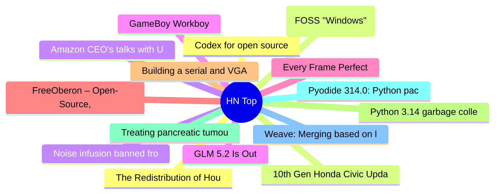

# HackerNews 每日 Top 30 (2026-06-14)

## 思维导图

## 列表（30 条）

### 1. The Redistribution of Housing Wealth Caused by Rent Control [pdf]
- **链接**: [https://www.rhawa.org/file/secure/shs-the-impact-of-rent-control-in-st-paul.pdf](https://www.rhawa.org/file/secure/shs-the-impact-of-rent-control-in-st-paul.pdf)
- **分数**: 46 | **评论**: 41 | **作者**: luu
- **HN 讨论**: https://news.ycombinator.com/item?id=48523773

### 2. 10th Gen Honda Civic Updates Are Signed with AOSP Test Keys
- **链接**: [https://juniperspring.org/posts/honda-evil-valet/](https://juniperspring.org/posts/honda-evil-valet/)
- **分数**: 107 | **评论**: 17 | **作者**: librick
- **HN 讨论**: https://news.ycombinator.com/item?id=48523080

### 3. Noise infusion banned from statistical products published by Census Bureau
- **链接**: [https://desfontain.es/blog/banning-noise.html](https://desfontain.es/blog/banning-noise.html)
- **分数**: 771 | **评论**: 482 | **作者**: nl
- **HN 讨论**: https://news.ycombinator.com/item?id=48517377

### 4. GLM 5.2 Is Out
- **链接**: [https://twitter.com/jietang/status/2065784751345287314](https://twitter.com/jietang/status/2065784751345287314)
- **分数**: 427 | **评论**: 236 | **作者**: aloknnikhil
- **HN 讨论**: https://news.ycombinator.com/item?id=48518684

### 5. Every Frame Perfect
- **链接**: [https://tonsky.me/blog/every-frame-perfect/](https://tonsky.me/blog/every-frame-perfect/)
- **分数**: 620 | **评论**: 203 | **作者**: ravenical
- **HN 讨论**: https://news.ycombinator.com/item?id=48516251

### 6. FreeOberon – Open-Source, Cross-Platform, Free Pascal/Turbo Pascal-Like Language
- **链接**: [https://github.com/kekcleader/FreeOberon](https://github.com/kekcleader/FreeOberon)
- **分数**: 48 | **评论**: 19 | **作者**: peter_d_sherman
- **HN 讨论**: https://news.ycombinator.com/item?id=48490927

### 7. Building a serial and VGA "everything console"
- **链接**: [http://oldvcr.blogspot.com/2026/06/building-serial-and-vga-everything.html](http://oldvcr.blogspot.com/2026/06/building-serial-and-vga-everything.html)
- **分数**: 8 | **评论**: 0 | **作者**: classichasclass
- **HN 讨论**: https://news.ycombinator.com/item?id=48523615

### 8. Python 3.14 garbage collection rigamarole
- **链接**: [https://theconsensus.dev/p/2026/06/06/python-3-14-garbage-collection-rigamarole.html](https://theconsensus.dev/p/2026/06/06/python-3-14-garbage-collection-rigamarole.html)
- **分数**: 19 | **评论**: 12 | **作者**: eatonphil
- **HN 讨论**: https://news.ycombinator.com/item?id=48503009

### 9. Treating pancreatic tumours may have revealed cancer's master switch
- **链接**: [https://economist.com/science-and-technology/2026/06/12/treating-pancreatic-tumours-may-have-revealed-cancers-master-switch](https://economist.com/science-and-technology/2026/06/12/treating-pancreatic-tumours-may-have-revealed-cancers-master-switch)
- **分数**: 324 | **评论**: 115 | **作者**: andsoitis
- **HN 讨论**: https://news.ycombinator.com/item?id=48517199

### 10. Pyodide 314.0: Python packages can now publish WebAssembly wheels to PyPI
- **链接**: [https://blog.pyodide.org/posts/314-release/](https://blog.pyodide.org/posts/314-release/)
- **分数**: 97 | **评论**: 23 | **作者**: agriyakhetarpal
- **HN 讨论**: https://news.ycombinator.com/item?id=48462759

### 11. Weave: Merging based on language structure and not lines
- **链接**: [https://ataraxy-labs.github.io/weave/](https://ataraxy-labs.github.io/weave/)
- **分数**: 7 | **评论**: 1 | **作者**: rohanat
- **HN 讨论**: https://news.ycombinator.com/item?id=48523705

### 12. Codex for open source
- **链接**: [https://openai.com/form/codex-for-oss/](https://openai.com/form/codex-for-oss/)
- **分数**: 194 | **评论**: 65 | **作者**: EvgeniyZh
- **HN 讨论**: https://news.ycombinator.com/item?id=48497195

### 13. ReactOS (FOSS "Windows") achieves 3D-accelerated Half-Life on real hardware
- **链接**: [https://www.phoronix.com/news/ReactOS-Running-Half-Life](https://www.phoronix.com/news/ReactOS-Running-Half-Life)
- **分数**: 138 | **评论**: 22 | **作者**: jeditobe
- **HN 讨论**: https://news.ycombinator.com/item?id=48522486

### 14. Amazon CEO's talks with U.S. officials triggered crackdown on Anthropic models
- **链接**: [https://www.wsj.com/tech/ai/amazon-ceos-talks-with-u-s-officials-triggered-crackdown-on-anthropic-models-dcc90578?st=Yct6gx&reflink=desktopwebshare_permalink](https://www.wsj.com/tech/ai/amazon-ceos-talks-with-u-s-officials-triggered-crackdown-on-anthropic-models-dcc90578?st=Yct6gx&reflink=desktopwebshare_permalink)
- **分数**: 605 | **评论**: 443 | **作者**: ls612
- **HN 讨论**: https://news.ycombinator.com/item?id=48519092

### 15. GameBoy Workboy
- **链接**: [https://tcrf.net/Workboy](https://tcrf.net/Workboy)
- **分数**: 171 | **评论**: 59 | **作者**: tosh
- **HN 讨论**: https://news.ycombinator.com/item?id=48519552

### 16. Apt Encounters of the Third Kind
- **链接**: [https://igor-blue.github.io/2021/03/24/apt1.html](https://igor-blue.github.io/2021/03/24/apt1.html)
- **分数**: 13 | **评论**: 2 | **作者**: ogurechny
- **HN 讨论**: https://news.ycombinator.com/item?id=48523550

### 17. Running DOS on Behringers DDX3216 with a DIY x86-Bios from Scratch
- **链接**: [https://chrisdevblog.com/2026/06/08/running-dos-on-behringers-ddx3216-using-a-diy-x86-bios/](https://chrisdevblog.com/2026/06/08/running-dos-on-behringers-ddx3216-using-a-diy-x86-bios/)
- **分数**: 84 | **评论**: 17 | **作者**: rasz
- **HN 讨论**: https://news.ycombinator.com/item?id=48520080

### 18. A whale necropolis has been found
- **链接**: [https://www.nature.com/articles/d41586-026-01581-x](https://www.nature.com/articles/d41586-026-01581-x)
- **分数**: 44 | **评论**: 17 | **作者**: tigerlily
- **HN 讨论**: https://news.ycombinator.com/item?id=48481546

### 19. Quadratic funding democratizes allocation by rewarding projects w/ broad support
- **链接**: [https://internetfreedom.torproject.org/funding-distribution/](https://internetfreedom.torproject.org/funding-distribution/)
- **分数**: 5 | **评论**: 0 | **作者**: Cider9986
- **HN 讨论**: https://news.ycombinator.com/item?id=48523612

### 20. Police officer investigated for using AI to 'create evidence' in multiple cases
- **链接**: [https://news.sky.com/story/derbyshire-police-officer-investigated-for-using-ai-to-create-evidence-in-multiple-cases-13553661](https://news.sky.com/story/derbyshire-police-officer-investigated-for-using-ai-to-create-evidence-in-multiple-cases-13553661)
- **分数**: 263 | **评论**: 126 | **作者**: austinallegro
- **HN 讨论**: https://news.ycombinator.com/item?id=48520807

### 21. A low-carbon computing platform from your retired phones
- **链接**: [https://research.google/blog/a-low-carbon-computing-platform-from-your-retired-phones/](https://research.google/blog/a-low-carbon-computing-platform-from-your-retired-phones/)
- **分数**: 258 | **评论**: 139 | **作者**: vikas-sharma
- **HN 讨论**: https://news.ycombinator.com/item?id=48515336

### 22. Appreciating Exif
- **链接**: [https://brentfitzgerald.com/posts/appreciating-exif/](https://brentfitzgerald.com/posts/appreciating-exif/)
- **分数**: 142 | **评论**: 29 | **作者**: burnto
- **HN 讨论**: https://news.ycombinator.com/item?id=48467437

### 23. 4 things to know about the new sunscreen ingredient the FDA approved
- **链接**: [https://www.npr.org/2026/06/13/nx-s1-5856385/sunscreen-skin-protection-bemotrizinol](https://www.npr.org/2026/06/13/nx-s1-5856385/sunscreen-skin-protection-bemotrizinol)
- **分数**: 63 | **评论**: 23 | **作者**: mikhael
- **HN 讨论**: https://news.ycombinator.com/item?id=48523203

### 24. Human Routers of Machine Words
- **链接**: [https://borretti.me/article/human-routers-of-machine-words](https://borretti.me/article/human-routers-of-machine-words)
- **分数**: 44 | **评论**: 22 | **作者**: zx321
- **HN 讨论**: https://news.ycombinator.com/item?id=48521709

### 25. Ancient genome duplications laid the foundations of complex brains
- **链接**: [https://www.ox.ac.uk/news/2026-06-09-ancient-genome-duplications-laid-the-foundations-of-complex-brains](https://www.ox.ac.uk/news/2026-06-09-ancient-genome-duplications-laid-the-foundations-of-complex-brains)
- **分数**: 24 | **评论**: 1 | **作者**: hhs
- **HN 讨论**: https://news.ycombinator.com/item?id=48522310

### 26. RTX 5080 and RTX 3090 Setup: 80 Tok/s on Qwen 3.6 27B Q8
- **链接**: [https://imil.net/blog/posts/2026/rtx-5080-+-rtx-3090-setup-80+-tok-s-on-qwen-3.6-27b-q8/](https://imil.net/blog/posts/2026/rtx-5080-+-rtx-3090-setup-80+-tok-s-on-qwen-3.6-27b-q8/)
- **分数**: 213 | **评论**: 72 | **作者**: iMil
- **HN 讨论**: https://news.ycombinator.com/item?id=48515454

### 27. The adder at the heart of Intel's 8087 floating-point chip
- **链接**: [https://www.righto.com/2026/06/intel-8087-adder-reverse-engineered.html](https://www.righto.com/2026/06/intel-8087-adder-reverse-engineered.html)
- **分数**: 101 | **评论**: 25 | **作者**: pwg
- **HN 讨论**: https://news.ycombinator.com/item?id=48519011

### 28. The Field Guide to CSS Grid Lanes
- **链接**: [https://gridlanes.webkit.org/](https://gridlanes.webkit.org/)
- **分数**: 10 | **评论**: 2 | **作者**: ingve
- **HN 讨论**: https://news.ycombinator.com/item?id=48473509

### 29. The experience of rendering Arabic typography and its technical debt
- **链接**: [https://lr0.org/blog/p/arabic/](https://lr0.org/blog/p/arabic/)
- **分数**: 206 | **评论**: 51 | **作者**: bookofjoe
- **HN 讨论**: https://news.ycombinator.com/item?id=48516710

### 30. AI coding at home without going broke
- **链接**: [https://stephen.bochinski.dev/blog/2026/06/13/ai-coding-at-home-without-going-broke/](https://stephen.bochinski.dev/blog/2026/06/13/ai-coding-at-home-without-going-broke/)
- **分数**: 260 | **评论**: 223 | **作者**: sbochins
- **HN 讨论**: https://news.ycombinator.com/item?id=48518969
