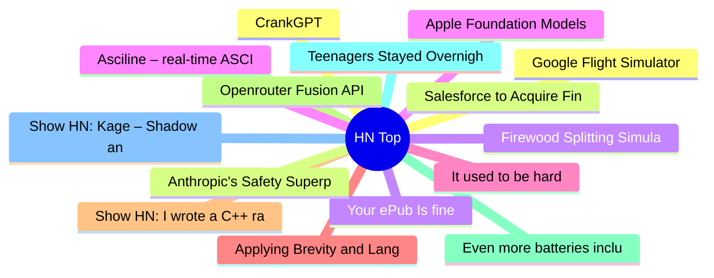

# HackerNews 每日 Top 30 (2026-06-15)

## 思维导图

## 列表（30 条）

### 1. CrankGPT
- **链接**: [https://crankgpt.com](https://crankgpt.com)
- **分数**: 105 | **评论**: 41 | **作者**: rishikeshs
- **HN 讨论**: https://news.ycombinator.com/item?id=48540854

### 2. Salesforce to Acquire Fin (formerly Intercom) for $3.6BN
- **链接**: [https://www.salesforce.com/news/press-releases/2026/06/15/salesforce-signs-definitive-agreement-to-acquire-fin/?bc=HL](https://www.salesforce.com/news/press-releases/2026/06/15/salesforce-signs-definitive-agreement-to-acquire-fin/?bc=HL)
- **分数**: 161 | **评论**: 113 | **作者**: colesantiago
- **HN 讨论**: https://news.ycombinator.com/item?id=48540126

### 3. Your ePub Is fine
- **链接**: [https://andreklein.net/your-epub-is-fine-kobo-disagrees-blame-adobe/](https://andreklein.net/your-epub-is-fine-kobo-disagrees-blame-adobe/)
- **分数**: 775 | **评论**: 255 | **作者**: sohkamyung
- **HN 讨论**: https://news.ycombinator.com/item?id=48533848

### 4. Apple Foundation Models
- **链接**: [https://platform.claude.com/docs/en/cli-sdks-libraries/libraries/apple-foundation-models](https://platform.claude.com/docs/en/cli-sdks-libraries/libraries/apple-foundation-models)
- **分数**: 312 | **评论**: 137 | **作者**: MehrdadKhnzd
- **HN 讨论**: https://news.ycombinator.com/item?id=48536776

### 5. It used to be hard
- **链接**: [https://www.praf.me/it-used-to-be-hard](https://www.praf.me/it-used-to-be-hard)
- **分数**: 40 | **评论**: 35 | **作者**: _praf
- **HN 讨论**: https://news.ycombinator.com/item?id=48463519

### 6. Applying Brevity and Language Efficiency in Prompt Engineering
- **链接**: [https://prahladyeri.github.io/guides/applying-brevity-and-language-efficiency-to-prompt-engineering.html](https://prahladyeri.github.io/guides/applying-brevity-and-language-efficiency-to-prompt-engineering.html)
- **分数**: 24 | **评论**: 12 | **作者**: pyeri
- **HN 讨论**: https://news.ycombinator.com/item?id=48540813

### 7. Show HN: I wrote a C++ ray tracer from scratch without AI
- **链接**: [https://github.com/themartiano/luz](https://github.com/themartiano/luz)
- **分数**: 86 | **评论**: 30 | **作者**: martiano
- **HN 讨论**: https://news.ycombinator.com/item?id=48538833

### 8. Openrouter Fusion API
- **链接**: [https://openrouter.ai/openrouter/fusion](https://openrouter.ai/openrouter/fusion)
- **分数**: 123 | **评论**: 48 | **作者**: tdchaitanya
- **HN 讨论**: https://news.ycombinator.com/item?id=48537641

### 9. Even more batteries included with Emacs
- **链接**: [https://karthinks.com/software/even-more-batteries-included-with-emacs/](https://karthinks.com/software/even-more-batteries-included-with-emacs/)
- **分数**: 282 | **评论**: 82 | **作者**: signa11
- **HN 讨论**: https://news.ycombinator.com/item?id=48535886

### 10. Teenagers Stayed Overnight at Their School and Found Hidden Ancient Roman Ruins
- **链接**: [https://www.smithsonianmag.com/smart-news/these-italian-teenagers-stayed-overnight-at-their-school-they-found-ancient-roman-ruins-hidden-in-the-basement-180988917/](https://www.smithsonianmag.com/smart-news/these-italian-teenagers-stayed-overnight-at-their-school-they-found-ancient-roman-ruins-hidden-in-the-basement-180988917/)
- **分数**: 61 | **评论**: 14 | **作者**: thunderbong
- **HN 讨论**: https://news.ycombinator.com/item?id=48485527

### 11. Show HN: Kage – Shadow any website to a single binary for offline viewing
- **链接**: [https://github.com/tamnd/kage](https://github.com/tamnd/kage)
- **分数**: 624 | **评论**: 121 | **作者**: tamnd
- **HN 讨论**: https://news.ycombinator.com/item?id=48529990

### 12. Google Flight Simulator
- **链接**: [https://developers.google.com/maps/documentation/earth/flight-simulator](https://developers.google.com/maps/documentation/earth/flight-simulator)
- **分数**: 37 | **评论**: 10 | **作者**: bookofjoe
- **HN 讨论**: https://news.ycombinator.com/item?id=48540945

### 13. Anthropic's Safety Superpower
- **链接**: [https://stratechery.com/2026/anthropics-safety-superpower/](https://stratechery.com/2026/anthropics-safety-superpower/)
- **分数**: 152 | **评论**: 122 | **作者**: swolpers
- **HN 讨论**: https://news.ycombinator.com/item?id=48539078

### 14. Firewood Splitting Simulator
- **链接**: [https://screen.toys/firewood/](https://screen.toys/firewood/)
- **分数**: 908 | **评论**: 263 | **作者**: memalign
- **HN 讨论**: https://news.ycombinator.com/item?id=48471638

### 15. Asciline – real-time ASCII video rendering engine
- **链接**: [https://github.com/YusufB5/ASCILINE](https://github.com/YusufB5/ASCILINE)
- **分数**: 32 | **评论**: 12 | **作者**: godot
- **HN 讨论**: https://news.ycombinator.com/item?id=48499993

### 16. Ported my C game to WASM, here's everybug that I hit
- **链接**: [http://ernesernesto.github.io/writes/portingmatchmorphosistowasm/](http://ernesernesto.github.io/writes/portingmatchmorphosistowasm/)
- **分数**: 61 | **评论**: 46 | **作者**: birdculture
- **HN 讨论**: https://news.ycombinator.com/item?id=48506980

### 17. Curl will not accept vulnerability reports during July 2026
- **链接**: [https://daniel.haxx.se/blog/2026/06/15/curl-summer-of-bliss/](https://daniel.haxx.se/blog/2026/06/15/curl-summer-of-bliss/)
- **分数**: 610 | **评论**: 237 | **作者**: secret-noun
- **HN 讨论**: https://news.ycombinator.com/item?id=48537165

### 18. There Is(Ǝ) – Such That (∋)
- **链接**: [https://www.fractalkitty.com/there-is-3-such-that/](https://www.fractalkitty.com/there-is-3-such-that/)
- **分数**: 74 | **评论**: 22 | **作者**: evakhoury
- **HN 讨论**: https://news.ycombinator.com/item?id=48490649

### 19. Successful Psilocybin Treatment of Alzheimer
- **链接**: [https://www.frontiersin.org/journals/neuroscience/articles/10.3389/fnins.2026.1813281/full](https://www.frontiersin.org/journals/neuroscience/articles/10.3389/fnins.2026.1813281/full)
- **分数**: 72 | **评论**: 49 | **作者**: cl3misch
- **HN 讨论**: https://news.ycombinator.com/item?id=48537512

### 20. Show HN: Can Europe train a frontier AI model on the compute it owns?
- **链接**: [https://github.com/sammysltd/euromesh](https://github.com/sammysltd/euromesh)
- **分数**: 3 | **评论**: 0 | **作者**: smashini
- **HN 讨论**: https://news.ycombinator.com/item?id=48541014

### 21. Bitsy
- **链接**: [https://bitsy.org/](https://bitsy.org/)
- **分数**: 246 | **评论**: 6 | **作者**: tosh
- **HN 讨论**: https://news.ycombinator.com/item?id=48496290

### 22. Dalus (YC W25) Is Hiring a Senior Software Engineer in Germany
- **链接**: [https://www.ycombinator.com/companies/dalus/jobs/5IDmKJt-senior-software-frontend-engineer-germany-office](https://www.ycombinator.com/companies/dalus/jobs/5IDmKJt-senior-software-frontend-engineer-germany-office)
- **分数**: 1 | **评论**: 0 | **作者**: sebastianvoelkl
- **HN 讨论**: https://news.ycombinator.com/item?id=48537556

### 23. 21 years and counting of 'eight fallacies of distributed computing' (2025)
- **链接**: [https://blog.apnic.net/2025/12/08/21-years-and-counting-of-eight-fallacies-of-distributed-computing/](https://blog.apnic.net/2025/12/08/21-years-and-counting-of-eight-fallacies-of-distributed-computing/)
- **分数**: 119 | **评论**: 34 | **作者**: teleforce
- **HN 讨论**: https://news.ycombinator.com/item?id=48534628

### 24. Exploring building a tiny FUSE filesystem
- **链接**: [https://www.shayon.dev/post/2026/161/building-a-tiny-fuse-filesystem/](https://www.shayon.dev/post/2026/161/building-a-tiny-fuse-filesystem/)
- **分数**: 50 | **评论**: 8 | **作者**: shayonj
- **HN 讨论**: https://news.ycombinator.com/item?id=48506286

### 25. Rio de Janeiro's "homegrown" LLM appears to be a merge of an existing model
- **链接**: [https://github.com/nex-agi/Nex-N2/issues/4](https://github.com/nex-agi/Nex-N2/issues/4)
- **分数**: 377 | **评论**: 199 | **作者**: unrvl22
- **HN 讨论**: https://news.ycombinator.com/item?id=48528371

### 26. Why does paper fold so well?
- **链接**: [https://www.bbc.co.uk/programmes/w3ct8k70](https://www.bbc.co.uk/programmes/w3ct8k70)
- **分数**: 83 | **评论**: 36 | **作者**: zeristor
- **HN 讨论**: https://news.ycombinator.com/item?id=48520596

### 27. A short history of Cerro Torre, the most controversial mountain (2012)
- **链接**: [https://www.markhorrell.com/blog/2012/a-short-history-of-cerro-torre/](https://www.markhorrell.com/blog/2012/a-short-history-of-cerro-torre/)
- **分数**: 62 | **评论**: 38 | **作者**: joebig
- **HN 讨论**: https://news.ycombinator.com/item?id=48484711

### 28. Ask HN: What are you working on? (June 2026)
- **链接**: [https://news.ycombinator.com/item?id=48528779](https://news.ycombinator.com/item?id=48528779)
- **分数**: 278 | **评论**: 992 | **作者**: david927
- **HN 讨论**: https://news.ycombinator.com/item?id=48528779

### 29. Formal methods and the future of programming
- **链接**: [https://blog.janestreet.com/formal-methods-at-jane-street-index/?from_theconsensus=1](https://blog.janestreet.com/formal-methods-at-jane-street-index/?from_theconsensus=1)
- **分数**: 320 | **评论**: 99 | **作者**: eatonphil
- **HN 讨论**: https://news.ycombinator.com/item?id=48526633

### 30. Being an old school web-based sports sim dev in the era of vibe coded games
- **链接**: [https://zengm.com/blog/2026/06/vibecoded-games/](https://zengm.com/blog/2026/06/vibecoded-games/)
- **分数**: 50 | **评论**: 43 | **作者**: YesBox
- **HN 讨论**: https://news.ycombinator.com/item?id=48508021
