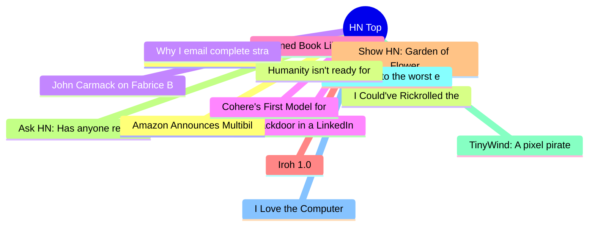

# HackerNews 每日 Top 30 (2026-06-16)

## 思维导图

## 列表（30 条）

### 1. The time the x86 emulator team found code so bad they fixed it during emulation
- **链接**: [https://devblogs.microsoft.com/oldnewthing/20260615-00/?p=112419](https://devblogs.microsoft.com/oldnewthing/20260615-00/?p=112419)
- **分数**: 128 | **评论**: 22 | **作者**: paulmooreparks
- **HN 讨论**: https://news.ycombinator.com/item?id=48550693

### 2. I Could've Rickrolled the FIFA World Cup. All I Needed Was My ID
- **链接**: [https://bobdahacker.com/blog/fifa-hack](https://bobdahacker.com/blog/fifa-hack)
- **分数**: 109 | **评论**: 19 | **作者**: BobDaHacker
- **HN 讨论**: https://news.ycombinator.com/item?id=48550936

### 3. John Carmack on Fabrice Bellard
- **链接**: [https://twitter.com/ID_AA_Carmack/status/2064095424420487226](https://twitter.com/ID_AA_Carmack/status/2064095424420487226)
- **分数**: 47 | **评论**: 14 | **作者**: apitman
- **HN 讨论**: https://news.ycombinator.com/item?id=48550779

### 4. A backdoor in a LinkedIn job offer
- **链接**: [https://roman.pt/posts/linkedin-backdoor/](https://roman.pt/posts/linkedin-backdoor/)
- **分数**: 983 | **评论**: 190 | **作者**: lwhsiao
- **HN 讨论**: https://news.ycombinator.com/item?id=48546294

### 5. Banned Book Library in a Wi-Fi Smart Light Bulb
- **链接**: [https://www.richardosgood.com/posts/banned-book-library/](https://www.richardosgood.com/posts/banned-book-library/)
- **分数**: 306 | **评论**: 149 | **作者**: sohkamyung
- **HN 讨论**: https://news.ycombinator.com/item?id=48547985

### 6. Iroh 1.0
- **链接**: [https://www.iroh.computer/blog/v1](https://www.iroh.computer/blog/v1)
- **分数**: 1091 | **评论**: 324 | **作者**: chadfowler
- **HN 讨论**: https://news.ycombinator.com/item?id=48542480

### 7. Show HN: Garden of Flowers – an archive of pictorial typography before ASCII art
- **链接**: [https://garden-of-flowers.heikkilotvonen.com/](https://garden-of-flowers.heikkilotvonen.com/)
- **分数**: 31 | **评论**: 6 | **作者**: california-og
- **HN 讨论**: https://news.ycombinator.com/item?id=48550569

### 8. Ask HN: Has anyone replaced Claude/GPT with a local model for daily coding?
- **链接**: [https://news.ycombinator.com/item?id=48542100](https://news.ycombinator.com/item?id=48542100)
- **分数**: 874 | **评论**: 402 | **作者**: cloudking
- **HN 讨论**: https://news.ycombinator.com/item?id=48542100

### 9. TinyWind: A pixel pirate sailing game with real wind physics (380k+ kms sailed)
- **链接**: [https://tinywind.io](https://tinywind.io)
- **分数**: 741 | **评论**: 147 | **作者**: tinywind
- **HN 讨论**: https://news.ycombinator.com/item?id=48543475

### 10. I hacked into the worst e-bike and fixed it [video]
- **链接**: [https://www.youtube.com/watch?v=hPrtVGimBYs](https://www.youtube.com/watch?v=hPrtVGimBYs)
- **分数**: 52 | **评论**: 18 | **作者**: alexis-d
- **HN 讨论**: https://news.ycombinator.com/item?id=48479957

### 11. I Love the Computer
- **链接**: [https://michaelenger.com/blog/i-love-the-computer/](https://michaelenger.com/blog/i-love-the-computer/)
- **分数**: 202 | **评论**: 122 | **作者**: speckx
- **HN 讨论**: https://news.ycombinator.com/item?id=48546441

### 12. Amazon Announces Multibillion-Dollar Data Center in Missouri
- **链接**: [https://www.narracomm.com/amazon-announces-multibillion-dollar-data-center-in-missouri/](https://www.narracomm.com/amazon-announces-multibillion-dollar-data-center-in-missouri/)
- **分数**: 95 | **评论**: 80 | **作者**: thelonelyborg
- **HN 讨论**: https://news.ycombinator.com/item?id=48548975

### 13. Humanity isn't ready for the coming intelligence explosion
- **链接**: [https://www.economist.com/by-invitation/2026/06/15/humanity-isnt-ready-for-the-coming-intelligence-explosion](https://www.economist.com/by-invitation/2026/06/15/humanity-isnt-ready-for-the-coming-intelligence-explosion)
- **分数**: 43 | **评论**: 97 | **作者**: andsoitis
- **HN 讨论**: https://news.ycombinator.com/item?id=48549628

### 14. Why I email complete strangers
- **链接**: [https://www.goodinternetmagazine.com/why-i-email-complete-strangers/](https://www.goodinternetmagazine.com/why-i-email-complete-strangers/)
- **分数**: 131 | **评论**: 56 | **作者**: karakoram
- **HN 讨论**: https://news.ycombinator.com/item?id=48547566

### 15. Cohere's First Model for Developers
- **链接**: [https://cohere.com/blog/north-mini-code](https://cohere.com/blog/north-mini-code)
- **分数**: 65 | **评论**: 15 | **作者**: hmokiguess
- **HN 讨论**: https://news.ycombinator.com/item?id=48489934

### 16. The 90-year-old idea behind JEPA models: Canonical Correlation Analysis
- **链接**: [https://shonczinner.github.io/posts/embedding-prediction/](https://shonczinner.github.io/posts/embedding-prediction/)
- **分数**: 42 | **评论**: 7 | **作者**: Anon84
- **HN 讨论**: https://news.ycombinator.com/item?id=48490578

### 17. My Homelab AI Dev Platform
- **链接**: [https://rsgm.dev/post/ai-dev-platform/](https://rsgm.dev/post/ai-dev-platform/)
- **分数**: 291 | **评论**: 52 | **作者**: rsgm
- **HN 讨论**: https://news.ycombinator.com/item?id=48542433

### 18. Peopleless economy? Not technically impossible
- **链接**: [https://gmalandrakis.com/writings/ad-economicum.html](https://gmalandrakis.com/writings/ad-economicum.html)
- **分数**: 156 | **评论**: 273 | **作者**: l0new0lf-G
- **HN 讨论**: https://news.ycombinator.com/item?id=48547062

### 19. Hetzner Price Adjustment
- **链接**: [https://docs.hetzner.com/general/infrastructure-and-availability/price-adjustment/#cloud-servers](https://docs.hetzner.com/general/infrastructure-and-availability/price-adjustment/#cloud-servers)
- **分数**: 397 | **评论**: 552 | **作者**: tuhtah
- **HN 讨论**: https://news.ycombinator.com/item?id=48540844

### 20. Chili peppers of the world: cultivars, species, and heat
- **链接**: [https://www.notesfromtheroad.com/desertmexico/chili-peppers.html](https://www.notesfromtheroad.com/desertmexico/chili-peppers.html)
- **分数**: 14 | **评论**: 1 | **作者**: fanf2
- **HN 讨论**: https://news.ycombinator.com/item?id=48507128

### 21. Fox to buy Roku
- **链接**: [https://www.wsj.com/business/deals/fox-roku-deal-f6e564f9](https://www.wsj.com/business/deals/fox-roku-deal-f6e564f9)
- **分数**: 311 | **评论**: 387 | **作者**: thm
- **HN 讨论**: https://news.ycombinator.com/item?id=48540499

### 22. Reviews have become expensive, rewrites have become cheap
- **链接**: [http://ishmeetbindra.com/posts/reviews-have-become-expensive-rewrites-have-become-cheap/](http://ishmeetbindra.com/posts/reviews-have-become-expensive-rewrites-have-become-cheap/)
- **分数**: 52 | **评论**: 41 | **作者**: arzh2
- **HN 讨论**: https://news.ycombinator.com/item?id=48548883

### 23. What job interviews taught me about Kubernetes
- **链接**: [https://notnotp.com/notes/what-job-interviews-taught-me-about-kubernetes/](https://notnotp.com/notes/what-job-interviews-taught-me-about-kubernetes/)
- **分数**: 147 | **评论**: 108 | **作者**: chmaynard
- **HN 讨论**: https://news.ycombinator.com/item?id=48546428

### 24. What every coder should know about gamma (2016)
- **链接**: [https://blog.johnnovak.net/2016/09/21/what-every-coder-should-know-about-gamma/](https://blog.johnnovak.net/2016/09/21/what-every-coder-should-know-about-gamma/)
- **分数**: 89 | **评论**: 27 | **作者**: sph
- **HN 讨论**: https://news.ycombinator.com/item?id=48521925

### 25. Copper transport drug restores memory and clears toxic Alzheimer's proteins
- **链接**: [https://www.monash.edu/news/articles/copper-drug-restores-memory-and-clears-toxic-alzheimers-proteins](https://www.monash.edu/news/articles/copper-drug-restores-memory-and-clears-toxic-alzheimers-proteins)
- **分数**: 285 | **评论**: 107 | **作者**: bookofjoe
- **HN 讨论**: https://news.ycombinator.com/item?id=48542132

### 26. Salesforce to Acquire Fin (formerly Intercom) for $3.6B
- **链接**: [https://www.salesforce.com/news/press-releases/2026/06/15/salesforce-signs-definitive-agreement-to-acquire-fin/?bc=HL](https://www.salesforce.com/news/press-releases/2026/06/15/salesforce-signs-definitive-agreement-to-acquire-fin/?bc=HL)
- **分数**: 300 | **评论**: 219 | **作者**: colesantiago
- **HN 讨论**: https://news.ycombinator.com/item?id=48540126

### 27. Game Engine White Papers: Commander Keen
- **链接**: [https://forgottenbytes.net/commander_keen.html](https://forgottenbytes.net/commander_keen.html)
- **分数**: 191 | **评论**: 61 | **作者**: mfiguiere
- **HN 讨论**: https://news.ycombinator.com/item?id=48544781

### 28. Launch HN: Drafted (YC P26) – Models for residential architecture
- **链接**: [https://news.ycombinator.com/item?id=48543908](https://news.ycombinator.com/item?id=48543908)
- **分数**: 52 | **评论**: 55 | **作者**: PrimalNick
- **HN 讨论**: https://news.ycombinator.com/item?id=48543908

### 29. Show HN: Veterinarian turned founder, AI lawn diagnosis
- **链接**: [https://grassdx.com/](https://grassdx.com/)
- **分数**: 58 | **评论**: 51 | **作者**: andrewbr
- **HN 讨论**: https://news.ycombinator.com/item?id=48544823

### 30. How TimescaleDB compresses time-series data
- **链接**: [https://roszigit.com/en/blog/timescaledb-compression-hypercore](https://roszigit.com/en/blog/timescaledb-compression-hypercore)
- **分数**: 141 | **评论**: 16 | **作者**: lkanwoqwp
- **HN 讨论**: https://news.ycombinator.com/item?id=48544451
