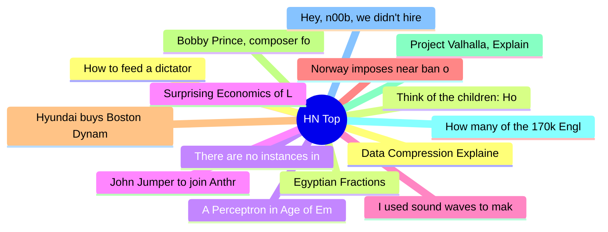

# HackerNews 每日 Top 30 (2026-06-20)

## 思维导图

## 列表（30 条）

### 1. Data Compression Explained
- **链接**: [https://mattmahoney.net/dc/dce.html](https://mattmahoney.net/dc/dce.html)
- **分数**: 32 | **评论**: 0 | **作者**: mtdewcmu
- **HN 讨论**: https://news.ycombinator.com/item?id=48562662

### 2. Think of the children: How to force real ID for all internet traffic (2023)
- **链接**: [https://nochan.net/b/Internet-Crap/20230829-Think-Of-The-Children/](https://nochan.net/b/Internet-Crap/20230829-Think-Of-The-Children/)
- **分数**: 168 | **评论**: 98 | **作者**: Bender
- **HN 讨论**: https://news.ycombinator.com/item?id=48602817

### 3. There are no instances in ATProto
- **链接**: [https://overreacted.io/there-are-no-instances-in-atproto/](https://overreacted.io/there-are-no-instances-in-atproto/)
- **分数**: 371 | **评论**: 206 | **作者**: danabramov
- **HN 讨论**: https://news.ycombinator.com/item?id=48599515

### 4. Surprising Economics of Load-Balanced Systems
- **链接**: [https://brooker.co.za/blog/2020/08/06/erlang.html](https://brooker.co.za/blog/2020/08/06/erlang.html)
- **分数**: 64 | **评论**: 18 | **作者**: KraftyOne
- **HN 讨论**: https://news.ycombinator.com/item?id=48602918

### 5. I used sound waves to make espresso
- **链接**: [https://theconversation.com/i-used-sound-waves-to-make-espresso-it-could-cut-coffee-brewing-energy-use-by-75-284929](https://theconversation.com/i-used-sound-waves-to-make-espresso-it-could-cut-coffee-brewing-energy-use-by-75-284929)
- **分数**: 227 | **评论**: 146 | **作者**: zeristor
- **HN 讨论**: https://news.ycombinator.com/item?id=48514843

### 6. Norway imposes near ban on AI in elementary school
- **链接**: [https://www.reuters.com/technology/norway-imposes-near-ban-ai-elementary-school-2026-06-19/](https://www.reuters.com/technology/norway-imposes-near-ban-ai-elementary-school-2026-06-19/)
- **分数**: 520 | **评论**: 351 | **作者**: ilreb
- **HN 讨论**: https://news.ycombinator.com/item?id=48600093

### 7. Hyundai buys Boston Dynamics
- **链接**: [https://startupfortune.com/hyundai-takes-full-control-of-boston-dynamics-as-softbank-exits-for-325-million/](https://startupfortune.com/hyundai-takes-full-control-of-boston-dynamics-as-softbank-exits-for-325-million/)
- **分数**: 717 | **评论**: 326 | **作者**: ck2
- **HN 讨论**: https://news.ycombinator.com/item?id=48600312

### 8. Bobby Prince, composer for Doom, Wolfenstein 3D, and Duke Nukem 3D, has died
- **链接**: [https://www.legacy.com/legacy/robert-bobby-prince-lll](https://www.legacy.com/legacy/robert-bobby-prince-lll)
- **分数**: 264 | **评论**: 30 | **作者**: pgrote
- **HN 讨论**: https://news.ycombinator.com/item?id=48602352

### 9. Project Valhalla, Explained: How a Decade of Work Arrives in JDK 28
- **链接**: [https://www.jvm-weekly.com/p/project-valhalla-explained-how-a](https://www.jvm-weekly.com/p/project-valhalla-explained-how-a)
- **分数**: 553 | **评论**: 344 | **作者**: philonoist
- **HN 讨论**: https://news.ycombinator.com/item?id=48595511

### 10. How many of the 170k English words do you know?
- **链接**: [https://vocabowl-870366514258.us-west1.run.app/](https://vocabowl-870366514258.us-west1.run.app/)
- **分数**: 267 | **评论**: 386 | **作者**: abnry
- **HN 讨论**: https://news.ycombinator.com/item?id=48598586

### 11. Hey, n00b, we didn't hire you to complete tasks
- **链接**: [https://newsletter.kentbeck.com/p/hey-n00b-we-didnt-hire-you-to-complete](https://newsletter.kentbeck.com/p/hey-n00b-we-didnt-hire-you-to-complete)
- **分数**: 122 | **评论**: 54 | **作者**: rrvsh
- **HN 讨论**: https://news.ycombinator.com/item?id=48604851

### 12. How to feed a dictator
- **链接**: [https://www.theguardian.com/film/2026/jun/09/how-to-feed-a-dictator-film](https://www.theguardian.com/film/2026/jun/09/how-to-feed-a-dictator-film)
- **分数**: 106 | **评论**: 36 | **作者**: Michelangelo11
- **HN 讨论**: https://news.ycombinator.com/item?id=48605301

### 13. Egyptian Fractions
- **链接**: [https://blog.plover.com/math/egyptian-fractions.html](https://blog.plover.com/math/egyptian-fractions.html)
- **分数**: 74 | **评论**: 3 | **作者**: luu
- **HN 讨论**: https://news.ycombinator.com/item?id=48548612

### 14. A Perceptron in Age of Empires II
- **链接**: [https://adewynter.github.io/notes/aoe2-circuits](https://adewynter.github.io/notes/aoe2-circuits)
- **分数**: 36 | **评论**: 13 | **作者**: EvgeniyZh
- **HN 讨论**: https://news.ycombinator.com/item?id=48582180

### 15. John Jumper to join Anthropic
- **链接**: [https://twitter.com/JohnJumperSci/status/2068001285173834106](https://twitter.com/JohnJumperSci/status/2068001285173834106)
- **分数**: 88 | **评论**: 60 | **作者**: artninja1988
- **HN 讨论**: https://news.ycombinator.com/item?id=48601162

### 16. Big Banana Car
- **链接**: [https://bigbananacar.com/](https://bigbananacar.com/)
- **分数**: 128 | **评论**: 73 | **作者**: Bender
- **HN 讨论**: https://news.ycombinator.com/item?id=48601420

### 17. Telescope Ranchers
- **链接**: [https://kottke.org/26/06/telescope-ranchers](https://kottke.org/26/06/telescope-ranchers)
- **分数**: 109 | **评论**: 43 | **作者**: bookofjoe
- **HN 讨论**: https://news.ycombinator.com/item?id=48553161

### 18. Court Records Should Be Free
- **链接**: [https://www.eff.org/deeplinks/2026/06/court-records-should-be-free](https://www.eff.org/deeplinks/2026/06/court-records-should-be-free)
- **分数**: 292 | **评论**: 63 | **作者**: hn_acker
- **HN 讨论**: https://news.ycombinator.com/item?id=48600946

### 19. Ask HN: Will programmers write more efficient code during the memory shortage?
- **链接**: [https://news.ycombinator.com/item?id=48604232](https://news.ycombinator.com/item?id=48604232)
- **分数**: 50 | **评论**: 85 | **作者**: amichail
- **HN 讨论**: https://news.ycombinator.com/item?id=48604232

### 20. A 1976 university experiment spun up the U.S. wind industry
- **链接**: [https://spectrum.ieee.org/william-heronemus-wind-energy](https://spectrum.ieee.org/william-heronemus-wind-energy)
- **分数**: 79 | **评论**: 8 | **作者**: pseudolus
- **HN 讨论**: https://news.ycombinator.com/item?id=48541777

### 21. RhinoCollab a plugin for real-time editing for Rhino 3D
- **链接**: [https://rhinocollab.com](https://rhinocollab.com)
- **分数**: 23 | **评论**: 5 | **作者**: Ashxius
- **HN 讨论**: https://news.ycombinator.com/item?id=48532447

### 22. Zen and the Art of Machine Learning Research
- **链接**: [https://blog.jxmo.io/p/zen-and-the-art-of-machine-learning](https://blog.jxmo.io/p/zen-and-the-art-of-machine-learning)
- **分数**: 243 | **评论**: 86 | **作者**: jxmorris12
- **HN 讨论**: https://news.ycombinator.com/item?id=48549118

### 23. Building a robotics research setup that lives next to my desk
- **链接**: [https://dfdxlabs.com/research/2026/robotics-setup/](https://dfdxlabs.com/research/2026/robotics-setup/)
- **分数**: 126 | **评论**: 43 | **作者**: mplappert
- **HN 讨论**: https://news.ycombinator.com/item?id=48586329

### 24. Show HN: Metiq: a real time 3D globe for 100 public datasets
- **链接**: [https://metiq.space](https://metiq.space)
- **分数**: 97 | **评论**: 30 | **作者**: rakeda
- **HN 讨论**: https://news.ycombinator.com/item?id=48556082

### 25. Zenzizenzizenzic
- **链接**: [https://en.wikipedia.org/wiki/Zenzizenzizenzic](https://en.wikipedia.org/wiki/Zenzizenzizenzic)
- **分数**: 84 | **评论**: 23 | **作者**: gyosifov
- **HN 讨论**: https://news.ycombinator.com/item?id=48603664

### 26. Meet Nikolai Evreinov, the 19th century Nathan Fielder
- **链接**: [https://mssv.net/2026/06/16/meet-nikolai-evreinov-the-19th-century-nathan-fielder/](https://mssv.net/2026/06/16/meet-nikolai-evreinov-the-19th-century-nathan-fielder/)
- **分数**: 5 | **评论**: 0 | **作者**: adrianhon
- **HN 讨论**: https://news.ycombinator.com/item?id=48556335

### 27. To study how chips work, MIT researchers built their own operating system
- **链接**: [https://news.mit.edu/2026/to-study-how-chips-really-work-mit-researchers-built-their-own-operating-system-0610](https://news.mit.edu/2026/to-study-how-chips-really-work-mit-researchers-built-their-own-operating-system-0610)
- **分数**: 360 | **评论**: 54 | **作者**: speckx
- **HN 讨论**: https://news.ycombinator.com/item?id=48543311

### 28. Digital Printing of Arabic: explaining the problem
- **链接**: [https://digitalorientalist.com/2017/08/21/digital-printing-of-arabic-explaining-the-problem/](https://digitalorientalist.com/2017/08/21/digital-printing-of-arabic-explaining-the-problem/)
- **分数**: 33 | **评论**: 7 | **作者**: a_t48
- **HN 讨论**: https://news.ycombinator.com/item?id=48563047

### 29. Ten years of ClickHouse in open source
- **链接**: [https://clickhouse.com/blog/open-source-10](https://clickhouse.com/blog/open-source-10)
- **分数**: 287 | **评论**: 72 | **作者**: saisrirampur
- **HN 讨论**: https://news.ycombinator.com/item?id=48546890

### 30. The AirPods Effect
- **链接**: [https://www.theescapenewsletter.com/p/the-airpods-effect](https://www.theescapenewsletter.com/p/the-airpods-effect)
- **分数**: 388 | **评论**: 694 | **作者**: herbertl
- **HN 讨论**: https://news.ycombinator.com/item?id=48592832
