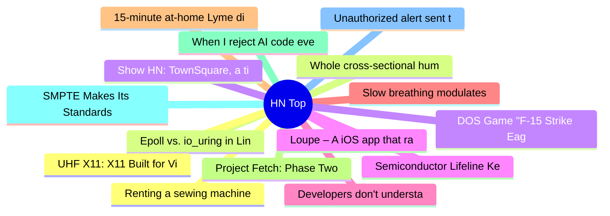

# HackerNews 每日 Top 30 (2026-06-21)

## 思维导图

## 列表（30 条）

### 1. Renting a sewing machine from the library
- **链接**: [https://www.bbc.com/future/article/20260618-the-weird-and-wonderful-libraries-of-finland](https://www.bbc.com/future/article/20260618-the-weird-and-wonderful-libraries-of-finland)
- **分数**: 151 | **评论**: 71 | **作者**: sohkamyung
- **HN 讨论**: https://news.ycombinator.com/item?id=48613755

### 2. Epoll vs. io_uring in Linux
- **链接**: [https://sibexi.co/posts/epoll-vs-io_uring/](https://sibexi.co/posts/epoll-vs-io_uring/)
- **分数**: 85 | **评论**: 23 | **作者**: Sibexico
- **HN 讨论**: https://news.ycombinator.com/item?id=48613872

### 3. Show HN: TownSquare, a tiny presence layer for websites
- **链接**: [https://townsquare.cauenapier.com/](https://townsquare.cauenapier.com/)
- **分数**: 108 | **评论**: 46 | **作者**: cauenapier
- **HN 讨论**: https://news.ycombinator.com/item?id=48608570

### 4. Loupe – A iOS app that raises awareness about what native apps can see
- **链接**: [https://github.com/mysk-research/loupe](https://github.com/mysk-research/loupe)
- **分数**: 126 | **评论**: 33 | **作者**: Cider9986
- **HN 讨论**: https://news.ycombinator.com/item?id=48608645

### 5. Developers don't understand CORS (2019)
- **链接**: [https://fosterelli.co/developers-dont-understand-cors](https://fosterelli.co/developers-dont-understand-cors)
- **分数**: 45 | **评论**: 18 | **作者**: toilet
- **HN 讨论**: https://news.ycombinator.com/item?id=48614844

### 6. Slow breathing modulates brain function and risk behavior
- **链接**: [https://www.cell.com/neuron/fulltext/S0896-6273(26)00339-9](https://www.cell.com/neuron/fulltext/S0896-6273(26)00339-9)
- **分数**: 97 | **评论**: 20 | **作者**: croes
- **HN 讨论**: https://news.ycombinator.com/item?id=48613555

### 7. 15-minute at-home Lyme disease tick test
- **链接**: [https://www.bostonglobe.com/2026/06/17/business/lyme-disease-tick-test/](https://www.bostonglobe.com/2026/06/17/business/lyme-disease-tick-test/)
- **分数**: 67 | **评论**: 20 | **作者**: bookofjoe
- **HN 讨论**: https://news.ycombinator.com/item?id=48584261

### 8. Project Fetch: Phase Two
- **链接**: [https://www.anthropic.com/research/project-fetch-phase-two](https://www.anthropic.com/research/project-fetch-phase-two)
- **分数**: 47 | **评论**: 15 | **作者**: stopachka
- **HN 讨论**: https://news.ycombinator.com/item?id=48614311

### 9. When I reject AI code even if it works
- **链接**: [https://vinibrasil.com/when-i-reject-ai-code-even-if-it-works/](https://vinibrasil.com/when-i-reject-ai-code-even-if-it-works/)
- **分数**: 84 | **评论**: 46 | **作者**: vnbrs
- **HN 讨论**: https://news.ycombinator.com/item?id=48614631

### 10. SMPTE Makes Its Standards Freely Accessible
- **链接**: [https://www.smpte.org/blog/smpte-makes-its-standards-freely-accessible-openingstandards-library-to-the-global-media-technology-community](https://www.smpte.org/blog/smpte-makes-its-standards-freely-accessible-openingstandards-library-to-the-global-media-technology-community)
- **分数**: 241 | **评论**: 70 | **作者**: zdw
- **HN 讨论**: https://news.ycombinator.com/item?id=48610827

### 11. Unauthorized alert sent to cell phones across Brazil
- **链接**: [https://www.cnn.com/2026/06/20/americas/brazil-hackers-unauthorized-alert-latam](https://www.cnn.com/2026/06/20/americas/brazil-hackers-unauthorized-alert-latam)
- **分数**: 105 | **评论**: 80 | **作者**: zdw
- **HN 讨论**: https://news.ycombinator.com/item?id=48612502

### 12. UHF X11: X11 Built for VisionOS and Apple Vision Pro
- **链接**: [https://www.lispm.net/apps/uhf-x11/](https://www.lispm.net/apps/uhf-x11/)
- **分数**: 183 | **评论**: 32 | **作者**: zdw
- **HN 讨论**: https://news.ycombinator.com/item?id=48610853

### 13. Whole cross-sectional human ultrasound tomography
- **链接**: [https://www.nature.com/articles/s41551-026-01660-4](https://www.nature.com/articles/s41551-026-01660-4)
- **分数**: 49 | **评论**: 7 | **作者**: lnyan
- **HN 讨论**: https://news.ycombinator.com/item?id=48582894

### 14. DOS Game "F-15 Strike Eagle II" reversing project needs DOS test pilots
- **链接**: [https://neuviemeporte.github.io/f15-se2/2026/06/20/needyou.html](https://neuviemeporte.github.io/f15-se2/2026/06/20/needyou.html)
- **分数**: 221 | **评论**: 60 | **作者**: LowLevelMahn
- **HN 讨论**: https://news.ycombinator.com/item?id=48609766

### 15. Semiconductor Lifeline Keeps Fighter Jets in the Air
- **链接**: [https://spectrum.ieee.org/phoenix-semiconductors-legacychips-oems](https://spectrum.ieee.org/phoenix-semiconductors-legacychips-oems)
- **分数**: 54 | **评论**: 17 | **作者**: rbanffy
- **HN 讨论**: https://news.ycombinator.com/item?id=48554206

### 16. NOLA 'Nacular: One man's crusade to preserve New Orleans's vernacular signage
- **链接**: [https://countryroadsmagazine.com/art-and-culture/people-places/nola-nacular/](https://countryroadsmagazine.com/art-and-culture/people-places/nola-nacular/)
- **分数**: 25 | **评论**: 2 | **作者**: NaOH
- **HN 讨论**: https://news.ycombinator.com/item?id=48564763

### 17. Alice is impatient
- **链接**: [https://brooker.co.za/blog/2026/06/19/waiting.html](https://brooker.co.za/blog/2026/06/19/waiting.html)
- **分数**: 72 | **评论**: 21 | **作者**: birdculture
- **HN 讨论**: https://news.ycombinator.com/item?id=48612740

### 18. Guide to the TD4 4-bit DIY CPU
- **链接**: [https://www.philipzucker.com/td4-4bit-cpu/](https://www.philipzucker.com/td4-4bit-cpu/)
- **分数**: 9 | **评论**: 0 | **作者**: andrewstuart
- **HN 讨论**: https://news.ycombinator.com/item?id=48591276

### 19. PostgresBench: A Reproducible Benchmark for Postgres Services
- **链接**: [https://clickhouse.com/blog/postgresbench](https://clickhouse.com/blog/postgresbench)
- **分数**: 88 | **评论**: 22 | **作者**: saisrirampur
- **HN 讨论**: https://news.ycombinator.com/item?id=48611942

### 20. Linux eliminates the strncpy API after six years of work, 360 patches
- **链接**: [https://www.phoronix.com/news/Linux-7.2-Drops-strncpy](https://www.phoronix.com/news/Linux-7.2-Drops-strncpy)
- **分数**: 128 | **评论**: 107 | **作者**: simonpure
- **HN 讨论**: https://news.ycombinator.com/item?id=48612943

### 21. Show HN: StartupWiki – A Free Alternative to Crunchbase
- **链接**: [https://startupwiki.tech/](https://startupwiki.tech/)
- **分数**: 172 | **评论**: 57 | **作者**: shpran
- **HN 讨论**: https://news.ycombinator.com/item?id=48610224

### 22. Temporary Cloudflare accounts for AI agents
- **链接**: [https://blog.cloudflare.com/temporary-accounts/](https://blog.cloudflare.com/temporary-accounts/)
- **分数**: 187 | **评论**: 101 | **作者**: farhadhf
- **HN 讨论**: https://news.ycombinator.com/item?id=48608394

### 23. Inference cost at scale with napkin math
- **链接**: [https://injuly.in/blog/napkin-inference-cost/index.html](https://injuly.in/blog/napkin-inference-cost/index.html)
- **分数**: 66 | **评论**: 15 | **作者**: gmays
- **HN 讨论**: https://news.ycombinator.com/item?id=48560227

### 24. Your brain was never designed for this much bad news
- **链接**: [https://www.sciencedaily.com/releases/2026/06/260614012006.htm](https://www.sciencedaily.com/releases/2026/06/260614012006.htm)
- **分数**: 12 | **评论**: 3 | **作者**: colinprince
- **HN 讨论**: https://news.ycombinator.com/item?id=48615569

### 25. The rise of South Korea’s weapons business
- **链接**: [https://www.politico.com/news/magazine/2026/06/20/south-korea-weapons-dealer-trump-00959559](https://www.politico.com/news/magazine/2026/06/20/south-korea-weapons-dealer-trump-00959559)
- **分数**: 124 | **评论**: 44 | **作者**: JumpCrisscross
- **HN 讨论**: https://news.ycombinator.com/item?id=48608515

### 26. The Wholesale Plagiarism of Obscure Sorrows
- **链接**: [https://waxy.org/2026/06/the-wholesale-plagiarism-of-obscure-sorrows/](https://waxy.org/2026/06/the-wholesale-plagiarism-of-obscure-sorrows/)
- **分数**: 342 | **评论**: 141 | **作者**: ridesisapis
- **HN 讨论**: https://news.ycombinator.com/item?id=48611411

### 27. Show HN: Make PDFs look scanned (CLI or in the browser via WASM)
- **链接**: [https://github.com/overflowy/make-look-scanned](https://github.com/overflowy/make-look-scanned)
- **分数**: 98 | **评论**: 49 | **作者**: overflowy
- **HN 讨论**: https://news.ycombinator.com/item?id=48611513

### 28. Bun has an open PR adding shared-memory threads to JavaScriptCore
- **链接**: [https://github.com/oven-sh/WebKit/pull/249](https://github.com/oven-sh/WebKit/pull/249)
- **分数**: 122 | **评论**: 238 | **作者**: gr4vityWall
- **HN 讨论**: https://news.ycombinator.com/item?id=48610841

### 29. Supermarket giant Tesco sues VMware for breach of contract (2025)
- **链接**: [https://www.theregister.com/software/2025/09/03/supermarket-giant-tesco-sues-vmware-for-breach-of-contract/1420651](https://www.theregister.com/software/2025/09/03/supermarket-giant-tesco-sues-vmware-for-breach-of-contract/1420651)
- **分数**: 116 | **评论**: 28 | **作者**: wglb
- **HN 讨论**: https://news.ycombinator.com/item?id=48613008

### 30. White House delays US voting-machine vulnerability report
- **链接**: [https://www.reuters.com/world/white-house-delays-release-us-voting-machine-study-midterms-near-2026-06-19/](https://www.reuters.com/world/white-house-delays-release-us-voting-machine-study-midterms-near-2026-06-19/)
- **分数**: 87 | **评论**: 62 | **作者**: logickkk1
- **HN 讨论**: https://news.ycombinator.com/item?id=48614809
