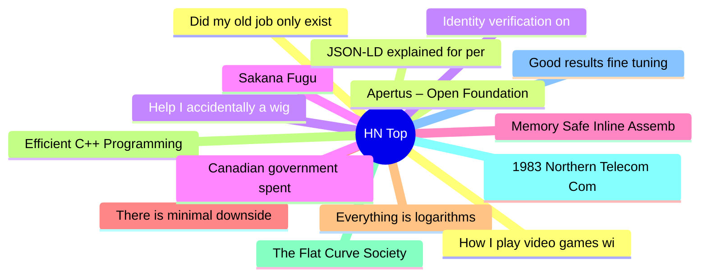

# HackerNews 每日 Top 30 (2026-06-22)

## 思维导图

## 列表（30 条）

### 1. Did my old job only exist because of fraud?
- **链接**: [https://david.newgas.net/did-my-old-job-only-exist-because-of-fraud/](https://david.newgas.net/did-my-old-job-only-exist-because-of-fraud/)
- **分数**: 330 | **评论**: 148 | **作者**: advisedwang
- **HN 讨论**: https://news.ycombinator.com/item?id=48622867

### 2. Apertus – Open Foundation Model for Sovereign AI
- **链接**: [https://apertvs.ai/](https://apertvs.ai/)
- **分数**: 270 | **评论**: 94 | **作者**: T-A
- **HN 讨论**: https://news.ycombinator.com/item?id=48622778

### 3. Help I accidentally a wigglegram
- **链接**: [https://lmao.center/blog/wiggle-accidents/](https://lmao.center/blog/wiggle-accidents/)
- **分数**: 51 | **评论**: 6 | **作者**: gregsadetsky
- **HN 讨论**: https://news.ycombinator.com/item?id=48605561

### 4. Sakana Fugu
- **链接**: [https://sakana.ai/fugu/](https://sakana.ai/fugu/)
- **分数**: 57 | **评论**: 21 | **作者**: Finbarr
- **HN 讨论**: https://news.ycombinator.com/item?id=48624782

### 5. Memory Safe Inline Assembly
- **链接**: [https://fil-c.org/inlineasm](https://fil-c.org/inlineasm)
- **分数**: 50 | **评论**: 8 | **作者**: pizlonator
- **HN 讨论**: https://news.ycombinator.com/item?id=48606096

### 6. There is minimal downside to switching to open models
- **链接**: [https://www.marble.onl/posts/cancel_claude.html](https://www.marble.onl/posts/cancel_claude.html)
- **分数**: 107 | **评论**: 64 | **作者**: amarble
- **HN 讨论**: https://news.ycombinator.com/item?id=48622518

### 7. Everything is logarithms
- **链接**: [https://alexkritchevsky.com/2026/05/25/everything-is-logarithms.html](https://alexkritchevsky.com/2026/05/25/everything-is-logarithms.html)
- **分数**: 152 | **评论**: 30 | **作者**: E-Reverance
- **HN 讨论**: https://news.ycombinator.com/item?id=48622626

### 8. Efficient C++ Programming for Modern C++ CPUs, Chapter 4/part 2
- **链接**: [https://6it.dev/blog/infographics-operation-costs-in-cpu-clock-cycles-take-2-80736](https://6it.dev/blog/infographics-operation-costs-in-cpu-clock-cycles-take-2-80736)
- **分数**: 11 | **评论**: 0 | **作者**: birdculture
- **HN 讨论**: https://news.ycombinator.com/item?id=48605085

### 9. The Flat Curve Society
- **链接**: [https://steve-yegge.medium.com/the-flat-curve-society-36c8b01eb33b](https://steve-yegge.medium.com/the-flat-curve-society-36c8b01eb33b)
- **分数**: 15 | **评论**: 7 | **作者**: fbuilesv
- **HN 讨论**: https://news.ycombinator.com/item?id=48625192

### 10. 1983 Northern Telecom Commodore Phone
- **链接**: [https://www.oldtelephoneroom.ca/1983-northern-telecom-commodore-phone/](https://www.oldtelephoneroom.ca/1983-northern-telecom-commodore-phone/)
- **分数**: 33 | **评论**: 9 | **作者**: arexxbifs
- **HN 讨论**: https://news.ycombinator.com/item?id=48624114

### 11. Good results fine tuning a local LLM like Qwen 3:0.6B to categorize questions
- **链接**: [https://www.teachmecoolstuff.com/viewarticle/fine-tuning-a-local-llm-to-categorize-questions](https://www.teachmecoolstuff.com/viewarticle/fine-tuning-a-local-llm-to-categorize-questions)
- **分数**: 54 | **评论**: 8 | **作者**: dev-experiments
- **HN 讨论**: https://news.ycombinator.com/item?id=48623434

### 12. How I play video games with spinal muscular atrophy
- **链接**: [https://www.openassistivetech.org/how-i-actually-play-video-games-with-sma-the-tools-i-use-every-day/](https://www.openassistivetech.org/how-i-actually-play-video-games-with-sma-the-tools-i-use-every-day/)
- **分数**: 61 | **评论**: 10 | **作者**: dannyobrien
- **HN 讨论**: https://news.ycombinator.com/item?id=48589687

### 13. JSON-LD explained for personal websites
- **链接**: [https://hawksley.dev/blog/json-ld-explained-for-personal-websites/](https://hawksley.dev/blog/json-ld-explained-for-personal-websites/)
- **分数**: 185 | **评论**: 56 | **作者**: ethanhawksley
- **HN 讨论**: https://news.ycombinator.com/item?id=48621517

### 14. Identity verification on Claude
- **链接**: [https://support.claude.com/en/articles/14328960-identity-verification-on-claude](https://support.claude.com/en/articles/14328960-identity-verification-on-claude)
- **分数**: 631 | **评论**: 548 | **作者**: bathory
- **HN 讨论**: https://news.ycombinator.com/item?id=48618455

### 15. Canadian government spent $46.8M on a secret Palantir contract
- **链接**: [https://theijf.org/brief/canadian-palantir-contract-amendments-obd](https://theijf.org/brief/canadian-palantir-contract-amendments-obd)
- **分数**: 13 | **评论**: 1 | **作者**: logickkk1
- **HN 讨论**: https://news.ycombinator.com/item?id=48624834

### 16. PowerFox Browser
- **链接**: [https://powerfox.jazzzny.me/](https://powerfox.jazzzny.me/)
- **分数**: 93 | **评论**: 30 | **作者**: thisislife2
- **HN 讨论**: https://news.ycombinator.com/item?id=48622731

### 17. Beyond All Reason (Free Total Annihilation Inspired RTS)
- **链接**: [https://www.beyondallreason.info](https://www.beyondallreason.info)
- **分数**: 450 | **评论**: 269 | **作者**: mosiuerbarso
- **HN 讨论**: https://news.ycombinator.com/item?id=48617990

### 18. Japanese verb conjugation the simple hard way
- **链接**: [https://underreacted.leaflet.pub/3mmevu6woys27](https://underreacted.leaflet.pub/3mmevu6woys27)
- **分数**: 50 | **评论**: 67 | **作者**: valzevul
- **HN 讨论**: https://news.ycombinator.com/item?id=48623419

### 19. Prefer duplication over the wrong abstraction (2016)
- **链接**: [https://sandimetz.com/blog/2016/1/20/the-wrong-abstraction](https://sandimetz.com/blog/2016/1/20/the-wrong-abstraction)
- **分数**: 444 | **评论**: 301 | **作者**: rafaepta
- **HN 讨论**: https://news.ycombinator.com/item?id=48620090

### 20. Show HN: HN Game Stories – mini-documentary of games that hit the front page
- **链接**: [https://video.intellios.ai](https://video.intellios.ai)
- **分数**: 5 | **评论**: 0 | **作者**: coolwulf
- **HN 讨论**: https://news.ycombinator.com/item?id=48614087

### 21. HPV jabs cut risk of dying from cervical cancer before 30 to almost zero
- **链接**: [https://www.theguardian.com/society/2026/jun/17/hpv-jabs-reduce-risk-dying-cervical-cancer-before-30-zero-study-finds](https://www.theguardian.com/society/2026/jun/17/hpv-jabs-reduce-risk-dying-cervical-cancer-before-30-zero-study-finds)
- **分数**: 205 | **评论**: 120 | **作者**: toomuchtodo
- **HN 讨论**: https://news.ycombinator.com/item?id=48579013

### 22. From Combinatorial Mess to Linear Elegance: Architecting a Conversion Engine
- **链接**: [https://blog.minimal.app/conversion-engine/](https://blog.minimal.app/conversion-engine/)
- **分数**: 16 | **评论**: 3 | **作者**: arthurofbabylon
- **HN 讨论**: https://news.ycombinator.com/item?id=48568487

### 23. Show HN: Recall – fully-local project memory for Claude Code
- **链接**: [https://github.com/raiyanyahya/recall](https://github.com/raiyanyahya/recall)
- **分数**: 88 | **评论**: 61 | **作者**: mateenah
- **HN 讨论**: https://news.ycombinator.com/item?id=48622590

### 24. Minecraft: Java Edition 26.2, the first version with Vulkan 1.2
- **链接**: [https://www.minecraft.net/en-us/article/minecraft-java-edition-26-2](https://www.minecraft.net/en-us/article/minecraft-java-edition-26-2)
- **分数**: 87 | **评论**: 30 | **作者**: ObviouslyFlamer
- **HN 讨论**: https://news.ycombinator.com/item?id=48567028

### 25. The minimum viable unit of saleable software
- **链接**: [https://brandur.org/minimum-viable-unit](https://brandur.org/minimum-viable-unit)
- **分数**: 142 | **评论**: 53 | **作者**: brandur
- **HN 讨论**: https://news.ycombinator.com/item?id=48620342

### 26. Show HN: Teach your kids perfect pitch
- **链接**: [https://github.com/paytonjjones/bsharp](https://github.com/paytonjjones/bsharp)
- **分数**: 75 | **评论**: 52 | **作者**: paytonjjones
- **HN 讨论**: https://news.ycombinator.com/item?id=48618488

### 27. Rent collections are down in New York
- **链接**: [https://www.politico.com/news/2026/06/21/rent-collections-are-down-in-new-york-and-no-ones-sure-why-00966982](https://www.politico.com/news/2026/06/21/rent-collections-are-down-in-new-york-and-no-ones-sure-why-00966982)
- **分数**: 49 | **评论**: 117 | **作者**: JumpCrisscross
- **HN 讨论**: https://news.ycombinator.com/item?id=48622987

### 28. Wildcard (YC W25) is hiring an applied ML engineer
- **链接**: [https://www.ycombinator.com/companies/wildcard/jobs/SEmo4di-founding-applied-ml-engineer](https://www.ycombinator.com/companies/wildcard/jobs/SEmo4di-founding-applied-ml-engineer)
- **分数**: 1 | **评论**: 0 | **作者**: kaushikmahorker
- **HN 讨论**: https://news.ycombinator.com/item?id=48620504

### 29. Show HN: Criterion Closet as a website – pull any of 1,247 films off the shelf
- **链接**: [https://the-criterion-closet.vercel.app](https://the-criterion-closet.vercel.app)
- **分数**: 64 | **评论**: 15 | **作者**: olievans
- **HN 讨论**: https://news.ycombinator.com/item?id=48609054

### 30. FDA advisors unanimously vote to approve Moderna's mRNA after agency drama
- **链接**: [https://arstechnica.com/health/2026/06/fda-advisors-unanimously-vote-to-approve-modernas-mrna-after-agency-drama/](https://arstechnica.com/health/2026/06/fda-advisors-unanimously-vote-to-approve-modernas-mrna-after-agency-drama/)
- **分数**: 139 | **评论**: 77 | **作者**: worik
- **HN 讨论**: https://news.ycombinator.com/item?id=48622788
