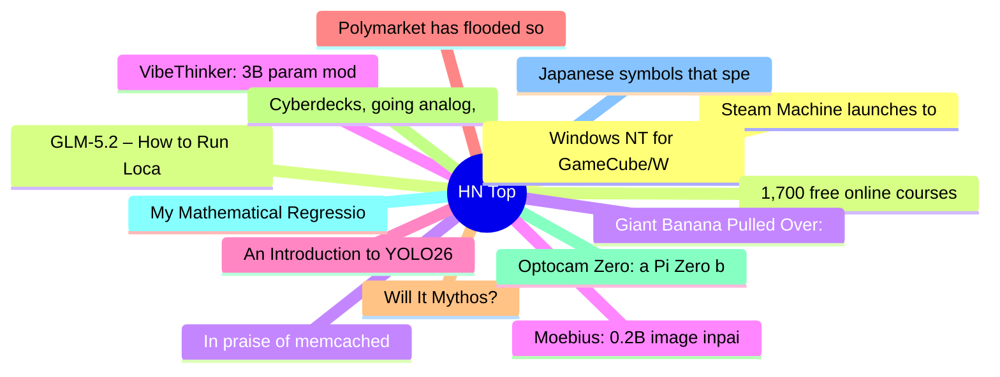

# HackerNews 每日 Top 30 (2026-06-23)

## 思维导图

## 列表（30 条）

### 1. Steam Machine launches today
- **链接**: [https://store.steampowered.com/news/group/45479024/view/685257114654870245](https://store.steampowered.com/news/group/45479024/view/685257114654870245)
- **分数**: 1346 | **评论**: 1213 | **作者**: theschwa
- **HN 讨论**: https://news.ycombinator.com/item?id=48632884

### 2. GLM-5.2 – How to Run Locally
- **链接**: [https://unsloth.ai/docs/models/glm-5.2](https://unsloth.ai/docs/models/glm-5.2)
- **分数**: 253 | **评论**: 112 | **作者**: TechTechTech
- **HN 讨论**: https://news.ycombinator.com/item?id=48636377

### 3. In praise of memcached
- **链接**: [https://jchri.st/blog/in-praise-of-memcached/](https://jchri.st/blog/in-praise-of-memcached/)
- **分数**: 80 | **评论**: 27 | **作者**: j03b
- **HN 讨论**: https://news.ycombinator.com/item?id=48638886

### 4. VibeThinker: 3B param model that beats Opus 4.5 on reasoning with novel SFT+GRPO
- **链接**: [https://arxiv.org/abs/2606.16140](https://arxiv.org/abs/2606.16140)
- **分数**: 48 | **评论**: 18 | **作者**: timhigins
- **HN 讨论**: https://news.ycombinator.com/item?id=48639240

### 5. An Introduction to YOLO26
- **链接**: [https://blog.roboflow.com/yolo26/](https://blog.roboflow.com/yolo26/)
- **分数**: 20 | **评论**: 0 | **作者**: teleforce
- **HN 讨论**: https://news.ycombinator.com/item?id=48639165

### 6. Polymarket has flooded social media with deceptive videos by paid creators
- **链接**: [https://www.wsj.com/business/media/polymarket-social-media-bets-prediction-market-441cdeb5?st=HhTZY2](https://www.wsj.com/business/media/polymarket-social-media-bets-prediction-market-441cdeb5?st=HhTZY2)
- **分数**: 89 | **评论**: 90 | **作者**: Vaslo
- **HN 讨论**: https://news.ycombinator.com/item?id=48614715

### 7. Will It Mythos?
- **链接**: [https://swelljoe.com/post/will-it-mythos/](https://swelljoe.com/post/will-it-mythos/)
- **分数**: 3 | **评论**: 0 | **作者**: mindingnever
- **HN 讨论**: https://news.ycombinator.com/item?id=48640196

### 8. Cyberdecks, going analog, and convivial technology
- **链接**: [https://blog.hydroponictrash.solar/cyberdecks-going-analog-and-convivial-technology/](https://blog.hydroponictrash.solar/cyberdecks-going-analog-and-convivial-technology/)
- **分数**: 68 | **评论**: 30 | **作者**: akkartik
- **HN 讨论**: https://news.ycombinator.com/item?id=48605776

### 9. Optocam Zero: a Pi Zero based digital camera made using off the shelf components
- **链接**: [https://github.com/dorukkumkumoglu/optocamzero](https://github.com/dorukkumkumoglu/optocamzero)
- **分数**: 130 | **评论**: 31 | **作者**: iamnothere
- **HN 讨论**: https://news.ycombinator.com/item?id=48634778

### 10. My Mathematical Regression
- **链接**: [https://blog.dahl.dev/posts/my-mathematical-regression/](https://blog.dahl.dev/posts/my-mathematical-regression/)
- **分数**: 239 | **评论**: 88 | **作者**: aleda145
- **HN 讨论**: https://news.ycombinator.com/item?id=48597221

### 11. Japanese symbols that speak without words
- **链接**: [https://arun.is/blog/japan-symbols/](https://arun.is/blog/japan-symbols/)
- **分数**: 134 | **评论**: 56 | **作者**: msephton
- **HN 讨论**: https://news.ycombinator.com/item?id=48634803

### 12. Windows NT for GameCube/Wii
- **链接**: [https://github.com/Wack0/entii-for-workcubes](https://github.com/Wack0/entii-for-workcubes)
- **分数**: 35 | **评论**: 7 | **作者**: zdw
- **HN 讨论**: https://news.ycombinator.com/item?id=48598591

### 13. 1,700 free online courses from top universities
- **链接**: [https://www.openculture.com/freeonlinecourses](https://www.openculture.com/freeonlinecourses)
- **分数**: 100 | **评论**: 20 | **作者**: momentmaker
- **HN 讨论**: https://news.ycombinator.com/item?id=48639184

### 14. Giant Banana Pulled Over: Driver Says Cops Have Stopped Him 100s of Times
- **链接**: [https://cowboystatedaily.com/2026/06/18/giant-banana-pulled-over-in-montana-driver-says-cops-have-stopped-him-100s-of-times/](https://cowboystatedaily.com/2026/06/18/giant-banana-pulled-over-in-montana-driver-says-cops-have-stopped-him-100s-of-times/)
- **分数**: 10 | **评论**: 1 | **作者**: speckx
- **HN 讨论**: https://news.ycombinator.com/item?id=48614097

### 15. Moebius: 0.2B image inpainting model with 10B-level performance
- **链接**: [https://hustvl.github.io/Moebius/](https://hustvl.github.io/Moebius/)
- **分数**: 251 | **评论**: 65 | **作者**: DSemba
- **HN 讨论**: https://news.ycombinator.com/item?id=48630171

### 16. Is it time for a new Embedded Linux build system?
- **链接**: [https://yoebuild.org/blog/time-for-a-new-build-system/](https://yoebuild.org/blog/time-for-a-new-build-system/)
- **分数**: 51 | **评论**: 36 | **作者**: cbrake
- **HN 讨论**: https://news.ycombinator.com/item?id=48588247

### 17. Canada plans 'nuclear renaissance' with up to 10 reactors built by 2040
- **链接**: [https://www.cbc.ca/news/politics/federal-nuclear-strategy-9.7244509](https://www.cbc.ca/news/politics/federal-nuclear-strategy-9.7244509)
- **分数**: 375 | **评论**: 227 | **作者**: geox
- **HN 讨论**: https://news.ycombinator.com/item?id=48634585

### 18. British Columbia, Time Zones, and Postgres
- **链接**: [https://www.crunchydata.com/blog/british-columbia-and-time-zone-changes](https://www.crunchydata.com/blog/british-columbia-and-time-zone-changes)
- **分数**: 124 | **评论**: 82 | **作者**: sprawl_
- **HN 讨论**: https://news.ycombinator.com/item?id=48634787

### 19. Show HN: Oak – Git alternative designed for agents
- **链接**: [https://oak.space/oak/oak](https://oak.space/oak/oak)
- **分数**: 163 | **评论**: 154 | **作者**: zdgeier
- **HN 讨论**: https://news.ycombinator.com/item?id=48631726

### 20. Package Managers need global hooks
- **链接**: [https://captnemo.in/blog/2026/06/17/package-managers-need-hooks/](https://captnemo.in/blog/2026/06/17/package-managers-need-hooks/)
- **分数**: 7 | **评论**: 1 | **作者**: evakhoury
- **HN 讨论**: https://news.ycombinator.com/item?id=48586767

### 21. Kyber (YC W23) Is Hiring a Head of Engineering
- **链接**: [https://www.ycombinator.com/companies/kyber/jobs/FGmI8mx-head-of-engineering](https://www.ycombinator.com/companies/kyber/jobs/FGmI8mx-head-of-engineering)
- **分数**: 1 | **评论**: 0 | **作者**: asontha
- **HN 讨论**: https://news.ycombinator.com/item?id=48636125

### 22. Canyon HUD helmet for road riding
- **链接**: [https://media-centre.canyon.com/en-INT/266866-new-canyon-heads-up-display-helmet-could-be-a-safety-gamechanger-for-road-riding/](https://media-centre.canyon.com/en-INT/266866-new-canyon-heads-up-display-helmet-could-be-a-safety-gamechanger-for-road-riding/)
- **分数**: 77 | **评论**: 91 | **作者**: zh3
- **HN 讨论**: https://news.ycombinator.com/item?id=48609129

### 23. Flock-Powered Police Chiefs Stalking Women Shows Why Warrants Are Needed
- **链接**: [https://ipvm.com/reports/police-chiefs-track](https://ipvm.com/reports/police-chiefs-track)
- **分数**: 434 | **评论**: 176 | **作者**: jhonovich
- **HN 讨论**: https://news.ycombinator.com/item?id=48634694

### 24. Show HN: Pagecast – Publish Markdown/HTML Reports to Cloudflare Pages
- **链接**: [https://github.com/Amal-David/pagecast](https://github.com/Amal-David/pagecast)
- **分数**: 37 | **评论**: 9 | **作者**: amaldavid
- **HN 讨论**: https://news.ycombinator.com/item?id=48590505

### 25. ytr: YouTube Radio for Emacs
- **链接**: [https://xenodium.com/ytr-youtube-radio-for-emacs](https://xenodium.com/ytr-youtube-radio-for-emacs)
- **分数**: 75 | **评论**: 8 | **作者**: xenodium
- **HN 讨论**: https://news.ycombinator.com/item?id=48636380

### 26. Job application asked for my SAT scores
- **链接**: [https://mrmarket.lol/job-application-asked-for-my-sat-scores/](https://mrmarket.lol/job-application-asked-for-my-sat-scores/)
- **分数**: 109 | **评论**: 270 | **作者**: seltzerboys
- **HN 讨论**: https://news.ycombinator.com/item?id=48636062

### 27. Help I accidentally a wigglegram
- **链接**: [https://lmao.center/blog/wiggle-accidents/](https://lmao.center/blog/wiggle-accidents/)
- **分数**: 504 | **评论**: 120 | **作者**: gregsadetsky
- **HN 讨论**: https://news.ycombinator.com/item?id=48605561

### 28. Prompt Injection as Role Confusion
- **链接**: [https://role-confusion.github.io](https://role-confusion.github.io)
- **分数**: 166 | **评论**: 89 | **作者**: x312
- **HN 讨论**: https://news.ycombinator.com/item?id=48631888

### 29. Show HN: Got sick of ads, so I made my own logic puzzle site
- **链接**: [https://puzzlelair.com/](https://puzzlelair.com/)
- **分数**: 157 | **评论**: 105 | **作者**: HaxleRose
- **HN 讨论**: https://news.ycombinator.com/item?id=48629213

### 30. Ultralytics YOLO26: Unified Real-Time End-to-End Vision Models
- **链接**: [https://arxiv.org/abs/2606.03748](https://arxiv.org/abs/2606.03748)
- **分数**: 10 | **评论**: 0 | **作者**: teleforce
- **HN 讨论**: https://news.ycombinator.com/item?id=48639434
