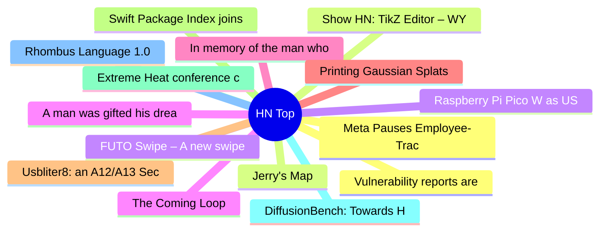

# HackerNews 每日 Top 30 (2026-06-24)

## 思维导图

## 列表（30 条）

### 1. Vulnerability reports are not special anymore
- **链接**: [https://words.filippo.io/vuln-reports/](https://words.filippo.io/vuln-reports/)
- **分数**: 138 | **评论**: 58 | **作者**: goranmoomin
- **HN 讨论**: https://news.ycombinator.com/item?id=48653216

### 2. Jerry's Map
- **链接**: [http://www.jerrysmap.com/the-map](http://www.jerrysmap.com/the-map)
- **分数**: 370 | **评论**: 49 | **作者**: turtleyacht
- **HN 讨论**: https://news.ycombinator.com/item?id=48649435

### 3. FUTO Swipe – A new swipe typing model
- **链接**: [https://swipe.futo.tech/](https://swipe.futo.tech/)
- **分数**: 363 | **评论**: 107 | **作者**: futohq
- **HN 讨论**: https://news.ycombinator.com/item?id=48648619

### 4. A man was gifted his dream car by Kevin Mitnick, who he helped put in prison
- **链接**: [https://www.thedrive.com/news/this-man-was-gifted-his-dream-car-by-the-notorious-hacker-he-put-in-prison](https://www.thedrive.com/news/this-man-was-gifted-his-dream-car-by-the-notorious-hacker-he-put-in-prison)
- **分数**: 118 | **评论**: 56 | **作者**: mauvehaus
- **HN 讨论**: https://news.ycombinator.com/item?id=48633643

### 5. In memory of the man who put red and green squiggles under words
- **链接**: [https://devblogs.microsoft.com/oldnewthing/20260622-00/?p=112451](https://devblogs.microsoft.com/oldnewthing/20260622-00/?p=112451)
- **分数**: 221 | **评论**: 22 | **作者**: saikatsg
- **HN 讨论**: https://news.ycombinator.com/item?id=48648959

### 6. Printing Gaussian Splats
- **链接**: [https://www.patreon.com/DanyBittel/posts/printing-splats-161333338](https://www.patreon.com/DanyBittel/posts/printing-splats-161333338)
- **分数**: 220 | **评论**: 21 | **作者**: ilnmtlbnm
- **HN 讨论**: https://news.ycombinator.com/item?id=48618481

### 7. Usbliter8: an A12/A13 SecureROM Exploit
- **链接**: [https://ps.tc/pages/blog-usbliter8.html](https://ps.tc/pages/blog-usbliter8.html)
- **分数**: 106 | **评论**: 23 | **作者**: givinguflac
- **HN 讨论**: https://news.ycombinator.com/item?id=48585852

### 8. Swift Package Index joins Apple
- **链接**: [https://swiftpackageindex.com/blog/swift-package-index-joins-apple](https://swiftpackageindex.com/blog/swift-package-index-joins-apple)
- **分数**: 188 | **评论**: 57 | **作者**: JDevlieghere
- **HN 讨论**: https://news.ycombinator.com/item?id=48648779

### 9. Extreme Heat conference cancelled due to extreme heat warning
- **链接**: [https://www.lse.ac.uk/granthaminstitute/events/extreme-heat-improving-governance-and-strengthening-action-around-the-world/](https://www.lse.ac.uk/granthaminstitute/events/extreme-heat-improving-governance-and-strengthening-action-around-the-world/)
- **分数**: 244 | **评论**: 174 | **作者**: rendx
- **HN 讨论**: https://news.ycombinator.com/item?id=48653060

### 10. DiffusionBench: Towards Holistic Evaluation of Generative Diffusion Transformers
- **链接**: [https://github.com/End2End-Diffusion/diffusion-bench](https://github.com/End2End-Diffusion/diffusion-bench)
- **分数**: 13 | **评论**: 0 | **作者**: ilreb
- **HN 讨论**: https://news.ycombinator.com/item?id=48654274

### 11. Rhombus Language 1.0
- **链接**: [https://blog.racket-lang.org/2026/06/rhombus-v1.0.html](https://blog.racket-lang.org/2026/06/rhombus-v1.0.html)
- **分数**: 106 | **评论**: 22 | **作者**: Decabytes
- **HN 讨论**: https://news.ycombinator.com/item?id=48633473

### 12. Meta Pauses Employee-Tracking Program Following Internal Data Leak
- **链接**: [https://www.wired.com/story/meta-pauses-employee-tracking-program-following-internal-security-breach/](https://www.wired.com/story/meta-pauses-employee-tracking-program-following-internal-security-breach/)
- **分数**: 123 | **评论**: 49 | **作者**: 1vuio0pswjnm7
- **HN 讨论**: https://news.ycombinator.com/item?id=48653575

### 13. Show HN: TikZ Editor – WYSIWYG editor for figures in LaTeX
- **链接**: [https://tikz.dev/editor/](https://tikz.dev/editor/)
- **分数**: 354 | **评论**: 66 | **作者**: DominikPeters
- **HN 讨论**: https://news.ycombinator.com/item?id=48645437

### 14. Raspberry Pi Pico W as USB Wi-Fi Adapter
- **链接**: [https://gitlab.com/baiyibai/pico-usb-wifi](https://gitlab.com/baiyibai/pico-usb-wifi)
- **分数**: 9 | **评论**: 2 | **作者**: byb
- **HN 讨论**: https://news.ycombinator.com/item?id=48654676

### 15. The Coming Loop
- **链接**: [https://lucumr.pocoo.org/2026/6/23/the-coming-loop/](https://lucumr.pocoo.org/2026/6/23/the-coming-loop/)
- **分数**: 359 | **评论**: 251 | **作者**: ingve
- **HN 讨论**: https://news.ycombinator.com/item?id=48643180

### 16. The war on terror primed America for autocracy
- **链接**: [https://www.economist.com/by-invitation/2026/06/02/how-the-war-on-terror-primed-america-for-autocracy](https://www.economist.com/by-invitation/2026/06/02/how-the-war-on-terror-primed-america-for-autocracy)
- **分数**: 101 | **评论**: 67 | **作者**: andsoitis
- **HN 讨论**: https://news.ycombinator.com/item?id=48654367

### 17. The worthlessness of Vitamin D is mildly exaggerated
- **链接**: [https://dynomight.net/vitamin-d/](https://dynomight.net/vitamin-d/)
- **分数**: 236 | **评论**: 166 | **作者**: surprisetalk
- **HN 讨论**: https://news.ycombinator.com/item?id=48647486

### 18. Qwen-AgentWorld: Language World Models for General Agents
- **链接**: [https://arxiv.org/abs/2606.24597](https://arxiv.org/abs/2606.24597)
- **分数**: 11 | **评论**: 0 | **作者**: ilreb
- **HN 讨论**: https://news.ycombinator.com/item?id=48654351

### 19. Show HN: An ASCII 3D Rendering Engine
- **链接**: [https://glyphcss.com](https://glyphcss.com)
- **分数**: 13 | **评论**: 5 | **作者**: apresmoi
- **HN 讨论**: https://news.ycombinator.com/item?id=48612025

### 20. Dirty Little Zine – a tool for making an 8 page printable Zine
- **链接**: [https://dirtylittlezine.com/](https://dirtylittlezine.com/)
- **分数**: 85 | **评论**: 8 | **作者**: cianmm
- **HN 讨论**: https://news.ycombinator.com/item?id=48611896

### 21. The Teensy Executable Revisited
- **链接**: [https://www.muppetlabs.com/~breadbox/software/tiny/revisit.html](https://www.muppetlabs.com/~breadbox/software/tiny/revisit.html)
- **分数**: 7 | **评论**: 0 | **作者**: ankitg12
- **HN 讨论**: https://news.ycombinator.com/item?id=48654411

### 22. F* file system – file search that reads SSD directly bypassing OS kernel
- **链接**: [https://github.com/dmtrKovalenko/ffs](https://github.com/dmtrKovalenko/ffs)
- **分数**: 49 | **评论**: 36 | **作者**: neogoose
- **HN 讨论**: https://news.ycombinator.com/item?id=48622433

### 23. Inventing the Future, One Lisp Machine at a Time
- **链接**: [https://www.patrickdomanico.com/bpm/2026/06/16/inventing-the-future-one-lisp-machine-at-a-time/](https://www.patrickdomanico.com/bpm/2026/06/16/inventing-the-future-one-lisp-machine-at-a-time/)
- **分数**: 85 | **评论**: 9 | **作者**: pamoroso
- **HN 讨论**: https://news.ycombinator.com/item?id=48631511

### 24. Millimeter wave technology drills 100 meters into granite
- **链接**: [https://www.thinkgeoenergy.com/quaise-energy-achieves-100-meters-of-drilling-using-millimeter-wave-technology/](https://www.thinkgeoenergy.com/quaise-energy-achieves-100-meters-of-drilling-using-millimeter-wave-technology/)
- **分数**: 109 | **评论**: 27 | **作者**: Jimmc414
- **HN 讨论**: https://news.ycombinator.com/item?id=48611585

### 25. Hunting Million-Digit Primes from My Loft
- **链接**: [https://primecrunch.com/blog/2/hunting-million-digit-primes-from-my-loft](https://primecrunch.com/blog/2/hunting-million-digit-primes-from-my-loft)
- **分数**: 9 | **评论**: 1 | **作者**: andyhedges
- **HN 讨论**: https://news.ycombinator.com/item?id=48621018

### 26. Show HN: RLM-based local debugger for AI agent traces
- **链接**: [https://github.com/context-labs/halo](https://github.com/context-labs/halo)
- **分数**: 16 | **评论**: 5 | **作者**: mikepollard_dev
- **HN 讨论**: https://news.ycombinator.com/item?id=48649137

### 27. QSOE: QNX-inspired OS with dual-kernel architecture
- **链接**: [https://qsoe-dev.blogspot.com/2026/06/qsoe-project-v01-is-released.html](https://qsoe-dev.blogspot.com/2026/06/qsoe-project-v01-is-released.html)
- **分数**: 31 | **评论**: 11 | **作者**: ymz5
- **HN 讨论**: https://news.ycombinator.com/item?id=48630085

### 28. The Low-Tech AI of Elden Ring
- **链接**: [https://nega.tv/posts/low-tech-ai-of-elden-ring.html](https://nega.tv/posts/low-tech-ai-of-elden-ring.html)
- **分数**: 123 | **评论**: 59 | **作者**: g0xA52A2A
- **HN 讨论**: https://news.ycombinator.com/item?id=48643489

### 29. Five monitors on a Commodore 128 [video]
- **链接**: [https://www.youtube.com/watch?v=ul5hC3PY1Yg](https://www.youtube.com/watch?v=ul5hC3PY1Yg)
- **分数**: 112 | **评论**: 21 | **作者**: EvanAnderson
- **HN 讨论**: https://news.ycombinator.com/item?id=48634187

### 30. Fired by Google for creating the Google workspace CLI
- **链接**: [https://twitter.com/JPoehnelt/status/2069482265953087602](https://twitter.com/JPoehnelt/status/2069482265953087602)
- **分数**: 360 | **评论**: 233 | **作者**: justinwp
- **HN 讨论**: https://news.ycombinator.com/item?id=48649011
