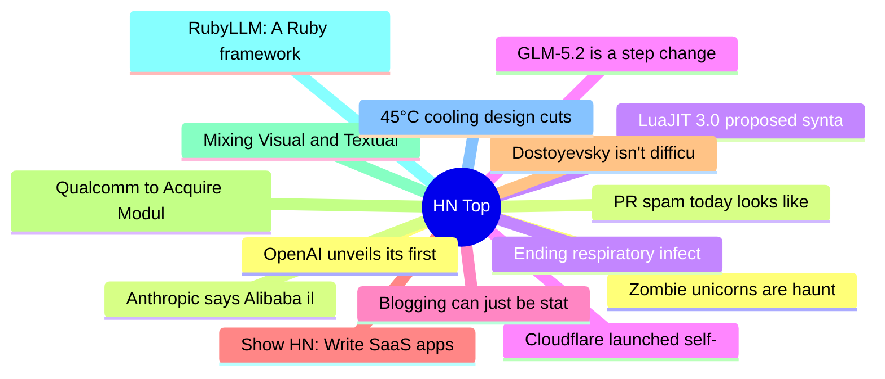

# HackerNews 每日 Top 30 (2026-06-25)

## 思维导图

## 列表（30 条）

### 1. OpenAI unveils its first custom chip, built by Broadcom
- **链接**: [https://techcrunch.com/2026/06/24/openai-unveils-its-first-custom-chip-built-by-broadcom/](https://techcrunch.com/2026/06/24/openai-unveils-its-first-custom-chip-built-by-broadcom/)
- **分数**: 613 | **评论**: 355 | **作者**: jamdesk
- **HN 讨论**: https://news.ycombinator.com/item?id=48663324

### 2. Anthropic says Alibaba illicitly extracted Claude AI model capabilities
- **链接**: [https://www.reuters.com/world/china/anthropic-says-alibaba-illicitly-extracted-claude-ai-model-capabilities-2026-06-24/](https://www.reuters.com/world/china/anthropic-says-alibaba-illicitly-extracted-claude-ai-model-capabilities-2026-06-24/)
- **分数**: 167 | **评论**: 307 | **作者**: htrp
- **HN 讨论**: https://news.ycombinator.com/item?id=48664814

### 3. LuaJIT 3.0 proposed syntax extensions
- **链接**: [https://github.com/LuaJIT/LuaJIT/issues/1475](https://github.com/LuaJIT/LuaJIT/issues/1475)
- **分数**: 94 | **评论**: 50 | **作者**: phreddypharkus
- **HN 讨论**: https://news.ycombinator.com/item?id=48667336

### 4. Cloudflare launched self-managed OAuth for all
- **链接**: [https://blog.cloudflare.com/oauth-for-all/](https://blog.cloudflare.com/oauth-for-all/)
- **分数**: 46 | **评论**: 10 | **作者**: terryds
- **HN 讨论**: https://news.ycombinator.com/item?id=48668033

### 5. Blogging can just be stating the obvious
- **链接**: [https://blog.jim-nielsen.com/2026/blogging-stating-the-obvious/](https://blog.jim-nielsen.com/2026/blogging-stating-the-obvious/)
- **分数**: 119 | **评论**: 48 | **作者**: Curiositry
- **HN 讨论**: https://news.ycombinator.com/item?id=48666927

### 6. Show HN: Write SaaS apps where users control where their data is stored
- **链接**: [https://github.com/wolfoo2931/linkedrecords/](https://github.com/wolfoo2931/linkedrecords/)
- **分数**: 18 | **评论**: 0 | **作者**: WolfOliver
- **HN 讨论**: https://news.ycombinator.com/item?id=48595882

### 7. Dostoyevsky isn't difficult
- **链接**: [https://www.autodidacts.io/dostoyevsky-isnt-difficult/](https://www.autodidacts.io/dostoyevsky-isnt-difficult/)
- **分数**: 81 | **评论**: 67 | **作者**: surprisetalk
- **HN 讨论**: https://news.ycombinator.com/item?id=48631366

### 8. Qualcomm to Acquire Modular
- **链接**: [https://www.reuters.com/business/qualcomm-buy-ai-startup-modular-2026-06-24/](https://www.reuters.com/business/qualcomm-buy-ai-startup-modular-2026-06-24/)
- **分数**: 170 | **评论**: 40 | **作者**: timmyd
- **HN 讨论**: https://news.ycombinator.com/item?id=48659798

### 9. Mixing Visual and Textual Code
- **链接**: [https://arxiv.org/abs/2603.15855](https://arxiv.org/abs/2603.15855)
- **分数**: 23 | **评论**: 3 | **作者**: doppioandante
- **HN 讨论**: https://news.ycombinator.com/item?id=48667560

### 10. RubyLLM: A Ruby framework for all major AI providers
- **链接**: [https://rubyllm.com/](https://rubyllm.com/)
- **分数**: 361 | **评论**: 60 | **作者**: doener
- **HN 讨论**: https://news.ycombinator.com/item?id=48660711

### 11. 45°C cooling design cuts data center water use to near zero
- **链接**: [https://blogs.nvidia.com/blog/liquid-cooling-ai-factories/](https://blogs.nvidia.com/blog/liquid-cooling-ai-factories/)
- **分数**: 243 | **评论**: 167 | **作者**: nitin_flanker
- **HN 讨论**: https://news.ycombinator.com/item?id=48660178

### 12. Zombie unicorns are haunting Silicon Valley
- **链接**: [https://www.economist.com/business/2026/06/21/zombie-unicorns-are-haunting-silicon-valley](https://www.economist.com/business/2026/06/21/zombie-unicorns-are-haunting-silicon-valley)
- **分数**: 20 | **评论**: 4 | **作者**: andsoitis
- **HN 讨论**: https://news.ycombinator.com/item?id=48668020

### 13. PR spam today looks like email spam in the early 2000s
- **链接**: [https://www.greptile.com/blog/prs-on-openclaw](https://www.greptile.com/blog/prs-on-openclaw)
- **分数**: 193 | **评论**: 113 | **作者**: dakshgupta
- **HN 讨论**: https://news.ycombinator.com/item?id=48660579

### 14. Ending respiratory infections
- **链接**: [https://blog.interceptfund.com/p/ending-respiratory-infections](https://blog.interceptfund.com/p/ending-respiratory-infections)
- **分数**: 105 | **评论**: 42 | **作者**: EthanFantl
- **HN 讨论**: https://news.ycombinator.com/item?id=48667588

### 15. GLM-5.2 is a step change for open agents
- **链接**: [https://www.interconnects.ai/p/glm-52-is-the-step-change-for-open](https://www.interconnects.ai/p/glm-52-is-the-step-change-for-open)
- **分数**: 161 | **评论**: 92 | **作者**: vantareed
- **HN 讨论**: https://news.ycombinator.com/item?id=48639840

### 16. Computer use in Gemini 3.5 Flash
- **链接**: [https://blog.google/innovation-and-ai/models-and-research/gemini-models/introducing-computer-use-gemini-3-5-flash/](https://blog.google/innovation-and-ai/models-and-research/gemini-models/introducing-computer-use-gemini-3-5-flash/)
- **分数**: 193 | **评论**: 119 | **作者**: swolpers
- **HN 讨论**: https://news.ycombinator.com/item?id=48662999

### 17. Optimizing [sqlx:test] rebuild time
- **链接**: [https://kobzol.github.io/rust/2026/06/21/optimizing-sqlx-test-rebuild-time.html](https://kobzol.github.io/rust/2026/06/21/optimizing-sqlx-test-rebuild-time.html)
- **分数**: 6 | **评论**: 0 | **作者**: ibobev
- **HN 讨论**: https://news.ycombinator.com/item?id=48627471

### 18. GTA 6 Physical Copies Won't Include a Disc, Will Just Be a Code in a Box
- **链接**: [https://www.ign.com/articles/grand-theft-auto-6-physical-copies-wont-include-a-disc-will-just-be-a-code-in-a-box](https://www.ign.com/articles/grand-theft-auto-6-physical-copies-wont-include-a-disc-will-just-be-a-code-in-a-box)
- **分数**: 15 | **评论**: 0 | **作者**: jmsflknr
- **HN 讨论**: https://news.ycombinator.com/item?id=48668662

### 19. What I'm Finding About LLM Code Style and Token Costs
- **链接**: [https://www.jimmont.com/llm-style-token-costs](https://www.jimmont.com/llm-style-token-costs)
- **分数**: 18 | **评论**: 7 | **作者**: jimmont
- **HN 讨论**: https://news.ycombinator.com/item?id=48667409

### 20. Ask HN: Where is our profession (programmer) going?
- **链接**: [https://news.ycombinator.com/item?id=48668199](https://news.ycombinator.com/item?id=48668199)
- **分数**: 28 | **评论**: 17 | **作者**: syntaxbush
- **HN 讨论**: https://news.ycombinator.com/item?id=48668199

### 21. Bible as RAG Database
- **链接**: [https://www.crosscanon.com/](https://www.crosscanon.com/)
- **分数**: 65 | **评论**: 35 | **作者**: jacksonastone
- **HN 讨论**: https://news.ycombinator.com/item?id=48667807

### 22. The Xteink X4 E-Ink Reader
- **链接**: [https://blog.omgmog.net/post/xteink-x4-e-ink-reader/](https://blog.omgmog.net/post/xteink-x4-e-ink-reader/)
- **分数**: 195 | **评论**: 120 | **作者**: felixdoerp
- **HN 讨论**: https://news.ycombinator.com/item?id=48662381

### 23. Writers and Drugs
- **链接**: [https://lithub.com/are-writers-intrinsically-vulnerable-to-alcohol-and-drugs/](https://lithub.com/are-writers-intrinsically-vulnerable-to-alcohol-and-drugs/)
- **分数**: 14 | **评论**: 5 | **作者**: dang
- **HN 讨论**: https://news.ycombinator.com/item?id=48667853

### 24. 15 sorting algorithms in 6 minutes (2013) [video]
- **链接**: [https://www.youtube.com/watch?v=kPRA0W1kECg](https://www.youtube.com/watch?v=kPRA0W1kECg)
- **分数**: 10 | **评论**: 0 | **作者**: akkartik
- **HN 讨论**: https://news.ycombinator.com/item?id=48640705

### 25. Crawling BitTorrent DHTs for Fun and Profit [pdf]
- **链接**: [https://www.usenix.org/legacy/event/woot10/tech/full_papers/Wolchok.pdf](https://www.usenix.org/legacy/event/woot10/tech/full_papers/Wolchok.pdf)
- **分数**: 77 | **评论**: 29 | **作者**: dgellow
- **HN 讨论**: https://news.ycombinator.com/item?id=48619159

### 26. Exploring the internal representations of Pangram 3.3.2
- **链接**: [https://www.pangram.com/pangram-space](https://www.pangram.com/pangram-space)
- **分数**: 16 | **评论**: 5 | **作者**: krackers
- **HN 讨论**: https://news.ycombinator.com/item?id=48667761

### 27. Matt's Script Archive: The Scripts That Reshaped the Web
- **链接**: [https://tedium.co/2026/06/22/matts-script-archive-retrospective/](https://tedium.co/2026/06/22/matts-script-archive-retrospective/)
- **分数**: 23 | **评论**: 9 | **作者**: 1317
- **HN 讨论**: https://news.ycombinator.com/item?id=48639018

### 28. Medical students are using popular research tool to pump out misleading studies
- **链接**: [https://www.science.org/content/article/medical-students-are-using-popular-research-tool-pump-out-misleading-studies](https://www.science.org/content/article/medical-students-are-using-popular-research-tool-pump-out-misleading-studies)
- **分数**: 6 | **评论**: 1 | **作者**: rndsignals
- **HN 讨论**: https://news.ycombinator.com/item?id=48668119

### 29. Show HN: Nub – A Bun-like all-in-one toolkit for Node.js
- **链接**: [https://github.com/nubjs/nub](https://github.com/nubjs/nub)
- **分数**: 217 | **评论**: 63 | **作者**: colinmcd
- **HN 讨论**: https://news.ycombinator.com/item?id=48660267

### 30. Elastic lays off 7% of employees
- **链接**: [https://www.elastic.co/blog/ceo-ash-kulkarni-announcement-to-elastic-employees](https://www.elastic.co/blog/ceo-ash-kulkarni-announcement-to-elastic-employees)
- **分数**: 161 | **评论**: 146 | **作者**: dakrone
- **HN 讨论**: https://news.ycombinator.com/item?id=48666100
