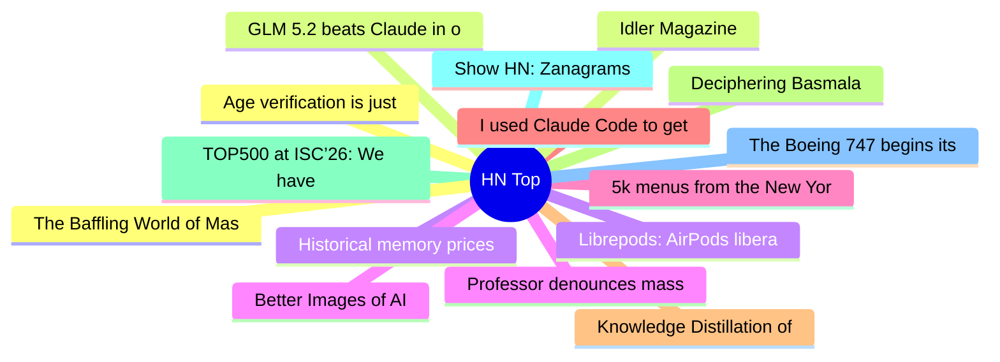

# HackerNews 每日 Top 30 (2026-06-29)

## 思维导图

## 列表（30 条）

### 1. Age verification is just a precursor to automated attribution of speech
- **链接**: [https://nonogra.ph/age-verification-is-just-a-precursor-to-attribution-of-speech-06-29-2026](https://nonogra.ph/age-verification-is-just-a-precursor-to-attribution-of-speech-06-29-2026)
- **分数**: 104 | **评论**: 19 | **作者**: arkhiver
- **HN 讨论**: https://news.ycombinator.com/item?id=48714529

### 2. GLM 5.2 beats Claude in our benchmarks
- **链接**: [https://semgrep.dev/blog/2026/we-have-mythos-at-home-glm-52-beats-claude-in-our-cyber-benchmarks/](https://semgrep.dev/blog/2026/we-have-mythos-at-home-glm-52-beats-claude-in-our-cyber-benchmarks/)
- **分数**: 590 | **评论**: 283 | **作者**: jms703
- **HN 讨论**: https://news.ycombinator.com/item?id=48709670

### 3. Historical memory prices 1960-2026
- **链接**: [https://dam.stanford.edu/memory-prices.html](https://dam.stanford.edu/memory-prices.html)
- **分数**: 226 | **评论**: 85 | **作者**: vga1
- **HN 讨论**: https://news.ycombinator.com/item?id=48710092

### 4. Better Images of AI
- **链接**: [https://betterimagesofai.org/](https://betterimagesofai.org/)
- **分数**: 41 | **评论**: 21 | **作者**: Curiositry
- **HN 讨论**: https://news.ycombinator.com/item?id=48713051

### 5. 5k menus from the New York Public Library’s Buttolph Collection (1880-1920)
- **链接**: [https://pudding.cool/2026/06/menu-story/](https://pudding.cool/2026/06/menu-story/)
- **分数**: 342 | **评论**: 87 | **作者**: xbryanx
- **HN 讨论**: https://news.ycombinator.com/item?id=48707763

### 6. I used Claude Code to get a second opinion on my MRI
- **链接**: [https://antoine.fi/mri-analysis-using-claude-code-opus](https://antoine.fi/mri-analysis-using-claude-code-opus)
- **分数**: 379 | **评论**: 494 | **作者**: engmarketer
- **HN 讨论**: https://news.ycombinator.com/item?id=48708941

### 7. Knowledge Distillation of Black-Box Large Language Models (2024)
- **链接**: [https://arxiv.org/abs/2401.07013](https://arxiv.org/abs/2401.07013)
- **分数**: 65 | **评论**: 13 | **作者**: babelfish
- **HN 讨论**: https://news.ycombinator.com/item?id=48712420

### 8. Deciphering Basmala
- **链接**: [https://blog.plover.com/lang/bismillah.html](https://blog.plover.com/lang/bismillah.html)
- **分数**: 23 | **评论**: 9 | **作者**: lordgrenville
- **HN 讨论**: https://news.ycombinator.com/item?id=48657131

### 9. TOP500 at ISC’26: We have a New Number 1 Supercomputer
- **链接**: [https://chipsandcheese.com/p/top500-at-isc26-we-have-a-new-number](https://chipsandcheese.com/p/top500-at-isc26-we-have-a-new-number)
- **分数**: 90 | **评论**: 47 | **作者**: rbanffy
- **HN 讨论**: https://news.ycombinator.com/item?id=48710775

### 10. Show HN: Zanagrams
- **链接**: [https://zanagrams.com/](https://zanagrams.com/)
- **分数**: 220 | **评论**: 55 | **作者**: pompomsheep
- **HN 讨论**: https://news.ycombinator.com/item?id=48708182

### 11. The Boeing 747 begins its final descent
- **链接**: [https://www.theatlantic.com/magazine/2026/07/boeing-747-retirement/687304/](https://www.theatlantic.com/magazine/2026/07/boeing-747-retirement/687304/)
- **分数**: 160 | **评论**: 216 | **作者**: dbl000
- **HN 讨论**: https://news.ycombinator.com/item?id=48675295

### 12. The Baffling World of Masayoshi Son's Presentations (2020)
- **链接**: [https://www.bloomberg.com/news/features/2020-06-23/golden-geese-and-unicorns-inside-the-eccentric-presentations-of-masayoshi-son](https://www.bloomberg.com/news/features/2020-06-23/golden-geese-and-unicorns-inside-the-eccentric-presentations-of-masayoshi-son)
- **分数**: 32 | **评论**: 7 | **作者**: phaser
- **HN 讨论**: https://news.ycombinator.com/item?id=48684315

### 13. Idler Magazine
- **链接**: [https://www.idler.co.uk/](https://www.idler.co.uk/)
- **分数**: 9 | **评论**: 1 | **作者**: tomjakubowski
- **HN 讨论**: https://news.ycombinator.com/item?id=48678393

### 14. Librepods: AirPods liberated
- **链接**: [https://github.com/librepods-org/librepods](https://github.com/librepods-org/librepods)
- **分数**: 318 | **评论**: 101 | **作者**: rbanffy
- **HN 讨论**: https://news.ycombinator.com/item?id=48710232

### 15. Professor denounces mass AI fraud on an exam at Brown
- **链接**: [https://english.elpais.com/education/2026-06-28/ai-fraud-at-brown-university-academic-integrity-is-at-risk.html](https://english.elpais.com/education/2026-06-28/ai-fraud-at-brown-university-academic-integrity-is-at-risk.html)
- **分数**: 325 | **评论**: 433 | **作者**: geox
- **HN 讨论**: https://news.ycombinator.com/item?id=48708991

### 16. Daisugi, the Japanese technique of growing trees out of other trees (2020)
- **链接**: [https://www.openculture.com/2020/10/daisugi.html](https://www.openculture.com/2020/10/daisugi.html)
- **分数**: 124 | **评论**: 39 | **作者**: MaysonL
- **HN 讨论**: https://news.ycombinator.com/item?id=48708859

### 17. Working around dragons with the Lemote Yeeloong laptop and OpenBSD
- **链接**: [http://oldvcr.blogspot.com/2026/06/working-around-dragons-with-lemote.html](http://oldvcr.blogspot.com/2026/06/working-around-dragons-with-lemote.html)
- **分数**: 96 | **评论**: 25 | **作者**: zdw
- **HN 讨论**: https://news.ycombinator.com/item?id=48709187

### 18. Show HN: DRM-Free Books
- **链接**: [https://frequal.com/Perspectives/DrmFreeAuthors.html](https://frequal.com/Perspectives/DrmFreeAuthors.html)
- **分数**: 85 | **评论**: 35 | **作者**: TeaVMFan
- **HN 讨论**: https://news.ycombinator.com/item?id=48709186

### 19. Researchers have developed pixels that can emit and analyse light together
- **链接**: [https://ethz.ch/en/news-and-events/eth-news/news/2026/06/a-new-type-of-pixel.html](https://ethz.ch/en/news-and-events/eth-news/news/2026/06/a-new-type-of-pixel.html)
- **分数**: 52 | **评论**: 36 | **作者**: tspng
- **HN 讨论**: https://news.ycombinator.com/item?id=48696127

### 20. Tokenmaxxing is dead, long live tokenmaxxing
- **链接**: [https://12gramsofcarbon.com/p/agentics-tech-things-tokenmaxxing](https://12gramsofcarbon.com/p/agentics-tech-things-tokenmaxxing)
- **分数**: 123 | **评论**: 147 | **作者**: theahura
- **HN 讨论**: https://news.ycombinator.com/item?id=48708795

### 21. The KIDS Act would require age checks to get online
- **链接**: [https://www.eff.org/deeplinks/2026/06/kids-act-would-require-age-checks-get-online](https://www.eff.org/deeplinks/2026/06/kids-act-would-require-age-checks-get-online)
- **分数**: 371 | **评论**: 297 | **作者**: bilsbie
- **HN 讨论**: https://news.ycombinator.com/item?id=48706560

### 22. A way to exclude sensitive files issue still open for OpenAI Codex
- **链接**: [https://github.com/openai/codex/issues/2847](https://github.com/openai/codex/issues/2847)
- **分数**: 184 | **评论**: 121 | **作者**: pikseladam
- **HN 讨论**: https://news.ycombinator.com/item?id=48706714

### 23. Model Training as Code
- **链接**: [https://aleph-alpha.com/en/blog/model-training-as-code/](https://aleph-alpha.com/en/blog/model-training-as-code/)
- **分数**: 29 | **评论**: 10 | **作者**: peterBlue75
- **HN 讨论**: https://news.ycombinator.com/item?id=48673450

### 24. Examining circuit boards from the Space Shuttle's I/O Processor
- **链接**: [https://www.righto.com/2026/06/space-shuttle-io-processor-boards.html](https://www.righto.com/2026/06/space-shuttle-io-processor-boards.html)
- **分数**: 93 | **评论**: 20 | **作者**: pwg
- **HN 讨论**: https://news.ycombinator.com/item?id=48708700

### 25. The curious case of the disappearing Polish S (2015)
- **链接**: [https://aresluna.org/the-curious-case-of-the-disappearing-polish-s/](https://aresluna.org/the-curious-case-of-the-disappearing-polish-s/)
- **分数**: 215 | **评论**: 72 | **作者**: colinprince
- **HN 讨论**: https://news.ycombinator.com/item?id=48706814

### 26. You might not need a service worker
- **链接**: [https://www.jayfreestone.com/writing/you-might-not-need-a-service-worker/](https://www.jayfreestone.com/writing/you-might-not-need-a-service-worker/)
- **分数**: 6 | **评论**: 0 | **作者**: Fudgel
- **HN 讨论**: https://news.ycombinator.com/item?id=48713453

### 27. Show HN: NanoEuler – GPT-2 scale model in pure C/CUDA from scratch
- **链接**: [https://github.com/JustVugg/nanoeuler](https://github.com/JustVugg/nanoeuler)
- **分数**: 42 | **评论**: 10 | **作者**: vforno
- **HN 讨论**: https://news.ycombinator.com/item?id=48710778

### 28. Show HN: Bash4LLM+ – A lightweight, dependency-free Bash wrapper for LLM APIs
- **链接**: [https://github.com/kamaludu/bash4llm/](https://github.com/kamaludu/bash4llm/)
- **分数**: 40 | **评论**: 15 | **作者**: kamaludu
- **HN 讨论**: https://news.ycombinator.com/item?id=48710827

### 29. The MUMPS 76 Primer – anniversary edition
- **链接**: [https://github.com/rochus-keller/MUMPS/blob/main/docs/MUMPS_Primer.adoc](https://github.com/rochus-keller/MUMPS/blob/main/docs/MUMPS_Primer.adoc)
- **分数**: 75 | **评论**: 42 | **作者**: Rochus
- **HN 讨论**: https://news.ycombinator.com/item?id=48706796

### 30. AI boom risks global financial crash, warn central bankers
- **链接**: [https://www.telegraph.co.uk/business/2026/06/28/ai-boom-risks-global-financial-crash-central-bankers-warn/](https://www.telegraph.co.uk/business/2026/06/28/ai-boom-risks-global-financial-crash-central-bankers-warn/)
- **分数**: 97 | **评论**: 106 | **作者**: b-man
- **HN 讨论**: https://news.ycombinator.com/item?id=48713697
