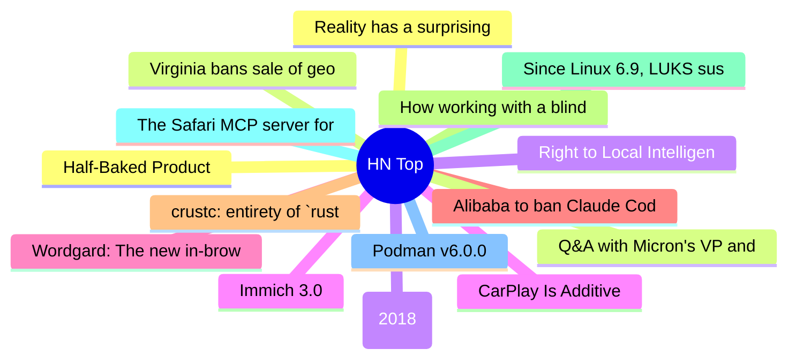

# HackerNews 每日 Top 30 (2026-07-03)

## 思维导图

## 列表（30 条）

### 1. Half-Baked Product
- **链接**: [https://weli.dev/blog/half-baked-product/](https://weli.dev/blog/half-baked-product/)
- **分数**: 139 | **评论**: 33 | **作者**: weli
- **HN 讨论**: https://news.ycombinator.com/item?id=48772388

### 2. Virginia bans sale of geolocation data
- **链接**: [https://www.hunton.com/privacy-and-cybersecurity-law-blog/virginia-bans-sale-of-geolocation-data](https://www.hunton.com/privacy-and-cybersecurity-law-blog/virginia-bans-sale-of-geolocation-data)
- **分数**: 815 | **评论**: 127 | **作者**: toomuchtodo
- **HN 讨论**: https://news.ycombinator.com/item?id=48767347

### 3. Right to Local Intelligence
- **链接**: [https://righttointelligence.org/](https://righttointelligence.org/)
- **分数**: 282 | **评论**: 93 | **作者**: thoughtpeddler
- **HN 讨论**: https://news.ycombinator.com/item?id=48768951

### 4. CarPlay Is Additive
- **链接**: [https://www.caseyliss.com/2026/7/2/carplay-is-additive-you-dolts](https://www.caseyliss.com/2026/7/2/carplay-is-additive-you-dolts)
- **分数**: 324 | **评论**: 424 | **作者**: sprawl_
- **HN 讨论**: https://news.ycombinator.com/item?id=48769397

### 5. Wordgard: The new in-browser rich-text editor from the creator of ProseMirror
- **链接**: [https://wordgard.net/](https://wordgard.net/)
- **分数**: 20 | **评论**: 1 | **作者**: indy
- **HN 讨论**: https://news.ycombinator.com/item?id=48772573

### 6. Alibaba to ban Claude Code in workplace over alleged backdoor risks, source says
- **链接**: [https://www.reuters.com/world/china/alibaba-ban-claude-code-workplace-over-alleged-backdoor-risks-source-says-2026-07-03/](https://www.reuters.com/world/china/alibaba-ban-claude-code-workplace-over-alleged-backdoor-risks-source-says-2026-07-03/)
- **分数**: 92 | **评论**: 51 | **作者**: nsoonhui
- **HN 讨论**: https://news.ycombinator.com/item?id=48772443

### 7. crustc: entirety of `rustc`, translated to C
- **链接**: [https://github.com/FractalFir/crustc](https://github.com/FractalFir/crustc)
- **分数**: 291 | **评论**: 56 | **作者**: Philpax
- **HN 讨论**: https://news.ycombinator.com/item?id=48768464

### 8. How working with a blind client revealed invisible accessibility gaps
- **链接**: [https://iinteractive.com/resources/blog/read-only](https://iinteractive.com/resources/blog/read-only)
- **分数**: 24 | **评论**: 5 | **作者**: fortyseven
- **HN 讨论**: https://news.ycombinator.com/item?id=48725857

### 9. Since Linux 6.9, LUKS suspend stopped wiping disk-encryption keys from memory
- **链接**: [https://mathstodon.xyz/@iblech/116769502749142438](https://mathstodon.xyz/@iblech/116769502749142438)
- **分数**: 482 | **评论**: 206 | **作者**: IngoBlechschmid
- **HN 讨论**: https://news.ycombinator.com/item?id=48763035

### 10. The Safari MCP server for web developers
- **链接**: [https://webkit.org/blog/18136/introducing-the-safari-mcp-server-for-web-developers/](https://webkit.org/blog/18136/introducing-the-safari-mcp-server-for-web-developers/)
- **分数**: 107 | **评论**: 23 | **作者**: coloneltcb
- **HN 讨论**: https://news.ycombinator.com/item?id=48769639

### 11. Podman v6.0.0
- **链接**: [https://blog.podman.io/2026/07/introducing-podman-v6-0-0/](https://blog.podman.io/2026/07/introducing-podman-v6-0-0/)
- **分数**: 545 | **评论**: 211 | **作者**: soheilpro
- **HN 讨论**: https://news.ycombinator.com/item?id=48762098

### 12. Reality has a surprising amount of detail (2017)
- **链接**: [https://johnsalvatier.org/blog/2017/reality-has-a-surprising-amount-of-detail](https://johnsalvatier.org/blog/2017/reality-has-a-surprising-amount-of-detail)
- **分数**: 280 | **评论**: 106 | **作者**: vinhnx
- **HN 讨论**: https://news.ycombinator.com/item?id=48702874

### 13. Q&A with Micron's VP and GM of Memory
- **链接**: [https://morethanmoore.substack.com/p/q-and-a-with-microns-vp-and-gm-of](https://morethanmoore.substack.com/p/q-and-a-with-microns-vp-and-gm-of)
- **分数**: 6 | **评论**: 2 | **作者**: zdw
- **HN 讨论**: https://news.ycombinator.com/item?id=48738244

### 14. Exapunks (2018)
- **链接**: [https://www.zachtronics.com/exapunks/](https://www.zachtronics.com/exapunks/)
- **分数**: 298 | **评论**: 101 | **作者**: yu3zhou4
- **HN 讨论**: https://news.ycombinator.com/item?id=48765663

### 15. Immich 3.0
- **链接**: [https://github.com/immich-app/immich/discussions/29439](https://github.com/immich-app/immich/discussions/29439)
- **分数**: 439 | **评论**: 220 | **作者**: hashier
- **HN 讨论**: https://news.ycombinator.com/item?id=48761944

### 16. Quake in 13 Kilobytes (2021)
- **链接**: [https://js13kgames.com/games/q1k3](https://js13kgames.com/games/q1k3)
- **分数**: 43 | **评论**: 5 | **作者**: mortenjorck
- **HN 讨论**: https://news.ycombinator.com/item?id=48693428

### 17. 14× faster embeddings: how we rebuilt the ONNX path in Manticore
- **链接**: [https://manticoresearch.com/blog/onnx-embeddings-speedup/](https://manticoresearch.com/blog/onnx-embeddings-speedup/)
- **分数**: 52 | **评论**: 9 | **作者**: snikolaev
- **HN 讨论**: https://news.ycombinator.com/item?id=48770477

### 18. Underwater Suit-Wearing Cyborg Insect Capable of Diving and Terra-Aqua Travel
- **链接**: [https://www.nature.com/articles/s41467-026-74235-1](https://www.nature.com/articles/s41467-026-74235-1)
- **分数**: 45 | **评论**: 18 | **作者**: gscott
- **HN 讨论**: https://news.ycombinator.com/item?id=48725093

### 19. An American Privacy Emergency
- **链接**: [https://scottaaronson.blog/?p=9902](https://scottaaronson.blog/?p=9902)
- **分数**: 316 | **评论**: 96 | **作者**: flowercalled
- **HN 讨论**: https://news.ycombinator.com/item?id=48768992

### 20. The short leash AI coding method for beating Fable
- **链接**: [https://blog.okturtles.org/2026/07/short-leash-ai-method/](https://blog.okturtles.org/2026/07/short-leash-ai-method/)
- **分数**: 140 | **评论**: 172 | **作者**: Riseed
- **HN 讨论**: https://news.ycombinator.com/item?id=48766026

### 21. Superpowers 6
- **链接**: [https://blog.fsck.com/2026/06/15/Superpowers-6/](https://blog.fsck.com/2026/06/15/Superpowers-6/)
- **分数**: 158 | **评论**: 61 | **作者**: seahorseemoji
- **HN 讨论**: https://news.ycombinator.com/item?id=48739459

### 22. Postgres transactions are a distributed systems superpower
- **链接**: [https://www.dbos.dev/blog/co-locating-workflow-state-with-your-data](https://www.dbos.dev/blog/co-locating-workflow-state-with-your-data)
- **分数**: 183 | **评论**: 80 | **作者**: KraftyOne
- **HN 讨论**: https://news.ycombinator.com/item?id=48765639

### 23. FoundationDB's Flow – Bringing Actor-Based Concurrency to C++11
- **链接**: [https://apple.github.io/foundationdb/flow.html](https://apple.github.io/foundationdb/flow.html)
- **分数**: 73 | **评论**: 13 | **作者**: sourdecor
- **HN 讨论**: https://news.ycombinator.com/item?id=48762372

### 24. Claude-real-video － any LLM can watch a video
- **链接**: [https://github.com/HUANGCHIHHUNGLeo/claude-real-video](https://github.com/HUANGCHIHHUNGLeo/claude-real-video)
- **分数**: 139 | **评论**: 43 | **作者**: cortexosmain
- **HN 讨论**: https://news.ycombinator.com/item?id=48766005

### 25. A Special Wireless-Free Nikon Camera Is Publicly Available for the First Time
- **链接**: [https://petapixel.com/2026/06/24/a-special-wireless-free-nikon-camera-is-publicly-available-for-the-first-time/](https://petapixel.com/2026/06/24/a-special-wireless-free-nikon-camera-is-publicly-available-for-the-first-time/)
- **分数**: 64 | **评论**: 52 | **作者**: HardwareLust
- **HN 讨论**: https://news.ycombinator.com/item?id=48667568

### 26. Great Salt Lake Tracker – Grow the Flow
- **链接**: [https://growtheflowutah.org/laketracker/](https://growtheflowutah.org/laketracker/)
- **分数**: 106 | **评论**: 37 | **作者**: cfowles
- **HN 讨论**: https://news.ycombinator.com/item?id=48766286

### 27. This is my attempt to get Vulkan going on NetBSD
- **链接**: [https://github.com/segaboy/vulkan-netbsd](https://github.com/segaboy/vulkan-netbsd)
- **分数**: 111 | **评论**: 30 | **作者**: segaboy81
- **HN 讨论**: https://news.ycombinator.com/item?id=48765607

### 28. EFF letter to FTC on X consent order [pdf]
- **链接**: [https://www.eff.org/deeplinks/2026/06/eff-and-allies-xs-ftc-petition-waive-privacy-violation-order-should-be-rejected](https://www.eff.org/deeplinks/2026/06/eff-and-allies-xs-ftc-petition-waive-privacy-violation-order-should-be-rejected)
- **分数**: 141 | **评论**: 60 | **作者**: Terretta
- **HN 讨论**: https://news.ycombinator.com/item?id=48766209

### 29. Mystery identity of 'Green Boots' climber is finally solved after DNA test
- **链接**: [https://www.dailymail.com/news/article-15943905/Mystery-identity-Green-Boots-climber-macabre-landmark-frozen-ice-dying-Everest-finally-solved-DNA-test.html](https://www.dailymail.com/news/article-15943905/Mystery-identity-Green-Boots-climber-macabre-landmark-frozen-ice-dying-Everest-finally-solved-DNA-test.html)
- **分数**: 111 | **评论**: 76 | **作者**: FireBeyond
- **HN 讨论**: https://news.ycombinator.com/item?id=48768336

### 30. Android Developer Verification: Threat masquerading as protection
- **链接**: [https://f-droid.org/2026/07/01/adv-malware.html](https://f-droid.org/2026/07/01/adv-malware.html)
- **分数**: 1628 | **评论**: 698 | **作者**: drewfax
- **HN 讨论**: https://news.ycombinator.com/item?id=48755965
