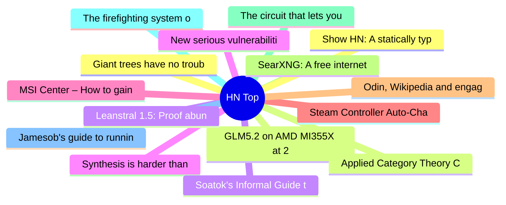

# HackerNews 每日 Top 30 (2026-07-04)

## 思维导图

## 列表（30 条）

### 1. Giant trees have no trouble pumping water to top branches: new research
- **链接**: [https://news.exeter.ac.uk/faculty-of-environment-science-and-economy/giant-trees-have-no-trouble-pumping-water-to-top-branches/](https://news.exeter.ac.uk/faculty-of-environment-science-and-economy/giant-trees-have-no-trouble-pumping-water-to-top-branches/)
- **分数**: 139 | **评论**: 68 | **作者**: hhs
- **HN 讨论**: https://news.ycombinator.com/item?id=48780870

### 2. GLM5.2 on AMD MI355X at 2626 tok/s/node at over 2x lower cost than Blackwell
- **链接**: [https://www.wafer.ai/blog/glm52-amd](https://www.wafer.ai/blog/glm52-amd)
- **分数**: 148 | **评论**: 44 | **作者**: latchkey
- **HN 讨论**: https://news.ycombinator.com/item?id=48780417

### 3. Leanstral 1.5: Proof abundance for all
- **链接**: [https://mistral.ai/news/leanstral-1-5/](https://mistral.ai/news/leanstral-1-5/)
- **分数**: 130 | **评论**: 35 | **作者**: programLyrique
- **HN 讨论**: https://news.ycombinator.com/item?id=48780801

### 4. Synthesis is harder than analysis
- **链接**: [https://surfingcomplexity.blog/2026/07/03/synthesis-is-harder-than-analysis/](https://surfingcomplexity.blog/2026/07/03/synthesis-is-harder-than-analysis/)
- **分数**: 16 | **评论**: 5 | **作者**: azhenley
- **HN 讨论**: https://news.ycombinator.com/item?id=48782219

### 5. MSI Center – How to gain SYSTEM privileges in seconds
- **链接**: [https://mrbruh.com/msicenter/](https://mrbruh.com/msicenter/)
- **分数**: 46 | **评论**: 11 | **作者**: MrBruh
- **HN 讨论**: https://news.ycombinator.com/item?id=48781688

### 6. Steam Controller Auto-Charge – pilot to magnetic charging puck using CV
- **链接**: [https://github.com/FossPrime/Steam-Controller-Auto-Charge](https://github.com/FossPrime/Steam-Controller-Auto-Charge)
- **分数**: 98 | **评论**: 19 | **作者**: zdw
- **HN 讨论**: https://news.ycombinator.com/item?id=48780865

### 7. Odin, Wikipedia and engagement farming
- **链接**: [https://katamari64.se/posts/2026/odin-wikipedia/](https://katamari64.se/posts/2026/odin-wikipedia/)
- **分数**: 73 | **评论**: 81 | **作者**: stock_toaster
- **HN 讨论**: https://news.ycombinator.com/item?id=48781196

### 8. SearXNG: A free internet metasearch engine
- **链接**: [https://github.com/searxng/searxng](https://github.com/searxng/searxng)
- **分数**: 168 | **评论**: 47 | **作者**: theanonymousone
- **HN 讨论**: https://news.ycombinator.com/item?id=48779454

### 9. The circuit that lets your brain think and see
- **链接**: [https://www.engineering.columbia.edu/about/news/circuit-lets-your-brain-think-and-see](https://www.engineering.columbia.edu/about/news/circuit-lets-your-brain-think-and-see)
- **分数**: 62 | **评论**: 11 | **作者**: hhs
- **HN 讨论**: https://news.ycombinator.com/item?id=48780996

### 10. The firefighting system of the Van der Heyden brothers in 17th century Amsterdam
- **链接**: [https://worksinprogress.co/issue/how-amsterdam-invented-the-fire-department/](https://worksinprogress.co/issue/how-amsterdam-invented-the-fire-department/)
- **分数**: 56 | **评论**: 12 | **作者**: zdw
- **HN 讨论**: https://news.ycombinator.com/item?id=48780913

### 11. Jamesob's guide to running SOTA LLMs locally
- **链接**: [https://github.com/jamesob/local-llm](https://github.com/jamesob/local-llm)
- **分数**: 302 | **评论**: 138 | **作者**: livestyle
- **HN 讨论**: https://news.ycombinator.com/item?id=48775921

### 12. Show HN: A statically typed, cross-platform, easily bootstrappable build system
- **链接**: [https://github.com/rochus-keller/BUSY/](https://github.com/rochus-keller/BUSY/)
- **分数**: 20 | **评论**: 7 | **作者**: Rochus
- **HN 讨论**: https://news.ycombinator.com/item?id=48735097

### 13. Applied Category Theory Course (2018)
- **链接**: [https://math.ucr.edu/home/baez/act_course/index.html](https://math.ucr.edu/home/baez/act_course/index.html)
- **分数**: 74 | **评论**: 7 | **作者**: measurablefunc
- **HN 讨论**: https://news.ycombinator.com/item?id=48779723

### 14. Soatok's Informal Guide to Threat Models
- **链接**: [https://soatok.blog/2026/06/30/soatoks-informal-guide-to-threat-models/](https://soatok.blog/2026/06/30/soatoks-informal-guide-to-threat-models/)
- **分数**: 46 | **评论**: 4 | **作者**: zdw
- **HN 讨论**: https://news.ycombinator.com/item?id=48781597

### 15. New serious vulnerabilities spiked around release of Claude Mythos Preview
- **链接**: [https://epoch.ai/data-insights/cve-severity-spike](https://epoch.ai/data-insights/cve-severity-spike)
- **分数**: 68 | **评论**: 15 | **作者**: cubefox
- **HN 讨论**: https://news.ycombinator.com/item?id=48780056

### 16. Espionage Against the European Parliament
- **链接**: [https://citizenlab.ca/research/member-of-committee-investigating-spyware-hacked-with-pegasus/](https://citizenlab.ca/research/member-of-committee-investigating-spyware-hacked-with-pegasus/)
- **分数**: 302 | **评论**: 71 | **作者**: ledoge
- **HN 讨论**: https://news.ycombinator.com/item?id=48779683

### 17. Costco is the anti-Amazon
- **链接**: [https://phenomenalworld.org/analysis/the-anti-amazon/](https://phenomenalworld.org/analysis/the-anti-amazon/)
- **分数**: 345 | **评论**: 326 | **作者**: bookofjoe
- **HN 讨论**: https://news.ycombinator.com/item?id=48776044

### 18. Gone but Not Forgotten: Recovering the Dead Web
- **链接**: [https://blog.archive.org/2026/04/23/gone-but-not-forgotten-recovering-the-dead-web/](https://blog.archive.org/2026/04/23/gone-but-not-forgotten-recovering-the-dead-web/)
- **分数**: 36 | **评论**: 4 | **作者**: wslh
- **HN 讨论**: https://news.ycombinator.com/item?id=48739682

### 19. Factories are just rooms
- **链接**: [https://interconnected.org/home/2026/07/03/factories](https://interconnected.org/home/2026/07/03/factories)
- **分数**: 210 | **评论**: 81 | **作者**: arbesman
- **HN 讨论**: https://news.ycombinator.com/item?id=48776035

### 20. International chess federation sanctions Kramnik
- **链接**: [https://www.fide.com/fide-ethics-disciplinary-commission-issues-a-decision-in-case-involving-gm-vladimir-kramnik/](https://www.fide.com/fide-ethics-disciplinary-commission-issues-a-decision-in-case-involving-gm-vladimir-kramnik/)
- **分数**: 139 | **评论**: 76 | **作者**: DarkContinent
- **HN 讨论**: https://news.ycombinator.com/item?id=48777266

### 21. Infracost (YC W21) Is Hiring a Marketing Lead to Shift FinOps Left
- **链接**: [https://www.ycombinator.com/companies/infracost/jobs/YTJcFwr-marketing-lead](https://www.ycombinator.com/companies/infracost/jobs/YTJcFwr-marketing-lead)
- **分数**: 1 | **评论**: 0 | **作者**: akh
- **HN 讨论**: https://news.ycombinator.com/item?id=48779906

### 22. Reverse-engineering Codemasters' BIGF archive format in Ruby
- **链接**: [https://davidslv.uk/2026/06/30/reading-binary-in-ruby.html](https://davidslv.uk/2026/06/30/reading-binary-in-ruby.html)
- **分数**: 3 | **评论**: 2 | **作者**: davidslv
- **HN 讨论**: https://news.ycombinator.com/item?id=48735811

### 23. Software, from First Principles
- **链接**: [https://fazamhd.com/mental-models/software/](https://fazamhd.com/mental-models/software/)
- **分数**: 66 | **评论**: 13 | **作者**: faza
- **HN 讨论**: https://news.ycombinator.com/item?id=48780224

### 24. FreeBSD ate my RAM
- **链接**: [https://crocidb.com/post/freebsd-ate-my-ram/](https://crocidb.com/post/freebsd-ate-my-ram/)
- **分数**: 100 | **评论**: 41 | **作者**: theanonymousone
- **HN 讨论**: https://news.ycombinator.com/item?id=48778757

### 25. Hunting a 16-year-old SQLite WAL bug with TLA+
- **链接**: [https://ubuntu.com/blog/hunting-a-16-year-old-sqlite-bug-with-tla-is-dqlite-affected](https://ubuntu.com/blog/hunting-a-16-year-old-sqlite-bug-with-tla-is-dqlite-affected)
- **分数**: 184 | **评论**: 19 | **作者**: peterparker204
- **HN 讨论**: https://news.ycombinator.com/item?id=48730953

### 26. Dispersion loss counteracts embedding condensation in small language models
- **链接**: [https://chenliu-1996.github.io/projects/LM-Dispersion/](https://chenliu-1996.github.io/projects/LM-Dispersion/)
- **分数**: 26 | **评论**: 6 | **作者**: E-Reverance
- **HN 讨论**: https://news.ycombinator.com/item?id=48780826

### 27. GitFut – Your GitHub stats turned into a World-Cup-style player card
- **链接**: [https://gitfut.com](https://gitfut.com)
- **分数**: 34 | **评论**: 21 | **作者**: redbell
- **HN 讨论**: https://news.ycombinator.com/item?id=48780812

### 28. Wordgard: In-browser rich-text editor from the creator of ProseMirror
- **链接**: [https://wordgard.net/](https://wordgard.net/)
- **分数**: 277 | **评论**: 93 | **作者**: indy
- **HN 讨论**: https://news.ycombinator.com/item?id=48772573

### 29. Africans Are Turning to Starlink
- **链接**: [https://www.economist.com/middle-east-and-africa/2026/07/02/africans-are-turning-to-starlink](https://www.economist.com/middle-east-and-africa/2026/07/02/africans-are-turning-to-starlink)
- **分数**: 132 | **评论**: 146 | **作者**: bookofjoe
- **HN 讨论**: https://news.ycombinator.com/item?id=48779977

### 30. Scientists discover guidance system for migratory songbirds
- **链接**: [https://news.exeter.ac.uk/faculty-of-environment-science-and-economy/scientists-discover-guidance-system-for-migratory-songbirds/](https://news.exeter.ac.uk/faculty-of-environment-science-and-economy/scientists-discover-guidance-system-for-migratory-songbirds/)
- **分数**: 18 | **评论**: 5 | **作者**: bit_economist
- **HN 讨论**: https://news.ycombinator.com/item?id=48781274
