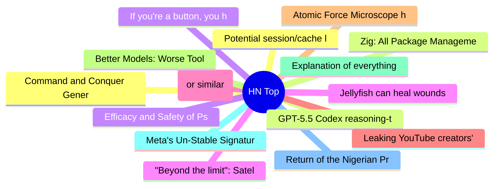

# HackerNews 每日 Top 30 (2026-07-05)

## 思维导图

## 列表（30 条）

### 1. Command and Conquer Generals natively ported to macOS, iPhone, iPad using Fable
- **链接**: [https://github.com/ammaarreshi/Generals-Mac-iOS-iPad/tree/main](https://github.com/ammaarreshi/Generals-Mac-iOS-iPad/tree/main)
- **分数**: 418 | **评论**: 161 | **作者**: asronline
- **HN 讨论**: https://news.ycombinator.com/item?id=48788283

### 2. GPT-5.5 Codex reasoning-token clustering may be leading to degraded performance
- **链接**: [https://github.com/openai/codex/issues/30364](https://github.com/openai/codex/issues/30364)
- **分数**: 191 | **评论**: 61 | **作者**: maille
- **HN 讨论**: https://news.ycombinator.com/item?id=48789428

### 3. If you're a button, you have one job
- **链接**: [https://unsung.aresluna.org/if-youre-a-button-you-have-one-job/](https://unsung.aresluna.org/if-youre-a-button-you-have-one-job/)
- **分数**: 32 | **评论**: 8 | **作者**: nozzlegear
- **HN 讨论**: https://news.ycombinator.com/item?id=48790689

### 4. Jellyfish can heal wounds in minutes. Scientists want their secrets
- **链接**: [https://www.mbl.edu/news/jellyfish-can-heal-wounds-minutes-scientists-want-their-secrets](https://www.mbl.edu/news/jellyfish-can-heal-wounds-minutes-scientists-want-their-secrets)
- **分数**: 69 | **评论**: 16 | **作者**: hhs
- **HN 讨论**: https://news.ycombinator.com/item?id=48789712

### 5. Google Books (or similar) all book scans – $200k bounty (2025)
- **链接**: [https://software.annas-archive.gl/AnnaArchivist/annas-archive/-/work_items/234](https://software.annas-archive.gl/AnnaArchivist/annas-archive/-/work_items/234)
- **分数**: 378 | **评论**: 202 | **作者**: Cider9986
- **HN 讨论**: https://news.ycombinator.com/item?id=48786838

### 6. Leaking YouTube creators' private videos
- **链接**: [https://javoriuski.com/post/youtube](https://javoriuski.com/post/youtube)
- **分数**: 531 | **评论**: 301 | **作者**: javxfps
- **HN 讨论**: https://news.ycombinator.com/item?id=48786781

### 7. Atomic Force Microscope high-speed video, stainless etching, bacteria, and more
- **链接**: [https://www.youtube.com/watch?v=DyIQkqBXhS0](https://www.youtube.com/watch?v=DyIQkqBXhS0)
- **分数**: 25 | **评论**: 1 | **作者**: mhb
- **HN 讨论**: https://news.ycombinator.com/item?id=48765920

### 8. Better Models: Worse Tools
- **链接**: [https://lucumr.pocoo.org/2026/7/4/better-models-worse-tools/](https://lucumr.pocoo.org/2026/7/4/better-models-worse-tools/)
- **分数**: 126 | **评论**: 38 | **作者**: leemoore
- **HN 讨论**: https://news.ycombinator.com/item?id=48788599

### 9. Explanation of everything you can see in htop/top on Linux (2019)
- **链接**: [https://peteris.rocks/blog/htop/](https://peteris.rocks/blog/htop/)
- **分数**: 433 | **评论**: 55 | **作者**: theanonymousone
- **HN 讨论**: https://news.ycombinator.com/item?id=48784777

### 10. Meta's Un-Stable Signature
- **链接**: [https://hackerfactor.com/blog/index.php?/archives/1098-Metas-Un-Stable-Signature.html](https://hackerfactor.com/blog/index.php?/archives/1098-Metas-Un-Stable-Signature.html)
- **分数**: 42 | **评论**: 2 | **作者**: ementally
- **HN 讨论**: https://news.ycombinator.com/item?id=48750405

### 11. Return of the Nigerian Prince Redux: Beware Book Club and Book Review Scams (2025)
- **链接**: [https://writerbeware.blog/2025/09/19/return-of-the-nigerian-prince-redux-beware-book-club-and-book-review-scams/](https://writerbeware.blog/2025/09/19/return-of-the-nigerian-prince-redux-beware-book-club-and-book-review-scams/)
- **分数**: 30 | **评论**: 6 | **作者**: Anon84
- **HN 讨论**: https://news.ycombinator.com/item?id=48790240

### 12. Potential session/cache leakage between workspace instances or consumer accounts
- **链接**: [https://github.com/anthropics/claude-code/issues/74066](https://github.com/anthropics/claude-code/issues/74066)
- **分数**: 281 | **评论**: 129 | **作者**: chatmasta
- **HN 讨论**: https://news.ycombinator.com/item?id=48785485

### 13. Zig: All Package Management Functionality Moved from Compiler to Build System
- **链接**: [https://ziglang.org/devlog/2026/#2026-06-30](https://ziglang.org/devlog/2026/#2026-06-30)
- **分数**: 161 | **评论**: 33 | **作者**: tosh
- **HN 讨论**: https://news.ycombinator.com/item?id=48786638

### 14. Efficacy and Safety of Psilocybin in Treatment-Resistant Major Depression
- **链接**: [https://jamanetwork.com/journals/jamapsychiatry/fullarticle/2846478](https://jamanetwork.com/journals/jamapsychiatry/fullarticle/2846478)
- **分数**: 14 | **评论**: 1 | **作者**: cpncrunch
- **HN 讨论**: https://news.ycombinator.com/item?id=48790583

### 15. "Beyond the limit": Satellites and mirrors in space pose threat to the night sky
- **链接**: [https://www.eso.org/public/news/eso2607/](https://www.eso.org/public/news/eso2607/)
- **分数**: 116 | **评论**: 204 | **作者**: Breadmaker
- **HN 讨论**: https://news.ycombinator.com/item?id=48787042

### 16. Drone Autonomy Crash Course
- **链接**: [https://www.cggonzalez.com/blog/index.html](https://www.cggonzalez.com/blog/index.html)
- **分数**: 22 | **评论**: 1 | **作者**: cgg1
- **HN 讨论**: https://news.ycombinator.com/item?id=48789965

### 17. University of Oxford Is Older Than the Aztec Empire and Other Facts of History (2013)
- **链接**: [https://www.smithsonianmag.com/smart-news/university-oxford-older-than-aztec-empire-other-facts-will-change-your-perspective-history-1529607/](https://www.smithsonianmag.com/smart-news/university-oxford-older-than-aztec-empire-other-facts-will-change-your-perspective-history-1529607/)
- **分数**: 31 | **评论**: 6 | **作者**: thunderbong
- **HN 讨论**: https://news.ycombinator.com/item?id=48790913

### 18. Record-breaking solo rower Kelsey Pfendler arrives in Hawaii
- **链接**: [https://www.hawaiinewsnow.com/2026/07/04/record-breaking-solo-rower-kelsey-pfendler-arrives-hawaii/](https://www.hawaiinewsnow.com/2026/07/04/record-breaking-solo-rower-kelsey-pfendler-arrives-hawaii/)
- **分数**: 8 | **评论**: 1 | **作者**: MaysonL
- **HN 讨论**: https://news.ycombinator.com/item?id=48790512

### 19. What ORMs have taught me: just learn SQL (2014)
- **链接**: [https://wozniak.ca/blog/2014/08/03/1/index.html](https://wozniak.ca/blog/2014/08/03/1/index.html)
- **分数**: 140 | **评论**: 182 | **作者**: ciconia
- **HN 讨论**: https://news.ycombinator.com/item?id=48742175

### 20. Drone Physics
- **链接**: [https://iahmed.me/post/drone-physics/](https://iahmed.me/post/drone-physics/)
- **分数**: 98 | **评论**: 27 | **作者**: wrxd
- **HN 讨论**: https://news.ycombinator.com/item?id=48738395

### 21. Mapping with In-Memory Layers to Reduce LLM Overload
- **链接**: [https://ridgetext.com/blog/mapbox-llm-composition](https://ridgetext.com/blog/mapbox-llm-composition)
- **分数**: 14 | **评论**: 0 | **作者**: Buckwheat469
- **HN 讨论**: https://news.ycombinator.com/item?id=48789986

### 22. As downtown Seattle offices empty, city facing years of 'zombie' towers
- **链接**: [https://www.seattletimes.com/business/local-business/as-downtown-seattle-offices-empty-city-facing-years-of-zombie-towers/](https://www.seattletimes.com/business/local-business/as-downtown-seattle-offices-empty-city-facing-years-of-zombie-towers/)
- **分数**: 85 | **评论**: 118 | **作者**: petethomas
- **HN 讨论**: https://news.ycombinator.com/item?id=48787725

### 23. The Vespa at 80
- **链接**: [https://www.cbc.ca/news/world/vespa-italy-postwar-design-9.7252641](https://www.cbc.ca/news/world/vespa-italy-postwar-design-9.7252641)
- **分数**: 154 | **评论**: 140 | **作者**: cf100clunk
- **HN 讨论**: https://news.ycombinator.com/item?id=48746327

### 24. Windows CE Dreamcast Community Edition (wince-dc)
- **链接**: [https://github.com/maximqaxd/wince-dc](https://github.com/maximqaxd/wince-dc)
- **分数**: 97 | **评论**: 22 | **作者**: msephton
- **HN 讨论**: https://news.ycombinator.com/item?id=48785840

### 25. Protocol Prying: Vulnerability Research in AirDrop and Quick Share
- **链接**: [https://arxiv.org/abs/2606.26967](https://arxiv.org/abs/2606.26967)
- **分数**: 20 | **评论**: 1 | **作者**: logickkk1
- **HN 讨论**: https://news.ycombinator.com/item?id=48788849

### 26. How to Enjoy John Ashbery
- **链接**: [https://joshuacorey.substack.com/p/how-to-enjoy-john-ashbery](https://joshuacorey.substack.com/p/how-to-enjoy-john-ashbery)
- **分数**: 3 | **评论**: 0 | **作者**: Caiero
- **HN 讨论**: https://news.ycombinator.com/item?id=48778901

### 27. Fable created novel 4D splat format
- **链接**: [https://adamraudonis.github.io/splats4D/](https://adamraudonis.github.io/splats4D/)
- **分数**: 133 | **评论**: 50 | **作者**: adamraudonis
- **HN 讨论**: https://news.ycombinator.com/item?id=48786245

### 28. Reflections on the Guillotine (1957)
- **链接**: [https://theanarchistlibrary.org/library/albert-camus-reflections-on-the-guillotine](https://theanarchistlibrary.org/library/albert-camus-reflections-on-the-guillotine)
- **分数**: 36 | **评论**: 11 | **作者**: halperter
- **HN 讨论**: https://news.ycombinator.com/item?id=48790036

### 29. Egg consumption inversely correlated with Alzheimer's
- **链接**: [https://pubmed.ncbi.nlm.nih.gov/42002260/](https://pubmed.ncbi.nlm.nih.gov/42002260/)
- **分数**: 54 | **评论**: 33 | **作者**: natbennett
- **HN 讨论**: https://news.ycombinator.com/item?id=48790349

### 30. It's not me, it's the compiler
- **链接**: [https://parsa.wtf/cast/](https://parsa.wtf/cast/)
- **分数**: 75 | **评论**: 12 | **作者**: SVI
- **HN 讨论**: https://news.ycombinator.com/item?id=48743462
