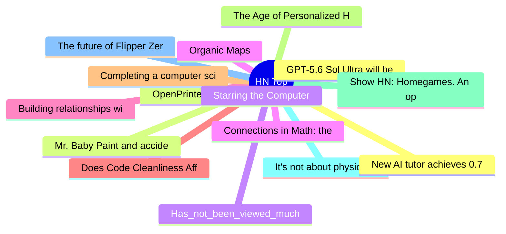

# HackerNews 每日 Top 30 (2026-07-06)

## 思维导图

## 列表（30 条）

### 1. GPT-5.6 Sol Ultra will be in Codex
- **链接**: [https://twitter.com/thsottiaux/status/2073933490513752151](https://twitter.com/thsottiaux/status/2073933490513752151)
- **分数**: 141 | **评论**: 75 | **作者**: mfiguiere
- **HN 讨论**: https://news.ycombinator.com/item?id=48799614

### 2. OpenPrinter
- **链接**: [https://www.opentools.studio/](https://www.opentools.studio/)
- **分数**: 551 | **评论**: 128 | **作者**: bouh
- **HN 讨论**: https://news.ycombinator.com/item?id=48797916

### 3. Has_not_been_viewed_much
- **链接**: [https://iamwillwang.com/notes/has-not-been-viewed-much/](https://iamwillwang.com/notes/has-not-been-viewed-much/)
- **分数**: 135 | **评论**: 38 | **作者**: wxw
- **HN 讨论**: https://news.ycombinator.com/item?id=48799155

### 4. Organic Maps
- **链接**: [https://organicmaps.app/](https://organicmaps.app/)
- **分数**: 854 | **评论**: 247 | **作者**: tosh
- **HN 讨论**: https://news.ycombinator.com/item?id=48794446

### 5. Building relationships with customers through support didn't turn out as hoped
- **链接**: [https://www.uncommonapps.nyc/p/castro-podcasts-things-i-got-wrong-support](https://www.uncommonapps.nyc/p/castro-podcasts-things-i-got-wrong-support)
- **分数**: 23 | **评论**: 11 | **作者**: dabluck
- **HN 讨论**: https://news.ycombinator.com/item?id=48799929

### 6. Does Code Cleanliness Affect Coding Agents?
- **链接**: [https://arxiv.org/abs/2605.20049](https://arxiv.org/abs/2605.20049)
- **分数**: 62 | **评论**: 25 | **作者**: softwaredoug
- **HN 讨论**: https://news.ycombinator.com/item?id=48798815

### 7. Completing a computer science degree on Coursera
- **链接**: [https://notesbylex.com/completing-a-computer-science-degree-on-coursera](https://notesbylex.com/completing-a-computer-science-degree-on-coursera)
- **分数**: 139 | **评论**: 102 | **作者**: lexandstuff
- **HN 讨论**: https://news.ycombinator.com/item?id=48798061

### 8. The Age of Personalized Hardware Is Coming
- **链接**: [https://geastack.com/blog-the-age-of-personalized-hardware-is-coming](https://geastack.com/blog-the-age-of-personalized-hardware-is-coming)
- **分数**: 17 | **评论**: 6 | **作者**: arbayi
- **HN 讨论**: https://news.ycombinator.com/item?id=48757900

### 9. Show HN: Homegames. An open-source game platform I've been making for 8 years
- **链接**: [https://homegames.io](https://homegames.io)
- **分数**: 110 | **评论**: 33 | **作者**: homegamesjoseph
- **HN 讨论**: https://news.ycombinator.com/item?id=48798153

### 10. It's not about physical vs. digital games, it's about ownership
- **链接**: [https://popcar.bearblog.dev/its-about-ownership/](https://popcar.bearblog.dev/its-about-ownership/)
- **分数**: 355 | **评论**: 268 | **作者**: popcar2
- **HN 讨论**: https://news.ycombinator.com/item?id=48794750

### 11. The future of Flipper Zero development
- **链接**: [https://blog.flipper.net/future-of-flipper-zero-development/](https://blog.flipper.net/future-of-flipper-zero-development/)
- **分数**: 258 | **评论**: 107 | **作者**: croes
- **HN 讨论**: https://news.ycombinator.com/item?id=48796552

### 12. New AI tutor achieves 0.71-1.30 SD effect size in Dartmouth course [pdf]
- **链接**: [https://intextbooks.science.uu.nl/workshop2026/files/itb26_s1s2.pdf](https://intextbooks.science.uu.nl/workshop2026/files/itb26_s1s2.pdf)
- **分数**: 143 | **评论**: 87 | **作者**: jonahbard
- **HN 讨论**: https://news.ycombinator.com/item?id=48796817

### 13. Mr. Baby Paint and accidentally discovering a new cellular automata
- **链接**: [https://tekstien-marginaalien-keskus.aalto.fi/residenssi/heikki/blog/004-december-2/](https://tekstien-marginaalien-keskus.aalto.fi/residenssi/heikki/blog/004-december-2/)
- **分数**: 127 | **评论**: 26 | **作者**: jfil
- **HN 讨论**: https://news.ycombinator.com/item?id=48770291

### 14. Starring the Computer
- **链接**: [https://www.starringthecomputer.com/computers.html](https://www.starringthecomputer.com/computers.html)
- **分数**: 181 | **评论**: 43 | **作者**: gitowiec
- **HN 讨论**: https://news.ycombinator.com/item?id=48796093

### 15. Connections in Math: the two kinds of random
- **链接**: [https://stillthinking.net/posts/connections-in-math-two-kinds-of-random/](https://stillthinking.net/posts/connections-in-math-two-kinds-of-random/)
- **分数**: 29 | **评论**: 19 | **作者**: pcael
- **HN 讨论**: https://news.ycombinator.com/item?id=48799026

### 16. The Private Capture of Public Genius
- **链接**: [https://www.wysr.xyz/p/the-private-capture-of-public-genius](https://www.wysr.xyz/p/the-private-capture-of-public-genius)
- **分数**: 58 | **评论**: 17 | **作者**: martialg
- **HN 讨论**: https://news.ycombinator.com/item?id=48799178

### 17. Delta flight hit by firework while landing at Midway Airport on Fourth of July
- **链接**: [https://www.nbcchicago.com/news/local/delta-flight-hit-by-firework-while-landing-at-midway-airport-on-fourth-of-july/3957451/](https://www.nbcchicago.com/news/local/delta-flight-hit-by-firework-while-landing-at-midway-airport-on-fourth-of-july/3957451/)
- **分数**: 94 | **评论**: 113 | **作者**: randycupertino
- **HN 讨论**: https://news.ycombinator.com/item?id=48797141

### 18. Composite Video on the NES: Why's it so wobbly?
- **链接**: [https://nicole.express/2026/phase-altering-by-line.html](https://nicole.express/2026/phase-altering-by-line.html)
- **分数**: 65 | **评论**: 6 | **作者**: zdw
- **HN 讨论**: https://news.ycombinator.com/item?id=48798247

### 19. Zuckerberg says AI agent development going slower than expected
- **链接**: [https://www.reuters.com/business/zuckerberg-says-ai-agent-development-going-slower-than-expected-2026-07-02/](https://www.reuters.com/business/zuckerberg-says-ai-agent-development-going-slower-than-expected-2026-07-02/)
- **分数**: 134 | **评论**: 276 | **作者**: cwwc
- **HN 讨论**: https://news.ycombinator.com/item?id=48767058

### 20. Cursed circuits #5: capacitance multiplier
- **链接**: [https://lcamtuf.substack.com/p/cursed-circuits-capacitance-multiplier](https://lcamtuf.substack.com/p/cursed-circuits-capacitance-multiplier)
- **分数**: 71 | **评论**: 6 | **作者**: surprisetalk
- **HN 讨论**: https://news.ycombinator.com/item?id=48797467

### 21. DNSGlobe – Rust TUI to watch DNS propagate around the world
- **链接**: [https://github.com/514-labs/dnsglobe](https://github.com/514-labs/dnsglobe)
- **分数**: 33 | **评论**: 24 | **作者**: Callicles
- **HN 讨论**: https://news.ycombinator.com/item?id=48798313

### 22. An Ordinary Mind on an Ordinary Day
- **链接**: [https://www.laphamsquarterly.org/roundtable/ordinary-mind-ordinary-day](https://www.laphamsquarterly.org/roundtable/ordinary-mind-ordinary-day)
- **分数**: 5 | **评论**: 0 | **作者**: tintinnabula
- **HN 讨论**: https://news.ycombinator.com/item?id=48769058

### 23. The Sneakerweb
- **链接**: [https://sneakerweb.org/](https://sneakerweb.org/)
- **分数**: 29 | **评论**: 7 | **作者**: GalaxyNova
- **HN 讨论**: https://news.ycombinator.com/item?id=48799781

### 24. Introduction to Compilers and Language Design (2021)
- **链接**: [https://dthain.github.io/books/compiler/](https://dthain.github.io/books/compiler/)
- **分数**: 287 | **评论**: 48 | **作者**: AlexeyBrin
- **HN 讨论**: https://news.ycombinator.com/item?id=48793454

### 25. Dungeon Proof Crawler: learn how to write proofs with RPG
- **链接**: [https://dhilst.github.io/algae/game/index.html](https://dhilst.github.io/algae/game/index.html)
- **分数**: 46 | **评论**: 13 | **作者**: SchwKatze
- **HN 讨论**: https://news.ycombinator.com/item?id=48797895

### 26. Al Vigier: Canada's AI strategy shouldn't include secret Palantir bills
- **链接**: [https://www.readtheline.ca/p/al-vigier-canadas-ai-strategy-shouldnt](https://www.readtheline.ca/p/al-vigier-canadas-ai-strategy-shouldnt)
- **分数**: 120 | **评论**: 43 | **作者**: ClearwayLaw
- **HN 讨论**: https://news.ycombinator.com/item?id=48799256

### 27. You need a webring
- **链接**: [https://shub.club/writings/2026/july/you-need-a-webring/](https://shub.club/writings/2026/july/you-need-a-webring/)
- **分数**: 71 | **评论**: 47 | **作者**: forthwall
- **HN 讨论**: https://news.ycombinator.com/item?id=48796792

### 28. The Writers Who Wrote the Most in History
- **链接**: [https://brennan.day/compulsion-the-writers-who-wrote-the-most-in-history/](https://brennan.day/compulsion-the-writers-who-wrote-the-most-in-history/)
- **分数**: 20 | **评论**: 9 | **作者**: bookofjoe
- **HN 讨论**: https://news.ycombinator.com/item?id=48753341

### 29. Run Windows 2000 on a DEC Alpha with a new es40 fork
- **链接**: [https://raymii.org/s/blog/Run_Windows_2000_for_Dec_Alpha_on_a_new_es40_fork.html](https://raymii.org/s/blog/Run_Windows_2000_for_Dec_Alpha_on_a_new_es40_fork.html)
- **分数**: 108 | **评论**: 61 | **作者**: jandeboevrie
- **HN 讨论**: https://news.ycombinator.com/item?id=48794302

### 30. A Forlorn Hope of Fortran Modernisation
- **链接**: [https://amenzwa.github.io/stem/PL/FortranModernisation/](https://amenzwa.github.io/stem/PL/FortranModernisation/)
- **分数**: 18 | **评论**: 6 | **作者**: Elzair
- **HN 讨论**: https://news.ycombinator.com/item?id=48751094
