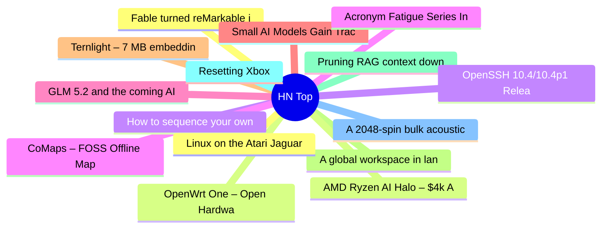

# HackerNews 每日 Top 30 (2026-07-07)

## 思维导图

## 列表（30 条）

### 1. Fable turned reMarkable into Tom Riddle's diary from Harry Potter
- **链接**: [https://github.com/MaximeRivest/Riddle](https://github.com/MaximeRivest/Riddle)
- **分数**: 241 | **评论**: 143 | **作者**: modinfo
- **HN 讨论**: https://news.ycombinator.com/item?id=48811591

### 2. OpenWrt One – Open Hardware Router
- **链接**: [https://openwrt.org/toh/openwrt/one](https://openwrt.org/toh/openwrt/one)
- **分数**: 487 | **评论**: 199 | **作者**: peter_d_sherman
- **HN 讨论**: https://news.ycombinator.com/item?id=48808482

### 3. How to sequence your own DNA at home
- **链接**: [https://bradleywoolf.com/links-1/sequencing-my-own-dna-at-home](https://bradleywoolf.com/links-1/sequencing-my-own-dna-at-home)
- **分数**: 103 | **评论**: 30 | **作者**: bilsbie
- **HN 讨论**: https://news.ycombinator.com/item?id=48812156

### 4. CoMaps – FOSS Offline Maps
- **链接**: [https://www.comaps.app/](https://www.comaps.app/)
- **分数**: 366 | **评论**: 74 | **作者**: basilikum
- **HN 讨论**: https://news.ycombinator.com/item?id=48808928

### 5. GLM 5.2 and the coming AI margin collapse
- **链接**: [https://martinalderson.com/posts/the-upcoming-ai-margin-collapse-part-1-glm-5-2/](https://martinalderson.com/posts/the-upcoming-ai-margin-collapse-part-1-glm-5-2/)
- **分数**: 236 | **评论**: 156 | **作者**: martinald
- **HN 讨论**: https://news.ycombinator.com/item?id=48809877

### 6. Small AI Models Gain Traction In places with unreliable networks
- **链接**: [https://spectrum.ieee.org/small-language-models-ai-pharmaceuticals](https://spectrum.ieee.org/small-language-models-ai-pharmaceuticals)
- **分数**: 54 | **评论**: 12 | **作者**: sscaryterry
- **HN 讨论**: https://news.ycombinator.com/item?id=48812055

### 7. Ternlight – 7 MB embedding model that runs in browser (WASM)
- **链接**: [https://ternlight-demo.vercel.app/](https://ternlight-demo.vercel.app/)
- **分数**: 129 | **评论**: 37 | **作者**: soycaporal
- **HN 讨论**: https://news.ycombinator.com/item?id=48811644

### 8. A global workspace in language models
- **链接**: [https://www.anthropic.com/research/global-workspace](https://www.anthropic.com/research/global-workspace)
- **分数**: 307 | **评论**: 110 | **作者**: in-silico
- **HN 讨论**: https://news.ycombinator.com/item?id=48808002

### 9. Pruning RAG context down to what the answer actually needs
- **链接**: [https://www.kapa.ai/blog/how-we-prune-rag-context](https://www.kapa.ai/blog/how-we-prune-rag-context)
- **分数**: 67 | **评论**: 8 | **作者**: emil_sorensen
- **HN 讨论**: https://news.ycombinator.com/item?id=48809354

### 10. Resetting Xbox
- **链接**: [https://news.xbox.com/en-us/2026/07/06/resetting-xbox/](https://news.xbox.com/en-us/2026/07/06/resetting-xbox/)
- **分数**: 528 | **评论**: 524 | **作者**: dijksterhuis
- **HN 讨论**: https://news.ycombinator.com/item?id=48804993

### 11. A 2048-spin bulk acoustic wave Ising machine for number partitioning and Sudoku
- **链接**: [https://arxiv.org/abs/2607.02112](https://arxiv.org/abs/2607.02112)
- **分数**: 33 | **评论**: 9 | **作者**: Jimmc414
- **HN 讨论**: https://news.ycombinator.com/item?id=48782248

### 12. Linux on the Atari Jaguar
- **链接**: [https://cakehonolulu.github.io/linux-for-jaguar/](https://cakehonolulu.github.io/linux-for-jaguar/)
- **分数**: 120 | **评论**: 21 | **作者**: cakehonolulu
- **HN 讨论**: https://news.ycombinator.com/item?id=48808663

### 13. AMD Ryzen AI Halo – $4k AI Dev Kit
- **链接**: [https://www.lttlabs.com/articles/2026/07/06/amd-ryzen-ai-halo](https://www.lttlabs.com/articles/2026/07/06/amd-ryzen-ai-halo)
- **分数**: 293 | **评论**: 214 | **作者**: LabsLucas
- **HN 讨论**: https://news.ycombinator.com/item?id=48805624

### 14. OpenSSH 10.4/10.4p1 Released
- **链接**: [https://www.openssh.org/txt/release-10.4](https://www.openssh.org/txt/release-10.4)
- **分数**: 43 | **评论**: 12 | **作者**: throw0101a
- **HN 讨论**: https://news.ycombinator.com/item?id=48811373

### 15. Acronym Fatigue Series Introduction: why I'm wary of acronyms
- **链接**: [https://devz.cl/posts/acryonym-fatigue-series-why-i-m-wary-of-engineering-acronyms/](https://devz.cl/posts/acryonym-fatigue-series-why-i-m-wary-of-engineering-acronyms/)
- **分数**: 35 | **评论**: 21 | **作者**: DanielVZ
- **HN 讨论**: https://news.ycombinator.com/item?id=48811339

### 16. OfficeCLI: Office suite for AI agents to read and edit Microsoft Office files
- **链接**: [https://github.com/iOfficeAI/OfficeCLI](https://github.com/iOfficeAI/OfficeCLI)
- **分数**: 143 | **评论**: 37 | **作者**: maxloh
- **HN 讨论**: https://news.ycombinator.com/item?id=48807225

### 17. Full Writeup of the Windows GDID
- **链接**: [https://github.com/SmtimesIWndr/gdid-reversal](https://github.com/SmtimesIWndr/gdid-reversal)
- **分数**: 47 | **评论**: 24 | **作者**: typeofhuman
- **HN 讨论**: https://news.ycombinator.com/item?id=48811081

### 18. Stealth robotics startup (YC S26) is hiring principal engineers (Palo Alto)
- **链接**: [https://news.ycombinator.com/item?id=48806976](https://news.ycombinator.com/item?id=48806976)
- **分数**: 1 | **评论**: 0 | **作者**: david-venegas
- **HN 讨论**: https://news.ycombinator.com/item?id=48806976

### 19. Learning to code is still worthwhile
- **链接**: [https://stevekrouse.com/learn-to-code](https://stevekrouse.com/learn-to-code)
- **分数**: 135 | **评论**: 139 | **作者**: stevekrouse
- **HN 讨论**: https://news.ycombinator.com/item?id=48810439

### 20. Aluminum foil (2021)
- **链接**: [https://dernocua.github.io/notes/aluminum-foil.html](https://dernocua.github.io/notes/aluminum-foil.html)
- **分数**: 254 | **评论**: 109 | **作者**: firephox
- **HN 讨论**: https://news.ycombinator.com/item?id=48804297

### 21. The Music of Destruction
- **链接**: [https://thebaffler.com/latest/the-music-of-destruction-fuelling](https://thebaffler.com/latest/the-music-of-destruction-fuelling)
- **分数**: 18 | **评论**: 8 | **作者**: lermontov
- **HN 讨论**: https://news.ycombinator.com/item?id=48767317

### 22. Road to Elm 1.0
- **链接**: [https://elm-lang.org/news/faster-builds](https://elm-lang.org/news/faster-builds)
- **分数**: 313 | **评论**: 153 | **作者**: wolfadex
- **HN 讨论**: https://news.ycombinator.com/item?id=48803364

### 23. Poly/ML – A Standard ML Implementation
- **链接**: [https://github.com/polyml/polyml](https://github.com/polyml/polyml)
- **分数**: 35 | **评论**: 6 | **作者**: Lyngbakr
- **HN 讨论**: https://news.ycombinator.com/item?id=48811317

### 24. Rotman Lens
- **链接**: [https://en.wikipedia.org/wiki/Rotman_lens](https://en.wikipedia.org/wiki/Rotman_lens)
- **分数**: 90 | **评论**: 25 | **作者**: thomasjb
- **HN 讨论**: https://news.ycombinator.com/item?id=48747889

### 25. Januscape: Guest-to-Host Escape in KVM/x86 [CVE-2026-53359]
- **链接**: [https://github.com/V4bel/Januscape](https://github.com/V4bel/Januscape)
- **分数**: 85 | **评论**: 28 | **作者**: Imustaskforhelp
- **HN 讨论**: https://news.ycombinator.com/item?id=48807908

### 26. M/PC – A Concatenative OS
- **链接**: [https://wiki.xxiivv.com/site/m_pc.html](https://wiki.xxiivv.com/site/m_pc.html)
- **分数**: 46 | **评论**: 5 | **作者**: caminanteblanco
- **HN 讨论**: https://news.ycombinator.com/item?id=48809810

### 27. Evaluation order and nontermination in query languages
- **链接**: [https://www.rntz.net/post/2026-06-11-datalog-nontermination.html](https://www.rntz.net/post/2026-06-11-datalog-nontermination.html)
- **分数**: 27 | **评论**: 3 | **作者**: luu
- **HN 讨论**: https://news.ycombinator.com/item?id=48757619

### 28. Kani: A Model Checker for Rust
- **链接**: [https://arxiv.org/abs/2607.01504](https://arxiv.org/abs/2607.01504)
- **分数**: 131 | **评论**: 7 | **作者**: Jimmc414
- **HN 讨论**: https://news.ycombinator.com/item?id=48806410

### 29. Giving a domain a hill to climb: benchmarking as data activation
- **链接**: [https://sparsethought.com/2026/07/03/benchmarking-as-data-activation/](https://sparsethought.com/2026/07/03/benchmarking-as-data-activation/)
- **分数**: 6 | **评论**: 3 | **作者**: galsapir
- **HN 讨论**: https://news.ycombinator.com/item?id=48779632

### 30. Using precision editing to study human embryo development shows master gene
- **链接**: [https://www.cam.ac.uk/research/news/first-use-of-precision-editing-to-study-human-embryo-development-reveals-role-of-master-gene](https://www.cam.ac.uk/research/news/first-use-of-precision-editing-to-study-human-embryo-development-reveals-role-of-master-gene)
- **分数**: 51 | **评论**: 35 | **作者**: gmays
- **HN 讨论**: https://news.ycombinator.com/item?id=48769854
