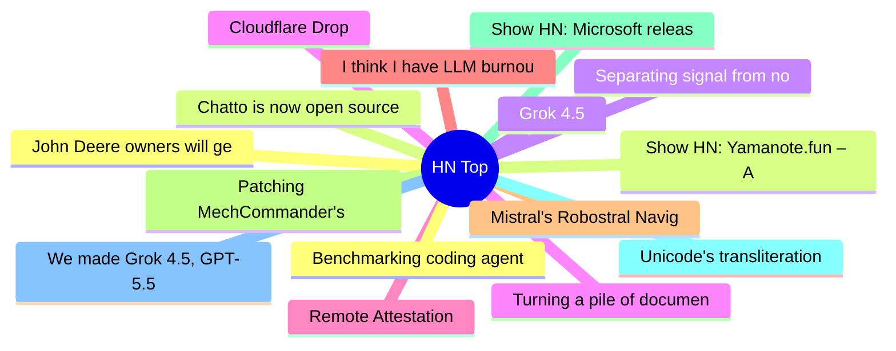

# HackerNews 每日 Top 30 (2026-07-09)

## 思维导图

## 列表（30 条）

### 1. John Deere owners will get the right to repair equipment under FTC settlement
- **链接**: [https://apnews.com/article/john-deere-right-to-repair-agriculture-equipment-cb7514ffedb95c130a976af661f2bc02](https://apnews.com/article/john-deere-right-to-repair-agriculture-equipment-cb7514ffedb95c130a976af661f2bc02)
- **分数**: 484 | **评论**: 101 | **作者**: djoldman
- **HN 讨论**: https://news.ycombinator.com/item?id=48838876

### 2. Chatto is now open source
- **链接**: [https://www.hmans.dev/blog/chatto-is-open-source](https://www.hmans.dev/blog/chatto-is-open-source)
- **分数**: 817 | **评论**: 217 | **作者**: speckx
- **HN 讨论**: https://news.ycombinator.com/item?id=48833116

### 3. Separating signal from noise in coding evaluations
- **链接**: [https://openai.com/index/separating-signal-from-noise-coding-evaluations/](https://openai.com/index/separating-signal-from-noise-coding-evaluations/)
- **分数**: 182 | **评论**: 66 | **作者**: sk4rekr0w
- **HN 讨论**: https://news.ycombinator.com/item?id=48837396

### 4. Cloudflare Drop
- **链接**: [https://www.cloudflare.com/drop/](https://www.cloudflare.com/drop/)
- **分数**: 322 | **评论**: 154 | **作者**: coloneltcb
- **HN 讨论**: https://news.ycombinator.com/item?id=48836233

### 5. Remote Attestation
- **链接**: [https://www.liamcvw.com/p/remote-attestation](https://www.liamcvw.com/p/remote-attestation)
- **分数**: 51 | **评论**: 29 | **作者**: lcvw
- **HN 讨论**: https://news.ycombinator.com/item?id=48839397

### 6. I think I have LLM burnout
- **链接**: [https://www.alecscollon.com/blog/llm-burnout/](https://www.alecscollon.com/blog/llm-burnout/)
- **分数**: 207 | **评论**: 139 | **作者**: sosodev
- **HN 讨论**: https://news.ycombinator.com/item?id=48839984

### 7. Mistral's Robostral Navigate: a state of the art robotics navigation model
- **链接**: [https://mistral.ai/news/robostral-navigate/](https://mistral.ai/news/robostral-navigate/)
- **分数**: 435 | **评论**: 97 | **作者**: ottomengis
- **HN 讨论**: https://news.ycombinator.com/item?id=48832212

### 8. Patching MechCommander's "left arm bug" for fun and profit
- **链接**: [https://mhloppy.com/2026/05/mechcommander-weapons-left-arm-bug-fix/](https://mhloppy.com/2026/05/mechcommander-weapons-left-arm-bug-fix/)
- **分数**: 34 | **评论**: 11 | **作者**: Narann
- **HN 讨论**: https://news.ycombinator.com/item?id=48795591

### 9. Show HN: Microsoft releases Flint, a visualization language for AI agents
- **链接**: [https://microsoft.github.io/flint-chart/#/](https://microsoft.github.io/flint-chart/#/)
- **分数**: 234 | **评论**: 88 | **作者**: chenglong-hn
- **HN 讨论**: https://news.ycombinator.com/item?id=48834924

### 10. Unicode's transliteration rules are Turing-complete
- **链接**: [https://seriot.ch/computation/uts35/](https://seriot.ch/computation/uts35/)
- **分数**: 58 | **评论**: 19 | **作者**: beefburger
- **HN 讨论**: https://news.ycombinator.com/item?id=48829797

### 11. We made Grok 4.5, GPT-5.5, and Claude build the same apps
- **链接**: [https://www.tryai.dev/blog/grok-4.5-vs-gpt-5.5-vs-claude-build-off](https://www.tryai.dev/blog/grok-4.5-vs-gpt-5.5-vs-claude-build-off)
- **分数**: 109 | **评论**: 52 | **作者**: hershyb_
- **HN 讨论**: https://news.ycombinator.com/item?id=48838772

### 12. Benchmarking coding agents on Databricks' multi-million line codebase
- **链接**: [https://www.databricks.com/blog/benchmarking-coding-agents-databricks-multi-million-line-codebase](https://www.databricks.com/blog/benchmarking-coding-agents-databricks-multi-million-line-codebase)
- **分数**: 26 | **评论**: 5 | **作者**: tanelpoder
- **HN 讨论**: https://news.ycombinator.com/item?id=48837696

### 13. Show HN: Yamanote.fun – A complete soundscape for Tokyo's Yamanote line
- **链接**: [https://www.yamanote.fun/](https://www.yamanote.fun/)
- **分数**: 83 | **评论**: 19 | **作者**: madebymagnolia
- **HN 讨论**: https://news.ycombinator.com/item?id=48816987

### 14. Grok 4.5
- **链接**: [https://x.ai/news/grok-4-5](https://x.ai/news/grok-4-5)
- **分数**: 525 | **评论**: 693 | **作者**: BoumTAC
- **HN 讨论**: https://news.ycombinator.com/item?id=48835111

### 15. Turning a pile of documents into a searchable useable knowledge base
- **链接**: [https://github.com/linuxrebel/DocuBrowser](https://github.com/linuxrebel/DocuBrowser)
- **分数**: 101 | **评论**: 23 | **作者**: linuxrebe1
- **HN 讨论**: https://news.ycombinator.com/item?id=48837110

### 16. FAANG Simulator
- **链接**: [https://www.abeyk.com/escape-the-rat-race/](https://www.abeyk.com/escape-the-rat-race/)
- **分数**: 344 | **评论**: 130 | **作者**: nerdbiscuits
- **HN 讨论**: https://news.ycombinator.com/item?id=48836778

### 17. GPT‑Live
- **链接**: [https://openai.com/index/introducing-gpt-live/](https://openai.com/index/introducing-gpt-live/)
- **分数**: 640 | **评论**: 422 | **作者**: logickkk1
- **HN 讨论**: https://news.ycombinator.com/item?id=48834405

### 18. The Factorio Effect
- **链接**: [https://dangrafham.com/the-factorio-effect](https://dangrafham.com/the-factorio-effect)
- **分数**: 4 | **评论**: 0 | **作者**: freediver
- **HN 讨论**: https://news.ycombinator.com/item?id=48783470

### 19. Cargo-nextest: 3x faster than cargo test, per-test isolation, first-class CI
- **链接**: [https://nexte.st/](https://nexte.st/)
- **分数**: 10 | **评论**: 0 | **作者**: nateb2022
- **HN 讨论**: https://news.ycombinator.com/item?id=48800596

### 20. Rewriting Bun in Rust
- **链接**: [https://bun.com/blog/bun-in-rust](https://bun.com/blog/bun-in-rust)
- **分数**: 383 | **评论**: 203 | **作者**: afturner
- **HN 讨论**: https://news.ycombinator.com/item?id=48837877

### 21. Apache Shiro security framework releases 3.0.0
- **链接**: [https://shiro.apache.org/blog/2026/06/apache-shiro-300-released.html](https://shiro.apache.org/blog/2026/06/apache-shiro-300-released.html)
- **分数**: 11 | **评论**: 0 | **作者**: lprimak
- **HN 讨论**: https://news.ycombinator.com/item?id=48812736

### 22. A bug which affected only left handed users
- **链接**: [https://shkspr.mobi/blog/2026/07/a-bug-which-only-affected-left-handed-users/](https://shkspr.mobi/blog/2026/07/a-bug-which-only-affected-left-handed-users/)
- **分数**: 99 | **评论**: 51 | **作者**: sixhobbits
- **HN 讨论**: https://news.ycombinator.com/item?id=48831587

### 23. TypeScript 7
- **链接**: [https://devblogs.microsoft.com/typescript/announcing-typescript-7-0/](https://devblogs.microsoft.com/typescript/announcing-typescript-7-0/)
- **分数**: 510 | **评论**: 203 | **作者**: DanRosenwasser
- **HN 讨论**: https://news.ycombinator.com/item?id=48833715

### 24. Decoding the obfuscated bash script on a Uniqlo t-shirt
- **链接**: [https://tris.sherliker.net/blog/obfuscated-self-evaluating-bash-script-by-cdn-akamai-being-supplied-to-consumers-via-retail-stores/](https://tris.sherliker.net/blog/obfuscated-self-evaluating-bash-script-by-cdn-akamai-being-supplied-to-consumers-via-retail-stores/)
- **分数**: 1330 | **评论**: 210 | **作者**: speerer
- **HN 讨论**: https://news.ycombinator.com/item?id=48829312

### 25. Beyond Git: Real-Time Version Control for Godot – Lilith Duncan – GodotCon 2026 [video]
- **链接**: [https://www.youtube.com/watch?v=CAJ_iIedx_I](https://www.youtube.com/watch?v=CAJ_iIedx_I)
- **分数**: 26 | **评论**: 1 | **作者**: surprisetalk
- **HN 讨论**: https://news.ycombinator.com/item?id=48760258

### 26. New Sweden: the US's long-lost 'secret' colony
- **链接**: [https://www.bbc.com/travel/article/20260629-new-sweden-the-uss-long-lost-secret-colony](https://www.bbc.com/travel/article/20260629-new-sweden-the-uss-long-lost-secret-colony)
- **分数**: 70 | **评论**: 17 | **作者**: bookofjoe
- **HN 讨论**: https://news.ycombinator.com/item?id=48836324

### 27. Ergo: Long Form Philosophy Lectures
- **链接**: [https://ergo.org/](https://ergo.org/)
- **分数**: 5 | **评论**: 0 | **作者**: agnishom
- **HN 讨论**: https://news.ycombinator.com/item?id=48840497

### 28. My road trip with the do-gooding cactus smugglers
- **链接**: [https://economist.com/1843/2026/03/06/my-road-trip-with-the-do-gooding-cactus-smugglers](https://economist.com/1843/2026/03/06/my-road-trip-with-the-do-gooding-cactus-smugglers)
- **分数**: 26 | **评论**: 1 | **作者**: andsoitis
- **HN 讨论**: https://news.ycombinator.com/item?id=48794568

### 29. Cloudflare Meerkat - Globally distributed consensus
- **链接**: [https://blog.cloudflare.com/meerkat-introduction/](https://blog.cloudflare.com/meerkat-introduction/)
- **分数**: 236 | **评论**: 47 | **作者**: bobnamob
- **HN 讨论**: https://news.ycombinator.com/item?id=48831565

### 30. MIRA: Multiplayer Interactive World Models Trained on Rocket League
- **链接**: [https://mira-wm.com/](https://mira-wm.com/)
- **分数**: 42 | **评论**: 9 | **作者**: ethanlipson
- **HN 讨论**: https://news.ycombinator.com/item?id=48839355
