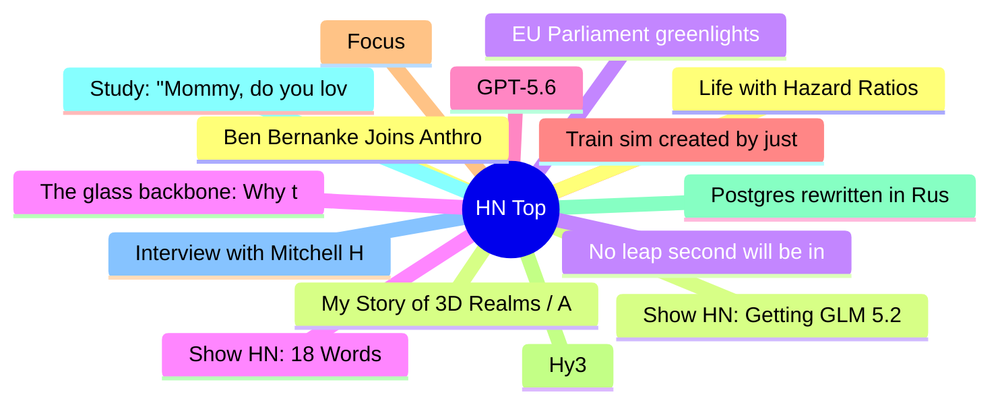

# HackerNews 每日 Top 30 (2026-07-10)

## 思维导图

## 列表（30 条）

### 1. Ben Bernanke Joins Anthropic Oversight Trust
- **链接**: [https://www.anthropic.com/news/ben-bernanke](https://www.anthropic.com/news/ben-bernanke)
- **分数**: 35 | **评论**: 17 | **作者**: Jimmc414
- **HN 讨论**: https://news.ycombinator.com/item?id=48855112

### 2. Show HN: Getting GLM 5.2 running on my slow computer
- **链接**: [https://github.com/JustVugg/colibri](https://github.com/JustVugg/colibri)
- **分数**: 462 | **评论**: 119 | **作者**: vforno
- **HN 讨论**: https://news.ycombinator.com/item?id=48842459

### 3. EU Parliament greenlights Chat Control 1.0
- **链接**: [https://www.patrick-breyer.de/en/eu-parliament-greenlights-chat-control-1-0-breyer-our-children-lose-out/](https://www.patrick-breyer.de/en/eu-parliament-greenlights-chat-control-1-0-breyer-our-children-lose-out/)
- **分数**: 1074 | **评论**: 529 | **作者**: rapnie
- **HN 讨论**: https://news.ycombinator.com/item?id=48843923

### 4. Show HN: 18 Words
- **链接**: [https://18words.com/](https://18words.com/)
- **分数**: 881 | **评论**: 297 | **作者**: pompomsheep
- **HN 讨论**: https://news.ycombinator.com/item?id=48845049

### 5. GPT-5.6
- **链接**: [https://openai.com/index/gpt-5-6/](https://openai.com/index/gpt-5-6/)
- **分数**: 1138 | **评论**: 816 | **作者**: logickkk1
- **HN 讨论**: https://news.ycombinator.com/item?id=48849066

### 6. Train sim created by just one person is being called the best ever made
- **链接**: [https://kotaku.com/a-train-sim-created-by-just-one-person-is-being-called-the-best-ever-made-2000699429](https://kotaku.com/a-train-sim-created-by-just-one-person-is-being-called-the-best-ever-made-2000699429)
- **分数**: 364 | **评论**: 130 | **作者**: oumua_don17
- **HN 讨论**: https://news.ycombinator.com/item?id=48792383

### 7. Focus
- **链接**: [https://boz.com/articles/focus](https://boz.com/articles/focus)
- **分数**: 81 | **评论**: 42 | **作者**: iacguy
- **HN 讨论**: https://news.ycombinator.com/item?id=48854363

### 8. Hy3
- **链接**: [https://hy.tencent.com/research/hy3](https://hy.tencent.com/research/hy3)
- **分数**: 415 | **评论**: 89 | **作者**: andai
- **HN 讨论**: https://news.ycombinator.com/item?id=48847552

### 9. Postgres rewritten in Rust, now passing 100% of the Postgres regression tests
- **链接**: [https://github.com/malisper/pgrust](https://github.com/malisper/pgrust)
- **分数**: 454 | **评论**: 442 | **作者**: SweetSoftPillow
- **HN 讨论**: https://news.ycombinator.com/item?id=48841676

### 10. Study: "Mommy, do you love your phone more than me?"
- **链接**: [https://www.frontiersin.org/journals/psychology/articles/10.3389/fpsyg.2026.1766665/full](https://www.frontiersin.org/journals/psychology/articles/10.3389/fpsyg.2026.1766665/full)
- **分数**: 35 | **评论**: 9 | **作者**: hbcondo714
- **HN 讨论**: https://news.ycombinator.com/item?id=48854247

### 11. Interview with Mitchell Hashimoto about Ghostty and Zig
- **链接**: [https://alexalejandre.com/programming/interview-with-mitchell-hashimoto/](https://alexalejandre.com/programming/interview-with-mitchell-hashimoto/)
- **分数**: 163 | **评论**: 70 | **作者**: veqq
- **HN 讨论**: https://news.ycombinator.com/item?id=48849292

### 12. Life with Hazard Ratios
- **链接**: [https://dynomight.net/hazard-ratios/](https://dynomight.net/hazard-ratios/)
- **分数**: 19 | **评论**: 2 | **作者**: surprisetalk
- **HN 讨论**: https://news.ycombinator.com/item?id=48806305

### 13. My Story of 3D Realms / Apogee Part I (2020)
- **链接**: [https://joesiegler.blog/2020/11/my-story-of-apogee-3dr/](https://joesiegler.blog/2020/11/my-story-of-apogee-3dr/)
- **分数**: 50 | **评论**: 1 | **作者**: Michelangelo11
- **HN 讨论**: https://news.ycombinator.com/item?id=48757291

### 14. No leap second will be introduced at the end of December 2026
- **链接**: [https://datacenter.iers.org/data/latestVersion/bulletinC.txt](https://datacenter.iers.org/data/latestVersion/bulletinC.txt)
- **分数**: 257 | **评论**: 195 | **作者**: ChrisArchitect
- **HN 讨论**: https://news.ycombinator.com/item?id=48846281

### 15. The glass backbone: Why the Army's logistics will break in the next war
- **链接**: [https://mwi.westpoint.edu/the-glass-backbone-why-the-armys-logistics-will-break-in-the-next-war/](https://mwi.westpoint.edu/the-glass-backbone-why-the-armys-logistics-will-break-in-the-next-war/)
- **分数**: 325 | **评论**: 412 | **作者**: baud147258
- **HN 讨论**: https://news.ycombinator.com/item?id=48845442

### 16. Build your own vulnerability harness
- **链接**: [https://blog.cloudflare.com/build-your-own-vulnerability-harness/](https://blog.cloudflare.com/build-your-own-vulnerability-harness/)
- **分数**: 23 | **评论**: 10 | **作者**: ianrahman
- **HN 讨论**: https://news.ycombinator.com/item?id=48854681

### 17. Triple Dragon Fractal (2020)
- **链接**: [https://paulbourke.net/fractals/tripledragon/](https://paulbourke.net/fractals/tripledragon/)
- **分数**: 27 | **评论**: 7 | **作者**: nhatcher
- **HN 讨论**: https://news.ycombinator.com/item?id=48804400

### 18. Apple Silicon Exec Explains Mac Mini AI Demand and On-Device Future
- **链接**: [https://www.macrumors.com/2026/07/06/apple-silicon-exec-explains-mac-mini-ai-demand/](https://www.macrumors.com/2026/07/06/apple-silicon-exec-explains-mac-mini-ai-demand/)
- **分数**: 8 | **评论**: 0 | **作者**: tosh
- **HN 讨论**: https://news.ycombinator.com/item?id=48805598

### 19. A road to Lisp: Why Lisp
- **链接**: [https://scotto.me/blog/2026-07-09-why-lisp/](https://scotto.me/blog/2026-07-09-why-lisp/)
- **分数**: 130 | **评论**: 130 | **作者**: silcoon
- **HN 讨论**: https://news.ycombinator.com/item?id=48845209

### 20. Why American ambulance rides are so expensive
- **链接**: [https://davidoks.blog/p/why-american-ambulance-rides-are](https://davidoks.blog/p/why-american-ambulance-rides-are)
- **分数**: 136 | **评论**: 172 | **作者**: jyunwai
- **HN 讨论**: https://news.ycombinator.com/item?id=48853091

### 21. Building a real-time AI tutor for 5-year-olds
- **链接**: [https://www.ello.com/blog/teaching-a-child-in-1000-ms](https://www.ello.com/blog/teaching-a-child-in-1000-ms)
- **分数**: 65 | **评论**: 97 | **作者**: catalinvoss
- **HN 讨论**: https://news.ycombinator.com/item?id=48852199

### 22. Launch HN: Context.dev (YC S26) – API to get structured data from any website
- **链接**: [https://www.context.dev](https://www.context.dev)
- **分数**: 78 | **评论**: 59 | **作者**: TheYahiaBakour
- **HN 讨论**: https://news.ycombinator.com/item?id=48847562

### 23. A possible future for Damn Interesting
- **链接**: [https://www.damninteresting.com/a-possible-future/](https://www.damninteresting.com/a-possible-future/)
- **分数**: 254 | **评论**: 33 | **作者**: mzur
- **HN 讨论**: https://news.ycombinator.com/item?id=48847511

### 24. Girls just wanna have fast MPMC queues with bounded waiting
- **链接**: [https://nahla.dev/blog/waitfree_queue/](https://nahla.dev/blog/waitfree_queue/)
- **分数**: 147 | **评论**: 30 | **作者**: EvgeniyZh
- **HN 讨论**: https://news.ycombinator.com/item?id=48809574

### 25. Muse Spark 1.1
- **链接**: [https://ai.meta.com/blog/introducing-muse-spark-meta-model-api/](https://ai.meta.com/blog/introducing-muse-spark-meta-model-api/)
- **分数**: 338 | **评论**: 176 | **作者**: ot
- **HN 讨论**: https://news.ycombinator.com/item?id=48846184

### 26. Cache-Conscious Data Layout in Rust: Field Zoning, False Sharing, 128-Byte Rule
- **链接**: [https://debasishg.github.io/blog/part1-cache-conscious-data-layout-in-rust/](https://debasishg.github.io/blog/part1-cache-conscious-data-layout-in-rust/)
- **分数**: 15 | **评论**: 3 | **作者**: eigenBasis
- **HN 讨论**: https://news.ycombinator.com/item?id=48813214

### 27. Patterncollider: Generate and explore quasiperiodic tiling patterns
- **链接**: [https://github.com/aatishb/patterncollider](https://github.com/aatishb/patterncollider)
- **分数**: 30 | **评论**: 1 | **作者**: tobr
- **HN 讨论**: https://news.ycombinator.com/item?id=48800930

### 28. Wildcard (YC W25) Is Hiring a Founding Engineer
- **链接**: [https://www.ycombinator.com/companies/wildcard/jobs/ZSLVaaU-founding-engineer](https://www.ycombinator.com/companies/wildcard/jobs/ZSLVaaU-founding-engineer)
- **分数**: 1 | **评论**: 0 | **作者**: kaushikmahorker
- **HN 讨论**: https://news.ycombinator.com/item?id=48849011

### 29. Opinionated and easy Pi.dev configuration
- **链接**: [https://lazypi.org/](https://lazypi.org/)
- **分数**: 125 | **评论**: 63 | **作者**: lwhsiao
- **HN 讨论**: https://news.ycombinator.com/item?id=48847407

### 30. Buried Apple feature turns an iPhone into the perfect kids' dumb phone
- **链接**: [https://www.wired.com/story/this-buried-apple-feature-turns-an-iphone-into-the-perfect-kids-dumb-phone/](https://www.wired.com/story/this-buried-apple-feature-turns-an-iphone-into-the-perfect-kids-dumb-phone/)
- **分数**: 295 | **评论**: 175 | **作者**: PotatoNinja
- **HN 讨论**: https://news.ycombinator.com/item?id=48803004
