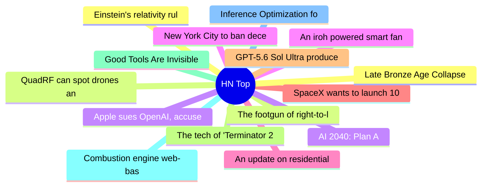

# HackerNews 每日 Top 30 (2026-07-11)

## 思维导图

## 列表（30 条）

### 1. Einstein's relativity rules chemical bonds in heavy elements, new research shows
- **链接**: [https://www.brown.edu/news/2026-07-09/chemical-bonds-relativity](https://www.brown.edu/news/2026-07-09/chemical-bonds-relativity)
- **分数**: 152 | **评论**: 52 | **作者**: hhs
- **HN 讨论**: https://news.ycombinator.com/item?id=48866134

### 2. QuadRF can spot drones and see WiFi through my wall
- **链接**: [https://www.jeffgeerling.com/blog/2026/quadrf-can-spot-drones-and-see-wifi-through-my-wall/](https://www.jeffgeerling.com/blog/2026/quadrf-can-spot-drones-and-see-wifi-through-my-wall/)
- **分数**: 498 | **评论**: 182 | **作者**: speckx
- **HN 讨论**: https://news.ycombinator.com/item?id=48861717

### 3. Apple sues OpenAI, accuses ex-employees of stealing trade secrets
- **链接**: [https://9to5mac.com/2026/07/10/apple-sues-openai-trade-secret-theft/](https://9to5mac.com/2026/07/10/apple-sues-openai-trade-secret-theft/)
- **分数**: 733 | **评论**: 368 | **作者**: stock_toaster
- **HN 讨论**: https://news.ycombinator.com/item?id=48865019

### 4. An iroh powered smart fan
- **链接**: [https://www.iroh.computer/blog/an-iroh-powered-smart-fan](https://www.iroh.computer/blog/an-iroh-powered-smart-fan)
- **分数**: 49 | **评论**: 4 | **作者**: surprisetalk
- **HN 讨论**: https://news.ycombinator.com/item?id=48817539

### 5. An update on residential proxies and the scraper situation
- **链接**: [https://lwn.net/SubscriberLink/1080822/990a8a5e2d379085/](https://lwn.net/SubscriberLink/1080822/990a8a5e2d379085/)
- **分数**: 132 | **评论**: 113 | **作者**: chmaynard
- **HN 讨论**: https://news.ycombinator.com/item?id=48864252

### 6. SpaceX wants to launch 100k more Starlink satellites for 100x the bandwidth
- **链接**: [https://www.zdnet.com/home-and-office/networking/spacex-wants-to-launch-100000-more-starlink-satellites/](https://www.zdnet.com/home-and-office/networking/spacex-wants-to-launch-100000-more-starlink-satellites/)
- **分数**: 119 | **评论**: 358 | **作者**: CrankyBear
- **HN 讨论**: https://news.ycombinator.com/item?id=48863064

### 7. GPT-5.6 Sol Ultra produces proof of the Cycle Double Cover Conjecture [pdf]
- **链接**: [https://cdn.openai.com/pdf/04d1d1e4-bc75-476a-97cf-49055cd98d31/cdc_proof.pdf](https://cdn.openai.com/pdf/04d1d1e4-bc75-476a-97cf-49055cd98d31/cdc_proof.pdf)
- **分数**: 391 | **评论**: 305 | **作者**: scrlk
- **HN 讨论**: https://news.ycombinator.com/item?id=48863490

### 8. The tech of 'Terminator 2' – an oral history (2017)
- **链接**: [https://vfxblog.com/2017/08/23/the-tech-of-terminator-2-an-oral-history/](https://vfxblog.com/2017/08/23/the-tech-of-terminator-2-an-oral-history/)
- **分数**: 191 | **评论**: 69 | **作者**: markus_zhang
- **HN 讨论**: https://news.ycombinator.com/item?id=48862365

### 9. Good Tools Are Invisible
- **链接**: [https://www.gingerbill.org/article/2026/07/10/good-tools-are-invisible/](https://www.gingerbill.org/article/2026/07/10/good-tools-are-invisible/)
- **分数**: 384 | **评论**: 180 | **作者**: theanonymousone
- **HN 讨论**: https://news.ycombinator.com/item?id=48858121

### 10. Combustion engine web-based simulator
- **链接**: [https://combustionlab.net](https://combustionlab.net)
- **分数**: 135 | **评论**: 62 | **作者**: mytuny
- **HN 讨论**: https://news.ycombinator.com/item?id=48795900

### 11. Inference Optimization for MiMo v2.5: Pushing Hybrid SWA Efficiency to the Limit
- **链接**: [https://mimo.xiaomi.com/blog/mimo-v2-5-inference](https://mimo.xiaomi.com/blog/mimo-v2-5-inference)
- **分数**: 57 | **评论**: 23 | **作者**: theanonymousone
- **HN 讨论**: https://news.ycombinator.com/item?id=48814170

### 12. Late Bronze Age Collapse
- **链接**: [https://acoup.blog/2026/01/30/collections-the-late-bronze-age-collapse-a-very-brief-introduction/](https://acoup.blog/2026/01/30/collections-the-late-bronze-age-collapse-a-very-brief-introduction/)
- **分数**: 344 | **评论**: 234 | **作者**: dmonay
- **HN 讨论**: https://news.ycombinator.com/item?id=48858737

### 13. The footgun of right-to-left decorative characters
- **链接**: [https://blog.alexbeals.com/posts/the-footgun-of-right-to-left-decorative-characters](https://blog.alexbeals.com/posts/the-footgun-of-right-to-left-decorative-characters)
- **分数**: 24 | **评论**: 13 | **作者**: dado3212
- **HN 讨论**: https://news.ycombinator.com/item?id=48813246

### 14. AI 2040: Plan A
- **链接**: [https://ai-2040.com/](https://ai-2040.com/)
- **分数**: 183 | **评论**: 192 | **作者**: kschaul
- **HN 讨论**: https://news.ycombinator.com/item?id=48848425

### 15. New York City to ban deceptive subscription practices
- **链接**: [https://www.theguardian.com/us-news/2026/jul/10/new-york-city-deceptive-subscriptions-ban](https://www.theguardian.com/us-news/2026/jul/10/new-york-city-deceptive-subscriptions-ban)
- **分数**: 464 | **评论**: 231 | **作者**: randycupertino
- **HN 讨论**: https://news.ycombinator.com/item?id=48863464

### 16. Snails' teeth beats spider silk as nature's strongest material (2015)
- **链接**: [https://www.smithsonianmag.com/smart-news/spider-silk-loses-top-spot-natures-strongest-material-snails-teeth-180954346/](https://www.smithsonianmag.com/smart-news/spider-silk-loses-top-spot-natures-strongest-material-snails-teeth-180954346/)
- **分数**: 167 | **评论**: 131 | **作者**: simonebrunozzi
- **HN 讨论**: https://news.ycombinator.com/item?id=48862252

### 17. Computation as a universal and fundamental concept
- **链接**: [https://ergo.org/courses/computation-as-a-universal-and-fundamental-concept](https://ergo.org/courses/computation-as-a-universal-and-fundamental-concept)
- **分数**: 104 | **评论**: 78 | **作者**: simonpure
- **HN 讨论**: https://news.ycombinator.com/item?id=48861213

### 18. Alternate clock designs and time systems
- **链接**: [https://serialc.github.io/altClocks/](https://serialc.github.io/altClocks/)
- **分数**: 119 | **评论**: 62 | **作者**: ethanpil
- **HN 讨论**: https://news.ycombinator.com/item?id=48810543

### 19. After 7 years in production, Scarf has reluctantly moved away from Haskell
- **链接**: [https://avi.press/posts/2026-07-10-after-7-years-in-production-scarf-has-reluctantly-moved-away-from-haskell.html](https://avi.press/posts/2026-07-10-after-7-years-in-production-scarf-has-reluctantly-moved-away-from-haskell.html)
- **分数**: 96 | **评论**: 106 | **作者**: aviaviavi
- **HN 讨论**: https://news.ycombinator.com/item?id=48859673

### 20. Moss (YC F25) Is Hiring
- **链接**: [https://www.ycombinator.com/companies/moss/jobs/52LnqLQ-software-engineer-sdk](https://www.ycombinator.com/companies/moss/jobs/52LnqLQ-software-engineer-sdk)
- **分数**: 1 | **评论**: 0 | **作者**: srimalireddi
- **HN 讨论**: https://news.ycombinator.com/item?id=48865332

### 21. Preemption is GC for memory reordering (2019)
- **链接**: [https://pvk.ca/Blog/2019/01/09/preemption-is-gc-for-memory-reordering/](https://pvk.ca/Blog/2019/01/09/preemption-is-gc-for-memory-reordering/)
- **分数**: 18 | **评论**: 4 | **作者**: mpweiher
- **HN 讨论**: https://news.ycombinator.com/item?id=48831814

### 22. War Atlas: An interactive cartography of every named war in human history
- **链接**: [https://waratlas.org](https://waratlas.org)
- **分数**: 128 | **评论**: 58 | **作者**: NaOH
- **HN 讨论**: https://news.ycombinator.com/item?id=48863080

### 23. A love letter to flashcards
- **链接**: [https://lesleylai.info/en/flashcards/](https://lesleylai.info/en/flashcards/)
- **分数**: 137 | **评论**: 84 | **作者**: surprisetalk
- **HN 讨论**: https://news.ycombinator.com/item?id=48861319

### 24. Silent speech with ultrasound
- **链接**: [https://alephneuro.com/blog/silent-speech](https://alephneuro.com/blog/silent-speech)
- **分数**: 21 | **评论**: 5 | **作者**: chrwn
- **HN 讨论**: https://news.ycombinator.com/item?id=48825216

### 25. Show HN: Phobos – A tiny scale-free kernel language with tile-DAG support
- **链接**: [https://www.joa-ebert.com/posts/2026-07-07-phobos-lang/](https://www.joa-ebert.com/posts/2026-07-07-phobos-lang/)
- **分数**: 5 | **评论**: 0 | **作者**: joajoa
- **HN 讨论**: https://news.ycombinator.com/item?id=48817218

### 26. GhostLock, a stack-UAF that has existed in ALL Linux distributions for 15 years
- **链接**: [https://nebusec.ai/research/ionstack-part-2/](https://nebusec.ai/research/ionstack-part-2/)
- **分数**: 50 | **评论**: 10 | **作者**: djfergus
- **HN 讨论**: https://news.ycombinator.com/item?id=48864969

### 27. Show HN: Wyrm – Solve algebra by touch, built on an open-source soundness engine
- **链接**: [https://github.com/dicroce/wyrm_math](https://github.com/dicroce/wyrm_math)
- **分数**: 66 | **评论**: 10 | **作者**: dicroce
- **HN 讨论**: https://news.ycombinator.com/item?id=48844046

### 28. Lost city discovered beneath Egypt's desert with ancient church
- **链接**: [https://www.dailymail.com/sciencetech/article-15956159/Incredible-lost-city-discovered-Egypts-desert.html](https://www.dailymail.com/sciencetech/article-15956159/Incredible-lost-city-discovered-Egypts-desert.html)
- **分数**: 168 | **评论**: 84 | **作者**: Bender
- **HN 讨论**: https://news.ycombinator.com/item?id=48803707

### 29. Successful Companies Go Blind
- **链接**: [https://ianreppel.org/how-successful-companies-go-blind/](https://ianreppel.org/how-successful-companies-go-blind/)
- **分数**: 200 | **评论**: 71 | **作者**: speckx
- **HN 讨论**: https://news.ycombinator.com/item?id=48859678

### 30. Show HN: Getting GLM 5.2 running on my slow computer
- **链接**: [https://github.com/JustVugg/colibri](https://github.com/JustVugg/colibri)
- **分数**: 837 | **评论**: 206 | **作者**: vforno
- **HN 讨论**: https://news.ycombinator.com/item?id=48842459
