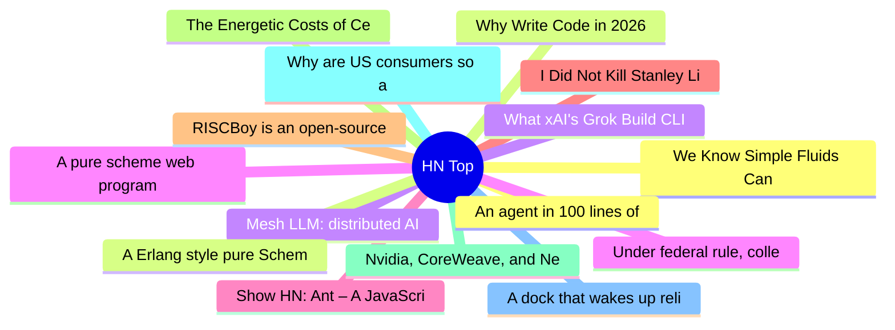

# HackerNews 每日 Top 30 (2026-07-12)

## 思维导图

## 列表（30 条）

### 1. We Know Simple Fluids Can Flow. Turns Out, Some Can Fracture
- **链接**: [https://www.quantamagazine.org/we-know-simple-fluids-can-flow-turns-out-some-can-fracture-20260710/](https://www.quantamagazine.org/we-know-simple-fluids-can-flow-turns-out-some-can-fracture-20260710/)
- **分数**: 41 | **评论**: 6 | **作者**: Anon84
- **HN 讨论**: https://news.ycombinator.com/item?id=48877668

### 2. Why Write Code in 2026
- **链接**: [https://softwaredoug.com/blog/2026/07/09/write-code.html](https://softwaredoug.com/blog/2026/07/09/write-code.html)
- **分数**: 7 | **评论**: 0 | **作者**: zdw
- **HN 讨论**: https://news.ycombinator.com/item?id=48878195

### 3. Mesh LLM: distributed AI computing on iroh
- **链接**: [https://www.iroh.computer/blog/mesh-llm](https://www.iroh.computer/blog/mesh-llm)
- **分数**: 155 | **评论**: 36 | **作者**: tionis
- **HN 讨论**: https://news.ycombinator.com/item?id=48876505

### 4. A pure scheme web programming tool
- **链接**: [https://goeteia.dev](https://goeteia.dev)
- **分数**: 43 | **评论**: 15 | **作者**: guenchi
- **HN 讨论**: https://news.ycombinator.com/item?id=48877314

### 5. Show HN: Ant – A JavaScript runtime and ecosystem
- **链接**: [https://antjs.org](https://antjs.org)
- **分数**: 210 | **评论**: 90 | **作者**: theMackabu
- **HN 讨论**: https://news.ycombinator.com/item?id=48875377

### 6. I Did Not Kill Stanley Lieber: How to Draw (With 9front)
- **链接**: [https://triapul.cz/automa/i_did_not_kill_stanley_lieber](https://triapul.cz/automa/i_did_not_kill_stanley_lieber)
- **分数**: 32 | **评论**: 4 | **作者**: c-c-c-c-c
- **HN 讨论**: https://news.ycombinator.com/item?id=48846177

### 7. RISCBoy is an open-source portable games console, designed from scratch
- **链接**: [https://github.com/Wren6991/RISCBoy](https://github.com/Wren6991/RISCBoy)
- **分数**: 84 | **评论**: 17 | **作者**: mariuz
- **HN 讨论**: https://news.ycombinator.com/item?id=48876245

### 8. The Energetic Costs of Cellular Computation (2012)
- **链接**: [https://arxiv.org/abs/1203.5426](https://arxiv.org/abs/1203.5426)
- **分数**: 14 | **评论**: 1 | **作者**: lioeters
- **HN 讨论**: https://news.ycombinator.com/item?id=48877613

### 9. Nvidia, CoreWeave, and Nebius: Inside the Circular Financing of the GPU Boom
- **链接**: [https://io-fund.com/ai-stocks/nvidia-coreweave-nebius-circular-financing-gpu-boom](https://io-fund.com/ai-stocks/nvidia-coreweave-nebius-circular-financing-gpu-boom)
- **分数**: 197 | **评论**: 66 | **作者**: adletbalzhanov
- **HN 讨论**: https://news.ycombinator.com/item?id=48873836

### 10. Why are US consumers so angry? It's not just high prices
- **链接**: [https://www.theguardian.com/us-news/ng-interactive/2026/jun/04/us-consumer-rage-prices-economy](https://www.theguardian.com/us-news/ng-interactive/2026/jun/04/us-consumer-rage-prices-economy)
- **分数**: 34 | **评论**: 15 | **作者**: dilawar
- **HN 讨论**: https://news.ycombinator.com/item?id=48877927

### 11. A dock that wakes up reliably
- **链接**: [https://fabiensanglard.net/tb4/index.html](https://fabiensanglard.net/tb4/index.html)
- **分数**: 47 | **评论**: 36 | **作者**: ingve
- **HN 讨论**: https://news.ycombinator.com/item?id=48877269

### 12. An agent in 100 lines of Lisp
- **链接**: [https://thebeach.dev/posts/lisp-agent/](https://thebeach.dev/posts/lisp-agent/)
- **分数**: 59 | **评论**: 4 | **作者**: jamiebeach
- **HN 讨论**: https://news.ycombinator.com/item?id=48823981

### 13. A Erlang style pure Scheme Webserver and further
- **链接**: [https://igropyr.com](https://igropyr.com)
- **分数**: 24 | **评论**: 1 | **作者**: guenchi
- **HN 讨论**: https://news.ycombinator.com/item?id=48877344

### 14. What xAI's Grok Build CLI Actually Sends to xAI
- **链接**: [https://gist.github.com/cereblab/dc9a40bc26120f4540e4e09b75ffb547](https://gist.github.com/cereblab/dc9a40bc26120f4540e4e09b75ffb547)
- **分数**: 128 | **评论**: 69 | **作者**: jhoho
- **HN 讨论**: https://news.ycombinator.com/item?id=48877371

### 15. Under federal rule, colleges must leave grads better off or lose financial aid
- **链接**: [https://www.npr.org/2026/06/30/nx-s1-5835631/turner-camhi-do-no-harm-college-loans](https://www.npr.org/2026/06/30/nx-s1-5835631/turner-camhi-do-no-harm-college-loans)
- **分数**: 13 | **评论**: 3 | **作者**: nradov
- **HN 讨论**: https://news.ycombinator.com/item?id=48878126

### 16. Long Covid May Physically Damage the Nerves That Control the Stomach
- **链接**: [https://www.ijidonline.com/article/S1201-9712(26)00608-9/fulltext](https://www.ijidonline.com/article/S1201-9712(26)00608-9/fulltext)
- **分数**: 79 | **评论**: 35 | **作者**: thenerdhead
- **HN 讨论**: https://news.ycombinator.com/item?id=48877192

### 17. Jellyfish Undersea Roundabout
- **链接**: [https://visitfaroeislands.com/en/plan-your-stay/getting-around/world-first-under-sea-roundabout](https://visitfaroeislands.com/en/plan-your-stay/getting-around/world-first-under-sea-roundabout)
- **分数**: 15 | **评论**: 0 | **作者**: hydrogen7800
- **HN 讨论**: https://news.ycombinator.com/item?id=48840152

### 18. UPI: Anatomy of a Payment Transaction
- **链接**: [https://timeseriesofindia.com/economy/reads/upi-architecture/](https://timeseriesofindia.com/economy/reads/upi-architecture/)
- **分数**: 130 | **评论**: 48 | **作者**: prtk25
- **HN 讨论**: https://news.ycombinator.com/item?id=48873457

### 19. Billions of Sketches Reveal Hidden Cultural Variation in Human Concepts
- **链接**: [https://arxiv.org/abs/2607.07267](https://arxiv.org/abs/2607.07267)
- **分数**: 70 | **评论**: 9 | **作者**: Anon84
- **HN 讨论**: https://news.ycombinator.com/item?id=48849744

### 20. We scaled PgBouncer to 4x throughput
- **链接**: [https://clickhouse.com/blog/pgbouncer-clickhouse-managed-postgres](https://clickhouse.com/blog/pgbouncer-clickhouse-managed-postgres)
- **分数**: 188 | **评论**: 38 | **作者**: saisrirampur
- **HN 讨论**: https://news.ycombinator.com/item?id=48872874

### 21. The early History of the Singular Value Decomposition (1993) [pdf]
- **链接**: [https://www.math.ucdavis.edu/~saito/courses/229A/stewart-svd.pdf](https://www.math.ucdavis.edu/~saito/courses/229A/stewart-svd.pdf)
- **分数**: 102 | **评论**: 60 | **作者**: wolfi1
- **HN 讨论**: https://news.ycombinator.com/item?id=48872858

### 22. Prefer strict tables in SQLite
- **链接**: [https://evanhahn.com/prefer-strict-tables-in-sqlite/](https://evanhahn.com/prefer-strict-tables-in-sqlite/)
- **分数**: 239 | **评论**: 118 | **作者**: ingve
- **HN 讨论**: https://news.ycombinator.com/item?id=48873940

### 23. Biff.graph: structure your Clojure codebase as a queryable graph
- **链接**: [https://github.com/jacobobryant/biff/tree/v2.x/libs/graph](https://github.com/jacobobryant/biff/tree/v2.x/libs/graph)
- **分数**: 97 | **评论**: 9 | **作者**: jacobobryant
- **HN 讨论**: https://news.ycombinator.com/item?id=48820361

### 24. Show HN: Learn by rebuilding Redis, Git, a database from scratch
- **链接**: [https://shipthatcode.com](https://shipthatcode.com)
- **分数**: 137 | **评论**: 39 | **作者**: acley
- **HN 讨论**: https://news.ycombinator.com/item?id=48871973

### 25. Doctors die. It's not like the rest of us, but it should be (2016)
- **链接**: [https://archive.cancerworld.net/featured/how-doctors-die/](https://archive.cancerworld.net/featured/how-doctors-die/)
- **分数**: 108 | **评论**: 64 | **作者**: downbad_
- **HN 讨论**: https://news.ycombinator.com/item?id=48876741

### 26. Optimization Solver as a Service
- **链接**: [https://www.quicopt.com/developer/getting-started/](https://www.quicopt.com/developer/getting-started/)
- **分数**: 23 | **评论**: 12 | **作者**: paddi91
- **HN 讨论**: https://news.ycombinator.com/item?id=48830664

### 27. Fixed three bugs that made Qwen3.5-122B a daily driver on Mac Studio
- **链接**: [https://mrzk.io/posts/qmlx-maximising-ai-psychosis-minmaxing-mac-studio/](https://mrzk.io/posts/qmlx-maximising-ai-psychosis-minmaxing-mac-studio/)
- **分数**: 17 | **评论**: 2 | **作者**: marzukia
- **HN 讨论**: https://news.ycombinator.com/item?id=48876619

### 28. Sixtyfour (YC P25) Is Hiring
- **链接**: [https://www.ycombinator.com/companies/sixtyfour/jobs/bIbgQkL-operations-associate-data-samples-customer-success](https://www.ycombinator.com/companies/sixtyfour/jobs/bIbgQkL-operations-associate-data-samples-customer-success)
- **分数**: 1 | **评论**: 0 | **作者**: HPMOR
- **HN 讨论**: https://news.ycombinator.com/item?id=48873665

### 29. Martha Lillard, last US polio patient using iron lung, dies at 78 in Oklahoma
- **链接**: [https://abcnews.com/US/wireStory/martha-lillard-us-polio-patient-iron-lung-dies-134668491](https://abcnews.com/US/wireStory/martha-lillard-us-polio-patient-iron-lung-dies-134668491)
- **分数**: 47 | **评论**: 9 | **作者**: daniel_iversen
- **HN 讨论**: https://news.ycombinator.com/item?id=48877178

### 30. Show HN: Sqlsure – deterministic semantic checks for AI-generated SQL
- **链接**: [https://github.com/sqlsure/sqlsure](https://github.com/sqlsure/sqlsure)
- **分数**: 23 | **评论**: 4 | **作者**: tejusarora
- **HN 讨论**: https://news.ycombinator.com/item?id=48875342
