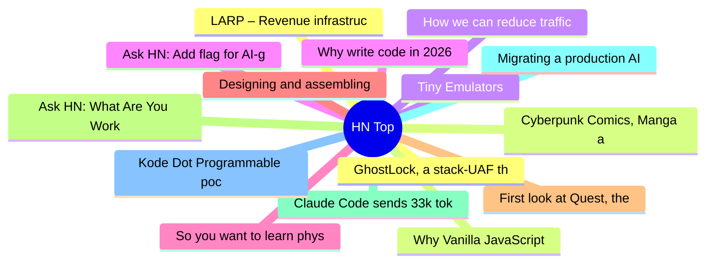

# HackerNews 每日 Top 30 (2026-07-13)

## 思维导图

## 列表（30 条）

### 1. GhostLock, a stack-UAF that has existed in all Linux distributions for 15 years
- **链接**: [https://nebusec.ai/research/ionstack-part-2/](https://nebusec.ai/research/ionstack-part-2/)
- **分数**: 146 | **评论**: 55 | **作者**: ranger_danger
- **HN 讨论**: https://news.ycombinator.com/item?id=48834309

### 2. Cyberpunk Comics, Manga and Graphic Novels
- **链接**: [https://shellzine.net/cyberpunk-comics/](https://shellzine.net/cyberpunk-comics/)
- **分数**: 119 | **评论**: 26 | **作者**: zdw
- **HN 讨论**: https://news.ycombinator.com/item?id=48885643

### 3. Tiny Emulators
- **链接**: [https://floooh.github.io/tiny8bit-preview/index.html](https://floooh.github.io/tiny8bit-preview/index.html)
- **分数**: 179 | **评论**: 10 | **作者**: naves
- **HN 讨论**: https://news.ycombinator.com/item?id=48884395

### 4. Ask HN: Add flag for AI-generated articles
- **链接**: [https://news.ycombinator.com/item?id=48886741](https://news.ycombinator.com/item?id=48886741)
- **分数**: 214 | **评论**: 143 | **作者**: levkk
- **HN 讨论**: https://news.ycombinator.com/item?id=48886741

### 5. So you want to learn physics (second edition, 2021)
- **链接**: [https://www.susanrigetti.com/physics](https://www.susanrigetti.com/physics)
- **分数**: 132 | **评论**: 19 | **作者**: azhenley
- **HN 讨论**: https://news.ycombinator.com/item?id=48827126

### 6. Designing and assembling my first PCB
- **链接**: [https://vilkeliskis.com/b/2026/0711.html](https://vilkeliskis.com/b/2026/0711.html)
- **分数**: 71 | **评论**: 25 | **作者**: tadasv
- **HN 讨论**: https://news.ycombinator.com/item?id=48885728

### 7. First look at Quest, the final ship of Antarctic explorer Shackleton
- **链接**: [https://www.cbc.ca/news/canada/quest-shipwreck-expedition-images-9.7262229](https://www.cbc.ca/news/canada/quest-shipwreck-expedition-images-9.7262229)
- **分数**: 12 | **评论**: 0 | **作者**: curmudgeon22
- **HN 讨论**: https://news.ycombinator.com/item?id=48831840

### 8. Ask HN: What Are You Working On? (July 2026)
- **链接**: [https://news.ycombinator.com/item?id=48884984](https://news.ycombinator.com/item?id=48884984)
- **分数**: 99 | **评论**: 292 | **作者**: david927
- **HN 讨论**: https://news.ycombinator.com/item?id=48884984

### 9. Claude Code sends 33k tokens before reading the prompt; OpenCode sends 7k
- **链接**: [https://systima.ai/blog/claude-code-vs-opencode-token-overhead](https://systima.ai/blog/claude-code-vs-opencode-token-overhead)
- **分数**: 503 | **评论**: 281 | **作者**: systima
- **HN 讨论**: https://news.ycombinator.com/item?id=48883275

### 10. Migrating a production AI agent to GPT-5.6: 2.2x faster, 27% cheaper
- **链接**: [https://ploy.ai/blog/migrating-a-production-ai-agent-to-gpt-5-6](https://ploy.ai/blog/migrating-a-production-ai-agent-to-gpt-5-6)
- **分数**: 160 | **评论**: 61 | **作者**: brryant
- **HN 讨论**: https://news.ycombinator.com/item?id=48882716

### 11. Kode Dot Programmable pocket device for makers, pentesters and geeks
- **链接**: [https://kode.diy](https://kode.diy)
- **分数**: 55 | **评论**: 14 | **作者**: iNic
- **HN 讨论**: https://news.ycombinator.com/item?id=48884992

### 12. LARP – Revenue infrastructure for serious founders
- **链接**: [https://www.larp.website/](https://www.larp.website/)
- **分数**: 183 | **评论**: 40 | **作者**: BerislavLopac
- **HN 讨论**: https://news.ycombinator.com/item?id=48882569

### 13. Why Vanilla JavaScript
- **链接**: [https://guseyn.com/html/posts/why-vanilla-js.html](https://guseyn.com/html/posts/why-vanilla-js.html)
- **分数**: 99 | **评论**: 54 | **作者**: guseyn
- **HN 讨论**: https://news.ycombinator.com/item?id=48885705

### 14. How we can reduce traffic congestion
- **链接**: [https://research.google/blog/the-power-of-collaboration-how-we-can-reduce-traffic-congestion/](https://research.google/blog/the-power-of-collaboration-how-we-can-reduce-traffic-congestion/)
- **分数**: 100 | **评论**: 116 | **作者**: raahelb
- **HN 讨论**: https://news.ycombinator.com/item?id=48881967

### 15. Why write code in 2026
- **链接**: [https://softwaredoug.com/blog/2026/07/09/write-code](https://softwaredoug.com/blog/2026/07/09/write-code)
- **分数**: 128 | **评论**: 167 | **作者**: softwaredoug
- **HN 讨论**: https://news.ycombinator.com/item?id=48861923

### 16. I Learned to Read Again
- **链接**: [https://substack.magazinenongrata.com/p/how-i-learned-to-read-again](https://substack.magazinenongrata.com/p/how-i-learned-to-read-again)
- **分数**: 117 | **评论**: 48 | **作者**: georgex7
- **HN 讨论**: https://news.ycombinator.com/item?id=48883238

### 17. Count Binface
- **链接**: [https://countbinface.com](https://countbinface.com)
- **分数**: 30 | **评论**: 7 | **作者**: mooreds
- **HN 讨论**: https://news.ycombinator.com/item?id=48887753

### 18. Vint Cerf, “father of the Internet”, is retiring
- **链接**: [https://techcrunch.com/2026/06/30/the-father-of-the-internet-is-finally-retiring/](https://techcrunch.com/2026/06/30/the-father-of-the-internet-is-finally-retiring/)
- **分数**: 289 | **评论**: 166 | **作者**: compiler-guy
- **HN 讨论**: https://news.ycombinator.com/item?id=48854168

### 19. Modernizing Property Tax Assessments in Allegheny County
- **链接**: [https://www.prohousingpgh.org/blog/new-report-modernizing-property-tax-assessments-in-allegheny-county](https://www.prohousingpgh.org/blog/new-report-modernizing-property-tax-assessments-in-allegheny-county)
- **分数**: 32 | **评论**: 18 | **作者**: mooreds
- **HN 讨论**: https://news.ycombinator.com/item?id=48886881

### 20. Automation Without Understanding
- **链接**: [https://arxiv.org/abs/2607.06377](https://arxiv.org/abs/2607.06377)
- **分数**: 104 | **评论**: 45 | **作者**: root-parent
- **HN 讨论**: https://news.ycombinator.com/item?id=48882554

### 21. Are you telling me a readonly property is wrecking my performance?
- **链接**: [https://shub.club/writings/2026/july/check-your-scrollheight/](https://shub.club/writings/2026/july/check-your-scrollheight/)
- **分数**: 3 | **评论**: 3 | **作者**: forthwall
- **HN 讨论**: https://news.ycombinator.com/item?id=48849983

### 22. Profiling the "Abundance" housing bottleneck with real data
- **链接**: [https://laxmena.com/same-capacity-less-throughput](https://laxmena.com/same-capacity-less-throughput)
- **分数**: 34 | **评论**: 22 | **作者**: laxmena
- **HN 讨论**: https://news.ycombinator.com/item?id=48885138

### 23. The four horsemen behind Postgres outages
- **链接**: [https://malisper.me/the-four-horsemen-behind-thousands-of-postgres-outages/](https://malisper.me/the-four-horsemen-behind-thousands-of-postgres-outages/)
- **分数**: 25 | **评论**: 11 | **作者**: craigkerstiens
- **HN 讨论**: https://news.ycombinator.com/item?id=48851069

### 24. Flash-MSA: Accelerating Million-Token Training with Sparse Attention Kernels
- **链接**: [https://nanduruganesh.github.io/flash-msa/](https://nanduruganesh.github.io/flash-msa/)
- **分数**: 31 | **评论**: 1 | **作者**: rawsh
- **HN 讨论**: https://news.ycombinator.com/item?id=48884618

### 25. Against Usefulness
- **链接**: [https://www.motivenotes.ai/p/against-usefulness](https://www.motivenotes.ai/p/against-usefulness)
- **分数**: 94 | **评论**: 24 | **作者**: supo
- **HN 讨论**: https://news.ycombinator.com/item?id=48882956

### 26. I love LLMs, I hate hype
- **链接**: [https://geohot.github.io//blog/jekyll/update/2026/07/12/i-love-llms.html](https://geohot.github.io//blog/jekyll/update/2026/07/12/i-love-llms.html)
- **分数**: 366 | **评论**: 227 | **作者**: therepanic
- **HN 讨论**: https://news.ycombinator.com/item?id=48883343

### 27. Mechanistic interpretability researchers applying causality theory to LLMs
- **链接**: [https://cacm.acm.org/news/can-we-understand-how-large-language-models-reason/](https://cacm.acm.org/news/can-we-understand-how-large-language-models-reason/)
- **分数**: 91 | **评论**: 66 | **作者**: adunk
- **HN 讨论**: https://news.ycombinator.com/item?id=48883090

### 28. Calculix: A Free Software Three-Dimensional Structural Finite Element Program
- **链接**: [https://www.calculix.de/](https://www.calculix.de/)
- **分数**: 10 | **评论**: 1 | **作者**: joebig
- **HN 讨论**: https://news.ycombinator.com/item?id=48852718

### 29. What xAI's Grok build CLI sends to xAI: A wire-level analysis
- **链接**: [https://gist.github.com/cereblab/dc9a40bc26120f4540e4e09b75ffb547](https://gist.github.com/cereblab/dc9a40bc26120f4540e4e09b75ffb547)
- **分数**: 423 | **评论**: 163 | **作者**: jhoho
- **HN 讨论**: https://news.ycombinator.com/item?id=48877371

### 30. How to read more books
- **链接**: [https://scotto.me/blog/2026-07-12-how-to-read-more-books/](https://scotto.me/blog/2026-07-12-how-to-read-more-books/)
- **分数**: 280 | **评论**: 159 | **作者**: silcoon
- **HN 讨论**: https://news.ycombinator.com/item?id=48882056
