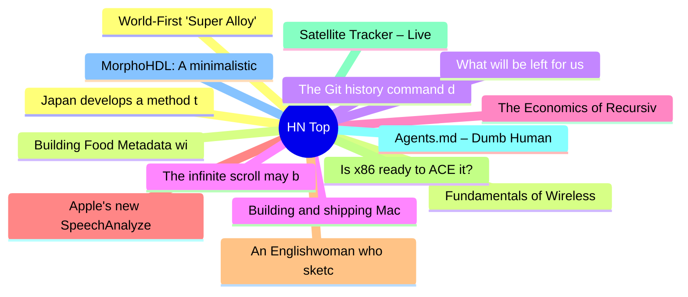

# HackerNews 每日 Top 30 (2026-07-14)

## 思维导图

## 列表（30 条）

### 1. Japan develops a method to recover up to 90% of lithium from used EV batteries
- **链接**: [https://tech.supercarblondie.com/japan-recovers-up-to-90-of-lithium-from-used-ev-batteries/](https://tech.supercarblondie.com/japan-recovers-up-to-90-of-lithium-from-used-ev-batteries/)
- **分数**: 115 | **评论**: 26 | **作者**: donohoe
- **HN 讨论**: https://news.ycombinator.com/item?id=48901569

### 2. Fundamentals of Wireless Communication
- **链接**: [https://web.stanford.edu/~dntse/wireless_book.html](https://web.stanford.edu/~dntse/wireless_book.html)
- **分数**: 63 | **评论**: 2 | **作者**: teleforce
- **HN 讨论**: https://news.ycombinator.com/item?id=48901454

### 3. The Git history command deserves more attention
- **链接**: [https://lalitm.com/post/git-history/](https://lalitm.com/post/git-history/)
- **分数**: 128 | **评论**: 83 | **作者**: turbocon
- **HN 讨论**: https://news.ycombinator.com/item?id=48901010

### 4. Building and shipping Mac and iOS apps without opening Xcode
- **链接**: [https://scottwillsey.com/building-and-shipping-mac-and-ios-apps-without-ever-opening-xcode/](https://scottwillsey.com/building-and-shipping-mac-and-ios-apps-without-ever-opening-xcode/)
- **分数**: 361 | **评论**: 157 | **作者**: speckx
- **HN 讨论**: https://news.ycombinator.com/item?id=48896665

### 5. The Economics of Recursive Self-Improvement [pdf]
- **链接**: [https://elasticity.institute/rsi-paper.pdf](https://elasticity.institute/rsi-paper.pdf)
- **分数**: 40 | **评论**: 1 | **作者**: apsec112
- **HN 讨论**: https://news.ycombinator.com/item?id=48901224

### 6. Apple's new SpeechAnalyzer API, benchmarked against Whisper and its predecessor
- **链接**: [https://get-inscribe.com/blog/apple-speech-api-benchmark.html](https://get-inscribe.com/blog/apple-speech-api-benchmark.html)
- **分数**: 492 | **评论**: 195 | **作者**: get-inscribe
- **HN 讨论**: https://news.ycombinator.com/item?id=48894752

### 7. An Englishwoman who sketched India before photography took hold
- **链接**: [https://www.bbc.com/news/articles/cm2drrv6q54o](https://www.bbc.com/news/articles/cm2drrv6q54o)
- **分数**: 85 | **评论**: 23 | **作者**: 1659447091
- **HN 讨论**: https://news.ycombinator.com/item?id=48900191

### 8. Is x86 ready to ACE it?
- **链接**: [https://chipsandcheese.com/p/is-x86-ready-to-ace-it](https://chipsandcheese.com/p/is-x86-ready-to-ace-it)
- **分数**: 27 | **评论**: 1 | **作者**: mfiguiere
- **HN 讨论**: https://news.ycombinator.com/item?id=48901235

### 9. Satellite Tracker – Live Map of Starlink and 30k Satellites
- **链接**: [https://satellitemap.space/](https://satellitemap.space/)
- **分数**: 26 | **评论**: 5 | **作者**: rolph
- **HN 讨论**: https://news.ycombinator.com/item?id=48901356

### 10. Agents.md – Dumb Human
- **链接**: [https://gist.github.com/skorotkiewicz/2d4db4ceaf83aa54eb7f2066fdb961ff](https://gist.github.com/skorotkiewicz/2d4db4ceaf83aa54eb7f2066fdb961ff)
- **分数**: 24 | **评论**: 3 | **作者**: modinfo
- **HN 讨论**: https://news.ycombinator.com/item?id=48901695

### 11. MorphoHDL: A minimalistic language for growing circuits
- **链接**: [https://paradigms-of-intelligence.github.io/morpho/](https://paradigms-of-intelligence.github.io/morpho/)
- **分数**: 37 | **评论**: 1 | **作者**: jacktang
- **HN 讨论**: https://news.ycombinator.com/item?id=48901126

### 12. World-First 'Super Alloy' Could Transform the Way Metals Are Made
- **链接**: [https://www.sciencealert.com/world-first-super-alloy-could-transform-the-way-metals-are-made](https://www.sciencealert.com/world-first-super-alloy-could-transform-the-way-metals-are-made)
- **分数**: 31 | **评论**: 16 | **作者**: tejohnso
- **HN 讨论**: https://news.ycombinator.com/item?id=48853146

### 13. Building Food Metadata with LLM Juries
- **链接**: [https://careersatdoordash.com/blog/building-food-metadata-with-llm-juries-context-optimization-multimodal-ai/](https://careersatdoordash.com/blog/building-food-metadata-with-llm-juries-context-optimization-multimodal-ai/)
- **分数**: 19 | **评论**: 3 | **作者**: tie-in
- **HN 讨论**: https://news.ycombinator.com/item?id=48901275

### 14. What will be left for us to work on?
- **链接**: [https://www.normaltech.ai/p/what-will-be-left-for-us-to-work](https://www.normaltech.ai/p/what-will-be-left-for-us-to-work)
- **分数**: 66 | **评论**: 63 | **作者**: randomwalker
- **HN 讨论**: https://news.ycombinator.com/item?id=48901292

### 15. The infinite scroll may become endangered if controversial Calif. law passes
- **链接**: [https://www.sfgate.com/politics/article/meta-social-media-teenagers-22337724.php](https://www.sfgate.com/politics/article/meta-social-media-teenagers-22337724.php)
- **分数**: 121 | **评论**: 199 | **作者**: Stratoscope
- **HN 讨论**: https://news.ycombinator.com/item?id=48897104

### 16. Our Amish Language
- **链接**: [https://www.thedial.world/articles/news/amish-pennsylvania-dutch](https://www.thedial.world/articles/news/amish-pennsylvania-dutch)
- **分数**: 8 | **评论**: 0 | **作者**: NaOH
- **HN 讨论**: https://news.ycombinator.com/item?id=48901645

### 17. How to build a circular LCD clock
- **链接**: [https://blinry.org/lcd-clock/](https://blinry.org/lcd-clock/)
- **分数**: 5 | **评论**: 0 | **作者**: birdculture
- **HN 讨论**: https://news.ycombinator.com/item?id=48872833

### 18. Turn your singing voice into printable notes (in the browser)
- **链接**: [https://om-intelligence.ch/projects/vocal-notation/vocal-notation.html](https://om-intelligence.ch/projects/vocal-notation/vocal-notation.html)
- **分数**: 33 | **评论**: 13 | **作者**: busssard
- **HN 讨论**: https://news.ycombinator.com/item?id=48900686

### 19. The art and engineering of Sega CD Silpheed
- **链接**: [https://fabiensanglard.net/silpheed/index.html](https://fabiensanglard.net/silpheed/index.html)
- **分数**: 236 | **评论**: 50 | **作者**: ibobev
- **HN 讨论**: https://news.ycombinator.com/item?id=48893639

### 20. Show HN: Sx 2.0 – Share AI skills with your team through a Dropbox folder
- **链接**: [https://sleuth-io.github.io/sx/2026/07/10/your-dropbox-is-now-a-skill-server.html](https://sleuth-io.github.io/sx/2026/07/10/your-dropbox-is-now-a-skill-server.html)
- **分数**: 25 | **评论**: 25 | **作者**: detkin
- **HN 讨论**: https://news.ycombinator.com/item?id=48900319

### 21. SalesPatriot (YC W25) Is Hiring Full Stack Engineers (SF)
- **链接**: [https://jobs.ashbyhq.com/SalesPatriot/df223727-5781-433e-bc75-2aa5bf8dc8d7](https://jobs.ashbyhq.com/SalesPatriot/df223727-5781-433e-bc75-2aa5bf8dc8d7)
- **分数**: 1 | **评论**: 0 | **作者**: maciejSz
- **HN 讨论**: https://news.ycombinator.com/item?id=48898814

### 22. Show HN: Hackney – Compare Uber, Lyft, Waymo, and Robotaxi Prices
- **链接**: [https://hackney.app/](https://hackney.app/)
- **分数**: 39 | **评论**: 29 | **作者**: griffinli
- **HN 讨论**: https://news.ycombinator.com/item?id=48893550

### 23. Linux on the Sega 32X. Who needs hardware synchronization primitives anyway?
- **链接**: [https://cakehonolulu.github.io/linux-on-32x/](https://cakehonolulu.github.io/linux-on-32x/)
- **分数**: 110 | **评论**: 22 | **作者**: cakehonolulu
- **HN 讨论**: https://news.ycombinator.com/item?id=48896600

### 24. Show HN: YouTube Guitar Tab Parser
- **链接**: [https://github.com/marcelpanse/youtube-guitar-tab-parser](https://github.com/marcelpanse/youtube-guitar-tab-parser)
- **分数**: 86 | **评论**: 56 | **作者**: neogenix
- **HN 讨论**: https://news.ycombinator.com/item?id=48898154

### 25. Show HN: RandoFont – A browser for Google Fonts
- **链接**: [https://randofont.alesh.com](https://randofont.alesh.com)
- **分数**: 29 | **评论**: 5 | **作者**: aleshh
- **HN 讨论**: https://news.ycombinator.com/item?id=48852144

### 26. Show HN: Jacquard, a programming language for AI-written, human-reviewed code
- **链接**: [https://github.com/jbwinters/jacquard-lang](https://github.com/jbwinters/jacquard-lang)
- **分数**: 65 | **评论**: 36 | **作者**: jbwinters
- **HN 讨论**: https://news.ycombinator.com/item?id=48894630

### 27. Success may not matter if you aren't doing what you love
- **链接**: [https://12gramsofcarbon.com/p/founders-guide-success-may-not-matter](https://12gramsofcarbon.com/p/founders-guide-success-may-not-matter)
- **分数**: 55 | **评论**: 18 | **作者**: theahura
- **HN 讨论**: https://news.ycombinator.com/item?id=48900790

### 28. A Study of Microsoft's Early 2026 Rollout of Claude Code and GitHub Copilot CLI
- **链接**: [https://arxiv.org/abs/2607.01418](https://arxiv.org/abs/2607.01418)
- **分数**: 44 | **评论**: 23 | **作者**: softwaredoug
- **HN 讨论**: https://news.ycombinator.com/item?id=48899321

### 29. Show HN: I implemented a neural network in SQL
- **链接**: [https://github.com/xqlsystems/xarray-sql/blob/claude/xarray-sql-mnist-demo/benchmarks/nn.py](https://github.com/xqlsystems/xarray-sql/blob/claude/xarray-sql-mnist-demo/benchmarks/nn.py)
- **分数**: 67 | **评论**: 14 | **作者**: alxmrs
- **HN 讨论**: https://news.ycombinator.com/item?id=48897975

### 30. Ancient Roman Board Game
- **链接**: [https://ludus-coriovalli.web.app/](https://ludus-coriovalli.web.app/)
- **分数**: 102 | **评论**: 40 | **作者**: nobody9999
- **HN 讨论**: https://news.ycombinator.com/item?id=48852159
