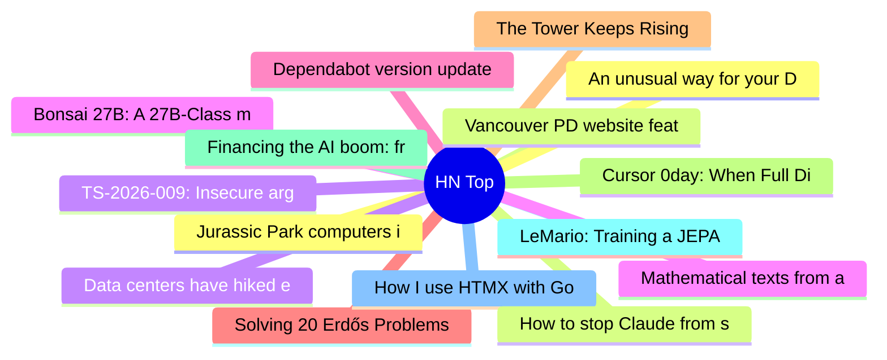

# HackerNews 每日 Top 30 (2026-07-15)

## 思维导图

## 列表（30 条）

### 1. Jurassic Park computers in excruciating detail
- **链接**: [https://fabiensanglard.net/jurrasic_park_computers/index.html](https://fabiensanglard.net/jurrasic_park_computers/index.html)
- **分数**: 70 | **评论**: 20 | **作者**: vinhnx
- **HN 讨论**: https://news.ycombinator.com/item?id=48915709

### 2. Vancouver PD website features Quick Escape button that wipes itself from history
- **链接**: [https://vpd.ca/](https://vpd.ca/)
- **分数**: 183 | **评论**: 70 | **作者**: LookAtThatBacon
- **HN 讨论**: https://news.ycombinator.com/item?id=48914644

### 3. TS-2026-009: Insecure argument handling in Tailscale SSH permitted root access
- **链接**: [https://tailscale.com/security-bulletins](https://tailscale.com/security-bulletins)
- **分数**: 75 | **评论**: 33 | **作者**: jervant
- **HN 讨论**: https://news.ycombinator.com/item?id=48915004

### 4. Bonsai 27B: A 27B-Class model that runs on a phone
- **链接**: [https://prismml.com/news/bonsai-27b](https://prismml.com/news/bonsai-27b)
- **分数**: 491 | **评论**: 182 | **作者**: xenova
- **HN 讨论**: https://news.ycombinator.com/item?id=48910545

### 5. Dependabot version updates introduce default package cooldown
- **链接**: [https://github.blog/changelog/2026-07-14-dependabot-version-updates-introduce-default-package-cooldown/](https://github.blog/changelog/2026-07-14-dependabot-version-updates-introduce-default-package-cooldown/)
- **分数**: 132 | **评论**: 80 | **作者**: woodruffw
- **HN 讨论**: https://news.ycombinator.com/item?id=48913050

### 6. Solving 20 Erdős Problems with 20 Codex Accounts Running in Parallel
- **链接**: [https://www.starfleetmath.com/](https://www.starfleetmath.com/)
- **分数**: 76 | **评论**: 22 | **作者**: colin7snyder
- **HN 讨论**: https://news.ycombinator.com/item?id=48914646

### 7. The Tower Keeps Rising
- **链接**: [https://lucumr.pocoo.org/2026/7/13/the-tower-keeps-rising/](https://lucumr.pocoo.org/2026/7/13/the-tower-keeps-rising/)
- **分数**: 394 | **评论**: 177 | **作者**: cdrnsf
- **HN 讨论**: https://news.ycombinator.com/item?id=48909785

### 8. Cursor 0day: When Full Disclosure Becomes the Only Protection Left
- **链接**: [https://mindgard.ai/blog/cursor-0day-when-full-disclosure-becomes-the-only-protection-left](https://mindgard.ai/blog/cursor-0day-when-full-disclosure-becomes-the-only-protection-left)
- **分数**: 296 | **评论**: 136 | **作者**: Synthetic7346
- **HN 讨论**: https://news.ycombinator.com/item?id=48910676

### 9. Financing the AI boom: from cash flows to debt [pdf]
- **链接**: [https://www.bis.org/publ/bisbull120.pdf](https://www.bis.org/publ/bisbull120.pdf)
- **分数**: 115 | **评论**: 65 | **作者**: 1vuio0pswjnm7
- **HN 讨论**: https://news.ycombinator.com/item?id=48913443

### 10. LeMario: Training a JEPA World Model on Super Mario Bros
- **链接**: [https://www.benjamin-bai.com/projects/lemario](https://www.benjamin-bai.com/projects/lemario)
- **分数**: 68 | **评论**: 9 | **作者**: kevinjosethomas
- **HN 讨论**: https://news.ycombinator.com/item?id=48913763

### 11. How I use HTMX with Go
- **链接**: [https://www.alexedwards.net/blog/how-i-use-htmx-with-go](https://www.alexedwards.net/blog/how-i-use-htmx-with-go)
- **分数**: 150 | **评论**: 37 | **作者**: gnabgib
- **HN 讨论**: https://news.ycombinator.com/item?id=48912175

### 12. An unusual way for your DHCP server to run out of dynamic IPs
- **链接**: [https://utcc.utoronto.ca/~cks/space/blog/sysadmin/DHCPServerAndScreamingHost](https://utcc.utoronto.ca/~cks/space/blog/sysadmin/DHCPServerAndScreamingHost)
- **分数**: 39 | **评论**: 7 | **作者**: speckx
- **HN 讨论**: https://news.ycombinator.com/item?id=48862351

### 13. How to stop Claude from saying load-bearing
- **链接**: [https://jola.dev/posts/how-to-stop-claude-from-saying-load-bearing](https://jola.dev/posts/how-to-stop-claude-from-saying-load-bearing)
- **分数**: 463 | **评论**: 519 | **作者**: shintoist
- **HN 讨论**: https://news.ycombinator.com/item?id=48905248

### 14. Data centers have hiked electricity prices on the public by $23B
- **链接**: [https://fortune.com/2026/07/14/data-centers-23-billion-electricity-bills/](https://fortune.com/2026/07/14/data-centers-23-billion-electricity-bills/)
- **分数**: 122 | **评论**: 69 | **作者**: measurablefunc
- **HN 讨论**: https://news.ycombinator.com/item?id=48914683

### 15. Mathematical texts from a Maya site in Guatemala identify an ancient astronomer
- **链接**: [https://www.nature.com/articles/d41586-026-02170-8](https://www.nature.com/articles/d41586-026-02170-8)
- **分数**: 61 | **评论**: 16 | **作者**: homarp
- **HN 讨论**: https://news.ycombinator.com/item?id=48905183

### 16. The Trade in Looted Antiquities Endures for One Reason: Demand
- **链接**: [https://news.artnet.com/art-world/matt-campbell-cambodia-looted-antiquities-2779870](https://news.artnet.com/art-world/matt-campbell-cambodia-looted-antiquities-2779870)
- **分数**: 7 | **评论**: 1 | **作者**: derbOac
- **HN 讨论**: https://news.ycombinator.com/item?id=48882608

### 17. Microsoft Patches a Record 570 Security Flaws
- **链接**: [https://krebsonsecurity.com/2026/07/microsoft-patches-a-record-570-security-flaws/](https://krebsonsecurity.com/2026/07/microsoft-patches-a-record-570-security-flaws/)
- **分数**: 63 | **评论**: 30 | **作者**: robin_reala
- **HN 讨论**: https://news.ycombinator.com/item?id=48913190

### 18. I'm a USB-C Maximalist
- **链接**: [https://shkspr.mobi/blog/2026/07/im-a-usb-c-maximalist/](https://shkspr.mobi/blog/2026/07/im-a-usb-c-maximalist/)
- **分数**: 206 | **评论**: 305 | **作者**: speckx
- **HN 讨论**: https://news.ycombinator.com/item?id=48908214

### 19. The largest available Minecraft world, totalling 15 TB
- **链接**: [https://2b2t.place/1million](https://2b2t.place/1million)
- **分数**: 180 | **评论**: 61 | **作者**: _____k
- **HN 讨论**: https://news.ycombinator.com/item?id=48872401

### 20. Andon (manufacturing)
- **链接**: [https://en.wikipedia.org/wiki/Andon_(manufacturing)](https://en.wikipedia.org/wiki/Andon_(manufacturing))
- **分数**: 3 | **评论**: 0 | **作者**: tony
- **HN 讨论**: https://news.ycombinator.com/item?id=48875188

### 21. The kids with phones are alright
- **链接**: [https://heatherburns.tech/2026/07/08/the-kids-with-phones-are-alright/](https://heatherburns.tech/2026/07/08/the-kids-with-phones-are-alright/)
- **分数**: 158 | **评论**: 110 | **作者**: JumpCrisscross
- **HN 讨论**: https://news.ycombinator.com/item?id=48870217

### 22. Probably check on your smart appliances
- **链接**: [https://xeiaso.net/notes/2026/check-your-smart-tv/](https://xeiaso.net/notes/2026/check-your-smart-tv/)
- **分数**: 44 | **评论**: 15 | **作者**: xena
- **HN 讨论**: https://news.ycombinator.com/item?id=48913457

### 23. The Estranged Worlds of J. G. Ballard
- **链接**: [https://lareviewofbooks.org/article/jg-ballard-illuminated-man-christopher-priest-nina-allan/](https://lareviewofbooks.org/article/jg-ballard-illuminated-man-christopher-priest-nina-allan/)
- **分数**: 45 | **评论**: 9 | **作者**: Caiero
- **HN 讨论**: https://news.ycombinator.com/item?id=48899473

### 24. Guardian Angels: LLM Personalization for Productivity and Security
- **链接**: [https://gwern.net/guardian-angel](https://gwern.net/guardian-angel)
- **分数**: 72 | **评论**: 13 | **作者**: andsoitis
- **HN 讨论**: https://news.ycombinator.com/item?id=48906041

### 25. The zero-cost fallacy: open-source software in the agentic era
- **链接**: [https://www.thoughtworks.com/insights/blog/open-source/zero-cost-fallacy-open-source-agentic-era](https://www.thoughtworks.com/insights/blog/open-source/zero-cost-fallacy-open-source-agentic-era)
- **分数**: 121 | **评论**: 98 | **作者**: backlit4034
- **HN 讨论**: https://news.ycombinator.com/item?id=48865001

### 26. Ambient Website Background Clouds
- **链接**: [https://github.com/paradise-runner/background-clouds](https://github.com/paradise-runner/background-clouds)
- **分数**: 13 | **评论**: 2 | **作者**: dividedcomet
- **HN 讨论**: https://news.ycombinator.com/item?id=48854431

### 27. Show HN: Juggler – an open-source GUI coding agent, by the creator of JUCE
- **链接**: [https://github.com/juggler-ai/juggler](https://github.com/juggler-ai/juggler)
- **分数**: 202 | **评论**: 83 | **作者**: julesrms
- **HN 讨论**: https://news.ycombinator.com/item?id=48883305

### 28. Are we offloading too much of our thinking to AI?
- **链接**: [https://www.artfish.ai/p/offloading-thinking-to-ai](https://www.artfish.ai/p/offloading-thinking-to-ai)
- **分数**: 404 | **评论**: 401 | **作者**: yenniejun111
- **HN 讨论**: https://news.ycombinator.com/item?id=48908178

### 29. Kontigo (YC S24) Is Hiring (Head of Security)
- **链接**: [https://www.ycombinator.com/companies/kontigo/jobs/uNttrlv-head-of-security](https://www.ycombinator.com/companies/kontigo/jobs/uNttrlv-head-of-security)
- **分数**: 1 | **评论**: 0 | **作者**: jecastillof
- **HN 讨论**: https://news.ycombinator.com/item?id=48909820

### 30. Show HN: Opening lines of famous literary works
- **链接**: [https://www.verbaprima.com/](https://www.verbaprima.com/)
- **分数**: 152 | **评论**: 89 | **作者**: plicerin
- **HN 讨论**: https://news.ycombinator.com/item?id=48908271
