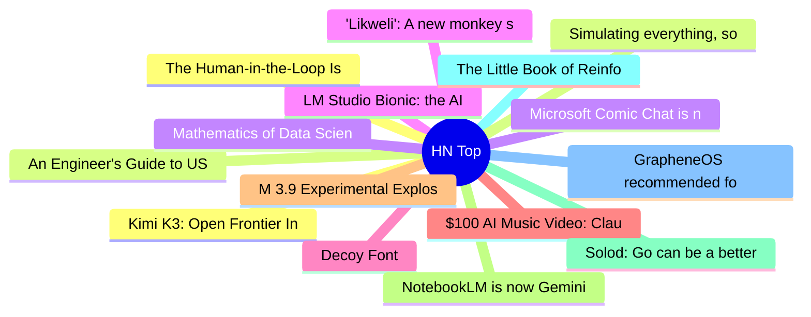

# HackerNews 每日 Top 30 (2026-07-17)

## 思维导图

## 列表（30 条）

### 1. Kimi K3: Open Frontier Intelligence
- **链接**: [https://www.kimi.com/blog/kimi-k3](https://www.kimi.com/blog/kimi-k3)
- **分数**: 1331 | **评论**: 824 | **作者**: vincent_s
- **HN 讨论**: https://news.ycombinator.com/item?id=48935342

### 2. An Engineer's Guide to USB Typе-С (2024)
- **链接**: [https://www.ti.com/lit/eb/slyy228/slyy228.pdf?ts=1759892558029](https://www.ti.com/lit/eb/slyy228/slyy228.pdf?ts=1759892558029)
- **分数**: 40 | **评论**: 1 | **作者**: gregsadetsky
- **HN 讨论**: https://news.ycombinator.com/item?id=48862165

### 3. Microsoft Comic Chat is now open source
- **链接**: [https://opensource.microsoft.com/blog/2026/07/16/microsoft-comic-chat-is-now-open-source/](https://opensource.microsoft.com/blog/2026/07/16/microsoft-comic-chat-is-now-open-source/)
- **分数**: 594 | **评论**: 130 | **作者**: jervant
- **HN 讨论**: https://news.ycombinator.com/item?id=48936426

### 4. LM Studio Bionic: the AI agent for open models
- **链接**: [https://lmstudio.ai/blog/introducing-lm-studio-bionic](https://lmstudio.ai/blog/introducing-lm-studio-bionic)
- **分数**: 189 | **评论**: 69 | **作者**: minimaxir
- **HN 讨论**: https://news.ycombinator.com/item?id=48939662

### 5. Decoy Font
- **链接**: [https://www.mixfont.com/experiments/decoy-font](https://www.mixfont.com/experiments/decoy-font)
- **分数**: 461 | **评论**: 109 | **作者**: ray__
- **HN 讨论**: https://news.ycombinator.com/item?id=48936584

### 6. $100 AI Music Video: Claude Fable 5 vs. GPT-5.6 Sol
- **链接**: [https://www.tryai.dev/blog/ai-music-video-arena-claude-vs-gpt-5.6](https://www.tryai.dev/blog/ai-music-video-arena-claude-vs-gpt-5.6)
- **分数**: 178 | **评论**: 209 | **作者**: hershyb_
- **HN 讨论**: https://news.ycombinator.com/item?id=48939524

### 7. M 3.9 Experimental Explosion – 147 Km ENE of Ponce Inlet, Florida
- **链接**: [https://earthquake.usgs.gov/earthquakes/eventpage/us7000t13l/executive](https://earthquake.usgs.gov/earthquakes/eventpage/us7000t13l/executive)
- **分数**: 47 | **评论**: 17 | **作者**: hnburnsy
- **HN 讨论**: https://news.ycombinator.com/item?id=48942125

### 8. NotebookLM is now Gemini Notebook
- **链接**: [https://blog.google/innovation-and-ai/products/gemini-notebook/notebooklm-gemini-notebook/](https://blog.google/innovation-and-ai/products/gemini-notebook/notebooklm-gemini-notebook/)
- **分数**: 274 | **评论**: 138 | **作者**: xnx
- **HN 讨论**: https://news.ycombinator.com/item?id=48936451

### 9. Solod: Go can be a better C
- **链接**: [https://solod.dev](https://solod.dev)
- **分数**: 74 | **评论**: 17 | **作者**: koeng
- **HN 讨论**: https://news.ycombinator.com/item?id=48895199

### 10. The Little Book of Reinforcement Learning
- **链接**: [https://github.com/alxndrTL/little-book-rl/](https://github.com/alxndrTL/little-book-rl/)
- **分数**: 77 | **评论**: 10 | **作者**: mustaphah
- **HN 讨论**: https://news.ycombinator.com/item?id=48941104

### 11. GrapheneOS recommended for domestic abuse victims
- **链接**: [https://privacypros.com.au/privacy-hub/articles/dv-safe-phone-australia/](https://privacypros.com.au/privacy-hub/articles/dv-safe-phone-australia/)
- **分数**: 19 | **评论**: 9 | **作者**: aussieguy1234
- **HN 讨论**: https://news.ycombinator.com/item?id=48942454

### 12. The Human-in-the-Loop Is Tired
- **链接**: [https://pydantic.dev/articles/the-human-in-the-loop-is-tired](https://pydantic.dev/articles/the-human-in-the-loop-is-tired)
- **分数**: 72 | **评论**: 38 | **作者**: haritha1313
- **HN 讨论**: https://news.ycombinator.com/item?id=48942000

### 13. Simulating everything, sort of: The promise and limits of world models
- **链接**: [https://arstechnica.com/ai/2026/07/simulating-everything-sort-of-the-promise-and-limits-of-world-models/](https://arstechnica.com/ai/2026/07/simulating-everything-sort-of-the-promise-and-limits-of-world-models/)
- **分数**: 17 | **评论**: 1 | **作者**: LorenDB
- **HN 讨论**: https://news.ycombinator.com/item?id=48896044

### 14. Mathematics of Data Science
- **链接**: [https://arxiv.org/abs/2607.11938](https://arxiv.org/abs/2607.11938)
- **分数**: 118 | **评论**: 3 | **作者**: Anon84
- **HN 讨论**: https://news.ycombinator.com/item?id=48939896

### 15. 'Likweli': A new monkey species discovered in the Congo Basin
- **链接**: [https://news.yale.edu/2026/07/15/meet-likweli-new-monkey-species-discovered-congo-basin](https://news.yale.edu/2026/07/15/meet-likweli-new-monkey-species-discovered-congo-basin)
- **分数**: 60 | **评论**: 10 | **作者**: gmays
- **HN 讨论**: https://news.ycombinator.com/item?id=48940833

### 16. Old Icons
- **链接**: [https://leancrew.com/all-this/2026/07/old-icons/](https://leancrew.com/all-this/2026/07/old-icons/)
- **分数**: 18 | **评论**: 0 | **作者**: zdw
- **HN 讨论**: https://news.ycombinator.com/item?id=48877137

### 17. How Our Rust-to-Zig Rewrite Is Going
- **链接**: [https://rtfeldman.com/rust-to-zig](https://rtfeldman.com/rust-to-zig)
- **分数**: 440 | **评论**: 232 | **作者**: jorangreef
- **HN 讨论**: https://news.ycombinator.com/item?id=48933149

### 18. Helium escaping from atmosphere of nearby rocky exoplanet in a habitable zone
- **链接**: [https://www.science.org/doi/10.1126/science.aea9708](https://www.science.org/doi/10.1126/science.aea9708)
- **分数**: 81 | **评论**: 20 | **作者**: anyonecancode
- **HN 讨论**: https://news.ycombinator.com/item?id=48939742

### 19. Detecting LLM-Generated Texts with “Classical” Machine Learning
- **链接**: [https://blog.lyc8503.net/en/post/llm-classifier/](https://blog.lyc8503.net/en/post/llm-classifier/)
- **分数**: 169 | **评论**: 117 | **作者**: uneven9434
- **HN 讨论**: https://news.ycombinator.com/item?id=48936880

### 20. Immersive Linear Algebra Book with Interactive Figures (2015)
- **链接**: [https://immersivemath.com/ila/](https://immersivemath.com/ila/)
- **分数**: 181 | **评论**: 26 | **作者**: srean
- **HN 讨论**: https://news.ycombinator.com/item?id=48935951

### 21. Ring-Zero: Scaling Zero RL to a Trillion Parameters for Emergent Reasoning
- **链接**: [https://arxiv.org/abs/2607.12395](https://arxiv.org/abs/2607.12395)
- **分数**: 41 | **评论**: 14 | **作者**: binyu
- **HN 讨论**: https://news.ycombinator.com/item?id=48940603

### 22. Show HN: Clx – Compile Lua to Native Executables Through C++20
- **链接**: [https://github.com/samyeyo/clx](https://github.com/samyeyo/clx)
- **分数**: 97 | **评论**: 6 | **作者**: _samt_
- **HN 讨论**: https://news.ycombinator.com/item?id=48871547

### 23. Pseudpocalypse
- **链接**: [https://dynomight.net/pseudpocalypse/](https://dynomight.net/pseudpocalypse/)
- **分数**: 100 | **评论**: 55 | **作者**: surprisetalk
- **HN 讨论**: https://news.ycombinator.com/item?id=48908886

### 24. Show HN: Mojibake – A low-level Unicode library written in C
- **链接**: [https://mojibake.zaerl.com/](https://mojibake.zaerl.com/)
- **分数**: 49 | **评论**: 7 | **作者**: program
- **HN 讨论**: https://news.ycombinator.com/item?id=48941123

### 25. Abstracting Effects with Continuations
- **链接**: [https://crowdhailer.me/2026-07-15/abstracting-effects-with-continuations/](https://crowdhailer.me/2026-07-15/abstracting-effects-with-continuations/)
- **分数**: 47 | **评论**: 0 | **作者**: crowdhailer
- **HN 讨论**: https://news.ycombinator.com/item?id=48932722

### 26. CVE-2026-25089: FortiSandbox unauthenticated command injection added to CISA KEV
- **链接**: [https://hellorecon.com/blog/cve-2026-25089](https://hellorecon.com/blog/cve-2026-25089)
- **分数**: 30 | **评论**: 0 | **作者**: slvnx
- **HN 讨论**: https://news.ycombinator.com/item?id=48940895

### 27. How to Train a Gen AI Kick Drum Model on Your Old Linux Desktop with 6GB VRAM
- **链接**: [https://www.zhinit.dev/blog/training-a-kick-drum-diffusion-model](https://www.zhinit.dev/blog/training-a-kick-drum-diffusion-model)
- **分数**: 109 | **评论**: 55 | **作者**: zhinit
- **HN 讨论**: https://news.ycombinator.com/item?id=48935687

### 28. Adaptional (YC S25) Is Hiring
- **链接**: [https://www.ycombinator.com/companies/adaptional/jobs](https://www.ycombinator.com/companies/adaptional/jobs)
- **分数**: 1 | **评论**: 0 | **作者**: acesohc
- **HN 讨论**: https://news.ycombinator.com/item?id=48937125

### 29. Goes-19 weather satellite enters Safe Hold mode
- **链接**: [https://www.spaceweather.gov/news/goes-19-safe-hold](https://www.spaceweather.gov/news/goes-19-safe-hold)
- **分数**: 157 | **评论**: 79 | **作者**: yabones
- **HN 讨论**: https://news.ycombinator.com/item?id=48934286

### 30. The LLM Critics Are Right. I Use LLMs Anyway
- **链接**: [https://www.theocharis.dev/blog/llm-critics-are-right-i-use-llms-anyway/](https://www.theocharis.dev/blog/llm-critics-are-right-i-use-llms-anyway/)
- **分数**: 206 | **评论**: 209 | **作者**: JeremyTheo
- **HN 讨论**: https://news.ycombinator.com/item?id=48933310
