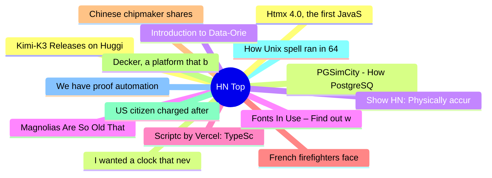

# HackerNews 每日 Top 30 (2026-07-27)

## 思维导图

## 列表（30 条）

### 1. Kimi-K3 Releases on HuggingFace 7/27
- **链接**: [https://huggingface.co/moonshotai/Kimi-K3](https://huggingface.co/moonshotai/Kimi-K3)
- **分数**: 363 | **评论**: 156 | **作者**: nateb2022
- **HN 讨论**: https://news.ycombinator.com/item?id=49065752

### 2. PGSimCity - How PostgreSQL Works
- **链接**: [https://nikolays.github.io/PGSimCity/](https://nikolays.github.io/PGSimCity/)
- **分数**: 639 | **评论**: 62 | **作者**: jonbaer
- **HN 讨论**: https://news.ycombinator.com/item?id=49063754

### 3. Show HN: Physically accurate black hole you can put in your room
- **链接**: [https://blackhole.plav.in](https://blackhole.plav.in)
- **分数**: 330 | **评论**: 100 | **作者**: aplavin
- **HN 讨论**: https://news.ycombinator.com/item?id=49021270

### 4. Magnolias Are So Old That They're Pollinated by Beetles, Not Bees
- **链接**: [https://mymodernmet.com/magnolia-ancient-flowers-beetles/](https://mymodernmet.com/magnolia-ancient-flowers-beetles/)
- **分数**: 36 | **评论**: 13 | **作者**: speckx
- **HN 讨论**: https://news.ycombinator.com/item?id=49009706

### 5. Scriptc by Vercel: TypeScript-to-Native compiler, no JavaScript engine in binary
- **链接**: [https://github.com/vercel-labs/scriptc](https://github.com/vercel-labs/scriptc)
- **分数**: 194 | **评论**: 101 | **作者**: maxloh
- **HN 讨论**: https://news.ycombinator.com/item?id=49063175

### 6. French firefighters face 'pyrocumulonimbus' for first time
- **链接**: [https://www.france24.com/en/live-news/20260726-french-firefighters-face-pyrocumulonimbus-for-first-time](https://www.france24.com/en/live-news/20260726-french-firefighters-face-pyrocumulonimbus-for-first-time)
- **分数**: 393 | **评论**: 268 | **作者**: saaaaaam
- **HN 讨论**: https://news.ycombinator.com/item?id=49060495

### 7. Chinese chipmaker shares surge 470%
- **链接**: [https://www.bbc.com/news/articles/c9q9w3x9qn2o](https://www.bbc.com/news/articles/c9q9w3x9qn2o)
- **分数**: 30 | **评论**: 13 | **作者**: pingou
- **HN 讨论**: https://news.ycombinator.com/item?id=49066962

### 8. Decker, a platform that builds on the legacy of Hypercard and classic macOS
- **链接**: [https://beyondloom.com/decker/](https://beyondloom.com/decker/)
- **分数**: 318 | **评论**: 74 | **作者**: tosh
- **HN 讨论**: https://news.ycombinator.com/item?id=49060856

### 9. US citizen charged after GrapheneOS phone wipes during airport search
- **链接**: [https://www.techspot.com/news/113236-us-prosecutors-charge-atlanta-man-after-grapheneos-phone.html](https://www.techspot.com/news/113236-us-prosecutors-charge-atlanta-man-after-grapheneos-phone.html)
- **分数**: 813 | **评论**: 609 | **作者**: eecc
- **HN 讨论**: https://news.ycombinator.com/item?id=49063022

### 10. How Unix spell ran in 64 kB of RAM
- **链接**: [https://blog.codingconfessions.com/p/how-unix-spell-ran-in-64kb-ram](https://blog.codingconfessions.com/p/how-unix-spell-ran-in-64kb-ram)
- **分数**: 31 | **评论**: 2 | **作者**: donw
- **HN 讨论**: https://news.ycombinator.com/item?id=49066750

### 11. We have proof automation now
- **链接**: [https://www.imperialviolet.org/2026/07/26/zstd-lean.html](https://www.imperialviolet.org/2026/07/26/zstd-lean.html)
- **分数**: 178 | **评论**: 65 | **作者**: zdw
- **HN 讨论**: https://news.ycombinator.com/item?id=49062291

### 12. Htmx 4.0, the first JavaScript library to release exclusively on the Game Boy
- **链接**: [https://swag.htmx.org/en-cad/products/htmx-4-the-game](https://swag.htmx.org/en-cad/products/htmx-4-the-game)
- **分数**: 462 | **评论**: 154 | **作者**: rcy
- **HN 讨论**: https://news.ycombinator.com/item?id=49057241

### 13. I wanted a clock that never needed setting. Things escalated
- **链接**: [https://arstechnica.com/gadgets/2026/07/i-wanted-a-clock-that-never-needed-setting-things-escalated/](https://arstechnica.com/gadgets/2026/07/i-wanted-a-clock-that-never-needed-setting-things-escalated/)
- **分数**: 114 | **评论**: 102 | **作者**: lee_ars
- **HN 讨论**: https://news.ycombinator.com/item?id=49020219

### 14. Introduction to Data-Oriented Design [pdf]
- **链接**: [https://www.gamedevs.org/uploads/introduction-to-data-oriented-design.pdf](https://www.gamedevs.org/uploads/introduction-to-data-oriented-design.pdf)
- **分数**: 182 | **评论**: 49 | **作者**: tosh
- **HN 讨论**: https://news.ycombinator.com/item?id=49060724

### 15. Fonts In Use – Find out where a font is used
- **链接**: [https://fontsinuse.com/](https://fontsinuse.com/)
- **分数**: 76 | **评论**: 8 | **作者**: open_
- **HN 讨论**: https://news.ycombinator.com/item?id=49063523

### 16. Measuring developer productivity with the DX Core 4
- **链接**: [https://getdx.com/research/measuring-developer-productivity-with-the-dx-core-4/](https://getdx.com/research/measuring-developer-productivity-with-the-dx-core-4/)
- **分数**: 20 | **评论**: 14 | **作者**: saikatsg
- **HN 讨论**: https://news.ycombinator.com/item?id=49033522

### 17. Simulate cassette tape audio profiles using FFmpeg
- **链接**: [https://github.com/AARomanov1985/Audio-Cassette-Simulation](https://github.com/AARomanov1985/Audio-Cassette-Simulation)
- **分数**: 134 | **评论**: 58 | **作者**: xterminal
- **HN 讨论**: https://news.ycombinator.com/item?id=49061887

### 18. Design is compromise
- **链接**: [https://stephango.com/design-is-compromise](https://stephango.com/design-is-compromise)
- **分数**: 261 | **评论**: 88 | **作者**: ankitg12
- **HN 讨论**: https://news.ycombinator.com/item?id=49059367

### 19. Boox Go 10.3 (gen II) Lumi: First impressions
- **链接**: [https://manualdousuario.net/en/boox-go-10-3-lumi-first-impressions/](https://manualdousuario.net/en/boox-go-10-3-lumi-first-impressions/)
- **分数**: 9 | **评论**: 2 | **作者**: rpgbr
- **HN 讨论**: https://news.ycombinator.com/item?id=49013671

### 20. The Usefulness of Useless Knowledge (1939) [pdf]
- **链接**: [https://faculty.lsu.edu/kharms/files/flexner_1939.pdf](https://faculty.lsu.edu/kharms/files/flexner_1939.pdf)
- **分数**: 82 | **评论**: 4 | **作者**: jxmorris12
- **HN 讨论**: https://news.ycombinator.com/item?id=49020842

### 21. The old-school way of keeping the summer heat out of your home
- **链接**: [https://monocle.com/design/architecture/keeping-your-home-cool-without-air-conditioning/](https://monocle.com/design/architecture/keeping-your-home-cool-without-air-conditioning/)
- **分数**: 21 | **评论**: 33 | **作者**: andsoitis
- **HN 讨论**: https://news.ycombinator.com/item?id=49064588

### 22. Show HN: CheapSecurity – Lightweight, Self-Hosted CCTV for Linux SBCs
- **链接**: [https://github.com/gmrandazzo/CheapSecurity](https://github.com/gmrandazzo/CheapSecurity)
- **分数**: 131 | **评论**: 27 | **作者**: zeldone
- **HN 讨论**: https://news.ycombinator.com/item?id=49059398

### 23. Show HN: Reverse Minesweeper
- **链接**: [https://sunflowersgame.com/](https://sunflowersgame.com/)
- **分数**: 227 | **评论**: 77 | **作者**: pompomsheep
- **HN 讨论**: https://news.ycombinator.com/item?id=49057666

### 24. Go Analysis Framework: modular static analysis by go team
- **链接**: [https://pkg.go.dev/golang.org/x/tools/go/analysis](https://pkg.go.dev/golang.org/x/tools/go/analysis)
- **分数**: 212 | **评论**: 70 | **作者**: AbuAssar
- **HN 讨论**: https://news.ycombinator.com/item?id=49057398

### 25. How to write English prose (2023)
- **链接**: [https://thelampmagazine.com/blog/how-to-write-english-prose](https://thelampmagazine.com/blog/how-to-write-english-prose)
- **分数**: 121 | **评论**: 60 | **作者**: geneticdrifts
- **HN 讨论**: https://news.ycombinator.com/item?id=49060295

### 26. Kill The Cookie Banner
- **链接**: [https://killthecookiebanner.eu/](https://killthecookiebanner.eu/)
- **分数**: 1049 | **评论**: 495 | **作者**: rapnie
- **HN 讨论**: https://news.ycombinator.com/item?id=49057175

### 27. The relay market powering token resellers and fraud
- **链接**: [https://vectoral.com/blog/token-relay-market](https://vectoral.com/blog/token-relay-market)
- **分数**: 197 | **评论**: 123 | **作者**: mlenhard
- **HN 讨论**: https://news.ycombinator.com/item?id=49058993

### 28. The Zen of Parallel Programming: The Posture of a Kernel
- **链接**: [https://smolnero.com/posts/the-zen-of-parallel-programming-the-posture-of-a-kernel](https://smolnero.com/posts/the-zen-of-parallel-programming-the-posture-of-a-kernel)
- **分数**: 18 | **评论**: 1 | **作者**: edgar_ortega
- **HN 讨论**: https://news.ycombinator.com/item?id=49008615

### 29. I learned PCB design, 3D printing and C just to listen to music
- **链接**: [https://pentaton.app/blog/2026-07-12-introducing-pentaton-lp/](https://pentaton.app/blog/2026-07-12-introducing-pentaton-lp/)
- **分数**: 218 | **评论**: 49 | **作者**: interfeco
- **HN 讨论**: https://news.ycombinator.com/item?id=49022355

### 30. 8086 Emulator Inside Scratch
- **链接**: [https://turbowarp.org/1248315967?size=640x400](https://turbowarp.org/1248315967?size=640x400)
- **分数**: 6 | **评论**: 1 | **作者**: rickcarlino
- **HN 讨论**: https://news.ycombinator.com/item?id=49016303
