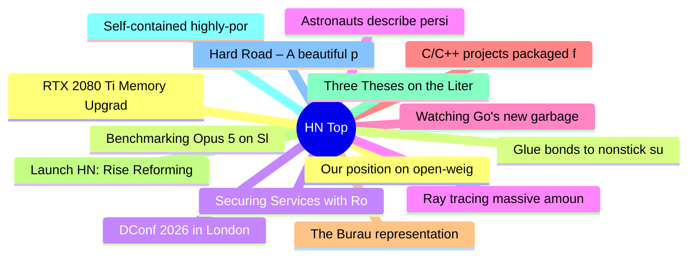

# HackerNews 每日 Top 30 (2026-07-28)

## 思维导图

## 列表（30 条）

### 1. Our position on open-weights models
- **链接**: [https://www.anthropic.com/news/position-open-weights-models](https://www.anthropic.com/news/position-open-weights-models)
- **分数**: 463 | **评论**: 638 | **作者**: surprisetalk
- **HN 讨论**: https://news.ycombinator.com/item?id=49076057

### 2. Benchmarking Opus 5 on SlopCodeBench
- **链接**: [https://github.com/humanlayer/advanced-context-engineering-for-coding-agents/blob/main/benchmarking-opus-5-on-slop-code-bench.md](https://github.com/humanlayer/advanced-context-engineering-for-coding-agents/blob/main/benchmarking-opus-5-on-slop-code-bench.md)
- **分数**: 123 | **评论**: 28 | **作者**: dhorthy
- **HN 讨论**: https://news.ycombinator.com/item?id=49076391

### 3. DConf 2026 in London
- **链接**: [https://dconf.org/2026/index.html](https://dconf.org/2026/index.html)
- **分数**: 46 | **评论**: 17 | **作者**: teleforce
- **HN 讨论**: https://news.ycombinator.com/item?id=49076840

### 4. Astronauts describe persistent 'observer' sensation after 6 month missions
- **链接**: [https://spacedaily.com/sd-v-astronauts-returning-from-six-month-missions-describe-a-persistent-observer-sensation-the-feeling-of-watching-their-own-lives-from-a-half-step-outside-the-frame-weeks-after-theyr/](https://spacedaily.com/sd-v-astronauts-returning-from-six-month-missions-describe-a-persistent-observer-sensation-the-feeling-of-watching-their-own-lives-from-a-half-step-outside-the-frame-weeks-after-theyr/)
- **分数**: 51 | **评论**: 20 | **作者**: zdw
- **HN 讨论**: https://news.ycombinator.com/item?id=49076900

### 5. Watching Go's new garbage collector move through the heap
- **链接**: [https://theconsensus.dev/p/2026/07/19/observing-gos-garbage-collector-old-and-new.html](https://theconsensus.dev/p/2026/07/19/observing-gos-garbage-collector-old-and-new.html)
- **分数**: 172 | **评论**: 17 | **作者**: matheusmoreira
- **HN 讨论**: https://news.ycombinator.com/item?id=49045474

### 6. C/C++ projects packaged for Zig
- **链接**: [https://github.com/allyourcodebase](https://github.com/allyourcodebase)
- **分数**: 27 | **评论**: 20 | **作者**: jcbhmr
- **HN 讨论**: https://news.ycombinator.com/item?id=49076791

### 7. The Burau representation of the braid group is faithful for n = 4
- **链接**: [https://arxiv.org/abs/2607.05283](https://arxiv.org/abs/2607.05283)
- **分数**: 16 | **评论**: 5 | **作者**: wglb
- **HN 讨论**: https://news.ycombinator.com/item?id=49077209

### 8. Launch HN: Rise Reforming (YC S26) – Turning Waste Gases into Valuable Chemicals
- **链接**: [https://www.rise-reforming.com](https://www.rise-reforming.com)
- **分数**: 60 | **评论**: 22 | **作者**: george_rose25
- **HN 讨论**: https://news.ycombinator.com/item?id=49074817

### 9. Three Theses on the Literacy Crisis
- **链接**: [https://trevoraleo.substack.com/p/three-theses-on-the-literacy-crisis](https://trevoraleo.substack.com/p/three-theses-on-the-literacy-crisis)
- **分数**: 15 | **评论**: 7 | **作者**: samclemens
- **HN 讨论**: https://news.ycombinator.com/item?id=49050021

### 10. Self-contained highly-portable Python distributions
- **链接**: [https://gregoryszorc.com/docs/python-build-standalone/main/](https://gregoryszorc.com/docs/python-build-standalone/main/)
- **分数**: 114 | **评论**: 22 | **作者**: jcbhmr
- **HN 讨论**: https://news.ycombinator.com/item?id=49073942

### 11. Hard Road – A beautiful procedural post-apocalyptic game
- **链接**: [https://hardroad.xyz/](https://hardroad.xyz/)
- **分数**: 32 | **评论**: 11 | **作者**: getbutterfly
- **HN 讨论**: https://news.ycombinator.com/item?id=49076382

### 12. RTX 2080 Ti Memory Upgrade to 22 GB
- **链接**: [https://gpusolutions.net/rbservices/graphics-card-upgrade/](https://gpusolutions.net/rbservices/graphics-card-upgrade/)
- **分数**: 9 | **评论**: 10 | **作者**: wslh
- **HN 讨论**: https://news.ycombinator.com/item?id=49041256

### 13. Glue bonds to nonstick surfaces and wipes clean with ethanol
- **链接**: [https://cen.acs.org/materials/adhesives/glue-bonds-nonstick-surfaces-wipes-clean/104/web/2026/07](https://cen.acs.org/materials/adhesives/glue-bonds-nonstick-surfaces-wipes-clean/104/web/2026/07)
- **分数**: 152 | **评论**: 84 | **作者**: gmays
- **HN 讨论**: https://news.ycombinator.com/item?id=49020993

### 14. Securing Services with Rootless Containers
- **链接**: [https://blog.coderspirit.xyz/blog/2026/07/06/securing-services-with-rootless-containers/](https://blog.coderspirit.xyz/blog/2026/07/06/securing-services-with-rootless-containers/)
- **分数**: 62 | **评论**: 21 | **作者**: speckx
- **HN 讨论**: https://news.ycombinator.com/item?id=49021024

### 15. Ray tracing massive amounts of animated geometry using tetrahedral cages
- **链接**: [https://gpuopen.com/learn/ray-tracing-massive-amounts-animated-geometry/](https://gpuopen.com/learn/ray-tracing-massive-amounts-animated-geometry/)
- **分数**: 71 | **评论**: 10 | **作者**: LorenDB
- **HN 讨论**: https://news.ycombinator.com/item?id=49021007

### 16. A missing underscore sent innocent man to prison for 18 months
- **链接**: [https://arstechnica.com/tech-policy/2026/07/police-missed-one-underscore-and-sent-the-wrong-man-to-prison/](https://arstechnica.com/tech-policy/2026/07/police-missed-one-underscore-and-sent-the-wrong-man-to-prison/)
- **分数**: 142 | **评论**: 72 | **作者**: quantified
- **HN 讨论**: https://news.ycombinator.com/item?id=49076116

### 17. Removing React.js from the codebase and adapting Htmx for UI interactivity (2023)
- **链接**: [https://misago-project.org/t/removing-reactjs-from-the-codebase-and-adapting-htmx-for-ui-interactivity/1267/](https://misago-project.org/t/removing-reactjs-from-the-codebase-and-adapting-htmx-for-ui-interactivity/1267/)
- **分数**: 231 | **评论**: 158 | **作者**: Ralfp
- **HN 讨论**: https://news.ycombinator.com/item?id=49067301

### 18. The computer that helped win World War II
- **链接**: [https://spectrum.ieee.org/colossus-computer-ieee-milestone](https://spectrum.ieee.org/colossus-computer-ieee-milestone)
- **分数**: 176 | **评论**: 72 | **作者**: baruchel
- **HN 讨论**: https://news.ycombinator.com/item?id=49012309

### 19. Exploiting Volvo/Eicher's fleet platform to gain control over all users/vehicles
- **链接**: [https://eaton-works.com/2026/07/27/my-eicher-hack/](https://eaton-works.com/2026/07/27/my-eicher-hack/)
- **分数**: 135 | **评论**: 44 | **作者**: EatonZ
- **HN 讨论**: https://news.ycombinator.com/item?id=49070756

### 20. Paged Out #9 [pdf]
- **链接**: [https://pagedout.institute/download/PagedOut_009.pdf](https://pagedout.institute/download/PagedOut_009.pdf)
- **分数**: 178 | **评论**: 22 | **作者**: laurensr
- **HN 讨论**: https://news.ycombinator.com/item?id=49070138

### 21. Judge Rejects Google's Attempt to DMCA Its Way Out of Being Scraped
- **链接**: [https://www.techdirt.com/2026/07/27/judge-rejects-googles-attempt-to-dmca-its-way-out-of-being-scraped/](https://www.techdirt.com/2026/07/27/judge-rejects-googles-attempt-to-dmca-its-way-out-of-being-scraped/)
- **分数**: 262 | **评论**: 103 | **作者**: cdrnsf
- **HN 讨论**: https://news.ycombinator.com/item?id=49073513

### 22. Kimi K3 Now Available via Telnyx Inference API
- **链接**: [https://telnyx.com/release-notes/kimi-k3-telnyx-inference](https://telnyx.com/release-notes/kimi-k3-telnyx-inference)
- **分数**: 13 | **评论**: 5 | **作者**: fionaattelnyx
- **HN 讨论**: https://news.ycombinator.com/item?id=49076505

### 23. Show HN: FeyNoBg – Automatic background removal model and training library
- **链接**: [https://usefeyn.com/blog/feynobg/](https://usefeyn.com/blog/feynobg/)
- **分数**: 91 | **评论**: 21 | **作者**: snyy
- **HN 讨论**: https://news.ycombinator.com/item?id=49072462

### 24. UpCodes (YC S17) is hiring remote AE's to help make buildings cheaper
- **链接**: [https://up.codes/careers?utm_source=HN](https://up.codes/careers?utm_source=HN)
- **分数**: 1 | **评论**: 0 | **作者**: Old_Thrashbarg
- **HN 讨论**: https://news.ycombinator.com/item?id=49072523

### 25. Show HN: Yap – OSS on-device voice dictation for macOS with no model to download
- **链接**: [https://github.com/FrigadeHQ/yap](https://github.com/FrigadeHQ/yap)
- **分数**: 5 | **评论**: 0 | **作者**: pancomplex
- **HN 讨论**: https://news.ycombinator.com/item?id=49073834

### 26. Netflix employee fired for sharing personal details in retreat trust exercise
- **链接**: [https://www.inc.com/amaya-nichole/netflix-company-retreat-sparked-lawsuit-experts-say-real-damage-may-be-just-beginning/91380349](https://www.inc.com/amaya-nichole/netflix-company-retreat-sparked-lawsuit-experts-say-real-damage-may-be-just-beginning/91380349)
- **分数**: 162 | **评论**: 93 | **作者**: softwaredoug
- **HN 讨论**: https://news.ycombinator.com/item?id=49076923

### 27. Show HN: Trylle – The Next-Gen Git Platform for Modern Teams
- **链接**: [https://trylle.com/home](https://trylle.com/home)
- **分数**: 5 | **评论**: 0 | **作者**: Xlab
- **HN 讨论**: https://news.ycombinator.com/item?id=49076978

### 28. Libsm64: Mario 64 as a library for use in external game engines
- **链接**: [https://github.com/libsm64/libsm64](https://github.com/libsm64/libsm64)
- **分数**: 186 | **评论**: 21 | **作者**: klaussilveira
- **HN 讨论**: https://news.ycombinator.com/item?id=49067352

### 29. Forth
- **链接**: [https://xkcd.com/3277/](https://xkcd.com/3277/)
- **分数**: 118 | **评论**: 25 | **作者**: beardyw
- **HN 讨论**: https://news.ycombinator.com/item?id=49074991

### 30. MAI-Cyber-1-Flash inside MDASH
- **链接**: [https://microsoft.ai/news/introducing-mai-cyber-1-flash-inside-mdash/](https://microsoft.ai/news/introducing-mai-cyber-1-flash-inside-mdash/)
- **分数**: 218 | **评论**: 108 | **作者**: migmartri
- **HN 讨论**: https://news.ycombinator.com/item?id=49072361
