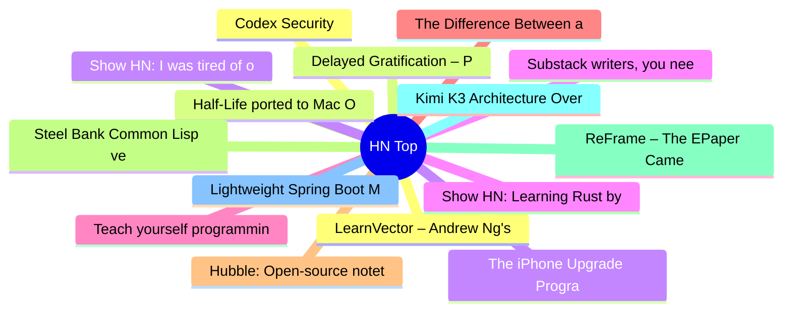

# HackerNews 每日 Top 30 (2026-07-29)

## 思维导图

## 列表（30 条）

### 1. Codex Security
- **链接**: [https://github.com/openai/codex-security](https://github.com/openai/codex-security)
- **分数**: 347 | **评论**: 105 | **作者**: bakigul
- **HN 讨论**: https://news.ycombinator.com/item?id=49089755

### 2. Half-Life ported to Mac OS 9
- **链接**: [https://mac-classic.com/news/half-life-ported-to-mac-os-9/](https://mac-classic.com/news/half-life-ported-to-mac-os-9/)
- **分数**: 151 | **评论**: 64 | **作者**: freediver
- **HN 讨论**: https://news.ycombinator.com/item?id=49089814

### 3. Show HN: I was tired of opening 2 tabs for every HN link, so I made a userscript
- **链接**: [https://github.com/twalichiewicz/HNewhere](https://github.com/twalichiewicz/HNewhere)
- **分数**: 126 | **评论**: 42 | **作者**: twalichiewicz
- **HN 讨论**: https://news.ycombinator.com/item?id=49090607

### 4. Substack writers, you need a website
- **链接**: [https://elizabethtai.com/2026/06/10/substack-writers-you-need-a-website/](https://elizabethtai.com/2026/06/10/substack-writers-you-need-a-website/)
- **分数**: 416 | **评论**: 214 | **作者**: speckx
- **HN 讨论**: https://news.ycombinator.com/item?id=49086788

### 5. Teach yourself programming in ten years (1998)
- **链接**: [https://www.norvig.com/21-days.html](https://www.norvig.com/21-days.html)
- **分数**: 42 | **评论**: 5 | **作者**: vinhnx
- **HN 讨论**: https://news.ycombinator.com/item?id=49055816

### 6. The Difference Between a Button and a Link
- **链接**: [https://unplannedobsolescence.com/blog/buttons-vs-links/](https://unplannedobsolescence.com/blog/buttons-vs-links/)
- **分数**: 29 | **评论**: 13 | **作者**: alexpetros
- **HN 讨论**: https://news.ycombinator.com/item?id=49091738

### 7. Hubble: Open-source notetaking app for you and your agents
- **链接**: [https://www.hubble.md/](https://www.hubble.md/)
- **分数**: 29 | **评论**: 6 | **作者**: handfuloflight
- **HN 讨论**: https://news.ycombinator.com/item?id=49091730

### 8. Steel Bank Common Lisp version 2.6.7
- **链接**: [https://sbcl.org/all-news.html?2.6.7](https://sbcl.org/all-news.html?2.6.7)
- **分数**: 199 | **评论**: 83 | **作者**: tmtvl
- **HN 讨论**: https://news.ycombinator.com/item?id=49086971

### 9. ReFrame – The EPaper Camera
- **链接**: [https://reframe.camera/](https://reframe.camera/)
- **分数**: 30 | **评论**: 6 | **作者**: phil294
- **HN 讨论**: https://news.ycombinator.com/item?id=49091379

### 10. Kimi K3 Architecture Overview and Notes
- **链接**: [https://sebastianraschka.com/blog/2026/kimi-k3-architecture-notes.html](https://sebastianraschka.com/blog/2026/kimi-k3-architecture-notes.html)
- **分数**: 314 | **评论**: 44 | **作者**: ModelForge
- **HN 讨论**: https://news.ycombinator.com/item?id=49085698

### 11. Lightweight Spring Boot Monitoring Without Prometheus and Grafana
- **链接**: [https://pvrlabs.xyz/articles/lightweight-spring-boot-monitoring.html](https://pvrlabs.xyz/articles/lightweight-spring-boot-monitoring.html)
- **分数**: 10 | **评论**: 0 | **作者**: ejboy
- **HN 讨论**: https://news.ycombinator.com/item?id=49091895

### 12. LearnVector – Andrew Ng's AI company building one‑to‑one learning experiences
- **链接**: [https://learnvector.ai/](https://learnvector.ai/)
- **分数**: 3 | **评论**: 0 | **作者**: ajhai
- **HN 讨论**: https://news.ycombinator.com/item?id=49092499

### 13. Delayed Gratification – Proud to Be 'Last to Breaking News'
- **链接**: [https://www.slow-journalism.com/](https://www.slow-journalism.com/)
- **分数**: 239 | **评论**: 138 | **作者**: speerer
- **HN 讨论**: https://news.ycombinator.com/item?id=49085731

### 14. The iPhone Upgrade Program is being replaced by Apple Upgrade
- **链接**: [https://www.apple.com/shop/iphone/iphone-upgrade-program](https://www.apple.com/shop/iphone/iphone-upgrade-program)
- **分数**: 140 | **评论**: 267 | **作者**: lkurtz
- **HN 讨论**: https://news.ycombinator.com/item?id=49087306

### 15. Show HN: Learning Rust by writing a Markdown to HTML compiler
- **链接**: [https://andreadimatteo.com/md-to-html-compiler.html](https://andreadimatteo.com/md-to-html-compiler.html)
- **分数**: 5 | **评论**: 1 | **作者**: deotman
- **HN 讨论**: https://news.ycombinator.com/item?id=49092151

### 16. Zig's Incremental Compilation Internals
- **链接**: [https://mlugg.co.uk/posts/incremental-compilation-internals/](https://mlugg.co.uk/posts/incremental-compilation-internals/)
- **分数**: 195 | **评论**: 137 | **作者**: garyhtou
- **HN 讨论**: https://news.ycombinator.com/item?id=49085666

### 17. Pacing the frontier
- **链接**: [https://www.pacingthefrontier.com/](https://www.pacingthefrontier.com/)
- **分数**: 83 | **评论**: 74 | **作者**: reducesuffering
- **HN 讨论**: https://news.ycombinator.com/item?id=49089240

### 18. Discovering Cryptographic Weaknesses with Claude
- **链接**: [https://www.anthropic.com/research/discovering-cryptographic-weaknesses](https://www.anthropic.com/research/discovering-cryptographic-weaknesses)
- **分数**: 182 | **评论**: 125 | **作者**: gslin
- **HN 讨论**: https://news.ycombinator.com/item?id=49087091

### 19. The Fabled Flatbreads of Uzbekistan (2015)
- **链接**: [https://www.aramcoworld.com/articles/2015/the-fabled-flatbreads-of-uzbekistan](https://www.aramcoworld.com/articles/2015/the-fabled-flatbreads-of-uzbekistan)
- **分数**: 81 | **评论**: 58 | **作者**: jxub
- **HN 讨论**: https://news.ycombinator.com/item?id=49036460

### 20. Truth is not a direction: a Tarski attack on LLM probes
- **链接**: [https://abeljansma.nl/2026/07/10/truth-is-not-a-direction.html](https://abeljansma.nl/2026/07/10/truth-is-not-a-direction.html)
- **分数**: 5 | **评论**: 0 | **作者**: abelaer
- **HN 讨论**: https://news.ycombinator.com/item?id=49069033

### 21. Show HN: How far do I have to go to run into 100k people?
- **链接**: [https://imjasonh.github.io/playground/population-rays/](https://imjasonh.github.io/playground/population-rays/)
- **分数**: 50 | **评论**: 35 | **作者**: ImJasonH
- **HN 讨论**: https://news.ycombinator.com/item?id=49028358

### 22. Industry Brief: Private 5G for Manufacturing and Industrial Sites [pdf]
- **链接**: [https://framerusercontent.com/assets/HV1dtfKZyXK2aknO6go8Cemejl8.pdf](https://framerusercontent.com/assets/HV1dtfKZyXK2aknO6go8Cemejl8.pdf)
- **分数**: 5 | **评论**: 2 | **作者**: y2so
- **HN 讨论**: https://news.ycombinator.com/item?id=49091994

### 23. Una GPS smart watch – Repairable, USB-C charging, developer-friendly
- **链接**: [https://unawatch.com/](https://unawatch.com/)
- **分数**: 143 | **评论**: 88 | **作者**: pimterry
- **HN 讨论**: https://news.ycombinator.com/item?id=49084813

### 24. New HIV vaccine shows unprecedented success in preclinical study
- **链接**: [https://www.lji.org/news-events/news/post/new-hiv-vaccine-shows-unprecedented-success-in-preclinical-study/](https://www.lji.org/news-events/news/post/new-hiv-vaccine-shows-unprecedented-success-in-preclinical-study/)
- **分数**: 567 | **评论**: 240 | **作者**: codebyaditya
- **HN 讨论**: https://news.ycombinator.com/item?id=49083314

### 25. Kimi Linear: An Expressive, Efficient Attention Architecture (2025)
- **链接**: [https://arxiv.org/abs/2510.26692](https://arxiv.org/abs/2510.26692)
- **分数**: 280 | **评论**: 120 | **作者**: ronfriedhaber
- **HN 讨论**: https://news.ycombinator.com/item?id=49082022

### 26. MCP 2026-07-28 Specification: transport going stateless
- **链接**: [https://blog.modelcontextprotocol.io/posts/2026-07-28/](https://blog.modelcontextprotocol.io/posts/2026-07-28/)
- **分数**: 105 | **评论**: 35 | **作者**: Eldodi
- **HN 讨论**: https://news.ycombinator.com/item?id=49088058

### 27. Now is the time to give LLMs access to the ACM digital library
- **链接**: [https://cacm.acm.org/opinion/now-is-the-time-to-give-llms-access-to-the-acm-digital-library/](https://cacm.acm.org/opinion/now-is-the-time-to-give-llms-access-to-the-acm-digital-library/)
- **分数**: 114 | **评论**: 99 | **作者**: rbanffy
- **HN 讨论**: https://news.ycombinator.com/item?id=49084987

### 28. Running Kimi K3 on a M1 Max
- **链接**: [https://github.com/gavamedia/deltafin](https://github.com/gavamedia/deltafin)
- **分数**: 96 | **评论**: 69 | **作者**: tito
- **HN 讨论**: https://news.ycombinator.com/item?id=49090233

### 29. Interview with Boris Cherny [video]
- **链接**: [https://www.youtube.com/watch?v=qyPCVqFUyDo](https://www.youtube.com/watch?v=qyPCVqFUyDo)
- **分数**: 42 | **评论**: 40 | **作者**: knighthacker
- **HN 讨论**: https://news.ycombinator.com/item?id=49077040

### 30. How to survive boiling water
- **链接**: [https://taxa.substack.com/p/how-to-survive-boiling-water](https://taxa.substack.com/p/how-to-survive-boiling-water)
- **分数**: 459 | **评论**: 105 | **作者**: cainxinth
- **HN 讨论**: https://news.ycombinator.com/item?id=49036068
