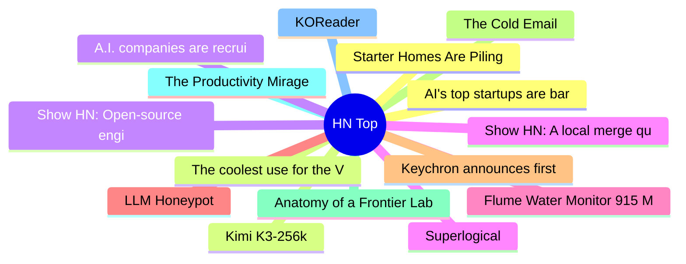

# HackerNews 每日 Top 30 (2026-07-30)

## 思维导图

## 列表（30 条）

### 1. AI's top startups are barely publishing their research
- **链接**: [https://www.science.org/content/article/ai-s-top-startups-are-barely-publishing-their-research](https://www.science.org/content/article/ai-s-top-startups-are-barely-publishing-their-research)
- **分数**: 210 | **评论**: 117 | **作者**: YeGoblynQueenne
- **HN 讨论**: https://news.ycombinator.com/item?id=49103285

### 2. The coolest use for the Vision Pro
- **链接**: [https://christianselig.com/2026/07/vision-pro-house/](https://christianselig.com/2026/07/vision-pro-house/)
- **分数**: 394 | **评论**: 190 | **作者**: robbiet480
- **HN 讨论**: https://news.ycombinator.com/item?id=49102774

### 3. Show HN: Open-source engine running Gemma 4 26B in 2 GB RAM on any M-series Mac
- **链接**: [https://github.com/drumih/turbo-fieldfare](https://github.com/drumih/turbo-fieldfare)
- **分数**: 657 | **评论**: 227 | **作者**: gitpusher42
- **HN 讨论**: https://news.ycombinator.com/item?id=49098510

### 4. Superlogical
- **链接**: [https://www.superlogical.com/](https://www.superlogical.com/)
- **分数**: 530 | **评论**: 328 | **作者**: yan
- **HN 讨论**: https://news.ycombinator.com/item?id=49098965

### 5. Flume Water Monitor 915 MHz Security Is Pretty Good
- **链接**: [https://waveformsecurity.com/blog/flume/](https://waveformsecurity.com/blog/flume/)
- **分数**: 8 | **评论**: 1 | **作者**: credibleconure
- **HN 讨论**: https://news.ycombinator.com/item?id=49105136

### 6. LLM Honeypot
- **链接**: [https://llm2human.pages.dev/](https://llm2human.pages.dev/)
- **分数**: 56 | **评论**: 21 | **作者**: 8thom
- **HN 讨论**: https://news.ycombinator.com/item?id=49104117

### 7. Keychron announces first open-source firmware for gaming mice
- **链接**: [https://www.digitalfoundry.net/news/2026/07/keychron-announces-first-open-source-firmware-for-gaming-mice](https://www.digitalfoundry.net/news/2026/07/keychron-announces-first-open-source-firmware-for-gaming-mice)
- **分数**: 293 | **评论**: 109 | **作者**: JLO64
- **HN 讨论**: https://news.ycombinator.com/item?id=49099715

### 8. The Cold Email
- **链接**: [https://zachholman.com/posts/cold-email](https://zachholman.com/posts/cold-email)
- **分数**: 92 | **评论**: 39 | **作者**: holman
- **HN 讨论**: https://news.ycombinator.com/item?id=49103089

### 9. Anatomy of a Frontier Lab Agent Intrusion: A Timeline of the July 2026 Incident
- **链接**: [https://huggingface.co/blog/agent-intrusion-technical-timeline](https://huggingface.co/blog/agent-intrusion-technical-timeline)
- **分数**: 294 | **评论**: 177 | **作者**: artninja1988
- **HN 讨论**: https://news.ycombinator.com/item?id=49089500

### 10. The Productivity Mirage
- **链接**: [https://frantic.im/mirage/](https://frantic.im/mirage/)
- **分数**: 46 | **评论**: 15 | **作者**: msephton
- **HN 讨论**: https://news.ycombinator.com/item?id=49104335

### 11. KOReader
- **链接**: [https://koreader.rocks/](https://koreader.rocks/)
- **分数**: 669 | **评论**: 211 | **作者**: Cider9986
- **HN 讨论**: https://news.ycombinator.com/item?id=49095865

### 12. Starter Homes Are Piling Up While Luxury Homes Fly Off the Market
- **链接**: [https://www.zillow.com/research/starter-homes-price-tiers-36571/](https://www.zillow.com/research/starter-homes-price-tiers-36571/)
- **分数**: 16 | **评论**: 6 | **作者**: toomuchtodo
- **HN 讨论**: https://news.ycombinator.com/item?id=49104996

### 13. Kimi K3-256k
- **链接**: [https://www.kimi.com/code/docs/en/kimi-code/models](https://www.kimi.com/code/docs/en/kimi-code/models)
- **分数**: 342 | **评论**: 99 | **作者**: monneyboi
- **HN 讨论**: https://news.ycombinator.com/item?id=49101852

### 14. A.I. companies are recruiting electricians and carpenters by the thousands
- **链接**: [https://www.nytimes.com/2026/07/29/business/economy/data-center-electricians-training.html](https://www.nytimes.com/2026/07/29/business/economy/data-center-electricians-training.html)
- **分数**: 217 | **评论**: 273 | **作者**: thm
- **HN 讨论**: https://news.ycombinator.com/item?id=49098198

### 15. Show HN: A local merge queue for parallel Claude Code agents
- **链接**: [https://github.com/funador/claude-code-merge-queue](https://github.com/funador/claude-code-merge-queue)
- **分数**: 16 | **评论**: 3 | **作者**: funador
- **HN 讨论**: https://news.ycombinator.com/item?id=49104747

### 16. SalesPatriot (YC W25) Is Hiring FDEs
- **链接**: [https://www.ycombinator.com/companies/salespatriot/jobs/M46X6YX-forward-deployed-engineer](https://www.ycombinator.com/companies/salespatriot/jobs/M46X6YX-forward-deployed-engineer)
- **分数**: 1 | **评论**: 0 | **作者**: maciejSz
- **HN 讨论**: https://news.ycombinator.com/item?id=49103026

### 17. Recursive Filters: SMA, EMA, Low‑Pass, and a Tiny Kalman
- **链接**: [https://www.staszewski.xyz/blog/recursive-filters/](https://www.staszewski.xyz/blog/recursive-filters/)
- **分数**: 12 | **评论**: 2 | **作者**: kamilstaszewski
- **HN 讨论**: https://news.ycombinator.com/item?id=49080031

### 18. Document-borne AI worms can self-propagate through Copilot for Word
- **链接**: [https://enklypesalt.com/posts/context-collapse-part3-ai-worming-through-word/](https://enklypesalt.com/posts/context-collapse-part3-ai-worming-through-word/)
- **分数**: 348 | **评论**: 267 | **作者**: Canopy9560
- **HN 讨论**: https://news.ycombinator.com/item?id=49096188

### 19. Handbook.md shows that long policy documents do not reliably govern agents
- **链接**: [https://arxiv.org/abs/2607.25398](https://arxiv.org/abs/2607.25398)
- **分数**: 294 | **评论**: 182 | **作者**: spIrr
- **HN 讨论**: https://news.ycombinator.com/item?id=49096969

### 20. A Trampoline
- **链接**: [https://dogdogfish.com/blog/2026/07/29/a-trampoline/](https://dogdogfish.com/blog/2026/07/29/a-trampoline/)
- **分数**: 72 | **评论**: 41 | **作者**: matthewsharpe3
- **HN 讨论**: https://news.ycombinator.com/item?id=49102425

### 21. A pharmacy chain in Vermont implemented AI for efficiency
- **链接**: [https://vtdigger.org/2026/07/29/a-pharmacy-chain-in-vermont-implemented-ai-for-efficiency-its-led-to-delays-incorrect-information-and-privacy-concerns/](https://vtdigger.org/2026/07/29/a-pharmacy-chain-in-vermont-implemented-ai-for-efficiency-its-led-to-delays-incorrect-information-and-privacy-concerns/)
- **分数**: 4 | **评论**: 0 | **作者**: omerhj
- **HN 讨论**: https://news.ycombinator.com/item?id=49105190

### 22. Turning a dumb AC unit smart (without losing my security deposit)
- **链接**: [https://prilik.com/blog/post/automating-ac-nyc/](https://prilik.com/blog/post/automating-ac-nyc/)
- **分数**: 109 | **评论**: 88 | **作者**: austinallegro
- **HN 讨论**: https://news.ycombinator.com/item?id=49101198

### 23. Angels in Coptic Magic I: Introduction
- **链接**: [https://www.coptic-magic.phil.uni-wuerzburg.de/index.php/2026/01/16/angels-in-coptic-magic-i-introduction/](https://www.coptic-magic.phil.uni-wuerzburg.de/index.php/2026/01/16/angels-in-coptic-magic-i-introduction/)
- **分数**: 5 | **评论**: 0 | **作者**: jruohonen
- **HN 讨论**: https://news.ycombinator.com/item?id=49061213

### 24. Show HN: CheapFoodMap – A map of good meals under $10
- **链接**: [https://cheapfoodmap.com/](https://cheapfoodmap.com/)
- **分数**: 129 | **评论**: 153 | **作者**: jaep1
- **HN 讨论**: https://news.ycombinator.com/item?id=49100043

### 25. Refactoring cuisine: how an Iraqi stew sailed to Singapore
- **链接**: [https://iza.ac/posts/2026/07/the-journey-of-bamya/](https://iza.ac/posts/2026/07/the-journey-of-bamya/)
- **分数**: 24 | **评论**: 5 | **作者**: infinitewalk
- **HN 讨论**: https://news.ycombinator.com/item?id=49062997

### 26. Commodification of Intelligence: Good, Bad, and Ugly Circular AI Deals
- **链接**: [https://www.emergingtrajectories.com/lh/commodification-and-circularity/](https://www.emergingtrajectories.com/lh/commodification-and-circularity/)
- **分数**: 59 | **评论**: 29 | **作者**: cl42
- **HN 讨论**: https://news.ycombinator.com/item?id=49101529

### 27. Darktable
- **链接**: [https://www.darktable.org/](https://www.darktable.org/)
- **分数**: 297 | **评论**: 142 | **作者**: siatko
- **HN 讨论**: https://news.ycombinator.com/item?id=49096654

### 28. Launch HN: Tokenless (YC S26) – Automatic model switching to save money
- **链接**: [https://usetokenless.com/](https://usetokenless.com/)
- **分数**: 53 | **评论**: 44 | **作者**: rohaga
- **HN 讨论**: https://news.ycombinator.com/item?id=49099143

### 29. Some thoughts about Anthropic's new cryptanalysis results
- **链接**: [https://blog.cryptographyengineering.com/2026/07/29/some-notes-about-anthropics-new-results/](https://blog.cryptographyengineering.com/2026/07/29/some-notes-about-anthropics-new-results/)
- **分数**: 107 | **评论**: 55 | **作者**: supermatou
- **HN 讨论**: https://news.ycombinator.com/item?id=49099804

### 30. Man and the Computer by John G. Kemeny (1972 book by the co-creator of BASIC)
- **链接**: [https://archive.org/details/mancomputerbyjoh0000john](https://archive.org/details/mancomputerbyjoh0000john)
- **分数**: 18 | **评论**: 9 | **作者**: MilnerRoute
- **HN 讨论**: https://news.ycombinator.com/item?id=49104140
