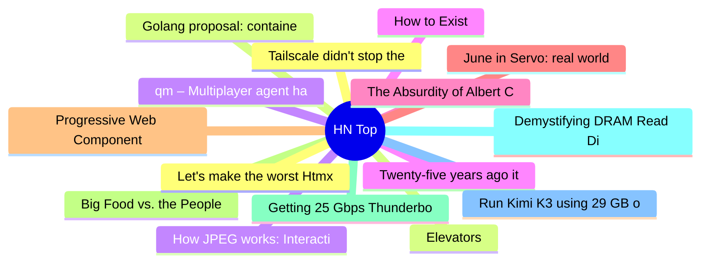

# HackerNews 每日 Top 30 (2026-08-01)

## 思维导图

## 列表（30 条）

### 1. Tailscale didn't stop the Hugging Face intrusion
- **链接**: [https://tailscale.com/blog/hugging-face-intrusion](https://tailscale.com/blog/hugging-face-intrusion)
- **分数**: 463 | **评论**: 172 | **作者**: bluehatbrit
- **HN 讨论**: https://news.ycombinator.com/item?id=49127306

### 2. Elevators
- **链接**: [https://john.fun/elevators](https://john.fun/elevators)
- **分数**: 884 | **评论**: 221 | **作者**: Jrh0203
- **HN 讨论**: https://news.ycombinator.com/item?id=49124218

### 3. qm – Multiplayer agent harness for work
- **链接**: [https://github.com/yc-software/qm](https://github.com/yc-software/qm)
- **分数**: 465 | **评论**: 98 | **作者**: tosh
- **HN 讨论**: https://news.ycombinator.com/item?id=49126604

### 4. Twenty-five years ago it was cryptography, today it's model weights
- **链接**: [https://weeraman.com/because-we-can/](https://weeraman.com/because-we-can/)
- **分数**: 163 | **评论**: 63 | **作者**: aweeraman
- **HN 讨论**: https://news.ycombinator.com/item?id=49083599

### 5. The Absurdity of Albert Camus
- **链接**: [https://www.historytoday.com/archive/portrait-author-historian/absurdity-albert-camus](https://www.historytoday.com/archive/portrait-author-historian/absurdity-albert-camus)
- **分数**: 50 | **评论**: 32 | **作者**: apollinaire
- **HN 讨论**: https://news.ycombinator.com/item?id=49117089

### 6. June in Servo: real world compat, media queries, SharedWorker, and more
- **链接**: [https://servo.org/blog/2026/07/31/june-in-servo/](https://servo.org/blog/2026/07/31/june-in-servo/)
- **分数**: 104 | **评论**: 32 | **作者**: iamnothere
- **HN 讨论**: https://news.ycombinator.com/item?id=49126765

### 7. Progressive Web Components
- **链接**: [https://arielsalminen.com/2026/progressive-web-components/](https://arielsalminen.com/2026/progressive-web-components/)
- **分数**: 88 | **评论**: 13 | **作者**: hosteur
- **HN 讨论**: https://news.ycombinator.com/item?id=49121196

### 8. Big Food vs. the People
- **链接**: [https://www.lighthousereports.com/investigation/big-food-vs-the-people/](https://www.lighthousereports.com/investigation/big-food-vs-the-people/)
- **分数**: 192 | **评论**: 131 | **作者**: jruohonen
- **HN 讨论**: https://news.ycombinator.com/item?id=49124858

### 9. Getting 25 Gbps Thunderbolt Ethernet on My Mac Studio
- **链接**: [https://www.jeffgeerling.com/blog/2026/getting-25g-ethernet-mac-thunderbolt/](https://www.jeffgeerling.com/blog/2026/getting-25g-ethernet-mac-thunderbolt/)
- **分数**: 142 | **评论**: 84 | **作者**: speckx
- **HN 讨论**: https://news.ycombinator.com/item?id=49125034

### 10. Demystifying DRAM Read Disturbance: RowHammer and RowPress Phenomena
- **链接**: [https://arxiv.org/abs/2607.28233](https://arxiv.org/abs/2607.28233)
- **分数**: 31 | **评论**: 17 | **作者**: Jimmc414
- **HN 讨论**: https://news.ycombinator.com/item?id=49128323

### 11. Run Kimi K3 using 29 GB of RAM at 0.50 tok/s
- **链接**: [https://github.com/sqliteai/waste](https://github.com/sqliteai/waste)
- **分数**: 155 | **评论**: 62 | **作者**: marcobambini
- **HN 讨论**: https://news.ycombinator.com/item?id=49123386

### 12. Let's make the worst Htmx
- **链接**: [https://zserge.com/posts/worst-htmx-ever/](https://zserge.com/posts/worst-htmx-ever/)
- **分数**: 66 | **评论**: 20 | **作者**: RebelPotato
- **HN 讨论**: https://news.ycombinator.com/item?id=49119270

### 13. Golang proposal: container/: generic collection types
- **链接**: [https://github.com/golang/go/issues/80590](https://github.com/golang/go/issues/80590)
- **分数**: 124 | **评论**: 77 | **作者**: jabits
- **HN 讨论**: https://news.ycombinator.com/item?id=49127031

### 14. How JPEG works: Interactively explore JPEG's lossy compression methods
- **链接**: [https://cgjennings.ca/articles/jpeg-compression/](https://cgjennings.ca/articles/jpeg-compression/)
- **分数**: 111 | **评论**: 13 | **作者**: at1as
- **HN 讨论**: https://news.ycombinator.com/item?id=49070810

### 15. How to Exist
- **链接**: [https://www.raptitude.com/2026/07/how-to-exist/](https://www.raptitude.com/2026/07/how-to-exist/)
- **分数**: 10 | **评论**: 0 | **作者**: walterbell
- **HN 讨论**: https://news.ycombinator.com/item?id=49129990

### 16. Loops (YC W22) Is Hiring a Product Educator
- **链接**: [https://www.ycombinator.com/companies/loops/jobs/zqUnwqB-product-educator-technical-content-creator](https://www.ycombinator.com/companies/loops/jobs/zqUnwqB-product-educator-technical-content-creator)
- **分数**: 1 | **评论**: 0 | **作者**: chrisfrantz
- **HN 讨论**: https://news.ycombinator.com/item?id=49128462

### 17. A past and future of trade secrets
- **链接**: [https://www.cabinetmagazine.org/issues/70/kofen.php](https://www.cabinetmagazine.org/issues/70/kofen.php)
- **分数**: 15 | **评论**: 3 | **作者**: Hooke
- **HN 讨论**: https://news.ycombinator.com/item?id=49114527

### 18. The most official water costs $120k a gallon
- **链接**: [https://signoregalilei.com/2026/07/26/the-most-official-water-costs-120000-a-gallon/](https://signoregalilei.com/2026/07/26/the-most-official-water-costs-120000-a-gallon/)
- **分数**: 139 | **评论**: 122 | **作者**: surprisetalk
- **HN 讨论**: https://news.ycombinator.com/item?id=49124042

### 19. Termixer (TUI DJ Mixer)
- **链接**: [https://github.com/l00sed/termixer](https://github.com/l00sed/termixer)
- **分数**: 53 | **评论**: 35 | **作者**: l00sed
- **HN 讨论**: https://news.ycombinator.com/item?id=49126883

### 20. The First Transatlantic Telegraph Cable Was a Bold, Beautiful Failure
- **链接**: [https://spectrum.ieee.org/the-first-transatlantic-telegraph-cable-was-a-bold-beautiful-failure](https://spectrum.ieee.org/the-first-transatlantic-telegraph-cable-was-a-bold-beautiful-failure)
- **分数**: 18 | **评论**: 3 | **作者**: sparsesignal
- **HN 讨论**: https://news.ycombinator.com/item?id=49096319

### 21. Authorize, don't authenticate
- **链接**: [https://blog.marcua.net/2026/07/31/authorize-dont-authenticate.html](https://blog.marcua.net/2026/07/31/authorize-dont-authenticate.html)
- **分数**: 56 | **评论**: 14 | **作者**: marcua
- **HN 讨论**: https://news.ycombinator.com/item?id=49123468

### 22. Dubious research tied to Red Bull has shaped energy drink policy
- **链接**: [https://www.theexamination.org/articles/red-bull-funded-research-energy-drinks-alcohol](https://www.theexamination.org/articles/red-bull-funded-research-energy-drinks-alcohol)
- **分数**: 117 | **评论**: 181 | **作者**: Jimmc414
- **HN 讨论**: https://news.ycombinator.com/item?id=49124738

### 23. Is AI reasoning right for the wrong reasons?
- **链接**: [https://www.quantamagazine.org/is-ai-reasoning-right-for-the-wrong-reasons-20260731/](https://www.quantamagazine.org/is-ai-reasoning-right-for-the-wrong-reasons-20260731/)
- **分数**: 121 | **评论**: 153 | **作者**: retupmoc01
- **HN 讨论**: https://news.ycombinator.com/item?id=49124358

### 24. Algorithms on billion-scale graph using 10GB RAM: I love DataFusion
- **链接**: [https://semyonsinchenko.github.io/ssinchenko/post/datafusion-graphs-cc-2/](https://semyonsinchenko.github.io/ssinchenko/post/datafusion-graphs-cc-2/)
- **分数**: 102 | **评论**: 32 | **作者**: speckx
- **HN 讨论**: https://news.ycombinator.com/item?id=49124658

### 25. Using the railway network as a flatbed scanner [video]
- **链接**: [https://media.ccc.de/v/emf2026-74-1-using-the-railway-network-as-a-flatbed-scanner](https://media.ccc.de/v/emf2026-74-1-using-the-railway-network-as-a-flatbed-scanner)
- **分数**: 52 | **评论**: 25 | **作者**: Jimmc414
- **HN 讨论**: https://news.ycombinator.com/item?id=49126919

### 26. Show HN: I worked on a new browser for 2 years, today it passed Acid 3
- **链接**: [https://code.intellios.ai/cwbrowser/](https://code.intellios.ai/cwbrowser/)
- **分数**: 31 | **评论**: 11 | **作者**: coolwulf
- **HN 讨论**: https://news.ycombinator.com/item?id=49128826

### 27. Predictive Speculative KV Replication for Bursty LLM Inference
- **链接**: [https://jwlabs.vercel.app/post/biting-the-bullet](https://jwlabs.vercel.app/post/biting-the-bullet)
- **分数**: 27 | **评论**: 2 | **作者**: shreybirmiwal
- **HN 讨论**: https://news.ycombinator.com/item?id=49127874

### 28. Everyone is building LLM routers, we deprecated ours
- **链接**: [https://manifest.build/blog/why-we-deprecated-our-llm-router/](https://manifest.build/blog/why-we-deprecated-our-llm-router/)
- **分数**: 92 | **评论**: 50 | **作者**: brunaxLorax
- **HN 讨论**: https://news.ycombinator.com/item?id=49126630

### 29. How far can you push the range of Wi-Fi connectivity in an ideal environment?
- **链接**: [https://www.phidgets.com/?view=articles&article=LongRangeWifi](https://www.phidgets.com/?view=articles&article=LongRangeWifi)
- **分数**: 6 | **评论**: 2 | **作者**: rzk
- **HN 讨论**: https://news.ycombinator.com/item?id=49084005

### 30. Severance
- **链接**: [https://lcamtuf.substack.com/p/severance](https://lcamtuf.substack.com/p/severance)
- **分数**: 207 | **评论**: 68 | **作者**: surprisetalk
- **HN 讨论**: https://news.ycombinator.com/item?id=49125971
