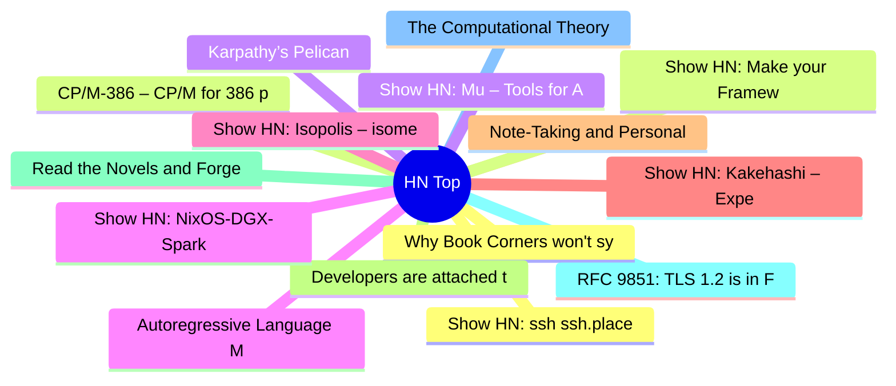

# HackerNews 每日 Top 30 (2026-08-03)

## 思维导图

## 列表（30 条）

### 1. Why Book Corners won't sync contributions back to OpenStreetMap
- **链接**: [https://www.andreagrandi.it/posts/why-book-corners-wont-sync-contributions-back-to-openstreetmap/](https://www.andreagrandi.it/posts/why-book-corners-wont-sync-contributions-back-to-openstreetmap/)
- **分数**: 37 | **评论**: 14 | **作者**: pizzaiolo
- **HN 讨论**: https://news.ycombinator.com/item?id=49149746

### 2. CP/M-386 – CP/M for 386 protected mode, derived from CP/M‑68K
- **链接**: [https://github.com/johnsonjh/cpm386](https://github.com/johnsonjh/cpm386)
- **分数**: 18 | **评论**: 4 | **作者**: TMWNN
- **HN 讨论**: https://news.ycombinator.com/item?id=49149898

### 3. Karpathy’s Pelican
- **链接**: [https://twitter.com/karpathy/status/2083749667410727319](https://twitter.com/karpathy/status/2083749667410727319)
- **分数**: 440 | **评论**: 341 | **作者**: delichon
- **HN 讨论**: https://news.ycombinator.com/item?id=49140998

### 4. Autoregressive Language Model on the 6502 Processor
- **链接**: [https://mattbeton.com/blog/bitnet-6502.html](https://mattbeton.com/blog/bitnet-6502.html)
- **分数**: 57 | **评论**: 6 | **作者**: nmstoker
- **HN 讨论**: https://news.ycombinator.com/item?id=49122655

### 5. Show HN: Isopolis – isometric pixel map of SF
- **链接**: [https://sf.isopolis.city/](https://sf.isopolis.city/)
- **分数**: 21 | **评论**: 3 | **作者**: nuwandavek
- **HN 讨论**: https://news.ycombinator.com/item?id=49149966

### 6. Show HN: Kakehashi – Experimental userspace to run macOS binaries on Linux ARM
- **链接**: [https://github.com/wie-project/kakehashi](https://github.com/wie-project/kakehashi)
- **分数**: 183 | **评论**: 38 | **作者**: vlad_kalinkin
- **HN 讨论**: https://news.ycombinator.com/item?id=49145937

### 7. Note-Taking and Personal Knowledge Management
- **链接**: [https://unattributed.cc/note-taking-and-personal-knowledge-management](https://unattributed.cc/note-taking-and-personal-knowledge-management)
- **分数**: 131 | **评论**: 38 | **作者**: surprisetalk
- **HN 讨论**: https://news.ycombinator.com/item?id=49084324

### 8. Developers are attached to tools because tools encode trust
- **链接**: [https://stackoverflow.blog/2026/07/29/developers-are-attached-to-tools-because-tools-encode-trust/](https://stackoverflow.blog/2026/07/29/developers-are-attached-to-tools-because-tools-encode-trust/)
- **分数**: 150 | **评论**: 77 | **作者**: HieronymusBosch
- **HN 讨论**: https://news.ycombinator.com/item?id=49097961

### 9. Read the Novels and Forget Everything Else
- **链接**: [https://hedgehogreview.com/web-features/thr/posts/read-the-novels-and-forget-everything-else](https://hedgehogreview.com/web-features/thr/posts/read-the-novels-and-forget-everything-else)
- **分数**: 55 | **评论**: 26 | **作者**: samclemens
- **HN 讨论**: https://news.ycombinator.com/item?id=49129676

### 10. RFC 9851: TLS 1.2 is in Feature Freeze
- **链接**: [https://www.rfc-editor.org/rfc/rfc9851.html](https://www.rfc-editor.org/rfc/rfc9851.html)
- **分数**: 8 | **评论**: 1 | **作者**: Jimmc414
- **HN 讨论**: https://news.ycombinator.com/item?id=49150181

### 11. The Computational Theory of Mind (2015)
- **链接**: [https://plato.stanford.edu/entries/computational-mind/](https://plato.stanford.edu/entries/computational-mind/)
- **分数**: 32 | **评论**: 10 | **作者**: cyanregiment
- **HN 讨论**: https://news.ycombinator.com/item?id=49149125

### 12. Show HN: ssh ssh.place
- **链接**: [https://ssh.place](https://ssh.place)
- **分数**: 12 | **评论**: 4 | **作者**: jeninh
- **HN 讨论**: https://news.ycombinator.com/item?id=49149805

### 13. Show HN: Make your Framework 12 sound like a creaky door
- **链接**: [https://github.com/ArcaEge/creakwork12](https://github.com/ArcaEge/creakwork12)
- **分数**: 50 | **评论**: 5 | **作者**: arcaege
- **HN 讨论**: https://news.ycombinator.com/item?id=49148048

### 14. Show HN: Mu – Tools for Agents
- **链接**: [https://github.com/micro/mu](https://github.com/micro/mu)
- **分数**: 31 | **评论**: 8 | **作者**: asim
- **HN 讨论**: https://news.ycombinator.com/item?id=49148899

### 15. Show HN: NixOS-DGX-Spark – Nix and NixOS on the DGX Spark
- **链接**: [https://github.com/graham33/nixos-dgx-spark](https://github.com/graham33/nixos-dgx-spark)
- **分数**: 97 | **评论**: 29 | **作者**: graham33
- **HN 讨论**: https://news.ycombinator.com/item?id=49146267

### 16. TinyNES Review – A Super Niche NES Console
- **链接**: [https://blog.lon.tv/2023/02/05/tinynes-review-a-super-niche-nes-console/](https://blog.lon.tv/2023/02/05/tinynes-review-a-super-niche-nes-console/)
- **分数**: 33 | **评论**: 4 | **作者**: throwoutway
- **HN 讨论**: https://news.ycombinator.com/item?id=49147760

### 17. F*: A general-purpose proof-oriented programming language
- **链接**: [https://fstar-lang.org/](https://fstar-lang.org/)
- **分数**: 155 | **评论**: 67 | **作者**: ducktective
- **HN 讨论**: https://news.ycombinator.com/item?id=49143925

### 18. Californians' data deletion requests, DROP, become enforceable Aug. 1
- **链接**: [https://www.nbcsandiego.com/nbc-7-responds-2/californians-data-deletion-requests-drop-become-enforceable-aug-1/4054771/](https://www.nbcsandiego.com/nbc-7-responds-2/californians-data-deletion-requests-drop-become-enforceable-aug-1/4054771/)
- **分数**: 87 | **评论**: 31 | **作者**: MilnerRoute
- **HN 讨论**: https://news.ycombinator.com/item?id=49148987

### 19. Twenty Years of RISC OS Open
- **链接**: [https://www.riscosopen.org/news/articles/2026/06/20/twenty-years-of-risc-os-open](https://www.riscosopen.org/news/articles/2026/06/20/twenty-years-of-risc-os-open)
- **分数**: 152 | **评论**: 29 | **作者**: AlexeyBrin
- **HN 讨论**: https://news.ycombinator.com/item?id=49143967

### 20. Playing with Georgia
- **链接**: [https://mighil.com/playing-with-georgia](https://mighil.com/playing-with-georgia)
- **分数**: 9 | **评论**: 4 | **作者**: surprisetalk
- **HN 讨论**: https://news.ycombinator.com/item?id=49096748

### 21. A tool for finding the causes of unstable Python tests
- **链接**: [https://github.com/mgaitan/pytest-leak-finder](https://github.com/mgaitan/pytest-leak-finder)
- **分数**: 12 | **评论**: 0 | **作者**: pomponchik
- **HN 讨论**: https://news.ycombinator.com/item?id=49113005

### 22. My personal AI benchmark: "Generate an SVG of a frog with a Habsburg jaw."
- **链接**: [https://frogs.vaguespac.es/](https://frogs.vaguespac.es/)
- **分数**: 104 | **评论**: 47 | **作者**: thebigship
- **HN 讨论**: https://news.ycombinator.com/item?id=49147622

### 23. A Playable History of Sudoku
- **链接**: [https://doku.su/history-of-sudoku](https://doku.su/history-of-sudoku)
- **分数**: 6 | **评论**: 0 | **作者**: bouiboui
- **HN 讨论**: https://news.ycombinator.com/item?id=49097836

### 24. Sharing an X11 Server Across Hosts with FamilyWild
- **链接**: [https://dobrowolski.dev/article/sharing-an-x-server-across-hosts-with-familywild/](https://dobrowolski.dev/article/sharing-an-x-server-across-hosts-with-familywild/)
- **分数**: 35 | **评论**: 10 | **作者**: shirozuki
- **HN 讨论**: https://news.ycombinator.com/item?id=49147978

### 25. When transit passes were designed by hand (2022)
- **链接**: [https://letterformarchive.org/news/milwaukee-transit-passes/](https://letterformarchive.org/news/milwaukee-transit-passes/)
- **分数**: 102 | **评论**: 28 | **作者**: nate
- **HN 讨论**: https://news.ycombinator.com/item?id=49123003

### 26. 'Crush this lady': how eBay harassment campaign led to $56M payout
- **链接**: [https://www.ft.com/content/06ec1b03-d4af-40cf-b12a-4ba5a410f6d2](https://www.ft.com/content/06ec1b03-d4af-40cf-b12a-4ba5a410f6d2)
- **分数**: 185 | **评论**: 84 | **作者**: JumpCrisscross
- **HN 讨论**: https://news.ycombinator.com/item?id=49147435

### 27. Folding Paper Globes
- **链接**: [https://foldingglobes.com/globes](https://foldingglobes.com/globes)
- **分数**: 147 | **评论**: 30 | **作者**: dango2506
- **HN 讨论**: https://news.ycombinator.com/item?id=49093845

### 28. Fasttracker II clone in C using SDL 2
- **链接**: [https://16-bits.org/ft2.php](https://16-bits.org/ft2.php)
- **分数**: 116 | **评论**: 45 | **作者**: andsoitis
- **HN 讨论**: https://news.ycombinator.com/item?id=49094151

### 29. Rooting, firmware analysis and persistent credentials of TP-Link TL-841N
- **链接**: [https://blog.juni-mp4.com/posts/42/rooting-the-tplink-tl841n-pt1/](https://blog.juni-mp4.com/posts/42/rooting-the-tplink-tl841n-pt1/)
- **分数**: 78 | **评论**: 15 | **作者**: mindracer
- **HN 讨论**: https://news.ycombinator.com/item?id=49145883

### 30. Great Question (YC W21) Is Hiring Senior Demand Gen Manager
- **链接**: [https://www.ycombinator.com/companies/great-question/jobs/YutDxyf-senior-demand-generation-manager](https://www.ycombinator.com/companies/great-question/jobs/YutDxyf-senior-demand-generation-manager)
- **分数**: 1 | **评论**: 0 | **作者**: nedwin
- **HN 讨论**: https://news.ycombinator.com/item?id=49143683
