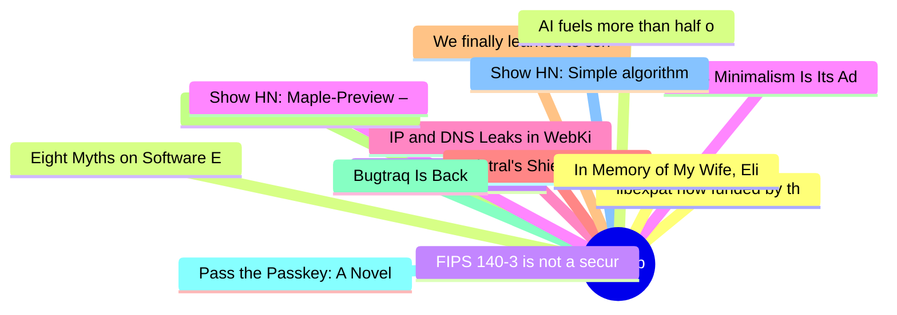

# HackerNews 每日 Top 30 (2026-08-05)

## 思维导图

## 列表（30 条）

### 1. libexpat now funded by the City of Munich for up to 6 months
- **链接**: [https://blog.hartwork.org/posts/libexpat-city-of-munich-open-source-sabbatical/](https://blog.hartwork.org/posts/libexpat-city-of-munich-open-source-sabbatical/)
- **分数**: 123 | **评论**: 4 | **作者**: spyc
- **HN 讨论**: https://news.ycombinator.com/item?id=49176606

### 2. Eight Myths on Software Engineering and GenAI
- **链接**: [https://queue.acm.org/detail.cfm?id=3807963](https://queue.acm.org/detail.cfm?id=3807963)
- **分数**: 62 | **评论**: 25 | **作者**: tchalla
- **HN 讨论**: https://news.ycombinator.com/item?id=49176830

### 3. I am retiring from fulltime writing (& pseudonymity) to launch Guardian Angel
- **链接**: [https://twitter.com/gwern/status/2084739205071343837](https://twitter.com/gwern/status/2084739205071343837)
- **分数**: 174 | **评论**: 85 | **作者**: mattsterett
- **HN 讨论**: https://news.ycombinator.com/item?id=49174900

### 4. Pi's Minimalism Is Its Advantage
- **链接**: [https://earendil.com/posts/pi-autoresearch-and-databricks/](https://earendil.com/posts/pi-autoresearch-and-databricks/)
- **分数**: 107 | **评论**: 29 | **作者**: luispa
- **HN 讨论**: https://news.ycombinator.com/item?id=49176038

### 5. IP and DNS Leaks in WebKit Affecting Proxy Browsers and iCloud Private Relay
- **链接**: [https://mysk.blog/2026/08/04/webkit-proxy-icloud-private-relay-ip-leak/](https://mysk.blog/2026/08/04/webkit-proxy-icloud-private-relay-ip-leak/)
- **分数**: 37 | **评论**: 4 | **作者**: lapcat
- **HN 讨论**: https://news.ycombinator.com/item?id=49176697

### 6. Mistral's Shieldstral: 3B open-weights model for multimodal moderation
- **链接**: [https://mistral.ai/news/shieldstral/](https://mistral.ai/news/shieldstral/)
- **分数**: 312 | **评论**: 74 | **作者**: riadsila
- **HN 讨论**: https://news.ycombinator.com/item?id=49171268

### 7. We finally learned to center a div, then browsers added sidebars
- **链接**: [https://seg6.space/posts/center-div/](https://seg6.space/posts/center-div/)
- **分数**: 61 | **评论**: 46 | **作者**: seg6
- **HN 讨论**: https://news.ycombinator.com/item?id=49176055

### 8. DuckDB – Data power tools for your laptop, now in Clojure (2023)
- **链接**: [https://techascent.com/blog/just-ducking-around.html](https://techascent.com/blog/just-ducking-around.html)
- **分数**: 53 | **评论**: 5 | **作者**: sourdecor
- **HN 讨论**: https://news.ycombinator.com/item?id=49175924

### 9. Bugtraq Is Back
- **链接**: [https://lists.securityfocus.com/hyperkitty/list/bugtraq@securityfocus.com/thread/CHKLXLA7SJEWLDFHWXB3QU57ADOXGL2E/](https://lists.securityfocus.com/hyperkitty/list/bugtraq@securityfocus.com/thread/CHKLXLA7SJEWLDFHWXB3QU57ADOXGL2E/)
- **分数**: 16 | **评论**: 2 | **作者**: bashtoni
- **HN 讨论**: https://news.ycombinator.com/item?id=49176947

### 10. Pass the Passkey: A Novel Attack Surface in Passwordless Authentication
- **链接**: [https://unit42.paloaltonetworks.com/passwordless-authentication-security-risks/](https://unit42.paloaltonetworks.com/passwordless-authentication-security-risks/)
- **分数**: 37 | **评论**: 32 | **作者**: jchanimal
- **HN 讨论**: https://news.ycombinator.com/item?id=49176644

### 11. Show HN: Simple algorithm and color space to generate diverse skin tones
- **链接**: [https://toneyalexander.github.io/inclusive-color-space/](https://toneyalexander.github.io/inclusive-color-space/)
- **分数**: 467 | **评论**: 88 | **作者**: automatoney
- **HN 讨论**: https://news.ycombinator.com/item?id=49170165

### 12. In Memory of My Wife, Elise Cawley, with Thanks for 36 Wonderful Years
- **链接**: [https://writings.stephenwolfram.com/2026/08/in-memory-of-my-wife-elise-cawley-1961-2026-with-thanks-for-36-wonderful-years/](https://writings.stephenwolfram.com/2026/08/in-memory-of-my-wife-elise-cawley-1961-2026-with-thanks-for-36-wonderful-years/)
- **分数**: 939 | **评论**: 53 | **作者**: jdcampolargo
- **HN 讨论**: https://news.ycombinator.com/item?id=49173165

### 13. AI fuels more than half of cybercrime in Africa as scams surge – Interpol
- **链接**: [https://www.africanews.com/2026/08/04/ai-fuels-more-than-half-of-cybercrime-in-africa-as-digital-scams-surge-interpol/](https://www.africanews.com/2026/08/04/ai-fuels-more-than-half-of-cybercrime-in-africa-as-digital-scams-surge-interpol/)
- **分数**: 143 | **评论**: 98 | **作者**: bookofjoe
- **HN 讨论**: https://news.ycombinator.com/item?id=49175826

### 14. FIPS 140-3 is not a security guarantee, and auditors know it
- **链接**: [https://808bits.com/articles/fips-140-3-not-a-security-guarantee/](https://808bits.com/articles/fips-140-3-not-a-security-guarantee/)
- **分数**: 25 | **评论**: 10 | **作者**: meehow
- **HN 讨论**: https://news.ycombinator.com/item?id=49176634

### 15. Show HN: Maple-Preview – ternary 20B MoE running at 120 tok/s on a iPhone
- **链接**: [https://deepgrove.ai/maple-preview](https://deepgrove.ai/maple-preview)
- **分数**: 49 | **评论**: 12 | **作者**: edwardbzhang
- **HN 讨论**: https://news.ycombinator.com/item?id=49173984

### 16. Show HN: SIMD Viterbi Decoder in Rust
- **链接**: [https://github.com/brian-armstrong/fec](https://github.com/brian-armstrong/fec)
- **分数**: 22 | **评论**: 1 | **作者**: brian-armstrong
- **HN 讨论**: https://news.ycombinator.com/item?id=49176212

### 17. Zigbee vs. Matter over Thread:Understanding IoT Protocol Performance in Practice
- **链接**: [https://arxiv.org/abs/2603.04221](https://arxiv.org/abs/2603.04221)
- **分数**: 16 | **评论**: 9 | **作者**: teleforce
- **HN 讨论**: https://news.ycombinator.com/item?id=49176983

### 18. Waymo in Dallas
- **链接**: [https://waymo.com/blog/shorts/dallas-open-to-all/](https://waymo.com/blog/shorts/dallas-open-to-all/)
- **分数**: 249 | **评论**: 373 | **作者**: xnx
- **HN 讨论**: https://news.ycombinator.com/item?id=49172836

### 19. Video2NAND – Abusing video codecs for great computational power
- **链接**: [https://sharedobject.blog/posts/vp8-combinatorial-logic/](https://sharedobject.blog/posts/vp8-combinatorial-logic/)
- **分数**: 31 | **评论**: 6 | **作者**: firer
- **HN 讨论**: https://news.ycombinator.com/item?id=49145037

### 20. Flowise Is Shutting Down
- **链接**: [https://flowiseai.com/sunset](https://flowiseai.com/sunset)
- **分数**: 13 | **评论**: 4 | **作者**: llmgraph
- **HN 讨论**: https://news.ycombinator.com/item?id=49176920

### 21. Godox Transparent Viewfinder Camera C100
- **链接**: [https://www.godox.com/product-e/C100.html](https://www.godox.com/product-e/C100.html)
- **分数**: 8 | **评论**: 2 | **作者**: routeroff
- **HN 讨论**: https://news.ycombinator.com/item?id=49155605

### 22. Keyv and friends compromised in active Shai-Hulud supply chain attack
- **链接**: [https://www.aikido.dev/blog/keyv-and-friends-compromised-in-npm-supply-chain-attack](https://www.aikido.dev/blog/keyv-and-friends-compromised-in-npm-supply-chain-attack)
- **分数**: 232 | **评论**: 124 | **作者**: cimi_
- **HN 讨论**: https://news.ycombinator.com/item?id=49166874

### 23. Truemetrics (YC S23) Is Hiring in Berlin – GTM Lead
- **链接**: [https://www.ycombinator.com/companies/truemetrics/jobs/bIQQ7tP-founding-gtm-lead](https://www.ycombinator.com/companies/truemetrics/jobs/bIQQ7tP-founding-gtm-lead)
- **分数**: 1 | **评论**: 0 | **作者**: truemetricsIngo
- **HN 讨论**: https://news.ycombinator.com/item?id=49171650

### 24. Oxide Computer raises $445M (SEC Form D)
- **链接**: [https://www.sec.gov/Archives/edgar/data/1795071/000179507126000002/xslFormDX01/primary_doc.xml](https://www.sec.gov/Archives/edgar/data/1795071/000179507126000002/xslFormDX01/primary_doc.xml)
- **分数**: 188 | **评论**: 88 | **作者**: depr
- **HN 讨论**: https://news.ycombinator.com/item?id=49174407

### 25. Don't stop early: Case-folding source code at memory speed
- **链接**: [https://github.blog/engineering/architecture-optimization/dont-stop-early-case-folding-source-code-at-memory-speed/](https://github.blog/engineering/architecture-optimization/dont-stop-early-case-folding-source-code-at-memory-speed/)
- **分数**: 50 | **评论**: 17 | **作者**: sbulaev
- **HN 讨论**: https://news.ycombinator.com/item?id=49127983

### 26. Thanks FedEx, This Is Why We Keep Getting Phished (2024)
- **链接**: [https://www.troyhunt.com/thanks-fedex-this-is-why-we-keep-getting-phished/](https://www.troyhunt.com/thanks-fedex-this-is-why-we-keep-getting-phished/)
- **分数**: 228 | **评论**: 63 | **作者**: stymaar
- **HN 讨论**: https://news.ycombinator.com/item?id=49175192

### 27. When AI Benchmarks Plateau: A Systematic Study of Benchmark Saturation
- **链接**: [https://arxiv.org/abs/2602.16763](https://arxiv.org/abs/2602.16763)
- **分数**: 81 | **评论**: 84 | **作者**: doppp
- **HN 讨论**: https://news.ycombinator.com/item?id=49170915

### 28. Third-party cyber evaluations involving OpenAI models
- **链接**: [https://openai.com/index/third-party-cyber-evaluations-involving-openai-models/](https://openai.com/index/third-party-cyber-evaluations-involving-openai-models/)
- **分数**: 41 | **评论**: 7 | **作者**: glub
- **HN 讨论**: https://news.ycombinator.com/item?id=49175248

### 29. There Will Come Soft Rains (1950) [pdf]
- **链接**: [https://users.wpi.edu/~zrbutzke/Docs/BradburyStories(1).pdf](https://users.wpi.edu/~zrbutzke/Docs/BradburyStories(1).pdf)
- **分数**: 351 | **评论**: 382 | **作者**: pmg101
- **HN 讨论**: https://news.ycombinator.com/item?id=49162653

### 30. Xbox goes down. You can't play games you own on disc
- **链接**: [https://birchtree.me/blog/xbox-goes-down-you-cant-play-games-you-own-on-disc/](https://birchtree.me/blog/xbox-goes-down-you-cant-play-games-you-own-on-disc/)
- **分数**: 591 | **评论**: 632 | **作者**: surprisetalk
- **HN 讨论**: https://news.ycombinator.com/item?id=49167448
