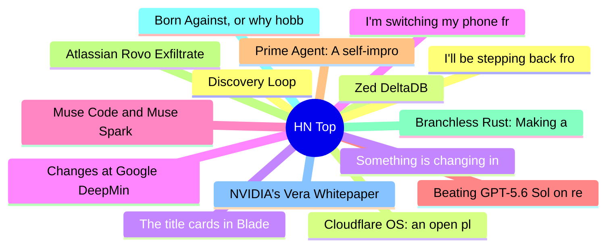

# HackerNews 每日 Top 30 (2026-08-06)

## 思维导图

## 列表（30 条）

### 1. Discovery Loop
- **链接**: [https://www.discoveryloop.com/](https://www.discoveryloop.com/)
- **分数**: 599 | **评论**: 383 | **作者**: xtreak29
- **HN 讨论**: https://news.ycombinator.com/item?id=49184960

### 2. Zed DeltaDB
- **链接**: [https://zed.dev/deltadb](https://zed.dev/deltadb)
- **分数**: 304 | **评论**: 156 | **作者**: ahamez
- **HN 讨论**: https://news.ycombinator.com/item?id=49187256

### 3. The title cards in Blade Runner are amazing
- **链接**: [https://randsinrepose.com/archives/blade-runner-title-cards/](https://randsinrepose.com/archives/blade-runner-title-cards/)
- **分数**: 144 | **评论**: 62 | **作者**: ExMachina73
- **HN 讨论**: https://news.ycombinator.com/item?id=49189287

### 4. Changes at Google DeepMind: Demis Hassabis from CEO to Chair, Jeff Dean departs
- **链接**: [https://blog.google/company-news/inside-google/message-ceo/next-chapter-ai-momentum/](https://blog.google/company-news/inside-google/message-ceo/next-chapter-ai-momentum/)
- **分数**: 476 | **评论**: 593 | **作者**: colesantiago
- **HN 讨论**: https://news.ycombinator.com/item?id=49184755

### 5. Muse Code and Muse Spark 1.2
- **链接**: [https://research.meta.ai/blog/introducing-muse-code-and-muse-spark-1-2](https://research.meta.ai/blog/introducing-muse-code-and-muse-spark-1-2)
- **分数**: 177 | **评论**: 106 | **作者**: paulkrush
- **HN 讨论**: https://news.ycombinator.com/item?id=49187575

### 6. Beating GPT-5.6 Sol on retrieval with 100x cheaper open models
- **链接**: [https://neon.com/blog/how-castform-neon-beats-frontier-models-on-price-and-efficiency](https://neon.com/blog/how-castform-neon-beats-frontier-models-on-price-and-efficiency)
- **分数**: 226 | **评论**: 47 | **作者**: moonikakiss
- **HN 讨论**: https://news.ycombinator.com/item?id=49186762

### 7. Prime Agent: A self-improving RLM agent
- **链接**: [https://www.primeintellect.ai/blog/prime-agent](https://www.primeintellect.ai/blog/prime-agent)
- **分数**: 105 | **评论**: 19 | **作者**: Xeophon
- **HN 讨论**: https://news.ycombinator.com/item?id=49189075

### 8. Atlassian Rovo Exfiltrates Data, Bypassing Controls
- **链接**: [https://www.promptarmor.com/resources/atlassian-rovo-exfiltrates-data](https://www.promptarmor.com/resources/atlassian-rovo-exfiltrates-data)
- **分数**: 171 | **评论**: 68 | **作者**: hackerBanana
- **HN 讨论**: https://news.ycombinator.com/item?id=49185983

### 9. Branchless Rust: Making a Filter 4x Faster by Removing an If
- **链接**: [https://www.greyblake.com/blog/branchless-rust/](https://www.greyblake.com/blog/branchless-rust/)
- **分数**: 15 | **评论**: 0 | **作者**: greyblake
- **HN 讨论**: https://news.ycombinator.com/item?id=49151991

### 10. Born Against, or why hobby programming communities are against LLM usage
- **链接**: [https://blog.fogus.me/llm/born-against.html](https://blog.fogus.me/llm/born-against.html)
- **分数**: 131 | **评论**: 141 | **作者**: lladnar
- **HN 讨论**: https://news.ycombinator.com/item?id=49187061

### 11. NVIDIA’s Vera Whitepaper Has a Thread Loose
- **链接**: [https://chipsandcheese.com/p/nvidias-vera-whitepaper-has-a-thread](https://chipsandcheese.com/p/nvidias-vera-whitepaper-has-a-thread)
- **分数**: 85 | **评论**: 13 | **作者**: pella
- **HN 讨论**: https://news.ycombinator.com/item?id=49189234

### 12. I'll be stepping back from leading product for X
- **链接**: [https://twitter.com/nikitabier/status/2085105586966827343/](https://twitter.com/nikitabier/status/2085105586966827343/)
- **分数**: 60 | **评论**: 80 | **作者**: DearAll
- **HN 讨论**: https://news.ycombinator.com/item?id=49189113

### 13. Cloudflare OS: an open platform for agents, apps, and work
- **链接**: [https://blog.cloudflare.com/cloudflare-os/](https://blog.cloudflare.com/cloudflare-os/)
- **分数**: 472 | **评论**: 237 | **作者**: speckx
- **HN 讨论**: https://news.ycombinator.com/item?id=49182996

### 14. Something is changing in the unit economics of software
- **链接**: [https://nicolo.xyz/something-is-changing-in-the-unit-economics-of-software/](https://nicolo.xyz/something-is-changing-in-the-unit-economics-of-software/)
- **分数**: 27 | **评论**: 20 | **作者**: coconido
- **HN 讨论**: https://news.ycombinator.com/item?id=49185111

### 15. I'm switching my phone from Android to Linux
- **链接**: [https://runarcn.no/android-to-linux/](https://runarcn.no/android-to-linux/)
- **分数**: 210 | **评论**: 173 | **作者**: speckx
- **HN 讨论**: https://news.ycombinator.com/item?id=49188022

### 16. GNU Hurd News 2026-Q2
- **链接**: [https://www.gnu.org/software/hurd/news/2026-q2.html](https://www.gnu.org/software/hurd/news/2026-q2.html)
- **分数**: 127 | **评论**: 91 | **作者**: plaguna
- **HN 讨论**: https://news.ycombinator.com/item?id=49146183

### 17. Celld: Self-hosted, distributed Durable Objects
- **链接**: [https://github.com/denoland/celld](https://github.com/denoland/celld)
- **分数**: 146 | **评论**: 25 | **作者**: calvinfo
- **HN 讨论**: https://news.ycombinator.com/item?id=49185430

### 18. Exact, parallel 2D Delaunay triangulation for int32 coordinates
- **链接**: [https://github.com/morishuz/delaunay32](https://github.com/morishuz/delaunay32)
- **分数**: 32 | **评论**: 2 | **作者**: oryx1729
- **HN 讨论**: https://news.ycombinator.com/item?id=49125532

### 19. Position: LLMs Can't Jump
- **链接**: [https://openreview.net/challenge?redirect=%2Fforum%3Fid%3DklU4737opt](https://openreview.net/challenge?redirect=%2Fforum%3Fid%3DklU4737opt)
- **分数**: 244 | **评论**: 166 | **作者**: theanonymousone
- **HN 讨论**: https://news.ycombinator.com/item?id=49181083

### 20. Goodhart's Law Comes for Every Benchmark You Trust
- **链接**: [https://cacm.acm.org/blogcacm/goodharts-law-comes-for-every-benchmark-you-trust/](https://cacm.acm.org/blogcacm/goodharts-law-comes-for-every-benchmark-you-trust/)
- **分数**: 62 | **评论**: 30 | **作者**: pseudolus
- **HN 讨论**: https://news.ycombinator.com/item?id=49126716

### 21. Pushing the limits of RISC-V emulation
- **链接**: [https://shuklaayu.sh/blog/riscv-recompiler](https://shuklaayu.sh/blog/riscv-recompiler)
- **分数**: 23 | **评论**: 8 | **作者**: shuklaayush
- **HN 讨论**: https://news.ycombinator.com/item?id=49099904

### 22. Launch HN: HyperProbe (YC S26) – Agents that do read-only debugging in prod
- **链接**: [https://www.hyperprobe.co](https://www.hyperprobe.co)
- **分数**: 44 | **评论**: 31 | **作者**: shailendraht
- **HN 讨论**: https://news.ycombinator.com/item?id=49185389

### 23. Discovery of a multicomponent alloy forged by the Hiroshima atomic blast
- **链接**: [https://www.science.org/doi/10.1126/sciadv.aeg8299](https://www.science.org/doi/10.1126/sciadv.aeg8299)
- **分数**: 111 | **评论**: 48 | **作者**: _____k
- **HN 讨论**: https://news.ycombinator.com/item?id=49115096

### 24. The Origins of Vintage Comics Part 1
- **链接**: [https://www.truegrittexturesupply.com/blogs/news/origins-of-the-vintage-comics-aesthetic-part-1](https://www.truegrittexturesupply.com/blogs/news/origins-of-the-vintage-comics-aesthetic-part-1)
- **分数**: 9 | **评论**: 1 | **作者**: Michelangelo11
- **HN 讨论**: https://news.ycombinator.com/item?id=49106756

### 25. The Entropy of a Markov Chain
- **链接**: [https://chillphysicsenjoyer.substack.com/p/the-entropy-of-a-markov-chain](https://chillphysicsenjoyer.substack.com/p/the-entropy-of-a-markov-chain)
- **分数**: 106 | **评论**: 9 | **作者**: surprisetalk
- **HN 讨论**: https://news.ycombinator.com/item?id=49183017

### 26. Sycophantic AI Decreases Prosocial Intentions and Promotes Dependence (2025)
- **链接**: [https://arxiv.org/abs/2510.01395](https://arxiv.org/abs/2510.01395)
- **分数**: 74 | **评论**: 53 | **作者**: robin_reala
- **HN 讨论**: https://news.ycombinator.com/item?id=49186720

### 27. Online Friends Are Real Friends
- **链接**: [https://toska.bearblog.dev/re-online-friends-are-real-friends/](https://toska.bearblog.dev/re-online-friends-are-real-friends/)
- **分数**: 66 | **评论**: 47 | **作者**: Tomte
- **HN 讨论**: https://news.ycombinator.com/item?id=49124917

### 28. The Valley of Webhooks
- **链接**: [https://weli.dev/blog/the-valley-of-webhooks/](https://weli.dev/blog/the-valley-of-webhooks/)
- **分数**: 154 | **评论**: 73 | **作者**: weli
- **HN 讨论**: https://news.ycombinator.com/item?id=49184216

### 29. What happens if you put work into the second dimension?
- **链接**: [https://norbertkozsir.com/posts/work-in-the-second-dimension/](https://norbertkozsir.com/posts/work-in-the-second-dimension/)
- **分数**: 51 | **评论**: 43 | **作者**: abelsm
- **HN 讨论**: https://news.ycombinator.com/item?id=49187084

### 30. Sula: A Gemini protocol server written in Scryer Prolog
- **链接**: [https://sagredo.dev/projects/sula/](https://sagredo.dev/projects/sula/)
- **分数**: 45 | **评论**: 2 | **作者**: triska
- **HN 讨论**: https://news.ycombinator.com/item?id=49187259
