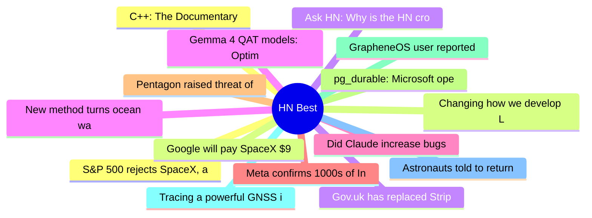

# HackerNews Best (高赞) Top 15 (2026-06-07)

## 思维导图

## 列表（15 条）

### 1. S&P 500 rejects SpaceX, also blocking entry for OpenAI and Anthropic
- **链接**: [https://arstechnica.com/tech-policy/2026/06/sp-500-blocks-fast-spacex-entry-wont-waive-rule-for-unprofitable-ai-firms/](https://arstechnica.com/tech-policy/2026/06/sp-500-blocks-fast-spacex-entry-wont-waive-rule-for-unprofitable-ai-firms/)
- **分数**: 1389 | **评论**: 480 | **作者**: maltalex
- **HN**: https://news.ycombinator.com/item?id=48421442

### 2. Changing how we develop Ladybird
- **链接**: [https://ladybird.org/posts/changing-how-we-develop-ladybird/](https://ladybird.org/posts/changing-how-we-develop-ladybird/)
- **分数**: 870 | **评论**: 545 | **作者**: EdwinHoksberg
- **HN**: https://news.ycombinator.com/item?id=48409191

### 3. Gov.uk has replaced Stripe with Dutch provider Adyen
- **链接**: [https://www.theregister.com/public-sector/2026/06/04/govuk-goes-dutch-on-payments-as-it-dumps-stripe/5250763](https://www.theregister.com/public-sector/2026/06/04/govuk-goes-dutch-on-payments-as-it-dumps-stripe/5250763)
- **分数**: 557 | **评论**: 214 | **作者**: toomuchtodo
- **HN**: https://news.ycombinator.com/item?id=48415217

### 4. New method turns ocean water into drinking water, without waste
- **链接**: [https://www.rochester.edu/newscenter/what-is-desalination-definition-ocean-water-704732/](https://www.rochester.edu/newscenter/what-is-desalination-definition-ocean-water-704732/)
- **分数**: 503 | **评论**: 206 | **作者**: speckx
- **HN**: https://news.ycombinator.com/item?id=48413500

### 5. Did Claude increase bugs in rsync?
- **链接**: [https://alexispurslane.github.io/rsync-analysis/](https://alexispurslane.github.io/rsync-analysis/)
- **分数**: 497 | **评论**: 508 | **作者**: logicprog
- **HN**: https://news.ycombinator.com/item?id=48411635

### 6. Meta confirms 1000s of Instagram accounts were hacked by abusing its AI chatbot
- **链接**: [https://this.weekinsecurity.com/meta-confirms-thousands-of-instagram-accounts-were-hacked-by-abusing-its-ai-chatbot/](https://this.weekinsecurity.com/meta-confirms-thousands-of-instagram-accounts-were-hacked-by-abusing-its-ai-chatbot/)
- **分数**: 477 | **评论**: 169 | **作者**: speckx
- **HN**: https://news.ycombinator.com/item?id=48427643

### 7. Pentagon raised threat of Israeli spying on U.S. to highest level, sources say
- **链接**: [https://www.nbcnews.com/politics/national-security/pentagon-raised-threat-israeli-spying-us-highest-level-sources-say-rcna348565](https://www.nbcnews.com/politics/national-security/pentagon-raised-threat-israeli-spying-us-highest-level-sources-say-rcna348565)
- **分数**: 468 | **评论**: 354 | **作者**: MilnerRoute
- **HN**: https://news.ycombinator.com/item?id=48427523

### 8. pg_durable: Microsoft open sources in-database durable execution
- **链接**: [https://github.com/microsoft/pg_durable](https://github.com/microsoft/pg_durable)
- **分数**: 461 | **评论**: 105 | **作者**: coffeemug
- **HN**: https://news.ycombinator.com/item?id=48414367

### 9. GrapheneOS user reported to authorities for using GrapheneOS
- **链接**: [https://discuss.grapheneos.org/d/36134-grapheneos-user-reported-to-authorities-for-using-grapheneos](https://discuss.grapheneos.org/d/36134-grapheneos-user-reported-to-authorities-for-using-grapheneos)
- **分数**: 438 | **评论**: 452 | **作者**: Cider9986
- **HN**: https://news.ycombinator.com/item?id=48422798

### 10. Tracing a powerful GNSS interference source over Europe
- **链接**: [https://arxiv.org/abs/2606.03673](https://arxiv.org/abs/2606.03673)
- **分数**: 419 | **评论**: 220 | **作者**: mimorigasaka
- **HN**: https://news.ycombinator.com/item?id=48409664

### 11. Astronauts told to return to ISS after sheltering over air leak repairs
- **链接**: [https://www.bbc.com/news/live/c4g44ew3g1kt](https://www.bbc.com/news/live/c4g44ew3g1kt)
- **分数**: 417 | **评论**: 262 | **作者**: janpot
- **HN**: https://news.ycombinator.com/item?id=48413464

### 12. C++: The Documentary
- **链接**: [https://herbsutter.com/2026/06/04/c-the-documentary-released-today/](https://herbsutter.com/2026/06/04/c-the-documentary-released-today/)
- **分数**: 417 | **评论**: 304 | **作者**: ingve
- **HN**: https://news.ycombinator.com/item?id=48408016

### 13. Google will pay SpaceX $920M per month for compute
- **链接**: [https://techcrunch.com/2026/06/05/google-will-pay-spacex-920m-per-month-for-compute/](https://techcrunch.com/2026/06/05/google-will-pay-spacex-920m-per-month-for-compute/)
- **分数**: 406 | **评论**: 2 | **作者**: ramanan
- **HN**: https://news.ycombinator.com/item?id=48423990

### 14. Ask HN: Why is the HN crowd so anti-AI?
- **链接**: [https://news.ycombinator.com/item?id=48420827](https://news.ycombinator.com/item?id=48420827)
- **分数**: 401 | **评论**: 666 | **作者**: Ekami
- **HN**: https://news.ycombinator.com/item?id=48420827

### 15. Gemma 4 QAT models: Optimizing compression for mobile and laptop efficiency
- **链接**: [https://blog.google/innovation-and-ai/technology/developers-tools/quantization-aware-training-gemma-4/](https://blog.google/innovation-and-ai/technology/developers-tools/quantization-aware-training-gemma-4/)
- **分数**: 395 | **评论**: 122 | **作者**: theanonymousone
- **HN**: https://news.ycombinator.com/item?id=48414653
