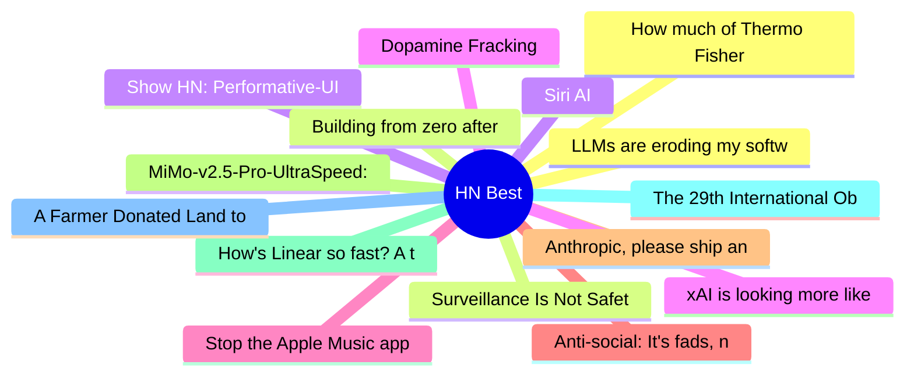

# HackerNews Best (高赞) Top 15 (2026-06-09)

## 思维导图

## 列表（15 条）

### 1. LLMs are eroding my software engineering career and I don't know what to do
- **链接**: [https://human-in-the-loop.bearblog.dev/llms-are-eroding-my-software-engineering-career-and-i-dont-know-what-to-do/](https://human-in-the-loop.bearblog.dev/llms-are-eroding-my-software-engineering-career-and-i-dont-know-what-to-do/)
- **分数**: 1104 | **评论**: 1049 | **作者**: poisonfountain
- **HN**: https://news.ycombinator.com/item?id=48434312

### 2. Building from zero after addiction, prison, and a felony
- **链接**: [https://gavinray97.github.io/blog/building-from-zero-after-addiction-prison-felony](https://gavinray97.github.io/blog/building-from-zero-after-addiction-prison-felony)
- **分数**: 880 | **评论**: 398 | **作者**: gavinray
- **HN**: https://news.ycombinator.com/item?id=48437406

### 3. Show HN: Performative-UI – A react component library of design tropes
- **链接**: [https://vorpus.github.io/performativeUI/](https://vorpus.github.io/performativeUI/)
- **分数**: 763 | **评论**: 154 | **作者**: lizhang
- **HN**: https://news.ycombinator.com/item?id=48445554

### 4. Dopamine Fracking
- **链接**: [https://igerman.cc/blog/dopamine-fracking/](https://igerman.cc/blog/dopamine-fracking/)
- **分数**: 751 | **评论**: 382 | **作者**: igmn
- **HN**: https://news.ycombinator.com/item?id=48440792

### 5. Stop the Apple Music app from launching
- **链接**: [https://lowtechguys.com/musicdecoy/](https://lowtechguys.com/musicdecoy/)
- **分数**: 568 | **评论**: 231 | **作者**: bobbiechen
- **HN**: https://news.ycombinator.com/item?id=48447935

### 6. Anti-social: It's fads, not friends, which now dominate social media feeds
- **链接**: [https://www.bbc.com/worklife/article/20260520-how-social-media-ceased-to-be-social](https://www.bbc.com/worklife/article/20260520-how-social-media-ceased-to-be-social)
- **分数**: 544 | **评论**: 406 | **作者**: 1vuio0pswjnm7
- **HN**: https://news.ycombinator.com/item?id=48444228

### 7. Anthropic, please ship an official Claude Desktop for Linux
- **链接**: [https://github.com/anthropics/claude-code/issues/65697](https://github.com/anthropics/claude-code/issues/65697)
- **分数**: 524 | **评论**: 299 | **作者**: predkambrij
- **HN**: https://news.ycombinator.com/item?id=48434436

### 8. MiMo-v2.5-Pro-UltraSpeed: 1T model with 1000 tokens per second
- **链接**: [https://mimo.xiaomi.com/blog/mimo-tilert-1000tps](https://mimo.xiaomi.com/blog/mimo-tilert-1000tps)
- **分数**: 490 | **评论**: 335 | **作者**: gainsurier
- **HN**: https://news.ycombinator.com/item?id=48446639

### 9. How's Linear so fast? A technical breakdown
- **链接**: [https://performance.dev/how-is-linear-so-fast-a-technical-breakdown](https://performance.dev/how-is-linear-so-fast-a-technical-breakdown)
- **分数**: 478 | **评论**: 227 | **作者**: howToTestFE
- **HN**: https://news.ycombinator.com/item?id=48437609

### 10. The 29th International Obfuscated C Code Contest (IOCCC) 2025 Winners
- **链接**: [https://www.ioccc.org/2025/](https://www.ioccc.org/2025/)
- **分数**: 420 | **评论**: 96 | **作者**: matt_d
- **HN**: https://news.ycombinator.com/item?id=48432199

### 11. A Farmer Donated Land to Turn into a Park. The City Is Building a Data Center
- **链接**: [https://www.404media.co/a-farmer-donated-land-to-turn-into-a-park-the-city-is-building-a-massive-data-center-instead/](https://www.404media.co/a-farmer-donated-land-to-turn-into-a-park-the-city-is-building-a-massive-data-center-instead/)
- **分数**: 413 | **评论**: 230 | **作者**: greedo
- **HN**: https://news.ycombinator.com/item?id=48446439

### 12. How much of Thermo Fisher's antibody data has been manipulated?
- **链接**: [https://reeserichardson.blog/2026/05/28/how-much-of-thermo-fishers-antibody-data-has-been-manipulated/](https://reeserichardson.blog/2026/05/28/how-much-of-thermo-fishers-antibody-data-has-been-manipulated/)
- **分数**: 408 | **评论**: 88 | **作者**: mhrmsn
- **HN**: https://news.ycombinator.com/item?id=48442075

### 13. Surveillance Is Not Safety: A statement on the UK's latest threat to privacy [pdf]
- **链接**: [https://signal.org/blog/pdfs/2026-06-08-uk-surveillance-is-not-safety.pdf](https://signal.org/blog/pdfs/2026-06-08-uk-surveillance-is-not-safety.pdf)
- **分数**: 394 | **评论**: 129 | **作者**: g0xA52A2A
- **HN**: https://news.ycombinator.com/item?id=48450646

### 14. Siri AI
- **链接**: [https://www.apple.com/apple-intelligence/](https://www.apple.com/apple-intelligence/)
- **分数**: 391 | **评论**: 339 | **作者**: 0xedb
- **HN**: https://news.ycombinator.com/item?id=48449084

### 15. xAI is looking more like a datacentre REIT than a frontier lab
- **链接**: [https://martinalderson.com/posts/xais-new-rental-business/](https://martinalderson.com/posts/xais-new-rental-business/)
- **分数**: 389 | **评论**: 307 | **作者**: martinald
- **HN**: https://news.ycombinator.com/item?id=48446428
