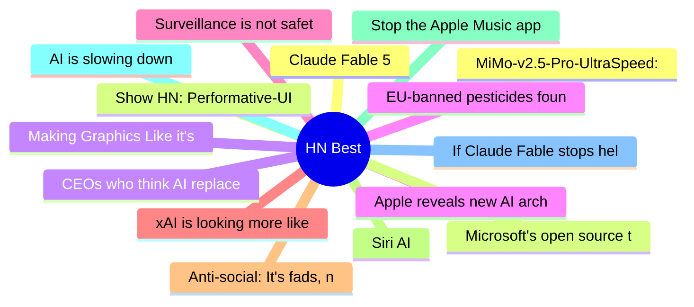

# HackerNews Best (高赞) Top 15 (2026-06-10)

## 思维导图

## 列表（15 条）

### 1. Claude Fable 5
- **链接**: [https://www.anthropic.com/news/claude-fable-5-mythos-5](https://www.anthropic.com/news/claude-fable-5-mythos-5)
- **分数**: 1929 | **评论**: 1513 | **作者**: Philpax
- **HN**: https://news.ycombinator.com/item?id=48463808

### 2. Show HN: Performative-UI – A react component library of design tropes
- **链接**: [https://vorpus.github.io/performativeUI/](https://vorpus.github.io/performativeUI/)
- **分数**: 1133 | **评论**: 205 | **作者**: lizhang
- **HN**: https://news.ycombinator.com/item?id=48445554

### 3. Making Graphics Like it's 1993
- **链接**: [https://staniks.github.io/articles/catlantean-3d-blog-1/](https://staniks.github.io/articles/catlantean-3d-blog-1/)
- **分数**: 808 | **评论**: 137 | **作者**: sklopec
- **HN**: https://news.ycombinator.com/item?id=48459294

### 4. Apple reveals new AI architecture built around Google Gemini models
- **链接**: [https://www.macrumors.com/2026/06/08/apple-reveals-new-ai-architecture/](https://www.macrumors.com/2026/06/08/apple-reveals-new-ai-architecture/)
- **分数**: 715 | **评论**: 553 | **作者**: unclefuzzy
- **HN**: https://news.ycombinator.com/item?id=48450142

### 5. Surveillance is not safety: A statement on the UK's latest threat to privacy [pdf]
- **链接**: [https://signal.org/blog/pdfs/2026-06-08-uk-surveillance-is-not-safety.pdf](https://signal.org/blog/pdfs/2026-06-08-uk-surveillance-is-not-safety.pdf)
- **分数**: 680 | **评论**: 309 | **作者**: g0xA52A2A
- **HN**: https://news.ycombinator.com/item?id=48450646

### 6. xAI is looking more like a datacentre REIT than a frontier lab
- **链接**: [https://martinalderson.com/posts/xais-new-rental-business/](https://martinalderson.com/posts/xais-new-rental-business/)
- **分数**: 678 | **评论**: 533 | **作者**: martinald
- **HN**: https://news.ycombinator.com/item?id=48446428

### 7. Anti-social: It's fads, not friends, which now dominate social media feeds
- **链接**: [https://www.bbc.com/worklife/article/20260520-how-social-media-ceased-to-be-social](https://www.bbc.com/worklife/article/20260520-how-social-media-ceased-to-be-social)
- **分数**: 671 | **评论**: 458 | **作者**: 1vuio0pswjnm7
- **HN**: https://news.ycombinator.com/item?id=48444228

### 8. Siri AI
- **链接**: [https://www.apple.com/apple-intelligence/](https://www.apple.com/apple-intelligence/)
- **分数**: 663 | **评论**: 687 | **作者**: 0xedb
- **HN**: https://news.ycombinator.com/item?id=48449084

### 9. Stop the Apple Music app from launching
- **链接**: [https://lowtechguys.com/musicdecoy/](https://lowtechguys.com/musicdecoy/)
- **分数**: 657 | **评论**: 266 | **作者**: bobbiechen
- **HN**: https://news.ycombinator.com/item?id=48447935

### 10. AI is slowing down
- **链接**: [https://www.wheresyoured.at/ai-is-slowing-down/](https://www.wheresyoured.at/ai-is-slowing-down/)
- **分数**: 647 | **评论**: 748 | **作者**: crescit_eundo
- **HN**: https://news.ycombinator.com/item?id=48446893

### 11. If Claude Fable stops helping you, you'll never know
- **链接**: [https://jonready.com/blog/posts/claude-fable5-is-allowed-to-sabotage-your-app-if-youre-a-competitor.html](https://jonready.com/blog/posts/claude-fable5-is-allowed-to-sabotage-your-app-if-youre-a-competitor.html)
- **分数**: 623 | **评论**: 308 | **作者**: mips_avatar
- **HN**: https://news.ycombinator.com/item?id=48467896

### 12. MiMo-v2.5-Pro-UltraSpeed: 1T model with 1000 tokens per second
- **链接**: [https://mimo.xiaomi.com/blog/mimo-tilert-1000tps](https://mimo.xiaomi.com/blog/mimo-tilert-1000tps)
- **分数**: 614 | **评论**: 468 | **作者**: gainsurier
- **HN**: https://news.ycombinator.com/item?id=48446639

### 13. Microsoft's open source tools were hacked to steal passwords of AI developers
- **链接**: [https://techcrunch.com/2026/06/08/microsofts-open-source-tools-were-hacked-to-steal-passwords-of-ai-developers/](https://techcrunch.com/2026/06/08/microsofts-open-source-tools-were-hacked-to-steal-passwords-of-ai-developers/)
- **分数**: 532 | **评论**: 183 | **作者**: raffael_de
- **HN**: https://news.ycombinator.com/item?id=48457830

### 14. CEOs who think AI replaces their employees are just bad CEOs
- **链接**: [https://www.techdirt.com/2026/06/09/ceos-who-think-ai-replaces-their-employees-are-just-bad-ceos/](https://www.techdirt.com/2026/06/09/ceos-who-think-ai-replaces-their-employees-are-just-bad-ceos/)
- **分数**: 513 | **评论**: 208 | **作者**: speckx
- **HN**: https://news.ycombinator.com/item?id=48465675

### 15. EU-banned pesticides found in rice, tea and spices
- **链接**: [https://www.foodwatch.org/en/eu-banned-pesticides-found-in-rice-tea-and-spices](https://www.foodwatch.org/en/eu-banned-pesticides-found-in-rice-tea-and-spices)
- **分数**: 506 | **评论**: 286 | **作者**: john-titor
- **HN**: https://news.ycombinator.com/item?id=48447062
