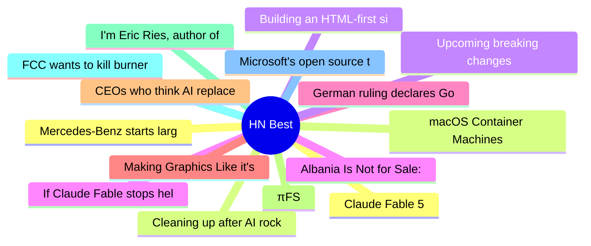

# HackerNews Best (高赞) Top 15 (2026-06-11)

## 思维导图

## 列表（15 条）

### 1. Claude Fable 5
- **链接**: [https://www.anthropic.com/news/claude-fable-5-mythos-5](https://www.anthropic.com/news/claude-fable-5-mythos-5)
- **分数**: 2554 | **评论**: 2088 | **作者**: Philpax
- **HN**: https://news.ycombinator.com/item?id=48463808

### 2. macOS Container Machines
- **链接**: [https://github.com/apple/container/blob/main/docs/container-machine.md](https://github.com/apple/container/blob/main/docs/container-machine.md)
- **分数**: 1204 | **评论**: 419 | **作者**: timsneath
- **HN**: https://news.ycombinator.com/item?id=48469658

### 3. Building an HTML-first site doubled our users overnight
- **链接**: [https://mohkohn.co.uk/writing/html-first/](https://mohkohn.co.uk/writing/html-first/)
- **分数**: 1031 | **评论**: 475 | **作者**: edent
- **HN**: https://news.ycombinator.com/item?id=48475483

### 4. If Claude Fable stops helping you, you'll never know
- **链接**: [https://jonready.com/blog/posts/claude-fable5-is-allowed-to-sabotage-your-app-if-youre-a-competitor.html](https://jonready.com/blog/posts/claude-fable5-is-allowed-to-sabotage-your-app-if-youre-a-competitor.html)
- **分数**: 1008 | **评论**: 494 | **作者**: mips_avatar
- **HN**: https://news.ycombinator.com/item?id=48467896

### 5. German ruling declares Google liable for false answers in AI Overviews
- **链接**: [https://the-decoder.com/landmark-german-ruling-declares-googles-ai-overviews-are-googles-own-words-and-makes-it-liable-for-false-answers/](https://the-decoder.com/landmark-german-ruling-declares-googles-ai-overviews-are-googles-own-words-and-makes-it-liable-for-false-answers/)
- **分数**: 970 | **评论**: 513 | **作者**: ahlCVA
- **HN**: https://news.ycombinator.com/item?id=48470248

### 6. Making Graphics Like it's 1993
- **链接**: [https://staniks.github.io/articles/catlantean-3d-blog-1/](https://staniks.github.io/articles/catlantean-3d-blog-1/)
- **分数**: 920 | **评论**: 154 | **作者**: sklopec
- **HN**: https://news.ycombinator.com/item?id=48459294

### 7. CEOs who think AI replaces their employees are just bad CEOs
- **链接**: [https://www.techdirt.com/2026/06/09/ceos-who-think-ai-replaces-their-employees-are-just-bad-ceos/](https://www.techdirt.com/2026/06/09/ceos-who-think-ai-replaces-their-employees-are-just-bad-ceos/)
- **分数**: 816 | **评论**: 297 | **作者**: speckx
- **HN**: https://news.ycombinator.com/item?id=48465675

### 8. πFS
- **链接**: [https://github.com/philipl/pifs](https://github.com/philipl/pifs)
- **分数**: 583 | **评论**: 142 | **作者**: helterskelter
- **HN**: https://news.ycombinator.com/item?id=48480978

### 9. I'm Eric Ries, author of "The Lean Startup" and new book "Incorruptible" – AMA
- **链接**: [https://news.ycombinator.com/item?id=48477135](https://news.ycombinator.com/item?id=48477135)
- **分数**: 574 | **评论**: 439 | **作者**: eries
- **HN**: https://news.ycombinator.com/item?id=48477135

### 10. FCC wants to kill burner phones by forcing telecoms to get all customers' IDs
- **链接**: [https://www.404media.co/fcc-wants-to-kill-burner-phones-by-forcing-telecoms-to-get-all-customers-ids/](https://www.404media.co/fcc-wants-to-kill-burner-phones-by-forcing-telecoms-to-get-all-customers-ids/)
- **分数**: 572 | **评论**: 385 | **作者**: berlianta
- **HN**: https://news.ycombinator.com/item?id=48462308

### 11. Microsoft's open source tools were hacked to steal passwords of AI developers
- **链接**: [https://techcrunch.com/2026/06/08/microsofts-open-source-tools-were-hacked-to-steal-passwords-of-ai-developers/](https://techcrunch.com/2026/06/08/microsofts-open-source-tools-were-hacked-to-steal-passwords-of-ai-developers/)
- **分数**: 554 | **评论**: 193 | **作者**: raffael_de
- **HN**: https://news.ycombinator.com/item?id=48457830

### 12. Mercedes‑Benz starts large‑scale production of electric axial flux motor
- **链接**: [https://media.mercedes-benz.com/en/article/bebac2af-acdc-465a-9538-adb0bf3d8ccf](https://media.mercedes-benz.com/en/article/bebac2af-acdc-465a-9538-adb0bf3d8ccf)
- **分数**: 517 | **评论**: 327 | **作者**: raffael_de
- **HN**: https://news.ycombinator.com/item?id=48472877

### 13. Cleaning up after AI rockstar developers
- **链接**: [https://www.codingwithjesse.com/blog/rockstar-developers/](https://www.codingwithjesse.com/blog/rockstar-developers/)
- **分数**: 487 | **评论**: 357 | **作者**: BrunoBernardino
- **HN**: https://news.ycombinator.com/item?id=48458586

### 14. Upcoming breaking changes for npm v12
- **链接**: [https://github.blog/changelog/2026-06-09-upcoming-breaking-changes-for-npm-v12/](https://github.blog/changelog/2026-06-09-upcoming-breaking-changes-for-npm-v12/)
- **分数**: 469 | **评论**: 206 | **作者**: plasma
- **HN**: https://news.ycombinator.com/item?id=48467705

### 15. Albania Is Not for Sale: Kushner's $4B Resort Triggers'Flamingo Revolution'
- **链接**: [https://www.yacnews.com/albania-is-not-for-sale-kushners-4-billion-resort-triggers-flamingo-revolution-asset-freeze-and-an-eu-warning/](https://www.yacnews.com/albania-is-not-for-sale-kushners-4-billion-resort-triggers-flamingo-revolution-asset-freeze-and-an-eu-warning/)
- **分数**: 451 | **评论**: 218 | **作者**: ortr
- **HN**: https://news.ycombinator.com/item?id=48461012
