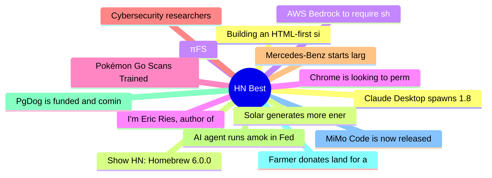

# HackerNews Best (高赞) Top 15 (2026-06-12)

## 思维导图

## 列表（15 条）

### 1. Building an HTML-first site doubled our users overnight
- **链接**: [https://mohkohn.co.uk/writing/html-first/](https://mohkohn.co.uk/writing/html-first/)
- **分数**: 1236 | **评论**: 558 | **作者**: edent
- **HN**: https://news.ycombinator.com/item?id=48475483

### 2. Show HN: Homebrew 6.0.0
- **链接**: [https://brew.sh/2026/06/11/homebrew-6.0.0/](https://brew.sh/2026/06/11/homebrew-6.0.0/)
- **分数**: 1067 | **评论**: 245 | **作者**: mikemcquaid
- **HN**: https://news.ycombinator.com/item?id=48490024

### 3. πFS
- **链接**: [https://github.com/philipl/pifs](https://github.com/philipl/pifs)
- **分数**: 934 | **评论**: 201 | **作者**: helterskelter
- **HN**: https://news.ycombinator.com/item?id=48480978

### 4. I'm Eric Ries, author of "The Lean Startup" and new book "Incorruptible" – AMA
- **链接**: [https://news.ycombinator.com/item?id=48477135](https://news.ycombinator.com/item?id=48477135)
- **分数**: 775 | **评论**: 549 | **作者**: eries
- **HN**: https://news.ycombinator.com/item?id=48477135

### 5. Pokémon Go Scans Trained the Navigation Tech for Military Drones
- **链接**: [https://dronexl.co/2026/06/09/pokemon-go-scans-niantic-vantor-military-drone-navigation/](https://dronexl.co/2026/06/09/pokemon-go-scans-niantic-vantor-military-drone-navigation/)
- **分数**: 686 | **评论**: 307 | **作者**: vrganj
- **HN**: https://news.ycombinator.com/item?id=48487029

### 6. Cybersecurity researchers aren't happy about the guardrails on Anthropic's Fable
- **链接**: [https://techcrunch.com/2026/06/10/cybersecurity-researchers-arent-happy-about-the-guardrails-on-anthropics-fable/](https://techcrunch.com/2026/06/10/cybersecurity-researchers-arent-happy-about-the-guardrails-on-anthropics-fable/)
- **分数**: 581 | **评论**: 515 | **作者**: speckx
- **HN**: https://news.ycombinator.com/item?id=48478969

### 7. Mercedes‑Benz starts large‑scale production of electric axial flux motor
- **链接**: [https://media.mercedes-benz.com/en/article/bebac2af-acdc-465a-9538-adb0bf3d8ccf](https://media.mercedes-benz.com/en/article/bebac2af-acdc-465a-9538-adb0bf3d8ccf)
- **分数**: 541 | **评论**: 346 | **作者**: raffael_de
- **HN**: https://news.ycombinator.com/item?id=48472877

### 8. AI agent runs amok in Fedora and elsewhere
- **链接**: [https://lwn.net/SubscriberLink/1077035/c7e7c14fbd60fae9/](https://lwn.net/SubscriberLink/1077035/c7e7c14fbd60fae9/)
- **分数**: 540 | **评论**: 239 | **作者**: tanelpoder
- **HN**: https://news.ycombinator.com/item?id=48484584

### 9. PgDog is funded and coming to a database near you
- **链接**: [https://pgdog.dev/blog/our-funding-announcement](https://pgdog.dev/blog/our-funding-announcement)
- **分数**: 536 | **评论**: 250 | **作者**: levkk
- **HN**: https://news.ycombinator.com/item?id=48476466

### 10. Farmer donates land for a park, city sells it for $10M as data center land
- **链接**: [https://www.tomshardware.com/tech-industry/farmer-donates-land-for-a-park-city-sells-it-for-data-center-development-usd10-gift-became-usd10m-for-city-government-with-usd30m-tax-expected-over-next-decade](https://www.tomshardware.com/tech-industry/farmer-donates-land-for-a-park-city-sells-it-for-data-center-development-usd10-gift-became-usd10m-for-city-government-with-usd30m-tax-expected-over-next-decade)
- **分数**: 468 | **评论**: 3 | **作者**: maxloh
- **HN**: https://news.ycombinator.com/item?id=48481126

### 11. MiMo Code is now released and open-source
- **链接**: [https://mimo.xiaomi.com/mimocode](https://mimo.xiaomi.com/mimocode)
- **分数**: 446 | **评论**: 253 | **作者**: apeters
- **HN**: https://news.ycombinator.com/item?id=48490826

### 12. Claude Desktop spawns 1.8 GB Hyper-V VM on every launch, even for chat-only use
- **链接**: [https://github.com/anthropics/claude-code/issues/29045](https://github.com/anthropics/claude-code/issues/29045)
- **分数**: 429 | **评论**: 300 | **作者**: tonyrice
- **HN**: https://news.ycombinator.com/item?id=48479452

### 13. Solar generates more energy in US than coal for first time
- **链接**: [https://www.theguardian.com/us-news/2026/jun/11/solar-energy-us-coal](https://www.theguardian.com/us-news/2026/jun/11/solar-energy-us-coal)
- **分数**: 428 | **评论**: 204 | **作者**: neilfrndes
- **HN**: https://news.ycombinator.com/item?id=48492306

### 14. AWS Bedrock to require sharing data with Anthropic for Mythos and future models
- **链接**: [https://news.ycombinator.com/item?id=48473166](https://news.ycombinator.com/item?id=48473166)
- **分数**: 416 | **评论**: 251 | **作者**: TomAnthony
- **HN**: https://news.ycombinator.com/item?id=48473166

### 15. Chrome is looking to permanently drop MV2 extension
- **链接**: [https://www.neowin.net/news/google-chrome-is-killing-all-ublock-origin-bypasses-microsoft-edge-opera-to-follow/](https://www.neowin.net/news/google-chrome-is-killing-all-ublock-origin-bypasses-microsoft-edge-opera-to-follow/)
- **分数**: 412 | **评论**: 432 | **作者**: d3Xt3r
- **HN**: https://news.ycombinator.com/item?id=48471970
