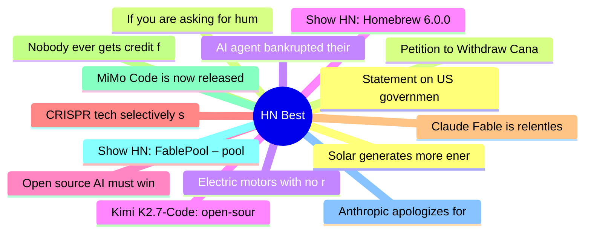

# HackerNews Best (高赞) Top 15 (2026-06-13)

## 思维导图

## 列表（15 条）

### 1. Statement on US government directive to suspend access to Fable 5 and Mythos 5
- **链接**: [https://www.anthropic.com/news/fable-mythos-access](https://www.anthropic.com/news/fable-mythos-access)
- **分数**: 2343 | **评论**: 1684 | **作者**: Dylan1312
- **HN**: https://news.ycombinator.com/item?id=48511072

### 2. If you are asking for human attention, demonstrate human effort
- **链接**: [https://tombedor.dev/human-attention-and-human-effort/](https://tombedor.dev/human-attention-and-human-effort/)
- **分数**: 1605 | **评论**: 476 | **作者**: jjfoooo4
- **HN**: https://news.ycombinator.com/item?id=48497609

### 3. AI agent bankrupted their operator while trying to scan DN42
- **链接**: [https://lantian.pub/en/article/fun/ai-agent-bankrupted-their-operator-scan-dn42lantian.lantian/](https://lantian.pub/en/article/fun/ai-agent-bankrupted-their-operator-scan-dn42lantian.lantian/)
- **分数**: 1417 | **评论**: 515 | **作者**: xiaoyu2006
- **HN**: https://news.ycombinator.com/item?id=48500012

### 4. Show HN: Homebrew 6.0.0
- **链接**: [https://brew.sh/2026/06/11/homebrew-6.0.0/](https://brew.sh/2026/06/11/homebrew-6.0.0/)
- **分数**: 1413 | **评论**: 343 | **作者**: mikemcquaid
- **HN**: https://news.ycombinator.com/item?id=48490024

### 5. Open source AI must win
- **链接**: [https://opensourceaimustwin.com/?share=v2](https://opensourceaimustwin.com/?share=v2)
- **分数**: 952 | **评论**: 302 | **作者**: vednig
- **HN**: https://news.ycombinator.com/item?id=48511908

### 6. CRISPR tech selectively shreds cancer cells, including "undruggable" cancers
- **链接**: [https://innovativegenomics.org/news/crispr-technique-selectively-shreds-cancer-cells/](https://innovativegenomics.org/news/crispr-technique-selectively-shreds-cancer-cells/)
- **分数**: 828 | **评论**: 190 | **作者**: gmays
- **HN**: https://news.ycombinator.com/item?id=48505231

### 7. Claude Fable is relentlessly proactive
- **链接**: [https://simonwillison.net/2026/Jun/11/fable-is-relentlessly-proactive/](https://simonwillison.net/2026/Jun/11/fable-is-relentlessly-proactive/)
- **分数**: 744 | **评论**: 643 | **作者**: lumpa
- **HN**: https://news.ycombinator.com/item?id=48498573

### 8. Nobody ever gets credit for fixing problems that never happened (2001) [pdf]
- **链接**: [https://web.mit.edu/nelsonr/www/Repenning=Sterman_CMR_su01_.pdf](https://web.mit.edu/nelsonr/www/Repenning=Sterman_CMR_su01_.pdf)
- **分数**: 740 | **评论**: 254 | **作者**: sam_bristow
- **HN**: https://news.ycombinator.com/item?id=48498385

### 9. MiMo Code is now released and open-source
- **链接**: [https://mimo.xiaomi.com/mimocode](https://mimo.xiaomi.com/mimocode)
- **分数**: 548 | **评论**: 307 | **作者**: apeters
- **HN**: https://news.ycombinator.com/item?id=48490826

### 10. Show HN: FablePool – pool money behind a prompt, and Fable builds it in public
- **链接**: [https://fablepool.com](https://fablepool.com)
- **分数**: 511 | **评论**: 272 | **作者**: matthewbarras
- **HN**: https://news.ycombinator.com/item?id=48496539

### 11. Anthropic apologizes for invisible Claude Fable guardrails
- **链接**: [https://www.theverge.com/ai-artificial-intelligence/948280/anthropic-claude-fable-invisible-distillation-guardrail](https://www.theverge.com/ai-artificial-intelligence/948280/anthropic-claude-fable-invisible-distillation-guardrail)
- **分数**: 503 | **评论**: 439 | **作者**: rarisma
- **HN**: https://news.ycombinator.com/item?id=48489229

### 12. Solar generates more energy in US than coal for first time
- **链接**: [https://www.theguardian.com/us-news/2026/jun/11/solar-energy-us-coal](https://www.theguardian.com/us-news/2026/jun/11/solar-energy-us-coal)
- **分数**: 494 | **评论**: 250 | **作者**: neilfrndes
- **HN**: https://news.ycombinator.com/item?id=48492306

### 13. Petition to Withdraw Canada's Bill C-22
- **链接**: [https://www.ourcommons.ca/petitions/en/Petition/Sign/e-7416](https://www.ourcommons.ca/petitions/en/Petition/Sign/e-7416)
- **分数**: 493 | **评论**: 155 | **作者**: hmokiguess
- **HN**: https://news.ycombinator.com/item?id=48491830

### 14. Electric motors with no rare earths
- **链接**: [https://www.renaultgroup.com/en/magazine/energy-and-powertrains/all-about-electric-motors-with-no-rare-earths/](https://www.renaultgroup.com/en/magazine/energy-and-powertrains/all-about-electric-motors-with-no-rare-earths/)
- **分数**: 476 | **评论**: 132 | **作者**: bestouff
- **HN**: https://news.ycombinator.com/item?id=48510010

### 15. Kimi K2.7-Code: open-source coding model with better token efficiency
- **链接**: [https://huggingface.co/moonshotai/Kimi-K2.7-Code](https://huggingface.co/moonshotai/Kimi-K2.7-Code)
- **分数**: 430 | **评论**: 225 | **作者**: nekofneko
- **HN**: https://news.ycombinator.com/item?id=48502347
