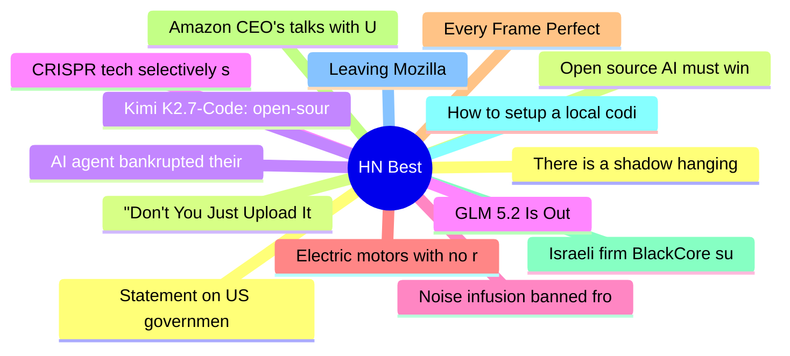

# HackerNews Best (高赞) Top 15 (2026-06-14)

## 思维导图

## 列表（15 条）

### 1. Statement on US government directive to suspend access to Fable 5 and Mythos 5
- **链接**: [https://www.anthropic.com/news/fable-mythos-access](https://www.anthropic.com/news/fable-mythos-access)
- **分数**: 3063 | **评论**: 2229 | **作者**: Dylan1312
- **HN**: https://news.ycombinator.com/item?id=48511072

### 2. Open source AI must win
- **链接**: [https://opensourceaimustwin.com/?share=v2](https://opensourceaimustwin.com/?share=v2)
- **分数**: 1525 | **评论**: 464 | **作者**: vednig
- **HN**: https://news.ycombinator.com/item?id=48511908

### 3. AI agent bankrupted their operator while trying to scan DN42
- **链接**: [https://lantian.pub/en/article/fun/ai-agent-bankrupted-their-operator-scan-dn42lantian.lantian/](https://lantian.pub/en/article/fun/ai-agent-bankrupted-their-operator-scan-dn42lantian.lantian/)
- **分数**: 1443 | **评论**: 525 | **作者**: xiaoyu2006
- **HN**: https://news.ycombinator.com/item?id=48500012

### 4. CRISPR tech selectively shreds cancer cells, including "undruggable" cancers
- **链接**: [https://innovativegenomics.org/news/crispr-technique-selectively-shreds-cancer-cells/](https://innovativegenomics.org/news/crispr-technique-selectively-shreds-cancer-cells/)
- **分数**: 965 | **评论**: 209 | **作者**: gmays
- **HN**: https://news.ycombinator.com/item?id=48505231

### 5. Noise infusion banned from statistical products published by Census Bureau
- **链接**: [https://desfontain.es/blog/banning-noise.html](https://desfontain.es/blog/banning-noise.html)
- **分数**: 771 | **评论**: 482 | **作者**: nl
- **HN**: https://news.ycombinator.com/item?id=48517377

### 6. Electric motors with no rare earths
- **链接**: [https://www.renaultgroup.com/en/magazine/energy-and-powertrains/all-about-electric-motors-with-no-rare-earths/](https://www.renaultgroup.com/en/magazine/energy-and-powertrains/all-about-electric-motors-with-no-rare-earths/)
- **分数**: 684 | **评论**: 200 | **作者**: bestouff
- **HN**: https://news.ycombinator.com/item?id=48510010

### 7. Every Frame Perfect
- **链接**: [https://tonsky.me/blog/every-frame-perfect/](https://tonsky.me/blog/every-frame-perfect/)
- **分数**: 621 | **评论**: 203 | **作者**: ravenical
- **HN**: https://news.ycombinator.com/item?id=48516251

### 8. Amazon CEO's talks with U.S. officials triggered crackdown on Anthropic models
- **链接**: [https://www.wsj.com/tech/ai/amazon-ceos-talks-with-u-s-officials-triggered-crackdown-on-anthropic-models-dcc90578?st=Yct6gx&reflink=desktopwebshare_permalink](https://www.wsj.com/tech/ai/amazon-ceos-talks-with-u-s-officials-triggered-crackdown-on-anthropic-models-dcc90578?st=Yct6gx&reflink=desktopwebshare_permalink)
- **分数**: 605 | **评论**: 443 | **作者**: ls612
- **HN**: https://news.ycombinator.com/item?id=48519092

### 9. Israeli firm BlackCore suspected of meddling in New York and Scotland votes
- **链接**: [https://www.reuters.com/world/israeli-firm-blackcore-also-suspected-meddling-nyc-scotland-votes-french-2026-06-11/](https://www.reuters.com/world/israeli-firm-blackcore-also-suspected-meddling-nyc-scotland-votes-french-2026-06-11/)
- **分数**: 601 | **评论**: 345 | **作者**: pera
- **HN**: https://news.ycombinator.com/item?id=48514560

### 10. How to setup a local coding agent on macOS
- **链接**: [https://ikyle.me/blog/2026/how-to-setup-a-local-coding-agent-on-macos](https://ikyle.me/blog/2026/how-to-setup-a-local-coding-agent-on-macos)
- **分数**: 475 | **评论**: 117 | **作者**: kkm
- **HN**: https://news.ycombinator.com/item?id=48507020

### 11. Leaving Mozilla
- **链接**: [https://blog.unitedheroes.net/5751](https://blog.unitedheroes.net/5751)
- **分数**: 470 | **评论**: 286 | **作者**: martey
- **HN**: https://news.ycombinator.com/item?id=48513806

### 12. There is a shadow hanging over this Fable thing
- **链接**: [https://12gramsofcarbon.com/p/tech-things-there-is-a-massive-shadow](https://12gramsofcarbon.com/p/tech-things-there-is-a-massive-shadow)
- **分数**: 466 | **评论**: 463 | **作者**: theahura
- **HN**: https://news.ycombinator.com/item?id=48513536

### 13. "Don't You Just Upload It to ChatGPT?"
- **链接**: [https://correresmidestino.com/dont-you-just-upload-it-to-chatgpt/](https://correresmidestino.com/dont-you-just-upload-it-to-chatgpt/)
- **分数**: 458 | **评论**: 366 | **作者**: speckx
- **HN**: https://news.ycombinator.com/item?id=48507278

### 14. Kimi K2.7-Code: open-source coding model with better token efficiency
- **链接**: [https://huggingface.co/moonshotai/Kimi-K2.7-Code](https://huggingface.co/moonshotai/Kimi-K2.7-Code)
- **分数**: 445 | **评论**: 235 | **作者**: nekofneko
- **HN**: https://news.ycombinator.com/item?id=48502347

### 15. GLM 5.2 Is Out
- **链接**: [https://twitter.com/jietang/status/2065784751345287314](https://twitter.com/jietang/status/2065784751345287314)
- **分数**: 427 | **评论**: 236 | **作者**: aloknnikhil
- **HN**: https://news.ycombinator.com/item?id=48518684
